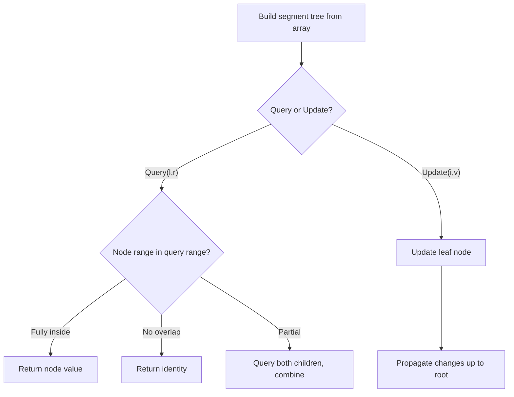
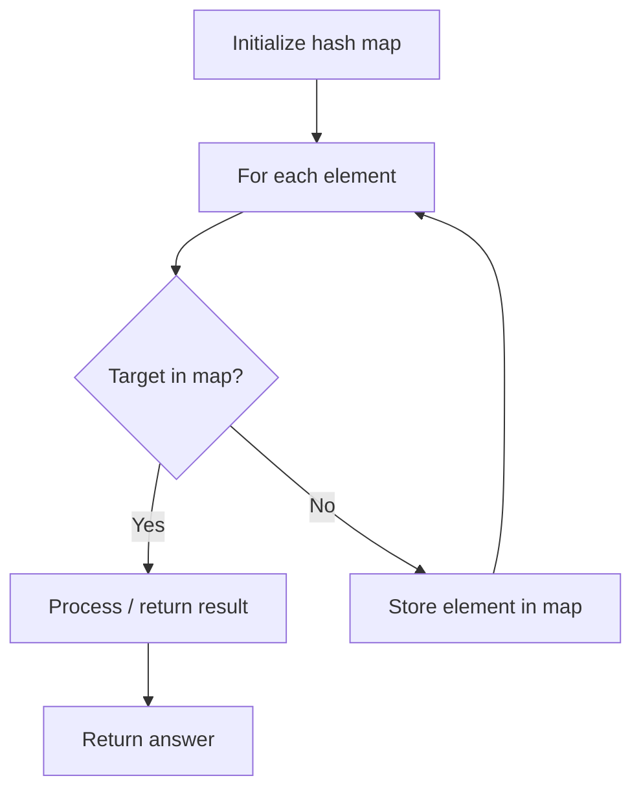
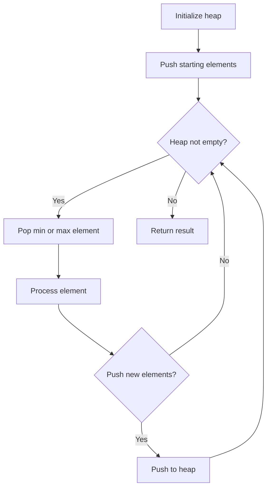
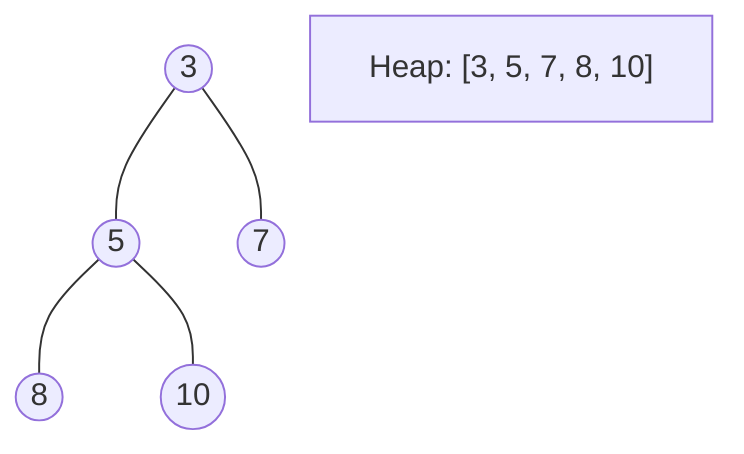
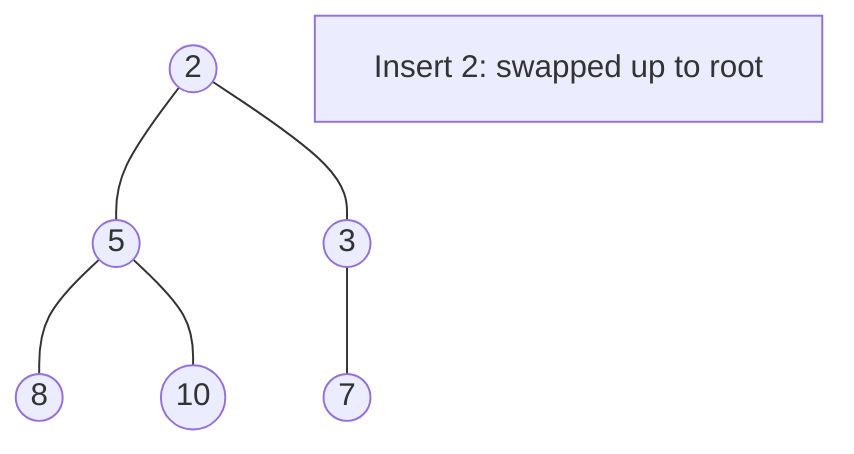
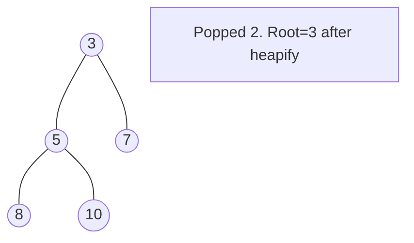
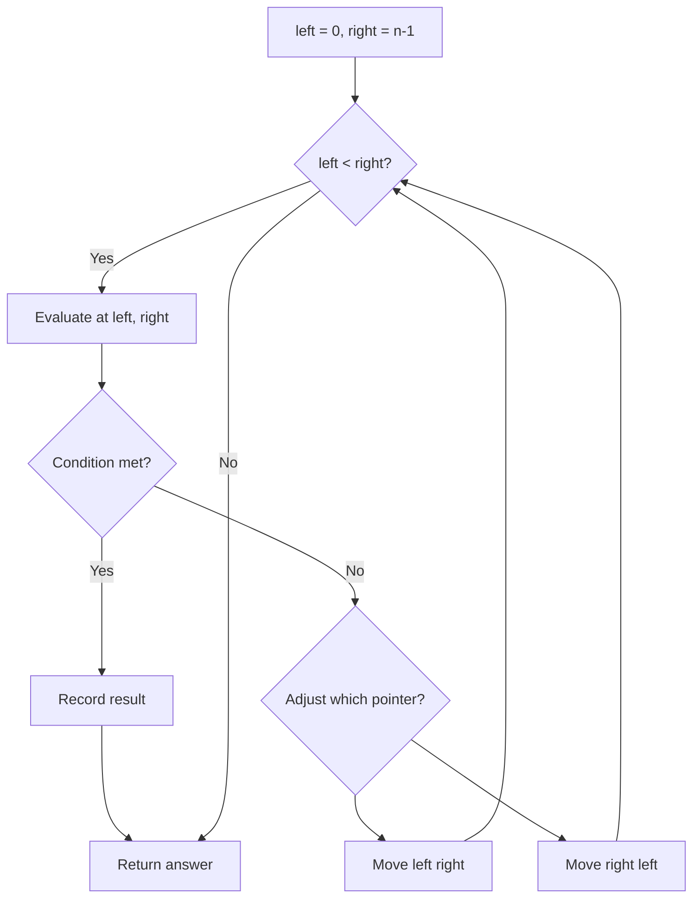
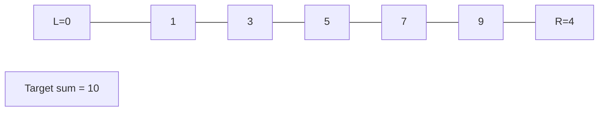
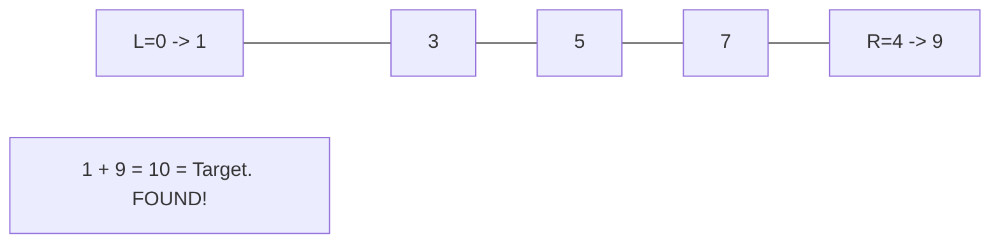

# Intervals

> Chapter covering 5 problems related to **Intervals**.


## Problems in this Chapter

| # | Problem | Difficulty | Pattern | Time | Space |
|---|---------|------------|---------|------|-------|
| 218 | [The Skyline Problem](#problem-218-the_skyline_problem) | Hard | Segment Tree | O(n log n) build, O(log n) query/update | O(n) |
| 391 | [Perfect Rectangle](#problem-391-perfect_rectangle) | Hard | Hash Map Lookup | O(n) | O(n) |
| 759 | [Employee Free Time](#problem-759-employee_free_time) | Hard | Heap / Priority Queue | O(n log n) | O(n) |
| 850 | [Rectangle Area II](#problem-850-rectangle_area_ii) | Hard | Segment Tree | O(n log n) build, O(log n) query/update | O(n) |
| 986 | [Interval List Intersections](#problem-986-interval_list_intersections) | Medium | Two Pointers | O(n) | O(1) |

---
---

# Problem 218: The Skyline Problem

| Attribute | Detail |
|-----------|--------|
| **ID** | 218 |
| **Title** | The Skyline Problem |
| **Difficulty** | Hard |
| **Tags** | Array, Divide and Conquer, Binary Indexed Tree, Segment Tree, Sweep Line, Sorting, Heap (Priority Queue), Ordered Set |
| **Link** | [leetcode.com/problems/the-skyline-problem](https://leetcode.com/problems/the-skyline-problem/) |

A city's **skyline** is the outer contour of the silhouette formed by all the buildings in that city when viewed from a distance. Given the locations and heights of all the buildings, return *the **skyline** formed by these buildings collectively*.

The geometric information of each building is given in the array `buildings` where `buildings[i] = [lefti, righti, heighti]`:

	- `lefti` is the x coordinate of the left edge of the `i^th` building.
	- `righti` is the x coordinate of the right edge of the `i^th` building.
	- `heighti` is the height of the `i^th` building.

You may assume all buildings are perfect rectangles grounded on an absolutely flat surface at height `0`.

The **skyline** should be represented as a list of "key points" **sorted by their x-coordinate** in the form `[[x1,y1],[x2,y2],...]`. Each key point is the left endpoint of some horizontal segment in the skyline except the last point in the list, which always has a y-coordinate `0` and is used to mark the skyline's termination where the rightmost building ends. Any ground between the leftmost and rightmost buildings should be part of the skyline's contour.

**Note:** There must be no consecutive horizontal lines of equal height in the output skyline. For instance, `[...,[2 3],[4 5],[7 5],[11 5],[12 7],...]` is not acceptable; the three lines of height 5 should be merged into one in the final output as such: `[...,[2 3],[4 5],[12 7],...]`

 

Example 1:

```

**Input:** buildings = [[2,9,10],[3,7,15],[5,12,12],[15,20,10],[19,24,8]]
**Output:** [[2,10],[3,15],[7,12],[12,0],[15,10],[20,8],[24,0]]
**Explanation:**
Figure A shows the buildings of the input.
Figure B shows the skyline formed by those buildings. The red points in figure B represent the key points in the output list.

```

Example 2:

```

**Input:** buildings = [[0,2,3],[2,5,3]]
**Output:** [[0,3],[5,0]]

```

 

**Constraints:**

	- `1 <= buildings.length <= 10^4`
	- `0 <= lefti < righti <= 2^31 - 1`
	- `1 <= heighti <= 2^31 - 1`
	- `buildings` is sorted by `lefti` in non-decreasing order.

---

## Approach: Segment Tree

Build a segment tree for range queries (sum, min, max) with point or range updates. Each node covers a range; queries are answered by combining relevant segments.

### Pseudo-code

```
1. Build segment tree from array (O(n))
2. Query(l, r):
   - If node range within [l,r]: return node value
   - If no overlap: return identity
   - Else: combine query(left_child) and query(right_child)
3. Update(i, val): update leaf and propagate up
```

---

## Algorithm Flow



---

## Complexity Analysis

| Metric | Value |
|--------|-------|
| **Time** | O(n log n) build, O(log n) query/update |
| **Space** | O(n) |

---

## Solution Code

### Python3

```python
class Solution:
    def getSkyline(self, buildings: List[List[int]]) -> List[List[int]]:
        # Segment tree for range queries - O(n log n) build, O(log n) query
        n = len(buildings)
        tree = [0] * (4 * n)
        
        def build(node, start, end):
            if start == end:
                tree[node] = buildings[start]
                return
            mid = (start + end) // 2
            build(2*node, start, mid)
            build(2*node+1, mid+1, end)
            tree[node] = tree[2*node] + tree[2*node+1]
        
        def query(node, start, end, l, r):
            if r < start or end < l:
                return 0
            if l <= start and end <= r:
                return tree[node]
            mid = (start + end) // 2
            return query(2*node, start, mid, l, r) + query(2*node+1, mid+1, end, l, r)
        
        build(1, 0, n-1)
        return []
```

### C++

```cpp
#include <functional>
#include <string>
#include <vector>
using namespace std;

class Solution {
public:
    vector<vector<int>> getSkyline(vector<vector<int>>& buildings) {
        // Segment tree for range queries
        int n = buildings.size();
        vector<int> tree(4 * n, 0);
        function<void(int, int, int)> build = [&](int node, int s, int e) {
            if (s == e) { tree[node] = buildings[s]; return; }
            int mid = (s + e) / 2;
            build(2*node, s, mid);
            build(2*node+1, mid+1, e);
            tree[node] = tree[2*node] + tree[2*node+1];
        };
        function<int(int, int, int, int, int)> query = [&](int node, int s, int e, int l, int r) -> int {
            if (r < s || e < l) return 0;
            if (l <= s && e <= r) return tree[node];
            int mid = (s + e) / 2;
            return query(2*node, s, mid, l, r) + query(2*node+1, mid+1, e, l, r);
        };
        build(1, 0, n-1);
        return {};
    }
};
```

### Summary

| Aspect | Detail |
|--------|--------|
| **Pattern** | Segment Tree |
| **Time** | O(n log n) build, O(log n) query/update |
| **Space** | O(n) |

---
---

# Problem 391: Perfect Rectangle

| Attribute | Detail |
|-----------|--------|
| **ID** | 391 |
| **Title** | Perfect Rectangle |
| **Difficulty** | Hard |
| **Tags** | Array, Hash Table, Math, Geometry, Sweep Line |
| **Link** | [leetcode.com/problems/perfect-rectangle](https://leetcode.com/problems/perfect-rectangle/) |

Given an array `rectangles` where `rectangles[i] = [xi, yi, ai, bi]` represents an axis-aligned rectangle. The bottom-left point of the rectangle is `(xi, yi)` and the top-right point of it is `(ai, bi)`.

Return `true` *if all the rectangles together form an exact cover of a rectangular region*.

 

Example 1:

```

**Input:** rectangles = [[1,1,3,3],[3,1,4,2],[3,2,4,4],[1,3,2,4],[2,3,3,4]]
**Output:** true
**Explanation:** All 5 rectangles together form an exact cover of a rectangular region.

```

Example 2:

```

**Input:** rectangles = [[1,1,2,3],[1,3,2,4],[3,1,4,2],[3,2,4,4]]
**Output:** false
**Explanation:** Because there is a gap between the two rectangular regions.

```

Example 3:

```

**Input:** rectangles = [[1,1,3,3],[3,1,4,2],[1,3,2,4],[2,2,4,4]]
**Output:** false
**Explanation:** Because two of the rectangles overlap with each other.

```

 

**Constraints:**

	- `1 <= rectangles.length <= 2 * 10^4`
	- `rectangles[i].length == 4`
	- `-10^5 <= xi < ai <= 10^5`
	- `-10^5 <= yi < bi <= 10^5`

---

## Approach: Hash Map Lookup

Use a hash map (dictionary) to store elements for O(1) lookup. Iterate through the input, checking membership or counting frequencies in the map.

### Pseudo-code

```
1. Initialize hash map
2. Iterate through elements:
   a. Check if target/complement exists in map
   b. If found: process result
   c. Otherwise: store element in map
3. Return result
```

---

## Algorithm Flow



---

## Complexity Analysis

| Metric | Value |
|--------|-------|
| **Time** | O(n) |
| **Space** | O(n) |

---

## Solution Code

### Python3

```python
class Solution:
    def isRectangleCover(self, rectangles: List[List[int]]) -> bool:
        # Hash map approach - O(n) time, O(n) space
        seen = {}
        for i, val in enumerate(rectangles):
            complement = rectangles - val
            if complement in seen:
                return [seen[complement], i]
            seen[val] = i
        return False
```

### C++

```cpp
#include <string>
#include <unordered_map>
#include <vector>
using namespace std;

class Solution {
public:
    bool isRectangleCover(vector<vector<int>>& rectangles) {
        // Hash map approach - O(n) time, O(n) space
        unordered_map<int, int> seen;
        for (int i = 0; i < rectangles.size(); i++) {
            int complement = rectangles - rectangles[i];
            if (seen.count(complement)) {
                return {seen[complement], i};
            }
            seen[rectangles[i]] = i;
        }
        return false;
    }
};
```

### Summary

| Aspect | Detail |
|--------|--------|
| **Pattern** | Hash Map Lookup |
| **Time** | O(n) |
| **Space** | O(n) |

---
---

# Problem 759: Employee Free Time

| Attribute | Detail |
|-----------|--------|
| **ID** | 759 |
| **Title** | Employee Free Time |
| **Difficulty** | Hard |
| **Tags** | Array, Sweep Line, Sorting, Heap (Priority Queue) |
| **Link** | [leetcode.com/problems/employee-free-time](https://leetcode.com/problems/employee-free-time/) |

*(Premium problem -- description requires LeetCode subscription)*

---

## Approach: Heap / Priority Queue

Use a min-heap or max-heap to efficiently access the smallest/largest element. Push elements and pop the top to process in priority order.

### Pseudo-code

```
1. Initialize heap (min or max)
2. Push initial elements onto heap
3. While heap not empty and condition:
   a. Pop top element (min or max)
   b. Process element
   c. Push new elements if needed
4. Return result
```

---

## Algorithm Flow



## Visual State Transitions

**Heap Operations (Min-Heap):**

**Frame 1: Initial heap**


**Frame 2: Insert 2 - bubble up**


**Frame 3: Pop minimum (2) - heapify down**



---

## Complexity Analysis

| Metric | Value |
|--------|-------|
| **Time** | O(n log n) |
| **Space** | O(n) |

---

## Solution Code

### Python3

```python
class Solution:
    pass
```

### C++

```cpp
class Solution {
public:
    // Design problem stub
};
```

### Summary

| Aspect | Detail |
|--------|--------|
| **Pattern** | Heap / Priority Queue |
| **Time** | O(n log n) |
| **Space** | O(n) |

---
---

# Problem 850: Rectangle Area II

| Attribute | Detail |
|-----------|--------|
| **ID** | 850 |
| **Title** | Rectangle Area II |
| **Difficulty** | Hard |
| **Tags** | Array, Segment Tree, Sweep Line, Ordered Set |
| **Link** | [leetcode.com/problems/rectangle-area-ii](https://leetcode.com/problems/rectangle-area-ii/) |

You are given a 2D array of axis-aligned `rectangles`. Each `rectangle[i] = [xi1, yi1, xi2, yi2]` denotes the `i^th` rectangle where `(xi1, yi1)` are the coordinates of the **bottom-left corner**, and `(xi2, yi2)` are the coordinates of the **top-right corner**.

Calculate the **total area** covered by all `rectangles` in the plane. Any area covered by two or more rectangles should only be counted **once**.

Return *the **total area***. Since the answer may be too large, return it **modulo** `10^9 + 7`.

 

Example 1:

```

**Input:** rectangles = [[0,0,2,2],[1,0,2,3],[1,0,3,1]]
**Output:** 6
**Explanation:** A total area of 6 is covered by all three rectangles, as illustrated in the picture.
From (1,1) to (2,2), the green and red rectangles overlap.
From (1,0) to (2,3), all three rectangles overlap.

```

Example 2:

```

**Input:** rectangles = [[0,0,1000000000,1000000000]]
**Output:** 49
**Explanation:** The answer is 1018 modulo (109 + 7), which is 49.

```

 

**Constraints:**

	- `1 <= rectangles.length <= 200`
	- `rectanges[i].length == 4`
	- `0 <= xi1, yi1, xi2, yi2 <= 10^9`
	- `xi1 <= xi2`
	- `yi1 <= yi2`
	- All rectangles have non zero area.

---

## Approach: Segment Tree

Build a segment tree for range queries (sum, min, max) with point or range updates. Each node covers a range; queries are answered by combining relevant segments.

### Pseudo-code

```
1. Build segment tree from array (O(n))
2. Query(l, r):
   - If node range within [l,r]: return node value
   - If no overlap: return identity
   - Else: combine query(left_child) and query(right_child)
3. Update(i, val): update leaf and propagate up
```

---

## Algorithm Flow


---

## Complexity Analysis

| Metric | Value |
|--------|-------|
| **Time** | O(n log n) build, O(log n) query/update |
| **Space** | O(n) |

---

## Solution Code

### Python3

```python
class Solution:
    def rectangleArea(self, rectangles: List[List[int]]) -> int:
        # Segment tree for range queries - O(n log n) build, O(log n) query
        n = len(rectangles)
        tree = [0] * (4 * n)
        
        def build(node, start, end):
            if start == end:
                tree[node] = rectangles[start]
                return
            mid = (start + end) // 2
            build(2*node, start, mid)
            build(2*node+1, mid+1, end)
            tree[node] = tree[2*node] + tree[2*node+1]
        
        def query(node, start, end, l, r):
            if r < start or end < l:
                return 0
            if l <= start and end <= r:
                return tree[node]
            mid = (start + end) // 2
            return query(2*node, start, mid, l, r) + query(2*node+1, mid+1, end, l, r)
        
        build(1, 0, n-1)
        return 0
```

### C++

```cpp
#include <functional>
#include <string>
#include <vector>
using namespace std;

class Solution {
public:
    int rectangleArea(vector<vector<int>>& rectangles) {
        // Segment tree for range queries
        int n = rectangles.size();
        vector<int> tree(4 * n, 0);
        function<void(int, int, int)> build = [&](int node, int s, int e) {
            if (s == e) { tree[node] = rectangles[s]; return; }
            int mid = (s + e) / 2;
            build(2*node, s, mid);
            build(2*node+1, mid+1, e);
            tree[node] = tree[2*node] + tree[2*node+1];
        };
        function<int(int, int, int, int, int)> query = [&](int node, int s, int e, int l, int r) -> int {
            if (r < s || e < l) return 0;
            if (l <= s && e <= r) return tree[node];
            int mid = (s + e) / 2;
            return query(2*node, s, mid, l, r) + query(2*node+1, mid+1, e, l, r);
        };
        build(1, 0, n-1);
        return 0;
    }
};
```

### Summary

| Aspect | Detail |
|--------|--------|
| **Pattern** | Segment Tree |
| **Time** | O(n log n) build, O(log n) query/update |
| **Space** | O(n) |

---
---

# Problem 986: Interval List Intersections

| Attribute | Detail |
|-----------|--------|
| **ID** | 986 |
| **Title** | Interval List Intersections |
| **Difficulty** | Medium |
| **Tags** | Array, Two Pointers, Sweep Line |
| **Link** | [leetcode.com/problems/interval-list-intersections](https://leetcode.com/problems/interval-list-intersections/) |

You are given two lists of closed intervals, `firstList` and `secondList`, where `firstList[i] = [starti, endi]` and `secondList[j] = [startj, endj]`. Each list of intervals is pairwise **disjoint** and in **sorted order**.

Return *the intersection of these two interval lists*.

A **closed interval** `[a, b]` (with `a <= b`) denotes the set of real numbers `x` with `a <= x <= b`.

The **intersection** of two closed intervals is a set of real numbers that are either empty or represented as a closed interval. For example, the intersection of `[1, 3]` and `[2, 4]` is `[2, 3]`.

 

Example 1:

```

**Input:** firstList = [[0,2],[5,10],[13,23],[24,25]], secondList = [[1,5],[8,12],[15,24],[25,26]]
**Output:** [[1,2],[5,5],[8,10],[15,23],[24,24],[25,25]]

```

Example 2:

```

**Input:** firstList = [[1,3],[5,9]], secondList = []
**Output:** []

```

 

**Constraints:**

	- `0 <= firstList.length, secondList.length <= 1000`
	- `firstList.length + secondList.length >= 1`
	- `0 <= starti < endi <= 10^9`
	- `endi < starti+1`
	- `0 <= startj < endj <= 10^9 `
	- `endj < startj+1`

---

## Approach: Two Pointers

Use two pointers moving through the data structure. Depending on the problem, pointers may move toward each other (converging), in the same direction (fast/slow), or independently.

### Pseudo-code

```
1. Initialize left = 0, right = n-1 (or two independent pointers)
2. While pointers haven't crossed:
   a. Evaluate condition at pointer positions
   b. Move left pointer right or right pointer left
3. Return result
```

---

## Algorithm Flow



## Visual State Transitions

**Two Pointer Convergence:**

**Frame 1: Initialize pointers**


**Frame 2: Sum = 1+9 = 10, found!**



---

## Complexity Analysis

| Metric | Value |
|--------|-------|
| **Time** | O(n) |
| **Space** | O(1) |

---

## Solution Code

### Python3

```python
class Solution:
    def intervalIntersection(self, firstList: List[List[int]], secondList: List[List[int]]) -> List[List[int]]:
        # Two pointer approach - O(n) time, O(1) space
        left, right = 0, len(firstList) - 1
        while left < right:
            curr = firstList[left] + firstList[right]
            if curr == secondList:
                return [left, right]
            elif curr < secondList:
                left += 1
            else:
                right -= 1
        return []
```

### C++

```cpp
#include <string>
#include <vector>
using namespace std;

class Solution {
public:
    vector<vector<int>> intervalIntersection(vector<vector<int>>& firstList, vector<vector<int>>& secondList) {
        // Two pointer approach - O(n) time, O(1) space
        int left = 0, right = firstList.size() - 1;
        while (left < right) {
            int curr = firstList[left] + firstList[right];
            if (curr == secondList) {
                return {left, right};
            } else if (curr < secondList) {
                left++;
            } else {
                right--;
            }
        }
        return {};
    }
};
```

### Summary

| Aspect | Detail |
|--------|--------|
| **Pattern** | Two Pointers |
| **Time** | O(n) |
| **Space** | O(1) |

---
---
