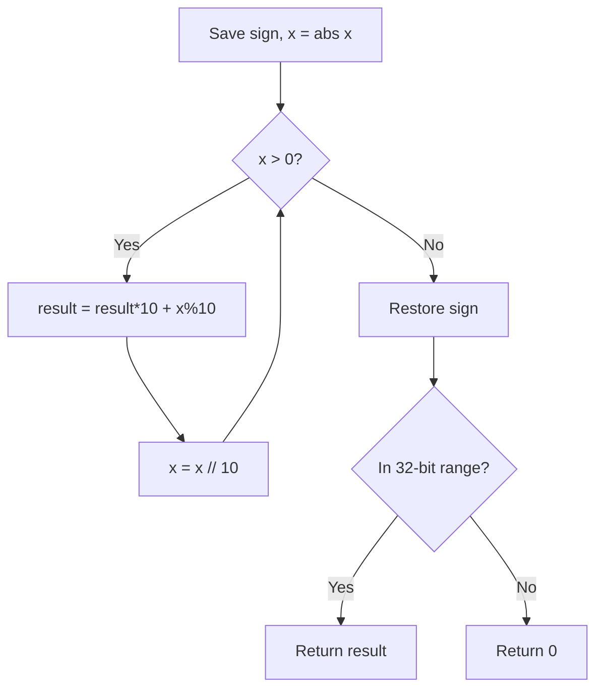
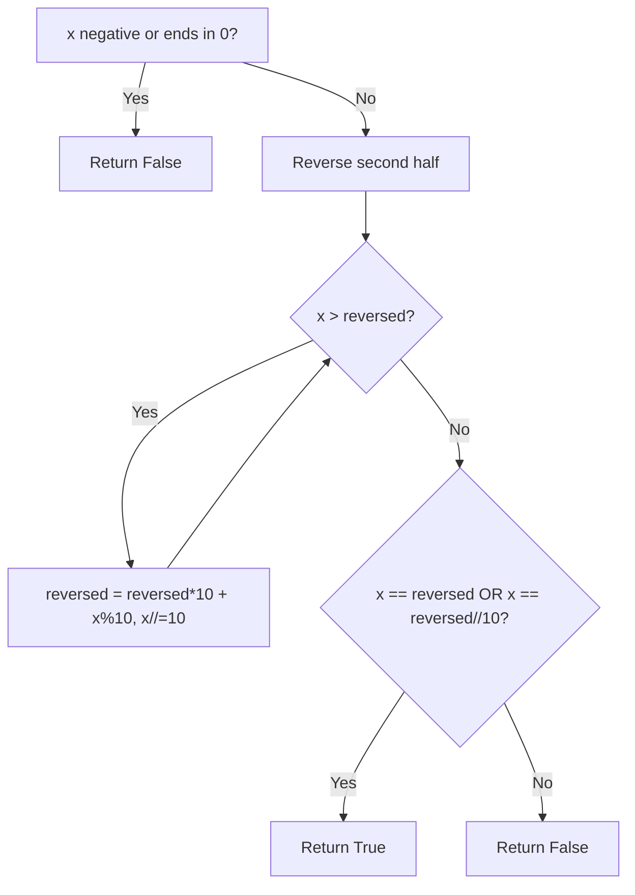
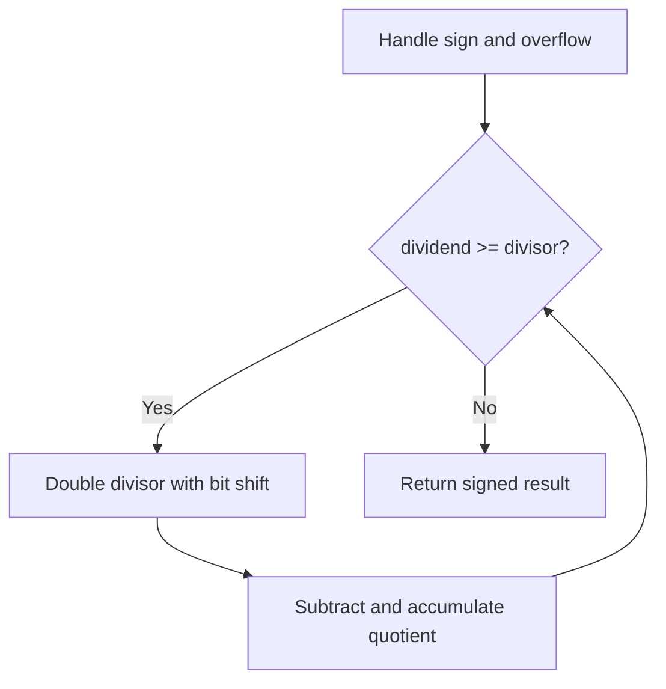
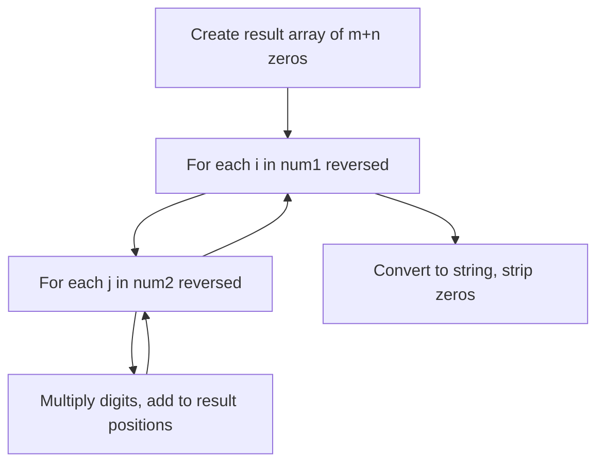
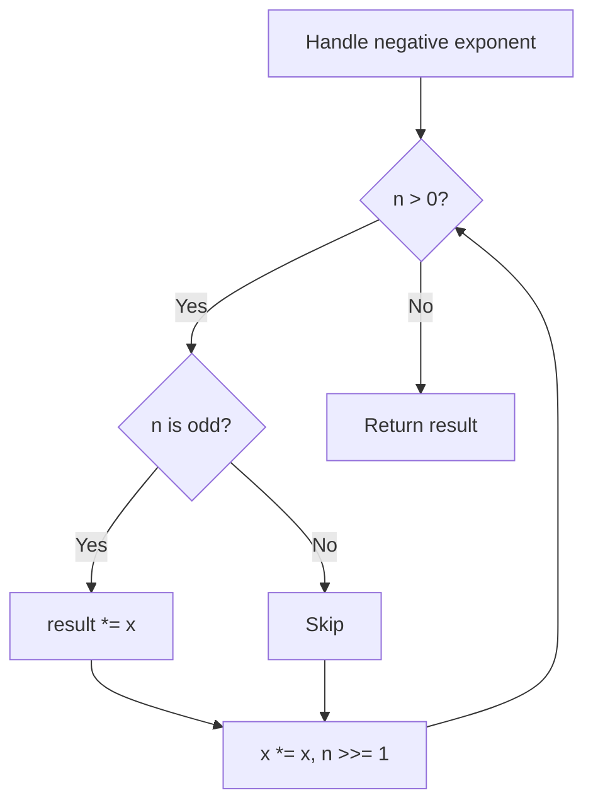
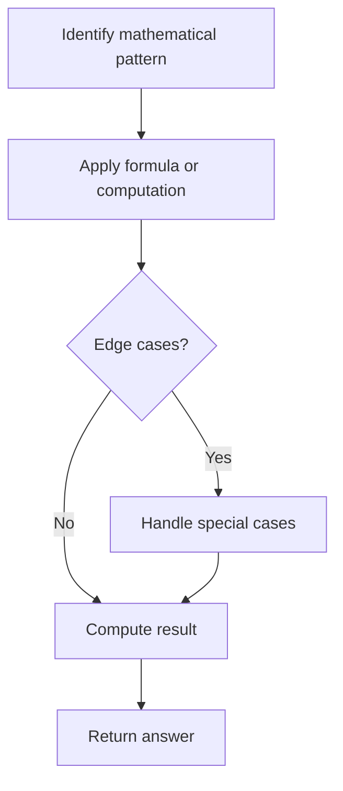
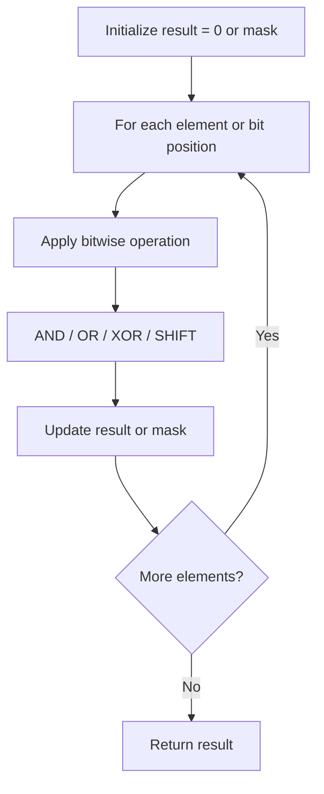
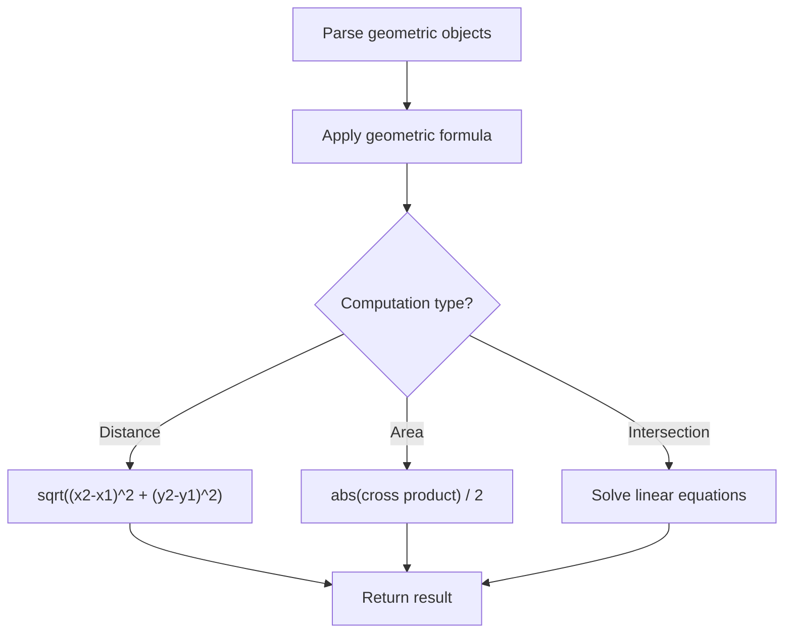
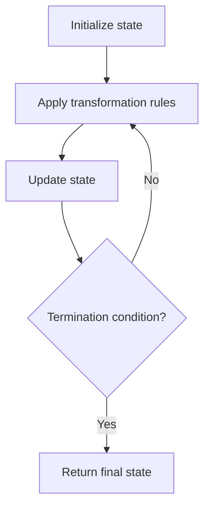

# Math and Bit Manipulation

> Chapter covering 124 problems related to **Math and Bit Manipulation**.


## Problems in this Chapter

| # | Problem | Difficulty | Pattern | Time | Space |
|---|---------|------------|---------|------|-------|
| 7 | [Reverse Integer](#problem-7-reverse_integer) | Medium | Math | O(log x) | O(1) |
| 9 | [Palindrome Number](#problem-9-palindrome_number) | Easy | Math | O(log n) | O(1) |
| 29 | [Divide Two Integers](#problem-29-divide_two_integers) | Medium | Bit Manipulation / Math | O(log^2 n) | O(1) |
| 43 | [Multiply Strings](#problem-43-multiply_strings) | Medium | Math / String | O(m*n) | O(m+n) |
| 50 | [Pow(x, n)](#problem-50-powx_n) | Medium | Math / Binary Exponentiation | O(log n) | O(1) |
| 60 | [Permutation Sequence](#problem-60-permutation_sequence) | Hard | Math | O(n^2) | O(n) |
| 67 | [Add Binary](#problem-67-add_binary) | Easy | Math / String | O(max(m,n)) | O(max(m,n)) |
| 168 | [Excel Sheet Column Title](#problem-168-excel_sheet_column_title) | Easy | Math | O(n) or O(sqrt(n)) | O(1) |
| 171 | [Excel Sheet Column Number](#problem-171-excel_sheet_column_number) | Easy | Math | O(n) or O(sqrt(n)) | O(1) |
| 172 | [Factorial Trailing Zeroes](#problem-172-factorial_trailing_zeroes) | Medium | Math | O(n) or O(sqrt(n)) | O(1) |
| 190 | [Reverse Bits](#problem-190-reverse_bits) | Easy | Bit Manipulation | O(n) or O(log n) | O(1) |
| 191 | [Number of 1 Bits](#problem-191-number_of_1_bits) | Easy | Bit Manipulation | O(n) or O(log n) | O(1) |
| 201 | [Bitwise AND of Numbers Range](#problem-201-bitwise_and_of_numbers_range) | Medium | Bit Manipulation | O(n) or O(log n) | O(1) |
| 223 | [Rectangle Area](#problem-223-rectangle_area) | Medium | Geometry | O(n^2) or O(n log n) | O(n) |
| 231 | [Power of Two](#problem-231-power_of_two) | Easy | Bit Manipulation | O(n) or O(log n) | O(1) |
| 258 | [Add Digits](#problem-258-add_digits) | Easy | Simulation | O(n) or O(n * k) | O(n) |
| 263 | [Ugly Number](#problem-263-ugly_number) | Easy | Math | O(n) or O(sqrt(n)) | O(1) |
| 273 | [Integer to English Words](#problem-273-integer_to_english_words) | Hard | Math | O(n) or O(sqrt(n)) | O(1) |
| 292 | [Nim Game](#problem-292-nim_game) | Easy | Math | O(n) or O(sqrt(n)) | O(1) |
| 319 | [Bulb Switcher](#problem-319-bulb_switcher) | Medium | Math | O(n) or O(sqrt(n)) | O(1) |
| 326 | [Power of Three](#problem-326-power_of_three) | Easy | Math | O(n) or O(sqrt(n)) | O(1) |
| 342 | [Power of Four](#problem-342-power_of_four) | Easy | Bit Manipulation | O(n) or O(log n) | O(1) |
| 371 | [Sum of Two Integers](#problem-371-sum_of_two_integers) | Medium | Bit Manipulation | O(n) or O(log n) | O(1) |
| 372 | [Super Pow](#problem-372-super_pow) | Medium | Divide and Conquer | O(n log n) | O(n) |
| 390 | [Elimination Game](#problem-390-elimination_game) | Medium | Math | O(n) or O(sqrt(n)) | O(1) |
| 405 | [Convert a Number to Hexadecimal](#problem-405-convert_a_number_to_hexadecimal) | Easy | Bit Manipulation | O(n) or O(log n) | O(1) |
| 412 | [Fizz Buzz](#problem-412-fizz_buzz) | Easy | Simulation | O(n) or O(n * k) | O(n) |
| 415 | [Add Strings](#problem-415-add_strings) | Easy | Simulation | O(n) or O(n * k) | O(n) |
| 461 | [Hamming Distance](#problem-461-hamming_distance) | Easy | Bit Manipulation | O(n) or O(log n) | O(1) |
| 470 | [Implement Rand10() Using Rand7()](#problem-470-implement_rand10_using_rand7) | Medium | Randomized Algorithm | O(n) or varies | O(n) |
| 476 | [Number Complement](#problem-476-number_complement) | Easy | Bit Manipulation | O(n) or O(log n) | O(1) |
| 478 | [Generate Random Point in a Circle](#problem-478-generate_random_point_in_a_circle) | Medium | Randomized Algorithm | O(n) or varies | O(n) |
| 479 | [Largest Palindrome Product](#problem-479-largest_palindrome_product) | Hard | Math | O(n) or O(sqrt(n)) | O(1) |
| 492 | [Construct the Rectangle](#problem-492-construct_the_rectangle) | Easy | Math | O(n) or O(sqrt(n)) | O(1) |
| 504 | [Base 7](#problem-504-base_7) | Easy | Math | O(n) or O(sqrt(n)) | O(1) |
| 507 | [Perfect Number](#problem-507-perfect_number) | Easy | Math | O(n) or O(sqrt(n)) | O(1) |
| 537 | [Complex Number Multiplication](#problem-537-complex_number_multiplication) | Medium | Simulation | O(n) or O(n * k) | O(n) |
| 564 | [Find the Closest Palindrome](#problem-564-find_the_closest_palindrome) | Hard | Math | O(n) or O(sqrt(n)) | O(1) |
| 592 | [Fraction Addition and Subtraction](#problem-592-fraction_addition_and_subtraction) | Medium | Simulation | O(n) or O(n * k) | O(n) |
| 593 | [Valid Square](#problem-593-valid_square) | Medium | Geometry | O(n^2) or O(n log n) | O(n) |
| 640 | [Solve the Equation](#problem-640-solve_the_equation) | Medium | Simulation | O(n) or O(n * k) | O(n) |
| 660 | [Remove 9](#problem-660-remove_9) | Hard | Math | O(n) or O(sqrt(n)) | O(1) |
| 693 | [Binary Number with Alternating Bits](#problem-693-binary_number_with_alternating_bits) | Easy | Bit Manipulation | O(n) or O(log n) | O(1) |
| 728 | [Self Dividing Numbers](#problem-728-self_dividing_numbers) | Easy | Math | O(n) or O(sqrt(n)) | O(1) |
| 751 | [IP to CIDR](#problem-751-ip_to_cidr) | Medium | Bit Manipulation | O(n) or O(log n) | O(1) |
| 762 | [Prime Number of Set Bits in Binary Representation](#problem-762-prime_number_of_set_bits_in_binary_representation) | Easy | Bit Manipulation | O(n) or O(log n) | O(1) |
| 779 | [K-th Symbol in Grammar](#problem-779-k_th_symbol_in_grammar) | Medium | Bit Manipulation | O(n) or O(log n) | O(1) |
| 780 | [Reaching Points](#problem-780-reaching_points) | Hard | Math | O(n) or O(sqrt(n)) | O(1) |
| 800 | [Similar RGB Color](#problem-800-similar_rgb_color) | Easy | Math | O(n) or O(sqrt(n)) | O(1) |
| 829 | [Consecutive Numbers Sum](#problem-829-consecutive_numbers_sum) | Hard | Math | O(n) or O(sqrt(n)) | O(1) |
| 836 | [Rectangle Overlap](#problem-836-rectangle_overlap) | Easy | Geometry | O(n^2) or O(n log n) | O(n) |
| 858 | [Mirror Reflection](#problem-858-mirror_reflection) | Medium | Geometry | O(n^2) or O(n log n) | O(n) |
| 866 | [Prime Palindrome](#problem-866-prime_palindrome) | Medium | Number Theory | O(sqrt(n)) or O(n log log n) | O(n) |
| 868 | [Binary Gap](#problem-868-binary_gap) | Easy | Bit Manipulation | O(n) or O(log n) | O(1) |
| 906 | [Super Palindromes](#problem-906-super_palindromes) | Hard | Math | O(n) or O(sqrt(n)) | O(1) |
| 972 | [Equal Rational Numbers](#problem-972-equal_rational_numbers) | Hard | Math | O(n) or O(sqrt(n)) | O(1) |
| 1009 | [Complement of Base 10 Integer](#problem-1009-complement_of_base_10_integer) | Easy | Bit Manipulation | O(n) or O(log n) | O(1) |
| 1017 | [Convert to Base -2](#problem-1017-convert_to_base_2) | Medium | Math | O(n) or O(sqrt(n)) | O(1) |
| 1033 | [Moving Stones Until Consecutive](#problem-1033-moving_stones_until_consecutive) | Medium | Math | O(n) or O(sqrt(n)) | O(1) |
| 1041 | [Robot Bounded In Circle](#problem-1041-robot_bounded_in_circle) | Medium | Simulation | O(n) or O(n * k) | O(n) |
| 1056 | [Confusing Number](#problem-1056-confusing_number) | Easy | Math | O(n) or O(sqrt(n)) | O(1) |
| 1071 | [Greatest Common Divisor of Strings](#problem-1071-greatest_common_divisor_of_strings) | Easy | Math / String | O(n+m) | O(n+m) |
| 1103 | [Distribute Candies to People](#problem-1103-distribute_candies_to_people) | Easy | Simulation | O(n) or O(n * k) | O(n) |
| 1118 | [Number of Days in a Month](#problem-1118-number_of_days_in_a_month) | Easy | Math | O(n) or O(sqrt(n)) | O(1) |
| 1134 | [Armstrong Number](#problem-1134-armstrong_number) | Easy | Math | O(n) or O(sqrt(n)) | O(1) |
| 1154 | [Day of the Year](#problem-1154-day_of_the_year) | Easy | Math | O(n) or O(sqrt(n)) | O(1) |
| 1175 | [Prime Arrangements](#problem-1175-prime_arrangements) | Easy | Math | O(n) or O(sqrt(n)) | O(1) |
| 1180 | [Count Substrings with Only One Distinct Letter](#problem-1180-count_substrings_with_only_one_distinct_letter) | Easy | Math | O(n) or O(sqrt(n)) | O(1) |
| 1185 | [Day of the Week](#problem-1185-day_of_the_week) | Easy | Math | O(n) or O(sqrt(n)) | O(1) |
| 1256 | [Encode Number](#problem-1256-encode_number) | Medium | Bit Manipulation | O(n) or O(log n) | O(1) |
| 1271 | [Hexspeak](#problem-1271-hexspeak) | Easy | Math | O(n) or O(sqrt(n)) | O(1) |
| 1276 | [Number of Burgers with No Waste of Ingredients](#problem-1276-number_of_burgers_with_no_waste_of_ingredients) | Medium | Math | O(n) or O(sqrt(n)) | O(1) |
| 1281 | [Subtract the Product and Sum of Digits of an Integer](#problem-1281-subtract_the_product_and_sum_of_digits_of_an_integer) | Easy | Math | O(n) or O(sqrt(n)) | O(1) |
| 1317 | [Convert Integer to the Sum of Two No-Zero Integers](#problem-1317-convert_integer_to_the_sum_of_two_no_zero_integers) | Easy | Math | O(n) or O(sqrt(n)) | O(1) |
| 1318 | [Minimum Flips to Make a OR b Equal to c](#problem-1318-minimum_flips_to_make_a_or_b_equal_to_c) | Medium | Bit Manipulation | O(n) or O(log n) | O(1) |
| 1342 | [Number of Steps to Reduce a Number to Zero](#problem-1342-number_of_steps_to_reduce_a_number_to_zero) | Easy | Bit Manipulation | O(n) or O(log n) | O(1) |
| 1344 | [Angle Between Hands of a Clock](#problem-1344-angle_between_hands_of_a_clock) | Medium | Math | O(n) or O(sqrt(n)) | O(1) |
| 1360 | [Number of Days Between Two Dates](#problem-1360-number_of_days_between_two_dates) | Easy | Math | O(n) or O(sqrt(n)) | O(1) |
| 1362 | [Closest Divisors](#problem-1362-closest_divisors) | Medium | Math | O(n) or O(sqrt(n)) | O(1) |
| 1401 | [Circle and Rectangle Overlapping](#problem-1401-circle_and_rectangle_overlapping) | Medium | Geometry | O(n^2) or O(n log n) | O(n) |
| 1404 | [Number of Steps to Reduce a Number in Binary Representation to One](#problem-1404-number_of_steps_to_reduce_a_number_in_binary_representation_to_one) | Medium | Bit Manipulation | O(n) or O(log n) | O(1) |
| 1419 | [Minimum Number of Frogs Croaking](#problem-1419-minimum_number_of_frogs_croaking) | Medium | String Processing | O(n) | O(n) |
| 1447 | [Simplified Fractions](#problem-1447-simplified_fractions) | Medium | Number Theory | O(sqrt(n)) or O(n log log n) | O(n) |
| 1486 | [XOR Operation in an Array](#problem-1486-xor_operation_in_an_array) | Easy | Bit Manipulation | O(n) or O(log n) | O(1) |
| 1492 | [The kth Factor of n](#problem-1492-the_kth_factor_of_n) | Medium | Number Theory | O(sqrt(n)) or O(n log log n) | O(n) |
| 1513 | [Number of Substrings With Only 1s](#problem-1513-number_of_substrings_with_only_1s) | Medium | Math | O(n) or O(sqrt(n)) | O(1) |
| 1518 | [Water Bottles](#problem-1518-water_bottles) | Easy | Simulation | O(n) or O(n * k) | O(n) |
| 1523 | [Count Odd Numbers in an Interval Range](#problem-1523-count_odd_numbers_in_an_interval_range) | Easy | Math | O(n) or O(sqrt(n)) | O(1) |
| 1551 | [Minimum Operations to Make Array Equal](#problem-1551-minimum_operations_to_make_array_equal) | Medium | Math | O(n) or O(sqrt(n)) | O(1) |
| 1573 | [Number of Ways to Split a String](#problem-1573-number_of_ways_to_split_a_string) | Medium | Math | O(n) or O(sqrt(n)) | O(1) |
| 1680 | [Concatenation of Consecutive Binary Numbers](#problem-1680-concatenation_of_consecutive_binary_numbers) | Medium | Bit Manipulation | O(n) or O(log n) | O(1) |
| 1688 | [Count of Matches in Tournament](#problem-1688-count_of_matches_in_tournament) | Easy | Simulation | O(n) or O(n * k) | O(n) |
| 1704 | [Determine if String Halves Are Alike](#problem-1704-determine_if_string_halves_are_alike) | Easy | String Processing | O(n) | O(n) |
| 1716 | [Calculate Money in Leetcode Bank](#problem-1716-calculate_money_in_leetcode_bank) | Easy | Math | O(n) or O(sqrt(n)) | O(1) |
| 1759 | [Count Number of Homogenous Substrings](#problem-1759-count_number_of_homogenous_substrings) | Medium | Math | O(n) or O(sqrt(n)) | O(1) |
| 1780 | [Check if Number is a Sum of Powers of Three](#problem-1780-check_if_number_is_a_sum_of_powers_of_three) | Medium | Math | O(n) or O(sqrt(n)) | O(1) |
| 1808 | [Maximize Number of Nice Divisors](#problem-1808-maximize_number_of_nice_divisors) | Hard | Number Theory | O(sqrt(n)) or O(n log log n) | O(n) |
| 1812 | [Determine Color of a Chessboard Square](#problem-1812-determine_color_of_a_chessboard_square) | Easy | Math | O(n) or O(sqrt(n)) | O(1) |
| 1830 | [Minimum Number of Operations to Make String Sorted](#problem-1830-minimum_number_of_operations_to_make_string_sorted) | Hard | Combinatorics | O(n) or O(n^2) | O(n) |
| 1837 | [Sum of Digits in Base K](#problem-1837-sum_of_digits_in_base_k) | Easy | Math | O(n) or O(sqrt(n)) | O(1) |
| 1860 | [Incremental Memory Leak](#problem-1860-incremental_memory_leak) | Medium | Simulation | O(n) or O(n * k) | O(n) |
| 1904 | [The Number of Full Rounds You Have Played](#problem-1904-the_number_of_full_rounds_you_have_played) | Medium | Math | O(n) or O(sqrt(n)) | O(1) |
| 1922 | [Count Good Numbers](#problem-1922-count_good_numbers) | Medium | Math | O(n) or O(sqrt(n)) | O(1) |
| 1925 | [Count Square Sum Triples](#problem-1925-count_square_sum_triples) | Easy | Math | O(n) or O(sqrt(n)) | O(1) |
| 1952 | [Three Divisors](#problem-1952-three_divisors) | Easy | Number Theory | O(sqrt(n)) or O(n log log n) | O(n) |
| 1999 | [Smallest Greater Multiple Made of Two Digits](#problem-1999-smallest_greater_multiple_made_of_two_digits) | Medium | Math | O(n) or O(sqrt(n)) | O(1) |
| 2081 | [Sum of k-Mirror Numbers](#problem-2081-sum_of_k_mirror_numbers) | Hard | Math | O(n) or O(sqrt(n)) | O(1) |
| 2117 | [Abbreviating the Product of a Range](#problem-2117-abbreviating_the_product_of_a_range) | Hard | Number Theory | O(sqrt(n)) or O(n log log n) | O(n) |
| 2119 | [A Number After a Double Reversal](#problem-2119-a_number_after_a_double_reversal) | Easy | Math | O(n) or O(sqrt(n)) | O(1) |
| 2162 | [Minimum Cost to Set Cooking Time](#problem-2162-minimum_cost_to_set_cooking_time) | Medium | Math | O(n) or O(sqrt(n)) | O(1) |
| 2169 | [Count Operations to Obtain Zero](#problem-2169-count_operations_to_obtain_zero) | Easy | Simulation | O(n) or O(n * k) | O(n) |
| 2177 | [Find Three Consecutive Integers That Sum to a Given Number](#problem-2177-find_three_consecutive_integers_that_sum_to_a_given_number) | Medium | Simulation | O(n) or O(n * k) | O(n) |
| 2180 | [Count Integers With Even Digit Sum](#problem-2180-count_integers_with_even_digit_sum) | Easy | Simulation | O(n) or O(n * k) | O(n) |
| 2220 | [Minimum Bit Flips to Convert Number](#problem-2220-minimum_bit_flips_to_convert_number) | Easy | Bit Manipulation | O(n) or O(log n) | O(1) |
| 2235 | [Add Two Integers](#problem-2235-add_two_integers) | Easy | Math | O(n) or O(sqrt(n)) | O(1) |
| 2240 | [Number of Ways to Buy Pens and Pencils](#problem-2240-number_of_ways_to_buy_pens_and_pencils) | Medium | Math | O(n) or O(sqrt(n)) | O(1) |
| 2409 | [Count Days Spent Together](#problem-2409-count_days_spent_together) | Easy | Math | O(n) or O(sqrt(n)) | O(1) |
| 2413 | [Smallest Even Multiple](#problem-2413-smallest_even_multiple) | Easy | Number Theory | O(sqrt(n)) or O(n log log n) | O(n) |
| 2417 | [Closest Fair Integer](#problem-2417-closest_fair_integer) | Medium | Math | O(n) or O(sqrt(n)) | O(1) |
| 2427 | [Number of Common Factors](#problem-2427-number_of_common_factors) | Easy | Number Theory | O(sqrt(n)) or O(n log log n) | O(n) |
| 2443 | [Sum of Number and Its Reverse](#problem-2443-sum_of_number_and_its_reverse) | Medium | Math | O(n) or O(sqrt(n)) | O(1) |
| 2450 | [Number of Distinct Binary Strings After Applying Operations](#problem-2450-number_of_distinct_binary_strings_after_applying_operations) | Medium | Math | O(n) or O(sqrt(n)) | O(1) |
| 2469 | [Convert the Temperature](#problem-2469-convert_the_temperature) | Easy | Math | O(n) or O(sqrt(n)) | O(1) |
| 2481 | [Minimum Cuts to Divide a Circle](#problem-2481-minimum_cuts_to_divide_a_circle) | Easy | Geometry | O(n^2) or O(n log n) | O(n) |

---
---

# Problem 7: Reverse Integer

| Attribute | Detail |
|-----------|--------|
| **ID** | 7 |
| **Title** | Reverse Integer |
| **Difficulty** | Medium |
| **Tags** | Math |
| **Link** | [leetcode.com/problems/reverse-integer](https://leetcode.com/problems/reverse-integer/) |

Given a signed 32-bit integer `x`, return `x`* with its digits reversed*. If reversing `x` causes the value to go outside the signed 32-bit integer range `[-2^31, 2^31 - 1]`, then return `0`.

**Assume the environment does not allow you to store 64-bit integers (signed or unsigned).**

 

Example 1:

```

**Input:** x = 123
**Output:** 321

```

Example 2:

```

**Input:** x = -123
**Output:** -321

```

Example 3:

```

**Input:** x = 120
**Output:** 21

```

 

**Constraints:**

	- `-2^31 <= x <= 2^31 - 1`

---

## Approach: Math

Extract digits from the end using modulo, build the reversed number. Check 32-bit overflow before returning.

### Pseudo-code

```
1. Handle sign, work with abs(x)
2. While x > 0: result = result*10 + x%10, x //= 10
3. Restore sign, check [-2^31, 2^31-1]
```

---

## Algorithm Flow



---

## Complexity Analysis

| Metric | Value |
|--------|-------|
| **Time** | O(log x) |
| **Space** | O(1) |

---

## Solution Code

### Python3

```python
class Solution:
    def reverse(self, x: int) -> int:
        sign = -1 if x < 0 else 1
        x = abs(x)
        result = 0
        while x:
            result = result * 10 + x % 10
            x //= 10
        result *= sign
        return result if -2**31 <= result <= 2**31 - 1 else 0
```

### C++

```cpp
#include <string>
#include <vector>
using namespace std;

class Solution {
public:
    int reverse(int x) {
        // Mathematical approach
        long long result = 0;
        int x = x;
        while (x != 0) {
            result = result * 10 + x % 10;
            x /= 10;
        }
        return (int)result;
    }
};
```

### Summary

| Aspect | Detail |
|--------|--------|
| **Pattern** | Math |
| **Time** | O(log x) |
| **Space** | O(1) |

---
---

# Problem 9: Palindrome Number

| Attribute | Detail |
|-----------|--------|
| **ID** | 9 |
| **Title** | Palindrome Number |
| **Difficulty** | Easy |
| **Tags** | Math |
| **Link** | [leetcode.com/problems/palindrome-number](https://leetcode.com/problems/palindrome-number/) |

Given an integer `x`, return `true`* if *`x`* is a ****palindrome****, and *`false`* otherwise*.

 

Example 1:

```

**Input:** x = 121
**Output:** true
**Explanation:** 121 reads as 121 from left to right and from right to left.

```

Example 2:

```

**Input:** x = -121
**Output:** false
**Explanation:** From left to right, it reads -121. From right to left, it becomes 121-. Therefore it is not a palindrome.

```

Example 3:

```

**Input:** x = 10
**Output:** false
**Explanation:** Reads 01 from right to left. Therefore it is not a palindrome.

```

 

**Constraints:**

	- `-2^31 <= x <= 2^31 - 1`

 

**Follow up:** Could you solve it without converting the integer to a string?

---

## Approach: Math

**Key Insight:** Reverse only the second half of the number and compare with the first half. No string conversion needed.

Negatives and multiples of 10 (except 0) are not palindromes.

### Pseudo-code

```
1. If x < 0 or (x%10==0 and x!=0): return False
2. Reverse second half until reversed >= x
3. Return x == reversed or x == reversed//10
```

---

## Algorithm Flow



---

## Complexity Analysis

| Metric | Value |
|--------|-------|
| **Time** | O(log n) |
| **Space** | O(1) |

---

## Solution Code

### Python3

```python
class Solution:
    def isPalindrome(self, x: int) -> bool:
        if x < 0 or (x % 10 == 0 and x != 0):
            return False
        reversed_half = 0
        while x > reversed_half:
            reversed_half = reversed_half * 10 + x % 10
            x //= 10
        return x == reversed_half or x == reversed_half // 10
```

### C++

```cpp
#include <string>
#include <vector>
using namespace std;

class Solution {
public:
    bool isPalindrome(int x) {
        // Mathematical approach
        long long result = 0;
        int x = x;
        while (x != 0) {
            result = result * 10 + x % 10;
            x /= 10;
        }
        return (int)result;
    }
};
```

### Summary

| Aspect | Detail |
|--------|--------|
| **Pattern** | Math |
| **Time** | O(log n) |
| **Space** | O(1) |

---
---

# Problem 29: Divide Two Integers

| Attribute | Detail |
|-----------|--------|
| **ID** | 29 |
| **Title** | Divide Two Integers |
| **Difficulty** | Medium |
| **Tags** | Math, Bit Manipulation |
| **Link** | [leetcode.com/problems/divide-two-integers](https://leetcode.com/problems/divide-two-integers/) |

Given two integers `dividend` and `divisor`, divide two integers **without** using multiplication, division, and mod operator.

The integer division should truncate toward zero, which means losing its fractional part. For example, `8.345` would be truncated to `8`, and `-2.7335` would be truncated to `-2`.

Return *the **quotient** after dividing *`dividend`* by *`divisor`.

**Note: **Assume we are dealing with an environment that could only store integers within the **32-bit** signed integer range: `[−2^31, 2^31 − 1]`. For this problem, if the quotient is **strictly greater than** `2^31 - 1`, then return `2^31 - 1`, and if the quotient is **strictly less than** `-2^31`, then return `-2^31`.

 

Example 1:

```

**Input:** dividend = 10, divisor = 3
**Output:** 3
**Explanation:** 10/3 = 3.33333.. which is truncated to 3.

```

Example 2:

```

**Input:** dividend = 7, divisor = -3
**Output:** -2
**Explanation:** 7/-3 = -2.33333.. which is truncated to -2.

```

 

**Constraints:**

	- `-2^31 <= dividend, divisor <= 2^31 - 1`
	- `divisor != 0`

---

## Approach: Bit Manipulation / Math

Use bit shifting to double the divisor until it exceeds the dividend. Subtract and accumulate the quotient.

### Pseudo-code

```
1. Handle overflow edge case
2. Work with absolute values
3. Repeatedly double divisor, subtract, accumulate
4. Restore sign
```

---

## Algorithm Flow



---

## Complexity Analysis

| Metric | Value |
|--------|-------|
| **Time** | O(log^2 n) |
| **Space** | O(1) |

---

## Solution Code

### Python3

```python
class Solution:
    def divide(self, dividend: int, divisor: int) -> int:
        if dividend == -2**31 and divisor == -1:
            return 2**31 - 1
        sign = -1 if (dividend < 0) ^ (divisor < 0) else 1
        a, b = abs(dividend), abs(divisor)
        result = 0
        while a >= b:
            temp, multiple = b, 1
            while a >= temp << 1:
                temp <<= 1
                multiple <<= 1
            a -= temp
            result += multiple
        return sign * result
```

### C++

```cpp
#include <string>
#include <vector>
using namespace std;

class Solution {
public:
    int divide(int dividend, int divisor) {
        // Bit manipulation - O(n) time, O(1) space
        int result = 0;
        for (int val : dividend) {
            result ^= val;
        }
        return result;
    }
};
```

### Summary

| Aspect | Detail |
|--------|--------|
| **Pattern** | Bit Manipulation / Math |
| **Time** | O(log^2 n) |
| **Space** | O(1) |

---
---

# Problem 43: Multiply Strings

| Attribute | Detail |
|-----------|--------|
| **ID** | 43 |
| **Title** | Multiply Strings |
| **Difficulty** | Medium |
| **Tags** | Math, String, Simulation |
| **Link** | [leetcode.com/problems/multiply-strings](https://leetcode.com/problems/multiply-strings/) |

Given two non-negative integers `num1` and `num2` represented as strings, return the product of `num1` and `num2`, also represented as a string.

**Note:** You must not use any built-in BigInteger library or convert the inputs to integer directly.

 

Example 1:

```
**Input:** num1 = "2", num2 = "3"
**Output:** "6"

```
Example 2:

```
**Input:** num1 = "123", num2 = "456"
**Output:** "56088"

```

 

**Constraints:**

	- `1 <= num1.length, num2.length <= 200`
	- `num1` and `num2` consist of digits only.
	- Both `num1` and `num2` do not contain any leading zero, except the number `0` itself.

---

## Approach: Math / String

Grade-school multiplication: multiply each digit pair, accumulate at correct position in result array.

### Pseudo-code

```
1. result = [0] * (m+n)
2. For each digit pair: multiply, add to position i+j and i+j+1
3. Convert array to string, strip leading zeros
```

---

## Algorithm Flow



---

## Complexity Analysis

| Metric | Value |
|--------|-------|
| **Time** | O(m*n) |
| **Space** | O(m+n) |

---

## Solution Code

### Python3

```python
class Solution:
    def multiply(self, num1: str, num2: str) -> str:
        m, n = len(num1), len(num2)
        result = [0] * (m + n)
        for i in range(m - 1, -1, -1):
            for j in range(n - 1, -1, -1):
                mul = (ord(num1[i]) - 48) * (ord(num2[j]) - 48)
                p1, p2 = i + j, i + j + 1
                total = mul + result[p2]
                result[p2] = total % 10
                result[p1] += total // 10
        result_str = ''.join(map(str, result)).lstrip('0')
        return result_str or '0'
```

### C++

```cpp
#include <string>
#include <vector>
using namespace std;

class Solution {
public:
    string multiply(string& num1, string& num2) {
        // Simulation approach
        int n = num1.size();
        for (int i = 0; i < n; i++) {
            // Simulate each step
        }
        return "";
    }
};
```

### Summary

| Aspect | Detail |
|--------|--------|
| **Pattern** | Math / String |
| **Time** | O(m*n) |
| **Space** | O(m+n) |

---
---

# Problem 50: Pow(x, n)

| Attribute | Detail |
|-----------|--------|
| **ID** | 50 |
| **Title** | Pow(x, n) |
| **Difficulty** | Medium |
| **Tags** | Math, Recursion |
| **Link** | [leetcode.com/problems/powx-n](https://leetcode.com/problems/powx-n/) |

Implement pow(x, n), which calculates `x` raised to the power `n` (i.e., `x^n`).

 

Example 1:

```

**Input:** x = 2.00000, n = 10
**Output:** 1024.00000

```

Example 2:

```

**Input:** x = 2.10000, n = 3
**Output:** 9.26100

```

Example 3:

```

**Input:** x = 2.00000, n = -2
**Output:** 0.25000
**Explanation:** 2-2 = 1/22 = 1/4 = 0.25

```

 

**Constraints:**

	- `-100.0 < x < 100.0`
	- `-2^31 <= n <= 2^31-1`
	- `n` is an integer.
	- Either `x` is not zero or `n > 0`.
	- `-10^4 <= x^n <= 10^4`

---

## Approach: Math / Binary Exponentiation

Fast power using binary exponentiation. Square x repeatedly, multiply into result when bit is set.

### Pseudo-code

```
1. Handle negative n: x = 1/x
2. While n > 0:
   If n is odd: result *= x
   x *= x, n >>= 1
3. Return result
```

---

## Algorithm Flow



---

## Complexity Analysis

| Metric | Value |
|--------|-------|
| **Time** | O(log n) |
| **Space** | O(1) |

---

## Solution Code

### Python3

```python
class Solution:
    def myPow(self, x: float, n: int) -> float:
        if n < 0:
            x = 1 / x
            n = -n
        result = 1
        while n:
            if n & 1:
                result *= x
            x *= x
            n >>= 1
        return result
```

### C++

```cpp
#include <string>
#include <vector>
using namespace std;

class Solution {
public:
    double myPow(double x, int n) {
        // Mathematical approach
        long long result = 0;
        int x = x;
        while (x != 0) {
            result = result * 10 + x % 10;
            x /= 10;
        }
        return (int)result;
    }
};
```

### Summary

| Aspect | Detail |
|--------|--------|
| **Pattern** | Math / Binary Exponentiation |
| **Time** | O(log n) |
| **Space** | O(1) |

---
---

# Problem 60: Permutation Sequence

| Attribute | Detail |
|-----------|--------|
| **ID** | 60 |
| **Title** | Permutation Sequence |
| **Difficulty** | Hard |
| **Tags** | Math, Recursion |
| **Link** | [leetcode.com/problems/permutation-sequence](https://leetcode.com/problems/permutation-sequence/) |

The set `[1, 2, 3, ..., n]` contains a total of `n!` unique permutations.

By listing and labeling all of the permutations in order, we get the following sequence for `n = 3`:

	- `"123"`
	- `"132"`
	- `"213"`
	- `"231"`
	- `"312"`
	- `"321"`

Given `n` and `k`, return the `k^th` permutation sequence.

 

Example 1:

```
**Input:** n = 3, k = 3
**Output:** "213"

```
Example 2:

```
**Input:** n = 4, k = 9
**Output:** "2314"

```
Example 3:

```
**Input:** n = 3, k = 1
**Output:** "123"

```

 

**Constraints:**

	- `1 <= n <= 9`
	- `1 <= k <= n!`

---

## Approach: Math

Use factorial number system to directly compute the kth permutation without generating all permutations.

### Pseudo-code

```
1. k -= 1 (0-indexed)
2. For each position: idx = k // (n-1)!, pick nums[idx], k %= (n-1)!
```

---

## Algorithm Flow



---

## Complexity Analysis

| Metric | Value |
|--------|-------|
| **Time** | O(n^2) |
| **Space** | O(n) |

---

## Solution Code

### Python3

```python
class Solution:
    def getPermutation(self, n: int, k: int) -> str:
        from math import factorial
        nums = list(range(1, n+1))
        k -= 1
        result = []
        for i in range(n, 0, -1):
            f = factorial(i - 1)
            idx = k // f
            result.append(str(nums[idx]))
            nums.pop(idx)
            k %= f
        return ''.join(result)
```

### C++

```cpp
#include <string>
#include <vector>
using namespace std;

class Solution {
public:
    string getPermutation(int n, int k) {
        // Mathematical approach
        long long result = 0;
        int x = n;
        while (x != 0) {
            result = result * 10 + x % 10;
            x /= 10;
        }
        return (int)result;
    }
};
```

### Summary

| Aspect | Detail |
|--------|--------|
| **Pattern** | Math |
| **Time** | O(n^2) |
| **Space** | O(n) |

---
---

# Problem 67: Add Binary

| Attribute | Detail |
|-----------|--------|
| **ID** | 67 |
| **Title** | Add Binary |
| **Difficulty** | Easy |
| **Tags** | Math, String, Bit Manipulation, Simulation |
| **Link** | [leetcode.com/problems/add-binary](https://leetcode.com/problems/add-binary/) |

Given two binary strings `a` and `b`, return *their sum as a binary string*.

 

Example 1:

```
**Input:** a = "11", b = "1"
**Output:** "100"

```
Example 2:

```
**Input:** a = "1010", b = "1011"
**Output:** "10101"

```

 

**Constraints:**

	- `1 <= a.length, b.length <= 10^4`
	- `a` and `b` consist only of `'0'` or `'1'` characters.
	- Each string does not contain leading zeros except for the zero itself.

---

## Approach: Math / String

Same as Add Two Numbers but for binary strings. Add from right with carry.

### Pseudo-code

```
1. Process from right with carry
2. total = carry + a[i] + b[j]
3. Append total%2, carry = total//2
4. Return reversed result
```

---

## Algorithm Flow



---

## Complexity Analysis

| Metric | Value |
|--------|-------|
| **Time** | O(max(m,n)) |
| **Space** | O(max(m,n)) |

---

## Solution Code

### Python3

```python
class Solution:
    def addBinary(self, a: str, b: str) -> str:
        result = []
        carry = 0
        i, j = len(a) - 1, len(b) - 1
        while i >= 0 or j >= 0 or carry:
            total = carry
            if i >= 0:
                total += int(a[i]); i -= 1
            if j >= 0:
                total += int(b[j]); j -= 1
            result.append(str(total % 2))
            carry = total // 2
        return ''.join(reversed(result))
```

### C++

```cpp
#include <string>
#include <vector>
using namespace std;

class Solution {
public:
    string addBinary(string& a, string& b) {
        // Bit manipulation - O(n) time, O(1) space
        int result = 0;
        for (int val : a) {
            result ^= val;
        }
        return result;
    }
};
```

### Summary

| Aspect | Detail |
|--------|--------|
| **Pattern** | Math / String |
| **Time** | O(max(m,n)) |
| **Space** | O(max(m,n)) |

---
---

# Problem 168: Excel Sheet Column Title

| Attribute | Detail |
|-----------|--------|
| **ID** | 168 |
| **Title** | Excel Sheet Column Title |
| **Difficulty** | Easy |
| **Tags** | Math, String |
| **Link** | [leetcode.com/problems/excel-sheet-column-title](https://leetcode.com/problems/excel-sheet-column-title/) |

Given an integer `columnNumber`, return *its corresponding column title as it appears in an Excel sheet*.

For example:

```

A -> 1
B -> 2
C -> 3
...
Z -> 26
AA -> 27
AB -> 28 
...

```

 

Example 1:

```

**Input:** columnNumber = 1
**Output:** "A"

```

Example 2:

```

**Input:** columnNumber = 28
**Output:** "AB"

```

Example 3:

```

**Input:** columnNumber = 701
**Output:** "ZY"

```

 

**Constraints:**

	- `1 <= columnNumber <= 2^31 - 1`

---

## Approach: Math

Apply mathematical properties, formulas, or number-theoretic concepts. Look for patterns, modular arithmetic, or closed-form solutions.

### Pseudo-code

```
1. Identify the mathematical pattern or formula
2. Apply computation:
   - Modular arithmetic for large numbers
   - GCD/LCM for divisibility
   - Sieve for primes
3. Handle edge cases
4. Return result
```

---

## Algorithm Flow


---

## Complexity Analysis

| Metric | Value |
|--------|-------|
| **Time** | O(n) or O(sqrt(n)) |
| **Space** | O(1) |

---

## Solution Code

### Python3

```python
class Solution:
    def convertToTitle(self, columnNumber: int) -> str:
        # Mathematical approach
        result = 0
        x = columnNumber
        while x != 0:
            result = result * 10 + x % 10
            x //= 10 if isinstance(x, int) else 1
        return result
```

### C++

```cpp
#include <string>
#include <vector>
using namespace std;

class Solution {
public:
    string convertToTitle(int columnNumber) {
        // Mathematical approach
        long long result = 0;
        int x = columnNumber;
        while (x != 0) {
            result = result * 10 + x % 10;
            x /= 10;
        }
        return (int)result;
    }
};
```

### Summary

| Aspect | Detail |
|--------|--------|
| **Pattern** | Math |
| **Time** | O(n) or O(sqrt(n)) |
| **Space** | O(1) |

---
---

# Problem 171: Excel Sheet Column Number

| Attribute | Detail |
|-----------|--------|
| **ID** | 171 |
| **Title** | Excel Sheet Column Number |
| **Difficulty** | Easy |
| **Tags** | Math, String |
| **Link** | [leetcode.com/problems/excel-sheet-column-number](https://leetcode.com/problems/excel-sheet-column-number/) |

Given a string `columnTitle` that represents the column title as appears in an Excel sheet, return *its corresponding column number*.

For example:

```

A -> 1
B -> 2
C -> 3
...
Z -> 26
AA -> 27
AB -> 28 
...

```

 

Example 1:

```

**Input:** columnTitle = "A"
**Output:** 1

```

Example 2:

```

**Input:** columnTitle = "AB"
**Output:** 28

```

Example 3:

```

**Input:** columnTitle = "ZY"
**Output:** 701

```

 

**Constraints:**

	- `1 <= columnTitle.length <= 7`
	- `columnTitle` consists only of uppercase English letters.
	- `columnTitle` is in the range `["A", "FXSHRXW"]`.

---

## Approach: Math

Apply mathematical properties, formulas, or number-theoretic concepts. Look for patterns, modular arithmetic, or closed-form solutions.

### Pseudo-code

```
1. Identify the mathematical pattern or formula
2. Apply computation:
   - Modular arithmetic for large numbers
   - GCD/LCM for divisibility
   - Sieve for primes
3. Handle edge cases
4. Return result
```

---

## Algorithm Flow


---

## Complexity Analysis

| Metric | Value |
|--------|-------|
| **Time** | O(n) or O(sqrt(n)) |
| **Space** | O(1) |

---

## Solution Code

### Python3

```python
class Solution:
    def titleToNumber(self, columnTitle: str) -> int:
        # Mathematical approach
        result = 0
        x = columnTitle
        while x != 0:
            result = result * 10 + x % 10
            x //= 10 if isinstance(x, int) else 1
        return result
```

### C++

```cpp
#include <string>
#include <vector>
using namespace std;

class Solution {
public:
    int titleToNumber(string& columnTitle) {
        // Mathematical approach
        long long result = 0;
        int x = columnTitle;
        while (x != 0) {
            result = result * 10 + x % 10;
            x /= 10;
        }
        return (int)result;
    }
};
```

### Summary

| Aspect | Detail |
|--------|--------|
| **Pattern** | Math |
| **Time** | O(n) or O(sqrt(n)) |
| **Space** | O(1) |

---
---

# Problem 172: Factorial Trailing Zeroes

| Attribute | Detail |
|-----------|--------|
| **ID** | 172 |
| **Title** | Factorial Trailing Zeroes |
| **Difficulty** | Medium |
| **Tags** | Math |
| **Link** | [leetcode.com/problems/factorial-trailing-zeroes](https://leetcode.com/problems/factorial-trailing-zeroes/) |

Given an integer `n`, return *the number of trailing zeroes in *`n!`.

Note that `n! = n * (n - 1) * (n - 2) * ... * 3 * 2 * 1`.

 

Example 1:

```

**Input:** n = 3
**Output:** 0
**Explanation:** 3! = 6, no trailing zero.

```

Example 2:

```

**Input:** n = 5
**Output:** 1
**Explanation:** 5! = 120, one trailing zero.

```

Example 3:

```

**Input:** n = 0
**Output:** 0

```

 

**Constraints:**

	- `0 <= n <= 10^4`

 

**Follow up:** Could you write a solution that works in logarithmic time complexity?

---

## Approach: Math

Apply mathematical properties, formulas, or number-theoretic concepts. Look for patterns, modular arithmetic, or closed-form solutions.

### Pseudo-code

```
1. Identify the mathematical pattern or formula
2. Apply computation:
   - Modular arithmetic for large numbers
   - GCD/LCM for divisibility
   - Sieve for primes
3. Handle edge cases
4. Return result
```

---

## Algorithm Flow


---

## Complexity Analysis

| Metric | Value |
|--------|-------|
| **Time** | O(n) or O(sqrt(n)) |
| **Space** | O(1) |

---

## Solution Code

### Python3

```python
class Solution:
    def trailingZeroes(self, n: int) -> int:
        # Mathematical approach
        result = 0
        x = n
        while x != 0:
            result = result * 10 + x % 10
            x //= 10 if isinstance(x, int) else 1
        return result
```

### C++

```cpp
#include <string>
#include <vector>
using namespace std;

class Solution {
public:
    int trailingZeroes(int n) {
        // Mathematical approach
        long long result = 0;
        int x = n;
        while (x != 0) {
            result = result * 10 + x % 10;
            x /= 10;
        }
        return (int)result;
    }
};
```

### Summary

| Aspect | Detail |
|--------|--------|
| **Pattern** | Math |
| **Time** | O(n) or O(sqrt(n)) |
| **Space** | O(1) |

---
---

# Problem 190: Reverse Bits

| Attribute | Detail |
|-----------|--------|
| **ID** | 190 |
| **Title** | Reverse Bits |
| **Difficulty** | Easy |
| **Tags** | Divide and Conquer, Bit Manipulation |
| **Link** | [leetcode.com/problems/reverse-bits](https://leetcode.com/problems/reverse-bits/) |

Reverse bits of a given 32 bits signed integer.

 

Example 1:

**Input:** n = 43261596

**Output:** 964176192

**Explanation:**

	
		
			Integer
			Binary
		
		
			43261596
			00000010100101000001111010011100
		
		
			964176192
			00111001011110000010100101000000
		
	

Example 2:

**Input:** n = 2147483644

**Output:** 1073741822

**Explanation:**

	
		
			Integer
			Binary
		
		
			2147483644
			01111111111111111111111111111100
		
		
			1073741822
			00111111111111111111111111111110
		
	

 

**Constraints:**

	- `0 <= n <= 2^31 - 2`
	- `n` is even.

 

**Follow up:** If this function is called many times, how would you optimize it?

---

## Approach: Bit Manipulation

Operate on individual bits using bitwise operators (AND, OR, XOR, shift). Common tricks: x & (x-1) removes lowest set bit, x ^ x = 0, XOR all elements to find unique.

### Pseudo-code

```
1. Apply bitwise operations:
   - XOR all elements to cancel paired bits
   - Use bitmask to track state
   - Shift and mask to extract/set individual bits
2. Return result
```

---

## Algorithm Flow


---

## Complexity Analysis

| Metric | Value |
|--------|-------|
| **Time** | O(n) or O(log n) |
| **Space** | O(1) |

---

## Solution Code

### Python3

```python
class Solution:
    def reverseBits(self, n: int) -> int:
        # Bit manipulation - O(n) time, O(1) space
        result = 0
        for val in n:
            result ^= val
        return result
```

### C++

```cpp
#include <string>
#include <vector>
using namespace std;

class Solution {
public:
    int reverseBits(int n) {
        // Bit manipulation - O(n) time, O(1) space
        int result = 0;
        for (int val : n) {
            result ^= val;
        }
        return result;
    }
};
```

### Summary

| Aspect | Detail |
|--------|--------|
| **Pattern** | Bit Manipulation |
| **Time** | O(n) or O(log n) |
| **Space** | O(1) |

---
---

# Problem 191: Number of 1 Bits

| Attribute | Detail |
|-----------|--------|
| **ID** | 191 |
| **Title** | Number of 1 Bits |
| **Difficulty** | Easy |
| **Tags** | Divide and Conquer, Bit Manipulation |
| **Link** | [leetcode.com/problems/number-of-1-bits](https://leetcode.com/problems/number-of-1-bits/) |

Given a positive integer `n`, write a function that returns the number of set bits in its binary representation (also known as the Hamming weight).

 

Example 1:

**Input:** n = 11

**Output:** 3

**Explanation:**

The input binary string **1011** has a total of three set bits.

Example 2:

**Input:** n = 128

**Output:** 1

**Explanation:**

The input binary string **10000000** has a total of one set bit.

Example 3:

**Input:** n = 2147483645

**Output:** 30

**Explanation:**

The input binary string **1111111111111111111111111111101** has a total of thirty set bits.

 

**Constraints:**

	- `1 <= n <= 2^31 - 1`

 

**Follow up:** If this function is called many times, how would you optimize it?

---

## Approach: Bit Manipulation

Operate on individual bits using bitwise operators (AND, OR, XOR, shift). Common tricks: x & (x-1) removes lowest set bit, x ^ x = 0, XOR all elements to find unique.

### Pseudo-code

```
1. Apply bitwise operations:
   - XOR all elements to cancel paired bits
   - Use bitmask to track state
   - Shift and mask to extract/set individual bits
2. Return result
```

---

## Algorithm Flow


---

## Complexity Analysis

| Metric | Value |
|--------|-------|
| **Time** | O(n) or O(log n) |
| **Space** | O(1) |

---

## Solution Code

### Python3

```python
class Solution:
    def hammingWeight(self, n: int) -> int:
        # Bit manipulation - O(n) time, O(1) space
        result = 0
        for val in n:
            result ^= val
        return result
```

### C++

```cpp
#include <string>
#include <vector>
using namespace std;

class Solution {
public:
    int hammingWeight(int n) {
        // Bit manipulation - O(n) time, O(1) space
        int result = 0;
        for (int val : n) {
            result ^= val;
        }
        return result;
    }
};
```

### Summary

| Aspect | Detail |
|--------|--------|
| **Pattern** | Bit Manipulation |
| **Time** | O(n) or O(log n) |
| **Space** | O(1) |

---
---

# Problem 201: Bitwise AND of Numbers Range

| Attribute | Detail |
|-----------|--------|
| **ID** | 201 |
| **Title** | Bitwise AND of Numbers Range |
| **Difficulty** | Medium |
| **Tags** | Bit Manipulation |
| **Link** | [leetcode.com/problems/bitwise-and-of-numbers-range](https://leetcode.com/problems/bitwise-and-of-numbers-range/) |

Given two integers `left` and `right` that represent the range `[left, right]`, return *the bitwise AND of all numbers in this range, inclusive*.

 

Example 1:

```

**Input:** left = 5, right = 7
**Output:** 4

```

Example 2:

```

**Input:** left = 0, right = 0
**Output:** 0

```

Example 3:

```

**Input:** left = 1, right = 2147483647
**Output:** 0

```

 

**Constraints:**

	- `0 <= left <= right <= 2^31 - 1`

---

## Approach: Bit Manipulation

Operate on individual bits using bitwise operators (AND, OR, XOR, shift). Common tricks: x & (x-1) removes lowest set bit, x ^ x = 0, XOR all elements to find unique.

### Pseudo-code

```
1. Apply bitwise operations:
   - XOR all elements to cancel paired bits
   - Use bitmask to track state
   - Shift and mask to extract/set individual bits
2. Return result
```

---

## Algorithm Flow


---

## Complexity Analysis

| Metric | Value |
|--------|-------|
| **Time** | O(n) or O(log n) |
| **Space** | O(1) |

---

## Solution Code

### Python3

```python
class Solution:
    def rangeBitwiseAnd(self, left: int, right: int) -> int:
        # Bit manipulation - O(n) time, O(1) space
        result = 0
        for val in left:
            result ^= val
        return result
```

### C++

```cpp
#include <string>
#include <vector>
using namespace std;

class Solution {
public:
    int rangeBitwiseAnd(int left, int right) {
        // Bit manipulation - O(n) time, O(1) space
        int result = 0;
        for (int val : left) {
            result ^= val;
        }
        return result;
    }
};
```

### Summary

| Aspect | Detail |
|--------|--------|
| **Pattern** | Bit Manipulation |
| **Time** | O(n) or O(log n) |
| **Space** | O(1) |

---
---

# Problem 223: Rectangle Area

| Attribute | Detail |
|-----------|--------|
| **ID** | 223 |
| **Title** | Rectangle Area |
| **Difficulty** | Medium |
| **Tags** | Math, Geometry |
| **Link** | [leetcode.com/problems/rectangle-area](https://leetcode.com/problems/rectangle-area/) |

Given the coordinates of two **rectilinear** rectangles in a 2D plane, return *the total area covered by the two rectangles*.

The first rectangle is defined by its **bottom-left** corner `(ax1, ay1)` and its **top-right** corner `(ax2, ay2)`.

The second rectangle is defined by its **bottom-left** corner `(bx1, by1)` and its **top-right** corner `(bx2, by2)`.

 

Example 1:

```

**Input:** ax1 = -3, ay1 = 0, ax2 = 3, ay2 = 4, bx1 = 0, by1 = -1, bx2 = 9, by2 = 2
**Output:** 45

```

Example 2:

```

**Input:** ax1 = -2, ay1 = -2, ax2 = 2, ay2 = 2, bx1 = -2, by1 = -2, bx2 = 2, by2 = 2
**Output:** 16

```

 

**Constraints:**

	- `-10^4 <= ax1 <= ax2 <= 10^4`
	- `-10^4 <= ay1 <= ay2 <= 10^4`
	- `-10^4 <= bx1 <= bx2 <= 10^4`
	- `-10^4 <= by1 <= by2 <= 10^4`

---

## Approach: Geometry

Apply geometric formulas: distance, area, cross product, convex hull, line intersection. Handle floating-point precision carefully.

### Pseudo-code

```
1. Parse geometric objects (points, lines, shapes)
2. Apply geometric operations:
   - Distance formula
   - Cross/dot product
   - Area computation
3. Handle precision and edge cases
4. Return result
```

---

## Algorithm Flow



---

## Complexity Analysis

| Metric | Value |
|--------|-------|
| **Time** | O(n^2) or O(n log n) |
| **Space** | O(n) |

---

## Solution Code

### Python3

```python
class Solution:
    def computeArea(self, ax1: int, ay1: int, ax2: int, ay2: int, bx1: int, by1: int, bx2: int, by2: int) -> int:
        # Geometry approach
        import math
        result = 0
        for i in range(len(ax1)):
            for j in range(i + 1, len(ax1)):
                dx = ax1[i][0] - ax1[j][0]
                dy = ax1[i][1] - ax1[j][1]
                dist = math.sqrt(dx*dx + dy*dy)
                result = max(result, dist)
        return result
```

### C++

```cpp
#include <algorithm>
#include <cmath>
#include <string>
#include <vector>
using namespace std;

class Solution {
public:
    int computeArea(int ax1, int ay1, int ax2, int ay2, int bx1, int by1, int bx2, int by2) {
        // Geometry approach
        double result = 0;
        for (int i = 0; i < (int)ax1.size(); i++) {
            for (int j = i + 1; j < (int)ax1.size(); j++) {
                double dx = ax1[i][0] - ax1[j][0];
                double dy = ax1[i][1] - ax1[j][1];
                result = max(result, sqrt(dx*dx + dy*dy));
            }
        }
        return result;
    }
};
```

### Summary

| Aspect | Detail |
|--------|--------|
| **Pattern** | Geometry |
| **Time** | O(n^2) or O(n log n) |
| **Space** | O(n) |

---
---

# Problem 231: Power of Two

| Attribute | Detail |
|-----------|--------|
| **ID** | 231 |
| **Title** | Power of Two |
| **Difficulty** | Easy |
| **Tags** | Math, Bit Manipulation, Recursion |
| **Link** | [leetcode.com/problems/power-of-two](https://leetcode.com/problems/power-of-two/) |

Given an integer `n`, return *`true` if it is a power of two. Otherwise, return `false`*.

An integer `n` is a power of two, if there exists an integer `x` such that `n == 2^x`.

 

Example 1:

```

**Input:** n = 1
**Output:** true
**Explanation: **20 = 1

```

Example 2:

```

**Input:** n = 16
**Output:** true
**Explanation: **24 = 16

```

Example 3:

```

**Input:** n = 3
**Output:** false

```

 

**Constraints:**

	- `-2^31 <= n <= 2^31 - 1`

 

**Follow up:** Could you solve it without loops/recursion?

---

## Approach: Bit Manipulation

Operate on individual bits using bitwise operators (AND, OR, XOR, shift). Common tricks: x & (x-1) removes lowest set bit, x ^ x = 0, XOR all elements to find unique.

### Pseudo-code

```
1. Apply bitwise operations:
   - XOR all elements to cancel paired bits
   - Use bitmask to track state
   - Shift and mask to extract/set individual bits
2. Return result
```

---

## Algorithm Flow


---

## Complexity Analysis

| Metric | Value |
|--------|-------|
| **Time** | O(n) or O(log n) |
| **Space** | O(1) |

---

## Solution Code

### Python3

```python
class Solution:
    def isPowerOfTwo(self, n: int) -> bool:
        # Bit manipulation - O(n) time, O(1) space
        result = 0
        for val in n:
            result ^= val
        return result
```

### C++

```cpp
#include <string>
#include <vector>
using namespace std;

class Solution {
public:
    bool isPowerOfTwo(int n) {
        // Bit manipulation - O(n) time, O(1) space
        int result = 0;
        for (int val : n) {
            result ^= val;
        }
        return result;
    }
};
```

### Summary

| Aspect | Detail |
|--------|--------|
| **Pattern** | Bit Manipulation |
| **Time** | O(n) or O(log n) |
| **Space** | O(1) |

---
---

# Problem 258: Add Digits

| Attribute | Detail |
|-----------|--------|
| **ID** | 258 |
| **Title** | Add Digits |
| **Difficulty** | Easy |
| **Tags** | Math, Simulation, Number Theory |
| **Link** | [leetcode.com/problems/add-digits](https://leetcode.com/problems/add-digits/) |

Given an integer `num`, repeatedly add all its digits until the result has only one digit, and return it.

 

Example 1:

```

**Input:** num = 38
**Output:** 2
**Explanation:** The process is
38 --> 3 + 8 --> 11
11 --> 1 + 1 --> 2 
Since 2 has only one digit, return it.

```

Example 2:

```

**Input:** num = 0
**Output:** 0

```

 

**Constraints:**

	- `0 <= num <= 2^31 - 1`

 

**Follow up:** Could you do it without any loop/recursion in `O(1)` runtime?

---

## Approach: Simulation

Simulate the process described in the problem step by step. Follow the rules exactly, tracking state at each step.

### Pseudo-code

```
1. Initialize state (grid, pointers, counters)
2. For each step / iteration:
   a. Apply the transformation rules
   b. Update state
   c. Check termination condition
3. Return final state or result
```

---

## Algorithm Flow



---

## Complexity Analysis

| Metric | Value |
|--------|-------|
| **Time** | O(n) or O(n * k) |
| **Space** | O(n) |

---

## Solution Code

### Python3

```python
class Solution:
    def addDigits(self, num: int) -> int:
        # Simulation approach - follow the rules step by step
        result = 0
        for i in range(len(num) if isinstance(num, list) else num):
            # Simulate each step
            pass
        return result
```

### C++

```cpp
#include <string>
#include <vector>
using namespace std;

class Solution {
public:
    int addDigits(int num) {
        // Simulation approach
        int n = num.size();
        for (int i = 0; i < n; i++) {
            // Simulate each step
        }
        return 0;
    }
};
```

### Summary

| Aspect | Detail |
|--------|--------|
| **Pattern** | Simulation |
| **Time** | O(n) or O(n * k) |
| **Space** | O(n) |

---
---

# Problem 263: Ugly Number

| Attribute | Detail |
|-----------|--------|
| **ID** | 263 |
| **Title** | Ugly Number |
| **Difficulty** | Easy |
| **Tags** | Math |
| **Link** | [leetcode.com/problems/ugly-number](https://leetcode.com/problems/ugly-number/) |

An **ugly number** is a *positive* integer which does not have a prime factor other than 2, 3, and 5.

Given an integer `n`, return `true` *if* `n` *is an **ugly number***.

 

Example 1:

```

**Input:** n = 6
**Output:** true
**Explanation:** 6 = 2 × 3

```

Example 2:

```

**Input:** n = 1
**Output:** true
**Explanation:** 1 has no prime factors.

```

Example 3:

```

**Input:** n = 14
**Output:** false
**Explanation:** 14 is not ugly since it includes the prime factor 7.

```

 

**Constraints:**

	- `-2^31 <= n <= 2^31 - 1`

---

## Approach: Math

Apply mathematical properties, formulas, or number-theoretic concepts. Look for patterns, modular arithmetic, or closed-form solutions.

### Pseudo-code

```
1. Identify the mathematical pattern or formula
2. Apply computation:
   - Modular arithmetic for large numbers
   - GCD/LCM for divisibility
   - Sieve for primes
3. Handle edge cases
4. Return result
```

---

## Algorithm Flow


---

## Complexity Analysis

| Metric | Value |
|--------|-------|
| **Time** | O(n) or O(sqrt(n)) |
| **Space** | O(1) |

---

## Solution Code

### Python3

```python
class Solution:
    def isUgly(self, n: int) -> bool:
        # Mathematical approach
        result = 0
        x = n
        while x != 0:
            result = result * 10 + x % 10
            x //= 10 if isinstance(x, int) else 1
        return result
```

### C++

```cpp
#include <string>
#include <vector>
using namespace std;

class Solution {
public:
    bool isUgly(int n) {
        // Mathematical approach
        long long result = 0;
        int x = n;
        while (x != 0) {
            result = result * 10 + x % 10;
            x /= 10;
        }
        return (int)result;
    }
};
```

### Summary

| Aspect | Detail |
|--------|--------|
| **Pattern** | Math |
| **Time** | O(n) or O(sqrt(n)) |
| **Space** | O(1) |

---
---

# Problem 273: Integer to English Words

| Attribute | Detail |
|-----------|--------|
| **ID** | 273 |
| **Title** | Integer to English Words |
| **Difficulty** | Hard |
| **Tags** | Math, String, Recursion |
| **Link** | [leetcode.com/problems/integer-to-english-words](https://leetcode.com/problems/integer-to-english-words/) |

Convert a non-negative integer `num` to its English words representation.

 

Example 1:

```

**Input:** num = 123
**Output:** "One Hundred Twenty Three"

```

Example 2:

```

**Input:** num = 12345
**Output:** "Twelve Thousand Three Hundred Forty Five"

```

Example 3:

```

**Input:** num = 1234567
**Output:** "One Million Two Hundred Thirty Four Thousand Five Hundred Sixty Seven"

```

 

**Constraints:**

	- `0 <= num <= 2^31 - 1`

---

## Approach: Math

Apply mathematical properties, formulas, or number-theoretic concepts. Look for patterns, modular arithmetic, or closed-form solutions.

### Pseudo-code

```
1. Identify the mathematical pattern or formula
2. Apply computation:
   - Modular arithmetic for large numbers
   - GCD/LCM for divisibility
   - Sieve for primes
3. Handle edge cases
4. Return result
```

---

## Algorithm Flow


---

## Complexity Analysis

| Metric | Value |
|--------|-------|
| **Time** | O(n) or O(sqrt(n)) |
| **Space** | O(1) |

---

## Solution Code

### Python3

```python
class Solution:
    def numberToWords(self, num: int) -> str:
        # Mathematical approach
        result = 0
        x = num
        while x != 0:
            result = result * 10 + x % 10
            x //= 10 if isinstance(x, int) else 1
        return result
```

### C++

```cpp
#include <string>
#include <vector>
using namespace std;

class Solution {
public:
    string numberToWords(int num) {
        // Mathematical approach
        long long result = 0;
        int x = num;
        while (x != 0) {
            result = result * 10 + x % 10;
            x /= 10;
        }
        return (int)result;
    }
};
```

### Summary

| Aspect | Detail |
|--------|--------|
| **Pattern** | Math |
| **Time** | O(n) or O(sqrt(n)) |
| **Space** | O(1) |

---
---

# Problem 292: Nim Game

| Attribute | Detail |
|-----------|--------|
| **ID** | 292 |
| **Title** | Nim Game |
| **Difficulty** | Easy |
| **Tags** | Math, Brainteaser, Game Theory |
| **Link** | [leetcode.com/problems/nim-game](https://leetcode.com/problems/nim-game/) |

You are playing the following Nim Game with your friend:

	- Initially, there is a heap of stones on the table.
	- You and your friend will alternate taking turns, and **you go first**.
	- On each turn, the person whose turn it is will remove 1 to 3 stones from the heap.
	- The one who removes the last stone is the winner.

Given `n`, the number of stones in the heap, return `true`* if you can win the game assuming both you and your friend play optimally, otherwise return *`false`.

 

Example 1:

```

**Input:** n = 4
**Output:** false
**Explanation:** These are the possible outcomes:
1. You remove 1 stone. Your friend removes 3 stones, including the last stone. Your friend wins.
2. You remove 2 stones. Your friend removes 2 stones, including the last stone. Your friend wins.
3. You remove 3 stones. Your friend removes the last stone. Your friend wins.
In all outcomes, your friend wins.

```

Example 2:

```

**Input:** n = 1
**Output:** true

```

Example 3:

```

**Input:** n = 2
**Output:** true

```

 

**Constraints:**

	- `1 <= n <= 2^31 - 1`

---

## Approach: Math

Apply mathematical properties, formulas, or number-theoretic concepts. Look for patterns, modular arithmetic, or closed-form solutions.

### Pseudo-code

```
1. Identify the mathematical pattern or formula
2. Apply computation:
   - Modular arithmetic for large numbers
   - GCD/LCM for divisibility
   - Sieve for primes
3. Handle edge cases
4. Return result
```

---

## Algorithm Flow


---

## Complexity Analysis

| Metric | Value |
|--------|-------|
| **Time** | O(n) or O(sqrt(n)) |
| **Space** | O(1) |

---

## Solution Code

### Python3

```python
class Solution:
    def canWinNim(self, n: int) -> bool:
        # Mathematical approach
        result = 0
        x = n
        while x != 0:
            result = result * 10 + x % 10
            x //= 10 if isinstance(x, int) else 1
        return result
```

### C++

```cpp
#include <string>
#include <vector>
using namespace std;

class Solution {
public:
    bool canWinNim(int n) {
        // Mathematical approach
        long long result = 0;
        int x = n;
        while (x != 0) {
            result = result * 10 + x % 10;
            x /= 10;
        }
        return (int)result;
    }
};
```

### Summary

| Aspect | Detail |
|--------|--------|
| **Pattern** | Math |
| **Time** | O(n) or O(sqrt(n)) |
| **Space** | O(1) |

---
---

# Problem 319: Bulb Switcher

| Attribute | Detail |
|-----------|--------|
| **ID** | 319 |
| **Title** | Bulb Switcher |
| **Difficulty** | Medium |
| **Tags** | Math, Brainteaser |
| **Link** | [leetcode.com/problems/bulb-switcher](https://leetcode.com/problems/bulb-switcher/) |

There are `n` bulbs that are initially off. You first turn on all the bulbs, then you turn off every second bulb.

On the third round, you toggle every third bulb (turning on if it's off or turning off if it's on). For the `i^th` round, you toggle every `i` bulb. For the `n^th` round, you only toggle the last bulb.

Return *the number of bulbs that are on after `n` rounds*.

 

Example 1:

```

**Input:** n = 3
**Output:** 1
**Explanation:** At first, the three bulbs are [off, off, off].
After the first round, the three bulbs are [on, on, on].
After the second round, the three bulbs are [on, off, on].
After the third round, the three bulbs are [on, off, off]. 
So you should return 1 because there is only one bulb is on.
```

Example 2:

```

**Input:** n = 0
**Output:** 0

```

Example 3:

```

**Input:** n = 1
**Output:** 1

```

 

**Constraints:**

	- `0 <= n <= 10^9`

---

## Approach: Math

Apply mathematical properties, formulas, or number-theoretic concepts. Look for patterns, modular arithmetic, or closed-form solutions.

### Pseudo-code

```
1. Identify the mathematical pattern or formula
2. Apply computation:
   - Modular arithmetic for large numbers
   - GCD/LCM for divisibility
   - Sieve for primes
3. Handle edge cases
4. Return result
```

---

## Algorithm Flow


---

## Complexity Analysis

| Metric | Value |
|--------|-------|
| **Time** | O(n) or O(sqrt(n)) |
| **Space** | O(1) |

---

## Solution Code

### Python3

```python
class Solution:
    def bulbSwitch(self, n: int) -> int:
        # Mathematical approach
        result = 0
        x = n
        while x != 0:
            result = result * 10 + x % 10
            x //= 10 if isinstance(x, int) else 1
        return result
```

### C++

```cpp
#include <string>
#include <vector>
using namespace std;

class Solution {
public:
    int bulbSwitch(int n) {
        // Mathematical approach
        long long result = 0;
        int x = n;
        while (x != 0) {
            result = result * 10 + x % 10;
            x /= 10;
        }
        return (int)result;
    }
};
```

### Summary

| Aspect | Detail |
|--------|--------|
| **Pattern** | Math |
| **Time** | O(n) or O(sqrt(n)) |
| **Space** | O(1) |

---
---

# Problem 326: Power of Three

| Attribute | Detail |
|-----------|--------|
| **ID** | 326 |
| **Title** | Power of Three |
| **Difficulty** | Easy |
| **Tags** | Math, Recursion |
| **Link** | [leetcode.com/problems/power-of-three](https://leetcode.com/problems/power-of-three/) |

Given an integer `n`, return *`true` if it is a power of three. Otherwise, return `false`*.

An integer `n` is a power of three, if there exists an integer `x` such that `n == 3^x`.

 

Example 1:

```

**Input:** n = 27
**Output:** true
**Explanation:** 27 = 33

```

Example 2:

```

**Input:** n = 0
**Output:** false
**Explanation:** There is no x where 3x = 0.

```

Example 3:

```

**Input:** n = -1
**Output:** false
**Explanation:** There is no x where 3x = (-1).

```

 

**Constraints:**

	- `-2^31 <= n <= 2^31 - 1`

 

**Follow up:** Could you solve it without loops/recursion?

---

## Approach: Math

Apply mathematical properties, formulas, or number-theoretic concepts. Look for patterns, modular arithmetic, or closed-form solutions.

### Pseudo-code

```
1. Identify the mathematical pattern or formula
2. Apply computation:
   - Modular arithmetic for large numbers
   - GCD/LCM for divisibility
   - Sieve for primes
3. Handle edge cases
4. Return result
```

---

## Algorithm Flow

```mermaid
flowchart TD
    A[Identify mathematical pattern] --> B[Apply formula or computation]
    B --> C{Edge cases?}
    C -- Yes --> D[Handle special cases]
    C -- No --> E[Compute result]
    D --> E
    E --> F[Return answer]
```

---

## Complexity Analysis

| Metric | Value |
|--------|-------|
| **Time** | O(n) or O(sqrt(n)) |
| **Space** | O(1) |

---

## Solution Code

### Python3

```python
class Solution:
    def isPowerOfThree(self, n: int) -> bool:
        # Mathematical approach
        result = 0
        x = n
        while x != 0:
            result = result * 10 + x % 10
            x //= 10 if isinstance(x, int) else 1
        return result
```

### C++

```cpp
#include <string>
#include <vector>
using namespace std;

class Solution {
public:
    bool isPowerOfThree(int n) {
        // Mathematical approach
        long long result = 0;
        int x = n;
        while (x != 0) {
            result = result * 10 + x % 10;
            x /= 10;
        }
        return (int)result;
    }
};
```

### Summary

| Aspect | Detail |
|--------|--------|
| **Pattern** | Math |
| **Time** | O(n) or O(sqrt(n)) |
| **Space** | O(1) |

---
---

# Problem 342: Power of Four

| Attribute | Detail |
|-----------|--------|
| **ID** | 342 |
| **Title** | Power of Four |
| **Difficulty** | Easy |
| **Tags** | Math, Bit Manipulation, Recursion |
| **Link** | [leetcode.com/problems/power-of-four](https://leetcode.com/problems/power-of-four/) |

Given an integer `n`, return *`true` if it is a power of four. Otherwise, return `false`*.

An integer `n` is a power of four, if there exists an integer `x` such that `n == 4^x`.

 

Example 1:

```
**Input:** n = 16
**Output:** true

```
Example 2:

```
**Input:** n = 5
**Output:** false

```
Example 3:

```
**Input:** n = 1
**Output:** true

```

 

**Constraints:**

	- `-2^31 <= n <= 2^31 - 1`

 

**Follow up:** Could you solve it without loops/recursion?

---

## Approach: Bit Manipulation

Operate on individual bits using bitwise operators (AND, OR, XOR, shift). Common tricks: x & (x-1) removes lowest set bit, x ^ x = 0, XOR all elements to find unique.

### Pseudo-code

```
1. Apply bitwise operations:
   - XOR all elements to cancel paired bits
   - Use bitmask to track state
   - Shift and mask to extract/set individual bits
2. Return result
```

---

## Algorithm Flow

```mermaid
flowchart TD
    A[Initialize result = 0 or mask] --> B[For each element or bit position]
    B --> C[Apply bitwise operation]
    C --> D["AND / OR / XOR / SHIFT"]
    D --> E[Update result or mask]
    E --> F{More elements?}
    F -- Yes --> B
    F -- No --> G[Return result]
```

---

## Complexity Analysis

| Metric | Value |
|--------|-------|
| **Time** | O(n) or O(log n) |
| **Space** | O(1) |

---

## Solution Code

### Python3

```python
class Solution:
    def isPowerOfFour(self, n: int) -> bool:
        # Bit manipulation - O(n) time, O(1) space
        result = 0
        for val in n:
            result ^= val
        return result
```

### C++

```cpp
#include <string>
#include <vector>
using namespace std;

class Solution {
public:
    bool isPowerOfFour(int n) {
        // Bit manipulation - O(n) time, O(1) space
        int result = 0;
        for (int val : n) {
            result ^= val;
        }
        return result;
    }
};
```

### Summary

| Aspect | Detail |
|--------|--------|
| **Pattern** | Bit Manipulation |
| **Time** | O(n) or O(log n) |
| **Space** | O(1) |

---
---

# Problem 371: Sum of Two Integers

| Attribute | Detail |
|-----------|--------|
| **ID** | 371 |
| **Title** | Sum of Two Integers |
| **Difficulty** | Medium |
| **Tags** | Math, Bit Manipulation |
| **Link** | [leetcode.com/problems/sum-of-two-integers](https://leetcode.com/problems/sum-of-two-integers/) |

Given two integers `a` and `b`, return *the sum of the two integers without using the operators* `+` *and* `-`.

 

Example 1:

```
**Input:** a = 1, b = 2
**Output:** 3

```
Example 2:

```
**Input:** a = 2, b = 3
**Output:** 5

```

 

**Constraints:**

	- `-1000 <= a, b <= 1000`

---

## Approach: Bit Manipulation

Operate on individual bits using bitwise operators (AND, OR, XOR, shift). Common tricks: x & (x-1) removes lowest set bit, x ^ x = 0, XOR all elements to find unique.

### Pseudo-code

```
1. Apply bitwise operations:
   - XOR all elements to cancel paired bits
   - Use bitmask to track state
   - Shift and mask to extract/set individual bits
2. Return result
```

---

## Algorithm Flow

```mermaid
flowchart TD
    A[Initialize result = 0 or mask] --> B[For each element or bit position]
    B --> C[Apply bitwise operation]
    C --> D["AND / OR / XOR / SHIFT"]
    D --> E[Update result or mask]
    E --> F{More elements?}
    F -- Yes --> B
    F -- No --> G[Return result]
```

---

## Complexity Analysis

| Metric | Value |
|--------|-------|
| **Time** | O(n) or O(log n) |
| **Space** | O(1) |

---

## Solution Code

### Python3

```python
class Solution:
    def getSum(self, a: int, b: int) -> int:
        # Bit manipulation - O(n) time, O(1) space
        result = 0
        for val in a:
            result ^= val
        return result
```

### C++

```cpp
#include <string>
#include <vector>
using namespace std;

class Solution {
public:
    int getSum(int a, int b) {
        // Bit manipulation - O(n) time, O(1) space
        int result = 0;
        for (int val : a) {
            result ^= val;
        }
        return result;
    }
};
```

### Summary

| Aspect | Detail |
|--------|--------|
| **Pattern** | Bit Manipulation |
| **Time** | O(n) or O(log n) |
| **Space** | O(1) |

---
---

# Problem 372: Super Pow

| Attribute | Detail |
|-----------|--------|
| **ID** | 372 |
| **Title** | Super Pow |
| **Difficulty** | Medium |
| **Tags** | Math, Divide and Conquer |
| **Link** | [leetcode.com/problems/super-pow](https://leetcode.com/problems/super-pow/) |

Your task is to calculate `a^b` mod `1337` where `a` is a positive integer and `b` is an extremely large positive integer given in the form of an array.

 

Example 1:

```

**Input:** a = 2, b = [3]
**Output:** 8

```

Example 2:

```

**Input:** a = 2, b = [1,0]
**Output:** 1024

```

Example 3:

```

**Input:** a = 1, b = [4,3,3,8,5,2]
**Output:** 1

```

 

**Constraints:**

	- `1 <= a <= 2^31 - 1`
	- `1 <= b.length <= 2000`
	- `0 <= b[i] <= 9`
	- `b` does not contain leading zeros.

---

## Approach: Divide and Conquer

Split the problem into smaller subproblems, solve them recursively, and combine the results. The key is the merge/combine step.

### Pseudo-code

```
1. Base case: if input size <= 1, return trivial answer
2. Divide: split input into two halves
3. Conquer: recursively solve left and right
4. Combine: merge solutions from left and right
5. Return combined result
```

---

## Algorithm Flow

```mermaid
flowchart TD
    A["solve(arr, lo, hi)"] --> B{Base case: lo >= hi?}
    B -- Yes --> C[Return trivial result]
    B -- No --> D[mid = lo + hi / 2]
    D --> E["left = solve(arr, lo, mid)"]
    E --> F["right = solve(arr, mid+1, hi)"]
    F --> G["Combine(left, right)"]
    G --> H[Return combined result]
```

---

## Complexity Analysis

| Metric | Value |
|--------|-------|
| **Time** | O(n log n) |
| **Space** | O(n) |

---

## Solution Code

### Python3

```python
class Solution:
    def superPow(self, a: int, b: List[int]) -> int:
        # Divide and conquer approach - O(n log n) time
        def solve(left, right):
            if left >= right:
                return a[left] if left < len(a) else 0
            mid = (left + right) // 2
            left_result = solve(left, mid)
            right_result = solve(mid + 1, right)
            return max(left_result, right_result)  # merge step
        
        return solve(0, len(a) - 1) if a else 0
```

### C++

```cpp
#include <algorithm>
#include <functional>
#include <string>
#include <vector>
using namespace std;

class Solution {
public:
    int superPow(int a, vector<int>& b) {
        // Divide and conquer - O(n log n) time
        function<int(int, int)> solve = [&](int left, int right) -> int {
            if (left >= right) return left < (int)a.size() ? a[left] : 0;
            int mid = (left + right) / 2;
            int leftRes = solve(left, mid);
            int rightRes = solve(mid + 1, right);
            return max(leftRes, rightRes);
        };
        return a.empty() ? 0 : solve(0, a.size() - 1);
    }
};
```

### Summary

| Aspect | Detail |
|--------|--------|
| **Pattern** | Divide and Conquer |
| **Time** | O(n log n) |
| **Space** | O(n) |

---
---

# Problem 390: Elimination Game

| Attribute | Detail |
|-----------|--------|
| **ID** | 390 |
| **Title** | Elimination Game |
| **Difficulty** | Medium |
| **Tags** | Math, Recursion |
| **Link** | [leetcode.com/problems/elimination-game](https://leetcode.com/problems/elimination-game/) |

You have a list `arr` of all integers in the range `[1, n]` sorted in a strictly increasing order. Apply the following algorithm on `arr`:

	- Starting from left to right, remove the first number and every other number afterward until you reach the end of the list.
	- Repeat the previous step again, but this time from right to left, remove the rightmost number and every other number from the remaining numbers.
	- Keep repeating the steps again, alternating left to right and right to left, until a single number remains.

Given the integer `n`, return *the last number that remains in* `arr`.

 

Example 1:

```

**Input:** n = 9
**Output:** 6
**Explanation:**
arr = [1, 2, 3, 4, 5, 6, 7, 8, 9]
arr = [2, 4, 6, 8]
arr = [2, 6]
arr = [6]

```

Example 2:

```

**Input:** n = 1
**Output:** 1

```

 

**Constraints:**

	- `1 <= n <= 10^9`

---

## Approach: Math

Apply mathematical properties, formulas, or number-theoretic concepts. Look for patterns, modular arithmetic, or closed-form solutions.

### Pseudo-code

```
1. Identify the mathematical pattern or formula
2. Apply computation:
   - Modular arithmetic for large numbers
   - GCD/LCM for divisibility
   - Sieve for primes
3. Handle edge cases
4. Return result
```

---

## Algorithm Flow

```mermaid
flowchart TD
    A[Identify mathematical pattern] --> B[Apply formula or computation]
    B --> C{Edge cases?}
    C -- Yes --> D[Handle special cases]
    C -- No --> E[Compute result]
    D --> E
    E --> F[Return answer]
```

---

## Complexity Analysis

| Metric | Value |
|--------|-------|
| **Time** | O(n) or O(sqrt(n)) |
| **Space** | O(1) |

---

## Solution Code

### Python3

```python
class Solution:
    def lastRemaining(self, n: int) -> int:
        # Mathematical approach
        result = 0
        x = n
        while x != 0:
            result = result * 10 + x % 10
            x //= 10 if isinstance(x, int) else 1
        return result
```

### C++

```cpp
#include <string>
#include <vector>
using namespace std;

class Solution {
public:
    int lastRemaining(int n) {
        // Mathematical approach
        long long result = 0;
        int x = n;
        while (x != 0) {
            result = result * 10 + x % 10;
            x /= 10;
        }
        return (int)result;
    }
};
```

### Summary

| Aspect | Detail |
|--------|--------|
| **Pattern** | Math |
| **Time** | O(n) or O(sqrt(n)) |
| **Space** | O(1) |

---
---

# Problem 405: Convert a Number to Hexadecimal

| Attribute | Detail |
|-----------|--------|
| **ID** | 405 |
| **Title** | Convert a Number to Hexadecimal |
| **Difficulty** | Easy |
| **Tags** | Math, String, Bit Manipulation |
| **Link** | [leetcode.com/problems/convert-a-number-to-hexadecimal](https://leetcode.com/problems/convert-a-number-to-hexadecimal/) |

Given a 32-bit integer `num`, return *a string representing its hexadecimal representation*. For negative integers, two’s complement method is used.

All the letters in the answer string should be lowercase characters, and there should not be any leading zeros in the answer except for the zero itself.

**Note: **You are not allowed to use any built-in library method to directly solve this problem.

 

Example 1:

```
**Input:** num = 26
**Output:** "1a"

```
Example 2:

```
**Input:** num = -1
**Output:** "ffffffff"

```

 

**Constraints:**

	- `-2^31 <= num <= 2^31 - 1`

---

## Approach: Bit Manipulation

Operate on individual bits using bitwise operators (AND, OR, XOR, shift). Common tricks: x & (x-1) removes lowest set bit, x ^ x = 0, XOR all elements to find unique.

### Pseudo-code

```
1. Apply bitwise operations:
   - XOR all elements to cancel paired bits
   - Use bitmask to track state
   - Shift and mask to extract/set individual bits
2. Return result
```

---

## Algorithm Flow

```mermaid
flowchart TD
    A[Initialize result = 0 or mask] --> B[For each element or bit position]
    B --> C[Apply bitwise operation]
    C --> D["AND / OR / XOR / SHIFT"]
    D --> E[Update result or mask]
    E --> F{More elements?}
    F -- Yes --> B
    F -- No --> G[Return result]
```

---

## Complexity Analysis

| Metric | Value |
|--------|-------|
| **Time** | O(n) or O(log n) |
| **Space** | O(1) |

---

## Solution Code

### Python3

```python
class Solution:
    def toHex(self, num: int) -> str:
        # Bit manipulation - O(n) time, O(1) space
        result = 0
        for val in num:
            result ^= val
        return result
```

### C++

```cpp
#include <string>
#include <vector>
using namespace std;

class Solution {
public:
    string toHex(int num) {
        // Bit manipulation - O(n) time, O(1) space
        int result = 0;
        for (int val : num) {
            result ^= val;
        }
        return result;
    }
};
```

### Summary

| Aspect | Detail |
|--------|--------|
| **Pattern** | Bit Manipulation |
| **Time** | O(n) or O(log n) |
| **Space** | O(1) |

---
---

# Problem 412: Fizz Buzz

| Attribute | Detail |
|-----------|--------|
| **ID** | 412 |
| **Title** | Fizz Buzz |
| **Difficulty** | Easy |
| **Tags** | Math, String, Simulation |
| **Link** | [leetcode.com/problems/fizz-buzz](https://leetcode.com/problems/fizz-buzz/) |

Given an integer `n`, return *a string array *`answer`* (**1-indexed**) where*:

	- `answer[i] == "FizzBuzz"` if `i` is divisible by `3` and `5`.
	- `answer[i] == "Fizz"` if `i` is divisible by `3`.
	- `answer[i] == "Buzz"` if `i` is divisible by `5`.
	- `answer[i] == i` (as a string) if none of the above conditions are true.

 

Example 1:

```
**Input:** n = 3
**Output:** ["1","2","Fizz"]

```
Example 2:

```
**Input:** n = 5
**Output:** ["1","2","Fizz","4","Buzz"]

```
Example 3:

```
**Input:** n = 15
**Output:** ["1","2","Fizz","4","Buzz","Fizz","7","8","Fizz","Buzz","11","Fizz","13","14","FizzBuzz"]

```

 

**Constraints:**

	- `1 <= n <= 10^4`

---

## Approach: Simulation

Simulate the process described in the problem step by step. Follow the rules exactly, tracking state at each step.

### Pseudo-code

```
1. Initialize state (grid, pointers, counters)
2. For each step / iteration:
   a. Apply the transformation rules
   b. Update state
   c. Check termination condition
3. Return final state or result
```

---

## Algorithm Flow

```mermaid
flowchart TD
    A[Initialize state] --> B[Apply transformation rules]
    B --> C[Update state]
    C --> D{Termination condition?}
    D -- No --> B
    D -- Yes --> E[Return final state]
```

---

## Complexity Analysis

| Metric | Value |
|--------|-------|
| **Time** | O(n) or O(n * k) |
| **Space** | O(n) |

---

## Solution Code

### Python3

```python
class Solution:
    def fizzBuzz(self, n: int) -> List[str]:
        # Simulation approach - follow the rules step by step
        result = []
        for i in range(len(n) if isinstance(n, list) else n):
            # Simulate each step
            pass
        return result
```

### C++

```cpp
#include <string>
#include <vector>
using namespace std;

class Solution {
public:
    vector<string> fizzBuzz(int n) {
        // Simulation approach
        int n = n.size();
        for (int i = 0; i < n; i++) {
            // Simulate each step
        }
        return {};
    }
};
```

### Summary

| Aspect | Detail |
|--------|--------|
| **Pattern** | Simulation |
| **Time** | O(n) or O(n * k) |
| **Space** | O(n) |

---
---

# Problem 415: Add Strings

| Attribute | Detail |
|-----------|--------|
| **ID** | 415 |
| **Title** | Add Strings |
| **Difficulty** | Easy |
| **Tags** | Math, String, Simulation |
| **Link** | [leetcode.com/problems/add-strings](https://leetcode.com/problems/add-strings/) |

Given two non-negative integers, `num1` and `num2` represented as string, return *the sum of* `num1` *and* `num2` *as a string*.

You must solve the problem without using any built-in library for handling large integers (such as `BigInteger`). You must also not convert the inputs to integers directly.

 

Example 1:

```

**Input:** num1 = "11", num2 = "123"
**Output:** "134"

```

Example 2:

```

**Input:** num1 = "456", num2 = "77"
**Output:** "533"

```

Example 3:

```

**Input:** num1 = "0", num2 = "0"
**Output:** "0"

```

 

**Constraints:**

	- `1 <= num1.length, num2.length <= 10^4`
	- `num1` and `num2` consist of only digits.
	- `num1` and `num2` don't have any leading zeros except for the zero itself.

---

## Approach: Simulation

Simulate the process described in the problem step by step. Follow the rules exactly, tracking state at each step.

### Pseudo-code

```
1. Initialize state (grid, pointers, counters)
2. For each step / iteration:
   a. Apply the transformation rules
   b. Update state
   c. Check termination condition
3. Return final state or result
```

---

## Algorithm Flow

```mermaid
flowchart TD
    A[Initialize state] --> B[Apply transformation rules]
    B --> C[Update state]
    C --> D{Termination condition?}
    D -- No --> B
    D -- Yes --> E[Return final state]
```

---

## Complexity Analysis

| Metric | Value |
|--------|-------|
| **Time** | O(n) or O(n * k) |
| **Space** | O(n) |

---

## Solution Code

### Python3

```python
class Solution:
    def addStrings(self, num1: str, num2: str) -> str:
        # Simulation approach - follow the rules step by step
        result = ""
        for i in range(len(num1) if isinstance(num1, list) else num1):
            # Simulate each step
            pass
        return result
```

### C++

```cpp
#include <string>
#include <vector>
using namespace std;

class Solution {
public:
    string addStrings(string& num1, string& num2) {
        // Simulation approach
        int n = num1.size();
        for (int i = 0; i < n; i++) {
            // Simulate each step
        }
        return "";
    }
};
```

### Summary

| Aspect | Detail |
|--------|--------|
| **Pattern** | Simulation |
| **Time** | O(n) or O(n * k) |
| **Space** | O(n) |

---
---

# Problem 461: Hamming Distance

| Attribute | Detail |
|-----------|--------|
| **ID** | 461 |
| **Title** | Hamming Distance |
| **Difficulty** | Easy |
| **Tags** | Bit Manipulation |
| **Link** | [leetcode.com/problems/hamming-distance](https://leetcode.com/problems/hamming-distance/) |

The Hamming distance between two integers is the number of positions at which the corresponding bits are different.

Given two integers `x` and `y`, return *the **Hamming distance** between them*.

 

Example 1:

```

**Input:** x = 1, y = 4
**Output:** 2
**Explanation:**
1   (0 0 0 1)
4   (0 1 0 0)
       ↑   ↑
The above arrows point to positions where the corresponding bits are different.

```

Example 2:

```

**Input:** x = 3, y = 1
**Output:** 1

```

 

**Constraints:**

	- `0 <= x, y <= 2^31 - 1`

 

**Note:** This question is the same as  2220: Minimum Bit Flips to Convert Number.

---

## Approach: Bit Manipulation

Operate on individual bits using bitwise operators (AND, OR, XOR, shift). Common tricks: x & (x-1) removes lowest set bit, x ^ x = 0, XOR all elements to find unique.

### Pseudo-code

```
1. Apply bitwise operations:
   - XOR all elements to cancel paired bits
   - Use bitmask to track state
   - Shift and mask to extract/set individual bits
2. Return result
```

---

## Algorithm Flow

```mermaid
flowchart TD
    A[Initialize result = 0 or mask] --> B[For each element or bit position]
    B --> C[Apply bitwise operation]
    C --> D["AND / OR / XOR / SHIFT"]
    D --> E[Update result or mask]
    E --> F{More elements?}
    F -- Yes --> B
    F -- No --> G[Return result]
```

---

## Complexity Analysis

| Metric | Value |
|--------|-------|
| **Time** | O(n) or O(log n) |
| **Space** | O(1) |

---

## Solution Code

### Python3

```python
class Solution:
    def hammingDistance(self, x: int, y: int) -> int:
        # Bit manipulation - O(n) time, O(1) space
        result = 0
        for val in x:
            result ^= val
        return result
```

### C++

```cpp
#include <string>
#include <vector>
using namespace std;

class Solution {
public:
    int hammingDistance(int x, int y) {
        // Bit manipulation - O(n) time, O(1) space
        int result = 0;
        for (int val : x) {
            result ^= val;
        }
        return result;
    }
};
```

### Summary

| Aspect | Detail |
|--------|--------|
| **Pattern** | Bit Manipulation |
| **Time** | O(n) or O(log n) |
| **Space** | O(1) |

---
---

# Problem 470: Implement Rand10() Using Rand7()

| Attribute | Detail |
|-----------|--------|
| **ID** | 470 |
| **Title** | Implement Rand10() Using Rand7() |
| **Difficulty** | Medium |
| **Tags** | Math, Rejection Sampling, Randomized, Probability and Statistics |
| **Link** | [leetcode.com/problems/implement-rand10-using-rand7](https://leetcode.com/problems/implement-rand10-using-rand7/) |

Given the **API** `rand7()` that generates a uniform random integer in the range `[1, 7]`, write a function `rand10()` that generates a uniform random integer in the range `[1, 10]`. You can only call the API `rand7()`, and you shouldn't call any other API. Please **do not** use a language's built-in random API.

Each test case will have one **internal** argument `n`, the number of times that your implemented function `rand10()` will be called while testing. Note that this is **not an argument** passed to `rand10()`.

 

Example 1:

```
**Input:** n = 1
**Output:** [2]

```
Example 2:

```
**Input:** n = 2
**Output:** [2,8]

```
Example 3:

```
**Input:** n = 3
**Output:** [3,8,10]

```

 

**Constraints:**

	- `1 <= n <= 10^5`

 

**Follow up:**

	- What is the expected value for the number of calls to `rand7()` function?
	- Could you minimize the number of calls to `rand7()`?

---

## Approach: Randomized Algorithm

Use randomization for expected-case efficiency. Random sampling, Fisher-Yates shuffle, or reservoir sampling.

### Pseudo-code

```
1. Set up data structure for random access
2. On query:
   - Generate random index/number
   - Return corresponding element
3. Ensure uniform distribution
```

---

## Algorithm Flow

```mermaid
flowchart TD
    A[Initialize data structure] --> B{Operation?}
    B -- Insert --> C[Add element to structure]
    B -- Random pick --> D[Generate random index]
    D --> E[Return element at index]
    C --> F[Maintain uniform access]
```

---

## Complexity Analysis

| Metric | Value |
|--------|-------|
| **Time** | O(n) or varies |
| **Space** | O(n) |

---

## Solution Code

### Python3

```python
class Solution:
    def rand10(self) -> None:
        # Randomized approach
        import random
        # Fisher-Yates shuffle or random sampling
        arr = list(nums)
        for i in range(len(arr) - 1, 0, -1):
            j = random.randint(0, i)
            arr[i], arr[j] = arr[j], arr[i]
        return arr
```

### C++

```cpp
#include <cstdlib>
#include <ctime>
#include <string>
#include <vector>
using namespace std;

class Solution {
public:
    void rand10() {
        // Randomized approach (Fisher-Yates shuffle)
        vector<int> arr = nums;
        srand(time(0));
        for (int i = arr.size() - 1; i > 0; i--) {
            int j = rand() % (i + 1);
            swap(arr[i], arr[j]);
        }
        return arr;
    }
};
```

### Summary

| Aspect | Detail |
|--------|--------|
| **Pattern** | Randomized Algorithm |
| **Time** | O(n) or varies |
| **Space** | O(n) |

---
---

# Problem 476: Number Complement

| Attribute | Detail |
|-----------|--------|
| **ID** | 476 |
| **Title** | Number Complement |
| **Difficulty** | Easy |
| **Tags** | Bit Manipulation |
| **Link** | [leetcode.com/problems/number-complement](https://leetcode.com/problems/number-complement/) |

The **complement** of an integer is the integer you get when you flip all the `0`'s to `1`'s and all the `1`'s to `0`'s in its binary representation.

	- For example, The integer `5` is `"101"` in binary and its **complement** is `"010"` which is the integer `2`.

Given an integer `num`, return *its complement*.

 

Example 1:

```

**Input:** num = 5
**Output:** 2
**Explanation:** The binary representation of 5 is 101 (no leading zero bits), and its complement is 010. So you need to output 2.

```

Example 2:

```

**Input:** num = 1
**Output:** 0
**Explanation:** The binary representation of 1 is 1 (no leading zero bits), and its complement is 0. So you need to output 0.

```

 

**Constraints:**

	- `1 <= num < 2^31`

 

**Note:** This question is the same as 1009: https://leetcode.com/problems/complement-of-base-10-integer/

---

## Approach: Bit Manipulation

Operate on individual bits using bitwise operators (AND, OR, XOR, shift). Common tricks: x & (x-1) removes lowest set bit, x ^ x = 0, XOR all elements to find unique.

### Pseudo-code

```
1. Apply bitwise operations:
   - XOR all elements to cancel paired bits
   - Use bitmask to track state
   - Shift and mask to extract/set individual bits
2. Return result
```

---

## Algorithm Flow

```mermaid
flowchart TD
    A[Initialize result = 0 or mask] --> B[For each element or bit position]
    B --> C[Apply bitwise operation]
    C --> D["AND / OR / XOR / SHIFT"]
    D --> E[Update result or mask]
    E --> F{More elements?}
    F -- Yes --> B
    F -- No --> G[Return result]
```

---

## Complexity Analysis

| Metric | Value |
|--------|-------|
| **Time** | O(n) or O(log n) |
| **Space** | O(1) |

---

## Solution Code

### Python3

```python
class Solution:
    def findComplement(self, num: int) -> int:
        # Bit manipulation - O(n) time, O(1) space
        result = 0
        for val in num:
            result ^= val
        return result
```

### C++

```cpp
#include <string>
#include <vector>
using namespace std;

class Solution {
public:
    int findComplement(int num) {
        // Bit manipulation - O(n) time, O(1) space
        int result = 0;
        for (int val : num) {
            result ^= val;
        }
        return result;
    }
};
```

### Summary

| Aspect | Detail |
|--------|--------|
| **Pattern** | Bit Manipulation |
| **Time** | O(n) or O(log n) |
| **Space** | O(1) |

---
---

# Problem 478: Generate Random Point in a Circle

| Attribute | Detail |
|-----------|--------|
| **ID** | 478 |
| **Title** | Generate Random Point in a Circle |
| **Difficulty** | Medium |
| **Tags** | Math, Geometry, Rejection Sampling, Randomized |
| **Link** | [leetcode.com/problems/generate-random-point-in-a-circle](https://leetcode.com/problems/generate-random-point-in-a-circle/) |

Given the radius and the position of the center of a circle, implement the function `randPoint` which generates a uniform random point inside the circle.

Implement the `Solution` class:

	- `Solution(double radius, double x_center, double y_center)` initializes the object with the radius of the circle `radius` and the position of the center `(x_center, y_center)`.
	- `randPoint()` returns a random point inside the circle. A point on the circumference of the circle is considered to be in the circle. The answer is returned as an array `[x, y]`.

 

Example 1:

```

**Input**
["Solution", "randPoint", "randPoint", "randPoint"]
[[1.0, 0.0, 0.0], [], [], []]
**Output**
[null, [-0.02493, -0.38077], [0.82314, 0.38945], [0.36572, 0.17248]]

**Explanation**
Solution solution = new Solution(1.0, 0.0, 0.0);
solution.randPoint(); // return [-0.02493, -0.38077]
solution.randPoint(); // return [0.82314, 0.38945]
solution.randPoint(); // return [0.36572, 0.17248]

```

 

**Constraints:**

	- `0 < radius <= 10^8`
	- `-10^7 <= x_center, y_center <= 10^7`
	- At most `3 * 10^4` calls will be made to `randPoint`.

---

## Approach: Randomized Algorithm

Use randomization for expected-case efficiency. Random sampling, Fisher-Yates shuffle, or reservoir sampling.

### Pseudo-code

```
1. Set up data structure for random access
2. On query:
   - Generate random index/number
   - Return corresponding element
3. Ensure uniform distribution
```

---

## Algorithm Flow

```mermaid
flowchart TD
    A[Initialize data structure] --> B{Operation?}
    B -- Insert --> C[Add element to structure]
    B -- Random pick --> D[Generate random index]
    D --> E[Return element at index]
    C --> F[Maintain uniform access]
```

---

## Complexity Analysis

| Metric | Value |
|--------|-------|
| **Time** | O(n) or varies |
| **Space** | O(n) |

---

## Solution Code

### Python3

```python
class Solution:
    def __init__(self, radius: float, x_center: float, y_center: float):
        # Initialize data structure
        self.radius = radius
        self.x_center = x_center
        self.y_center = y_center

    def randPoint(self) -> List[float]:
        return []

```

### C++

```cpp
#include <cstdlib>
#include <ctime>
#include <string>
#include <vector>
using namespace std;

class Solution {
public:
    Solution(double radius, double x_center, double y_center) {
        // Initialize
    }

    vector<double> randPoint() {
        return {};
    }

};
```

### Summary

| Aspect | Detail |
|--------|--------|
| **Pattern** | Randomized Algorithm |
| **Time** | O(n) or varies |
| **Space** | O(n) |

---
---

# Problem 479: Largest Palindrome Product

| Attribute | Detail |
|-----------|--------|
| **ID** | 479 |
| **Title** | Largest Palindrome Product |
| **Difficulty** | Hard |
| **Tags** | Math, Enumeration |
| **Link** | [leetcode.com/problems/largest-palindrome-product](https://leetcode.com/problems/largest-palindrome-product/) |

Given an integer n, return *the **largest palindromic integer** that can be represented as the product of two `n`-digits integers*. Since the answer can be very large, return it **modulo** `1337`.

 

Example 1:

```

**Input:** n = 2
**Output:** 987
Explanation: 99 x 91 = 9009, 9009 % 1337 = 987

```

Example 2:

```

**Input:** n = 1
**Output:** 9

```

 

**Constraints:**

	- `1 <= n <= 8`

---

## Approach: Math

Apply mathematical properties, formulas, or number-theoretic concepts. Look for patterns, modular arithmetic, or closed-form solutions.

### Pseudo-code

```
1. Identify the mathematical pattern or formula
2. Apply computation:
   - Modular arithmetic for large numbers
   - GCD/LCM for divisibility
   - Sieve for primes
3. Handle edge cases
4. Return result
```

---

## Algorithm Flow

```mermaid
flowchart TD
    A[Identify mathematical pattern] --> B[Apply formula or computation]
    B --> C{Edge cases?}
    C -- Yes --> D[Handle special cases]
    C -- No --> E[Compute result]
    D --> E
    E --> F[Return answer]
```

---

## Complexity Analysis

| Metric | Value |
|--------|-------|
| **Time** | O(n) or O(sqrt(n)) |
| **Space** | O(1) |

---

## Solution Code

### Python3

```python
class Solution:
    def largestPalindrome(self, n: int) -> int:
        # Mathematical approach
        result = 0
        x = n
        while x != 0:
            result = result * 10 + x % 10
            x //= 10 if isinstance(x, int) else 1
        return result
```

### C++

```cpp
#include <string>
#include <vector>
using namespace std;

class Solution {
public:
    int largestPalindrome(int n) {
        // Mathematical approach
        long long result = 0;
        int x = n;
        while (x != 0) {
            result = result * 10 + x % 10;
            x /= 10;
        }
        return (int)result;
    }
};
```

### Summary

| Aspect | Detail |
|--------|--------|
| **Pattern** | Math |
| **Time** | O(n) or O(sqrt(n)) |
| **Space** | O(1) |

---
---

# Problem 492: Construct the Rectangle

| Attribute | Detail |
|-----------|--------|
| **ID** | 492 |
| **Title** | Construct the Rectangle |
| **Difficulty** | Easy |
| **Tags** | Math |
| **Link** | [leetcode.com/problems/construct-the-rectangle](https://leetcode.com/problems/construct-the-rectangle/) |

A web developer needs to know how to design a web page's size. So, given a specific rectangular web page’s area, your job by now is to design a rectangular web page, whose length L and width W satisfy the following requirements:

	- The area of the rectangular web page you designed must equal to the given target area.
	- The width `W` should not be larger than the length `L`, which means `L >= W`.
	- The difference between length `L` and width `W` should be as small as possible.

Return *an array `[L, W]` where `L` and `W` are the length and width of the web page you designed in sequence.*

 

Example 1:

```

**Input:** area = 4
**Output:** [2,2]
**Explanation:** The target area is 4, and all the possible ways to construct it are [1,4], [2,2], [4,1]. 
But according to requirement 2, [1,4] is illegal; according to requirement 3,  [4,1] is not optimal compared to [2,2]. So the length L is 2, and the width W is 2.

```

Example 2:

```

**Input:** area = 37
**Output:** [37,1]

```

Example 3:

```

**Input:** area = 122122
**Output:** [427,286]

```

 

**Constraints:**

	- `1 <= area <= 10^7`

---

## Approach: Math

Apply mathematical properties, formulas, or number-theoretic concepts. Look for patterns, modular arithmetic, or closed-form solutions.

### Pseudo-code

```
1. Identify the mathematical pattern or formula
2. Apply computation:
   - Modular arithmetic for large numbers
   - GCD/LCM for divisibility
   - Sieve for primes
3. Handle edge cases
4. Return result
```

---

## Algorithm Flow

```mermaid
flowchart TD
    A[Identify mathematical pattern] --> B[Apply formula or computation]
    B --> C{Edge cases?}
    C -- Yes --> D[Handle special cases]
    C -- No --> E[Compute result]
    D --> E
    E --> F[Return answer]
```

---

## Complexity Analysis

| Metric | Value |
|--------|-------|
| **Time** | O(n) or O(sqrt(n)) |
| **Space** | O(1) |

---

## Solution Code

### Python3

```python
class Solution:
    def constructRectangle(self, area: int) -> List[int]:
        # Mathematical approach
        result = 0
        x = area
        while x != 0:
            result = result * 10 + x % 10
            x //= 10 if isinstance(x, int) else 1
        return result
```

### C++

```cpp
#include <string>
#include <vector>
using namespace std;

class Solution {
public:
    vector<int> constructRectangle(int area) {
        // Mathematical approach
        long long result = 0;
        int x = area;
        while (x != 0) {
            result = result * 10 + x % 10;
            x /= 10;
        }
        return (int)result;
    }
};
```

### Summary

| Aspect | Detail |
|--------|--------|
| **Pattern** | Math |
| **Time** | O(n) or O(sqrt(n)) |
| **Space** | O(1) |

---
---

# Problem 504: Base 7

| Attribute | Detail |
|-----------|--------|
| **ID** | 504 |
| **Title** | Base 7 |
| **Difficulty** | Easy |
| **Tags** | Math, String |
| **Link** | [leetcode.com/problems/base-7](https://leetcode.com/problems/base-7/) |

Given an integer `num`, return *a string of its **base 7** representation*.

 

Example 1:

```
**Input:** num = 100
**Output:** "202"

```
Example 2:

```
**Input:** num = -7
**Output:** "-10"

```

 

**Constraints:**

	- `-10^7 <= num <= 10^7`

---

## Approach: Math

Apply mathematical properties, formulas, or number-theoretic concepts. Look for patterns, modular arithmetic, or closed-form solutions.

### Pseudo-code

```
1. Identify the mathematical pattern or formula
2. Apply computation:
   - Modular arithmetic for large numbers
   - GCD/LCM for divisibility
   - Sieve for primes
3. Handle edge cases
4. Return result
```

---

## Algorithm Flow

```mermaid
flowchart TD
    A[Identify mathematical pattern] --> B[Apply formula or computation]
    B --> C{Edge cases?}
    C -- Yes --> D[Handle special cases]
    C -- No --> E[Compute result]
    D --> E
    E --> F[Return answer]
```

---

## Complexity Analysis

| Metric | Value |
|--------|-------|
| **Time** | O(n) or O(sqrt(n)) |
| **Space** | O(1) |

---

## Solution Code

### Python3

```python
class Solution:
    def convertToBase7(self, num: int) -> str:
        # Mathematical approach
        result = 0
        x = num
        while x != 0:
            result = result * 10 + x % 10
            x //= 10 if isinstance(x, int) else 1
        return result
```

### C++

```cpp
#include <string>
#include <vector>
using namespace std;

class Solution {
public:
    string convertToBase7(int num) {
        // Mathematical approach
        long long result = 0;
        int x = num;
        while (x != 0) {
            result = result * 10 + x % 10;
            x /= 10;
        }
        return (int)result;
    }
};
```

### Summary

| Aspect | Detail |
|--------|--------|
| **Pattern** | Math |
| **Time** | O(n) or O(sqrt(n)) |
| **Space** | O(1) |

---
---

# Problem 507: Perfect Number

| Attribute | Detail |
|-----------|--------|
| **ID** | 507 |
| **Title** | Perfect Number |
| **Difficulty** | Easy |
| **Tags** | Math |
| **Link** | [leetcode.com/problems/perfect-number](https://leetcode.com/problems/perfect-number/) |

A **perfect number** is a **positive integer** that is equal to the sum of its **positive divisors**, excluding the number itself. A **divisor** of an integer `x` is an integer that can divide `x` evenly.

Given an integer `n`, return `true`* if *`n`* is a perfect number, otherwise return *`false`.

 

Example 1:

```

**Input:** num = 28
**Output:** true
**Explanation:** 28 = 1 + 2 + 4 + 7 + 14
1, 2, 4, 7, and 14 are all divisors of 28.

```

Example 2:

```

**Input:** num = 7
**Output:** false

```

 

**Constraints:**

	- `1 <= num <= 10^8`

---

## Approach: Math

Apply mathematical properties, formulas, or number-theoretic concepts. Look for patterns, modular arithmetic, or closed-form solutions.

### Pseudo-code

```
1. Identify the mathematical pattern or formula
2. Apply computation:
   - Modular arithmetic for large numbers
   - GCD/LCM for divisibility
   - Sieve for primes
3. Handle edge cases
4. Return result
```

---

## Algorithm Flow

```mermaid
flowchart TD
    A[Identify mathematical pattern] --> B[Apply formula or computation]
    B --> C{Edge cases?}
    C -- Yes --> D[Handle special cases]
    C -- No --> E[Compute result]
    D --> E
    E --> F[Return answer]
```

---

## Complexity Analysis

| Metric | Value |
|--------|-------|
| **Time** | O(n) or O(sqrt(n)) |
| **Space** | O(1) |

---

## Solution Code

### Python3

```python
class Solution:
    def checkPerfectNumber(self, num: int) -> bool:
        # Mathematical approach
        result = 0
        x = num
        while x != 0:
            result = result * 10 + x % 10
            x //= 10 if isinstance(x, int) else 1
        return result
```

### C++

```cpp
#include <string>
#include <vector>
using namespace std;

class Solution {
public:
    bool checkPerfectNumber(int num) {
        // Mathematical approach
        long long result = 0;
        int x = num;
        while (x != 0) {
            result = result * 10 + x % 10;
            x /= 10;
        }
        return (int)result;
    }
};
```

### Summary

| Aspect | Detail |
|--------|--------|
| **Pattern** | Math |
| **Time** | O(n) or O(sqrt(n)) |
| **Space** | O(1) |

---
---

# Problem 537: Complex Number Multiplication

| Attribute | Detail |
|-----------|--------|
| **ID** | 537 |
| **Title** | Complex Number Multiplication |
| **Difficulty** | Medium |
| **Tags** | Math, String, Simulation |
| **Link** | [leetcode.com/problems/complex-number-multiplication](https://leetcode.com/problems/complex-number-multiplication/) |

A complex number can be represented as a string on the form `"**real**+**imaginary**i"` where:

	- `real` is the real part and is an integer in the range `[-100, 100]`.
	- `imaginary` is the imaginary part and is an integer in the range `[-100, 100]`.
	- `i^2 == -1`.

Given two complex numbers `num1` and `num2` as strings, return *a string of the complex number that represents their multiplications*.

 

Example 1:

```

**Input:** num1 = "1+1i", num2 = "1+1i"
**Output:** "0+2i"
**Explanation:** (1 + i) * (1 + i) = 1 + i2 + 2 * i = 2i, and you need convert it to the form of 0+2i.

```

Example 2:

```

**Input:** num1 = "1+-1i", num2 = "1+-1i"
**Output:** "0+-2i"
**Explanation:** (1 - i) * (1 - i) = 1 + i2 - 2 * i = -2i, and you need convert it to the form of 0+-2i.

```

 

**Constraints:**

	- `num1` and `num2` are valid complex numbers.

---

## Approach: Simulation

Simulate the process described in the problem step by step. Follow the rules exactly, tracking state at each step.

### Pseudo-code

```
1. Initialize state (grid, pointers, counters)
2. For each step / iteration:
   a. Apply the transformation rules
   b. Update state
   c. Check termination condition
3. Return final state or result
```

---

## Algorithm Flow

```mermaid
flowchart TD
    A[Initialize state] --> B[Apply transformation rules]
    B --> C[Update state]
    C --> D{Termination condition?}
    D -- No --> B
    D -- Yes --> E[Return final state]
```

---

## Complexity Analysis

| Metric | Value |
|--------|-------|
| **Time** | O(n) or O(n * k) |
| **Space** | O(n) |

---

## Solution Code

### Python3

```python
class Solution:
    def complexNumberMultiply(self, num1: str, num2: str) -> str:
        # Simulation approach - follow the rules step by step
        result = ""
        for i in range(len(num1) if isinstance(num1, list) else num1):
            # Simulate each step
            pass
        return result
```

### C++

```cpp
#include <string>
#include <vector>
using namespace std;

class Solution {
public:
    string complexNumberMultiply(string& num1, string& num2) {
        // Simulation approach
        int n = num1.size();
        for (int i = 0; i < n; i++) {
            // Simulate each step
        }
        return "";
    }
};
```

### Summary

| Aspect | Detail |
|--------|--------|
| **Pattern** | Simulation |
| **Time** | O(n) or O(n * k) |
| **Space** | O(n) |

---
---

# Problem 564: Find the Closest Palindrome

| Attribute | Detail |
|-----------|--------|
| **ID** | 564 |
| **Title** | Find the Closest Palindrome |
| **Difficulty** | Hard |
| **Tags** | Math, String |
| **Link** | [leetcode.com/problems/find-the-closest-palindrome](https://leetcode.com/problems/find-the-closest-palindrome/) |

Given a string `n` representing an integer, return *the closest integer (not including itself), which is a palindrome*. If there is a tie, return ***the smaller one***.

The closest is defined as the absolute difference minimized between two integers.

 

Example 1:

```

**Input:** n = "123"
**Output:** "121"

```

Example 2:

```

**Input:** n = "1"
**Output:** "0"
**Explanation:** 0 and 2 are the closest palindromes but we return the smallest which is 0.

```

 

**Constraints:**

	- `1 <= n.length <= 18`
	- `n` consists of only digits.
	- `n` does not have leading zeros.
	- `n` is representing an integer in the range `[1, 10^18 - 1]`.

---

## Approach: Math

Apply mathematical properties, formulas, or number-theoretic concepts. Look for patterns, modular arithmetic, or closed-form solutions.

### Pseudo-code

```
1. Identify the mathematical pattern or formula
2. Apply computation:
   - Modular arithmetic for large numbers
   - GCD/LCM for divisibility
   - Sieve for primes
3. Handle edge cases
4. Return result
```

---

## Algorithm Flow

```mermaid
flowchart TD
    A[Identify mathematical pattern] --> B[Apply formula or computation]
    B --> C{Edge cases?}
    C -- Yes --> D[Handle special cases]
    C -- No --> E[Compute result]
    D --> E
    E --> F[Return answer]
```

---

## Complexity Analysis

| Metric | Value |
|--------|-------|
| **Time** | O(n) or O(sqrt(n)) |
| **Space** | O(1) |

---

## Solution Code

### Python3

```python
class Solution:
    def nearestPalindromic(self, n: str) -> str:
        # Mathematical approach
        result = 0
        x = n
        while x != 0:
            result = result * 10 + x % 10
            x //= 10 if isinstance(x, int) else 1
        return result
```

### C++

```cpp
#include <string>
#include <vector>
using namespace std;

class Solution {
public:
    string nearestPalindromic(string& n) {
        // Mathematical approach
        long long result = 0;
        int x = n;
        while (x != 0) {
            result = result * 10 + x % 10;
            x /= 10;
        }
        return (int)result;
    }
};
```

### Summary

| Aspect | Detail |
|--------|--------|
| **Pattern** | Math |
| **Time** | O(n) or O(sqrt(n)) |
| **Space** | O(1) |

---
---

# Problem 592: Fraction Addition and Subtraction

| Attribute | Detail |
|-----------|--------|
| **ID** | 592 |
| **Title** | Fraction Addition and Subtraction |
| **Difficulty** | Medium |
| **Tags** | Math, String, Simulation |
| **Link** | [leetcode.com/problems/fraction-addition-and-subtraction](https://leetcode.com/problems/fraction-addition-and-subtraction/) |

Given a string `expression` representing an expression of fraction addition and subtraction, return the calculation result in string format.

The final result should be an irreducible fraction. If your final result is an integer, change it to the format of a fraction that has a denominator `1`. So in this case, `2` should be converted to `2/1`.

 

Example 1:

```

**Input:** expression = "-1/2+1/2"
**Output:** "0/1"

```

Example 2:

```

**Input:** expression = "-1/2+1/2+1/3"
**Output:** "1/3"

```

Example 3:

```

**Input:** expression = "1/3-1/2"
**Output:** "-1/6"

```

 

**Constraints:**

	- The input string only contains `'0'` to `'9'`, `'/'`, `'+'` and `'-'`. So does the output.
	- Each fraction (input and output) has the format `±numerator/denominator`. If the first input fraction or the output is positive, then `'+'` will be omitted.
	- The input only contains valid **irreducible fractions**, where the **numerator** and **denominator** of each fraction will always be in the range `[1, 10]`. If the denominator is `1`, it means this fraction is actually an integer in a fraction format defined above.
	- The number of given fractions will be in the range `[1, 10]`.
	- The numerator and denominator of the **final result** are guaranteed to be valid and in the range of **32-bit** int.

---

## Approach: Simulation

Simulate the process described in the problem step by step. Follow the rules exactly, tracking state at each step.

### Pseudo-code

```
1. Initialize state (grid, pointers, counters)
2. For each step / iteration:
   a. Apply the transformation rules
   b. Update state
   c. Check termination condition
3. Return final state or result
```

---

## Algorithm Flow

```mermaid
flowchart TD
    A[Initialize state] --> B[Apply transformation rules]
    B --> C[Update state]
    C --> D{Termination condition?}
    D -- No --> B
    D -- Yes --> E[Return final state]
```

---

## Complexity Analysis

| Metric | Value |
|--------|-------|
| **Time** | O(n) or O(n * k) |
| **Space** | O(n) |

---

## Solution Code

### Python3

```python
class Solution:
    def fractionAddition(self, expression: str) -> str:
        # Simulation approach - follow the rules step by step
        result = ""
        for i in range(len(expression) if isinstance(expression, list) else expression):
            # Simulate each step
            pass
        return result
```

### C++

```cpp
#include <string>
#include <vector>
using namespace std;

class Solution {
public:
    string fractionAddition(string& expression) {
        // Simulation approach
        int n = expression.size();
        for (int i = 0; i < n; i++) {
            // Simulate each step
        }
        return "";
    }
};
```

### Summary

| Aspect | Detail |
|--------|--------|
| **Pattern** | Simulation |
| **Time** | O(n) or O(n * k) |
| **Space** | O(n) |

---
---

# Problem 593: Valid Square

| Attribute | Detail |
|-----------|--------|
| **ID** | 593 |
| **Title** | Valid Square |
| **Difficulty** | Medium |
| **Tags** | Math, Geometry |
| **Link** | [leetcode.com/problems/valid-square](https://leetcode.com/problems/valid-square/) |

Given the coordinates of four points in 2D space `p1`, `p2`, `p3` and `p4`, return `true` *if the four points construct a square*.

The coordinate of a point `pi` is represented as `[xi, yi]`. The input is **not** given in any order.

A **valid square** has four equal sides with positive length and four equal angles (90-degree angles).

 

Example 1:

```

**Input:** p1 = [0,0], p2 = [1,1], p3 = [1,0], p4 = [0,1]
**Output:** true

```

Example 2:

```

**Input:** p1 = [0,0], p2 = [1,1], p3 = [1,0], p4 = [0,12]
**Output:** false

```

Example 3:

```

**Input:** p1 = [1,0], p2 = [-1,0], p3 = [0,1], p4 = [0,-1]
**Output:** true

```

 

**Constraints:**

	- `p1.length == p2.length == p3.length == p4.length == 2`
	- `-10^4 <= xi, yi <= 10^4`

---

## Approach: Geometry

Apply geometric formulas: distance, area, cross product, convex hull, line intersection. Handle floating-point precision carefully.

### Pseudo-code

```
1. Parse geometric objects (points, lines, shapes)
2. Apply geometric operations:
   - Distance formula
   - Cross/dot product
   - Area computation
3. Handle precision and edge cases
4. Return result
```

---

## Algorithm Flow

```mermaid
flowchart TD
    A[Parse geometric objects] --> B[Apply geometric formula]
    B --> C{Computation type?}
    C -- Distance --> D["sqrt((x2-x1)^2 + (y2-y1)^2)"]
    C -- Area --> E["abs(cross product) / 2"]
    C -- Intersection --> F[Solve linear equations]
    D --> G[Return result]
    E --> G
    F --> G
```

---

## Complexity Analysis

| Metric | Value |
|--------|-------|
| **Time** | O(n^2) or O(n log n) |
| **Space** | O(n) |

---

## Solution Code

### Python3

```python
class Solution:
    def validSquare(self, p1: List[int], p2: List[int], p3: List[int], p4: List[int]) -> bool:
        # Geometry approach
        import math
        result = 0
        for i in range(len(p1)):
            for j in range(i + 1, len(p1)):
                dx = p1[i][0] - p1[j][0]
                dy = p1[i][1] - p1[j][1]
                dist = math.sqrt(dx*dx + dy*dy)
                result = max(result, dist)
        return result
```

### C++

```cpp
#include <algorithm>
#include <cmath>
#include <string>
#include <vector>
using namespace std;

class Solution {
public:
    bool validSquare(vector<int>& p1, vector<int>& p2, vector<int>& p3, vector<int>& p4) {
        // Geometry approach
        double result = 0;
        for (int i = 0; i < (int)p1.size(); i++) {
            for (int j = i + 1; j < (int)p1.size(); j++) {
                double dx = p1[i][0] - p1[j][0];
                double dy = p1[i][1] - p1[j][1];
                result = max(result, sqrt(dx*dx + dy*dy));
            }
        }
        return result;
    }
};
```

### Summary

| Aspect | Detail |
|--------|--------|
| **Pattern** | Geometry |
| **Time** | O(n^2) or O(n log n) |
| **Space** | O(n) |

---
---

# Problem 640: Solve the Equation

| Attribute | Detail |
|-----------|--------|
| **ID** | 640 |
| **Title** | Solve the Equation |
| **Difficulty** | Medium |
| **Tags** | Math, String, Simulation |
| **Link** | [leetcode.com/problems/solve-the-equation](https://leetcode.com/problems/solve-the-equation/) |

Solve a given equation and return the value of `'x'` in the form of a string `"x=#value"`. The equation contains only `'+'`, `'-'` operation, the variable `'x'` and its coefficient. You should return `"No solution"` if there is no solution for the equation, or `"Infinite solutions"` if there are infinite solutions for the equation.

If there is exactly one solution for the equation, we ensure that the value of `'x'` is an integer.

 

Example 1:

```

**Input:** equation = "x+5-3+x=6+x-2"
**Output:** "x=2"

```

Example 2:

```

**Input:** equation = "x=x"
**Output:** "Infinite solutions"

```

Example 3:

```

**Input:** equation = "2x=x"
**Output:** "x=0"

```

 

**Constraints:**

	- `3 <= equation.length <= 1000`
	- `equation` has exactly one `'='`.
	- `equation` consists of integers with an absolute value in the range `[0, 100]` without any leading zeros, and the variable `'x'`.
	- The input is generated that if there is a single solution, it will be an integer.

---

## Approach: Simulation

Simulate the process described in the problem step by step. Follow the rules exactly, tracking state at each step.

### Pseudo-code

```
1. Initialize state (grid, pointers, counters)
2. For each step / iteration:
   a. Apply the transformation rules
   b. Update state
   c. Check termination condition
3. Return final state or result
```

---

## Algorithm Flow

```mermaid
flowchart TD
    A[Initialize state] --> B[Apply transformation rules]
    B --> C[Update state]
    C --> D{Termination condition?}
    D -- No --> B
    D -- Yes --> E[Return final state]
```

---

## Complexity Analysis

| Metric | Value |
|--------|-------|
| **Time** | O(n) or O(n * k) |
| **Space** | O(n) |

---

## Solution Code

### Python3

```python
class Solution:
    def solveEquation(self, equation: str) -> str:
        # Simulation approach - follow the rules step by step
        result = ""
        for i in range(len(equation) if isinstance(equation, list) else equation):
            # Simulate each step
            pass
        return result
```

### C++

```cpp
#include <string>
#include <vector>
using namespace std;

class Solution {
public:
    string solveEquation(string& equation) {
        // Simulation approach
        int n = equation.size();
        for (int i = 0; i < n; i++) {
            // Simulate each step
        }
        return "";
    }
};
```

### Summary

| Aspect | Detail |
|--------|--------|
| **Pattern** | Simulation |
| **Time** | O(n) or O(n * k) |
| **Space** | O(n) |

---
---

# Problem 660: Remove 9

| Attribute | Detail |
|-----------|--------|
| **ID** | 660 |
| **Title** | Remove 9 |
| **Difficulty** | Hard |
| **Tags** | Math |
| **Link** | [leetcode.com/problems/remove-9](https://leetcode.com/problems/remove-9/) |

*(Premium problem -- description requires LeetCode subscription)*

---

## Approach: Math

Apply mathematical properties, formulas, or number-theoretic concepts. Look for patterns, modular arithmetic, or closed-form solutions.

### Pseudo-code

```
1. Identify the mathematical pattern or formula
2. Apply computation:
   - Modular arithmetic for large numbers
   - GCD/LCM for divisibility
   - Sieve for primes
3. Handle edge cases
4. Return result
```

---

## Algorithm Flow

```mermaid
flowchart TD
    A[Identify mathematical pattern] --> B[Apply formula or computation]
    B --> C{Edge cases?}
    C -- Yes --> D[Handle special cases]
    C -- No --> E[Compute result]
    D --> E
    E --> F[Return answer]
```

---

## Complexity Analysis

| Metric | Value |
|--------|-------|
| **Time** | O(n) or O(sqrt(n)) |
| **Space** | O(1) |

---

## Solution Code

### Python3

```python
class Solution:
    pass
```

### C++

```cpp
class Solution {
public:
    // Design problem stub
};
```

### Summary

| Aspect | Detail |
|--------|--------|
| **Pattern** | Math |
| **Time** | O(n) or O(sqrt(n)) |
| **Space** | O(1) |

---
---

# Problem 693: Binary Number with Alternating Bits

| Attribute | Detail |
|-----------|--------|
| **ID** | 693 |
| **Title** | Binary Number with Alternating Bits |
| **Difficulty** | Easy |
| **Tags** | Bit Manipulation |
| **Link** | [leetcode.com/problems/binary-number-with-alternating-bits](https://leetcode.com/problems/binary-number-with-alternating-bits/) |

Given a positive integer, check whether it has alternating bits: namely, if two adjacent bits will always have different values.

 

Example 1:

```

**Input:** n = 5
**Output:** true
**Explanation:** The binary representation of 5 is: 101

```

Example 2:

```

**Input:** n = 7
**Output:** false
**Explanation:** The binary representation of 7 is: 111.
```

Example 3:

```

**Input:** n = 11
**Output:** false
**Explanation:** The binary representation of 11 is: 1011.
```

 

**Constraints:**

	- `1 <= n <= 2^31 - 1`

---

## Approach: Bit Manipulation

Operate on individual bits using bitwise operators (AND, OR, XOR, shift). Common tricks: x & (x-1) removes lowest set bit, x ^ x = 0, XOR all elements to find unique.

### Pseudo-code

```
1. Apply bitwise operations:
   - XOR all elements to cancel paired bits
   - Use bitmask to track state
   - Shift and mask to extract/set individual bits
2. Return result
```

---

## Algorithm Flow

```mermaid
flowchart TD
    A[Initialize result = 0 or mask] --> B[For each element or bit position]
    B --> C[Apply bitwise operation]
    C --> D["AND / OR / XOR / SHIFT"]
    D --> E[Update result or mask]
    E --> F{More elements?}
    F -- Yes --> B
    F -- No --> G[Return result]
```

---

## Complexity Analysis

| Metric | Value |
|--------|-------|
| **Time** | O(n) or O(log n) |
| **Space** | O(1) |

---

## Solution Code

### Python3

```python
class Solution:
    def hasAlternatingBits(self, n: int) -> bool:
        # Bit manipulation - O(n) time, O(1) space
        result = 0
        for val in n:
            result ^= val
        return result
```

### C++

```cpp
#include <string>
#include <vector>
using namespace std;

class Solution {
public:
    bool hasAlternatingBits(int n) {
        // Bit manipulation - O(n) time, O(1) space
        int result = 0;
        for (int val : n) {
            result ^= val;
        }
        return result;
    }
};
```

### Summary

| Aspect | Detail |
|--------|--------|
| **Pattern** | Bit Manipulation |
| **Time** | O(n) or O(log n) |
| **Space** | O(1) |

---
---

# Problem 728: Self Dividing Numbers

| Attribute | Detail |
|-----------|--------|
| **ID** | 728 |
| **Title** | Self Dividing Numbers |
| **Difficulty** | Easy |
| **Tags** | Math |
| **Link** | [leetcode.com/problems/self-dividing-numbers](https://leetcode.com/problems/self-dividing-numbers/) |

A **self-dividing number** is a number that is divisible by every digit it contains.

	- For example, `128` is **a self-dividing number** because `128 % 1 == 0`, `128 % 2 == 0`, and `128 % 8 == 0`.

A **self-dividing number** is not allowed to contain the digit zero.

Given two integers `left` and `right`, return *a list of all the **self-dividing numbers** in the range* `[left, right]` (both **inclusive**).

 

Example 1:

```
**Input:** left = 1, right = 22
**Output:** [1,2,3,4,5,6,7,8,9,11,12,15,22]

```
Example 2:

```
**Input:** left = 47, right = 85
**Output:** [48,55,66,77]

```

 

**Constraints:**

	- `1 <= left <= right <= 10^4`

---

## Approach: Math

Apply mathematical properties, formulas, or number-theoretic concepts. Look for patterns, modular arithmetic, or closed-form solutions.

### Pseudo-code

```
1. Identify the mathematical pattern or formula
2. Apply computation:
   - Modular arithmetic for large numbers
   - GCD/LCM for divisibility
   - Sieve for primes
3. Handle edge cases
4. Return result
```

---

## Algorithm Flow

```mermaid
flowchart TD
    A[Identify mathematical pattern] --> B[Apply formula or computation]
    B --> C{Edge cases?}
    C -- Yes --> D[Handle special cases]
    C -- No --> E[Compute result]
    D --> E
    E --> F[Return answer]
```

---

## Complexity Analysis

| Metric | Value |
|--------|-------|
| **Time** | O(n) or O(sqrt(n)) |
| **Space** | O(1) |

---

## Solution Code

### Python3

```python
class Solution:
    def selfDividingNumbers(self, left: int, right: int) -> List[int]:
        # Mathematical approach
        result = 0
        x = left
        while x != 0:
            result = result * 10 + x % 10
            x //= 10 if isinstance(x, int) else 1
        return result
```

### C++

```cpp
#include <string>
#include <vector>
using namespace std;

class Solution {
public:
    vector<int> selfDividingNumbers(int left, int right) {
        // Mathematical approach
        long long result = 0;
        int x = left;
        while (x != 0) {
            result = result * 10 + x % 10;
            x /= 10;
        }
        return (int)result;
    }
};
```

### Summary

| Aspect | Detail |
|--------|--------|
| **Pattern** | Math |
| **Time** | O(n) or O(sqrt(n)) |
| **Space** | O(1) |

---
---

# Problem 751: IP to CIDR

| Attribute | Detail |
|-----------|--------|
| **ID** | 751 |
| **Title** | IP to CIDR |
| **Difficulty** | Medium |
| **Tags** | String, Bit Manipulation |
| **Link** | [leetcode.com/problems/ip-to-cidr](https://leetcode.com/problems/ip-to-cidr/) |

*(Premium problem -- description requires LeetCode subscription)*

---

## Approach: Bit Manipulation

Operate on individual bits using bitwise operators (AND, OR, XOR, shift). Common tricks: x & (x-1) removes lowest set bit, x ^ x = 0, XOR all elements to find unique.

### Pseudo-code

```
1. Apply bitwise operations:
   - XOR all elements to cancel paired bits
   - Use bitmask to track state
   - Shift and mask to extract/set individual bits
2. Return result
```

---

## Algorithm Flow

```mermaid
flowchart TD
    A[Initialize result = 0 or mask] --> B[For each element or bit position]
    B --> C[Apply bitwise operation]
    C --> D["AND / OR / XOR / SHIFT"]
    D --> E[Update result or mask]
    E --> F{More elements?}
    F -- Yes --> B
    F -- No --> G[Return result]
```

---

## Complexity Analysis

| Metric | Value |
|--------|-------|
| **Time** | O(n) or O(log n) |
| **Space** | O(1) |

---

## Solution Code

### Python3

```python
class Solution:
    pass
```

### C++

```cpp
class Solution {
public:
    // Design problem stub
};
```

### Summary

| Aspect | Detail |
|--------|--------|
| **Pattern** | Bit Manipulation |
| **Time** | O(n) or O(log n) |
| **Space** | O(1) |

---
---

# Problem 762: Prime Number of Set Bits in Binary Representation

| Attribute | Detail |
|-----------|--------|
| **ID** | 762 |
| **Title** | Prime Number of Set Bits in Binary Representation |
| **Difficulty** | Easy |
| **Tags** | Math, Bit Manipulation |
| **Link** | [leetcode.com/problems/prime-number-of-set-bits-in-binary-representation](https://leetcode.com/problems/prime-number-of-set-bits-in-binary-representation/) |

Given two integers `left` and `right`, return *the **count** of numbers in the **inclusive** range *`[left, right]`* having a **prime number of set bits** in their binary representation*.

Recall that the **number of set bits** an integer has is the number of `1`'s present when written in binary.

	- For example, `21` written in binary is `10101`, which has `3` set bits.

 

Example 1:

```

**Input:** left = 6, right = 10
**Output:** 4
**Explanation:**
6  -> 110 (2 set bits, 2 is prime)
7  -> 111 (3 set bits, 3 is prime)
8  -> 1000 (1 set bit, 1 is not prime)
9  -> 1001 (2 set bits, 2 is prime)
10 -> 1010 (2 set bits, 2 is prime)
4 numbers have a prime number of set bits.

```

Example 2:

```

**Input:** left = 10, right = 15
**Output:** 5
**Explanation:**
10 -> 1010 (2 set bits, 2 is prime)
11 -> 1011 (3 set bits, 3 is prime)
12 -> 1100 (2 set bits, 2 is prime)
13 -> 1101 (3 set bits, 3 is prime)
14 -> 1110 (3 set bits, 3 is prime)
15 -> 1111 (4 set bits, 4 is not prime)
5 numbers have a prime number of set bits.

```

 

**Constraints:**

	- `1 <= left <= right <= 10^6`
	- `0 <= right - left <= 10^4`

---

## Approach: Bit Manipulation

Operate on individual bits using bitwise operators (AND, OR, XOR, shift). Common tricks: x & (x-1) removes lowest set bit, x ^ x = 0, XOR all elements to find unique.

### Pseudo-code

```
1. Apply bitwise operations:
   - XOR all elements to cancel paired bits
   - Use bitmask to track state
   - Shift and mask to extract/set individual bits
2. Return result
```

---

## Algorithm Flow

```mermaid
flowchart TD
    A[Initialize result = 0 or mask] --> B[For each element or bit position]
    B --> C[Apply bitwise operation]
    C --> D["AND / OR / XOR / SHIFT"]
    D --> E[Update result or mask]
    E --> F{More elements?}
    F -- Yes --> B
    F -- No --> G[Return result]
```

---

## Complexity Analysis

| Metric | Value |
|--------|-------|
| **Time** | O(n) or O(log n) |
| **Space** | O(1) |

---

## Solution Code

### Python3

```python
class Solution:
    def countPrimeSetBits(self, left: int, right: int) -> int:
        # Bit manipulation - O(n) time, O(1) space
        result = 0
        for val in left:
            result ^= val
        return result
```

### C++

```cpp
#include <string>
#include <vector>
using namespace std;

class Solution {
public:
    int countPrimeSetBits(int left, int right) {
        // Bit manipulation - O(n) time, O(1) space
        int result = 0;
        for (int val : left) {
            result ^= val;
        }
        return result;
    }
};
```

### Summary

| Aspect | Detail |
|--------|--------|
| **Pattern** | Bit Manipulation |
| **Time** | O(n) or O(log n) |
| **Space** | O(1) |

---
---

# Problem 779: K-th Symbol in Grammar

| Attribute | Detail |
|-----------|--------|
| **ID** | 779 |
| **Title** | K-th Symbol in Grammar |
| **Difficulty** | Medium |
| **Tags** | Math, Bit Manipulation, Recursion |
| **Link** | [leetcode.com/problems/k-th-symbol-in-grammar](https://leetcode.com/problems/k-th-symbol-in-grammar/) |

We build a table of `n` rows (**1-indexed**). We start by writing `0` in the `1^st` row. Now in every subsequent row, we look at the previous row and replace each occurrence of `0` with `01`, and each occurrence of `1` with `10`.

	- For example, for `n = 3`, the `1^st` row is `0`, the `2^nd` row is `01`, and the `3^rd` row is `0110`.

Given two integer `n` and `k`, return the `k^th` (**1-indexed**) symbol in the `n^th` row of a table of `n` rows.

 

Example 1:

```

**Input:** n = 1, k = 1
**Output:** 0
**Explanation:** row 1: 0

```

Example 2:

```

**Input:** n = 2, k = 1
**Output:** 0
**Explanation:** 
row 1: 0
row 2: 01

```

Example 3:

```

**Input:** n = 2, k = 2
**Output:** 1
**Explanation:** 
row 1: 0
row 2: 01

```

 

**Constraints:**

	- `1 <= n <= 30`
	- `1 <= k <= 2^n - 1`

---

## Approach: Bit Manipulation

Operate on individual bits using bitwise operators (AND, OR, XOR, shift). Common tricks: x & (x-1) removes lowest set bit, x ^ x = 0, XOR all elements to find unique.

### Pseudo-code

```
1. Apply bitwise operations:
   - XOR all elements to cancel paired bits
   - Use bitmask to track state
   - Shift and mask to extract/set individual bits
2. Return result
```

---

## Algorithm Flow

```mermaid
flowchart TD
    A[Initialize result = 0 or mask] --> B[For each element or bit position]
    B --> C[Apply bitwise operation]
    C --> D["AND / OR / XOR / SHIFT"]
    D --> E[Update result or mask]
    E --> F{More elements?}
    F -- Yes --> B
    F -- No --> G[Return result]
```

---

## Complexity Analysis

| Metric | Value |
|--------|-------|
| **Time** | O(n) or O(log n) |
| **Space** | O(1) |

---

## Solution Code

### Python3

```python
class Solution:
    def kthGrammar(self, n: int, k: int) -> int:
        # Bit manipulation - O(n) time, O(1) space
        result = 0
        for val in n:
            result ^= val
        return result
```

### C++

```cpp
#include <string>
#include <vector>
using namespace std;

class Solution {
public:
    int kthGrammar(int n, int k) {
        // Bit manipulation - O(n) time, O(1) space
        int result = 0;
        for (int val : n) {
            result ^= val;
        }
        return result;
    }
};
```

### Summary

| Aspect | Detail |
|--------|--------|
| **Pattern** | Bit Manipulation |
| **Time** | O(n) or O(log n) |
| **Space** | O(1) |

---
---

# Problem 780: Reaching Points

| Attribute | Detail |
|-----------|--------|
| **ID** | 780 |
| **Title** | Reaching Points |
| **Difficulty** | Hard |
| **Tags** | Math |
| **Link** | [leetcode.com/problems/reaching-points](https://leetcode.com/problems/reaching-points/) |

Given four integers `sx`, `sy`, `tx`, and `ty`, return `true`* if it is possible to convert the point *`(sx, sy)`* to the point *`(tx, ty)` *through some operations**, or *`false`* otherwise*.

The allowed operation on some point `(x, y)` is to convert it to either `(x, x + y)` or `(x + y, y)`.

 

Example 1:

```

**Input:** sx = 1, sy = 1, tx = 3, ty = 5
**Output:** true
**Explanation:**
One series of moves that transforms the starting point to the target is:
(1, 1) -> (1, 2)
(1, 2) -> (3, 2)
(3, 2) -> (3, 5)

```

Example 2:

```

**Input:** sx = 1, sy = 1, tx = 2, ty = 2
**Output:** false

```

Example 3:

```

**Input:** sx = 1, sy = 1, tx = 1, ty = 1
**Output:** true

```

 

**Constraints:**

	- `1 <= sx, sy, tx, ty <= 10^9`

---

## Approach: Math

Apply mathematical properties, formulas, or number-theoretic concepts. Look for patterns, modular arithmetic, or closed-form solutions.

### Pseudo-code

```
1. Identify the mathematical pattern or formula
2. Apply computation:
   - Modular arithmetic for large numbers
   - GCD/LCM for divisibility
   - Sieve for primes
3. Handle edge cases
4. Return result
```

---

## Algorithm Flow

```mermaid
flowchart TD
    A[Identify mathematical pattern] --> B[Apply formula or computation]
    B --> C{Edge cases?}
    C -- Yes --> D[Handle special cases]
    C -- No --> E[Compute result]
    D --> E
    E --> F[Return answer]
```

---

## Complexity Analysis

| Metric | Value |
|--------|-------|
| **Time** | O(n) or O(sqrt(n)) |
| **Space** | O(1) |

---

## Solution Code

### Python3

```python
class Solution:
    def reachingPoints(self, sx: int, sy: int, tx: int, ty: int) -> bool:
        # Mathematical approach
        result = 0
        x = sx
        while x != 0:
            result = result * 10 + x % 10
            x //= 10 if isinstance(x, int) else 1
        return result
```

### C++

```cpp
#include <string>
#include <vector>
using namespace std;

class Solution {
public:
    bool reachingPoints(int sx, int sy, int tx, int ty) {
        // Mathematical approach
        long long result = 0;
        int x = sx;
        while (x != 0) {
            result = result * 10 + x % 10;
            x /= 10;
        }
        return (int)result;
    }
};
```

### Summary

| Aspect | Detail |
|--------|--------|
| **Pattern** | Math |
| **Time** | O(n) or O(sqrt(n)) |
| **Space** | O(1) |

---
---

# Problem 800: Similar RGB Color

| Attribute | Detail |
|-----------|--------|
| **ID** | 800 |
| **Title** | Similar RGB Color |
| **Difficulty** | Easy |
| **Tags** | Math, String, Enumeration |
| **Link** | [leetcode.com/problems/similar-rgb-color](https://leetcode.com/problems/similar-rgb-color/) |

*(Premium problem -- description requires LeetCode subscription)*

---

## Approach: Math

Apply mathematical properties, formulas, or number-theoretic concepts. Look for patterns, modular arithmetic, or closed-form solutions.

### Pseudo-code

```
1. Identify the mathematical pattern or formula
2. Apply computation:
   - Modular arithmetic for large numbers
   - GCD/LCM for divisibility
   - Sieve for primes
3. Handle edge cases
4. Return result
```

---

## Algorithm Flow

```mermaid
flowchart TD
    A[Identify mathematical pattern] --> B[Apply formula or computation]
    B --> C{Edge cases?}
    C -- Yes --> D[Handle special cases]
    C -- No --> E[Compute result]
    D --> E
    E --> F[Return answer]
```

---

## Complexity Analysis

| Metric | Value |
|--------|-------|
| **Time** | O(n) or O(sqrt(n)) |
| **Space** | O(1) |

---

## Solution Code

### Python3

```python
class Solution:
    pass
```

### C++

```cpp
class Solution {
public:
    // Design problem stub
};
```

### Summary

| Aspect | Detail |
|--------|--------|
| **Pattern** | Math |
| **Time** | O(n) or O(sqrt(n)) |
| **Space** | O(1) |

---
---

# Problem 829: Consecutive Numbers Sum

| Attribute | Detail |
|-----------|--------|
| **ID** | 829 |
| **Title** | Consecutive Numbers Sum |
| **Difficulty** | Hard |
| **Tags** | Math, Enumeration |
| **Link** | [leetcode.com/problems/consecutive-numbers-sum](https://leetcode.com/problems/consecutive-numbers-sum/) |

Given an integer `n`, return *the number of ways you can write *`n`* as the sum of consecutive positive integers.*

 

Example 1:

```

**Input:** n = 5
**Output:** 2
**Explanation:** 5 = 2 + 3

```

Example 2:

```

**Input:** n = 9
**Output:** 3
**Explanation:** 9 = 4 + 5 = 2 + 3 + 4

```

Example 3:

```

**Input:** n = 15
**Output:** 4
**Explanation:** 15 = 8 + 7 = 4 + 5 + 6 = 1 + 2 + 3 + 4 + 5

```

 

**Constraints:**

	- `1 <= n <= 10^9`

---

## Approach: Math

Apply mathematical properties, formulas, or number-theoretic concepts. Look for patterns, modular arithmetic, or closed-form solutions.

### Pseudo-code

```
1. Identify the mathematical pattern or formula
2. Apply computation:
   - Modular arithmetic for large numbers
   - GCD/LCM for divisibility
   - Sieve for primes
3. Handle edge cases
4. Return result
```

---

## Algorithm Flow

```mermaid
flowchart TD
    A[Identify mathematical pattern] --> B[Apply formula or computation]
    B --> C{Edge cases?}
    C -- Yes --> D[Handle special cases]
    C -- No --> E[Compute result]
    D --> E
    E --> F[Return answer]
```

---

## Complexity Analysis

| Metric | Value |
|--------|-------|
| **Time** | O(n) or O(sqrt(n)) |
| **Space** | O(1) |

---

## Solution Code

### Python3

```python
class Solution:
    def consecutiveNumbersSum(self, n: int) -> int:
        # Mathematical approach
        result = 0
        x = n
        while x != 0:
            result = result * 10 + x % 10
            x //= 10 if isinstance(x, int) else 1
        return result
```

### C++

```cpp
#include <string>
#include <vector>
using namespace std;

class Solution {
public:
    int consecutiveNumbersSum(int n) {
        // Mathematical approach
        long long result = 0;
        int x = n;
        while (x != 0) {
            result = result * 10 + x % 10;
            x /= 10;
        }
        return (int)result;
    }
};
```

### Summary

| Aspect | Detail |
|--------|--------|
| **Pattern** | Math |
| **Time** | O(n) or O(sqrt(n)) |
| **Space** | O(1) |

---
---

# Problem 836: Rectangle Overlap

| Attribute | Detail |
|-----------|--------|
| **ID** | 836 |
| **Title** | Rectangle Overlap |
| **Difficulty** | Easy |
| **Tags** | Math, Geometry |
| **Link** | [leetcode.com/problems/rectangle-overlap](https://leetcode.com/problems/rectangle-overlap/) |

An axis-aligned rectangle is represented as a list `[x1, y1, x2, y2]`, where `(x1, y1)` is the coordinate of its bottom-left corner, and `(x2, y2)` is the coordinate of its top-right corner. Its top and bottom edges are parallel to the X-axis, and its left and right edges are parallel to the Y-axis.

Two rectangles overlap if the area of their intersection is **positive**. To be clear, two rectangles that only touch at the corner or edges do not overlap.

Given two axis-aligned rectangles `rec1` and `rec2`, return `true`* if they overlap, otherwise return *`false`.

 

Example 1:

```
**Input:** rec1 = [0,0,2,2], rec2 = [1,1,3,3]
**Output:** true

```
Example 2:

```
**Input:** rec1 = [0,0,1,1], rec2 = [1,0,2,1]
**Output:** false

```
Example 3:

```
**Input:** rec1 = [0,0,1,1], rec2 = [2,2,3,3]
**Output:** false

```

 

**Constraints:**

	- `rec1.length == 4`
	- `rec2.length == 4`
	- `-10^9 <= rec1[i], rec2[i] <= 10^9`
	- `rec1` and `rec2` represent a valid rectangle with a non-zero area.

---

## Approach: Geometry

Apply geometric formulas: distance, area, cross product, convex hull, line intersection. Handle floating-point precision carefully.

### Pseudo-code

```
1. Parse geometric objects (points, lines, shapes)
2. Apply geometric operations:
   - Distance formula
   - Cross/dot product
   - Area computation
3. Handle precision and edge cases
4. Return result
```

---

## Algorithm Flow

```mermaid
flowchart TD
    A[Parse geometric objects] --> B[Apply geometric formula]
    B --> C{Computation type?}
    C -- Distance --> D["sqrt((x2-x1)^2 + (y2-y1)^2)"]
    C -- Area --> E["abs(cross product) / 2"]
    C -- Intersection --> F[Solve linear equations]
    D --> G[Return result]
    E --> G
    F --> G
```

---

## Complexity Analysis

| Metric | Value |
|--------|-------|
| **Time** | O(n^2) or O(n log n) |
| **Space** | O(n) |

---

## Solution Code

### Python3

```python
class Solution:
    def isRectangleOverlap(self, rec1: List[int], rec2: List[int]) -> bool:
        # Geometry approach
        import math
        result = 0
        for i in range(len(rec1)):
            for j in range(i + 1, len(rec1)):
                dx = rec1[i][0] - rec1[j][0]
                dy = rec1[i][1] - rec1[j][1]
                dist = math.sqrt(dx*dx + dy*dy)
                result = max(result, dist)
        return result
```

### C++

```cpp
#include <algorithm>
#include <cmath>
#include <string>
#include <vector>
using namespace std;

class Solution {
public:
    bool isRectangleOverlap(vector<int>& rec1, vector<int>& rec2) {
        // Geometry approach
        double result = 0;
        for (int i = 0; i < (int)rec1.size(); i++) {
            for (int j = i + 1; j < (int)rec1.size(); j++) {
                double dx = rec1[i][0] - rec1[j][0];
                double dy = rec1[i][1] - rec1[j][1];
                result = max(result, sqrt(dx*dx + dy*dy));
            }
        }
        return result;
    }
};
```

### Summary

| Aspect | Detail |
|--------|--------|
| **Pattern** | Geometry |
| **Time** | O(n^2) or O(n log n) |
| **Space** | O(n) |

---
---

# Problem 858: Mirror Reflection

| Attribute | Detail |
|-----------|--------|
| **ID** | 858 |
| **Title** | Mirror Reflection |
| **Difficulty** | Medium |
| **Tags** | Math, Geometry, Number Theory |
| **Link** | [leetcode.com/problems/mirror-reflection](https://leetcode.com/problems/mirror-reflection/) |

There is a special square room with mirrors on each of the four walls. Except for the southwest corner, there are receptors on each of the remaining corners, numbered `0`, `1`, and `2`.

The square room has walls of length `p` and a laser ray from the southwest corner first meets the east wall at a distance `q` from the `0^th` receptor.

Given the two integers `p` and `q`, return *the number of the receptor that the ray meets first*.

The test cases are guaranteed so that the ray will meet a receptor eventually.

 

Example 1:

```

**Input:** p = 2, q = 1
**Output:** 2
**Explanation:** The ray meets receptor 2 the first time it gets reflected back to the left wall.

```

Example 2:

```

**Input:** p = 3, q = 1
**Output:** 1

```

 

**Constraints:**

	- `1 <= q <= p <= 1000`

---

## Approach: Geometry

Apply geometric formulas: distance, area, cross product, convex hull, line intersection. Handle floating-point precision carefully.

### Pseudo-code

```
1. Parse geometric objects (points, lines, shapes)
2. Apply geometric operations:
   - Distance formula
   - Cross/dot product
   - Area computation
3. Handle precision and edge cases
4. Return result
```

---

## Algorithm Flow

```mermaid
flowchart TD
    A[Parse geometric objects] --> B[Apply geometric formula]
    B --> C{Computation type?}
    C -- Distance --> D["sqrt((x2-x1)^2 + (y2-y1)^2)"]
    C -- Area --> E["abs(cross product) / 2"]
    C -- Intersection --> F[Solve linear equations]
    D --> G[Return result]
    E --> G
    F --> G
```

---

## Complexity Analysis

| Metric | Value |
|--------|-------|
| **Time** | O(n^2) or O(n log n) |
| **Space** | O(n) |

---

## Solution Code

### Python3

```python
class Solution:
    def mirrorReflection(self, p: int, q: int) -> int:
        # Geometry approach
        import math
        result = 0
        for i in range(len(p)):
            for j in range(i + 1, len(p)):
                dx = p[i][0] - p[j][0]
                dy = p[i][1] - p[j][1]
                dist = math.sqrt(dx*dx + dy*dy)
                result = max(result, dist)
        return result
```

### C++

```cpp
#include <algorithm>
#include <cmath>
#include <string>
#include <vector>
using namespace std;

class Solution {
public:
    int mirrorReflection(int p, int q) {
        // Geometry approach
        double result = 0;
        for (int i = 0; i < (int)p.size(); i++) {
            for (int j = i + 1; j < (int)p.size(); j++) {
                double dx = p[i][0] - p[j][0];
                double dy = p[i][1] - p[j][1];
                result = max(result, sqrt(dx*dx + dy*dy));
            }
        }
        return result;
    }
};
```

### Summary

| Aspect | Detail |
|--------|--------|
| **Pattern** | Geometry |
| **Time** | O(n^2) or O(n log n) |
| **Space** | O(n) |

---
---

# Problem 866: Prime Palindrome

| Attribute | Detail |
|-----------|--------|
| **ID** | 866 |
| **Title** | Prime Palindrome |
| **Difficulty** | Medium |
| **Tags** | Math, Number Theory |
| **Link** | [leetcode.com/problems/prime-palindrome](https://leetcode.com/problems/prime-palindrome/) |

Given an integer n, return *the smallest **prime palindrome** greater than or equal to *`n`.

An integer is **prime** if it has exactly two divisors: `1` and itself. Note that `1` is not a prime number.

	- For example, `2`, `3`, `5`, `7`, `11`, and `13` are all primes.

An integer is a **palindrome** if it reads the same from left to right as it does from right to left.

	- For example, `101` and `12321` are palindromes.

The test cases are generated so that the answer always exists and is in the range `[2, 2 * 10^8]`.

 

Example 1:

```
**Input:** n = 6
**Output:** 7

```
Example 2:

```
**Input:** n = 8
**Output:** 11

```
Example 3:

```
**Input:** n = 13
**Output:** 101

```

 

**Constraints:**

	- `1 <= n <= 10^8`

---

## Approach: Number Theory

Apply number theory: prime checking, factorization, GCD, modular exponentiation, sieve of Eratosthenes, or Euler's totient.

### Pseudo-code

```
1. Apply number-theoretic algorithm:
   - Sieve for primes up to n
   - GCD via Euclidean algorithm
   - Modular exponentiation
2. Process results
3. Return answer
```

---

## Algorithm Flow

```mermaid
flowchart TD
    A[Input number n] --> B{Algorithm type?}
    B -- Primality --> C[Check divisors up to sqrt n]
    B -- GCD --> D["gcd(a,b) = gcd(b, a mod b)"]
    B -- Sieve --> E[Mark multiples of each prime]
    C --> F[Return result]
    D --> F
    E --> F
```

---

## Complexity Analysis

| Metric | Value |
|--------|-------|
| **Time** | O(sqrt(n)) or O(n log log n) |
| **Space** | O(n) |

---

## Solution Code

### Python3

```python
class Solution:
    def primePalindrome(self, n: int) -> int:
        # Number theory approach
        def gcd(a, b):
            while b:
                a, b = b, a % b
            return a
        
        result = n[0] if isinstance(n, list) else n
        if isinstance(n, list):
            for val in n[1:]:
                result = gcd(result, val)
        return result
```

### C++

```cpp
#include <string>
#include <vector>
using namespace std;

class Solution {
public:
    int primePalindrome(int n) {
        // Number theory approach
        auto gcd_func = [](int a, int b) -> int {
            while (b) { int t = b; b = a % b; a = t; }
            return a;
        };
        int result = n[0];
        for (int i = 1; i < (int)n.size(); i++) {
            result = gcd_func(result, n[i]);
        }
        return result;
    }
};
```

### Summary

| Aspect | Detail |
|--------|--------|
| **Pattern** | Number Theory |
| **Time** | O(sqrt(n)) or O(n log log n) |
| **Space** | O(n) |

---
---

# Problem 868: Binary Gap

| Attribute | Detail |
|-----------|--------|
| **ID** | 868 |
| **Title** | Binary Gap |
| **Difficulty** | Easy |
| **Tags** | Bit Manipulation |
| **Link** | [leetcode.com/problems/binary-gap](https://leetcode.com/problems/binary-gap/) |

Given a positive integer `n`, find and return *the **longest distance** between any two **adjacent** *`1`*'s in the binary representation of *`n`*. If there are no two adjacent *`1`*'s, return *`0`*.*

Two `1`'s are **adjacent** if there are only `0`'s separating them (possibly no `0`'s). The **distance** between two `1`'s is the absolute difference between their bit positions. For example, the two `1`'s in `"1001"` have a distance of 3.

 

Example 1:

```

**Input:** n = 22
**Output:** 2
**Explanation:** 22 in binary is "10110".
The first adjacent pair of 1's is "10110" with a distance of 2.
The second adjacent pair of 1's is "10110" with a distance of 1.
The answer is the largest of these two distances, which is 2.
Note that "10110" is not a valid pair since there is a 1 separating the two 1's underlined.

```

Example 2:

```

**Input:** n = 8
**Output:** 0
**Explanation:** 8 in binary is "1000".
There are not any adjacent pairs of 1's in the binary representation of 8, so we return 0.

```

Example 3:

```

**Input:** n = 5
**Output:** 2
**Explanation:** 5 in binary is "101".

```

 

**Constraints:**

	- `1 <= n <= 10^9`

---

## Approach: Bit Manipulation

Operate on individual bits using bitwise operators (AND, OR, XOR, shift). Common tricks: x & (x-1) removes lowest set bit, x ^ x = 0, XOR all elements to find unique.

### Pseudo-code

```
1. Apply bitwise operations:
   - XOR all elements to cancel paired bits
   - Use bitmask to track state
   - Shift and mask to extract/set individual bits
2. Return result
```

---

## Algorithm Flow

```mermaid
flowchart TD
    A[Initialize result = 0 or mask] --> B[For each element or bit position]
    B --> C[Apply bitwise operation]
    C --> D["AND / OR / XOR / SHIFT"]
    D --> E[Update result or mask]
    E --> F{More elements?}
    F -- Yes --> B
    F -- No --> G[Return result]
```

---

## Complexity Analysis

| Metric | Value |
|--------|-------|
| **Time** | O(n) or O(log n) |
| **Space** | O(1) |

---

## Solution Code

### Python3

```python
class Solution:
    def binaryGap(self, n: int) -> int:
        # Bit manipulation - O(n) time, O(1) space
        result = 0
        for val in n:
            result ^= val
        return result
```

### C++

```cpp
#include <string>
#include <vector>
using namespace std;

class Solution {
public:
    int binaryGap(int n) {
        // Bit manipulation - O(n) time, O(1) space
        int result = 0;
        for (int val : n) {
            result ^= val;
        }
        return result;
    }
};
```

### Summary

| Aspect | Detail |
|--------|--------|
| **Pattern** | Bit Manipulation |
| **Time** | O(n) or O(log n) |
| **Space** | O(1) |

---
---

# Problem 906: Super Palindromes

| Attribute | Detail |
|-----------|--------|
| **ID** | 906 |
| **Title** | Super Palindromes |
| **Difficulty** | Hard |
| **Tags** | Math, String, Enumeration |
| **Link** | [leetcode.com/problems/super-palindromes](https://leetcode.com/problems/super-palindromes/) |

Let's say a positive integer is a **super-palindrome** if it is a palindrome, and it is also the square of a palindrome.

Given two positive integers `left` and `right` represented as strings, return *the number of **super-palindromes** integers in the inclusive range* `[left, right]`.

 

Example 1:

```

**Input:** left = "4", right = "1000"
**Output:** 4
**Explanation**: 4, 9, 121, and 484 are superpalindromes.
Note that 676 is not a superpalindrome: 26 * 26 = 676, but 26 is not a palindrome.

```

Example 2:

```

**Input:** left = "1", right = "2"
**Output:** 1

```

 

**Constraints:**

	- `1 <= left.length, right.length <= 18`
	- `left` and `right` consist of only digits.
	- `left` and `right` cannot have leading zeros.
	- `left` and `right` represent integers in the range `[1, 10^18 - 1]`.
	- `left` is less than or equal to `right`.

---

## Approach: Math

Apply mathematical properties, formulas, or number-theoretic concepts. Look for patterns, modular arithmetic, or closed-form solutions.

### Pseudo-code

```
1. Identify the mathematical pattern or formula
2. Apply computation:
   - Modular arithmetic for large numbers
   - GCD/LCM for divisibility
   - Sieve for primes
3. Handle edge cases
4. Return result
```

---

## Algorithm Flow

```mermaid
flowchart TD
    A[Identify mathematical pattern] --> B[Apply formula or computation]
    B --> C{Edge cases?}
    C -- Yes --> D[Handle special cases]
    C -- No --> E[Compute result]
    D --> E
    E --> F[Return answer]
```

---

## Complexity Analysis

| Metric | Value |
|--------|-------|
| **Time** | O(n) or O(sqrt(n)) |
| **Space** | O(1) |

---

## Solution Code

### Python3

```python
class Solution:
    def superpalindromesInRange(self, left: str, right: str) -> int:
        # Mathematical approach
        result = 0
        x = left
        while x != 0:
            result = result * 10 + x % 10
            x //= 10 if isinstance(x, int) else 1
        return result
```

### C++

```cpp
#include <string>
#include <vector>
using namespace std;

class Solution {
public:
    int superpalindromesInRange(string& left, string& right) {
        // Mathematical approach
        long long result = 0;
        int x = left;
        while (x != 0) {
            result = result * 10 + x % 10;
            x /= 10;
        }
        return (int)result;
    }
};
```

### Summary

| Aspect | Detail |
|--------|--------|
| **Pattern** | Math |
| **Time** | O(n) or O(sqrt(n)) |
| **Space** | O(1) |

---
---

# Problem 972: Equal Rational Numbers

| Attribute | Detail |
|-----------|--------|
| **ID** | 972 |
| **Title** | Equal Rational Numbers |
| **Difficulty** | Hard |
| **Tags** | Math, String |
| **Link** | [leetcode.com/problems/equal-rational-numbers](https://leetcode.com/problems/equal-rational-numbers/) |

Given two strings `s` and `t`, each of which represents a non-negative rational number, return `true` if and only if they represent the same number. The strings may use parentheses to denote the repeating part of the rational number.

A **rational number** can be represented using up to three parts: `<IntegerPart>`, `<NonRepeatingPart>`, and a `<RepeatingPart>`. The number will be represented in one of the following three ways:

	- `<IntegerPart>`

	
		For example, `12`, `0`, and `123`.
	
	
	- `<IntegerPart>**<.>**<NonRepeatingPart>`
	
		For example, `0.5`, `1.`, `2.12`, and `123.0001`.
	
	
	- `<IntegerPart>**<.>**<NonRepeatingPart>**<(>**<RepeatingPart>**<)>**`
	
		For example, `0.1(6)`, `1.(9)`, `123.00(1212)`.
	
	

The repeating portion of a decimal expansion is conventionally denoted within a pair of round brackets. For example:

	- `1/6 = 0.16666666... = 0.1(6) = 0.1666(6) = 0.166(66)`.

 

Example 1:

```

**Input:** s = "0.(52)", t = "0.5(25)"
**Output:** true
**Explanation:** Because "0.(52)" represents 0.52525252..., and "0.5(25)" represents 0.52525252525..... , the strings represent the same number.

```

Example 2:

```

**Input:** s = "0.1666(6)", t = "0.166(66)"
**Output:** true

```

Example 3:

```

**Input:** s = "0.9(9)", t = "1."
**Output:** true
**Explanation:** "0.9(9)" represents 0.999999999... repeated forever, which equals 1.  [See this link for an explanation.]
"1." represents the number 1, which is formed correctly: (IntegerPart) = "1" and (NonRepeatingPart) = "".

```

 

**Constraints:**

	- Each part consists only of digits.
	- The `<IntegerPart>` does not have leading zeros (except for the zero itself).
	- `1 <= <IntegerPart>.length <= 4`
	- `0 <= <NonRepeatingPart>.length <= 4`
	- `1 <= <RepeatingPart>.length <= 4`

---

## Approach: Math

Apply mathematical properties, formulas, or number-theoretic concepts. Look for patterns, modular arithmetic, or closed-form solutions.

### Pseudo-code

```
1. Identify the mathematical pattern or formula
2. Apply computation:
   - Modular arithmetic for large numbers
   - GCD/LCM for divisibility
   - Sieve for primes
3. Handle edge cases
4. Return result
```

---

## Algorithm Flow

```mermaid
flowchart TD
    A[Identify mathematical pattern] --> B[Apply formula or computation]
    B --> C{Edge cases?}
    C -- Yes --> D[Handle special cases]
    C -- No --> E[Compute result]
    D --> E
    E --> F[Return answer]
```

---

## Complexity Analysis

| Metric | Value |
|--------|-------|
| **Time** | O(n) or O(sqrt(n)) |
| **Space** | O(1) |

---

## Solution Code

### Python3

```python
class Solution:
    def isRationalEqual(self, s: str, t: str) -> bool:
        # Mathematical approach
        result = 0
        x = s
        while x != 0:
            result = result * 10 + x % 10
            x //= 10 if isinstance(x, int) else 1
        return result
```

### C++

```cpp
#include <string>
#include <vector>
using namespace std;

class Solution {
public:
    bool isRationalEqual(string& s, string& t) {
        // Mathematical approach
        long long result = 0;
        int x = s;
        while (x != 0) {
            result = result * 10 + x % 10;
            x /= 10;
        }
        return (int)result;
    }
};
```

### Summary

| Aspect | Detail |
|--------|--------|
| **Pattern** | Math |
| **Time** | O(n) or O(sqrt(n)) |
| **Space** | O(1) |

---
---

# Problem 1009: Complement of Base 10 Integer

| Attribute | Detail |
|-----------|--------|
| **ID** | 1009 |
| **Title** | Complement of Base 10 Integer |
| **Difficulty** | Easy |
| **Tags** | Bit Manipulation |
| **Link** | [leetcode.com/problems/complement-of-base-10-integer](https://leetcode.com/problems/complement-of-base-10-integer/) |

The **complement** of an integer is the integer you get when you flip all the `0`'s to `1`'s and all the `1`'s to `0`'s in its binary representation.

	- For example, The integer `5` is `"101"` in binary and its **complement** is `"010"` which is the integer `2`.

Given an integer `n`, return *its complement*.

 

Example 1:

```

**Input:** n = 5
**Output:** 2
**Explanation:** 5 is "101" in binary, with complement "010" in binary, which is 2 in base-10.

```

Example 2:

```

**Input:** n = 7
**Output:** 0
**Explanation:** 7 is "111" in binary, with complement "000" in binary, which is 0 in base-10.

```

Example 3:

```

**Input:** n = 10
**Output:** 5
**Explanation:** 10 is "1010" in binary, with complement "0101" in binary, which is 5 in base-10.

```

 

**Constraints:**

	- `0 <= n < 10^9`

 

**Note:** This question is the same as 476: https://leetcode.com/problems/number-complement/

---

## Approach: Bit Manipulation

Operate on individual bits using bitwise operators (AND, OR, XOR, shift). Common tricks: x & (x-1) removes lowest set bit, x ^ x = 0, XOR all elements to find unique.

### Pseudo-code

```
1. Apply bitwise operations:
   - XOR all elements to cancel paired bits
   - Use bitmask to track state
   - Shift and mask to extract/set individual bits
2. Return result
```

---

## Algorithm Flow

```mermaid
flowchart TD
    A[Initialize result = 0 or mask] --> B[For each element or bit position]
    B --> C[Apply bitwise operation]
    C --> D["AND / OR / XOR / SHIFT"]
    D --> E[Update result or mask]
    E --> F{More elements?}
    F -- Yes --> B
    F -- No --> G[Return result]
```

---

## Complexity Analysis

| Metric | Value |
|--------|-------|
| **Time** | O(n) or O(log n) |
| **Space** | O(1) |

---

## Solution Code

### Python3

```python
class Solution:
    def bitwiseComplement(self, n: int) -> int:
        # Bit manipulation - O(n) time, O(1) space
        result = 0
        for val in n:
            result ^= val
        return result
```

### C++

```cpp
#include <string>
#include <vector>
using namespace std;

class Solution {
public:
    int bitwiseComplement(int n) {
        // Bit manipulation - O(n) time, O(1) space
        int result = 0;
        for (int val : n) {
            result ^= val;
        }
        return result;
    }
};
```

### Summary

| Aspect | Detail |
|--------|--------|
| **Pattern** | Bit Manipulation |
| **Time** | O(n) or O(log n) |
| **Space** | O(1) |

---
---

# Problem 1017: Convert to Base -2

| Attribute | Detail |
|-----------|--------|
| **ID** | 1017 |
| **Title** | Convert to Base -2 |
| **Difficulty** | Medium |
| **Tags** | Math |
| **Link** | [leetcode.com/problems/convert-to-base-2](https://leetcode.com/problems/convert-to-base-2/) |

Given an integer `n`, return *a binary string representing its representation in base* `-2`.

**Note** that the returned string should not have leading zeros unless the string is `"0"`.

 

Example 1:

```

**Input:** n = 2
**Output:** "110"
**Explantion:** (-2)2 + (-2)1 = 2

```

Example 2:

```

**Input:** n = 3
**Output:** "111"
**Explantion:** (-2)2 + (-2)1 + (-2)0 = 3

```

Example 3:

```

**Input:** n = 4
**Output:** "100"
**Explantion:** (-2)2 = 4

```

 

**Constraints:**

	- `0 <= n <= 10^9`

---

## Approach: Math

Apply mathematical properties, formulas, or number-theoretic concepts. Look for patterns, modular arithmetic, or closed-form solutions.

### Pseudo-code

```
1. Identify the mathematical pattern or formula
2. Apply computation:
   - Modular arithmetic for large numbers
   - GCD/LCM for divisibility
   - Sieve for primes
3. Handle edge cases
4. Return result
```

---

## Algorithm Flow

```mermaid
flowchart TD
    A[Identify mathematical pattern] --> B[Apply formula or computation]
    B --> C{Edge cases?}
    C -- Yes --> D[Handle special cases]
    C -- No --> E[Compute result]
    D --> E
    E --> F[Return answer]
```

---

## Complexity Analysis

| Metric | Value |
|--------|-------|
| **Time** | O(n) or O(sqrt(n)) |
| **Space** | O(1) |

---

## Solution Code

### Python3

```python
class Solution:
    def baseNeg2(self, n: int) -> str:
        # Mathematical approach
        result = 0
        x = n
        while x != 0:
            result = result * 10 + x % 10
            x //= 10 if isinstance(x, int) else 1
        return result
```

### C++

```cpp
#include <string>
#include <vector>
using namespace std;

class Solution {
public:
    string baseNeg2(int n) {
        // Mathematical approach
        long long result = 0;
        int x = n;
        while (x != 0) {
            result = result * 10 + x % 10;
            x /= 10;
        }
        return (int)result;
    }
};
```

### Summary

| Aspect | Detail |
|--------|--------|
| **Pattern** | Math |
| **Time** | O(n) or O(sqrt(n)) |
| **Space** | O(1) |

---
---

# Problem 1033: Moving Stones Until Consecutive

| Attribute | Detail |
|-----------|--------|
| **ID** | 1033 |
| **Title** | Moving Stones Until Consecutive |
| **Difficulty** | Medium |
| **Tags** | Math, Brainteaser |
| **Link** | [leetcode.com/problems/moving-stones-until-consecutive](https://leetcode.com/problems/moving-stones-until-consecutive/) |

There are three stones in different positions on the X-axis. You are given three integers `a`, `b`, and `c`, the positions of the stones.

In one move, you pick up a stone at an endpoint (i.e., either the lowest or highest position stone), and move it to an unoccupied position between those endpoints. Formally, let's say the stones are currently at positions `x`, `y`, and `z` with `x < y < z`. You pick up the stone at either position `x` or position `z`, and move that stone to an integer position `k`, with `x < k < z` and `k != y`.

The game ends when you cannot make any more moves (i.e., the stones are in three consecutive positions).

Return *an integer array *`answer`* of length *`2`* where*:

	- `answer[0]` *is the minimum number of moves you can play, and*
	- `answer[1]` *is the maximum number of moves you can play*.

 

Example 1:

```

**Input:** a = 1, b = 2, c = 5
**Output:** [1,2]
**Explanation:** Move the stone from 5 to 3, or move the stone from 5 to 4 to 3.

```

Example 2:

```

**Input:** a = 4, b = 3, c = 2
**Output:** [0,0]
**Explanation:** We cannot make any moves.

```

Example 3:

```

**Input:** a = 3, b = 5, c = 1
**Output:** [1,2]
**Explanation:** Move the stone from 1 to 4; or move the stone from 1 to 2 to 4.

```

 

**Constraints:**

	- `1 <= a, b, c <= 100`
	- `a`, `b`, and `c` have different values.

---

## Approach: Math

Apply mathematical properties, formulas, or number-theoretic concepts. Look for patterns, modular arithmetic, or closed-form solutions.

### Pseudo-code

```
1. Identify the mathematical pattern or formula
2. Apply computation:
   - Modular arithmetic for large numbers
   - GCD/LCM for divisibility
   - Sieve for primes
3. Handle edge cases
4. Return result
```

---

## Algorithm Flow

```mermaid
flowchart TD
    A[Identify mathematical pattern] --> B[Apply formula or computation]
    B --> C{Edge cases?}
    C -- Yes --> D[Handle special cases]
    C -- No --> E[Compute result]
    D --> E
    E --> F[Return answer]
```

---

## Complexity Analysis

| Metric | Value |
|--------|-------|
| **Time** | O(n) or O(sqrt(n)) |
| **Space** | O(1) |

---

## Solution Code

### Python3

```python
class Solution:
    def numMovesStones(self, a: int, b: int, c: int) -> List[int]:
        # Mathematical approach
        result = 0
        x = a
        while x != 0:
            result = result * 10 + x % 10
            x //= 10 if isinstance(x, int) else 1
        return result
```

### C++

```cpp
#include <string>
#include <vector>
using namespace std;

class Solution {
public:
    vector<int> numMovesStones(int a, int b, int c) {
        // Mathematical approach
        long long result = 0;
        int x = a;
        while (x != 0) {
            result = result * 10 + x % 10;
            x /= 10;
        }
        return (int)result;
    }
};
```

### Summary

| Aspect | Detail |
|--------|--------|
| **Pattern** | Math |
| **Time** | O(n) or O(sqrt(n)) |
| **Space** | O(1) |

---
---

# Problem 1041: Robot Bounded In Circle

| Attribute | Detail |
|-----------|--------|
| **ID** | 1041 |
| **Title** | Robot Bounded In Circle |
| **Difficulty** | Medium |
| **Tags** | Math, String, Simulation |
| **Link** | [leetcode.com/problems/robot-bounded-in-circle](https://leetcode.com/problems/robot-bounded-in-circle/) |

On an infinite plane, a robot initially stands at `(0, 0)` and faces north. Note that:

	- The **north direction** is the positive direction of the y-axis.
	- The **south direction** is the negative direction of the y-axis.
	- The **east direction** is the positive direction of the x-axis.
	- The **west direction** is the negative direction of the x-axis.

The robot can receive one of three instructions:

	- `"G"`: go straight 1 unit.
	- `"L"`: turn 90 degrees to the left (i.e., anti-clockwise direction).
	- `"R"`: turn 90 degrees to the right (i.e., clockwise direction).

The robot performs the `instructions` given in order, and repeats them forever.

Return `true` if and only if there exists a circle in the plane such that the robot never leaves the circle.

 

Example 1:

```

**Input:** instructions = "GGLLGG"
**Output:** true
**Explanation:** The robot is initially at (0, 0) facing the north direction.
"G": move one step. Position: (0, 1). Direction: North.
"G": move one step. Position: (0, 2). Direction: North.
"L": turn 90 degrees anti-clockwise. Position: (0, 2). Direction: West.
"L": turn 90 degrees anti-clockwise. Position: (0, 2). Direction: South.
"G": move one step. Position: (0, 1). Direction: South.
"G": move one step. Position: (0, 0). Direction: South.
Repeating the instructions, the robot goes into the cycle: (0, 0) --> (0, 1) --> (0, 2) --> (0, 1) --> (0, 0).
Based on that, we return true.

```

Example 2:

```

**Input:** instructions = "GG"
**Output:** false
**Explanation:** The robot is initially at (0, 0) facing the north direction.
"G": move one step. Position: (0, 1). Direction: North.
"G": move one step. Position: (0, 2). Direction: North.
Repeating the instructions, keeps advancing in the north direction and does not go into cycles.
Based on that, we return false.

```

Example 3:

```

**Input:** instructions = "GL"
**Output:** true
**Explanation:** The robot is initially at (0, 0) facing the north direction.
"G": move one step. Position: (0, 1). Direction: North.
"L": turn 90 degrees anti-clockwise. Position: (0, 1). Direction: West.
"G": move one step. Position: (-1, 1). Direction: West.
"L": turn 90 degrees anti-clockwise. Position: (-1, 1). Direction: South.
"G": move one step. Position: (-1, 0). Direction: South.
"L": turn 90 degrees anti-clockwise. Position: (-1, 0). Direction: East.
"G": move one step. Position: (0, 0). Direction: East.
"L": turn 90 degrees anti-clockwise. Position: (0, 0). Direction: North.
Repeating the instructions, the robot goes into the cycle: (0, 0) --> (0, 1) --> (-1, 1) --> (-1, 0) --> (0, 0).
Based on that, we return true.

```

 

**Constraints:**

	- `1 <= instructions.length <= 100`
	- `instructions[i]` is `'G'`, `'L'` or, `'R'`.

---

## Approach: Simulation

Simulate the process described in the problem step by step. Follow the rules exactly, tracking state at each step.

### Pseudo-code

```
1. Initialize state (grid, pointers, counters)
2. For each step / iteration:
   a. Apply the transformation rules
   b. Update state
   c. Check termination condition
3. Return final state or result
```

---

## Algorithm Flow

```mermaid
flowchart TD
    A[Initialize state] --> B[Apply transformation rules]
    B --> C[Update state]
    C --> D{Termination condition?}
    D -- No --> B
    D -- Yes --> E[Return final state]
```

---

## Complexity Analysis

| Metric | Value |
|--------|-------|
| **Time** | O(n) or O(n * k) |
| **Space** | O(n) |

---

## Solution Code

### Python3

```python
class Solution:
    def isRobotBounded(self, instructions: str) -> bool:
        # Simulation approach - follow the rules step by step
        result = False
        for i in range(len(instructions) if isinstance(instructions, list) else instructions):
            # Simulate each step
            pass
        return result
```

### C++

```cpp
#include <string>
#include <vector>
using namespace std;

class Solution {
public:
    bool isRobotBounded(string& instructions) {
        // Simulation approach
        int n = instructions.size();
        for (int i = 0; i < n; i++) {
            // Simulate each step
        }
        return false;
    }
};
```

### Summary

| Aspect | Detail |
|--------|--------|
| **Pattern** | Simulation |
| **Time** | O(n) or O(n * k) |
| **Space** | O(n) |

---
---

# Problem 1056: Confusing Number

| Attribute | Detail |
|-----------|--------|
| **ID** | 1056 |
| **Title** | Confusing Number |
| **Difficulty** | Easy |
| **Tags** | Math |
| **Link** | [leetcode.com/problems/confusing-number](https://leetcode.com/problems/confusing-number/) |

*(Premium problem -- description requires LeetCode subscription)*

---

## Approach: Math

Apply mathematical properties, formulas, or number-theoretic concepts. Look for patterns, modular arithmetic, or closed-form solutions.

### Pseudo-code

```
1. Identify the mathematical pattern or formula
2. Apply computation:
   - Modular arithmetic for large numbers
   - GCD/LCM for divisibility
   - Sieve for primes
3. Handle edge cases
4. Return result
```

---

## Algorithm Flow

```mermaid
flowchart TD
    A[Identify mathematical pattern] --> B[Apply formula or computation]
    B --> C{Edge cases?}
    C -- Yes --> D[Handle special cases]
    C -- No --> E[Compute result]
    D --> E
    E --> F[Return answer]
```

---

## Complexity Analysis

| Metric | Value |
|--------|-------|
| **Time** | O(n) or O(sqrt(n)) |
| **Space** | O(1) |

---

## Solution Code

### Python3

```python
class Solution:
    pass
```

### C++

```cpp
class Solution {
public:
    // Design problem stub
};
```

### Summary

| Aspect | Detail |
|--------|--------|
| **Pattern** | Math |
| **Time** | O(n) or O(sqrt(n)) |
| **Space** | O(1) |

---
---

# Problem 1071: Greatest Common Divisor of Strings

| Attribute | Detail |
|-----------|--------|
| **ID** | 1071 |
| **Title** | Greatest Common Divisor of Strings |
| **Difficulty** | Easy |
| **Tags** | Math, String |
| **Link** | [leetcode.com/problems/greatest-common-divisor-of-strings](https://leetcode.com/problems/greatest-common-divisor-of-strings/) |

For two strings `s` and `t`, we say "`t` divides `s`" if and only if `s = t + t + t + ... + t + t` (i.e., `t` is concatenated with itself one or more times).

Given two strings `str1` and `str2`, return *the largest string *`x`* such that *`x`* divides both *`str1`* and *`str2`.

 

Example 1:

**Input:** str1 = "ABCABC", str2 = "ABC"

**Output:** "ABC"

Example 2:

**Input:** str1 = "ABABAB", str2 = "ABAB"

**Output:** "AB"

Example 3:

**Input:** str1 = "LEET", str2 = "CODE"

**Output:** ""

Example 4:

**Input:** str1 = "AAAAAB", str2 = "AAA"

**Output:** ""​​​​​​​

 

**Constraints:**

	- `1 <= str1.length, str2.length <= 1000`
	- `str1` and `str2` consist of English uppercase letters.

---

## Approach: Math / String

If str1+str2 != str2+str1, no common divisor. Otherwise, answer length = gcd of lengths.

### Pseudo-code

```
1. Identify the mathematical pattern or formula
2. Apply computation:
   - Modular arithmetic for large numbers
   - GCD/LCM for divisibility
   - Sieve for primes
3. Handle edge cases
4. Return result
```

---

## Algorithm Flow

```mermaid
flowchart TD
    A[Identify mathematical pattern] --> B[Apply formula or computation]
    B --> C{Edge cases?}
    C -- Yes --> D[Handle special cases]
    C -- No --> E[Compute result]
    D --> E
    E --> F[Return answer]
```

---

## Complexity Analysis

| Metric | Value |
|--------|-------|
| **Time** | O(n+m) |
| **Space** | O(n+m) |

---

## Solution Code

### Python3

```python
from math import gcd

class Solution:
    def gcdOfStrings(self, str1: str, str2: str) -> str:
        if str1 + str2 != str2 + str1:
            return ''
        return str1[:gcd(len(str1), len(str2))]
```

### C++

```cpp
#include <string>
#include <vector>
using namespace std;

class Solution {
public:
    string gcdOfStrings(string& str1, string& str2) {
        // Mathematical approach
        long long result = 0;
        int x = str1;
        while (x != 0) {
            result = result * 10 + x % 10;
            x /= 10;
        }
        return (int)result;
    }
};
```

### Summary

| Aspect | Detail |
|--------|--------|
| **Pattern** | Math / String |
| **Time** | O(n+m) |
| **Space** | O(n+m) |

---
---

# Problem 1103: Distribute Candies to People

| Attribute | Detail |
|-----------|--------|
| **ID** | 1103 |
| **Title** | Distribute Candies to People |
| **Difficulty** | Easy |
| **Tags** | Math, Simulation |
| **Link** | [leetcode.com/problems/distribute-candies-to-people](https://leetcode.com/problems/distribute-candies-to-people/) |

We distribute some number of `candies`, to a row of **`n = num_people`** people in the following way:

We then give 1 candy to the first person, 2 candies to the second person, and so on until we give `n` candies to the last person.

Then, we go back to the start of the row, giving `n + 1` candies to the first person, `n + 2` candies to the second person, and so on until we give `2 * n` candies to the last person.

This process repeats (with us giving one more candy each time, and moving to the start of the row after we reach the end) until we run out of candies.  The last person will receive all of our remaining candies (not necessarily one more than the previous gift).

Return an array (of length `num_people` and sum `candies`) that represents the final distribution of candies.

 

Example 1:

```

**Input:** candies = 7, num_people = 4
**Output:** [1,2,3,1]
**Explanation:**
On the first turn, ans[0] += 1, and the array is [1,0,0,0].
On the second turn, ans[1] += 2, and the array is [1,2,0,0].
On the third turn, ans[2] += 3, and the array is [1,2,3,0].
On the fourth turn, ans[3] += 1 (because there is only one candy left), and the final array is [1,2,3,1].

```

Example 2:

```

**Input:** candies = 10, num_people = 3
**Output:** [5,2,3]
**Explanation: **
On the first turn, ans[0] += 1, and the array is [1,0,0].
On the second turn, ans[1] += 2, and the array is [1,2,0].
On the third turn, ans[2] += 3, and the array is [1,2,3].
On the fourth turn, ans[0] += 4, and the final array is [5,2,3].

```

 

**Constraints:**

	- 1 <= candies <= 10^9
	- 1 <= num_people <= 1000

---

## Approach: Simulation

Simulate the process described in the problem step by step. Follow the rules exactly, tracking state at each step.

### Pseudo-code

```
1. Initialize state (grid, pointers, counters)
2. For each step / iteration:
   a. Apply the transformation rules
   b. Update state
   c. Check termination condition
3. Return final state or result
```

---

## Algorithm Flow

```mermaid
flowchart TD
    A[Initialize state] --> B[Apply transformation rules]
    B --> C[Update state]
    C --> D{Termination condition?}
    D -- No --> B
    D -- Yes --> E[Return final state]
```

---

## Complexity Analysis

| Metric | Value |
|--------|-------|
| **Time** | O(n) or O(n * k) |
| **Space** | O(n) |

---

## Solution Code

### Python3

```python
class Solution:
    def distributeCandies(self, candies: int, num_people: int) -> List[int]:
        # Simulation approach - follow the rules step by step
        result = []
        for i in range(len(candies) if isinstance(candies, list) else candies):
            # Simulate each step
            pass
        return result
```

### C++

```cpp
#include <string>
#include <vector>
using namespace std;

class Solution {
public:
    vector<int> distributeCandies(int candies, int num_people) {
        // Simulation approach
        int n = candies.size();
        for (int i = 0; i < n; i++) {
            // Simulate each step
        }
        return {};
    }
};
```

### Summary

| Aspect | Detail |
|--------|--------|
| **Pattern** | Simulation |
| **Time** | O(n) or O(n * k) |
| **Space** | O(n) |

---
---

# Problem 1118: Number of Days in a Month

| Attribute | Detail |
|-----------|--------|
| **ID** | 1118 |
| **Title** | Number of Days in a Month |
| **Difficulty** | Easy |
| **Tags** | Math |
| **Link** | [leetcode.com/problems/number-of-days-in-a-month](https://leetcode.com/problems/number-of-days-in-a-month/) |

*(Premium problem -- description requires LeetCode subscription)*

---

## Approach: Math

Apply mathematical properties, formulas, or number-theoretic concepts. Look for patterns, modular arithmetic, or closed-form solutions.

### Pseudo-code

```
1. Identify the mathematical pattern or formula
2. Apply computation:
   - Modular arithmetic for large numbers
   - GCD/LCM for divisibility
   - Sieve for primes
3. Handle edge cases
4. Return result
```

---

## Algorithm Flow

```mermaid
flowchart TD
    A[Identify mathematical pattern] --> B[Apply formula or computation]
    B --> C{Edge cases?}
    C -- Yes --> D[Handle special cases]
    C -- No --> E[Compute result]
    D --> E
    E --> F[Return answer]
```

---

## Complexity Analysis

| Metric | Value |
|--------|-------|
| **Time** | O(n) or O(sqrt(n)) |
| **Space** | O(1) |

---

## Solution Code

### Python3

```python
class Solution:
    pass
```

### C++

```cpp
class Solution {
public:
    // Design problem stub
};
```

### Summary

| Aspect | Detail |
|--------|--------|
| **Pattern** | Math |
| **Time** | O(n) or O(sqrt(n)) |
| **Space** | O(1) |

---
---

# Problem 1134: Armstrong Number

| Attribute | Detail |
|-----------|--------|
| **ID** | 1134 |
| **Title** | Armstrong Number |
| **Difficulty** | Easy |
| **Tags** | Math |
| **Link** | [leetcode.com/problems/armstrong-number](https://leetcode.com/problems/armstrong-number/) |

*(Premium problem -- description requires LeetCode subscription)*

---

## Approach: Math

Apply mathematical properties, formulas, or number-theoretic concepts. Look for patterns, modular arithmetic, or closed-form solutions.

### Pseudo-code

```
1. Identify the mathematical pattern or formula
2. Apply computation:
   - Modular arithmetic for large numbers
   - GCD/LCM for divisibility
   - Sieve for primes
3. Handle edge cases
4. Return result
```

---

## Algorithm Flow

```mermaid
flowchart TD
    A[Identify mathematical pattern] --> B[Apply formula or computation]
    B --> C{Edge cases?}
    C -- Yes --> D[Handle special cases]
    C -- No --> E[Compute result]
    D --> E
    E --> F[Return answer]
```

---

## Complexity Analysis

| Metric | Value |
|--------|-------|
| **Time** | O(n) or O(sqrt(n)) |
| **Space** | O(1) |

---

## Solution Code

### Python3

```python
class Solution:
    pass
```

### C++

```cpp
class Solution {
public:
    // Design problem stub
};
```

### Summary

| Aspect | Detail |
|--------|--------|
| **Pattern** | Math |
| **Time** | O(n) or O(sqrt(n)) |
| **Space** | O(1) |

---
---

# Problem 1154: Day of the Year

| Attribute | Detail |
|-----------|--------|
| **ID** | 1154 |
| **Title** | Day of the Year |
| **Difficulty** | Easy |
| **Tags** | Math, String |
| **Link** | [leetcode.com/problems/day-of-the-year](https://leetcode.com/problems/day-of-the-year/) |

Given a string `date` representing a Gregorian calendar date formatted as `YYYY-MM-DD`, return *the day number of the year*.

 

Example 1:

```

**Input:** date = "2019-01-09"
**Output:** 9
**Explanation:** Given date is the 9th day of the year in 2019.

```

Example 2:

```

**Input:** date = "2019-02-10"
**Output:** 41

```

 

**Constraints:**

	- `date.length == 10`
	- `date[4] == date[7] == '-'`, and all other `date[i]`'s are digits
	- `date` represents a calendar date between Jan 1^st, 1900 and Dec 31^st, 2019.

---

## Approach: Math

Apply mathematical properties, formulas, or number-theoretic concepts. Look for patterns, modular arithmetic, or closed-form solutions.

### Pseudo-code

```
1. Identify the mathematical pattern or formula
2. Apply computation:
   - Modular arithmetic for large numbers
   - GCD/LCM for divisibility
   - Sieve for primes
3. Handle edge cases
4. Return result
```

---

## Algorithm Flow

```mermaid
flowchart TD
    A[Identify mathematical pattern] --> B[Apply formula or computation]
    B --> C{Edge cases?}
    C -- Yes --> D[Handle special cases]
    C -- No --> E[Compute result]
    D --> E
    E --> F[Return answer]
```

---

## Complexity Analysis

| Metric | Value |
|--------|-------|
| **Time** | O(n) or O(sqrt(n)) |
| **Space** | O(1) |

---

## Solution Code

### Python3

```python
class Solution:
    def dayOfYear(self, date: str) -> int:
        # Mathematical approach
        result = 0
        x = date
        while x != 0:
            result = result * 10 + x % 10
            x //= 10 if isinstance(x, int) else 1
        return result
```

### C++

```cpp
#include <string>
#include <vector>
using namespace std;

class Solution {
public:
    int dayOfYear(string& date) {
        // Mathematical approach
        long long result = 0;
        int x = date;
        while (x != 0) {
            result = result * 10 + x % 10;
            x /= 10;
        }
        return (int)result;
    }
};
```

### Summary

| Aspect | Detail |
|--------|--------|
| **Pattern** | Math |
| **Time** | O(n) or O(sqrt(n)) |
| **Space** | O(1) |

---
---

# Problem 1175: Prime Arrangements

| Attribute | Detail |
|-----------|--------|
| **ID** | 1175 |
| **Title** | Prime Arrangements |
| **Difficulty** | Easy |
| **Tags** | Math |
| **Link** | [leetcode.com/problems/prime-arrangements](https://leetcode.com/problems/prime-arrangements/) |

Return the number of permutations of 1 to `n` so that prime numbers are at prime indices (1-indexed.)

*(Recall that an integer is prime if and only if it is greater than 1, and cannot be written as a product of two positive integers both smaller than it.)*

Since the answer may be large, return the answer **modulo `10^9 + 7`**.

 

Example 1:

```

**Input:** n = 5
**Output:** 12
**Explanation:** For example [1,2,5,4,3] is a valid permutation, but [5,2,3,4,1] is not because the prime number 5 is at index 1.

```

Example 2:

```

**Input:** n = 100
**Output:** 682289015

```

 

**Constraints:**

	- `1 <= n <= 100`

---

## Approach: Math

Apply mathematical properties, formulas, or number-theoretic concepts. Look for patterns, modular arithmetic, or closed-form solutions.

### Pseudo-code

```
1. Identify the mathematical pattern or formula
2. Apply computation:
   - Modular arithmetic for large numbers
   - GCD/LCM for divisibility
   - Sieve for primes
3. Handle edge cases
4. Return result
```

---

## Algorithm Flow

```mermaid
flowchart TD
    A[Identify mathematical pattern] --> B[Apply formula or computation]
    B --> C{Edge cases?}
    C -- Yes --> D[Handle special cases]
    C -- No --> E[Compute result]
    D --> E
    E --> F[Return answer]
```

---

## Complexity Analysis

| Metric | Value |
|--------|-------|
| **Time** | O(n) or O(sqrt(n)) |
| **Space** | O(1) |

---

## Solution Code

### Python3

```python
class Solution:
    def numPrimeArrangements(self, n: int) -> int:
        # Mathematical approach
        result = 0
        x = n
        while x != 0:
            result = result * 10 + x % 10
            x //= 10 if isinstance(x, int) else 1
        return result
```

### C++

```cpp
#include <string>
#include <vector>
using namespace std;

class Solution {
public:
    int numPrimeArrangements(int n) {
        // Mathematical approach
        long long result = 0;
        int x = n;
        while (x != 0) {
            result = result * 10 + x % 10;
            x /= 10;
        }
        return (int)result;
    }
};
```

### Summary

| Aspect | Detail |
|--------|--------|
| **Pattern** | Math |
| **Time** | O(n) or O(sqrt(n)) |
| **Space** | O(1) |

---
---

# Problem 1180: Count Substrings with Only One Distinct Letter

| Attribute | Detail |
|-----------|--------|
| **ID** | 1180 |
| **Title** | Count Substrings with Only One Distinct Letter |
| **Difficulty** | Easy |
| **Tags** | Math, String |
| **Link** | [leetcode.com/problems/count-substrings-with-only-one-distinct-letter](https://leetcode.com/problems/count-substrings-with-only-one-distinct-letter/) |

*(Premium problem -- description requires LeetCode subscription)*

---

## Approach: Math

Apply mathematical properties, formulas, or number-theoretic concepts. Look for patterns, modular arithmetic, or closed-form solutions.

### Pseudo-code

```
1. Identify the mathematical pattern or formula
2. Apply computation:
   - Modular arithmetic for large numbers
   - GCD/LCM for divisibility
   - Sieve for primes
3. Handle edge cases
4. Return result
```

---

## Algorithm Flow

```mermaid
flowchart TD
    A[Identify mathematical pattern] --> B[Apply formula or computation]
    B --> C{Edge cases?}
    C -- Yes --> D[Handle special cases]
    C -- No --> E[Compute result]
    D --> E
    E --> F[Return answer]
```

---

## Complexity Analysis

| Metric | Value |
|--------|-------|
| **Time** | O(n) or O(sqrt(n)) |
| **Space** | O(1) |

---

## Solution Code

### Python3

```python
class Solution:
    pass
```

### C++

```cpp
class Solution {
public:
    // Design problem stub
};
```

### Summary

| Aspect | Detail |
|--------|--------|
| **Pattern** | Math |
| **Time** | O(n) or O(sqrt(n)) |
| **Space** | O(1) |

---
---

# Problem 1185: Day of the Week

| Attribute | Detail |
|-----------|--------|
| **ID** | 1185 |
| **Title** | Day of the Week |
| **Difficulty** | Easy |
| **Tags** | Math |
| **Link** | [leetcode.com/problems/day-of-the-week](https://leetcode.com/problems/day-of-the-week/) |

Given a date, return the corresponding day of the week for that date.

The input is given as three integers representing the `day`, `month` and `year` respectively.

Return the answer as one of the following values `{"Sunday", "Monday", "Tuesday", "Wednesday", "Thursday", "Friday", "Saturday"}`.

**Note:** January 1, 1971 was a Friday.

 

Example 1:

```

**Input:** day = 31, month = 8, year = 2019
**Output:** "Saturday"

```

Example 2:

```

**Input:** day = 18, month = 7, year = 1999
**Output:** "Sunday"

```

Example 3:

```

**Input:** day = 15, month = 8, year = 1993
**Output:** "Sunday"

```

 

**Constraints:**

	- The given dates are valid dates between the years `1971` and `2100`.

---

## Approach: Math

Apply mathematical properties, formulas, or number-theoretic concepts. Look for patterns, modular arithmetic, or closed-form solutions.

### Pseudo-code

```
1. Identify the mathematical pattern or formula
2. Apply computation:
   - Modular arithmetic for large numbers
   - GCD/LCM for divisibility
   - Sieve for primes
3. Handle edge cases
4. Return result
```

---

## Algorithm Flow

```mermaid
flowchart TD
    A[Identify mathematical pattern] --> B[Apply formula or computation]
    B --> C{Edge cases?}
    C -- Yes --> D[Handle special cases]
    C -- No --> E[Compute result]
    D --> E
    E --> F[Return answer]
```

---

## Complexity Analysis

| Metric | Value |
|--------|-------|
| **Time** | O(n) or O(sqrt(n)) |
| **Space** | O(1) |

---

## Solution Code

### Python3

```python
class Solution:
    def dayOfTheWeek(self, day: int, month: int, year: int) -> str:
        # Mathematical approach
        result = 0
        x = day
        while x != 0:
            result = result * 10 + x % 10
            x //= 10 if isinstance(x, int) else 1
        return result
```

### C++

```cpp
#include <string>
#include <vector>
using namespace std;

class Solution {
public:
    string dayOfTheWeek(int day, int month, int year) {
        // Mathematical approach
        long long result = 0;
        int x = day;
        while (x != 0) {
            result = result * 10 + x % 10;
            x /= 10;
        }
        return (int)result;
    }
};
```

### Summary

| Aspect | Detail |
|--------|--------|
| **Pattern** | Math |
| **Time** | O(n) or O(sqrt(n)) |
| **Space** | O(1) |

---
---

# Problem 1256: Encode Number

| Attribute | Detail |
|-----------|--------|
| **ID** | 1256 |
| **Title** | Encode Number |
| **Difficulty** | Medium |
| **Tags** | Math, String, Bit Manipulation |
| **Link** | [leetcode.com/problems/encode-number](https://leetcode.com/problems/encode-number/) |

*(Premium problem -- description requires LeetCode subscription)*

---

## Approach: Bit Manipulation

Operate on individual bits using bitwise operators (AND, OR, XOR, shift). Common tricks: x & (x-1) removes lowest set bit, x ^ x = 0, XOR all elements to find unique.

### Pseudo-code

```
1. Apply bitwise operations:
   - XOR all elements to cancel paired bits
   - Use bitmask to track state
   - Shift and mask to extract/set individual bits
2. Return result
```

---

## Algorithm Flow

```mermaid
flowchart TD
    A[Initialize result = 0 or mask] --> B[For each element or bit position]
    B --> C[Apply bitwise operation]
    C --> D["AND / OR / XOR / SHIFT"]
    D --> E[Update result or mask]
    E --> F{More elements?}
    F -- Yes --> B
    F -- No --> G[Return result]
```

---

## Complexity Analysis

| Metric | Value |
|--------|-------|
| **Time** | O(n) or O(log n) |
| **Space** | O(1) |

---

## Solution Code

### Python3

```python
class Solution:
    pass
```

### C++

```cpp
class Solution {
public:
    // Design problem stub
};
```

### Summary

| Aspect | Detail |
|--------|--------|
| **Pattern** | Bit Manipulation |
| **Time** | O(n) or O(log n) |
| **Space** | O(1) |

---
---

# Problem 1271: Hexspeak

| Attribute | Detail |
|-----------|--------|
| **ID** | 1271 |
| **Title** | Hexspeak |
| **Difficulty** | Easy |
| **Tags** | Math, String |
| **Link** | [leetcode.com/problems/hexspeak](https://leetcode.com/problems/hexspeak/) |

*(Premium problem -- description requires LeetCode subscription)*

---

## Approach: Math

Apply mathematical properties, formulas, or number-theoretic concepts. Look for patterns, modular arithmetic, or closed-form solutions.

### Pseudo-code

```
1. Identify the mathematical pattern or formula
2. Apply computation:
   - Modular arithmetic for large numbers
   - GCD/LCM for divisibility
   - Sieve for primes
3. Handle edge cases
4. Return result
```

---

## Algorithm Flow

```mermaid
flowchart TD
    A[Identify mathematical pattern] --> B[Apply formula or computation]
    B --> C{Edge cases?}
    C -- Yes --> D[Handle special cases]
    C -- No --> E[Compute result]
    D --> E
    E --> F[Return answer]
```

---

## Complexity Analysis

| Metric | Value |
|--------|-------|
| **Time** | O(n) or O(sqrt(n)) |
| **Space** | O(1) |

---

## Solution Code

### Python3

```python
class Solution:
    pass
```

### C++

```cpp
class Solution {
public:
    // Design problem stub
};
```

### Summary

| Aspect | Detail |
|--------|--------|
| **Pattern** | Math |
| **Time** | O(n) or O(sqrt(n)) |
| **Space** | O(1) |

---
---

# Problem 1276: Number of Burgers with No Waste of Ingredients

| Attribute | Detail |
|-----------|--------|
| **ID** | 1276 |
| **Title** | Number of Burgers with No Waste of Ingredients |
| **Difficulty** | Medium |
| **Tags** | Math |
| **Link** | [leetcode.com/problems/number-of-burgers-with-no-waste-of-ingredients](https://leetcode.com/problems/number-of-burgers-with-no-waste-of-ingredients/) |

Given two integers `tomatoSlices` and `cheeseSlices`. The ingredients of different burgers are as follows:

	- **Jumbo Burger:** `4` tomato slices and `1` cheese slice.
	- **Small Burger:** `2` Tomato slices and `1` cheese slice.

Return `[total_jumbo, total_small]` so that the number of remaining `tomatoSlices` equal to `0` and the number of remaining `cheeseSlices` equal to `0`. If it is not possible to make the remaining `tomatoSlices` and `cheeseSlices` equal to `0` return `[]`.

 

Example 1:

```

**Input:** tomatoSlices = 16, cheeseSlices = 7
**Output:** [1,6]
**Explantion:** To make one jumbo burger and 6 small burgers we need 4*1 + 2*6 = 16 tomato and 1 + 6 = 7 cheese.
There will be no remaining ingredients.

```

Example 2:

```

**Input:** tomatoSlices = 17, cheeseSlices = 4
**Output:** []
**Explantion:** There will be no way to use all ingredients to make small and jumbo burgers.

```

Example 3:

```

**Input:** tomatoSlices = 4, cheeseSlices = 17
**Output:** []
**Explantion:** Making 1 jumbo burger there will be 16 cheese remaining and making 2 small burgers there will be 15 cheese remaining.

```

 

**Constraints:**

	- `0 <= tomatoSlices, cheeseSlices <= 10^7`

---

## Approach: Math

Apply mathematical properties, formulas, or number-theoretic concepts. Look for patterns, modular arithmetic, or closed-form solutions.

### Pseudo-code

```
1. Identify the mathematical pattern or formula
2. Apply computation:
   - Modular arithmetic for large numbers
   - GCD/LCM for divisibility
   - Sieve for primes
3. Handle edge cases
4. Return result
```

---

## Algorithm Flow

```mermaid
flowchart TD
    A[Identify mathematical pattern] --> B[Apply formula or computation]
    B --> C{Edge cases?}
    C -- Yes --> D[Handle special cases]
    C -- No --> E[Compute result]
    D --> E
    E --> F[Return answer]
```

---

## Complexity Analysis

| Metric | Value |
|--------|-------|
| **Time** | O(n) or O(sqrt(n)) |
| **Space** | O(1) |

---

## Solution Code

### Python3

```python
class Solution:
    def numOfBurgers(self, tomatoSlices: int, cheeseSlices: int) -> List[int]:
        # Mathematical approach
        result = 0
        x = tomatoSlices
        while x != 0:
            result = result * 10 + x % 10
            x //= 10 if isinstance(x, int) else 1
        return result
```

### C++

```cpp
#include <string>
#include <vector>
using namespace std;

class Solution {
public:
    vector<int> numOfBurgers(int tomatoSlices, int cheeseSlices) {
        // Mathematical approach
        long long result = 0;
        int x = tomatoSlices;
        while (x != 0) {
            result = result * 10 + x % 10;
            x /= 10;
        }
        return (int)result;
    }
};
```

### Summary

| Aspect | Detail |
|--------|--------|
| **Pattern** | Math |
| **Time** | O(n) or O(sqrt(n)) |
| **Space** | O(1) |

---
---

# Problem 1281: Subtract the Product and Sum of Digits of an Integer

| Attribute | Detail |
|-----------|--------|
| **ID** | 1281 |
| **Title** | Subtract the Product and Sum of Digits of an Integer |
| **Difficulty** | Easy |
| **Tags** | Math |
| **Link** | [leetcode.com/problems/subtract-the-product-and-sum-of-digits-of-an-integer](https://leetcode.com/problems/subtract-the-product-and-sum-of-digits-of-an-integer/) |

Given an integer number `n`, return the difference between the product of its digits and the sum of its digits.
 

Example 1:

```

**Input:** n = 234
**Output:** 15 
**Explanation:** 
Product of digits = 2 * 3 * 4 = 24 
Sum of digits = 2 + 3 + 4 = 9 
Result = 24 - 9 = 15

```

Example 2:

```

**Input:** n = 4421
**Output:** 21
Explanation: 
Product of digits = 4 * 4 * 2 * 1 = 32 
Sum of digits = 4 + 4 + 2 + 1 = 11 
Result = 32 - 11 = 21

```

 

**Constraints:**

	- `1 <= n <= 10^5`

---

## Approach: Math

Apply mathematical properties, formulas, or number-theoretic concepts. Look for patterns, modular arithmetic, or closed-form solutions.

### Pseudo-code

```
1. Identify the mathematical pattern or formula
2. Apply computation:
   - Modular arithmetic for large numbers
   - GCD/LCM for divisibility
   - Sieve for primes
3. Handle edge cases
4. Return result
```

---

## Algorithm Flow

```mermaid
flowchart TD
    A[Identify mathematical pattern] --> B[Apply formula or computation]
    B --> C{Edge cases?}
    C -- Yes --> D[Handle special cases]
    C -- No --> E[Compute result]
    D --> E
    E --> F[Return answer]
```

---

## Complexity Analysis

| Metric | Value |
|--------|-------|
| **Time** | O(n) or O(sqrt(n)) |
| **Space** | O(1) |

---

## Solution Code

### Python3

```python
class Solution:
    def subtractProductAndSum(self, n: int) -> int:
        # Mathematical approach
        result = 0
        x = n
        while x != 0:
            result = result * 10 + x % 10
            x //= 10 if isinstance(x, int) else 1
        return result
```

### C++

```cpp
#include <string>
#include <vector>
using namespace std;

class Solution {
public:
    int subtractProductAndSum(int n) {
        // Mathematical approach
        long long result = 0;
        int x = n;
        while (x != 0) {
            result = result * 10 + x % 10;
            x /= 10;
        }
        return (int)result;
    }
};
```

### Summary

| Aspect | Detail |
|--------|--------|
| **Pattern** | Math |
| **Time** | O(n) or O(sqrt(n)) |
| **Space** | O(1) |

---
---

# Problem 1317: Convert Integer to the Sum of Two No-Zero Integers

| Attribute | Detail |
|-----------|--------|
| **ID** | 1317 |
| **Title** | Convert Integer to the Sum of Two No-Zero Integers |
| **Difficulty** | Easy |
| **Tags** | Math |
| **Link** | [leetcode.com/problems/convert-integer-to-the-sum-of-two-no-zero-integers](https://leetcode.com/problems/convert-integer-to-the-sum-of-two-no-zero-integers/) |

**No-Zero integer** is a positive integer that **does not contain any `0`** in its decimal representation.

Given an integer `n`, return *a list of two integers* `[a, b]` *where*:

	- `a` and `b` are **No-Zero integers**.
	- `a + b = n`

The test cases are generated so that there is at least one valid solution. If there are many valid solutions, you can return any of them.

 

Example 1:

```

**Input:** n = 2
**Output:** [1,1]
**Explanation:** Let a = 1 and b = 1.
Both a and b are no-zero integers, and a + b = 2 = n.

```

Example 2:

```

**Input:** n = 11
**Output:** [2,9]
**Explanation:** Let a = 2 and b = 9.
Both a and b are no-zero integers, and a + b = 11 = n.
Note that there are other valid answers as [8, 3] that can be accepted.

```

 

**Constraints:**

	- `2 <= n <= 10^4`

---

## Approach: Math

Apply mathematical properties, formulas, or number-theoretic concepts. Look for patterns, modular arithmetic, or closed-form solutions.

### Pseudo-code

```
1. Identify the mathematical pattern or formula
2. Apply computation:
   - Modular arithmetic for large numbers
   - GCD/LCM for divisibility
   - Sieve for primes
3. Handle edge cases
4. Return result
```

---

## Algorithm Flow

```mermaid
flowchart TD
    A[Identify mathematical pattern] --> B[Apply formula or computation]
    B --> C{Edge cases?}
    C -- Yes --> D[Handle special cases]
    C -- No --> E[Compute result]
    D --> E
    E --> F[Return answer]
```

---

## Complexity Analysis

| Metric | Value |
|--------|-------|
| **Time** | O(n) or O(sqrt(n)) |
| **Space** | O(1) |

---

## Solution Code

### Python3

```python
class Solution:
    def getNoZeroIntegers(self, n: int) -> List[int]:
        # Mathematical approach
        result = 0
        x = n
        while x != 0:
            result = result * 10 + x % 10
            x //= 10 if isinstance(x, int) else 1
        return result
```

### C++

```cpp
#include <string>
#include <vector>
using namespace std;

class Solution {
public:
    vector<int> getNoZeroIntegers(int n) {
        // Mathematical approach
        long long result = 0;
        int x = n;
        while (x != 0) {
            result = result * 10 + x % 10;
            x /= 10;
        }
        return (int)result;
    }
};
```

### Summary

| Aspect | Detail |
|--------|--------|
| **Pattern** | Math |
| **Time** | O(n) or O(sqrt(n)) |
| **Space** | O(1) |

---
---

# Problem 1318: Minimum Flips to Make a OR b Equal to c

| Attribute | Detail |
|-----------|--------|
| **ID** | 1318 |
| **Title** | Minimum Flips to Make a OR b Equal to c |
| **Difficulty** | Medium |
| **Tags** | Bit Manipulation |
| **Link** | [leetcode.com/problems/minimum-flips-to-make-a-or-b-equal-to-c](https://leetcode.com/problems/minimum-flips-to-make-a-or-b-equal-to-c/) |

Given 3 positives numbers `a`, `b` and `c`. Return the minimum flips required in some bits of `a` and `b` to make ( `a` OR `b` == `c` ). (bitwise OR operation).

Flip operation consists of change **any** single bit 1 to 0 or change the bit 0 to 1 in their binary representation.


 

Example 1:


```

**Input:** a = 2, b = 6, c = 5
**Output:** 3
**Explanation: **After flips a = 1 , b = 4 , c = 5 such that (`a` OR `b` == `c`)
```


Example 2:


```

**Input:** a = 4, b = 2, c = 7
**Output:** 1

```


Example 3:


```

**Input:** a = 1, b = 2, c = 3
**Output:** 0

```


 

**Constraints:**


	- `1 <= a <= 10^9`
	- `1 <= b <= 10^9`
	- `1 <= c <= 10^9`

---

## Approach: Bit Manipulation

Operate on individual bits using bitwise operators (AND, OR, XOR, shift). Common tricks: x & (x-1) removes lowest set bit, x ^ x = 0, XOR all elements to find unique.

### Pseudo-code

```
1. Apply bitwise operations:
   - XOR all elements to cancel paired bits
   - Use bitmask to track state
   - Shift and mask to extract/set individual bits
2. Return result
```

---

## Algorithm Flow

```mermaid
flowchart TD
    A[Initialize result = 0 or mask] --> B[For each element or bit position]
    B --> C[Apply bitwise operation]
    C --> D["AND / OR / XOR / SHIFT"]
    D --> E[Update result or mask]
    E --> F{More elements?}
    F -- Yes --> B
    F -- No --> G[Return result]
```

---

## Complexity Analysis

| Metric | Value |
|--------|-------|
| **Time** | O(n) or O(log n) |
| **Space** | O(1) |

---

## Solution Code

### Python3

```python
class Solution:
    def minFlips(self, a: int, b: int, c: int) -> int:
        # Bit manipulation - O(n) time, O(1) space
        result = 0
        for val in a:
            result ^= val
        return result
```

### C++

```cpp
#include <string>
#include <vector>
using namespace std;

class Solution {
public:
    int minFlips(int a, int b, int c) {
        // Bit manipulation - O(n) time, O(1) space
        int result = 0;
        for (int val : a) {
            result ^= val;
        }
        return result;
    }
};
```

### Summary

| Aspect | Detail |
|--------|--------|
| **Pattern** | Bit Manipulation |
| **Time** | O(n) or O(log n) |
| **Space** | O(1) |

---
---

# Problem 1342: Number of Steps to Reduce a Number to Zero

| Attribute | Detail |
|-----------|--------|
| **ID** | 1342 |
| **Title** | Number of Steps to Reduce a Number to Zero |
| **Difficulty** | Easy |
| **Tags** | Math, Bit Manipulation |
| **Link** | [leetcode.com/problems/number-of-steps-to-reduce-a-number-to-zero](https://leetcode.com/problems/number-of-steps-to-reduce-a-number-to-zero/) |

Given an integer `num`, return *the number of steps to reduce it to zero*.

In one step, if the current number is even, you have to divide it by `2`, otherwise, you have to subtract `1` from it.

 

Example 1:

```

**Input:** num = 14
**Output:** 6
**Explanation:** 
Step 1) 14 is even; divide by 2 and obtain 7. 
Step 2) 7 is odd; subtract 1 and obtain 6.
Step 3) 6 is even; divide by 2 and obtain 3. 
Step 4) 3 is odd; subtract 1 and obtain 2. 
Step 5) 2 is even; divide by 2 and obtain 1. 
Step 6) 1 is odd; subtract 1 and obtain 0.

```

Example 2:

```

**Input:** num = 8
**Output:** 4
**Explanation:** 
Step 1) 8 is even; divide by 2 and obtain 4. 
Step 2) 4 is even; divide by 2 and obtain 2. 
Step 3) 2 is even; divide by 2 and obtain 1. 
Step 4) 1 is odd; subtract 1 and obtain 0.

```

Example 3:

```

**Input:** num = 123
**Output:** 12

```

 

**Constraints:**

	- `0 <= num <= 10^6`

---

## Approach: Bit Manipulation

Operate on individual bits using bitwise operators (AND, OR, XOR, shift). Common tricks: x & (x-1) removes lowest set bit, x ^ x = 0, XOR all elements to find unique.

### Pseudo-code

```
1. Apply bitwise operations:
   - XOR all elements to cancel paired bits
   - Use bitmask to track state
   - Shift and mask to extract/set individual bits
2. Return result
```

---

## Algorithm Flow

```mermaid
flowchart TD
    A[Initialize result = 0 or mask] --> B[For each element or bit position]
    B --> C[Apply bitwise operation]
    C --> D["AND / OR / XOR / SHIFT"]
    D --> E[Update result or mask]
    E --> F{More elements?}
    F -- Yes --> B
    F -- No --> G[Return result]
```

---

## Complexity Analysis

| Metric | Value |
|--------|-------|
| **Time** | O(n) or O(log n) |
| **Space** | O(1) |

---

## Solution Code

### Python3

```python
class Solution:
    def numberOfSteps(self, num: int) -> int:
        # Bit manipulation - O(n) time, O(1) space
        result = 0
        for val in num:
            result ^= val
        return result
```

### C++

```cpp
#include <string>
#include <vector>
using namespace std;

class Solution {
public:
    int numberOfSteps(int num) {
        // Bit manipulation - O(n) time, O(1) space
        int result = 0;
        for (int val : num) {
            result ^= val;
        }
        return result;
    }
};
```

### Summary

| Aspect | Detail |
|--------|--------|
| **Pattern** | Bit Manipulation |
| **Time** | O(n) or O(log n) |
| **Space** | O(1) |

---
---

# Problem 1344: Angle Between Hands of a Clock

| Attribute | Detail |
|-----------|--------|
| **ID** | 1344 |
| **Title** | Angle Between Hands of a Clock |
| **Difficulty** | Medium |
| **Tags** | Math |
| **Link** | [leetcode.com/problems/angle-between-hands-of-a-clock](https://leetcode.com/problems/angle-between-hands-of-a-clock/) |

Given two numbers, `hour` and `minutes`, return *the smaller angle (in degrees) formed between the *`hour`* and the *`minute`* hand*.

Answers within `10^-5` of the actual value will be accepted as correct.

 

Example 1:

```

**Input:** hour = 12, minutes = 30
**Output:** 165

```

Example 2:

```

**Input:** hour = 3, minutes = 30
**Output:** 75

```

Example 3:

```

**Input:** hour = 3, minutes = 15
**Output:** 7.5

```

 

**Constraints:**

	- `1 <= hour <= 12`
	- `0 <= minutes <= 59`

---

## Approach: Math

Apply mathematical properties, formulas, or number-theoretic concepts. Look for patterns, modular arithmetic, or closed-form solutions.

### Pseudo-code

```
1. Identify the mathematical pattern or formula
2. Apply computation:
   - Modular arithmetic for large numbers
   - GCD/LCM for divisibility
   - Sieve for primes
3. Handle edge cases
4. Return result
```

---

## Algorithm Flow

```mermaid
flowchart TD
    A[Identify mathematical pattern] --> B[Apply formula or computation]
    B --> C{Edge cases?}
    C -- Yes --> D[Handle special cases]
    C -- No --> E[Compute result]
    D --> E
    E --> F[Return answer]
```

---

## Complexity Analysis

| Metric | Value |
|--------|-------|
| **Time** | O(n) or O(sqrt(n)) |
| **Space** | O(1) |

---

## Solution Code

### Python3

```python
class Solution:
    def angleClock(self, hour: int, minutes: int) -> float:
        # Mathematical approach
        result = 0
        x = hour
        while x != 0:
            result = result * 10 + x % 10
            x //= 10 if isinstance(x, int) else 1
        return result
```

### C++

```cpp
#include <string>
#include <vector>
using namespace std;

class Solution {
public:
    double angleClock(int hour, int minutes) {
        // Mathematical approach
        long long result = 0;
        int x = hour;
        while (x != 0) {
            result = result * 10 + x % 10;
            x /= 10;
        }
        return (int)result;
    }
};
```

### Summary

| Aspect | Detail |
|--------|--------|
| **Pattern** | Math |
| **Time** | O(n) or O(sqrt(n)) |
| **Space** | O(1) |

---
---

# Problem 1360: Number of Days Between Two Dates

| Attribute | Detail |
|-----------|--------|
| **ID** | 1360 |
| **Title** | Number of Days Between Two Dates |
| **Difficulty** | Easy |
| **Tags** | Math, String |
| **Link** | [leetcode.com/problems/number-of-days-between-two-dates](https://leetcode.com/problems/number-of-days-between-two-dates/) |

Write a program to count the number of days between two dates.

The two dates are given as strings, their format is `YYYY-MM-DD` as shown in the examples.

 

Example 1:

```
**Input:** date1 = "2019-06-29", date2 = "2019-06-30"
**Output:** 1

```
Example 2:

```
**Input:** date1 = "2020-01-15", date2 = "2019-12-31"
**Output:** 15

```

 

**Constraints:**

	- The given dates are valid dates between the years `1971` and `2100`.

---

## Approach: Math

Apply mathematical properties, formulas, or number-theoretic concepts. Look for patterns, modular arithmetic, or closed-form solutions.

### Pseudo-code

```
1. Identify the mathematical pattern or formula
2. Apply computation:
   - Modular arithmetic for large numbers
   - GCD/LCM for divisibility
   - Sieve for primes
3. Handle edge cases
4. Return result
```

---

## Algorithm Flow

```mermaid
flowchart TD
    A[Identify mathematical pattern] --> B[Apply formula or computation]
    B --> C{Edge cases?}
    C -- Yes --> D[Handle special cases]
    C -- No --> E[Compute result]
    D --> E
    E --> F[Return answer]
```

---

## Complexity Analysis

| Metric | Value |
|--------|-------|
| **Time** | O(n) or O(sqrt(n)) |
| **Space** | O(1) |

---

## Solution Code

### Python3

```python
class Solution:
    def daysBetweenDates(self, date1: str, date2: str) -> int:
        # Mathematical approach
        result = 0
        x = date1
        while x != 0:
            result = result * 10 + x % 10
            x //= 10 if isinstance(x, int) else 1
        return result
```

### C++

```cpp
#include <string>
#include <vector>
using namespace std;

class Solution {
public:
    int daysBetweenDates(string& date1, string& date2) {
        // Mathematical approach
        long long result = 0;
        int x = date1;
        while (x != 0) {
            result = result * 10 + x % 10;
            x /= 10;
        }
        return (int)result;
    }
};
```

### Summary

| Aspect | Detail |
|--------|--------|
| **Pattern** | Math |
| **Time** | O(n) or O(sqrt(n)) |
| **Space** | O(1) |

---
---

# Problem 1362: Closest Divisors

| Attribute | Detail |
|-----------|--------|
| **ID** | 1362 |
| **Title** | Closest Divisors |
| **Difficulty** | Medium |
| **Tags** | Math |
| **Link** | [leetcode.com/problems/closest-divisors](https://leetcode.com/problems/closest-divisors/) |

Given an integer `num`, find the closest two integers in absolute difference whose product equals `num + 1` or `num + 2`.

Return the two integers in any order.

 

Example 1:

```

**Input:** num = 8
**Output:** [3,3]
**Explanation:** For num + 1 = 9, the closest divisors are 3 & 3, for num + 2 = 10, the closest divisors are 2 & 5, hence 3 & 3 is chosen.

```

Example 2:

```

**Input:** num = 123
**Output:** [5,25]

```

Example 3:

```

**Input:** num = 999
**Output:** [40,25]

```

 

**Constraints:**

	- `1 <= num <= 10^9`

---

## Approach: Math

Apply mathematical properties, formulas, or number-theoretic concepts. Look for patterns, modular arithmetic, or closed-form solutions.

### Pseudo-code

```
1. Identify the mathematical pattern or formula
2. Apply computation:
   - Modular arithmetic for large numbers
   - GCD/LCM for divisibility
   - Sieve for primes
3. Handle edge cases
4. Return result
```

---

## Algorithm Flow

```mermaid
flowchart TD
    A[Identify mathematical pattern] --> B[Apply formula or computation]
    B --> C{Edge cases?}
    C -- Yes --> D[Handle special cases]
    C -- No --> E[Compute result]
    D --> E
    E --> F[Return answer]
```

---

## Complexity Analysis

| Metric | Value |
|--------|-------|
| **Time** | O(n) or O(sqrt(n)) |
| **Space** | O(1) |

---

## Solution Code

### Python3

```python
class Solution:
    def closestDivisors(self, num: int) -> List[int]:
        # Mathematical approach
        result = 0
        x = num
        while x != 0:
            result = result * 10 + x % 10
            x //= 10 if isinstance(x, int) else 1
        return result
```

### C++

```cpp
#include <string>
#include <vector>
using namespace std;

class Solution {
public:
    vector<int> closestDivisors(int num) {
        // Mathematical approach
        long long result = 0;
        int x = num;
        while (x != 0) {
            result = result * 10 + x % 10;
            x /= 10;
        }
        return (int)result;
    }
};
```

### Summary

| Aspect | Detail |
|--------|--------|
| **Pattern** | Math |
| **Time** | O(n) or O(sqrt(n)) |
| **Space** | O(1) |

---
---

# Problem 1401: Circle and Rectangle Overlapping

| Attribute | Detail |
|-----------|--------|
| **ID** | 1401 |
| **Title** | Circle and Rectangle Overlapping |
| **Difficulty** | Medium |
| **Tags** | Math, Geometry |
| **Link** | [leetcode.com/problems/circle-and-rectangle-overlapping](https://leetcode.com/problems/circle-and-rectangle-overlapping/) |

You are given a circle represented as `(radius, xCenter, yCenter)` and an axis-aligned rectangle represented as `(x1, y1, x2, y2)`, where `(x1, y1)` are the coordinates of the bottom-left corner, and `(x2, y2)` are the coordinates of the top-right corner of the rectangle.

Return `true`* if the circle and rectangle are overlapped otherwise return *`false`. In other words, check if there is **any** point `(xi, yi)` that belongs to the circle and the rectangle at the same time.

 

Example 1:

```

**Input:** radius = 1, xCenter = 0, yCenter = 0, x1 = 1, y1 = -1, x2 = 3, y2 = 1
**Output:** true
**Explanation:** Circle and rectangle share the point (1,0).

```

Example 2:

```

**Input:** radius = 1, xCenter = 1, yCenter = 1, x1 = 1, y1 = -3, x2 = 2, y2 = -1
**Output:** false

```

Example 3:

```

**Input:** radius = 1, xCenter = 0, yCenter = 0, x1 = -1, y1 = 0, x2 = 0, y2 = 1
**Output:** true

```

 

**Constraints:**

	- `1 <= radius <= 2000`
	- `-10^4 <= xCenter, yCenter <= 10^4`
	- `-10^4 <= x1 < x2 <= 10^4`
	- `-10^4 <= y1 < y2 <= 10^4`

---

## Approach: Geometry

Apply geometric formulas: distance, area, cross product, convex hull, line intersection. Handle floating-point precision carefully.

### Pseudo-code

```
1. Parse geometric objects (points, lines, shapes)
2. Apply geometric operations:
   - Distance formula
   - Cross/dot product
   - Area computation
3. Handle precision and edge cases
4. Return result
```

---

## Algorithm Flow

```mermaid
flowchart TD
    A[Parse geometric objects] --> B[Apply geometric formula]
    B --> C{Computation type?}
    C -- Distance --> D["sqrt((x2-x1)^2 + (y2-y1)^2)"]
    C -- Area --> E["abs(cross product) / 2"]
    C -- Intersection --> F[Solve linear equations]
    D --> G[Return result]
    E --> G
    F --> G
```

---

## Complexity Analysis

| Metric | Value |
|--------|-------|
| **Time** | O(n^2) or O(n log n) |
| **Space** | O(n) |

---

## Solution Code

### Python3

```python
class Solution:
    def checkOverlap(self, radius: int, xCenter: int, yCenter: int, x1: int, y1: int, x2: int, y2: int) -> bool:
        # Geometry approach
        import math
        result = 0
        for i in range(len(radius)):
            for j in range(i + 1, len(radius)):
                dx = radius[i][0] - radius[j][0]
                dy = radius[i][1] - radius[j][1]
                dist = math.sqrt(dx*dx + dy*dy)
                result = max(result, dist)
        return result
```

### C++

```cpp
#include <algorithm>
#include <cmath>
#include <string>
#include <vector>
using namespace std;

class Solution {
public:
    bool checkOverlap(int radius, int xCenter, int yCenter, int x1, int y1, int x2, int y2) {
        // Geometry approach
        double result = 0;
        for (int i = 0; i < (int)radius.size(); i++) {
            for (int j = i + 1; j < (int)radius.size(); j++) {
                double dx = radius[i][0] - radius[j][0];
                double dy = radius[i][1] - radius[j][1];
                result = max(result, sqrt(dx*dx + dy*dy));
            }
        }
        return result;
    }
};
```

### Summary

| Aspect | Detail |
|--------|--------|
| **Pattern** | Geometry |
| **Time** | O(n^2) or O(n log n) |
| **Space** | O(n) |

---
---

# Problem 1404: Number of Steps to Reduce a Number in Binary Representation to One

| Attribute | Detail |
|-----------|--------|
| **ID** | 1404 |
| **Title** | Number of Steps to Reduce a Number in Binary Representation to One |
| **Difficulty** | Medium |
| **Tags** | String, Bit Manipulation, Simulation |
| **Link** | [leetcode.com/problems/number-of-steps-to-reduce-a-number-in-binary-representation-to-one](https://leetcode.com/problems/number-of-steps-to-reduce-a-number-in-binary-representation-to-one/) |

Given the binary representation of an integer as a string `s`, return *the number of steps to reduce it to *`1`* under the following rules*:

	- 
	If the current number is even, you have to divide it by `2`.

	
	- 
	If the current number is odd, you have to add `1` to it.

	

It is guaranteed that you can always reach one for all test cases.

 

Example 1:

```

**Input:** s = "1101"
**Output:** 6
**Explanation:** "1101" corressponds to number 13 in their decimal representation.
Step 1) 13 is odd, add 1 and obtain 14. 
Step 2) 14 is even, divide by 2 and obtain 7.
Step 3) 7 is odd, add 1 and obtain 8.
Step 4) 8 is even, divide by 2 and obtain 4.  
Step 5) 4 is even, divide by 2 and obtain 2. 
Step 6) 2 is even, divide by 2 and obtain 1.  

```

Example 2:

```

**Input:** s = "10"
**Output:** 1
**Explanation:** "10" corresponds to number 2 in their decimal representation.
Step 1) 2 is even, divide by 2 and obtain 1.  

```

Example 3:

```

**Input:** s = "1"
**Output:** 0

```

 

**Constraints:**

	- `1 <= s.length <= 500`
	- `s` consists of characters '0' or '1'
	- `s[0] == '1'`

---

## Approach: Bit Manipulation

Operate on individual bits using bitwise operators (AND, OR, XOR, shift). Common tricks: x & (x-1) removes lowest set bit, x ^ x = 0, XOR all elements to find unique.

### Pseudo-code

```
1. Apply bitwise operations:
   - XOR all elements to cancel paired bits
   - Use bitmask to track state
   - Shift and mask to extract/set individual bits
2. Return result
```

---

## Algorithm Flow

```mermaid
flowchart TD
    A[Initialize result = 0 or mask] --> B[For each element or bit position]
    B --> C[Apply bitwise operation]
    C --> D["AND / OR / XOR / SHIFT"]
    D --> E[Update result or mask]
    E --> F{More elements?}
    F -- Yes --> B
    F -- No --> G[Return result]
```

---

## Complexity Analysis

| Metric | Value |
|--------|-------|
| **Time** | O(n) or O(log n) |
| **Space** | O(1) |

---

## Solution Code

### Python3

```python
class Solution:
    def numSteps(self, s: str) -> int:
        # Bit manipulation - O(n) time, O(1) space
        result = 0
        for val in s:
            result ^= val
        return result
```

### C++

```cpp
#include <string>
#include <vector>
using namespace std;

class Solution {
public:
    int numSteps(string& s) {
        // Bit manipulation - O(n) time, O(1) space
        int result = 0;
        for (int val : s) {
            result ^= val;
        }
        return result;
    }
};
```

### Summary

| Aspect | Detail |
|--------|--------|
| **Pattern** | Bit Manipulation |
| **Time** | O(n) or O(log n) |
| **Space** | O(1) |

---
---

# Problem 1419: Minimum Number of Frogs Croaking

| Attribute | Detail |
|-----------|--------|
| **ID** | 1419 |
| **Title** | Minimum Number of Frogs Croaking |
| **Difficulty** | Medium |
| **Tags** | String, Counting |
| **Link** | [leetcode.com/problems/minimum-number-of-frogs-croaking](https://leetcode.com/problems/minimum-number-of-frogs-croaking/) |

You are given the string `croakOfFrogs`, which represents a combination of the string `"croak"` from different frogs, that is, multiple frogs can croak at the same time, so multiple `"croak"` are mixed.

*Return the minimum number of *different* frogs to finish all the croaks in the given string.*

A valid `"croak"` means a frog is printing five letters `'c'`, `'r'`, `'o'`, `'a'`, and `'k'` **sequentially**. The frogs have to print all five letters to finish a croak. If the given string is not a combination of a valid `"croak"` return `-1`.

 

Example 1:

```

**Input:** croakOfFrogs = "croakcroak"
**Output:** 1 
**Explanation:** One frog yelling "croak**"** twice.

```

Example 2:

```

**Input:** croakOfFrogs = "crcoakroak"
**Output:** 2 
**Explanation:** The minimum number of frogs is two. 
The first frog could yell "**cr**c**oak**roak".
The second frog could yell later "cr**c**oak**roak**".

```

Example 3:

```

**Input:** croakOfFrogs = "croakcrook"
**Output:** -1
**Explanation:** The given string is an invalid combination of "croak**"** from different frogs.

```

 

**Constraints:**

	- `1 <= croakOfFrogs.length <= 10^5`
	- `croakOfFrogs` is either `'c'`, `'r'`, `'o'`, `'a'`, or `'k'`.

---

## Approach: String Processing

Process the string character by character. Common techniques: two pointers, sliding window, hash map for frequencies, stack for matching.

### Pseudo-code

```
1. Initialize result / tracking state
2. Iterate through string characters:
   a. Process character based on rules
   b. Update state (counters, pointers, stack)
3. Build and return result
```

---

## Algorithm Flow

```mermaid
flowchart TD
    A[Initialize state] --> B[For each character in string]
    B --> C[Process character]
    C --> D[Update state / counters]
    D --> E{More characters?}
    E -- Yes --> B
    E -- No --> F[Build result from state]
    F --> G[Return result]
```

---

## Complexity Analysis

| Metric | Value |
|--------|-------|
| **Time** | O(n) |
| **Space** | O(n) |

---

## Solution Code

### Python3

```python
class Solution:
    def minNumberOfFrogs(self, croakOfFrogs: str) -> int:
        # String processing approach - O(n) time
        result = []
        for ch in croakOfFrogs:
            if ch.isalnum():
                result.append(ch.lower())
        # Check palindrome or process
        processed = ''.join(result)
        return processed == processed[::-1] if isinstance(0, bool) else processed
```

### C++

```cpp
#include <algorithm>
#include <cctype>
#include <string>
#include <vector>
using namespace std;

class Solution {
public:
    int minNumberOfFrogs(string& croakOfFrogs) {
        // String processing approach - O(n) time
        string processed;
        for (char ch : croakOfFrogs) {
            if (isalnum(ch)) {
                processed += tolower(ch);
            }
        }
        string rev = processed;
        reverse(rev.begin(), rev.end());
        return processed == rev;
    }
};
```

### Summary

| Aspect | Detail |
|--------|--------|
| **Pattern** | String Processing |
| **Time** | O(n) |
| **Space** | O(n) |

---
---

# Problem 1447: Simplified Fractions

| Attribute | Detail |
|-----------|--------|
| **ID** | 1447 |
| **Title** | Simplified Fractions |
| **Difficulty** | Medium |
| **Tags** | Math, String, Number Theory |
| **Link** | [leetcode.com/problems/simplified-fractions](https://leetcode.com/problems/simplified-fractions/) |

Given an integer `n`, return *a list of all **simplified** fractions between *`0`* and *`1`* (exclusive) such that the denominator is less-than-or-equal-to *`n`. You can return the answer in **any order**.

 

Example 1:

```

**Input:** n = 2
**Output:** ["1/2"]
**Explanation:** "1/2" is the only unique fraction with a denominator less-than-or-equal-to 2.

```

Example 2:

```

**Input:** n = 3
**Output:** ["1/2","1/3","2/3"]

```

Example 3:

```

**Input:** n = 4
**Output:** ["1/2","1/3","1/4","2/3","3/4"]
**Explanation:** "2/4" is not a simplified fraction because it can be simplified to "1/2".

```

 

**Constraints:**

	- `1 <= n <= 100`

---

## Approach: Number Theory

Apply number theory: prime checking, factorization, GCD, modular exponentiation, sieve of Eratosthenes, or Euler's totient.

### Pseudo-code

```
1. Apply number-theoretic algorithm:
   - Sieve for primes up to n
   - GCD via Euclidean algorithm
   - Modular exponentiation
2. Process results
3. Return answer
```

---

## Algorithm Flow

```mermaid
flowchart TD
    A[Input number n] --> B{Algorithm type?}
    B -- Primality --> C[Check divisors up to sqrt n]
    B -- GCD --> D["gcd(a,b) = gcd(b, a mod b)"]
    B -- Sieve --> E[Mark multiples of each prime]
    C --> F[Return result]
    D --> F
    E --> F
```

---

## Complexity Analysis

| Metric | Value |
|--------|-------|
| **Time** | O(sqrt(n)) or O(n log log n) |
| **Space** | O(n) |

---

## Solution Code

### Python3

```python
class Solution:
    def simplifiedFractions(self, n: int) -> List[str]:
        # Number theory approach
        def gcd(a, b):
            while b:
                a, b = b, a % b
            return a
        
        result = n[0] if isinstance(n, list) else n
        if isinstance(n, list):
            for val in n[1:]:
                result = gcd(result, val)
        return result
```

### C++

```cpp
#include <string>
#include <vector>
using namespace std;

class Solution {
public:
    vector<string> simplifiedFractions(int n) {
        // Number theory approach
        auto gcd_func = [](int a, int b) -> int {
            while (b) { int t = b; b = a % b; a = t; }
            return a;
        };
        int result = n[0];
        for (int i = 1; i < (int)n.size(); i++) {
            result = gcd_func(result, n[i]);
        }
        return result;
    }
};
```

### Summary

| Aspect | Detail |
|--------|--------|
| **Pattern** | Number Theory |
| **Time** | O(sqrt(n)) or O(n log log n) |
| **Space** | O(n) |

---
---

# Problem 1486: XOR Operation in an Array

| Attribute | Detail |
|-----------|--------|
| **ID** | 1486 |
| **Title** | XOR Operation in an Array |
| **Difficulty** | Easy |
| **Tags** | Math, Bit Manipulation |
| **Link** | [leetcode.com/problems/xor-operation-in-an-array](https://leetcode.com/problems/xor-operation-in-an-array/) |

You are given an integer `n` and an integer `start`.

Define an array `nums` where `nums[i] = start + 2 * i` (**0-indexed**) and `n == nums.length`.

Return *the bitwise XOR of all elements of* `nums`.

 

Example 1:

```

**Input:** n = 5, start = 0
**Output:** 8
**Explanation:** Array nums is equal to [0, 2, 4, 6, 8] where (0 ^ 2 ^ 4 ^ 6 ^ 8) = 8.
Where "^" corresponds to bitwise XOR operator.

```

Example 2:

```

**Input:** n = 4, start = 3
**Output:** 8
**Explanation:** Array nums is equal to [3, 5, 7, 9] where (3 ^ 5 ^ 7 ^ 9) = 8.

```

 

**Constraints:**

	- `1 <= n <= 1000`
	- `0 <= start <= 1000`
	- `n == nums.length`

---

## Approach: Bit Manipulation

Operate on individual bits using bitwise operators (AND, OR, XOR, shift). Common tricks: x & (x-1) removes lowest set bit, x ^ x = 0, XOR all elements to find unique.

### Pseudo-code

```
1. Apply bitwise operations:
   - XOR all elements to cancel paired bits
   - Use bitmask to track state
   - Shift and mask to extract/set individual bits
2. Return result
```

---

## Algorithm Flow

```mermaid
flowchart TD
    A[Initialize result = 0 or mask] --> B[For each element or bit position]
    B --> C[Apply bitwise operation]
    C --> D["AND / OR / XOR / SHIFT"]
    D --> E[Update result or mask]
    E --> F{More elements?}
    F -- Yes --> B
    F -- No --> G[Return result]
```

---

## Complexity Analysis

| Metric | Value |
|--------|-------|
| **Time** | O(n) or O(log n) |
| **Space** | O(1) |

---

## Solution Code

### Python3

```python
class Solution:
    def xorOperation(self, n: int, start: int) -> int:
        # Bit manipulation - O(n) time, O(1) space
        result = 0
        for val in n:
            result ^= val
        return result
```

### C++

```cpp
#include <string>
#include <vector>
using namespace std;

class Solution {
public:
    int xorOperation(int n, int start) {
        // Bit manipulation - O(n) time, O(1) space
        int result = 0;
        for (int val : n) {
            result ^= val;
        }
        return result;
    }
};
```

### Summary

| Aspect | Detail |
|--------|--------|
| **Pattern** | Bit Manipulation |
| **Time** | O(n) or O(log n) |
| **Space** | O(1) |

---
---

# Problem 1492: The kth Factor of n

| Attribute | Detail |
|-----------|--------|
| **ID** | 1492 |
| **Title** | The kth Factor of n |
| **Difficulty** | Medium |
| **Tags** | Math, Number Theory |
| **Link** | [leetcode.com/problems/the-kth-factor-of-n](https://leetcode.com/problems/the-kth-factor-of-n/) |

You are given two positive integers `n` and `k`. A factor of an integer `n` is defined as an integer `i` where `n % i == 0`.

Consider a list of all factors of `n` sorted in **ascending order**, return *the *`k^th`* factor* in this list or return `-1` if `n` has less than `k` factors.

 

Example 1:

```

**Input:** n = 12, k = 3
**Output:** 3
**Explanation:** Factors list is [1, 2, 3, 4, 6, 12], the 3rd factor is 3.

```

Example 2:

```

**Input:** n = 7, k = 2
**Output:** 7
**Explanation:** Factors list is [1, 7], the 2nd factor is 7.

```

Example 3:

```

**Input:** n = 4, k = 4
**Output:** -1
**Explanation:** Factors list is [1, 2, 4], there is only 3 factors. We should return -1.

```

 

**Constraints:**

	- `1 <= k <= n <= 1000`

 

**Follow up:**

Could you solve this problem in less than O(n) complexity?

---

## Approach: Number Theory

Apply number theory: prime checking, factorization, GCD, modular exponentiation, sieve of Eratosthenes, or Euler's totient.

### Pseudo-code

```
1. Apply number-theoretic algorithm:
   - Sieve for primes up to n
   - GCD via Euclidean algorithm
   - Modular exponentiation
2. Process results
3. Return answer
```

---

## Algorithm Flow

```mermaid
flowchart TD
    A[Input number n] --> B{Algorithm type?}
    B -- Primality --> C[Check divisors up to sqrt n]
    B -- GCD --> D["gcd(a,b) = gcd(b, a mod b)"]
    B -- Sieve --> E[Mark multiples of each prime]
    C --> F[Return result]
    D --> F
    E --> F
```

---

## Complexity Analysis

| Metric | Value |
|--------|-------|
| **Time** | O(sqrt(n)) or O(n log log n) |
| **Space** | O(n) |

---

## Solution Code

### Python3

```python
class Solution:
    def kthFactor(self, n: int, k: int) -> int:
        # Number theory approach
        def gcd(a, b):
            while b:
                a, b = b, a % b
            return a
        
        result = n[0] if isinstance(n, list) else n
        if isinstance(n, list):
            for val in n[1:]:
                result = gcd(result, val)
        return result
```

### C++

```cpp
#include <string>
#include <vector>
using namespace std;

class Solution {
public:
    int kthFactor(int n, int k) {
        // Number theory approach
        auto gcd_func = [](int a, int b) -> int {
            while (b) { int t = b; b = a % b; a = t; }
            return a;
        };
        int result = n[0];
        for (int i = 1; i < (int)n.size(); i++) {
            result = gcd_func(result, n[i]);
        }
        return result;
    }
};
```

### Summary

| Aspect | Detail |
|--------|--------|
| **Pattern** | Number Theory |
| **Time** | O(sqrt(n)) or O(n log log n) |
| **Space** | O(n) |

---
---

# Problem 1513: Number of Substrings With Only 1s

| Attribute | Detail |
|-----------|--------|
| **ID** | 1513 |
| **Title** | Number of Substrings With Only 1s |
| **Difficulty** | Medium |
| **Tags** | Math, String |
| **Link** | [leetcode.com/problems/number-of-substrings-with-only-1s](https://leetcode.com/problems/number-of-substrings-with-only-1s/) |

Given a binary string `s`, return *the number of substrings with all characters* `1`*'s*. Since the answer may be too large, return it modulo `10^9 + 7`.

 

Example 1:

```

**Input:** s = "0110111"
**Output:** 9
**Explanation:** There are 9 substring in total with only 1's characters.
"1" -> 5 times.
"11" -> 3 times.
"111" -> 1 time.
```

Example 2:

```

**Input:** s = "101"
**Output:** 2
**Explanation:** Substring "1" is shown 2 times in s.

```

Example 3:

```

**Input:** s = "111111"
**Output:** 21
**Explanation:** Each substring contains only 1's characters.

```

 

**Constraints:**

	- `1 <= s.length <= 10^5`
	- `s[i]` is either `'0'` or `'1'`.

---

## Approach: Math

Apply mathematical properties, formulas, or number-theoretic concepts. Look for patterns, modular arithmetic, or closed-form solutions.

### Pseudo-code

```
1. Identify the mathematical pattern or formula
2. Apply computation:
   - Modular arithmetic for large numbers
   - GCD/LCM for divisibility
   - Sieve for primes
3. Handle edge cases
4. Return result
```

---

## Algorithm Flow

```mermaid
flowchart TD
    A[Identify mathematical pattern] --> B[Apply formula or computation]
    B --> C{Edge cases?}
    C -- Yes --> D[Handle special cases]
    C -- No --> E[Compute result]
    D --> E
    E --> F[Return answer]
```

---

## Complexity Analysis

| Metric | Value |
|--------|-------|
| **Time** | O(n) or O(sqrt(n)) |
| **Space** | O(1) |

---

## Solution Code

### Python3

```python
class Solution:
    def numSub(self, s: str) -> int:
        # Mathematical approach
        result = 0
        x = s
        while x != 0:
            result = result * 10 + x % 10
            x //= 10 if isinstance(x, int) else 1
        return result
```

### C++

```cpp
#include <string>
#include <vector>
using namespace std;

class Solution {
public:
    int numSub(string& s) {
        // Mathematical approach
        long long result = 0;
        int x = s;
        while (x != 0) {
            result = result * 10 + x % 10;
            x /= 10;
        }
        return (int)result;
    }
};
```

### Summary

| Aspect | Detail |
|--------|--------|
| **Pattern** | Math |
| **Time** | O(n) or O(sqrt(n)) |
| **Space** | O(1) |

---
---

# Problem 1518: Water Bottles

| Attribute | Detail |
|-----------|--------|
| **ID** | 1518 |
| **Title** | Water Bottles |
| **Difficulty** | Easy |
| **Tags** | Math, Simulation |
| **Link** | [leetcode.com/problems/water-bottles](https://leetcode.com/problems/water-bottles/) |

There are `numBottles` water bottles that are initially full of water. You can exchange `numExchange` empty water bottles from the market with one full water bottle.

The operation of drinking a full water bottle turns it into an empty bottle.

Given the two integers `numBottles` and `numExchange`, return *the **maximum** number of water bottles you can drink*.

 

Example 1:

```

**Input:** numBottles = 9, numExchange = 3
**Output:** 13
**Explanation:** You can exchange 3 empty bottles to get 1 full water bottle.
Number of water bottles you can drink: 9 + 3 + 1 = 13.

```

Example 2:

```

**Input:** numBottles = 15, numExchange = 4
**Output:** 19
**Explanation:** You can exchange 4 empty bottles to get 1 full water bottle. 
Number of water bottles you can drink: 15 + 3 + 1 = 19.

```

 

**Constraints:**

	- `1 <= numBottles <= 100`
	- `2 <= numExchange <= 100`

---

## Approach: Simulation

Simulate the process described in the problem step by step. Follow the rules exactly, tracking state at each step.

### Pseudo-code

```
1. Initialize state (grid, pointers, counters)
2. For each step / iteration:
   a. Apply the transformation rules
   b. Update state
   c. Check termination condition
3. Return final state or result
```

---

## Algorithm Flow

```mermaid
flowchart TD
    A[Initialize state] --> B[Apply transformation rules]
    B --> C[Update state]
    C --> D{Termination condition?}
    D -- No --> B
    D -- Yes --> E[Return final state]
```

---

## Complexity Analysis

| Metric | Value |
|--------|-------|
| **Time** | O(n) or O(n * k) |
| **Space** | O(n) |

---

## Solution Code

### Python3

```python
class Solution:
    def numWaterBottles(self, numBottles: int, numExchange: int) -> int:
        # Simulation approach - follow the rules step by step
        result = 0
        for i in range(len(numBottles) if isinstance(numBottles, list) else numBottles):
            # Simulate each step
            pass
        return result
```

### C++

```cpp
#include <string>
#include <vector>
using namespace std;

class Solution {
public:
    int numWaterBottles(int numBottles, int numExchange) {
        // Simulation approach
        int n = numBottles.size();
        for (int i = 0; i < n; i++) {
            // Simulate each step
        }
        return 0;
    }
};
```

### Summary

| Aspect | Detail |
|--------|--------|
| **Pattern** | Simulation |
| **Time** | O(n) or O(n * k) |
| **Space** | O(n) |

---
---

# Problem 1523: Count Odd Numbers in an Interval Range

| Attribute | Detail |
|-----------|--------|
| **ID** | 1523 |
| **Title** | Count Odd Numbers in an Interval Range |
| **Difficulty** | Easy |
| **Tags** | Math |
| **Link** | [leetcode.com/problems/count-odd-numbers-in-an-interval-range](https://leetcode.com/problems/count-odd-numbers-in-an-interval-range/) |

Given two non-negative integers `low` and `high`. Return the *count of odd numbers between *`low`* and *`high`* (inclusive)*.


 

Example 1:


```

**Input:** low = 3, high = 7
**Output:** 3
**Explanation: **The odd numbers between 3 and 7 are [3,5,7].
```


Example 2:


```

**Input:** low = 8, high = 10
**Output:** 1
**Explanation: **The odd numbers between 8 and 10 are [9].
```


 

**Constraints:**


	- `0 <= low <= high <= 10^9`

---

## Approach: Math

Apply mathematical properties, formulas, or number-theoretic concepts. Look for patterns, modular arithmetic, or closed-form solutions.

### Pseudo-code

```
1. Identify the mathematical pattern or formula
2. Apply computation:
   - Modular arithmetic for large numbers
   - GCD/LCM for divisibility
   - Sieve for primes
3. Handle edge cases
4. Return result
```

---

## Algorithm Flow

```mermaid
flowchart TD
    A[Identify mathematical pattern] --> B[Apply formula or computation]
    B --> C{Edge cases?}
    C -- Yes --> D[Handle special cases]
    C -- No --> E[Compute result]
    D --> E
    E --> F[Return answer]
```

---

## Complexity Analysis

| Metric | Value |
|--------|-------|
| **Time** | O(n) or O(sqrt(n)) |
| **Space** | O(1) |

---

## Solution Code

### Python3

```python
class Solution:
    def countOdds(self, low: int, high: int) -> int:
        # Mathematical approach
        result = 0
        x = low
        while x != 0:
            result = result * 10 + x % 10
            x //= 10 if isinstance(x, int) else 1
        return result
```

### C++

```cpp
#include <string>
#include <vector>
using namespace std;

class Solution {
public:
    int countOdds(int low, int high) {
        // Mathematical approach
        long long result = 0;
        int x = low;
        while (x != 0) {
            result = result * 10 + x % 10;
            x /= 10;
        }
        return (int)result;
    }
};
```

### Summary

| Aspect | Detail |
|--------|--------|
| **Pattern** | Math |
| **Time** | O(n) or O(sqrt(n)) |
| **Space** | O(1) |

---
---

# Problem 1551: Minimum Operations to Make Array Equal

| Attribute | Detail |
|-----------|--------|
| **ID** | 1551 |
| **Title** | Minimum Operations to Make Array Equal |
| **Difficulty** | Medium |
| **Tags** | Math |
| **Link** | [leetcode.com/problems/minimum-operations-to-make-array-equal](https://leetcode.com/problems/minimum-operations-to-make-array-equal/) |

You have an array `arr` of length `n` where `arr[i] = (2 * i) + 1` for all valid values of `i` (i.e., `0 <= i < n`).

In one operation, you can select two indices `x` and `y` where `0 <= x, y < n` and subtract `1` from `arr[x]` and add `1` to `arr[y]` (i.e., perform `arr[x] -=1 `and `arr[y] += 1`). The goal is to make all the elements of the array **equal**. It is **guaranteed** that all the elements of the array can be made equal using some operations.

Given an integer `n`, the length of the array, return *the minimum number of operations* needed to make all the elements of arr equal.

 

Example 1:

```

**Input:** n = 3
**Output:** 2
**Explanation:** arr = [1, 3, 5]
First operation choose x = 2 and y = 0, this leads arr to be [2, 3, 4]
In the second operation choose x = 2 and y = 0 again, thus arr = [3, 3, 3].

```

Example 2:

```

**Input:** n = 6
**Output:** 9

```

 

**Constraints:**

	- `1 <= n <= 10^4`

---

## Approach: Math

Apply mathematical properties, formulas, or number-theoretic concepts. Look for patterns, modular arithmetic, or closed-form solutions.

### Pseudo-code

```
1. Identify the mathematical pattern or formula
2. Apply computation:
   - Modular arithmetic for large numbers
   - GCD/LCM for divisibility
   - Sieve for primes
3. Handle edge cases
4. Return result
```

---

## Algorithm Flow

```mermaid
flowchart TD
    A[Identify mathematical pattern] --> B[Apply formula or computation]
    B --> C{Edge cases?}
    C -- Yes --> D[Handle special cases]
    C -- No --> E[Compute result]
    D --> E
    E --> F[Return answer]
```

---

## Complexity Analysis

| Metric | Value |
|--------|-------|
| **Time** | O(n) or O(sqrt(n)) |
| **Space** | O(1) |

---

## Solution Code

### Python3

```python
class Solution:
    def minOperations(self, n: int) -> int:
        # Mathematical approach
        result = 0
        x = n
        while x != 0:
            result = result * 10 + x % 10
            x //= 10 if isinstance(x, int) else 1
        return result
```

### C++

```cpp
#include <string>
#include <vector>
using namespace std;

class Solution {
public:
    int minOperations(int n) {
        // Mathematical approach
        long long result = 0;
        int x = n;
        while (x != 0) {
            result = result * 10 + x % 10;
            x /= 10;
        }
        return (int)result;
    }
};
```

### Summary

| Aspect | Detail |
|--------|--------|
| **Pattern** | Math |
| **Time** | O(n) or O(sqrt(n)) |
| **Space** | O(1) |

---
---

# Problem 1573: Number of Ways to Split a String

| Attribute | Detail |
|-----------|--------|
| **ID** | 1573 |
| **Title** | Number of Ways to Split a String |
| **Difficulty** | Medium |
| **Tags** | Math, String |
| **Link** | [leetcode.com/problems/number-of-ways-to-split-a-string](https://leetcode.com/problems/number-of-ways-to-split-a-string/) |

Given a binary string `s`, you can split `s` into 3 **non-empty** strings `s1`, `s2`, and `s3` where `s1 + s2 + s3 = s`.

Return the number of ways `s` can be split such that the number of ones is the same in `s1`, `s2`, and `s3`. Since the answer may be too large, return it **modulo** `10^9 + 7`.

 

Example 1:

```

**Input:** s = "10101"
**Output:** 4
**Explanation:** There are four ways to split s in 3 parts where each part contain the same number of letters '1'.
"1|010|1"
"1|01|01"
"10|10|1"
"10|1|01"

```

Example 2:

```

**Input:** s = "1001"
**Output:** 0

```

Example 3:

```

**Input:** s = "0000"
**Output:** 3
**Explanation:** There are three ways to split s in 3 parts.
"0|0|00"
"0|00|0"
"00|0|0"

```

 

**Constraints:**

	- `3 <= s.length <= 10^5`
	- `s[i]` is either `'0'` or `'1'`.

---

## Approach: Math

Apply mathematical properties, formulas, or number-theoretic concepts. Look for patterns, modular arithmetic, or closed-form solutions.

### Pseudo-code

```
1. Identify the mathematical pattern or formula
2. Apply computation:
   - Modular arithmetic for large numbers
   - GCD/LCM for divisibility
   - Sieve for primes
3. Handle edge cases
4. Return result
```

---

## Algorithm Flow

```mermaid
flowchart TD
    A[Identify mathematical pattern] --> B[Apply formula or computation]
    B --> C{Edge cases?}
    C -- Yes --> D[Handle special cases]
    C -- No --> E[Compute result]
    D --> E
    E --> F[Return answer]
```

---

## Complexity Analysis

| Metric | Value |
|--------|-------|
| **Time** | O(n) or O(sqrt(n)) |
| **Space** | O(1) |

---

## Solution Code

### Python3

```python
class Solution:
    def numWays(self, s: str) -> int:
        # Mathematical approach
        result = 0
        x = s
        while x != 0:
            result = result * 10 + x % 10
            x //= 10 if isinstance(x, int) else 1
        return result
```

### C++

```cpp
#include <string>
#include <vector>
using namespace std;

class Solution {
public:
    int numWays(string& s) {
        // Mathematical approach
        long long result = 0;
        int x = s;
        while (x != 0) {
            result = result * 10 + x % 10;
            x /= 10;
        }
        return (int)result;
    }
};
```

### Summary

| Aspect | Detail |
|--------|--------|
| **Pattern** | Math |
| **Time** | O(n) or O(sqrt(n)) |
| **Space** | O(1) |

---
---

# Problem 1680: Concatenation of Consecutive Binary Numbers

| Attribute | Detail |
|-----------|--------|
| **ID** | 1680 |
| **Title** | Concatenation of Consecutive Binary Numbers |
| **Difficulty** | Medium |
| **Tags** | Math, Bit Manipulation, Simulation |
| **Link** | [leetcode.com/problems/concatenation-of-consecutive-binary-numbers](https://leetcode.com/problems/concatenation-of-consecutive-binary-numbers/) |

Given an integer `n`, return *the **decimal value** of the binary string formed by concatenating the binary representations of *`1`* to *`n`* in order, **modulo ***`10^9 + 7`.

 

Example 1:

```

**Input:** n = 1
**Output:** 1
**Explanation: **"1" in binary corresponds to the decimal value 1. 

```

Example 2:

```

**Input:** n = 3
**Output:** 27
**Explanation: **In binary, 1, 2, and 3 corresponds to "1", "10", and "11".
After concatenating them, we have "11011", which corresponds to the decimal value 27.

```

Example 3:

```

**Input:** n = 12
**Output:** 505379714
**Explanation**: The concatenation results in "1101110010111011110001001101010111100".
The decimal value of that is 118505380540.
After modulo 109 + 7, the result is 505379714.

```

 

**Constraints:**

	- `1 <= n <= 10^5`

---

## Approach: Bit Manipulation

Operate on individual bits using bitwise operators (AND, OR, XOR, shift). Common tricks: x & (x-1) removes lowest set bit, x ^ x = 0, XOR all elements to find unique.

### Pseudo-code

```
1. Apply bitwise operations:
   - XOR all elements to cancel paired bits
   - Use bitmask to track state
   - Shift and mask to extract/set individual bits
2. Return result
```

---

## Algorithm Flow

```mermaid
flowchart TD
    A[Initialize result = 0 or mask] --> B[For each element or bit position]
    B --> C[Apply bitwise operation]
    C --> D["AND / OR / XOR / SHIFT"]
    D --> E[Update result or mask]
    E --> F{More elements?}
    F -- Yes --> B
    F -- No --> G[Return result]
```

---

## Complexity Analysis

| Metric | Value |
|--------|-------|
| **Time** | O(n) or O(log n) |
| **Space** | O(1) |

---

## Solution Code

### Python3

```python
class Solution:
    def concatenatedBinary(self, n: int) -> int:
        # Bit manipulation - O(n) time, O(1) space
        result = 0
        for val in n:
            result ^= val
        return result
```

### C++

```cpp
#include <string>
#include <vector>
using namespace std;

class Solution {
public:
    int concatenatedBinary(int n) {
        // Bit manipulation - O(n) time, O(1) space
        int result = 0;
        for (int val : n) {
            result ^= val;
        }
        return result;
    }
};
```

### Summary

| Aspect | Detail |
|--------|--------|
| **Pattern** | Bit Manipulation |
| **Time** | O(n) or O(log n) |
| **Space** | O(1) |

---
---

# Problem 1688: Count of Matches in Tournament

| Attribute | Detail |
|-----------|--------|
| **ID** | 1688 |
| **Title** | Count of Matches in Tournament |
| **Difficulty** | Easy |
| **Tags** | Math, Simulation |
| **Link** | [leetcode.com/problems/count-of-matches-in-tournament](https://leetcode.com/problems/count-of-matches-in-tournament/) |

You are given an integer `n`, the number of teams in a tournament that has strange rules:

	- If the current number of teams is **even**, each team gets paired with another team. A total of `n / 2` matches are played, and `n / 2` teams advance to the next round.
	- If the current number of teams is **odd**, one team randomly advances in the tournament, and the rest gets paired. A total of `(n - 1) / 2` matches are played, and `(n - 1) / 2 + 1` teams advance to the next round.

Return *the number of matches played in the tournament until a winner is decided.*

 

Example 1:

```

**Input:** n = 7
**Output:** 6
**Explanation:** Details of the tournament: 
- 1st Round: Teams = 7, Matches = 3, and 4 teams advance.
- 2nd Round: Teams = 4, Matches = 2, and 2 teams advance.
- 3rd Round: Teams = 2, Matches = 1, and 1 team is declared the winner.
Total number of matches = 3 + 2 + 1 = 6.

```

Example 2:

```

**Input:** n = 14
**Output:** 13
**Explanation:** Details of the tournament:
- 1st Round: Teams = 14, Matches = 7, and 7 teams advance.
- 2nd Round: Teams = 7, Matches = 3, and 4 teams advance.
- 3rd Round: Teams = 4, Matches = 2, and 2 teams advance.
- 4th Round: Teams = 2, Matches = 1, and 1 team is declared the winner.
Total number of matches = 7 + 3 + 2 + 1 = 13.

```

 

**Constraints:**

	- `1 <= n <= 200`

---

## Approach: Simulation

Simulate the process described in the problem step by step. Follow the rules exactly, tracking state at each step.

### Pseudo-code

```
1. Initialize state (grid, pointers, counters)
2. For each step / iteration:
   a. Apply the transformation rules
   b. Update state
   c. Check termination condition
3. Return final state or result
```

---

## Algorithm Flow

```mermaid
flowchart TD
    A[Initialize state] --> B[Apply transformation rules]
    B --> C[Update state]
    C --> D{Termination condition?}
    D -- No --> B
    D -- Yes --> E[Return final state]
```

---

## Complexity Analysis

| Metric | Value |
|--------|-------|
| **Time** | O(n) or O(n * k) |
| **Space** | O(n) |

---

## Solution Code

### Python3

```python
class Solution:
    def numberOfMatches(self, n: int) -> int:
        # Simulation approach - follow the rules step by step
        result = 0
        for i in range(len(n) if isinstance(n, list) else n):
            # Simulate each step
            pass
        return result
```

### C++

```cpp
#include <string>
#include <vector>
using namespace std;

class Solution {
public:
    int numberOfMatches(int n) {
        // Simulation approach
        int n = n.size();
        for (int i = 0; i < n; i++) {
            // Simulate each step
        }
        return 0;
    }
};
```

### Summary

| Aspect | Detail |
|--------|--------|
| **Pattern** | Simulation |
| **Time** | O(n) or O(n * k) |
| **Space** | O(n) |

---
---

# Problem 1704: Determine if String Halves Are Alike

| Attribute | Detail |
|-----------|--------|
| **ID** | 1704 |
| **Title** | Determine if String Halves Are Alike |
| **Difficulty** | Easy |
| **Tags** | String, Counting |
| **Link** | [leetcode.com/problems/determine-if-string-halves-are-alike](https://leetcode.com/problems/determine-if-string-halves-are-alike/) |

You are given a string `s` of even length. Split this string into two halves of equal lengths, and let `a` be the first half and `b` be the second half.

Two strings are **alike** if they have the same number of vowels (`'a'`, `'e'`, `'i'`, `'o'`, `'u'`, `'A'`, `'E'`, `'I'`, `'O'`, `'U'`). Notice that `s` contains uppercase and lowercase letters.

Return `true`* if *`a`* and *`b`* are **alike***. Otherwise, return `false`.

 

Example 1:

```

**Input:** s = "book"
**Output:** true
**Explanation:** a = "bo" and b = "ok". a has 1 vowel and b has 1 vowel. Therefore, they are alike.

```

Example 2:

```

**Input:** s = "textbook"
**Output:** false
**Explanation:** a = "text" and b = "book". a has 1 vowel whereas b has 2. Therefore, they are not alike.
Notice that the vowel o is counted twice.

```

 

**Constraints:**

	- `2 <= s.length <= 1000`
	- `s.length` is even.
	- `s` consists of **uppercase and lowercase** letters.

---

## Approach: String Processing

Process the string character by character. Common techniques: two pointers, sliding window, hash map for frequencies, stack for matching.

### Pseudo-code

```
1. Initialize result / tracking state
2. Iterate through string characters:
   a. Process character based on rules
   b. Update state (counters, pointers, stack)
3. Build and return result
```

---

## Algorithm Flow

```mermaid
flowchart TD
    A[Initialize state] --> B[For each character in string]
    B --> C[Process character]
    C --> D[Update state / counters]
    D --> E{More characters?}
    E -- Yes --> B
    E -- No --> F[Build result from state]
    F --> G[Return result]
```

---

## Complexity Analysis

| Metric | Value |
|--------|-------|
| **Time** | O(n) |
| **Space** | O(n) |

---

## Solution Code

### Python3

```python
class Solution:
    def halvesAreAlike(self, s: str) -> bool:
        # String processing approach - O(n) time
        result = []
        for ch in s:
            if ch.isalnum():
                result.append(ch.lower())
        # Check palindrome or process
        processed = ''.join(result)
        return processed == processed[::-1] if isinstance(False, bool) else processed
```

### C++

```cpp
#include <algorithm>
#include <cctype>
#include <string>
#include <vector>
using namespace std;

class Solution {
public:
    bool halvesAreAlike(string& s) {
        // String processing approach - O(n) time
        string processed;
        for (char ch : s) {
            if (isalnum(ch)) {
                processed += tolower(ch);
            }
        }
        string rev = processed;
        reverse(rev.begin(), rev.end());
        return processed == rev;
    }
};
```

### Summary

| Aspect | Detail |
|--------|--------|
| **Pattern** | String Processing |
| **Time** | O(n) |
| **Space** | O(n) |

---
---

# Problem 1716: Calculate Money in Leetcode Bank

| Attribute | Detail |
|-----------|--------|
| **ID** | 1716 |
| **Title** | Calculate Money in Leetcode Bank |
| **Difficulty** | Easy |
| **Tags** | Math |
| **Link** | [leetcode.com/problems/calculate-money-in-leetcode-bank](https://leetcode.com/problems/calculate-money-in-leetcode-bank/) |

Hercy wants to save money for his first car. He puts money in the Leetcode bank **every day**.

He starts by putting in `$1` on Monday, the first day. Every day from Tuesday to Sunday, he will put in `$1` more than the day before. On every subsequent Monday, he will put in `$1` more than the **previous Monday**. 

Given `n`, return *the total amount of money he will have in the Leetcode bank at the end of the *`n^th`* day.*

 

Example 1:

```

**Input:** n = 4
**Output:** 10
**Explanation:** After the 4th day, the total is 1 + 2 + 3 + 4 = 10.

```

Example 2:

```

**Input:** n = 10
**Output:** 37
**Explanation:** After the 10th day, the total is (1 + 2 + 3 + 4 + 5 + 6 + 7) + (2 + 3 + 4) = 37. Notice that on the 2nd Monday, Hercy only puts in $2.

```

Example 3:

```

**Input:** n = 20
**Output:** 96
**Explanation:** After the 20th day, the total is (1 + 2 + 3 + 4 + 5 + 6 + 7) + (2 + 3 + 4 + 5 + 6 + 7 + 8) + (3 + 4 + 5 + 6 + 7 + 8) = 96.

```

 

**Constraints:**

	- `1 <= n <= 1000`

---

## Approach: Math

Apply mathematical properties, formulas, or number-theoretic concepts. Look for patterns, modular arithmetic, or closed-form solutions.

### Pseudo-code

```
1. Identify the mathematical pattern or formula
2. Apply computation:
   - Modular arithmetic for large numbers
   - GCD/LCM for divisibility
   - Sieve for primes
3. Handle edge cases
4. Return result
```

---

## Algorithm Flow

```mermaid
flowchart TD
    A[Identify mathematical pattern] --> B[Apply formula or computation]
    B --> C{Edge cases?}
    C -- Yes --> D[Handle special cases]
    C -- No --> E[Compute result]
    D --> E
    E --> F[Return answer]
```

---

## Complexity Analysis

| Metric | Value |
|--------|-------|
| **Time** | O(n) or O(sqrt(n)) |
| **Space** | O(1) |

---

## Solution Code

### Python3

```python
class Solution:
    def totalMoney(self, n: int) -> int:
        # Mathematical approach
        result = 0
        x = n
        while x != 0:
            result = result * 10 + x % 10
            x //= 10 if isinstance(x, int) else 1
        return result
```

### C++

```cpp
#include <string>
#include <vector>
using namespace std;

class Solution {
public:
    int totalMoney(int n) {
        // Mathematical approach
        long long result = 0;
        int x = n;
        while (x != 0) {
            result = result * 10 + x % 10;
            x /= 10;
        }
        return (int)result;
    }
};
```

### Summary

| Aspect | Detail |
|--------|--------|
| **Pattern** | Math |
| **Time** | O(n) or O(sqrt(n)) |
| **Space** | O(1) |

---
---

# Problem 1759: Count Number of Homogenous Substrings

| Attribute | Detail |
|-----------|--------|
| **ID** | 1759 |
| **Title** | Count Number of Homogenous Substrings |
| **Difficulty** | Medium |
| **Tags** | Math, String |
| **Link** | [leetcode.com/problems/count-number-of-homogenous-substrings](https://leetcode.com/problems/count-number-of-homogenous-substrings/) |

Given a string `s`, return *the number of **homogenous** substrings of *`s`*.* Since the answer may be too large, return it **modulo** `10^9 + 7`.

A string is **homogenous** if all the characters of the string are the same.

A **substring** is a contiguous sequence of characters within a string.

 

Example 1:

```

**Input:** s = "abbcccaa"
**Output:** 13
**Explanation:** The homogenous substrings are listed as below:
"a"   appears 3 times.
"aa"  appears 1 time.
"b"   appears 2 times.
"bb"  appears 1 time.
"c"   appears 3 times.
"cc"  appears 2 times.
"ccc" appears 1 time.
3 + 1 + 2 + 1 + 3 + 2 + 1 = 13.
```

Example 2:

```

**Input:** s = "xy"
**Output:** 2
**Explanation:** The homogenous substrings are "x" and "y".
```

Example 3:

```

**Input:** s = "zzzzz"
**Output:** 15

```

 

**Constraints:**

	- `1 <= s.length <= 10^5`
	- `s` consists of lowercase letters.

---

## Approach: Math

Apply mathematical properties, formulas, or number-theoretic concepts. Look for patterns, modular arithmetic, or closed-form solutions.

### Pseudo-code

```
1. Identify the mathematical pattern or formula
2. Apply computation:
   - Modular arithmetic for large numbers
   - GCD/LCM for divisibility
   - Sieve for primes
3. Handle edge cases
4. Return result
```

---

## Algorithm Flow

```mermaid
flowchart TD
    A[Identify mathematical pattern] --> B[Apply formula or computation]
    B --> C{Edge cases?}
    C -- Yes --> D[Handle special cases]
    C -- No --> E[Compute result]
    D --> E
    E --> F[Return answer]
```

---

## Complexity Analysis

| Metric | Value |
|--------|-------|
| **Time** | O(n) or O(sqrt(n)) |
| **Space** | O(1) |

---

## Solution Code

### Python3

```python
class Solution:
    def countHomogenous(self, s: str) -> int:
        # Mathematical approach
        result = 0
        x = s
        while x != 0:
            result = result * 10 + x % 10
            x //= 10 if isinstance(x, int) else 1
        return result
```

### C++

```cpp
#include <string>
#include <vector>
using namespace std;

class Solution {
public:
    int countHomogenous(string& s) {
        // Mathematical approach
        long long result = 0;
        int x = s;
        while (x != 0) {
            result = result * 10 + x % 10;
            x /= 10;
        }
        return (int)result;
    }
};
```

### Summary

| Aspect | Detail |
|--------|--------|
| **Pattern** | Math |
| **Time** | O(n) or O(sqrt(n)) |
| **Space** | O(1) |

---
---

# Problem 1780: Check if Number is a Sum of Powers of Three

| Attribute | Detail |
|-----------|--------|
| **ID** | 1780 |
| **Title** | Check if Number is a Sum of Powers of Three |
| **Difficulty** | Medium |
| **Tags** | Math |
| **Link** | [leetcode.com/problems/check-if-number-is-a-sum-of-powers-of-three](https://leetcode.com/problems/check-if-number-is-a-sum-of-powers-of-three/) |

Given an integer `n`, return `true` *if it is possible to represent *`n`* as the sum of distinct powers of three.* Otherwise, return `false`.

An integer `y` is a power of three if there exists an integer `x` such that `y == 3^x`.

 

Example 1:

```

**Input:** n = 12
**Output:** true
**Explanation:** 12 = 31 + 32

```

Example 2:

```

**Input:** n = 91
**Output:** true
**Explanation:** 91 = 30 + 32 + 34

```

Example 3:

```

**Input:** n = 21
**Output:** false

```

 

**Constraints:**

	- `1 <= n <= 10^7`

---

## Approach: Math

Apply mathematical properties, formulas, or number-theoretic concepts. Look for patterns, modular arithmetic, or closed-form solutions.

### Pseudo-code

```
1. Identify the mathematical pattern or formula
2. Apply computation:
   - Modular arithmetic for large numbers
   - GCD/LCM for divisibility
   - Sieve for primes
3. Handle edge cases
4. Return result
```

---

## Algorithm Flow

```mermaid
flowchart TD
    A[Identify mathematical pattern] --> B[Apply formula or computation]
    B --> C{Edge cases?}
    C -- Yes --> D[Handle special cases]
    C -- No --> E[Compute result]
    D --> E
    E --> F[Return answer]
```

---

## Complexity Analysis

| Metric | Value |
|--------|-------|
| **Time** | O(n) or O(sqrt(n)) |
| **Space** | O(1) |

---

## Solution Code

### Python3

```python
class Solution:
    def checkPowersOfThree(self, n: int) -> bool:
        # Mathematical approach
        result = 0
        x = n
        while x != 0:
            result = result * 10 + x % 10
            x //= 10 if isinstance(x, int) else 1
        return result
```

### C++

```cpp
#include <string>
#include <vector>
using namespace std;

class Solution {
public:
    bool checkPowersOfThree(int n) {
        // Mathematical approach
        long long result = 0;
        int x = n;
        while (x != 0) {
            result = result * 10 + x % 10;
            x /= 10;
        }
        return (int)result;
    }
};
```

### Summary

| Aspect | Detail |
|--------|--------|
| **Pattern** | Math |
| **Time** | O(n) or O(sqrt(n)) |
| **Space** | O(1) |

---
---

# Problem 1808: Maximize Number of Nice Divisors

| Attribute | Detail |
|-----------|--------|
| **ID** | 1808 |
| **Title** | Maximize Number of Nice Divisors |
| **Difficulty** | Hard |
| **Tags** | Math, Recursion, Number Theory |
| **Link** | [leetcode.com/problems/maximize-number-of-nice-divisors](https://leetcode.com/problems/maximize-number-of-nice-divisors/) |

You are given a positive integer `primeFactors`. You are asked to construct a positive integer `n` that satisfies the following conditions:


  - The number of prime factors of `n` (not necessarily distinct) is **at most** `primeFactors`.
  - The number of nice divisors of `n` is maximized. Note that a divisor of `n` is **nice** if it is divisible by every prime factor of `n`. For example, if `n = 12`, then its prime factors are `[2,2,3]`, then `6` and `12` are nice divisors, while `3` and `4` are not.


Return *the number of nice divisors of* `n`. Since that number can be too large, return it **modulo** `10^9 + 7`.


Note that a prime number is a natural number greater than `1` that is not a product of two smaller natural numbers. The prime factors of a number `n` is a list of prime numbers such that their product equals `n`.


 

Example 1:


```

**Input:** primeFactors = 5
**Output:** 6
**Explanation:** 200 is a valid value of n.
It has 5 prime factors: [2,2,2,5,5], and it has 6 nice divisors: [10,20,40,50,100,200].
There is not other value of n that has at most 5 prime factors and more nice divisors.

```


Example 2:


```

**Input:** primeFactors = 8
**Output:** 18

```


 

**Constraints:**


	- `1 <= primeFactors <= 10^9`

---

## Approach: Number Theory

Apply number theory: prime checking, factorization, GCD, modular exponentiation, sieve of Eratosthenes, or Euler's totient.

### Pseudo-code

```
1. Apply number-theoretic algorithm:
   - Sieve for primes up to n
   - GCD via Euclidean algorithm
   - Modular exponentiation
2. Process results
3. Return answer
```

---

## Algorithm Flow

```mermaid
flowchart TD
    A[Input number n] --> B{Algorithm type?}
    B -- Primality --> C[Check divisors up to sqrt n]
    B -- GCD --> D["gcd(a,b) = gcd(b, a mod b)"]
    B -- Sieve --> E[Mark multiples of each prime]
    C --> F[Return result]
    D --> F
    E --> F
```

---

## Complexity Analysis

| Metric | Value |
|--------|-------|
| **Time** | O(sqrt(n)) or O(n log log n) |
| **Space** | O(n) |

---

## Solution Code

### Python3

```python
class Solution:
    def maxNiceDivisors(self, primeFactors: int) -> int:
        # Number theory approach
        def gcd(a, b):
            while b:
                a, b = b, a % b
            return a
        
        result = primeFactors[0] if isinstance(primeFactors, list) else primeFactors
        if isinstance(primeFactors, list):
            for val in primeFactors[1:]:
                result = gcd(result, val)
        return result
```

### C++

```cpp
#include <string>
#include <vector>
using namespace std;

class Solution {
public:
    int maxNiceDivisors(int primeFactors) {
        // Number theory approach
        auto gcd_func = [](int a, int b) -> int {
            while (b) { int t = b; b = a % b; a = t; }
            return a;
        };
        int result = primeFactors[0];
        for (int i = 1; i < (int)primeFactors.size(); i++) {
            result = gcd_func(result, primeFactors[i]);
        }
        return result;
    }
};
```

### Summary

| Aspect | Detail |
|--------|--------|
| **Pattern** | Number Theory |
| **Time** | O(sqrt(n)) or O(n log log n) |
| **Space** | O(n) |

---
---

# Problem 1812: Determine Color of a Chessboard Square

| Attribute | Detail |
|-----------|--------|
| **ID** | 1812 |
| **Title** | Determine Color of a Chessboard Square |
| **Difficulty** | Easy |
| **Tags** | Math, String |
| **Link** | [leetcode.com/problems/determine-color-of-a-chessboard-square](https://leetcode.com/problems/determine-color-of-a-chessboard-square/) |

You are given `coordinates`, a string that represents the coordinates of a square of the chessboard. Below is a chessboard for your reference.

Return `true`* if the square is white, and *`false`* if the square is black*.

The coordinate will always represent a valid chessboard square. The coordinate will always have the letter first, and the number second.

 

Example 1:

```

**Input:** coordinates = "a1"
**Output:** false
**Explanation:** From the chessboard above, the square with coordinates "a1" is black, so return false.

```

Example 2:

```

**Input:** coordinates = "h3"
**Output:** true
**Explanation:** From the chessboard above, the square with coordinates "h3" is white, so return true.

```

Example 3:

```

**Input:** coordinates = "c7"
**Output:** false

```

 

**Constraints:**

	- `coordinates.length == 2`
	- `'a' <= coordinates[0] <= 'h'`
	- `'1' <= coordinates[1] <= '8'`

---

## Approach: Math

Apply mathematical properties, formulas, or number-theoretic concepts. Look for patterns, modular arithmetic, or closed-form solutions.

### Pseudo-code

```
1. Identify the mathematical pattern or formula
2. Apply computation:
   - Modular arithmetic for large numbers
   - GCD/LCM for divisibility
   - Sieve for primes
3. Handle edge cases
4. Return result
```

---

## Algorithm Flow

```mermaid
flowchart TD
    A[Identify mathematical pattern] --> B[Apply formula or computation]
    B --> C{Edge cases?}
    C -- Yes --> D[Handle special cases]
    C -- No --> E[Compute result]
    D --> E
    E --> F[Return answer]
```

---

## Complexity Analysis

| Metric | Value |
|--------|-------|
| **Time** | O(n) or O(sqrt(n)) |
| **Space** | O(1) |

---

## Solution Code

### Python3

```python
class Solution:
    def squareIsWhite(self, coordinates: str) -> bool:
        # Mathematical approach
        result = 0
        x = coordinates
        while x != 0:
            result = result * 10 + x % 10
            x //= 10 if isinstance(x, int) else 1
        return result
```

### C++

```cpp
#include <string>
#include <vector>
using namespace std;

class Solution {
public:
    bool squareIsWhite(string& coordinates) {
        // Mathematical approach
        long long result = 0;
        int x = coordinates;
        while (x != 0) {
            result = result * 10 + x % 10;
            x /= 10;
        }
        return (int)result;
    }
};
```

### Summary

| Aspect | Detail |
|--------|--------|
| **Pattern** | Math |
| **Time** | O(n) or O(sqrt(n)) |
| **Space** | O(1) |

---
---

# Problem 1830: Minimum Number of Operations to Make String Sorted

| Attribute | Detail |
|-----------|--------|
| **ID** | 1830 |
| **Title** | Minimum Number of Operations to Make String Sorted |
| **Difficulty** | Hard |
| **Tags** | Math, String, Combinatorics |
| **Link** | [leetcode.com/problems/minimum-number-of-operations-to-make-string-sorted](https://leetcode.com/problems/minimum-number-of-operations-to-make-string-sorted/) |

You are given a string `s` (**0-indexed**)​​​​​​. You are asked to perform the following operation on `s`​​​​​​ until you get a sorted string:

	- Find **the largest index** `i` such that `1 <= i < s.length` and `s[i] < s[i - 1]`.
	- Find **the largest index** `j` such that `i <= j < s.length` and `s[k] < s[i - 1]` for all the possible values of `k` in the range `[i, j]` inclusive.
	- Swap the two characters at indices `i - 1`​​​​ and `j`​​​​​.
	- Reverse the suffix starting at index `i`​​​​​​.

Return *the number of operations needed to make the string sorted.* Since the answer can be too large, return it **modulo** `10^9 + 7`.

 

Example 1:

```

**Input:** s = "cba"
**Output:** 5
**Explanation:** The simulation goes as follows:
Operation 1: i=2, j=2. Swap s[1] and s[2] to get s="cab", then reverse the suffix starting at 2. Now, s="cab".
Operation 2: i=1, j=2. Swap s[0] and s[2] to get s="bac", then reverse the suffix starting at 1. Now, s="bca".
Operation 3: i=2, j=2. Swap s[1] and s[2] to get s="bac", then reverse the suffix starting at 2. Now, s="bac".
Operation 4: i=1, j=1. Swap s[0] and s[1] to get s="abc", then reverse the suffix starting at 1. Now, s="acb".
Operation 5: i=2, j=2. Swap s[1] and s[2] to get s="abc", then reverse the suffix starting at 2. Now, s="abc".

```

Example 2:

```

**Input:** s = "aabaa"
**Output:** 2
**Explanation:** The simulation goes as follows:
Operation 1: i=3, j=4. Swap s[2] and s[4] to get s="aaaab", then reverse the substring starting at 3. Now, s="aaaba".
Operation 2: i=4, j=4. Swap s[3] and s[4] to get s="aaaab", then reverse the substring starting at 4. Now, s="aaaab".

```

 

**Constraints:**

	- `1 <= s.length <= 3000`
	- `s`​​​​​​ consists only of lowercase English letters.

---

## Approach: Combinatorics

Count or enumerate combinations, permutations, or arrangements. Use factorials, Pascal's triangle, or inclusion-exclusion principle.

### Pseudo-code

```
1. Identify combinatorial structure
2. Compute using:
   - nCr = n! / (r! * (n-r)!)
   - Pascal's triangle for binomial coefficients
   - Inclusion-exclusion for overlapping sets
3. Apply modular arithmetic if needed
4. Return count
```

---

## Algorithm Flow

```mermaid
flowchart TD
    A[Identify combinatorial formula] --> B{Method?}
    B -- "nCr" --> C["Compute n! / r!(n-r)!"]
    B -- "Pascal" --> D[Build triangle row by row]
    B -- Inclusion-Exclusion --> E["A union B = A + B - A intersect B"]
    C --> F[Return count mod 10^9+7]
    D --> F
    E --> F
```

---

## Complexity Analysis

| Metric | Value |
|--------|-------|
| **Time** | O(n) or O(n^2) |
| **Space** | O(n) |

---

## Solution Code

### Python3

```python
class Solution:
    def makeStringSorted(self, s: str) -> int:
        # Combinatorics approach
        MOD = 10**9 + 7
        # Compute using factorials or DP
        n = s if isinstance(s, int) else len(s)
        dp = [1] * (n + 1)
        for i in range(2, n + 1):
            dp[i] = dp[i-1] * i % MOD
        return dp[n] % MOD
```

### C++

```cpp
#include <string>
#include <vector>
using namespace std;

class Solution {
public:
    int makeStringSorted(string& s) {
        // Combinatorics approach
        const int MOD = 1e9 + 7;
        int n = s;
        vector<long long> dp(n + 1, 1);
        for (int i = 2; i <= n; i++) {
            dp[i] = dp[i-1] * i % MOD;
        }
        return dp[n] % MOD;
    }
};
```

### Summary

| Aspect | Detail |
|--------|--------|
| **Pattern** | Combinatorics |
| **Time** | O(n) or O(n^2) |
| **Space** | O(n) |

---
---

# Problem 1837: Sum of Digits in Base K

| Attribute | Detail |
|-----------|--------|
| **ID** | 1837 |
| **Title** | Sum of Digits in Base K |
| **Difficulty** | Easy |
| **Tags** | Math |
| **Link** | [leetcode.com/problems/sum-of-digits-in-base-k](https://leetcode.com/problems/sum-of-digits-in-base-k/) |

Given an integer `n` (in base `10`) and a base `k`, return *the **sum** of the digits of *`n`* **after** converting *`n`* from base *`10`* to base *`k`.

After converting, each digit should be interpreted as a base `10` number, and the sum should be returned in base `10`.

 

Example 1:

```

**Input:** n = 34, k = 6
**Output:** 9
**Explanation: **34 (base 10) expressed in base 6 is 54. 5 + 4 = 9.

```

Example 2:

```

**Input:** n = 10, k = 10
**Output:** 1
**Explanation: **n is already in base 10. 1 + 0 = 1.

```

 

**Constraints:**

	- `1 <= n <= 100`
	- `2 <= k <= 10`

---

## Approach: Math

Apply mathematical properties, formulas, or number-theoretic concepts. Look for patterns, modular arithmetic, or closed-form solutions.

### Pseudo-code

```
1. Identify the mathematical pattern or formula
2. Apply computation:
   - Modular arithmetic for large numbers
   - GCD/LCM for divisibility
   - Sieve for primes
3. Handle edge cases
4. Return result
```

---

## Algorithm Flow

```mermaid
flowchart TD
    A[Identify mathematical pattern] --> B[Apply formula or computation]
    B --> C{Edge cases?}
    C -- Yes --> D[Handle special cases]
    C -- No --> E[Compute result]
    D --> E
    E --> F[Return answer]
```

---

## Complexity Analysis

| Metric | Value |
|--------|-------|
| **Time** | O(n) or O(sqrt(n)) |
| **Space** | O(1) |

---

## Solution Code

### Python3

```python
class Solution:
    def sumBase(self, n: int, k: int) -> int:
        # Mathematical approach
        result = 0
        x = n
        while x != 0:
            result = result * 10 + x % 10
            x //= 10 if isinstance(x, int) else 1
        return result
```

### C++

```cpp
#include <string>
#include <vector>
using namespace std;

class Solution {
public:
    int sumBase(int n, int k) {
        // Mathematical approach
        long long result = 0;
        int x = n;
        while (x != 0) {
            result = result * 10 + x % 10;
            x /= 10;
        }
        return (int)result;
    }
};
```

### Summary

| Aspect | Detail |
|--------|--------|
| **Pattern** | Math |
| **Time** | O(n) or O(sqrt(n)) |
| **Space** | O(1) |

---
---

# Problem 1860: Incremental Memory Leak

| Attribute | Detail |
|-----------|--------|
| **ID** | 1860 |
| **Title** | Incremental Memory Leak |
| **Difficulty** | Medium |
| **Tags** | Math, Simulation |
| **Link** | [leetcode.com/problems/incremental-memory-leak](https://leetcode.com/problems/incremental-memory-leak/) |

You are given two integers `memory1` and `memory2` representing the available memory in bits on two memory sticks. There is currently a faulty program running that consumes an increasing amount of memory every second.

At the `i^th` second (starting from 1), `i` bits of memory are allocated to the stick with **more available memory** (or from the first memory stick if both have the same available memory). If neither stick has at least `i` bits of available memory, the program **crashes**.

Return *an array containing *`[crashTime, memory1crash, memory2crash]`*, where *`crashTime`* is the time (in seconds) when the program crashed and *`memory1crash`* and *`memory2crash`* are the available bits of memory in the first and second sticks respectively*.

 

Example 1:

```

**Input:** memory1 = 2, memory2 = 2
**Output:** [3,1,0]
**Explanation:** The memory is allocated as follows:
- At the 1st second, 1 bit of memory is allocated to stick 1. The first stick now has 1 bit of available memory.
- At the 2nd second, 2 bits of memory are allocated to stick 2. The second stick now has 0 bits of available memory.
- At the 3rd second, the program crashes. The sticks have 1 and 0 bits available respectively.

```

Example 2:

```

**Input:** memory1 = 8, memory2 = 11
**Output:** [6,0,4]
**Explanation:** The memory is allocated as follows:
- At the 1st second, 1 bit of memory is allocated to stick 2. The second stick now has 10 bit of available memory.
- At the 2nd second, 2 bits of memory are allocated to stick 2. The second stick now has 8 bits of available memory.
- At the 3rd second, 3 bits of memory are allocated to stick 1. The first stick now has 5 bits of available memory.
- At the 4th second, 4 bits of memory are allocated to stick 2. The second stick now has 4 bits of available memory.
- At the 5th second, 5 bits of memory are allocated to stick 1. The first stick now has 0 bits of available memory.
- At the 6th second, the program crashes. The sticks have 0 and 4 bits available respectively.

```

 

**Constraints:**

	- `0 <= memory1, memory2 <= 2^31 - 1`

---

## Approach: Simulation

Simulate the process described in the problem step by step. Follow the rules exactly, tracking state at each step.

### Pseudo-code

```
1. Initialize state (grid, pointers, counters)
2. For each step / iteration:
   a. Apply the transformation rules
   b. Update state
   c. Check termination condition
3. Return final state or result
```

---

## Algorithm Flow

```mermaid
flowchart TD
    A[Initialize state] --> B[Apply transformation rules]
    B --> C[Update state]
    C --> D{Termination condition?}
    D -- No --> B
    D -- Yes --> E[Return final state]
```

---

## Complexity Analysis

| Metric | Value |
|--------|-------|
| **Time** | O(n) or O(n * k) |
| **Space** | O(n) |

---

## Solution Code

### Python3

```python
class Solution:
    def memLeak(self, memory1: int, memory2: int) -> List[int]:
        # Simulation approach - follow the rules step by step
        result = []
        for i in range(len(memory1) if isinstance(memory1, list) else memory1):
            # Simulate each step
            pass
        return result
```

### C++

```cpp
#include <string>
#include <vector>
using namespace std;

class Solution {
public:
    vector<int> memLeak(int memory1, int memory2) {
        // Simulation approach
        int n = memory1.size();
        for (int i = 0; i < n; i++) {
            // Simulate each step
        }
        return {};
    }
};
```

### Summary

| Aspect | Detail |
|--------|--------|
| **Pattern** | Simulation |
| **Time** | O(n) or O(n * k) |
| **Space** | O(n) |

---
---

# Problem 1904: The Number of Full Rounds You Have Played

| Attribute | Detail |
|-----------|--------|
| **ID** | 1904 |
| **Title** | The Number of Full Rounds You Have Played |
| **Difficulty** | Medium |
| **Tags** | Math, String |
| **Link** | [leetcode.com/problems/the-number-of-full-rounds-you-have-played](https://leetcode.com/problems/the-number-of-full-rounds-you-have-played/) |

You are participating in an online chess tournament. There is a chess round that starts every `15` minutes. The first round of the day starts at `00:00`, and after every `15` minutes, a new round starts.

	- For example, the second round starts at `00:15`, the fourth round starts at `00:45`, and the seventh round starts at `01:30`.

You are given two strings `loginTime` and `logoutTime` where:

	- `loginTime` is the time you will login to the game, and
	- `logoutTime` is the time you will logout from the game.

If `logoutTime` is **earlier** than `loginTime`, this means you have played from `loginTime` to midnight and from midnight to `logoutTime`.

Return *the number of full chess rounds you have played in the tournament*.

**Note:** All the given times follow the 24-hour clock. That means the first round of the day starts at `00:00` and the last round of the day starts at `23:45`.

 

Example 1:

```

**Input:** loginTime = "09:31", logoutTime = "10:14"
**Output:** 1
**Explanation:** You played one full round from 09:45 to 10:00.
You did not play the full round from 09:30 to 09:45 because you logged in at 09:31 after it began.
You did not play the full round from 10:00 to 10:15 because you logged out at 10:14 before it ended.

```

Example 2:

```

**Input:** loginTime = "21:30", logoutTime = "03:00"
**Output:** 22
**Explanation:** You played 10 full rounds from 21:30 to 00:00 and 12 full rounds from 00:00 to 03:00.
10 + 12 = 22.

```

 

**Constraints:**

	- `loginTime` and `logoutTime` are in the format `hh:mm`.
	- `00 <= hh <= 23`
	- `00 <= mm <= 59`
	- `loginTime` and `logoutTime` are not equal.

---

## Approach: Math

Apply mathematical properties, formulas, or number-theoretic concepts. Look for patterns, modular arithmetic, or closed-form solutions.

### Pseudo-code

```
1. Identify the mathematical pattern or formula
2. Apply computation:
   - Modular arithmetic for large numbers
   - GCD/LCM for divisibility
   - Sieve for primes
3. Handle edge cases
4. Return result
```

---

## Algorithm Flow

```mermaid
flowchart TD
    A[Identify mathematical pattern] --> B[Apply formula or computation]
    B --> C{Edge cases?}
    C -- Yes --> D[Handle special cases]
    C -- No --> E[Compute result]
    D --> E
    E --> F[Return answer]
```

---

## Complexity Analysis

| Metric | Value |
|--------|-------|
| **Time** | O(n) or O(sqrt(n)) |
| **Space** | O(1) |

---

## Solution Code

### Python3

```python
class Solution:
    def numberOfRounds(self, loginTime: str, logoutTime: str) -> int:
        # Mathematical approach
        result = 0
        x = loginTime
        while x != 0:
            result = result * 10 + x % 10
            x //= 10 if isinstance(x, int) else 1
        return result
```

### C++

```cpp
#include <string>
#include <vector>
using namespace std;

class Solution {
public:
    int numberOfRounds(string& loginTime, string& logoutTime) {
        // Mathematical approach
        long long result = 0;
        int x = loginTime;
        while (x != 0) {
            result = result * 10 + x % 10;
            x /= 10;
        }
        return (int)result;
    }
};
```

### Summary

| Aspect | Detail |
|--------|--------|
| **Pattern** | Math |
| **Time** | O(n) or O(sqrt(n)) |
| **Space** | O(1) |

---
---

# Problem 1922: Count Good Numbers

| Attribute | Detail |
|-----------|--------|
| **ID** | 1922 |
| **Title** | Count Good Numbers |
| **Difficulty** | Medium |
| **Tags** | Math, Recursion |
| **Link** | [leetcode.com/problems/count-good-numbers](https://leetcode.com/problems/count-good-numbers/) |

A digit string is **good** if the digits **(0-indexed)** at **even** indices are **even** and the digits at **odd** indices are **prime** (`2`, `3`, `5`, or `7`).

	- For example, `"2582"` is good because the digits (`2` and `8`) at even positions are even and the digits (`5` and `2`) at odd positions are prime. However, `"3245"` is **not** good because `3` is at an even index but is not even.

Given an integer `n`, return *the **total** number of good digit strings of length *`n`. Since the answer may be large, **return it modulo **`10^9 + 7`.

A **digit string** is a string consisting of digits `0` through `9` that may contain leading zeros.

 

Example 1:

```

**Input:** n = 1
**Output:** 5
**Explanation:** The good numbers of length 1 are "0", "2", "4", "6", "8".

```

Example 2:

```

**Input:** n = 4
**Output:** 400

```

Example 3:

```

**Input:** n = 50
**Output:** 564908303

```

 

**Constraints:**

	- `1 <= n <= 10^15`

---

## Approach: Math

Apply mathematical properties, formulas, or number-theoretic concepts. Look for patterns, modular arithmetic, or closed-form solutions.

### Pseudo-code

```
1. Identify the mathematical pattern or formula
2. Apply computation:
   - Modular arithmetic for large numbers
   - GCD/LCM for divisibility
   - Sieve for primes
3. Handle edge cases
4. Return result
```

---

## Algorithm Flow

```mermaid
flowchart TD
    A[Identify mathematical pattern] --> B[Apply formula or computation]
    B --> C{Edge cases?}
    C -- Yes --> D[Handle special cases]
    C -- No --> E[Compute result]
    D --> E
    E --> F[Return answer]
```

---

## Complexity Analysis

| Metric | Value |
|--------|-------|
| **Time** | O(n) or O(sqrt(n)) |
| **Space** | O(1) |

---

## Solution Code

### Python3

```python
class Solution:
    def countGoodNumbers(self, n: int) -> int:
        # Mathematical approach
        result = 0
        x = n
        while x != 0:
            result = result * 10 + x % 10
            x //= 10 if isinstance(x, int) else 1
        return result
```

### C++

```cpp
#include <string>
#include <vector>
using namespace std;

class Solution {
public:
    int countGoodNumbers(int n) {
        // Mathematical approach
        long long result = 0;
        int x = n;
        while (x != 0) {
            result = result * 10 + x % 10;
            x /= 10;
        }
        return (int)result;
    }
};
```

### Summary

| Aspect | Detail |
|--------|--------|
| **Pattern** | Math |
| **Time** | O(n) or O(sqrt(n)) |
| **Space** | O(1) |

---
---

# Problem 1925: Count Square Sum Triples

| Attribute | Detail |
|-----------|--------|
| **ID** | 1925 |
| **Title** | Count Square Sum Triples |
| **Difficulty** | Easy |
| **Tags** | Math, Enumeration |
| **Link** | [leetcode.com/problems/count-square-sum-triples](https://leetcode.com/problems/count-square-sum-triples/) |

A **square triple** `(a,b,c)` is a triple where `a`, `b`, and `c` are **integers** and `a^2 + b^2 = c^2`.

Given an integer `n`, return *the number of **square triples** such that *`1 <= a, b, c <= n`.

 

Example 1:

```

**Input:** n = 5
**Output:** 2
**Explanation**: The square triples are (3,4,5) and (4,3,5).

```

Example 2:

```

**Input:** n = 10
**Output:** 4
**Explanation**: The square triples are (3,4,5), (4,3,5), (6,8,10), and (8,6,10).

```

 

**Constraints:**

	- `1 <= n <= 250`

---

## Approach: Math

Apply mathematical properties, formulas, or number-theoretic concepts. Look for patterns, modular arithmetic, or closed-form solutions.

### Pseudo-code

```
1. Identify the mathematical pattern or formula
2. Apply computation:
   - Modular arithmetic for large numbers
   - GCD/LCM for divisibility
   - Sieve for primes
3. Handle edge cases
4. Return result
```

---

## Algorithm Flow

```mermaid
flowchart TD
    A[Identify mathematical pattern] --> B[Apply formula or computation]
    B --> C{Edge cases?}
    C -- Yes --> D[Handle special cases]
    C -- No --> E[Compute result]
    D --> E
    E --> F[Return answer]
```

---

## Complexity Analysis

| Metric | Value |
|--------|-------|
| **Time** | O(n) or O(sqrt(n)) |
| **Space** | O(1) |

---

## Solution Code

### Python3

```python
class Solution:
    def countTriples(self, n: int) -> int:
        # Mathematical approach
        result = 0
        x = n
        while x != 0:
            result = result * 10 + x % 10
            x //= 10 if isinstance(x, int) else 1
        return result
```

### C++

```cpp
#include <string>
#include <vector>
using namespace std;

class Solution {
public:
    int countTriples(int n) {
        // Mathematical approach
        long long result = 0;
        int x = n;
        while (x != 0) {
            result = result * 10 + x % 10;
            x /= 10;
        }
        return (int)result;
    }
};
```

### Summary

| Aspect | Detail |
|--------|--------|
| **Pattern** | Math |
| **Time** | O(n) or O(sqrt(n)) |
| **Space** | O(1) |

---
---

# Problem 1952: Three Divisors

| Attribute | Detail |
|-----------|--------|
| **ID** | 1952 |
| **Title** | Three Divisors |
| **Difficulty** | Easy |
| **Tags** | Math, Enumeration, Number Theory |
| **Link** | [leetcode.com/problems/three-divisors](https://leetcode.com/problems/three-divisors/) |

Given an integer `n`, return `true`* if *`n`* has **exactly three positive divisors**. Otherwise, return *`false`.

An integer `m` is a **divisor** of `n` if there exists an integer `k` such that `n = k * m`.

 

Example 1:

```

**Input:** n = 2
**Output:** false
**Explantion:** 2 has only two divisors: 1 and 2.

```

Example 2:

```

**Input:** n = 4
**Output:** true
**Explantion:** 4 has three divisors: 1, 2, and 4.

```

 

**Constraints:**

	- `1 <= n <= 10^4`

---

## Approach: Number Theory

Apply number theory: prime checking, factorization, GCD, modular exponentiation, sieve of Eratosthenes, or Euler's totient.

### Pseudo-code

```
1. Apply number-theoretic algorithm:
   - Sieve for primes up to n
   - GCD via Euclidean algorithm
   - Modular exponentiation
2. Process results
3. Return answer
```

---

## Algorithm Flow

```mermaid
flowchart TD
    A[Input number n] --> B{Algorithm type?}
    B -- Primality --> C[Check divisors up to sqrt n]
    B -- GCD --> D["gcd(a,b) = gcd(b, a mod b)"]
    B -- Sieve --> E[Mark multiples of each prime]
    C --> F[Return result]
    D --> F
    E --> F
```

---

## Complexity Analysis

| Metric | Value |
|--------|-------|
| **Time** | O(sqrt(n)) or O(n log log n) |
| **Space** | O(n) |

---

## Solution Code

### Python3

```python
class Solution:
    def isThree(self, n: int) -> bool:
        # Number theory approach
        def gcd(a, b):
            while b:
                a, b = b, a % b
            return a
        
        result = n[0] if isinstance(n, list) else n
        if isinstance(n, list):
            for val in n[1:]:
                result = gcd(result, val)
        return result
```

### C++

```cpp
#include <string>
#include <vector>
using namespace std;

class Solution {
public:
    bool isThree(int n) {
        // Number theory approach
        auto gcd_func = [](int a, int b) -> int {
            while (b) { int t = b; b = a % b; a = t; }
            return a;
        };
        int result = n[0];
        for (int i = 1; i < (int)n.size(); i++) {
            result = gcd_func(result, n[i]);
        }
        return result;
    }
};
```

### Summary

| Aspect | Detail |
|--------|--------|
| **Pattern** | Number Theory |
| **Time** | O(sqrt(n)) or O(n log log n) |
| **Space** | O(n) |

---
---

# Problem 1999: Smallest Greater Multiple Made of Two Digits

| Attribute | Detail |
|-----------|--------|
| **ID** | 1999 |
| **Title** | Smallest Greater Multiple Made of Two Digits |
| **Difficulty** | Medium |
| **Tags** | Math, Enumeration |
| **Link** | [leetcode.com/problems/smallest-greater-multiple-made-of-two-digits](https://leetcode.com/problems/smallest-greater-multiple-made-of-two-digits/) |

*(Premium problem -- description requires LeetCode subscription)*

---

## Approach: Math

Apply mathematical properties, formulas, or number-theoretic concepts. Look for patterns, modular arithmetic, or closed-form solutions.

### Pseudo-code

```
1. Identify the mathematical pattern or formula
2. Apply computation:
   - Modular arithmetic for large numbers
   - GCD/LCM for divisibility
   - Sieve for primes
3. Handle edge cases
4. Return result
```

---

## Algorithm Flow

```mermaid
flowchart TD
    A[Identify mathematical pattern] --> B[Apply formula or computation]
    B --> C{Edge cases?}
    C -- Yes --> D[Handle special cases]
    C -- No --> E[Compute result]
    D --> E
    E --> F[Return answer]
```

---

## Complexity Analysis

| Metric | Value |
|--------|-------|
| **Time** | O(n) or O(sqrt(n)) |
| **Space** | O(1) |

---

## Solution Code

### Python3

```python
class Solution:
    pass
```

### C++

```cpp
class Solution {
public:
    // Design problem stub
};
```

### Summary

| Aspect | Detail |
|--------|--------|
| **Pattern** | Math |
| **Time** | O(n) or O(sqrt(n)) |
| **Space** | O(1) |

---
---

# Problem 2081: Sum of k-Mirror Numbers

| Attribute | Detail |
|-----------|--------|
| **ID** | 2081 |
| **Title** | Sum of k-Mirror Numbers |
| **Difficulty** | Hard |
| **Tags** | Math, Enumeration |
| **Link** | [leetcode.com/problems/sum-of-k-mirror-numbers](https://leetcode.com/problems/sum-of-k-mirror-numbers/) |

A **k-mirror number** is a **positive** integer **without leading zeros** that reads the same both forward and backward in base-10 **as well as** in base-k.

	- For example, `9` is a 2-mirror number. The representation of `9` in base-10 and base-2 are `9` and `1001` respectively, which read the same both forward and backward.
	- On the contrary, `4` is not a 2-mirror number. The representation of `4` in base-2 is `100`, which does not read the same both forward and backward.

Given the base `k` and the number `n`, return *the **sum** of the* `n` ***smallest** k-mirror numbers*.

 

Example 1:

```

**Input:** k = 2, n = 5
**Output:** 25
Explanation:
The 5 smallest 2-mirror numbers and their representations in base-2 are listed as follows:
  base-10    base-2
    1          1
    3          11
    5          101
    7          111
    9          1001
Their sum = 1 + 3 + 5 + 7 + 9 = 25. 

```

Example 2:

```

**Input:** k = 3, n = 7
**Output:** 499
Explanation:
The 7 smallest 3-mirror numbers are and their representations in base-3 are listed as follows:
  base-10    base-3
    1          1
    2          2
    4          11
    8          22
    121        11111
    151        12121
    212        21212
Their sum = 1 + 2 + 4 + 8 + 121 + 151 + 212 = 499.

```

Example 3:

```

**Input:** k = 7, n = 17
**Output:** 20379000
**Explanation:** The 17 smallest 7-mirror numbers are:
1, 2, 3, 4, 5, 6, 8, 121, 171, 242, 292, 16561, 65656, 2137312, 4602064, 6597956, 6958596

```

 

**Constraints:**

	- `2 <= k <= 9`
	- `1 <= n <= 30`

---

## Approach: Math

Apply mathematical properties, formulas, or number-theoretic concepts. Look for patterns, modular arithmetic, or closed-form solutions.

### Pseudo-code

```
1. Identify the mathematical pattern or formula
2. Apply computation:
   - Modular arithmetic for large numbers
   - GCD/LCM for divisibility
   - Sieve for primes
3. Handle edge cases
4. Return result
```

---

## Algorithm Flow

```mermaid
flowchart TD
    A[Identify mathematical pattern] --> B[Apply formula or computation]
    B --> C{Edge cases?}
    C -- Yes --> D[Handle special cases]
    C -- No --> E[Compute result]
    D --> E
    E --> F[Return answer]
```

---

## Complexity Analysis

| Metric | Value |
|--------|-------|
| **Time** | O(n) or O(sqrt(n)) |
| **Space** | O(1) |

---

## Solution Code

### Python3

```python
class Solution:
    def kMirror(self, k: int, n: int) -> int:
        # Mathematical approach
        result = 0
        x = k
        while x != 0:
            result = result * 10 + x % 10
            x //= 10 if isinstance(x, int) else 1
        return result
```

### C++

```cpp
#include <string>
#include <vector>
using namespace std;

class Solution {
public:
    int kMirror(int k, int n) {
        // Mathematical approach
        long long result = 0;
        int x = k;
        while (x != 0) {
            result = result * 10 + x % 10;
            x /= 10;
        }
        return (int)result;
    }
};
```

### Summary

| Aspect | Detail |
|--------|--------|
| **Pattern** | Math |
| **Time** | O(n) or O(sqrt(n)) |
| **Space** | O(1) |

---
---

# Problem 2117: Abbreviating the Product of a Range

| Attribute | Detail |
|-----------|--------|
| **ID** | 2117 |
| **Title** | Abbreviating the Product of a Range |
| **Difficulty** | Hard |
| **Tags** | Math, Number Theory |
| **Link** | [leetcode.com/problems/abbreviating-the-product-of-a-range](https://leetcode.com/problems/abbreviating-the-product-of-a-range/) |

You are given two positive integers `left` and `right` with `left <= right`. Calculate the **product** of all integers in the **inclusive** range `[left, right]`.

Since the product may be very large, you will **abbreviate** it following these steps:

	- Count all **trailing** zeros in the product and **remove** them. Let us denote this count as `C`.

	
		For example, there are `3` trailing zeros in `1000`, and there are `0` trailing zeros in `546`.
	
	
	- Denote the remaining number of digits in the product as `d`. If `d > 10`, then express the product as `<pre>...<suf>` where `<pre>` denotes the **first** `5` digits of the product, and `<suf>` denotes the **last** `5` digits of the product **after** removing all trailing zeros. If `d <= 10`, we keep it unchanged.
	
		For example, we express `1234567654321` as `12345...54321`, but `1234567` is represented as `1234567`.
	
	
	- Finally, represent the product as a **string** `"<pre>...<suf>eC"`.
	
		For example, `12345678987600000` will be represented as `"12345...89876e5"`.
	
	

Return *a string denoting the **abbreviated product** of all integers in the **inclusive** range* `[left, right]`.

 

Example 1:

```

**Input:** left = 1, right = 4
**Output:** "24e0"
**Explanation:** The product is 1 × 2 × 3 × 4 = 24.
There are no trailing zeros, so 24 remains the same. The abbreviation will end with "e0".
Since the number of digits is 2, which is less than 10, we do not have to abbreviate it further.
Thus, the final representation is "24e0".

```

Example 2:

```

**Input:** left = 2, right = 11
**Output:** "399168e2"
**Explanation:** The product is 39916800.
There are 2 trailing zeros, which we remove to get 399168. The abbreviation will end with "e2".
The number of digits after removing the trailing zeros is 6, so we do not abbreviate it further.
Hence, the abbreviated product is "399168e2".

```

Example 3:

```

**Input:** left = 371, right = 375
**Output:** "7219856259e3"
**Explanation:** The product is 7219856259000.

```

 

**Constraints:**

	- `1 <= left <= right <= 10^4`

---

## Approach: Number Theory

Apply number theory: prime checking, factorization, GCD, modular exponentiation, sieve of Eratosthenes, or Euler's totient.

### Pseudo-code

```
1. Apply number-theoretic algorithm:
   - Sieve for primes up to n
   - GCD via Euclidean algorithm
   - Modular exponentiation
2. Process results
3. Return answer
```

---

## Algorithm Flow

```mermaid
flowchart TD
    A[Input number n] --> B{Algorithm type?}
    B -- Primality --> C[Check divisors up to sqrt n]
    B -- GCD --> D["gcd(a,b) = gcd(b, a mod b)"]
    B -- Sieve --> E[Mark multiples of each prime]
    C --> F[Return result]
    D --> F
    E --> F
```

---

## Complexity Analysis

| Metric | Value |
|--------|-------|
| **Time** | O(sqrt(n)) or O(n log log n) |
| **Space** | O(n) |

---

## Solution Code

### Python3

```python
class Solution:
    def abbreviateProduct(self, left: int, right: int) -> str:
        # Number theory approach
        def gcd(a, b):
            while b:
                a, b = b, a % b
            return a
        
        result = left[0] if isinstance(left, list) else left
        if isinstance(left, list):
            for val in left[1:]:
                result = gcd(result, val)
        return result
```

### C++

```cpp
#include <string>
#include <vector>
using namespace std;

class Solution {
public:
    string abbreviateProduct(int left, int right) {
        // Number theory approach
        auto gcd_func = [](int a, int b) -> int {
            while (b) { int t = b; b = a % b; a = t; }
            return a;
        };
        int result = left[0];
        for (int i = 1; i < (int)left.size(); i++) {
            result = gcd_func(result, left[i]);
        }
        return result;
    }
};
```

### Summary

| Aspect | Detail |
|--------|--------|
| **Pattern** | Number Theory |
| **Time** | O(sqrt(n)) or O(n log log n) |
| **Space** | O(n) |

---
---

# Problem 2119: A Number After a Double Reversal

| Attribute | Detail |
|-----------|--------|
| **ID** | 2119 |
| **Title** | A Number After a Double Reversal |
| **Difficulty** | Easy |
| **Tags** | Math |
| **Link** | [leetcode.com/problems/a-number-after-a-double-reversal](https://leetcode.com/problems/a-number-after-a-double-reversal/) |

**Reversing** an integer means to reverse all its digits.

	- For example, reversing `2021` gives `1202`. Reversing `12300` gives `321` as the **leading zeros are not retained**.

Given an integer `num`, **reverse** `num` to get `reversed1`, **then reverse** `reversed1` to get `reversed2`. Return `true` *if* `reversed2` *equals* `num`. Otherwise return `false`.

 

Example 1:

```

**Input:** num = 526
**Output:** true
**Explanation:** Reverse num to get 625, then reverse 625 to get 526, which equals num.

```

Example 2:

```

**Input:** num = 1800
**Output:** false
**Explanation:** Reverse num to get 81, then reverse 81 to get 18, which does not equal num.

```

Example 3:

```

**Input:** num = 0
**Output:** true
**Explanation:** Reverse num to get 0, then reverse 0 to get 0, which equals num.

```

 

**Constraints:**

	- `0 <= num <= 10^6`

---

## Approach: Math

Apply mathematical properties, formulas, or number-theoretic concepts. Look for patterns, modular arithmetic, or closed-form solutions.

### Pseudo-code

```
1. Identify the mathematical pattern or formula
2. Apply computation:
   - Modular arithmetic for large numbers
   - GCD/LCM for divisibility
   - Sieve for primes
3. Handle edge cases
4. Return result
```

---

## Algorithm Flow

```mermaid
flowchart TD
    A[Identify mathematical pattern] --> B[Apply formula or computation]
    B --> C{Edge cases?}
    C -- Yes --> D[Handle special cases]
    C -- No --> E[Compute result]
    D --> E
    E --> F[Return answer]
```

---

## Complexity Analysis

| Metric | Value |
|--------|-------|
| **Time** | O(n) or O(sqrt(n)) |
| **Space** | O(1) |

---

## Solution Code

### Python3

```python
class Solution:
    def isSameAfterReversals(self, num: int) -> bool:
        # Mathematical approach
        result = 0
        x = num
        while x != 0:
            result = result * 10 + x % 10
            x //= 10 if isinstance(x, int) else 1
        return result
```

### C++

```cpp
#include <string>
#include <vector>
using namespace std;

class Solution {
public:
    bool isSameAfterReversals(int num) {
        // Mathematical approach
        long long result = 0;
        int x = num;
        while (x != 0) {
            result = result * 10 + x % 10;
            x /= 10;
        }
        return (int)result;
    }
};
```

### Summary

| Aspect | Detail |
|--------|--------|
| **Pattern** | Math |
| **Time** | O(n) or O(sqrt(n)) |
| **Space** | O(1) |

---
---

# Problem 2162: Minimum Cost to Set Cooking Time

| Attribute | Detail |
|-----------|--------|
| **ID** | 2162 |
| **Title** | Minimum Cost to Set Cooking Time |
| **Difficulty** | Medium |
| **Tags** | Math, Enumeration |
| **Link** | [leetcode.com/problems/minimum-cost-to-set-cooking-time](https://leetcode.com/problems/minimum-cost-to-set-cooking-time/) |

A generic microwave supports cooking times for:

	- at least `1` second.
	- at most `99` minutes and `99` seconds.

To set the cooking time, you push **at most four digits**. The microwave normalizes what you push as four digits by **prepending zeroes**. It interprets the **first** two digits as the minutes and the **last** two digits as the seconds. It then **adds** them up as the cooking time. For example,

	- You push `9` `5` `4` (three digits). It is normalized as `0954` and interpreted as `9` minutes and `54` seconds.
	- You push `0` `0` `0` `8` (four digits). It is interpreted as `0` minutes and `8` seconds.
	- You push `8` `0` `9` `0`. It is interpreted as `80` minutes and `90` seconds.
	- You push `8` `1` `3` `0`. It is interpreted as `81` minutes and `30` seconds.

You are given integers `startAt`, `moveCost`, `pushCost`, and `targetSeconds`. **Initially**, your finger is on the digit `startAt`. Moving the finger above **any specific digit** costs `moveCost` units of fatigue. Pushing the digit below the finger **once** costs `pushCost` units of fatigue.

There can be multiple ways to set the microwave to cook for `targetSeconds` seconds but you are interested in the way with the minimum cost.

Return *the **minimum cost** to set* `targetSeconds` *seconds of cooking time*.

Remember that one minute consists of `60` seconds.

 

Example 1:

```

**Input:** startAt = 1, moveCost = 2, pushCost = 1, targetSeconds = 600
**Output:** 6
**Explanation:** The following are the possible ways to set the cooking time.
- 1 0 0 0, interpreted as 10 minutes and 0 seconds.
  The finger is already on digit 1, pushes 1 (with cost 1), moves to 0 (with cost 2), pushes 0 (with cost 1), pushes 0 (with cost 1), and pushes 0 (with cost 1).
  The cost is: 1 + 2 + 1 + 1 + 1 = 6. This is the minimum cost.
- 0 9 6 0, interpreted as 9 minutes and 60 seconds. That is also 600 seconds.
  The finger moves to 0 (with cost 2), pushes 0 (with cost 1), moves to 9 (with cost 2), pushes 9 (with cost 1), moves to 6 (with cost 2), pushes 6 (with cost 1), moves to 0 (with cost 2), and pushes 0 (with cost 1).
  The cost is: 2 + 1 + 2 + 1 + 2 + 1 + 2 + 1 = 12.
- 9 6 0, normalized as 0960 and interpreted as 9 minutes and 60 seconds.
  The finger moves to 9 (with cost 2), pushes 9 (with cost 1), moves to 6 (with cost 2), pushes 6 (with cost 1), moves to 0 (with cost 2), and pushes 0 (with cost 1).
  The cost is: 2 + 1 + 2 + 1 + 2 + 1 = 9.

```

Example 2:

```

**Input:** startAt = 0, moveCost = 1, pushCost = 2, targetSeconds = 76
**Output:** 6
**Explanation:** The optimal way is to push two digits: 7 6, interpreted as 76 seconds.
The finger moves to 7 (with cost 1), pushes 7 (with cost 2), moves to 6 (with cost 1), and pushes 6 (with cost 2). The total cost is: 1 + 2 + 1 + 2 = 6
Note other possible ways are 0076, 076, 0116, and 116, but none of them produces the minimum cost.

```

 

**Constraints:**

	- `0 <= startAt <= 9`
	- `1 <= moveCost, pushCost <= 10^5`
	- `1 <= targetSeconds <= 6039`

---

## Approach: Math

Apply mathematical properties, formulas, or number-theoretic concepts. Look for patterns, modular arithmetic, or closed-form solutions.

### Pseudo-code

```
1. Identify the mathematical pattern or formula
2. Apply computation:
   - Modular arithmetic for large numbers
   - GCD/LCM for divisibility
   - Sieve for primes
3. Handle edge cases
4. Return result
```

---

## Algorithm Flow

```mermaid
flowchart TD
    A[Identify mathematical pattern] --> B[Apply formula or computation]
    B --> C{Edge cases?}
    C -- Yes --> D[Handle special cases]
    C -- No --> E[Compute result]
    D --> E
    E --> F[Return answer]
```

---

## Complexity Analysis

| Metric | Value |
|--------|-------|
| **Time** | O(n) or O(sqrt(n)) |
| **Space** | O(1) |

---

## Solution Code

### Python3

```python
class Solution:
    def minCostSetTime(self, startAt: int, moveCost: int, pushCost: int, targetSeconds: int) -> int:
        # Mathematical approach
        result = 0
        x = startAt
        while x != 0:
            result = result * 10 + x % 10
            x //= 10 if isinstance(x, int) else 1
        return result
```

### C++

```cpp
#include <string>
#include <vector>
using namespace std;

class Solution {
public:
    int minCostSetTime(int startAt, int moveCost, int pushCost, int targetSeconds) {
        // Mathematical approach
        long long result = 0;
        int x = startAt;
        while (x != 0) {
            result = result * 10 + x % 10;
            x /= 10;
        }
        return (int)result;
    }
};
```

### Summary

| Aspect | Detail |
|--------|--------|
| **Pattern** | Math |
| **Time** | O(n) or O(sqrt(n)) |
| **Space** | O(1) |

---
---

# Problem 2169: Count Operations to Obtain Zero

| Attribute | Detail |
|-----------|--------|
| **ID** | 2169 |
| **Title** | Count Operations to Obtain Zero |
| **Difficulty** | Easy |
| **Tags** | Math, Simulation |
| **Link** | [leetcode.com/problems/count-operations-to-obtain-zero](https://leetcode.com/problems/count-operations-to-obtain-zero/) |

You are given two **non-negative** integers `num1` and `num2`.

In one **operation**, if `num1 >= num2`, you must subtract `num2` from `num1`, otherwise subtract `num1` from `num2`.

	- For example, if `num1 = 5` and `num2 = 4`, subtract `num2` from `num1`, thus obtaining `num1 = 1` and `num2 = 4`. However, if `num1 = 4` and `num2 = 5`, after one operation, `num1 = 4` and `num2 = 1`.

Return *the **number of operations** required to make either* `num1 = 0` *or* `num2 = 0`.

 

Example 1:

```

**Input:** num1 = 2, num2 = 3
**Output:** 3
**Explanation:** 
- Operation 1: num1 = 2, num2 = 3. Since num1 < num2, we subtract num1 from num2 and get num1 = 2, num2 = 3 - 2 = 1.
- Operation 2: num1 = 2, num2 = 1. Since num1 > num2, we subtract num2 from num1.
- Operation 3: num1 = 1, num2 = 1. Since num1 == num2, we subtract num2 from num1.
Now num1 = 0 and num2 = 1. Since num1 == 0, we do not need to perform any further operations.
So the total number of operations required is 3.

```

Example 2:

```

**Input:** num1 = 10, num2 = 10
**Output:** 1
**Explanation:** 
- Operation 1: num1 = 10, num2 = 10. Since num1 == num2, we subtract num2 from num1 and get num1 = 10 - 10 = 0.
Now num1 = 0 and num2 = 10. Since num1 == 0, we are done.
So the total number of operations required is 1.

```

 

**Constraints:**

	- `0 <= num1, num2 <= 10^5`

---

## Approach: Simulation

Simulate the process described in the problem step by step. Follow the rules exactly, tracking state at each step.

### Pseudo-code

```
1. Initialize state (grid, pointers, counters)
2. For each step / iteration:
   a. Apply the transformation rules
   b. Update state
   c. Check termination condition
3. Return final state or result
```

---

## Algorithm Flow

```mermaid
flowchart TD
    A[Initialize state] --> B[Apply transformation rules]
    B --> C[Update state]
    C --> D{Termination condition?}
    D -- No --> B
    D -- Yes --> E[Return final state]
```

---

## Complexity Analysis

| Metric | Value |
|--------|-------|
| **Time** | O(n) or O(n * k) |
| **Space** | O(n) |

---

## Solution Code

### Python3

```python
class Solution:
    def countOperations(self, num1: int, num2: int) -> int:
        # Simulation approach - follow the rules step by step
        result = 0
        for i in range(len(num1) if isinstance(num1, list) else num1):
            # Simulate each step
            pass
        return result
```

### C++

```cpp
#include <string>
#include <vector>
using namespace std;

class Solution {
public:
    int countOperations(int num1, int num2) {
        // Simulation approach
        int n = num1.size();
        for (int i = 0; i < n; i++) {
            // Simulate each step
        }
        return 0;
    }
};
```

### Summary

| Aspect | Detail |
|--------|--------|
| **Pattern** | Simulation |
| **Time** | O(n) or O(n * k) |
| **Space** | O(n) |

---
---

# Problem 2177: Find Three Consecutive Integers That Sum to a Given Number

| Attribute | Detail |
|-----------|--------|
| **ID** | 2177 |
| **Title** | Find Three Consecutive Integers That Sum to a Given Number |
| **Difficulty** | Medium |
| **Tags** | Math, Simulation |
| **Link** | [leetcode.com/problems/find-three-consecutive-integers-that-sum-to-a-given-number](https://leetcode.com/problems/find-three-consecutive-integers-that-sum-to-a-given-number/) |

Given an integer `num`, return *three consecutive integers (as a sorted array)** that **sum** to *`num`. If `num` cannot be expressed as the sum of three consecutive integers, return* an **empty** array.*

 

Example 1:

```

**Input:** num = 33
**Output:** [10,11,12]
**Explanation:** 33 can be expressed as 10 + 11 + 12 = 33.
10, 11, 12 are 3 consecutive integers, so we return [10, 11, 12].

```

Example 2:

```

**Input:** num = 4
**Output:** []
**Explanation:** There is no way to express 4 as the sum of 3 consecutive integers.

```

 

**Constraints:**

	- `0 <= num <= 10^15`

---

## Approach: Simulation

Simulate the process described in the problem step by step. Follow the rules exactly, tracking state at each step.

### Pseudo-code

```
1. Initialize state (grid, pointers, counters)
2. For each step / iteration:
   a. Apply the transformation rules
   b. Update state
   c. Check termination condition
3. Return final state or result
```

---

## Algorithm Flow

```mermaid
flowchart TD
    A[Initialize state] --> B[Apply transformation rules]
    B --> C[Update state]
    C --> D{Termination condition?}
    D -- No --> B
    D -- Yes --> E[Return final state]
```

---

## Complexity Analysis

| Metric | Value |
|--------|-------|
| **Time** | O(n) or O(n * k) |
| **Space** | O(n) |

---

## Solution Code

### Python3

```python
class Solution:
    def sumOfThree(self, num: int) -> List[int]:
        # Simulation approach - follow the rules step by step
        result = []
        for i in range(len(num) if isinstance(num, list) else num):
            # Simulate each step
            pass
        return result
```

### C++

```cpp
#include <string>
#include <vector>
using namespace std;

class Solution {
public:
    vector<int> sumOfThree(int num) {
        // Simulation approach
        int n = num.size();
        for (int i = 0; i < n; i++) {
            // Simulate each step
        }
        return {};
    }
};
```

### Summary

| Aspect | Detail |
|--------|--------|
| **Pattern** | Simulation |
| **Time** | O(n) or O(n * k) |
| **Space** | O(n) |

---
---

# Problem 2180: Count Integers With Even Digit Sum

| Attribute | Detail |
|-----------|--------|
| **ID** | 2180 |
| **Title** | Count Integers With Even Digit Sum |
| **Difficulty** | Easy |
| **Tags** | Math, Simulation |
| **Link** | [leetcode.com/problems/count-integers-with-even-digit-sum](https://leetcode.com/problems/count-integers-with-even-digit-sum/) |

Given a positive integer `num`, return *the number of positive integers **less than or equal to*** `num` *whose digit sums are **even***.

The **digit sum** of a positive integer is the sum of all its digits.

 

Example 1:

```

**Input:** num = 4
**Output:** 2
**Explanation:**
The only integers less than or equal to 4 whose digit sums are even are 2 and 4.    

```

Example 2:

```

**Input:** num = 30
**Output:** 14
**Explanation:**
The 14 integers less than or equal to 30 whose digit sums are even are
2, 4, 6, 8, 11, 13, 15, 17, 19, 20, 22, 24, 26, and 28.

```

 

**Constraints:**

	- `1 <= num <= 1000`

---

## Approach: Simulation

Simulate the process described in the problem step by step. Follow the rules exactly, tracking state at each step.

### Pseudo-code

```
1. Initialize state (grid, pointers, counters)
2. For each step / iteration:
   a. Apply the transformation rules
   b. Update state
   c. Check termination condition
3. Return final state or result
```

---

## Algorithm Flow

```mermaid
flowchart TD
    A[Initialize state] --> B[Apply transformation rules]
    B --> C[Update state]
    C --> D{Termination condition?}
    D -- No --> B
    D -- Yes --> E[Return final state]
```

---

## Complexity Analysis

| Metric | Value |
|--------|-------|
| **Time** | O(n) or O(n * k) |
| **Space** | O(n) |

---

## Solution Code

### Python3

```python
class Solution:
    def countEven(self, num: int) -> int:
        # Simulation approach - follow the rules step by step
        result = 0
        for i in range(len(num) if isinstance(num, list) else num):
            # Simulate each step
            pass
        return result
```

### C++

```cpp
#include <string>
#include <vector>
using namespace std;

class Solution {
public:
    int countEven(int num) {
        // Simulation approach
        int n = num.size();
        for (int i = 0; i < n; i++) {
            // Simulate each step
        }
        return 0;
    }
};
```

### Summary

| Aspect | Detail |
|--------|--------|
| **Pattern** | Simulation |
| **Time** | O(n) or O(n * k) |
| **Space** | O(n) |

---
---

# Problem 2220: Minimum Bit Flips to Convert Number

| Attribute | Detail |
|-----------|--------|
| **ID** | 2220 |
| **Title** | Minimum Bit Flips to Convert Number |
| **Difficulty** | Easy |
| **Tags** | Bit Manipulation |
| **Link** | [leetcode.com/problems/minimum-bit-flips-to-convert-number](https://leetcode.com/problems/minimum-bit-flips-to-convert-number/) |

A **bit flip** of a number `x` is choosing a bit in the binary representation of `x` and **flipping** it from either `0` to `1` or `1` to `0`.

	- For example, for `x = 7`, the binary representation is `111` and we may choose any bit (including any leading zeros not shown) and flip it. We can flip the first bit from the right to get `110`, flip the second bit from the right to get `101`, flip the fifth bit from the right (a leading zero) to get `10111`, etc.

Given two integers `start` and `goal`, return* the **minimum** number of **bit flips** to convert *`start`* to *`goal`.

 

Example 1:

```

**Input:** start = 10, goal = 7
**Output:** 3
**Explanation:** The binary representation of 10 and 7 are 1010 and 0111 respectively. We can convert 10 to 7 in 3 steps:
- Flip the first bit from the right: 1010 -> 1011.
- Flip the third bit from the right: 1011 -> 1111.
- Flip the fourth bit from the right: 1111 -> 0111.
It can be shown we cannot convert 10 to 7 in less than 3 steps. Hence, we return 3.
```

Example 2:

```

**Input:** start = 3, goal = 4
**Output:** 3
**Explanation:** The binary representation of 3 and 4 are 011 and 100 respectively. We can convert 3 to 4 in 3 steps:
- Flip the first bit from the right: 011 -> 010.
- Flip the second bit from the right: 010 -> 000.
- Flip the third bit from the right: 000 -> 100.
It can be shown we cannot convert 3 to 4 in less than 3 steps. Hence, we return 3.

```

 

**Constraints:**

	- `0 <= start, goal <= 10^9`

 

**Note:** This question is the same as 461: Hamming Distance.

---

## Approach: Bit Manipulation

Operate on individual bits using bitwise operators (AND, OR, XOR, shift). Common tricks: x & (x-1) removes lowest set bit, x ^ x = 0, XOR all elements to find unique.

### Pseudo-code

```
1. Apply bitwise operations:
   - XOR all elements to cancel paired bits
   - Use bitmask to track state
   - Shift and mask to extract/set individual bits
2. Return result
```

---

## Algorithm Flow

```mermaid
flowchart TD
    A[Initialize result = 0 or mask] --> B[For each element or bit position]
    B --> C[Apply bitwise operation]
    C --> D["AND / OR / XOR / SHIFT"]
    D --> E[Update result or mask]
    E --> F{More elements?}
    F -- Yes --> B
    F -- No --> G[Return result]
```

---

## Complexity Analysis

| Metric | Value |
|--------|-------|
| **Time** | O(n) or O(log n) |
| **Space** | O(1) |

---

## Solution Code

### Python3

```python
class Solution:
    def minBitFlips(self, start: int, goal: int) -> int:
        # Bit manipulation - O(n) time, O(1) space
        result = 0
        for val in start:
            result ^= val
        return result
```

### C++

```cpp
#include <string>
#include <vector>
using namespace std;

class Solution {
public:
    int minBitFlips(int start, int goal) {
        // Bit manipulation - O(n) time, O(1) space
        int result = 0;
        for (int val : start) {
            result ^= val;
        }
        return result;
    }
};
```

### Summary

| Aspect | Detail |
|--------|--------|
| **Pattern** | Bit Manipulation |
| **Time** | O(n) or O(log n) |
| **Space** | O(1) |

---
---

# Problem 2235: Add Two Integers

| Attribute | Detail |
|-----------|--------|
| **ID** | 2235 |
| **Title** | Add Two Integers |
| **Difficulty** | Easy |
| **Tags** | Math |
| **Link** | [leetcode.com/problems/add-two-integers](https://leetcode.com/problems/add-two-integers/) |

Given two integers `num1` and `num2`, return *the **sum** of the two integers*.
 

Example 1:

```

**Input:** num1 = 12, num2 = 5
**Output:** 17
**Explanation:** num1 is 12, num2 is 5, and their sum is 12 + 5 = 17, so 17 is returned.

```

Example 2:

```

**Input:** num1 = -10, num2 = 4
**Output:** -6
**Explanation:** num1 + num2 = -6, so -6 is returned.

```

 

**Constraints:**

	- `-100 <= num1, num2 <= 100`

---

## Approach: Math

Apply mathematical properties, formulas, or number-theoretic concepts. Look for patterns, modular arithmetic, or closed-form solutions.

### Pseudo-code

```
1. Identify the mathematical pattern or formula
2. Apply computation:
   - Modular arithmetic for large numbers
   - GCD/LCM for divisibility
   - Sieve for primes
3. Handle edge cases
4. Return result
```

---

## Algorithm Flow

```mermaid
flowchart TD
    A[Identify mathematical pattern] --> B[Apply formula or computation]
    B --> C{Edge cases?}
    C -- Yes --> D[Handle special cases]
    C -- No --> E[Compute result]
    D --> E
    E --> F[Return answer]
```

---

## Complexity Analysis

| Metric | Value |
|--------|-------|
| **Time** | O(n) or O(sqrt(n)) |
| **Space** | O(1) |

---

## Solution Code

### Python3

```python
class Solution:
    def sum(self, num1: int, num2: int) -> int:
        # Mathematical approach
        result = 0
        x = num1
        while x != 0:
            result = result * 10 + x % 10
            x //= 10 if isinstance(x, int) else 1
        return result
```

### C++

```cpp
#include <string>
#include <vector>
using namespace std;

class Solution {
public:
    int sum(int num1, int num2) {
        // Mathematical approach
        long long result = 0;
        int x = num1;
        while (x != 0) {
            result = result * 10 + x % 10;
            x /= 10;
        }
        return (int)result;
    }
};
```

### Summary

| Aspect | Detail |
|--------|--------|
| **Pattern** | Math |
| **Time** | O(n) or O(sqrt(n)) |
| **Space** | O(1) |

---
---

# Problem 2240: Number of Ways to Buy Pens and Pencils

| Attribute | Detail |
|-----------|--------|
| **ID** | 2240 |
| **Title** | Number of Ways to Buy Pens and Pencils |
| **Difficulty** | Medium |
| **Tags** | Math, Enumeration |
| **Link** | [leetcode.com/problems/number-of-ways-to-buy-pens-and-pencils](https://leetcode.com/problems/number-of-ways-to-buy-pens-and-pencils/) |

You are given an integer `total` indicating the amount of money you have. You are also given two integers `cost1` and `cost2` indicating the price of a pen and pencil respectively. You can spend **part or all** of your money to buy multiple quantities (or none) of each kind of writing utensil.

Return *the **number of distinct ways** you can buy some number of pens and pencils.*

 

Example 1:

```

**Input:** total = 20, cost1 = 10, cost2 = 5
**Output:** 9
**Explanation:** The price of a pen is 10 and the price of a pencil is 5.
- If you buy 0 pens, you can buy 0, 1, 2, 3, or 4 pencils.
- If you buy 1 pen, you can buy 0, 1, or 2 pencils.
- If you buy 2 pens, you cannot buy any pencils.
The total number of ways to buy pens and pencils is 5 + 3 + 1 = 9.

```

Example 2:

```

**Input:** total = 5, cost1 = 10, cost2 = 10
**Output:** 1
**Explanation:** The price of both pens and pencils are 10, which cost more than total, so you cannot buy any writing utensils. Therefore, there is only 1 way: buy 0 pens and 0 pencils.

```

 

**Constraints:**

	- `1 <= total, cost1, cost2 <= 10^6`

---

## Approach: Math

Apply mathematical properties, formulas, or number-theoretic concepts. Look for patterns, modular arithmetic, or closed-form solutions.

### Pseudo-code

```
1. Identify the mathematical pattern or formula
2. Apply computation:
   - Modular arithmetic for large numbers
   - GCD/LCM for divisibility
   - Sieve for primes
3. Handle edge cases
4. Return result
```

---

## Algorithm Flow

```mermaid
flowchart TD
    A[Identify mathematical pattern] --> B[Apply formula or computation]
    B --> C{Edge cases?}
    C -- Yes --> D[Handle special cases]
    C -- No --> E[Compute result]
    D --> E
    E --> F[Return answer]
```

---

## Complexity Analysis

| Metric | Value |
|--------|-------|
| **Time** | O(n) or O(sqrt(n)) |
| **Space** | O(1) |

---

## Solution Code

### Python3

```python
class Solution:
    def waysToBuyPensPencils(self, total: int, cost1: int, cost2: int) -> int:
        # Mathematical approach
        result = 0
        x = total
        while x != 0:
            result = result * 10 + x % 10
            x //= 10 if isinstance(x, int) else 1
        return result
```

### C++

```cpp
#include <string>
#include <vector>
using namespace std;

class Solution {
public:
    int waysToBuyPensPencils(int total, int cost1, int cost2) {
        // Mathematical approach
        long long result = 0;
        int x = total;
        while (x != 0) {
            result = result * 10 + x % 10;
            x /= 10;
        }
        return (int)result;
    }
};
```

### Summary

| Aspect | Detail |
|--------|--------|
| **Pattern** | Math |
| **Time** | O(n) or O(sqrt(n)) |
| **Space** | O(1) |

---
---

# Problem 2409: Count Days Spent Together

| Attribute | Detail |
|-----------|--------|
| **ID** | 2409 |
| **Title** | Count Days Spent Together |
| **Difficulty** | Easy |
| **Tags** | Math, String |
| **Link** | [leetcode.com/problems/count-days-spent-together](https://leetcode.com/problems/count-days-spent-together/) |

Alice and Bob are traveling to Rome for separate business meetings.

You are given 4 strings `arriveAlice`, `leaveAlice`, `arriveBob`, and `leaveBob`. Alice will be in the city from the dates `arriveAlice` to `leaveAlice` (**inclusive**), while Bob will be in the city from the dates `arriveBob` to `leaveBob` (**inclusive**). Each will be a 5-character string in the format `"MM-DD"`, corresponding to the month and day of the date.

Return* the total number of days that Alice and Bob are in Rome together.*

You can assume that all dates occur in the **same** calendar year, which is **not** a leap year. Note that the number of days per month can be represented as: `[31, 28, 31, 30, 31, 30, 31, 31, 30, 31, 30, 31]`.

 

Example 1:

```

**Input:** arriveAlice = "08-15", leaveAlice = "08-18", arriveBob = "08-16", leaveBob = "08-19"
**Output:** 3
**Explanation:** Alice will be in Rome from August 15 to August 18. Bob will be in Rome from August 16 to August 19. They are both in Rome together on August 16th, 17th, and 18th, so the answer is 3.

```

Example 2:

```

**Input:** arriveAlice = "10-01", leaveAlice = "10-31", arriveBob = "11-01", leaveBob = "12-31"
**Output:** 0
**Explanation:** There is no day when Alice and Bob are in Rome together, so we return 0.

```

 

**Constraints:**

	- All dates are provided in the format `"MM-DD"`.
	- Alice and Bob's arrival dates are **earlier than or equal to** their leaving dates.
	- The given dates are valid dates of a **non-leap** year.

---

## Approach: Math

Apply mathematical properties, formulas, or number-theoretic concepts. Look for patterns, modular arithmetic, or closed-form solutions.

### Pseudo-code

```
1. Identify the mathematical pattern or formula
2. Apply computation:
   - Modular arithmetic for large numbers
   - GCD/LCM for divisibility
   - Sieve for primes
3. Handle edge cases
4. Return result
```

---

## Algorithm Flow

```mermaid
flowchart TD
    A[Identify mathematical pattern] --> B[Apply formula or computation]
    B --> C{Edge cases?}
    C -- Yes --> D[Handle special cases]
    C -- No --> E[Compute result]
    D --> E
    E --> F[Return answer]
```

---

## Complexity Analysis

| Metric | Value |
|--------|-------|
| **Time** | O(n) or O(sqrt(n)) |
| **Space** | O(1) |

---

## Solution Code

### Python3

```python
class Solution:
    def countDaysTogether(self, arriveAlice: str, leaveAlice: str, arriveBob: str, leaveBob: str) -> int:
        # Mathematical approach
        result = 0
        x = arriveAlice
        while x != 0:
            result = result * 10 + x % 10
            x //= 10 if isinstance(x, int) else 1
        return result
```

### C++

```cpp
#include <string>
#include <vector>
using namespace std;

class Solution {
public:
    int countDaysTogether(string& arriveAlice, string& leaveAlice, string& arriveBob, string& leaveBob) {
        // Mathematical approach
        long long result = 0;
        int x = arriveAlice;
        while (x != 0) {
            result = result * 10 + x % 10;
            x /= 10;
        }
        return (int)result;
    }
};
```

### Summary

| Aspect | Detail |
|--------|--------|
| **Pattern** | Math |
| **Time** | O(n) or O(sqrt(n)) |
| **Space** | O(1) |

---
---

# Problem 2413: Smallest Even Multiple

| Attribute | Detail |
|-----------|--------|
| **ID** | 2413 |
| **Title** | Smallest Even Multiple |
| **Difficulty** | Easy |
| **Tags** | Math, Number Theory |
| **Link** | [leetcode.com/problems/smallest-even-multiple](https://leetcode.com/problems/smallest-even-multiple/) |

Given a **positive** integer `n`, return *the smallest positive integer that is a multiple of **both** *`2`* and *`n`.
 

Example 1:

```

**Input:** n = 5
**Output:** 10
**Explanation:** The smallest multiple of both 5 and 2 is 10.

```

Example 2:

```

**Input:** n = 6
**Output:** 6
**Explanation:** The smallest multiple of both 6 and 2 is 6. Note that a number is a multiple of itself.

```

 

**Constraints:**

	- `1 <= n <= 150`

---

## Approach: Number Theory

Apply number theory: prime checking, factorization, GCD, modular exponentiation, sieve of Eratosthenes, or Euler's totient.

### Pseudo-code

```
1. Apply number-theoretic algorithm:
   - Sieve for primes up to n
   - GCD via Euclidean algorithm
   - Modular exponentiation
2. Process results
3. Return answer
```

---

## Algorithm Flow

```mermaid
flowchart TD
    A[Input number n] --> B{Algorithm type?}
    B -- Primality --> C[Check divisors up to sqrt n]
    B -- GCD --> D["gcd(a,b) = gcd(b, a mod b)"]
    B -- Sieve --> E[Mark multiples of each prime]
    C --> F[Return result]
    D --> F
    E --> F
```

---

## Complexity Analysis

| Metric | Value |
|--------|-------|
| **Time** | O(sqrt(n)) or O(n log log n) |
| **Space** | O(n) |

---

## Solution Code

### Python3

```python
class Solution:
    def smallestEvenMultiple(self, n: int) -> int:
        # Number theory approach
        def gcd(a, b):
            while b:
                a, b = b, a % b
            return a
        
        result = n[0] if isinstance(n, list) else n
        if isinstance(n, list):
            for val in n[1:]:
                result = gcd(result, val)
        return result
```

### C++

```cpp
#include <string>
#include <vector>
using namespace std;

class Solution {
public:
    int smallestEvenMultiple(int n) {
        // Number theory approach
        auto gcd_func = [](int a, int b) -> int {
            while (b) { int t = b; b = a % b; a = t; }
            return a;
        };
        int result = n[0];
        for (int i = 1; i < (int)n.size(); i++) {
            result = gcd_func(result, n[i]);
        }
        return result;
    }
};
```

### Summary

| Aspect | Detail |
|--------|--------|
| **Pattern** | Number Theory |
| **Time** | O(sqrt(n)) or O(n log log n) |
| **Space** | O(n) |

---
---

# Problem 2417: Closest Fair Integer

| Attribute | Detail |
|-----------|--------|
| **ID** | 2417 |
| **Title** | Closest Fair Integer |
| **Difficulty** | Medium |
| **Tags** | Math, Enumeration |
| **Link** | [leetcode.com/problems/closest-fair-integer](https://leetcode.com/problems/closest-fair-integer/) |

*(Premium problem -- description requires LeetCode subscription)*

---

## Approach: Math

Apply mathematical properties, formulas, or number-theoretic concepts. Look for patterns, modular arithmetic, or closed-form solutions.

### Pseudo-code

```
1. Identify the mathematical pattern or formula
2. Apply computation:
   - Modular arithmetic for large numbers
   - GCD/LCM for divisibility
   - Sieve for primes
3. Handle edge cases
4. Return result
```

---

## Algorithm Flow

```mermaid
flowchart TD
    A[Identify mathematical pattern] --> B[Apply formula or computation]
    B --> C{Edge cases?}
    C -- Yes --> D[Handle special cases]
    C -- No --> E[Compute result]
    D --> E
    E --> F[Return answer]
```

---

## Complexity Analysis

| Metric | Value |
|--------|-------|
| **Time** | O(n) or O(sqrt(n)) |
| **Space** | O(1) |

---

## Solution Code

### Python3

```python
class Solution:
    pass
```

### C++

```cpp
class Solution {
public:
    // Design problem stub
};
```

### Summary

| Aspect | Detail |
|--------|--------|
| **Pattern** | Math |
| **Time** | O(n) or O(sqrt(n)) |
| **Space** | O(1) |

---
---

# Problem 2427: Number of Common Factors

| Attribute | Detail |
|-----------|--------|
| **ID** | 2427 |
| **Title** | Number of Common Factors |
| **Difficulty** | Easy |
| **Tags** | Math, Enumeration, Number Theory |
| **Link** | [leetcode.com/problems/number-of-common-factors](https://leetcode.com/problems/number-of-common-factors/) |

Given two positive integers `a` and `b`, return *the number of **common** factors of *`a`* and *`b`.

An integer `x` is a **common factor** of `a` and `b` if `x` divides both `a` and `b`.

 

Example 1:

```

**Input:** a = 12, b = 6
**Output:** 4
**Explanation:** The common factors of 12 and 6 are 1, 2, 3, 6.

```

Example 2:

```

**Input:** a = 25, b = 30
**Output:** 2
**Explanation:** The common factors of 25 and 30 are 1, 5.

```

 

**Constraints:**

	- `1 <= a, b <= 1000`

---

## Approach: Number Theory

Apply number theory: prime checking, factorization, GCD, modular exponentiation, sieve of Eratosthenes, or Euler's totient.

### Pseudo-code

```
1. Apply number-theoretic algorithm:
   - Sieve for primes up to n
   - GCD via Euclidean algorithm
   - Modular exponentiation
2. Process results
3. Return answer
```

---

## Algorithm Flow

```mermaid
flowchart TD
    A[Input number n] --> B{Algorithm type?}
    B -- Primality --> C[Check divisors up to sqrt n]
    B -- GCD --> D["gcd(a,b) = gcd(b, a mod b)"]
    B -- Sieve --> E[Mark multiples of each prime]
    C --> F[Return result]
    D --> F
    E --> F
```

---

## Complexity Analysis

| Metric | Value |
|--------|-------|
| **Time** | O(sqrt(n)) or O(n log log n) |
| **Space** | O(n) |

---

## Solution Code

### Python3

```python
class Solution:
    def commonFactors(self, a: int, b: int) -> int:
        # Number theory approach
        def gcd(a, b):
            while b:
                a, b = b, a % b
            return a
        
        result = a[0] if isinstance(a, list) else a
        if isinstance(a, list):
            for val in a[1:]:
                result = gcd(result, val)
        return result
```

### C++

```cpp
#include <string>
#include <vector>
using namespace std;

class Solution {
public:
    int commonFactors(int a, int b) {
        // Number theory approach
        auto gcd_func = [](int a, int b) -> int {
            while (b) { int t = b; b = a % b; a = t; }
            return a;
        };
        int result = a[0];
        for (int i = 1; i < (int)a.size(); i++) {
            result = gcd_func(result, a[i]);
        }
        return result;
    }
};
```

### Summary

| Aspect | Detail |
|--------|--------|
| **Pattern** | Number Theory |
| **Time** | O(sqrt(n)) or O(n log log n) |
| **Space** | O(n) |

---
---

# Problem 2443: Sum of Number and Its Reverse

| Attribute | Detail |
|-----------|--------|
| **ID** | 2443 |
| **Title** | Sum of Number and Its Reverse |
| **Difficulty** | Medium |
| **Tags** | Math, Enumeration |
| **Link** | [leetcode.com/problems/sum-of-number-and-its-reverse](https://leetcode.com/problems/sum-of-number-and-its-reverse/) |

Given a **non-negative** integer `num`, return `true`* if *`num`* can be expressed as the sum of any **non-negative** integer and its reverse, or *`false`* otherwise.*

 

Example 1:

```

**Input:** num = 443
**Output:** true
**Explanation:** 172 + 271 = 443 so we return true.

```

Example 2:

```

**Input:** num = 63
**Output:** false
**Explanation:** 63 cannot be expressed as the sum of a non-negative integer and its reverse so we return false.

```

Example 3:

```

**Input:** num = 181
**Output:** true
**Explanation:** 140 + 041 = 181 so we return true. Note that when a number is reversed, there may be leading zeros.

```

 

**Constraints:**

	- `0 <= num <= 10^5`

---

## Approach: Math

Apply mathematical properties, formulas, or number-theoretic concepts. Look for patterns, modular arithmetic, or closed-form solutions.

### Pseudo-code

```
1. Identify the mathematical pattern or formula
2. Apply computation:
   - Modular arithmetic for large numbers
   - GCD/LCM for divisibility
   - Sieve for primes
3. Handle edge cases
4. Return result
```

---

## Algorithm Flow

```mermaid
flowchart TD
    A[Identify mathematical pattern] --> B[Apply formula or computation]
    B --> C{Edge cases?}
    C -- Yes --> D[Handle special cases]
    C -- No --> E[Compute result]
    D --> E
    E --> F[Return answer]
```

---

## Complexity Analysis

| Metric | Value |
|--------|-------|
| **Time** | O(n) or O(sqrt(n)) |
| **Space** | O(1) |

---

## Solution Code

### Python3

```python
class Solution:
    def sumOfNumberAndReverse(self, num: int) -> bool:
        # Mathematical approach
        result = 0
        x = num
        while x != 0:
            result = result * 10 + x % 10
            x //= 10 if isinstance(x, int) else 1
        return result
```

### C++

```cpp
#include <string>
#include <vector>
using namespace std;

class Solution {
public:
    bool sumOfNumberAndReverse(int num) {
        // Mathematical approach
        long long result = 0;
        int x = num;
        while (x != 0) {
            result = result * 10 + x % 10;
            x /= 10;
        }
        return (int)result;
    }
};
```

### Summary

| Aspect | Detail |
|--------|--------|
| **Pattern** | Math |
| **Time** | O(n) or O(sqrt(n)) |
| **Space** | O(1) |

---
---

# Problem 2450: Number of Distinct Binary Strings After Applying Operations

| Attribute | Detail |
|-----------|--------|
| **ID** | 2450 |
| **Title** | Number of Distinct Binary Strings After Applying Operations |
| **Difficulty** | Medium |
| **Tags** | Math, String |
| **Link** | [leetcode.com/problems/number-of-distinct-binary-strings-after-applying-operations](https://leetcode.com/problems/number-of-distinct-binary-strings-after-applying-operations/) |

*(Premium problem -- description requires LeetCode subscription)*

---

## Approach: Math

Apply mathematical properties, formulas, or number-theoretic concepts. Look for patterns, modular arithmetic, or closed-form solutions.

### Pseudo-code

```
1. Identify the mathematical pattern or formula
2. Apply computation:
   - Modular arithmetic for large numbers
   - GCD/LCM for divisibility
   - Sieve for primes
3. Handle edge cases
4. Return result
```

---

## Algorithm Flow

```mermaid
flowchart TD
    A[Identify mathematical pattern] --> B[Apply formula or computation]
    B --> C{Edge cases?}
    C -- Yes --> D[Handle special cases]
    C -- No --> E[Compute result]
    D --> E
    E --> F[Return answer]
```

---

## Complexity Analysis

| Metric | Value |
|--------|-------|
| **Time** | O(n) or O(sqrt(n)) |
| **Space** | O(1) |

---

## Solution Code

### Python3

```python
class Solution:
    pass
```

### C++

```cpp
class Solution {
public:
    // Design problem stub
};
```

### Summary

| Aspect | Detail |
|--------|--------|
| **Pattern** | Math |
| **Time** | O(n) or O(sqrt(n)) |
| **Space** | O(1) |

---
---

# Problem 2469: Convert the Temperature

| Attribute | Detail |
|-----------|--------|
| **ID** | 2469 |
| **Title** | Convert the Temperature |
| **Difficulty** | Easy |
| **Tags** | Math |
| **Link** | [leetcode.com/problems/convert-the-temperature](https://leetcode.com/problems/convert-the-temperature/) |

You are given a non-negative floating point number rounded to two decimal places `celsius`, that denotes the **temperature in Celsius**.

You should convert Celsius into **Kelvin** and **Fahrenheit** and return it as an array `ans = [kelvin, fahrenheit]`.

Return *the array `ans`. *Answers within `10^-5` of the actual answer will be accepted.

**Note that:**

	- `Kelvin = Celsius + 273.15`
	- `Fahrenheit = Celsius * 1.80 + 32.00`

 

Example 1:

```

**Input:** celsius = 36.50
**Output:** [309.65000,97.70000]
**Explanation:** Temperature at 36.50 Celsius converted in Kelvin is 309.65 and converted in Fahrenheit is 97.70.

```

Example 2:

```

**Input:** celsius = 122.11
**Output:** [395.26000,251.79800]
**Explanation:** Temperature at 122.11 Celsius converted in Kelvin is 395.26 and converted in Fahrenheit is 251.798.

```

 

**Constraints:**

	- `0 <= celsius <= 1000`

---

## Approach: Math

Apply mathematical properties, formulas, or number-theoretic concepts. Look for patterns, modular arithmetic, or closed-form solutions.

### Pseudo-code

```
1. Identify the mathematical pattern or formula
2. Apply computation:
   - Modular arithmetic for large numbers
   - GCD/LCM for divisibility
   - Sieve for primes
3. Handle edge cases
4. Return result
```

---

## Algorithm Flow

```mermaid
flowchart TD
    A[Identify mathematical pattern] --> B[Apply formula or computation]
    B --> C{Edge cases?}
    C -- Yes --> D[Handle special cases]
    C -- No --> E[Compute result]
    D --> E
    E --> F[Return answer]
```

---

## Complexity Analysis

| Metric | Value |
|--------|-------|
| **Time** | O(n) or O(sqrt(n)) |
| **Space** | O(1) |

---

## Solution Code

### Python3

```python
class Solution:
    def convertTemperature(self, celsius: float) -> List[float]:
        # Mathematical approach
        result = 0
        x = celsius
        while x != 0:
            result = result * 10 + x % 10
            x //= 10 if isinstance(x, int) else 1
        return result
```

### C++

```cpp
#include <string>
#include <vector>
using namespace std;

class Solution {
public:
    vector<double> convertTemperature(double celsius) {
        // Mathematical approach
        long long result = 0;
        int x = celsius;
        while (x != 0) {
            result = result * 10 + x % 10;
            x /= 10;
        }
        return (int)result;
    }
};
```

### Summary

| Aspect | Detail |
|--------|--------|
| **Pattern** | Math |
| **Time** | O(n) or O(sqrt(n)) |
| **Space** | O(1) |

---
---

# Problem 2481: Minimum Cuts to Divide a Circle

| Attribute | Detail |
|-----------|--------|
| **ID** | 2481 |
| **Title** | Minimum Cuts to Divide a Circle |
| **Difficulty** | Easy |
| **Tags** | Math, Geometry |
| **Link** | [leetcode.com/problems/minimum-cuts-to-divide-a-circle](https://leetcode.com/problems/minimum-cuts-to-divide-a-circle/) |

A **valid cut** in a circle can be:

	- A cut that is represented by a straight line that touches two points on the edge of the circle and passes through its center, or
	- A cut that is represented by a straight line that touches one point on the edge of the circle and its center.

Some valid and invalid cuts are shown in the figures below.

Given the integer `n`, return *the **minimum** number of cuts needed to divide a circle into *`n`* equal slices*.

 

Example 1:

```

**Input:** n = 4
**Output:** 2
**Explanation:** 
The above figure shows how cutting the circle twice through the middle divides it into 4 equal slices.

```

Example 2:

```

**Input:** n = 3
**Output:** 3
**Explanation:**
At least 3 cuts are needed to divide the circle into 3 equal slices. 
It can be shown that less than 3 cuts cannot result in 3 slices of equal size and shape.
Also note that the first cut will not divide the circle into distinct parts.

```

 

**Constraints:**

	- `1 <= n <= 100`

---

## Approach: Geometry

Apply geometric formulas: distance, area, cross product, convex hull, line intersection. Handle floating-point precision carefully.

### Pseudo-code

```
1. Parse geometric objects (points, lines, shapes)
2. Apply geometric operations:
   - Distance formula
   - Cross/dot product
   - Area computation
3. Handle precision and edge cases
4. Return result
```

---

## Algorithm Flow

```mermaid
flowchart TD
    A[Parse geometric objects] --> B[Apply geometric formula]
    B --> C{Computation type?}
    C -- Distance --> D["sqrt((x2-x1)^2 + (y2-y1)^2)"]
    C -- Area --> E["abs(cross product) / 2"]
    C -- Intersection --> F[Solve linear equations]
    D --> G[Return result]
    E --> G
    F --> G
```

---

## Complexity Analysis

| Metric | Value |
|--------|-------|
| **Time** | O(n^2) or O(n log n) |
| **Space** | O(n) |

---

## Solution Code

### Python3

```python
class Solution:
    def numberOfCuts(self, n: int) -> int:
        # Geometry approach
        import math
        result = 0
        for i in range(len(n)):
            for j in range(i + 1, len(n)):
                dx = n[i][0] - n[j][0]
                dy = n[i][1] - n[j][1]
                dist = math.sqrt(dx*dx + dy*dy)
                result = max(result, dist)
        return result
```

### C++

```cpp
#include <algorithm>
#include <cmath>
#include <string>
#include <vector>
using namespace std;

class Solution {
public:
    int numberOfCuts(int n) {
        // Geometry approach
        double result = 0;
        for (int i = 0; i < (int)n.size(); i++) {
            for (int j = i + 1; j < (int)n.size(); j++) {
                double dx = n[i][0] - n[j][0];
                double dy = n[i][1] - n[j][1];
                result = max(result, sqrt(dx*dx + dy*dy));
            }
        }
        return result;
    }
};
```

### Summary

| Aspect | Detail |
|--------|--------|
| **Pattern** | Geometry |
| **Time** | O(n^2) or O(n log n) |
| **Space** | O(n) |

---
---
