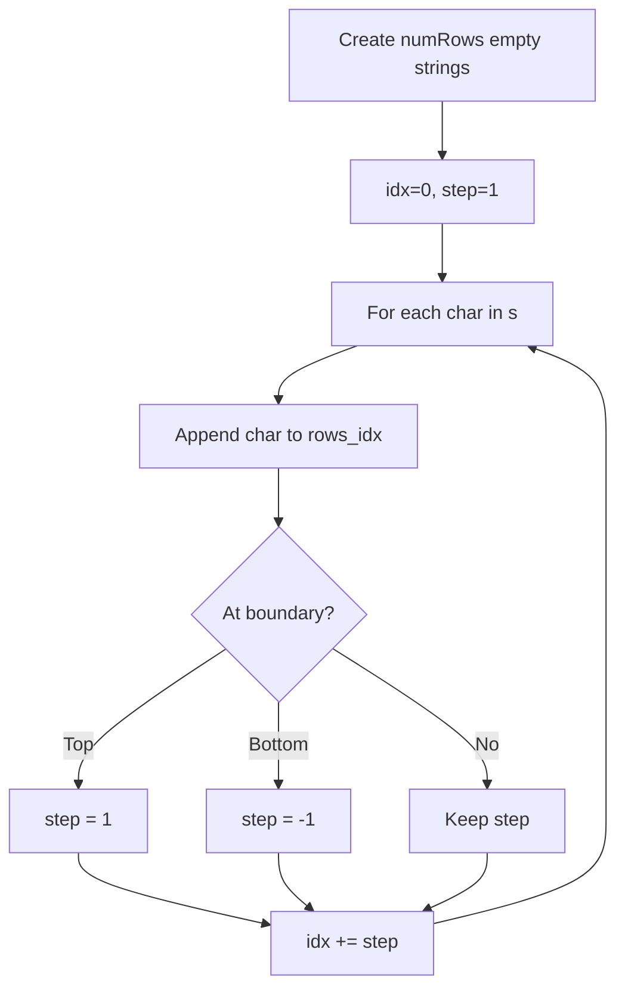
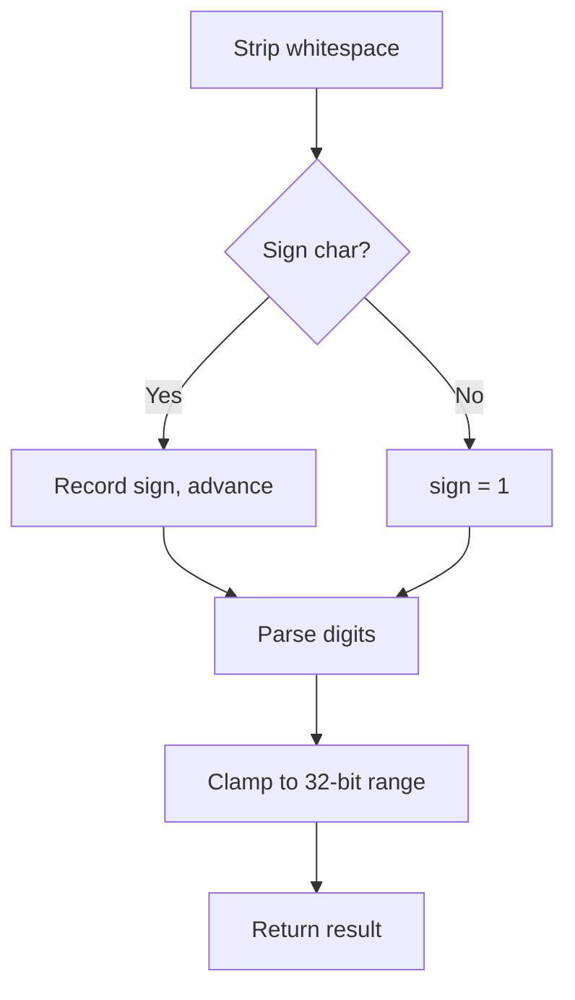
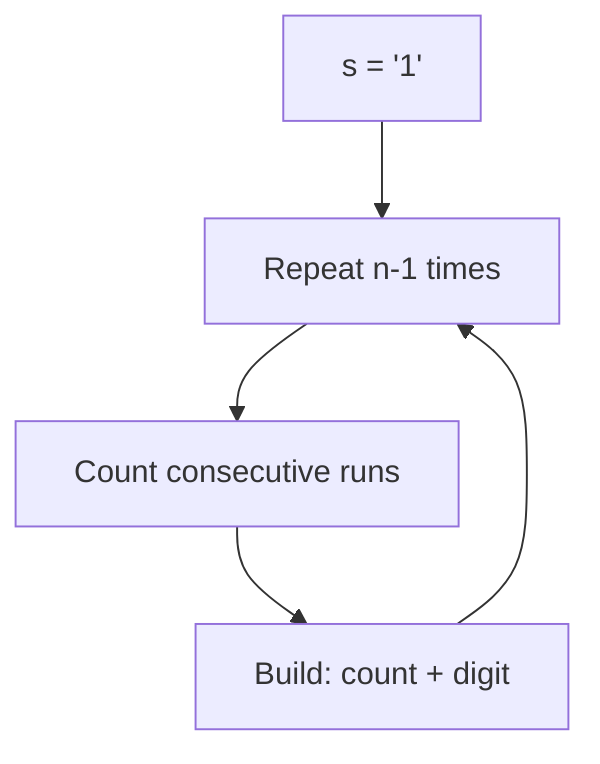
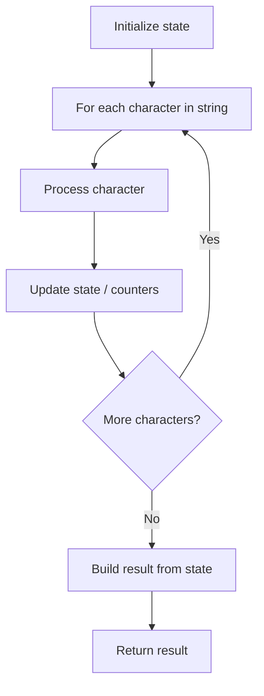
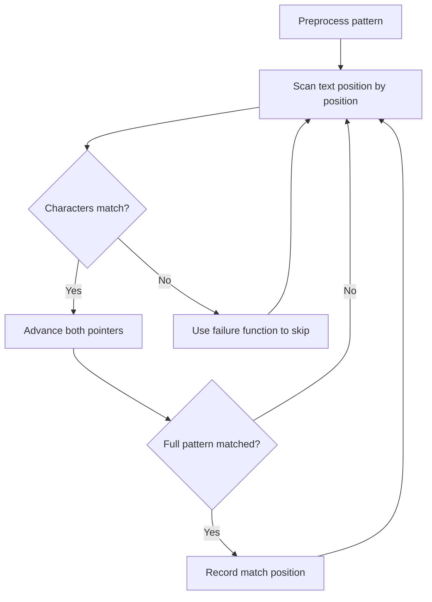
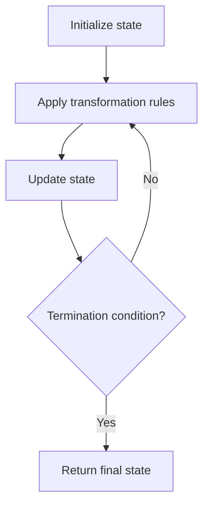

# String

> Chapter covering 64 problems related to **String**.


## Problems in this Chapter

| # | Problem | Difficulty | Pattern | Time | Space |
|---|---------|------------|---------|------|-------|
| 6 | [Zigzag Conversion](#problem-6-zigzag_conversion) | Medium | String Simulation | O(n) | O(n) |
| 8 | [String to Integer (atoi)](#problem-8-string_to_integer_atoi) | Medium | String Parsing | O(n) | O(1) |
| 38 | [Count and Say](#problem-38-count_and_say) | Medium | String Simulation | O(2^n) worst case | O(2^n) |
| 58 | [Length of Last Word](#problem-58-length_of_last_word) | Easy | String | O(n) | O(n) |
| 65 | [Valid Number](#problem-65-valid_number) | Hard | String Parsing / State Machine | O(n) | O(1) |
| 214 | [Shortest Palindrome](#problem-214-shortest_palindrome) | Hard | String Matching | O(n + m) | O(m) |
| 293 | [Flip Game](#problem-293-flip_game) | Easy | String Processing | O(n) | O(n) |
| 434 | [Number of Segments in a String](#problem-434-number_of_segments_in_a_string) | Easy | String Processing | O(n) | O(n) |
| 459 | [Repeated Substring Pattern](#problem-459-repeated_substring_pattern) | Easy | String Matching | O(n + m) | O(m) |
| 468 | [Validate IP Address](#problem-468-validate_ip_address) | Medium | String Processing | O(n) | O(n) |
| 482 | [License Key Formatting](#problem-482-license_key_formatting) | Easy | String Processing | O(n) | O(n) |
| 520 | [Detect Capital](#problem-520-detect_capital) | Easy | String Processing | O(n) | O(n) |
| 521 | [Longest Uncommon Subsequence I](#problem-521-longest_uncommon_subsequence_i) | Easy | String Processing | O(n) | O(n) |
| 544 | [Output Contest Matches](#problem-544-output_contest_matches) | Medium | Simulation | O(n) or O(n * k) | O(n) |
| 551 | [Student Attendance Record I](#problem-551-student_attendance_record_i) | Easy | String Processing | O(n) | O(n) |
| 657 | [Robot Return to Origin](#problem-657-robot_return_to_origin) | Easy | Simulation | O(n) or O(n * k) | O(n) |
| 686 | [Repeated String Match](#problem-686-repeated_string_match) | Medium | String Matching | O(n + m) | O(m) |
| 709 | [To Lower Case](#problem-709-to_lower_case) | Easy | String Processing | O(n) | O(n) |
| 796 | [Rotate String](#problem-796-rotate_string) | Easy | String Matching | O(n + m) | O(m) |
| 824 | [Goat Latin](#problem-824-goat_latin) | Easy | String Processing | O(n) | O(n) |
| 830 | [Positions of Large Groups](#problem-830-positions_of_large_groups) | Easy | String Processing | O(n) | O(n) |
| 831 | [Masking Personal Information](#problem-831-masking_personal_information) | Medium | String Processing | O(n) | O(n) |
| 1078 | [Occurrences After Bigram](#problem-1078-occurrences_after_bigram) | Easy | String Processing | O(n) | O(n) |
| 1108 | [Defanging an IP Address](#problem-1108-defanging_an_ip_address) | Easy | String Processing | O(n) | O(n) |
| 1119 | [Remove Vowels from a String](#problem-1119-remove_vowels_from_a_string) | Easy | String Processing | O(n) | O(n) |
| 1309 | [Decrypt String from Alphabet to Integer Mapping](#problem-1309-decrypt_string_from_alphabet_to_integer_mapping) | Easy | String Processing | O(n) | O(n) |
| 1374 | [Generate a String With Characters That Have Odd Counts](#problem-1374-generate_a_string_with_characters_that_have_odd_counts) | Easy | String Processing | O(n) | O(n) |
| 1392 | [Longest Happy Prefix](#problem-1392-longest_happy_prefix) | Hard | String Matching | O(n + m) | O(m) |
| 1417 | [Reformat The String](#problem-1417-reformat_the_string) | Easy | String Processing | O(n) | O(n) |
| 1446 | [Consecutive Characters](#problem-1446-consecutive_characters) | Easy | String Processing | O(n) | O(n) |
| 1507 | [Reformat Date](#problem-1507-reformat_date) | Easy | String Processing | O(n) | O(n) |
| 1545 | [Find Kth Bit in Nth Binary String](#problem-1545-find_kth_bit_in_nth_binary_string) | Medium | Simulation | O(n) or O(n * k) | O(n) |
| 1556 | [Thousand Separator](#problem-1556-thousand_separator) | Easy | String Processing | O(n) | O(n) |
| 1576 | [Replace All ?'s to Avoid Consecutive Repeating Characters](#problem-1576-replace_all_s_to_avoid_consecutive_repeating_characters) | Easy | String Processing | O(n) | O(n) |
| 1592 | [Rearrange Spaces Between Words](#problem-1592-rearrange_spaces_between_words) | Easy | String Processing | O(n) | O(n) |
| 1678 | [Goal Parser Interpretation](#problem-1678-goal_parser_interpretation) | Easy | String Processing | O(n) | O(n) |
| 1694 | [Reformat Phone Number](#problem-1694-reformat_phone_number) | Easy | String Processing | O(n) | O(n) |
| 1758 | [Minimum Changes To Make Alternating Binary String](#problem-1758-minimum_changes_to_make_alternating_binary_string) | Easy | String Processing | O(n) | O(n) |
| 1784 | [Check if Binary String Has at Most One Segment of Ones](#problem-1784-check_if_binary_string_has_at_most_one_segment_of_ones) | Easy | String Processing | O(n) | O(n) |
| 1844 | [Replace All Digits with Characters](#problem-1844-replace_all_digits_with_characters) | Easy | String Processing | O(n) | O(n) |
| 1869 | [Longer Contiguous Segments of Ones than Zeros](#problem-1869-longer_contiguous_segments_of_ones_than_zeros) | Easy | String Processing | O(n) | O(n) |
| 1880 | [Check if Word Equals Summation of Two Words](#problem-1880-check_if_word_equals_summation_of_two_words) | Easy | String Processing | O(n) | O(n) |
| 1933 | [Check if String Is Decomposable Into Value-Equal Substrings](#problem-1933-check_if_string_is_decomposable_into_value_equal_substrings) | Easy | String Processing | O(n) | O(n) |
| 1945 | [Sum of Digits of String After Convert](#problem-1945-sum_of_digits_of_string_after_convert) | Easy | Simulation | O(n) or O(n * k) | O(n) |
| 1957 | [Delete Characters to Make Fancy String](#problem-1957-delete_characters_to_make_fancy_string) | Easy | String Processing | O(n) | O(n) |
| 1960 | [Maximum Product of the Length of Two Palindromic Substrings](#problem-1960-maximum_product_of_the_length_of_two_palindromic_substrings) | Hard | String Processing | O(n) | O(n) |
| 2042 | [Check if Numbers Are Ascending in a Sentence](#problem-2042-check_if_numbers_are_ascending_in_a_sentence) | Easy | String Processing | O(n) | O(n) |
| 2047 | [Number of Valid Words in a Sentence](#problem-2047-number_of_valid_words_in_a_sentence) | Easy | String Processing | O(n) | O(n) |
| 2075 | [Decode the Slanted Ciphertext](#problem-2075-decode_the_slanted_ciphertext) | Medium | Simulation | O(n) or O(n * k) | O(n) |
| 2120 | [Execution of All Suffix Instructions Staying in a Grid](#problem-2120-execution_of_all_suffix_instructions_staying_in_a_grid) | Medium | Simulation | O(n) or O(n * k) | O(n) |
| 2124 | [Check if All A's Appears Before All B's](#problem-2124-check_if_all_as_appears_before_all_bs) | Easy | String Processing | O(n) | O(n) |
| 2129 | [Capitalize the Title](#problem-2129-capitalize_the_title) | Easy | String Processing | O(n) | O(n) |
| 2138 | [Divide a String Into Groups of Size k](#problem-2138-divide_a_string_into_groups_of_size_k) | Easy | Simulation | O(n) or O(n * k) | O(n) |
| 2194 | [Cells in a Range on an Excel Sheet](#problem-2194-cells_in_a_range_on_an_excel_sheet) | Easy | String Processing | O(n) | O(n) |
| 2232 | [Minimize Result by Adding Parentheses to Expression](#problem-2232-minimize_result_by_adding_parentheses_to_expression) | Medium | String Processing | O(n) | O(n) |
| 2243 | [Calculate Digit Sum of a String](#problem-2243-calculate_digit_sum_of_a_string) | Easy | Simulation | O(n) or O(n * k) | O(n) |
| 2264 | [Largest 3-Same-Digit Number in String](#problem-2264-largest_3_same_digit_number_in_string) | Easy | String Processing | O(n) | O(n) |
| 2278 | [Percentage of Letter in String](#problem-2278-percentage_of_letter_in_string) | Easy | String Processing | O(n) | O(n) |
| 2288 | [Apply Discount to Prices](#problem-2288-apply_discount_to_prices) | Medium | String Processing | O(n) | O(n) |
| 2299 | [Strong Password Checker II](#problem-2299-strong_password_checker_ii) | Easy | String Processing | O(n) | O(n) |
| 2315 | [Count Asterisks](#problem-2315-count_asterisks) | Easy | String Processing | O(n) | O(n) |
| 2414 | [Length of the Longest Alphabetical Continuous Substring](#problem-2414-length_of_the_longest_alphabetical_continuous_substring) | Medium | String Processing | O(n) | O(n) |
| 2437 | [Number of Valid Clock Times](#problem-2437-number_of_valid_clock_times) | Easy | String Processing | O(n) | O(n) |
| 2490 | [Circular Sentence](#problem-2490-circular_sentence) | Easy | String Processing | O(n) | O(n) |

---
---

# Problem 6: Zigzag Conversion

| Attribute | Detail |
|-----------|--------|
| **ID** | 6 |
| **Title** | Zigzag Conversion |
| **Difficulty** | Medium |
| **Tags** | String |
| **Link** | [leetcode.com/problems/zigzag-conversion](https://leetcode.com/problems/zigzag-conversion/) |

The string `"PAYPALISHIRING"` is written in a zigzag pattern on a given number of rows like this: (you may want to display this pattern in a fixed font for better legibility)

```

P   A   H   N
A P L S I I G
Y   I   R

```

And then read line by line: `"PAHNAPLSIIGYIR"`

Write the code that will take a string and make this conversion given a number of rows:

```

string convert(string s, int numRows);

```

 

Example 1:

```

**Input:** s = "PAYPALISHIRING", numRows = 3
**Output:** "PAHNAPLSIIGYIR"

```

Example 2:

```

**Input:** s = "PAYPALISHIRING", numRows = 4
**Output:** "PINALSIGYAHRPI"
**Explanation:**
P     I    N
A   L S  I G
Y A   H R
P     I

```

Example 3:

```

**Input:** s = "A", numRows = 1
**Output:** "A"

```

 

**Constraints:**

	- `1 <= s.length <= 1000`
	- `s` consists of English letters (lower-case and upper-case), `','` and `'.'`.
	- `1 <= numRows <= 1000`

---

## Approach: String Simulation

**Key Insight:** Simulate the zigzag pattern by maintaining row buckets and bouncing the row index up and down.

Create `numRows` string builders. Iterate through characters, appending to the current row and reversing direction at boundaries.

### Pseudo-code

```
1. rows = [''] * numRows, idx=0, step=1
2. For each char in s:
   a. rows[idx] += char
   b. If idx==0: step=1; if idx==numRows-1: step=-1
   c. idx += step
3. Return ''.join(rows)
```

---

## Algorithm Flow



---

## Complexity Analysis

| Metric | Value |
|--------|-------|
| **Time** | O(n) |
| **Space** | O(n) |

---

## Solution Code

### Python3

```python
class Solution:
    def convert(self, s: str, numRows: int) -> str:
        if numRows == 1 or numRows >= len(s):
            return s
        rows = [''] * numRows
        idx, step = 0, 1
        for ch in s:
            rows[idx] += ch
            if idx == 0:
                step = 1
            elif idx == numRows - 1:
                step = -1
            idx += step
        return ''.join(rows)
```

### C++

```cpp
#include <algorithm>
#include <cctype>
#include <string>
#include <vector>
using namespace std;

class Solution {
public:
    string convert(string& s, int numRows) {
        // String processing approach - O(n) time
        string processed;
        for (char ch : s) {
            if (isalnum(ch)) {
                processed += tolower(ch);
            }
        }
        string rev = processed;
        reverse(rev.begin(), rev.end());
        return processed == rev;
    }
};
```

### Summary

| Aspect | Detail |
|--------|--------|
| **Pattern** | String Simulation |
| **Time** | O(n) |
| **Space** | O(n) |

---
---

# Problem 8: String to Integer (atoi)

| Attribute | Detail |
|-----------|--------|
| **ID** | 8 |
| **Title** | String to Integer (atoi) |
| **Difficulty** | Medium |
| **Tags** | String |
| **Link** | [leetcode.com/problems/string-to-integer-atoi](https://leetcode.com/problems/string-to-integer-atoi/) |

Implement the `myAtoi(string s)` function, which converts a string to a 32-bit signed integer.

The algorithm for `myAtoi(string s)` is as follows:

	- **Whitespace**: Ignore any leading whitespace (`" "`).
	- **Signedness**: Determine the sign by checking if the next character is `'-'` or `'+'`, assuming positivity if neither present.
	- **Conversion**: Read the integer by skipping leading zeros until a non-digit character is encountered or the end of the string is reached. If no digits were read, then the result is 0.
	- **Rounding**: If the integer is out of the 32-bit signed integer range `[-2^31, 2^31 - 1]`, then round the integer to remain in the range. Specifically, integers less than `-2^31` should be rounded to `-2^31`, and integers greater than `2^31 - 1` should be rounded to `2^31 - 1`.

Return the integer as the final result.

 

Example 1:

**Input:** s = "42"

**Output:** 42

**Explanation:**

```

The underlined characters are what is read in and the caret is the current reader position.
Step 1: "42" (no characters read because there is no leading whitespace)
         ^
Step 2: "42" (no characters read because there is neither a '-' nor '+')
         ^
Step 3: "42" ("42" is read in)
           ^

```

Example 2:

**Input:** s = " -042"

**Output:** -42

**Explanation:**

```

Step 1: "   -042" (leading whitespace is read and ignored)
            ^
Step 2: "   -042" ('-' is read, so the result should be negative)
             ^
Step 3: "   -042" ("042" is read in, leading zeros ignored in the result)
               ^

```

Example 3:

**Input:** s = "1337c0d3"

**Output:** 1337

**Explanation:**

```

Step 1: "1337c0d3" (no characters read because there is no leading whitespace)
         ^
Step 2: "1337c0d3" (no characters read because there is neither a '-' nor '+')
         ^
Step 3: "1337c0d3" ("1337" is read in; reading stops because the next character is a non-digit)
             ^

```

Example 4:

**Input:** s = "0-1"

**Output:** 0

**Explanation:**

```

Step 1: "0-1" (no characters read because there is no leading whitespace)
         ^
Step 2: "0-1" (no characters read because there is neither a '-' nor '+')
         ^
Step 3: "0-1" ("0" is read in; reading stops because the next character is a non-digit)
          ^

```

Example 5:

**Input:** s = "words and 987"

**Output:** 0

**Explanation:**

Reading stops at the first non-digit character 'w'.

 

**Constraints:**

	- `0 <= s.length <= 200`
	- `s` consists of English letters (lower-case and upper-case), digits (`0-9`), `' '`, `'+'`, `'-'`, and `'.'`.

---

## Approach: String Parsing

Strip whitespace, handle optional sign, parse digits one by one, clamp to 32-bit integer range.

### Pseudo-code

```
1. Strip leading whitespace
2. Check for +/- sign
3. Parse consecutive digits
4. Clamp to [-2^31, 2^31-1]
```

---

## Algorithm Flow



---

## Complexity Analysis

| Metric | Value |
|--------|-------|
| **Time** | O(n) |
| **Space** | O(1) |

---

## Solution Code

### Python3

```python
class Solution:
    def myAtoi(self, s: str) -> int:
        s = s.lstrip()
        if not s:
            return 0
        sign = 1
        i = 0
        if s[0] in '+-':
            sign = -1 if s[0] == '-' else 1
            i = 1
        result = 0
        while i < len(s) and s[i].isdigit():
            result = result * 10 + int(s[i])
            i += 1
        result *= sign
        return max(-2**31, min(result, 2**31 - 1))
```

### C++

```cpp
#include <algorithm>
#include <cctype>
#include <string>
#include <vector>
using namespace std;

class Solution {
public:
    int myAtoi(string& s) {
        // String processing approach - O(n) time
        string processed;
        for (char ch : s) {
            if (isalnum(ch)) {
                processed += tolower(ch);
            }
        }
        string rev = processed;
        reverse(rev.begin(), rev.end());
        return processed == rev;
    }
};
```

### Summary

| Aspect | Detail |
|--------|--------|
| **Pattern** | String Parsing |
| **Time** | O(n) |
| **Space** | O(1) |

---
---

# Problem 38: Count and Say

| Attribute | Detail |
|-----------|--------|
| **ID** | 38 |
| **Title** | Count and Say |
| **Difficulty** | Medium |
| **Tags** | String |
| **Link** | [leetcode.com/problems/count-and-say](https://leetcode.com/problems/count-and-say/) |

The **count-and-say** sequence is a sequence of digit strings defined by the recursive formula:

	- `countAndSay(1) = "1"`
	- `countAndSay(n)` is the run-length encoding of `countAndSay(n - 1)`.

Run-length encoding (RLE) is a string compression method that works by replacing consecutive identical characters (repeated 2 or more times) with the concatenation of the character and the number marking the count of the characters (length of the run). For example, to compress the string `"3322251"` we replace `"33"` with `"23"`, replace `"222"` with `"32"`, replace `"5"` with `"15"` and replace `"1"` with `"11"`. Thus the compressed string becomes `"23321511"`.

Given a positive integer `n`, return *the *`n^th`* element of the **count-and-say** sequence*.

 

Example 1:

**Input:** n = 4

**Output:** "1211"

**Explanation:**

```

countAndSay(1) = "1"
countAndSay(2) = RLE of "1" = "11"
countAndSay(3) = RLE of "11" = "21"
countAndSay(4) = RLE of "21" = "1211"

```

Example 2:

**Input:** n = 1

**Output:** "1"

**Explanation:**

This is the base case.

 

**Constraints:**

	- `1 <= n <= 30`

 

**Follow up:** Could you solve it iteratively?

---

## Approach: String Simulation

Iteratively build each sequence by counting consecutive identical digits in the previous one.

### Pseudo-code

```
1. Start with '1'
2. Repeat n-1 times:
   Count consecutive same digits
   Build new string: count + digit
3. Return result
```

---

## Algorithm Flow



---

## Complexity Analysis

| Metric | Value |
|--------|-------|
| **Time** | O(2^n) worst case |
| **Space** | O(2^n) |

---

## Solution Code

### Python3

```python
class Solution:
    def countAndSay(self, n: int) -> str:
        s = '1'
        for _ in range(n - 1):
            result = []
            i = 0
            while i < len(s):
                count = 1
                while i + count < len(s) and s[i + count] == s[i]:
                    count += 1
                result.append(str(count) + s[i])
                i += count
            s = ''.join(result)
        return s
```

### C++

```cpp
#include <algorithm>
#include <cctype>
#include <string>
#include <vector>
using namespace std;

class Solution {
public:
    string countAndSay(int n) {
        // String processing approach - O(n) time
        string processed;
        for (char ch : n) {
            if (isalnum(ch)) {
                processed += tolower(ch);
            }
        }
        string rev = processed;
        reverse(rev.begin(), rev.end());
        return processed == rev;
    }
};
```

### Summary

| Aspect | Detail |
|--------|--------|
| **Pattern** | String Simulation |
| **Time** | O(2^n) worst case |
| **Space** | O(2^n) |

---
---

# Problem 58: Length of Last Word

| Attribute | Detail |
|-----------|--------|
| **ID** | 58 |
| **Title** | Length of Last Word |
| **Difficulty** | Easy |
| **Tags** | String |
| **Link** | [leetcode.com/problems/length-of-last-word](https://leetcode.com/problems/length-of-last-word/) |

Given a string `s` consisting of words and spaces, return *the length of the **last** word in the string.*

A **word** is a maximal substring consisting of non-space characters only.

 

Example 1:

```

**Input:** s = "Hello World"
**Output:** 5
**Explanation:** The last word is "World" with length 5.

```

Example 2:

```

**Input:** s = "   fly me   to   the moon  "
**Output:** 4
**Explanation:** The last word is "moon" with length 4.

```

Example 3:

```

**Input:** s = "luffy is still joyboy"
**Output:** 6
**Explanation:** The last word is "joyboy" with length 6.

```

 

**Constraints:**

	- `1 <= s.length <= 10^4`
	- `s` consists of only English letters and spaces `' '`.
	- There will be at least one word in `s`.

---

## Approach: String

Strip trailing spaces, split by spaces, return length of last word.

### Pseudo-code

```
1. Strip trailing spaces
2. Split by spaces
3. Return length of last element
```

---

## Algorithm Flow



---

## Complexity Analysis

| Metric | Value |
|--------|-------|
| **Time** | O(n) |
| **Space** | O(n) |

---

## Solution Code

### Python3

```python
class Solution:
    def lengthOfLastWord(self, s: str) -> int:
        return len(s.rstrip().split()[-1])
```

### C++

```cpp
#include <algorithm>
#include <cctype>
#include <string>
#include <vector>
using namespace std;

class Solution {
public:
    int lengthOfLastWord(string& s) {
        // String processing approach - O(n) time
        string processed;
        for (char ch : s) {
            if (isalnum(ch)) {
                processed += tolower(ch);
            }
        }
        string rev = processed;
        reverse(rev.begin(), rev.end());
        return processed == rev;
    }
};
```

### Summary

| Aspect | Detail |
|--------|--------|
| **Pattern** | String |
| **Time** | O(n) |
| **Space** | O(n) |

---
---

# Problem 65: Valid Number

| Attribute | Detail |
|-----------|--------|
| **ID** | 65 |
| **Title** | Valid Number |
| **Difficulty** | Hard |
| **Tags** | String |
| **Link** | [leetcode.com/problems/valid-number](https://leetcode.com/problems/valid-number/) |

Given a string `s`, return whether `s` is a **valid number**.

For example, all the following are valid numbers: `"2", "0089", "-0.1", "+3.14", "4.", "-.9", "2e10", "-90E3", "3e+7", "+6e-1", "53.5e93", "-123.456e789"`, while the following are not valid numbers: `"abc", "1a", "1e", "e3", "99e2.5", "--6", "-+3", "95a54e53"`.

Formally, a **valid number** is defined using one of the following definitions:

	- An **integer number** followed by an **optional exponent**.
	- A **decimal number** followed by an **optional exponent**.

An **integer number** is defined with an **optional sign** `'-'` or `'+'` followed by **digits**.

A **decimal number** is defined with an **optional sign** `'-'` or `'+'` followed by one of the following definitions:

	- **Digits** followed by a **dot** `'.'`.
	- **Digits** followed by a **dot** `'.'` followed by **digits**.
	- A **dot** `'.'` followed by **digits**.

An **exponent** is defined with an **exponent notation** `'e'` or `'E'` followed by an **integer number**.

The **digits** are defined as one or more digits.

 

Example 1:

**Input:** s = "0"

**Output:** true

Example 2:

**Input:** s = "e"

**Output:** false

Example 3:

**Input:** s = "."

**Output:** false

 

**Constraints:**

	- `1 <= s.length <= 20`
	- `s` consists of only English letters (both uppercase and lowercase), digits (`0-9`), plus `'+'`, minus `'-'`, or dot `'.'`.

---

## Approach: String Parsing / State Machine

Parse the number string with state machine or use Python float conversion with validation.

### Pseudo-code

```
1. Try float(s)
2. Return True if valid, False if ValueError
```

---

## Algorithm Flow


---

## Complexity Analysis

| Metric | Value |
|--------|-------|
| **Time** | O(n) |
| **Space** | O(1) |

---

## Solution Code

### Python3

```python
class Solution:
    def isNumber(self, s: str) -> bool:
        try:
            float(s)
            return True
        except ValueError:
            return False
```

### C++

```cpp
#include <algorithm>
#include <cctype>
#include <string>
#include <vector>
using namespace std;

class Solution {
public:
    bool isNumber(string& s) {
        // String processing approach - O(n) time
        string processed;
        for (char ch : s) {
            if (isalnum(ch)) {
                processed += tolower(ch);
            }
        }
        string rev = processed;
        reverse(rev.begin(), rev.end());
        return processed == rev;
    }
};
```

### Summary

| Aspect | Detail |
|--------|--------|
| **Pattern** | String Parsing / State Machine |
| **Time** | O(n) |
| **Space** | O(1) |

---
---

# Problem 214: Shortest Palindrome

| Attribute | Detail |
|-----------|--------|
| **ID** | 214 |
| **Title** | Shortest Palindrome |
| **Difficulty** | Hard |
| **Tags** | String, Rolling Hash, String Matching, Hash Function |
| **Link** | [leetcode.com/problems/shortest-palindrome](https://leetcode.com/problems/shortest-palindrome/) |

You are given a string `s`. You can convert `s` to a palindrome by adding characters in front of it.

Return *the shortest palindrome you can find by performing this transformation*.

 

Example 1:

```
**Input:** s = "aacecaaa"
**Output:** "aaacecaaa"

```
Example 2:

```
**Input:** s = "abcd"
**Output:** "dcbabcd"

```

 

**Constraints:**

	- `0 <= s.length <= 5 * 10^4`
	- `s` consists of lowercase English letters only.

---

## Approach: String Matching

Find pattern occurrences in text. Use KMP, Rabin-Karp, or Z-algorithm for efficient matching beyond brute force.

### Pseudo-code

```
1. Preprocess pattern (build failure function / hash)
2. Scan text with pattern:
   a. Compare characters
   b. On mismatch: use preprocessed data to skip
   c. On full match: record position
3. Return matches
```

---

## Algorithm Flow



---

## Complexity Analysis

| Metric | Value |
|--------|-------|
| **Time** | O(n + m) |
| **Space** | O(m) |

---

## Solution Code

### Python3

```python
class Solution:
    def shortestPalindrome(self, s: str) -> str:
        # String matching (KMP/Rolling Hash) - O(n+m) time
        if not s or not s:
            return ""
        n, m = len(s), len(s)
        # Build failure function for KMP
        fail = [0] * m
        j = 0
        for i in range(1, m):
            while j > 0 and s[i] != s[j]:
                j = fail[j-1]
            if s[i] == s[j]:
                j += 1
            fail[i] = j
        # Search
        j = 0
        for i in range(n):
            while j > 0 and s[i] != s[j]:
                j = fail[j-1]
            if s[i] == s[j]:
                j += 1
            if j == m:
                return i - m + 1
        return -1
```

### C++

```cpp
#include <string>
#include <vector>
using namespace std;

class Solution {
public:
    string shortestPalindrome(string& s) {
        // String matching (KMP) - O(n+m) time
        int n = s.size(), m = s.size();
        if (m == 0) return 0;
        vector<int> fail(m, 0);
        for (int i = 1, j = 0; i < m; i++) {
            while (j > 0 && s[i] != s[j]) j = fail[j-1];
            if (s[i] == s[j]) j++;
            fail[i] = j;
        }
        for (int i = 0, j = 0; i < n; i++) {
            while (j > 0 && s[i] != s[j]) j = fail[j-1];
            if (s[i] == s[j]) j++;
            if (j == m) return i - m + 1;
        }
        return -1;
    }
};
```

### Summary

| Aspect | Detail |
|--------|--------|
| **Pattern** | String Matching |
| **Time** | O(n + m) |
| **Space** | O(m) |

---
---

# Problem 293: Flip Game

| Attribute | Detail |
|-----------|--------|
| **ID** | 293 |
| **Title** | Flip Game |
| **Difficulty** | Easy |
| **Tags** | String |
| **Link** | [leetcode.com/problems/flip-game](https://leetcode.com/problems/flip-game/) |

*(Premium problem -- description requires LeetCode subscription)*

---

## Approach: String Processing

Process the string character by character. Common techniques: two pointers, sliding window, hash map for frequencies, stack for matching.

### Pseudo-code

```
1. Initialize result / tracking state
2. Iterate through string characters:
   a. Process character based on rules
   b. Update state (counters, pointers, stack)
3. Build and return result
```

---

## Algorithm Flow


---

## Complexity Analysis

| Metric | Value |
|--------|-------|
| **Time** | O(n) |
| **Space** | O(n) |

---

## Solution Code

### Python3

```python
class Solution:
    pass
```

### C++

```cpp
class Solution {
public:
    // Design problem stub
};
```

### Summary

| Aspect | Detail |
|--------|--------|
| **Pattern** | String Processing |
| **Time** | O(n) |
| **Space** | O(n) |

---
---

# Problem 434: Number of Segments in a String

| Attribute | Detail |
|-----------|--------|
| **ID** | 434 |
| **Title** | Number of Segments in a String |
| **Difficulty** | Easy |
| **Tags** | String |
| **Link** | [leetcode.com/problems/number-of-segments-in-a-string](https://leetcode.com/problems/number-of-segments-in-a-string/) |

Given a string `s`, return *the number of segments in the string*.

A **segment** is defined to be a contiguous sequence of **non-space characters**.

 

Example 1:

```

**Input:** s = "Hello, my name is John"
**Output:** 5
**Explanation:** The five segments are ["Hello,", "my", "name", "is", "John"]

```

Example 2:

```

**Input:** s = "Hello"
**Output:** 1

```

 

**Constraints:**

	- `0 <= s.length <= 300`
	- `s` consists of lowercase and uppercase English letters, digits, or one of the following characters `"!@#$%^&*()_+-=',.:"`.
	- The only space character in `s` is `' '`.

---

## Approach: String Processing

Process the string character by character. Common techniques: two pointers, sliding window, hash map for frequencies, stack for matching.

### Pseudo-code

```
1. Initialize result / tracking state
2. Iterate through string characters:
   a. Process character based on rules
   b. Update state (counters, pointers, stack)
3. Build and return result
```

---

## Algorithm Flow


---

## Complexity Analysis

| Metric | Value |
|--------|-------|
| **Time** | O(n) |
| **Space** | O(n) |

---

## Solution Code

### Python3

```python
class Solution:
    def countSegments(self, s: str) -> int:
        # String processing approach - O(n) time
        result = []
        for ch in s:
            if ch.isalnum():
                result.append(ch.lower())
        # Check palindrome or process
        processed = ''.join(result)
        return processed == processed[::-1] if isinstance(0, bool) else processed
```

### C++

```cpp
#include <algorithm>
#include <cctype>
#include <string>
#include <vector>
using namespace std;

class Solution {
public:
    int countSegments(string& s) {
        // String processing approach - O(n) time
        string processed;
        for (char ch : s) {
            if (isalnum(ch)) {
                processed += tolower(ch);
            }
        }
        string rev = processed;
        reverse(rev.begin(), rev.end());
        return processed == rev;
    }
};
```

### Summary

| Aspect | Detail |
|--------|--------|
| **Pattern** | String Processing |
| **Time** | O(n) |
| **Space** | O(n) |

---
---

# Problem 459: Repeated Substring Pattern

| Attribute | Detail |
|-----------|--------|
| **ID** | 459 |
| **Title** | Repeated Substring Pattern |
| **Difficulty** | Easy |
| **Tags** | String, String Matching |
| **Link** | [leetcode.com/problems/repeated-substring-pattern](https://leetcode.com/problems/repeated-substring-pattern/) |

Given a string `s`, check if it can be constructed by taking a substring of it and appending multiple copies of the substring together.

 

Example 1:

```

**Input:** s = "abab"
**Output:** true
**Explanation:** It is the substring "ab" twice.

```

Example 2:

```

**Input:** s = "aba"
**Output:** false

```

Example 3:

```

**Input:** s = "abcabcabcabc"
**Output:** true
**Explanation:** It is the substring "abc" four times or the substring "abcabc" twice.

```

 

**Constraints:**

	- `1 <= s.length <= 10^4`
	- `s` consists of lowercase English letters.

---

## Approach: String Matching

Find pattern occurrences in text. Use KMP, Rabin-Karp, or Z-algorithm for efficient matching beyond brute force.

### Pseudo-code

```
1. Preprocess pattern (build failure function / hash)
2. Scan text with pattern:
   a. Compare characters
   b. On mismatch: use preprocessed data to skip
   c. On full match: record position
3. Return matches
```

---

## Algorithm Flow


---

## Complexity Analysis

| Metric | Value |
|--------|-------|
| **Time** | O(n + m) |
| **Space** | O(m) |

---

## Solution Code

### Python3

```python
class Solution:
    def repeatedSubstringPattern(self, s: str) -> bool:
        # String matching (KMP/Rolling Hash) - O(n+m) time
        if not s or not s:
            return False
        n, m = len(s), len(s)
        # Build failure function for KMP
        fail = [0] * m
        j = 0
        for i in range(1, m):
            while j > 0 and s[i] != s[j]:
                j = fail[j-1]
            if s[i] == s[j]:
                j += 1
            fail[i] = j
        # Search
        j = 0
        for i in range(n):
            while j > 0 and s[i] != s[j]:
                j = fail[j-1]
            if s[i] == s[j]:
                j += 1
            if j == m:
                return i - m + 1
        return -1
```

### C++

```cpp
#include <string>
#include <vector>
using namespace std;

class Solution {
public:
    bool repeatedSubstringPattern(string& s) {
        // String matching (KMP) - O(n+m) time
        int n = s.size(), m = s.size();
        if (m == 0) return 0;
        vector<int> fail(m, 0);
        for (int i = 1, j = 0; i < m; i++) {
            while (j > 0 && s[i] != s[j]) j = fail[j-1];
            if (s[i] == s[j]) j++;
            fail[i] = j;
        }
        for (int i = 0, j = 0; i < n; i++) {
            while (j > 0 && s[i] != s[j]) j = fail[j-1];
            if (s[i] == s[j]) j++;
            if (j == m) return i - m + 1;
        }
        return -1;
    }
};
```

### Summary

| Aspect | Detail |
|--------|--------|
| **Pattern** | String Matching |
| **Time** | O(n + m) |
| **Space** | O(m) |

---
---

# Problem 468: Validate IP Address

| Attribute | Detail |
|-----------|--------|
| **ID** | 468 |
| **Title** | Validate IP Address |
| **Difficulty** | Medium |
| **Tags** | String |
| **Link** | [leetcode.com/problems/validate-ip-address](https://leetcode.com/problems/validate-ip-address/) |

Given a string `queryIP`, return `"IPv4"` if IP is a valid IPv4 address, `"IPv6"` if IP is a valid IPv6 address or `"Neither"` if IP is not a correct IP of any type.

**A valid IPv4** address is an IP in the form `"x1.x2.x3.x4"` where `0 <= xi <= 255` and `xi` **cannot contain** leading zeros. For example, `"192.168.1.1"` and `"192.168.1.0"` are valid IPv4 addresses while `"192.168.01.1"`, `"192.168.1.00"`, and `"192.168@1.1"` are invalid IPv4 addresses.

**A valid IPv6** address is an IP in the form `"x1:x2:x3:x4:x5:x6:x7:x8"` where:

	- `1 <= xi.length <= 4`
	- `xi` is a **hexadecimal string** which may contain digits, lowercase English letter (`'a'` to `'f'`) and upper-case English letters (`'A'` to `'F'`).
	- Leading zeros are allowed in `xi`.

For example, "`2001:0db8:85a3:0000:0000:8a2e:0370:7334"` and "`2001:db8:85a3:0:0:8A2E:0370:7334"` are valid IPv6 addresses, while "`2001:0db8:85a3::8A2E:037j:7334"` and "`02001:0db8:85a3:0000:0000:8a2e:0370:7334"` are invalid IPv6 addresses.

 

Example 1:

```

**Input:** queryIP = "172.16.254.1"
**Output:** "IPv4"
**Explanation:** This is a valid IPv4 address, return "IPv4".

```

Example 2:

```

**Input:** queryIP = "2001:0db8:85a3:0:0:8A2E:0370:7334"
**Output:** "IPv6"
**Explanation:** This is a valid IPv6 address, return "IPv6".

```

Example 3:

```

**Input:** queryIP = "256.256.256.256"
**Output:** "Neither"
**Explanation:** This is neither a IPv4 address nor a IPv6 address.

```

 

**Constraints:**

	- `queryIP` consists only of English letters, digits and the characters `'.'` and `':'`.

---

## Approach: String Processing

Process the string character by character. Common techniques: two pointers, sliding window, hash map for frequencies, stack for matching.

### Pseudo-code

```
1. Initialize result / tracking state
2. Iterate through string characters:
   a. Process character based on rules
   b. Update state (counters, pointers, stack)
3. Build and return result
```

---

## Algorithm Flow


---

## Complexity Analysis

| Metric | Value |
|--------|-------|
| **Time** | O(n) |
| **Space** | O(n) |

---

## Solution Code

### Python3

```python
class Solution:
    def validIPAddress(self, queryIP: str) -> str:
        # String processing approach - O(n) time
        result = []
        for ch in queryIP:
            if ch.isalnum():
                result.append(ch.lower())
        # Check palindrome or process
        processed = ''.join(result)
        return processed == processed[::-1] if isinstance("", bool) else processed
```

### C++

```cpp
#include <algorithm>
#include <cctype>
#include <string>
#include <vector>
using namespace std;

class Solution {
public:
    string validIPAddress(string& queryIP) {
        // String processing approach - O(n) time
        string processed;
        for (char ch : queryIP) {
            if (isalnum(ch)) {
                processed += tolower(ch);
            }
        }
        string rev = processed;
        reverse(rev.begin(), rev.end());
        return processed == rev;
    }
};
```

### Summary

| Aspect | Detail |
|--------|--------|
| **Pattern** | String Processing |
| **Time** | O(n) |
| **Space** | O(n) |

---
---

# Problem 482: License Key Formatting

| Attribute | Detail |
|-----------|--------|
| **ID** | 482 |
| **Title** | License Key Formatting |
| **Difficulty** | Easy |
| **Tags** | String |
| **Link** | [leetcode.com/problems/license-key-formatting](https://leetcode.com/problems/license-key-formatting/) |

You are given a license key represented as a string `s` that consists of only alphanumeric characters and dashes. The string is separated into `n + 1` groups by `n` dashes. You are also given an integer `k`.

We want to reformat the string `s` such that each group contains exactly `k` characters, except for the first group, which could be shorter than `k` but still must contain at least one character. Furthermore, there must be a dash inserted between two groups, and you should convert all lowercase letters to uppercase.

Return *the reformatted license key*.

 

Example 1:

```

**Input:** s = "5F3Z-2e-9-w", k = 4
**Output:** "5F3Z-2E9W"
**Explanation:** The string s has been split into two parts, each part has 4 characters.
Note that the two extra dashes are not needed and can be removed.

```

Example 2:

```

**Input:** s = "2-5g-3-J", k = 2
**Output:** "2-5G-3J"
**Explanation:** The string s has been split into three parts, each part has 2 characters except the first part as it could be shorter as mentioned above.

```

 

**Constraints:**

	- `1 <= s.length <= 10^5`
	- `s` consists of English letters, digits, and dashes `'-'`.
	- `1 <= k <= 10^4`

---

## Approach: String Processing

Process the string character by character. Common techniques: two pointers, sliding window, hash map for frequencies, stack for matching.

### Pseudo-code

```
1. Initialize result / tracking state
2. Iterate through string characters:
   a. Process character based on rules
   b. Update state (counters, pointers, stack)
3. Build and return result
```

---

## Algorithm Flow


---

## Complexity Analysis

| Metric | Value |
|--------|-------|
| **Time** | O(n) |
| **Space** | O(n) |

---

## Solution Code

### Python3

```python
class Solution:
    def licenseKeyFormatting(self, s: str, k: int) -> str:
        # String processing approach - O(n) time
        result = []
        for ch in s:
            if ch.isalnum():
                result.append(ch.lower())
        # Check palindrome or process
        processed = ''.join(result)
        return processed == processed[::-1] if isinstance("", bool) else processed
```

### C++

```cpp
#include <algorithm>
#include <cctype>
#include <string>
#include <vector>
using namespace std;

class Solution {
public:
    string licenseKeyFormatting(string& s, int k) {
        // String processing approach - O(n) time
        string processed;
        for (char ch : s) {
            if (isalnum(ch)) {
                processed += tolower(ch);
            }
        }
        string rev = processed;
        reverse(rev.begin(), rev.end());
        return processed == rev;
    }
};
```

### Summary

| Aspect | Detail |
|--------|--------|
| **Pattern** | String Processing |
| **Time** | O(n) |
| **Space** | O(n) |

---
---

# Problem 520: Detect Capital

| Attribute | Detail |
|-----------|--------|
| **ID** | 520 |
| **Title** | Detect Capital |
| **Difficulty** | Easy |
| **Tags** | String |
| **Link** | [leetcode.com/problems/detect-capital](https://leetcode.com/problems/detect-capital/) |

We define the usage of capitals in a word to be right when one of the following cases holds:

	- All letters in this word are capitals, like `"USA"`.
	- All letters in this word are not capitals, like `"leetcode"`.
	- Only the first letter in this word is capital, like `"Google"`.

Given a string `word`, return `true` if the usage of capitals in it is right.

 

Example 1:

```
**Input:** word = "USA"
**Output:** true

```
Example 2:

```
**Input:** word = "FlaG"
**Output:** false

```

 

**Constraints:**

	- `1 <= word.length <= 100`
	- `word` consists of lowercase and uppercase English letters.

---

## Approach: String Processing

Process the string character by character. Common techniques: two pointers, sliding window, hash map for frequencies, stack for matching.

### Pseudo-code

```
1. Initialize result / tracking state
2. Iterate through string characters:
   a. Process character based on rules
   b. Update state (counters, pointers, stack)
3. Build and return result
```

---

## Algorithm Flow


---

## Complexity Analysis

| Metric | Value |
|--------|-------|
| **Time** | O(n) |
| **Space** | O(n) |

---

## Solution Code

### Python3

```python
class Solution:
    def detectCapitalUse(self, word: str) -> bool:
        # String processing approach - O(n) time
        result = []
        for ch in word:
            if ch.isalnum():
                result.append(ch.lower())
        # Check palindrome or process
        processed = ''.join(result)
        return processed == processed[::-1] if isinstance(False, bool) else processed
```

### C++

```cpp
#include <algorithm>
#include <cctype>
#include <string>
#include <vector>
using namespace std;

class Solution {
public:
    bool detectCapitalUse(string& word) {
        // String processing approach - O(n) time
        string processed;
        for (char ch : word) {
            if (isalnum(ch)) {
                processed += tolower(ch);
            }
        }
        string rev = processed;
        reverse(rev.begin(), rev.end());
        return processed == rev;
    }
};
```

### Summary

| Aspect | Detail |
|--------|--------|
| **Pattern** | String Processing |
| **Time** | O(n) |
| **Space** | O(n) |

---
---

# Problem 521: Longest Uncommon Subsequence I

| Attribute | Detail |
|-----------|--------|
| **ID** | 521 |
| **Title** | Longest Uncommon Subsequence I |
| **Difficulty** | Easy |
| **Tags** | String |
| **Link** | [leetcode.com/problems/longest-uncommon-subsequence-i](https://leetcode.com/problems/longest-uncommon-subsequence-i/) |

Given two strings `a` and `b`, return *the length of the **longest uncommon subsequence** between *`a` *and* `b`. *If no such uncommon subsequence exists, return* `-1`*.*

An **uncommon subsequence** between two strings is a string that is a **subsequence of exactly one of them**.

 

Example 1:

```

**Input:** a = "aba", b = "cdc"
**Output:** 3
**Explanation:** One longest uncommon subsequence is "aba" because "aba" is a subsequence of "aba" but not "cdc".
Note that "cdc" is also a longest uncommon subsequence.

```

Example 2:

```

**Input:** a = "aaa", b = "bbb"
**Output:** 3
**Explanation:** The longest uncommon subsequences are "aaa" and "bbb".

```

Example 3:

```

**Input:** a = "aaa", b = "aaa"
**Output:** -1
**Explanation:** Every subsequence of string a is also a subsequence of string b. Similarly, every subsequence of string b is also a subsequence of string a. So the answer would be `-1`.

```

 

**Constraints:**

	- `1 <= a.length, b.length <= 100`
	- `a` and `b` consist of lower-case English letters.

---

## Approach: String Processing

Process the string character by character. Common techniques: two pointers, sliding window, hash map for frequencies, stack for matching.

### Pseudo-code

```
1. Initialize result / tracking state
2. Iterate through string characters:
   a. Process character based on rules
   b. Update state (counters, pointers, stack)
3. Build and return result
```

---

## Algorithm Flow


---

## Complexity Analysis

| Metric | Value |
|--------|-------|
| **Time** | O(n) |
| **Space** | O(n) |

---

## Solution Code

### Python3

```python
class Solution:
    def findLUSlength(self, a: str, b: str) -> int:
        # String processing approach - O(n) time
        result = []
        for ch in a:
            if ch.isalnum():
                result.append(ch.lower())
        # Check palindrome or process
        processed = ''.join(result)
        return processed == processed[::-1] if isinstance(0, bool) else processed
```

### C++

```cpp
#include <algorithm>
#include <cctype>
#include <string>
#include <vector>
using namespace std;

class Solution {
public:
    int findLUSlength(string& a, string& b) {
        // String processing approach - O(n) time
        string processed;
        for (char ch : a) {
            if (isalnum(ch)) {
                processed += tolower(ch);
            }
        }
        string rev = processed;
        reverse(rev.begin(), rev.end());
        return processed == rev;
    }
};
```

### Summary

| Aspect | Detail |
|--------|--------|
| **Pattern** | String Processing |
| **Time** | O(n) |
| **Space** | O(n) |

---
---

# Problem 544: Output Contest Matches

| Attribute | Detail |
|-----------|--------|
| **ID** | 544 |
| **Title** | Output Contest Matches |
| **Difficulty** | Medium |
| **Tags** | String, Recursion, Simulation |
| **Link** | [leetcode.com/problems/output-contest-matches](https://leetcode.com/problems/output-contest-matches/) |

*(Premium problem -- description requires LeetCode subscription)*

---

## Approach: Simulation

Simulate the process described in the problem step by step. Follow the rules exactly, tracking state at each step.

### Pseudo-code

```
1. Initialize state (grid, pointers, counters)
2. For each step / iteration:
   a. Apply the transformation rules
   b. Update state
   c. Check termination condition
3. Return final state or result
```

---

## Algorithm Flow



---

## Complexity Analysis

| Metric | Value |
|--------|-------|
| **Time** | O(n) or O(n * k) |
| **Space** | O(n) |

---

## Solution Code

### Python3

```python
class Solution:
    pass
```

### C++

```cpp
class Solution {
public:
    // Design problem stub
};
```

### Summary

| Aspect | Detail |
|--------|--------|
| **Pattern** | Simulation |
| **Time** | O(n) or O(n * k) |
| **Space** | O(n) |

---
---

# Problem 551: Student Attendance Record I

| Attribute | Detail |
|-----------|--------|
| **ID** | 551 |
| **Title** | Student Attendance Record I |
| **Difficulty** | Easy |
| **Tags** | String |
| **Link** | [leetcode.com/problems/student-attendance-record-i](https://leetcode.com/problems/student-attendance-record-i/) |

You are given a string `s` representing an attendance record for a student where each character signifies whether the student was absent, late, or present on that day. The record only contains the following three characters:

	- `'A'`: Absent.
	- `'L'`: Late.
	- `'P'`: Present.

The student is eligible for an attendance award if they meet **both** of the following criteria:

	- The student was absent (`'A'`) for **strictly** fewer than 2 days **total**.
	- The student was **never** late (`'L'`) for 3 or more **consecutive** days.

Return `true`* if the student is eligible for an attendance award, or *`false`* otherwise*.

 

Example 1:

```

**Input:** s = "PPALLP"
**Output:** true
**Explanation:** The student has fewer than 2 absences and was never late 3 or more consecutive days.

```

Example 2:

```

**Input:** s = "PPALLL"
**Output:** false
**Explanation:** The student was late 3 consecutive days in the last 3 days, so is not eligible for the award.

```

 

**Constraints:**

	- `1 <= s.length <= 1000`
	- `s[i]` is either `'A'`, `'L'`, or `'P'`.

---

## Approach: String Processing

Process the string character by character. Common techniques: two pointers, sliding window, hash map for frequencies, stack for matching.

### Pseudo-code

```
1. Initialize result / tracking state
2. Iterate through string characters:
   a. Process character based on rules
   b. Update state (counters, pointers, stack)
3. Build and return result
```

---

## Algorithm Flow


---

## Complexity Analysis

| Metric | Value |
|--------|-------|
| **Time** | O(n) |
| **Space** | O(n) |

---

## Solution Code

### Python3

```python
class Solution:
    def checkRecord(self, s: str) -> bool:
        # String processing approach - O(n) time
        result = []
        for ch in s:
            if ch.isalnum():
                result.append(ch.lower())
        # Check palindrome or process
        processed = ''.join(result)
        return processed == processed[::-1] if isinstance(False, bool) else processed
```

### C++

```cpp
#include <algorithm>
#include <cctype>
#include <string>
#include <vector>
using namespace std;

class Solution {
public:
    bool checkRecord(string& s) {
        // String processing approach - O(n) time
        string processed;
        for (char ch : s) {
            if (isalnum(ch)) {
                processed += tolower(ch);
            }
        }
        string rev = processed;
        reverse(rev.begin(), rev.end());
        return processed == rev;
    }
};
```

### Summary

| Aspect | Detail |
|--------|--------|
| **Pattern** | String Processing |
| **Time** | O(n) |
| **Space** | O(n) |

---
---

# Problem 657: Robot Return to Origin

| Attribute | Detail |
|-----------|--------|
| **ID** | 657 |
| **Title** | Robot Return to Origin |
| **Difficulty** | Easy |
| **Tags** | String, Simulation |
| **Link** | [leetcode.com/problems/robot-return-to-origin](https://leetcode.com/problems/robot-return-to-origin/) |

There is a robot starting at the position `(0, 0)`, the origin, on a 2D plane. Given a sequence of its moves, judge if this robot **ends up at **`(0, 0)` after it completes its moves.

You are given a string `moves` that represents the move sequence of the robot where `moves[i]` represents its `i^th` move. Valid moves are `'R'` (right), `'L'` (left), `'U'` (up), and `'D'` (down).

Return `true`* if the robot returns to the origin after it finishes all of its moves, or *`false`* otherwise*.

**Note**: The way that the robot is "facing" is irrelevant. `'R'` will always make the robot move to the right once, `'L'` will always make it move left, etc. Also, assume that the magnitude of the robot's movement is the same for each move.

 

Example 1:

```

**Input:** moves = "UD"
**Output:** true
**Explanation**: The robot moves up once, and then down once. All moves have the same magnitude, so it ended up at the origin where it started. Therefore, we return true.

```

Example 2:

```

**Input:** moves = "LL"
**Output:** false
**Explanation**: The robot moves left twice. It ends up two "moves" to the left of the origin. We return false because it is not at the origin at the end of its moves.

```

 

**Constraints:**

	- `1 <= moves.length <= 2 * 10^4`
	- `moves` only contains the characters `'U'`, `'D'`, `'L'` and `'R'`.

---

## Approach: Simulation

Simulate the process described in the problem step by step. Follow the rules exactly, tracking state at each step.

### Pseudo-code

```
1. Initialize state (grid, pointers, counters)
2. For each step / iteration:
   a. Apply the transformation rules
   b. Update state
   c. Check termination condition
3. Return final state or result
```

---

## Algorithm Flow


---

## Complexity Analysis

| Metric | Value |
|--------|-------|
| **Time** | O(n) or O(n * k) |
| **Space** | O(n) |

---

## Solution Code

### Python3

```python
class Solution:
    def judgeCircle(self, moves: str) -> bool:
        # Simulation approach - follow the rules step by step
        result = False
        for i in range(len(moves) if isinstance(moves, list) else moves):
            # Simulate each step
            pass
        return result
```

### C++

```cpp
#include <string>
#include <vector>
using namespace std;

class Solution {
public:
    bool judgeCircle(string& moves) {
        // Simulation approach
        int n = moves.size();
        for (int i = 0; i < n; i++) {
            // Simulate each step
        }
        return false;
    }
};
```

### Summary

| Aspect | Detail |
|--------|--------|
| **Pattern** | Simulation |
| **Time** | O(n) or O(n * k) |
| **Space** | O(n) |

---
---

# Problem 686: Repeated String Match

| Attribute | Detail |
|-----------|--------|
| **ID** | 686 |
| **Title** | Repeated String Match |
| **Difficulty** | Medium |
| **Tags** | String, String Matching |
| **Link** | [leetcode.com/problems/repeated-string-match](https://leetcode.com/problems/repeated-string-match/) |

Given two strings `a` and `b`, return *the minimum number of times you should repeat string *`a`* so that string* `b` *is a substring of it*. If it is impossible for `b`​​​​​​ to be a substring of `a` after repeating it, return `-1`.

**Notice:** string `"abc"` repeated 0 times is `""`, repeated 1 time is `"abc"` and repeated 2 times is `"abcabc"`.

 

Example 1:

```

**Input:** a = "abcd", b = "cdabcdab"
**Output:** 3
**Explanation:** We return 3 because by repeating a three times "ab**cdabcdab**cd", b is a substring of it.

```

Example 2:

```

**Input:** a = "a", b = "aa"
**Output:** 2

```

 

**Constraints:**

	- `1 <= a.length, b.length <= 10^4`
	- `a` and `b` consist of lowercase English letters.

---

## Approach: String Matching

Find pattern occurrences in text. Use KMP, Rabin-Karp, or Z-algorithm for efficient matching beyond brute force.

### Pseudo-code

```
1. Preprocess pattern (build failure function / hash)
2. Scan text with pattern:
   a. Compare characters
   b. On mismatch: use preprocessed data to skip
   c. On full match: record position
3. Return matches
```

---

## Algorithm Flow


---

## Complexity Analysis

| Metric | Value |
|--------|-------|
| **Time** | O(n + m) |
| **Space** | O(m) |

---

## Solution Code

### Python3

```python
class Solution:
    def repeatedStringMatch(self, a: str, b: str) -> int:
        # String matching (KMP/Rolling Hash) - O(n+m) time
        if not b or not a:
            return 0
        n, m = len(a), len(b)
        # Build failure function for KMP
        fail = [0] * m
        j = 0
        for i in range(1, m):
            while j > 0 and b[i] != b[j]:
                j = fail[j-1]
            if b[i] == b[j]:
                j += 1
            fail[i] = j
        # Search
        j = 0
        for i in range(n):
            while j > 0 and a[i] != b[j]:
                j = fail[j-1]
            if a[i] == b[j]:
                j += 1
            if j == m:
                return i - m + 1
        return -1
```

### C++

```cpp
#include <string>
#include <vector>
using namespace std;

class Solution {
public:
    int repeatedStringMatch(string& a, string& b) {
        // String matching (KMP) - O(n+m) time
        int n = a.size(), m = b.size();
        if (m == 0) return 0;
        vector<int> fail(m, 0);
        for (int i = 1, j = 0; i < m; i++) {
            while (j > 0 && b[i] != b[j]) j = fail[j-1];
            if (b[i] == b[j]) j++;
            fail[i] = j;
        }
        for (int i = 0, j = 0; i < n; i++) {
            while (j > 0 && a[i] != b[j]) j = fail[j-1];
            if (a[i] == b[j]) j++;
            if (j == m) return i - m + 1;
        }
        return -1;
    }
};
```

### Summary

| Aspect | Detail |
|--------|--------|
| **Pattern** | String Matching |
| **Time** | O(n + m) |
| **Space** | O(m) |

---
---

# Problem 709: To Lower Case

| Attribute | Detail |
|-----------|--------|
| **ID** | 709 |
| **Title** | To Lower Case |
| **Difficulty** | Easy |
| **Tags** | String |
| **Link** | [leetcode.com/problems/to-lower-case](https://leetcode.com/problems/to-lower-case/) |

Given a string `s`, return *the string after replacing every uppercase letter with the same lowercase letter*.

 

Example 1:

```

**Input:** s = "Hello"
**Output:** "hello"

```

Example 2:

```

**Input:** s = "here"
**Output:** "here"

```

Example 3:

```

**Input:** s = "LOVELY"
**Output:** "lovely"

```

 

**Constraints:**

	- `1 <= s.length <= 100`
	- `s` consists of printable ASCII characters.

---

## Approach: String Processing

Process the string character by character. Common techniques: two pointers, sliding window, hash map for frequencies, stack for matching.

### Pseudo-code

```
1. Initialize result / tracking state
2. Iterate through string characters:
   a. Process character based on rules
   b. Update state (counters, pointers, stack)
3. Build and return result
```

---

## Algorithm Flow


---

## Complexity Analysis

| Metric | Value |
|--------|-------|
| **Time** | O(n) |
| **Space** | O(n) |

---

## Solution Code

### Python3

```python
class Solution:
    def toLowerCase(self, s: str) -> str:
        # String processing approach - O(n) time
        result = []
        for ch in s:
            if ch.isalnum():
                result.append(ch.lower())
        # Check palindrome or process
        processed = ''.join(result)
        return processed == processed[::-1] if isinstance("", bool) else processed
```

### C++

```cpp
#include <algorithm>
#include <cctype>
#include <string>
#include <vector>
using namespace std;

class Solution {
public:
    string toLowerCase(string& s) {
        // String processing approach - O(n) time
        string processed;
        for (char ch : s) {
            if (isalnum(ch)) {
                processed += tolower(ch);
            }
        }
        string rev = processed;
        reverse(rev.begin(), rev.end());
        return processed == rev;
    }
};
```

### Summary

| Aspect | Detail |
|--------|--------|
| **Pattern** | String Processing |
| **Time** | O(n) |
| **Space** | O(n) |

---
---

# Problem 796: Rotate String

| Attribute | Detail |
|-----------|--------|
| **ID** | 796 |
| **Title** | Rotate String |
| **Difficulty** | Easy |
| **Tags** | String, String Matching |
| **Link** | [leetcode.com/problems/rotate-string](https://leetcode.com/problems/rotate-string/) |

Given two strings `s` and `goal`, return `true` *if and only if* `s` *can become* `goal` *after some number of **shifts** on* `s`.

A **shift** on `s` consists of moving the leftmost character of `s` to the rightmost position.

	- For example, if `s = "abcde"`, then it will be `"bcdea"` after one shift.

 

Example 1:

```
**Input:** s = "abcde", goal = "cdeab"
**Output:** true

```
Example 2:

```
**Input:** s = "abcde", goal = "abced"
**Output:** false

```

 

**Constraints:**

	- `1 <= s.length, goal.length <= 100`
	- `s` and `goal` consist of lowercase English letters.

---

## Approach: String Matching

Find pattern occurrences in text. Use KMP, Rabin-Karp, or Z-algorithm for efficient matching beyond brute force.

### Pseudo-code

```
1. Preprocess pattern (build failure function / hash)
2. Scan text with pattern:
   a. Compare characters
   b. On mismatch: use preprocessed data to skip
   c. On full match: record position
3. Return matches
```

---

## Algorithm Flow


---

## Complexity Analysis

| Metric | Value |
|--------|-------|
| **Time** | O(n + m) |
| **Space** | O(m) |

---

## Solution Code

### Python3

```python
class Solution:
    def rotateString(self, s: str, goal: str) -> bool:
        # String matching (KMP/Rolling Hash) - O(n+m) time
        if not goal or not s:
            return False
        n, m = len(s), len(goal)
        # Build failure function for KMP
        fail = [0] * m
        j = 0
        for i in range(1, m):
            while j > 0 and goal[i] != goal[j]:
                j = fail[j-1]
            if goal[i] == goal[j]:
                j += 1
            fail[i] = j
        # Search
        j = 0
        for i in range(n):
            while j > 0 and s[i] != goal[j]:
                j = fail[j-1]
            if s[i] == goal[j]:
                j += 1
            if j == m:
                return i - m + 1
        return -1
```

### C++

```cpp
#include <string>
#include <vector>
using namespace std;

class Solution {
public:
    bool rotateString(string& s, string& goal) {
        // String matching (KMP) - O(n+m) time
        int n = s.size(), m = goal.size();
        if (m == 0) return 0;
        vector<int> fail(m, 0);
        for (int i = 1, j = 0; i < m; i++) {
            while (j > 0 && goal[i] != goal[j]) j = fail[j-1];
            if (goal[i] == goal[j]) j++;
            fail[i] = j;
        }
        for (int i = 0, j = 0; i < n; i++) {
            while (j > 0 && s[i] != goal[j]) j = fail[j-1];
            if (s[i] == goal[j]) j++;
            if (j == m) return i - m + 1;
        }
        return -1;
    }
};
```

### Summary

| Aspect | Detail |
|--------|--------|
| **Pattern** | String Matching |
| **Time** | O(n + m) |
| **Space** | O(m) |

---
---

# Problem 824: Goat Latin

| Attribute | Detail |
|-----------|--------|
| **ID** | 824 |
| **Title** | Goat Latin |
| **Difficulty** | Easy |
| **Tags** | String |
| **Link** | [leetcode.com/problems/goat-latin](https://leetcode.com/problems/goat-latin/) |

You are given a string `sentence` that consist of words separated by spaces. Each word consists of lowercase and uppercase letters only.

We would like to convert the sentence to "Goat Latin" (a made-up language similar to Pig Latin.) The rules of Goat Latin are as follows:

	- If a word begins with a vowel (`'a'`, `'e'`, `'i'`, `'o'`, or `'u'`), append `"ma"` to the end of the word.

	
		For example, the word `"apple"` becomes `"applema"`.
	
	
	- If a word begins with a consonant (i.e., not a vowel), remove the first letter and append it to the end, then add `"ma"`.
	
		For example, the word `"goat"` becomes `"oatgma"`.
	
	
	- Add one letter `'a'` to the end of each word per its word index in the sentence, starting with `1`.
	
		For example, the first word gets `"a"` added to the end, the second word gets `"aa"` added to the end, and so on.
	
	

Return* the final sentence representing the conversion from sentence to Goat Latin*.

 

Example 1:

```
**Input:** sentence = "I speak Goat Latin"
**Output:** "Imaa peaksmaaa oatGmaaaa atinLmaaaaa"

```
Example 2:

```
**Input:** sentence = "The quick brown fox jumped over the lazy dog"
**Output:** "heTmaa uickqmaaa rownbmaaaa oxfmaaaaa umpedjmaaaaaa overmaaaaaaa hetmaaaaaaaa azylmaaaaaaaaa ogdmaaaaaaaaaa"

```

 

**Constraints:**

	- `1 <= sentence.length <= 150`
	- `sentence` consists of English letters and spaces.
	- `sentence` has no leading or trailing spaces.
	- All the words in `sentence` are separated by a single space.

---

## Approach: String Processing

Process the string character by character. Common techniques: two pointers, sliding window, hash map for frequencies, stack for matching.

### Pseudo-code

```
1. Initialize result / tracking state
2. Iterate through string characters:
   a. Process character based on rules
   b. Update state (counters, pointers, stack)
3. Build and return result
```

---

## Algorithm Flow


---

## Complexity Analysis

| Metric | Value |
|--------|-------|
| **Time** | O(n) |
| **Space** | O(n) |

---

## Solution Code

### Python3

```python
class Solution:
    def toGoatLatin(self, sentence: str) -> str:
        # String processing approach - O(n) time
        result = []
        for ch in sentence:
            if ch.isalnum():
                result.append(ch.lower())
        # Check palindrome or process
        processed = ''.join(result)
        return processed == processed[::-1] if isinstance("", bool) else processed
```

### C++

```cpp
#include <algorithm>
#include <cctype>
#include <string>
#include <vector>
using namespace std;

class Solution {
public:
    string toGoatLatin(string& sentence) {
        // String processing approach - O(n) time
        string processed;
        for (char ch : sentence) {
            if (isalnum(ch)) {
                processed += tolower(ch);
            }
        }
        string rev = processed;
        reverse(rev.begin(), rev.end());
        return processed == rev;
    }
};
```

### Summary

| Aspect | Detail |
|--------|--------|
| **Pattern** | String Processing |
| **Time** | O(n) |
| **Space** | O(n) |

---
---

# Problem 830: Positions of Large Groups

| Attribute | Detail |
|-----------|--------|
| **ID** | 830 |
| **Title** | Positions of Large Groups |
| **Difficulty** | Easy |
| **Tags** | String |
| **Link** | [leetcode.com/problems/positions-of-large-groups](https://leetcode.com/problems/positions-of-large-groups/) |

In a string `s` of lowercase letters, these letters form consecutive groups of the same character.

For example, a string like `s = "abbxxxxzyy"` has the groups `"a"`, `"bb"`, `"xxxx"`, `"z"`, and `"yy"`.

A group is identified by an interval `[start, end]`, where `start` and `end` denote the start and end indices (inclusive) of the group. In the above example, `"xxxx"` has the interval `[3,6]`.

A group is considered **large** if it has 3 or more characters.

Return *the intervals of every **large** group sorted in **increasing order by start index***.

 

Example 1:

```

**Input:** s = "abbxxxxzzy"
**Output:** [[3,6]]
**Explanation:** `"xxxx" is the only `large group with start index 3 and end index 6.

```

Example 2:

```

**Input:** s = "abc"
**Output:** []
**Explanation:** We have groups "a", "b", and "c", none of which are large groups.

```

Example 3:

```

**Input:** s = "abcdddeeeeaabbbcd"
**Output:** [[3,5],[6,9],[12,14]]
**Explanation:** The large groups are "ddd", "eeee", and "bbb".

```

 

**Constraints:**

	- `1 <= s.length <= 1000`
	- `s` contains lowercase English letters only.

---

## Approach: String Processing

Process the string character by character. Common techniques: two pointers, sliding window, hash map for frequencies, stack for matching.

### Pseudo-code

```
1. Initialize result / tracking state
2. Iterate through string characters:
   a. Process character based on rules
   b. Update state (counters, pointers, stack)
3. Build and return result
```

---

## Algorithm Flow

```mermaid
flowchart TD
    A[Initialize state] --> B[For each character in string]
    B --> C[Process character]
    C --> D[Update state / counters]
    D --> E{More characters?}
    E -- Yes --> B
    E -- No --> F[Build result from state]
    F --> G[Return result]
```

---

## Complexity Analysis

| Metric | Value |
|--------|-------|
| **Time** | O(n) |
| **Space** | O(n) |

---

## Solution Code

### Python3

```python
class Solution:
    def largeGroupPositions(self, s: str) -> List[List[int]]:
        # String processing approach - O(n) time
        result = []
        for ch in s:
            if ch.isalnum():
                result.append(ch.lower())
        # Check palindrome or process
        processed = ''.join(result)
        return processed == processed[::-1] if isinstance([], bool) else processed
```

### C++

```cpp
#include <algorithm>
#include <cctype>
#include <string>
#include <vector>
using namespace std;

class Solution {
public:
    vector<vector<int>> largeGroupPositions(string& s) {
        // String processing approach - O(n) time
        string processed;
        for (char ch : s) {
            if (isalnum(ch)) {
                processed += tolower(ch);
            }
        }
        string rev = processed;
        reverse(rev.begin(), rev.end());
        return processed == rev;
    }
};
```

### Summary

| Aspect | Detail |
|--------|--------|
| **Pattern** | String Processing |
| **Time** | O(n) |
| **Space** | O(n) |

---
---

# Problem 831: Masking Personal Information

| Attribute | Detail |
|-----------|--------|
| **ID** | 831 |
| **Title** | Masking Personal Information |
| **Difficulty** | Medium |
| **Tags** | String |
| **Link** | [leetcode.com/problems/masking-personal-information](https://leetcode.com/problems/masking-personal-information/) |

You are given a personal information string `s`, representing either an **email address** or a **phone number**. Return *the **masked** personal information using the below rules*.

**Email address:**

An email address is:

	- A **name** consisting of uppercase and lowercase English letters, followed by
	- The `'@'` symbol, followed by
	- The **domain** consisting of uppercase and lowercase English letters with a dot `'.'` somewhere in the middle (not the first or last character).

To mask an email:

	- The uppercase letters in the **name** and **domain** must be converted to lowercase letters.
	- The middle letters of the **name** (i.e., all but the first and last letters) must be replaced by 5 asterisks `"*****"`.

**Phone number:**

A phone number is formatted as follows:

	- The phone number contains 10-13 digits.
	- The last 10 digits make up the **local number**.
	- The remaining 0-3 digits, in the beginning, make up the **country code**.
	- **Separation characters** from the set `{'+', '-', '(', ')', ' '}` separate the above digits in some way.

To mask a phone number:

	- Remove all **separation characters**.
	- The masked phone number should have the form:
	
		`"***-***-XXXX"` if the country code has 0 digits.
		- `"+*-***-***-XXXX"` if the country code has 1 digit.
		- `"+**-***-***-XXXX"` if the country code has 2 digits.
		- `"+***-***-***-XXXX"` if the country code has 3 digits.
	
	
	- `"XXXX"` is the last 4 digits of the **local number**.

 

Example 1:

```

**Input:** s = "LeetCode@LeetCode.com"
**Output:** "l*****e@leetcode.com"
**Explanation:** s is an email address.
The name and domain are converted to lowercase, and the middle of the name is replaced by 5 asterisks.

```

Example 2:

```

**Input:** s = "AB@qq.com"
**Output:** "a*****b@qq.com"
**Explanation:** s is an email address.
The name and domain are converted to lowercase, and the middle of the name is replaced by 5 asterisks.
Note that even though "ab" is 2 characters, it still must have 5 asterisks in the middle.

```

Example 3:

```

**Input:** s = "1(234)567-890"
**Output:** "***-***-7890"
**Explanation:** s is a phone number.
There are 10 digits, so the local number is 10 digits and the country code is 0 digits.
Thus, the resulting masked number is "***-***-7890".

```

 

**Constraints:**

	- `s` is either a **valid** email or a phone number.
	- If `s` is an email:
	
		`8 <= s.length <= 40`
		- `s` consists of uppercase and lowercase English letters and exactly one `'@'` symbol and `'.'` symbol.
	
	
	- If `s` is a phone number:
	
		`10 <= s.length <= 20`
		- `s` consists of digits, spaces, and the symbols `'('`, `')'`, `'-'`, and `'+'`.

---

## Approach: String Processing

Process the string character by character. Common techniques: two pointers, sliding window, hash map for frequencies, stack for matching.

### Pseudo-code

```
1. Initialize result / tracking state
2. Iterate through string characters:
   a. Process character based on rules
   b. Update state (counters, pointers, stack)
3. Build and return result
```

---

## Algorithm Flow

```mermaid
flowchart TD
    A[Initialize state] --> B[For each character in string]
    B --> C[Process character]
    C --> D[Update state / counters]
    D --> E{More characters?}
    E -- Yes --> B
    E -- No --> F[Build result from state]
    F --> G[Return result]
```

---

## Complexity Analysis

| Metric | Value |
|--------|-------|
| **Time** | O(n) |
| **Space** | O(n) |

---

## Solution Code

### Python3

```python
class Solution:
    def maskPII(self, s: str) -> str:
        # String processing approach - O(n) time
        result = []
        for ch in s:
            if ch.isalnum():
                result.append(ch.lower())
        # Check palindrome or process
        processed = ''.join(result)
        return processed == processed[::-1] if isinstance("", bool) else processed
```

### C++

```cpp
#include <algorithm>
#include <cctype>
#include <string>
#include <vector>
using namespace std;

class Solution {
public:
    string maskPII(string& s) {
        // String processing approach - O(n) time
        string processed;
        for (char ch : s) {
            if (isalnum(ch)) {
                processed += tolower(ch);
            }
        }
        string rev = processed;
        reverse(rev.begin(), rev.end());
        return processed == rev;
    }
};
```

### Summary

| Aspect | Detail |
|--------|--------|
| **Pattern** | String Processing |
| **Time** | O(n) |
| **Space** | O(n) |

---
---

# Problem 1078: Occurrences After Bigram

| Attribute | Detail |
|-----------|--------|
| **ID** | 1078 |
| **Title** | Occurrences After Bigram |
| **Difficulty** | Easy |
| **Tags** | String |
| **Link** | [leetcode.com/problems/occurrences-after-bigram](https://leetcode.com/problems/occurrences-after-bigram/) |

Given two strings `first` and `second`, consider occurrences in some text of the form `"first second third"`, where `second` comes immediately after `first`, and `third` comes immediately after `second`.

Return *an array of all the words* `third` *for each occurrence of* `"first second third"`.

 

Example 1:

```
**Input:** text = "alice is a good girl she is a good student", first = "a", second = "good"
**Output:** ["girl","student"]

```
Example 2:

```
**Input:** text = "we will we will rock you", first = "we", second = "will"
**Output:** ["we","rock"]

```

 

**Constraints:**

	- `1 <= text.length <= 1000`
	- `text` consists of lowercase English letters and spaces.
	- All the words in `text` are separated by **a single space**.
	- `1 <= first.length, second.length <= 10`
	- `first` and `second` consist of lowercase English letters.
	- `text` will not have any leading or trailing spaces.

---

## Approach: String Processing

Process the string character by character. Common techniques: two pointers, sliding window, hash map for frequencies, stack for matching.

### Pseudo-code

```
1. Initialize result / tracking state
2. Iterate through string characters:
   a. Process character based on rules
   b. Update state (counters, pointers, stack)
3. Build and return result
```

---

## Algorithm Flow

```mermaid
flowchart TD
    A[Initialize state] --> B[For each character in string]
    B --> C[Process character]
    C --> D[Update state / counters]
    D --> E{More characters?}
    E -- Yes --> B
    E -- No --> F[Build result from state]
    F --> G[Return result]
```

---

## Complexity Analysis

| Metric | Value |
|--------|-------|
| **Time** | O(n) |
| **Space** | O(n) |

---

## Solution Code

### Python3

```python
class Solution:
    def findOcurrences(self, text: str, first: str, second: str) -> List[str]:
        # String processing approach - O(n) time
        result = []
        for ch in text:
            if ch.isalnum():
                result.append(ch.lower())
        # Check palindrome or process
        processed = ''.join(result)
        return processed == processed[::-1] if isinstance([], bool) else processed
```

### C++

```cpp
#include <algorithm>
#include <cctype>
#include <string>
#include <vector>
using namespace std;

class Solution {
public:
    vector<string> findOcurrences(string& text, string& first, string& second) {
        // String processing approach - O(n) time
        string processed;
        for (char ch : text) {
            if (isalnum(ch)) {
                processed += tolower(ch);
            }
        }
        string rev = processed;
        reverse(rev.begin(), rev.end());
        return processed == rev;
    }
};
```

### Summary

| Aspect | Detail |
|--------|--------|
| **Pattern** | String Processing |
| **Time** | O(n) |
| **Space** | O(n) |

---
---

# Problem 1108: Defanging an IP Address

| Attribute | Detail |
|-----------|--------|
| **ID** | 1108 |
| **Title** | Defanging an IP Address |
| **Difficulty** | Easy |
| **Tags** | String |
| **Link** | [leetcode.com/problems/defanging-an-ip-address](https://leetcode.com/problems/defanging-an-ip-address/) |

Given a valid (IPv4) IP `address`, return a defanged version of that IP address.


A *defanged IP address* replaces every period `"."` with `"[.]"`.


 

Example 1:


```
**Input:** address = "1.1.1.1"
**Output:** "1[.]1[.]1[.]1"

```
Example 2:


```
**Input:** address = "255.100.50.0"
**Output:** "255[.]100[.]50[.]0"

```

 

**Constraints:**


	- The given `address` is a valid IPv4 address.

---

## Approach: String Processing

Process the string character by character. Common techniques: two pointers, sliding window, hash map for frequencies, stack for matching.

### Pseudo-code

```
1. Initialize result / tracking state
2. Iterate through string characters:
   a. Process character based on rules
   b. Update state (counters, pointers, stack)
3. Build and return result
```

---

## Algorithm Flow

```mermaid
flowchart TD
    A[Initialize state] --> B[For each character in string]
    B --> C[Process character]
    C --> D[Update state / counters]
    D --> E{More characters?}
    E -- Yes --> B
    E -- No --> F[Build result from state]
    F --> G[Return result]
```

---

## Complexity Analysis

| Metric | Value |
|--------|-------|
| **Time** | O(n) |
| **Space** | O(n) |

---

## Solution Code

### Python3

```python
class Solution:
    def defangIPaddr(self, address: str) -> str:
        # String processing approach - O(n) time
        result = []
        for ch in address:
            if ch.isalnum():
                result.append(ch.lower())
        # Check palindrome or process
        processed = ''.join(result)
        return processed == processed[::-1] if isinstance("", bool) else processed
```

### C++

```cpp
#include <algorithm>
#include <cctype>
#include <string>
#include <vector>
using namespace std;

class Solution {
public:
    string defangIPaddr(string& address) {
        // String processing approach - O(n) time
        string processed;
        for (char ch : address) {
            if (isalnum(ch)) {
                processed += tolower(ch);
            }
        }
        string rev = processed;
        reverse(rev.begin(), rev.end());
        return processed == rev;
    }
};
```

### Summary

| Aspect | Detail |
|--------|--------|
| **Pattern** | String Processing |
| **Time** | O(n) |
| **Space** | O(n) |

---
---

# Problem 1119: Remove Vowels from a String

| Attribute | Detail |
|-----------|--------|
| **ID** | 1119 |
| **Title** | Remove Vowels from a String |
| **Difficulty** | Easy |
| **Tags** | String |
| **Link** | [leetcode.com/problems/remove-vowels-from-a-string](https://leetcode.com/problems/remove-vowels-from-a-string/) |

*(Premium problem -- description requires LeetCode subscription)*

---

## Approach: String Processing

Process the string character by character. Common techniques: two pointers, sliding window, hash map for frequencies, stack for matching.

### Pseudo-code

```
1. Initialize result / tracking state
2. Iterate through string characters:
   a. Process character based on rules
   b. Update state (counters, pointers, stack)
3. Build and return result
```

---

## Algorithm Flow

```mermaid
flowchart TD
    A[Initialize state] --> B[For each character in string]
    B --> C[Process character]
    C --> D[Update state / counters]
    D --> E{More characters?}
    E -- Yes --> B
    E -- No --> F[Build result from state]
    F --> G[Return result]
```

---

## Complexity Analysis

| Metric | Value |
|--------|-------|
| **Time** | O(n) |
| **Space** | O(n) |

---

## Solution Code

### Python3

```python
class Solution:
    pass
```

### C++

```cpp
class Solution {
public:
    // Design problem stub
};
```

### Summary

| Aspect | Detail |
|--------|--------|
| **Pattern** | String Processing |
| **Time** | O(n) |
| **Space** | O(n) |

---
---

# Problem 1309: Decrypt String from Alphabet to Integer Mapping

| Attribute | Detail |
|-----------|--------|
| **ID** | 1309 |
| **Title** | Decrypt String from Alphabet to Integer Mapping |
| **Difficulty** | Easy |
| **Tags** | String |
| **Link** | [leetcode.com/problems/decrypt-string-from-alphabet-to-integer-mapping](https://leetcode.com/problems/decrypt-string-from-alphabet-to-integer-mapping/) |

You are given a string `s` formed by digits and `'#'`. We want to map `s` to English lowercase characters as follows:

	- Characters (`'a'` to `'i'`) are represented by (`'1'` to `'9'`) respectively.
	- Characters (`'j'` to `'z'`) are represented by (`'10#'` to `'26#'`) respectively.

Return *the string formed after mapping*.

The test cases are generated so that a unique mapping will always exist.

 

Example 1:

```

**Input:** s = "10#11#12"
**Output:** "jkab"
**Explanation:** "j" -> "10#" , "k" -> "11#" , "a" -> "1" , "b" -> "2".

```

Example 2:

```

**Input:** s = "1326#"
**Output:** "acz"

```

 

**Constraints:**

	- `1 <= s.length <= 1000`
	- `s` consists of digits and the `'#'` letter.
	- `s` will be a valid string such that mapping is always possible.

---

## Approach: String Processing

Process the string character by character. Common techniques: two pointers, sliding window, hash map for frequencies, stack for matching.

### Pseudo-code

```
1. Initialize result / tracking state
2. Iterate through string characters:
   a. Process character based on rules
   b. Update state (counters, pointers, stack)
3. Build and return result
```

---

## Algorithm Flow

```mermaid
flowchart TD
    A[Initialize state] --> B[For each character in string]
    B --> C[Process character]
    C --> D[Update state / counters]
    D --> E{More characters?}
    E -- Yes --> B
    E -- No --> F[Build result from state]
    F --> G[Return result]
```

---

## Complexity Analysis

| Metric | Value |
|--------|-------|
| **Time** | O(n) |
| **Space** | O(n) |

---

## Solution Code

### Python3

```python
class Solution:
    def freqAlphabets(self, s: str) -> str:
        # String processing approach - O(n) time
        result = []
        for ch in s:
            if ch.isalnum():
                result.append(ch.lower())
        # Check palindrome or process
        processed = ''.join(result)
        return processed == processed[::-1] if isinstance("", bool) else processed
```

### C++

```cpp
#include <algorithm>
#include <cctype>
#include <string>
#include <vector>
using namespace std;

class Solution {
public:
    string freqAlphabets(string& s) {
        // String processing approach - O(n) time
        string processed;
        for (char ch : s) {
            if (isalnum(ch)) {
                processed += tolower(ch);
            }
        }
        string rev = processed;
        reverse(rev.begin(), rev.end());
        return processed == rev;
    }
};
```

### Summary

| Aspect | Detail |
|--------|--------|
| **Pattern** | String Processing |
| **Time** | O(n) |
| **Space** | O(n) |

---
---

# Problem 1374: Generate a String With Characters That Have Odd Counts

| Attribute | Detail |
|-----------|--------|
| **ID** | 1374 |
| **Title** | Generate a String With Characters That Have Odd Counts |
| **Difficulty** | Easy |
| **Tags** | String |
| **Link** | [leetcode.com/problems/generate-a-string-with-characters-that-have-odd-counts](https://leetcode.com/problems/generate-a-string-with-characters-that-have-odd-counts/) |

Given an integer `n`, *return a string with `n` characters such that each character in such string occurs **an odd number of times***.

The returned string must contain only lowercase English letters. If there are multiples valid strings, return **any** of them.  

 

Example 1:

```

**Input:** n = 4
**Output:** "pppz"
**Explanation:** "pppz" is a valid string since the character 'p' occurs three times and the character 'z' occurs once. Note that there are many other valid strings such as "ohhh" and "love".

```

Example 2:

```

**Input:** n = 2
**Output:** "xy"
**Explanation:** "xy" is a valid string since the characters 'x' and 'y' occur once. Note that there are many other valid strings such as "ag" and "ur".

```

Example 3:

```

**Input:** n = 7
**Output:** "holasss"

```

 

**Constraints:**

	- `1 <= n <= 500`

---

## Approach: String Processing

Process the string character by character. Common techniques: two pointers, sliding window, hash map for frequencies, stack for matching.

### Pseudo-code

```
1. Initialize result / tracking state
2. Iterate through string characters:
   a. Process character based on rules
   b. Update state (counters, pointers, stack)
3. Build and return result
```

---

## Algorithm Flow

```mermaid
flowchart TD
    A[Initialize state] --> B[For each character in string]
    B --> C[Process character]
    C --> D[Update state / counters]
    D --> E{More characters?}
    E -- Yes --> B
    E -- No --> F[Build result from state]
    F --> G[Return result]
```

---

## Complexity Analysis

| Metric | Value |
|--------|-------|
| **Time** | O(n) |
| **Space** | O(n) |

---

## Solution Code

### Python3

```python
class Solution:
    def generateTheString(self, n: int) -> str:
        # String processing approach - O(n) time
        result = []
        for ch in n:
            if ch.isalnum():
                result.append(ch.lower())
        # Check palindrome or process
        processed = ''.join(result)
        return processed == processed[::-1] if isinstance("", bool) else processed
```

### C++

```cpp
#include <algorithm>
#include <cctype>
#include <string>
#include <vector>
using namespace std;

class Solution {
public:
    string generateTheString(int n) {
        // String processing approach - O(n) time
        string processed;
        for (char ch : n) {
            if (isalnum(ch)) {
                processed += tolower(ch);
            }
        }
        string rev = processed;
        reverse(rev.begin(), rev.end());
        return processed == rev;
    }
};
```

### Summary

| Aspect | Detail |
|--------|--------|
| **Pattern** | String Processing |
| **Time** | O(n) |
| **Space** | O(n) |

---
---

# Problem 1392: Longest Happy Prefix

| Attribute | Detail |
|-----------|--------|
| **ID** | 1392 |
| **Title** | Longest Happy Prefix |
| **Difficulty** | Hard |
| **Tags** | String, Rolling Hash, String Matching, Hash Function |
| **Link** | [leetcode.com/problems/longest-happy-prefix](https://leetcode.com/problems/longest-happy-prefix/) |

A string is called a **happy prefix** if is a **non-empty** prefix which is also a suffix (excluding itself).

Given a string `s`, return *the **longest happy prefix** of* `s`. Return an empty string `""` if no such prefix exists.

 

Example 1:

```

**Input:** s = "level"
**Output:** "l"
**Explanation:** s contains 4 prefix excluding itself ("l", "le", "lev", "leve"), and suffix ("l", "el", "vel", "evel"). The largest prefix which is also suffix is given by "l".

```

Example 2:

```

**Input:** s = "ababab"
**Output:** "abab"
**Explanation:** "abab" is the largest prefix which is also suffix. They can overlap in the original string.

```

 

**Constraints:**

	- `1 <= s.length <= 10^5`
	- `s` contains only lowercase English letters.

---

## Approach: String Matching

Find pattern occurrences in text. Use KMP, Rabin-Karp, or Z-algorithm for efficient matching beyond brute force.

### Pseudo-code

```
1. Preprocess pattern (build failure function / hash)
2. Scan text with pattern:
   a. Compare characters
   b. On mismatch: use preprocessed data to skip
   c. On full match: record position
3. Return matches
```

---

## Algorithm Flow

```mermaid
flowchart TD
    A[Preprocess pattern] --> B[Scan text position by position]
    B --> C{Characters match?}
    C -- Yes --> D[Advance both pointers]
    D --> E{Full pattern matched?}
    E -- Yes --> F[Record match position]
    E -- No --> B
    C -- No --> G[Use failure function to skip]
    G --> B
    F --> B
```

---

## Complexity Analysis

| Metric | Value |
|--------|-------|
| **Time** | O(n + m) |
| **Space** | O(m) |

---

## Solution Code

### Python3

```python
class Solution:
    def longestPrefix(self, s: str) -> str:
        # String matching (KMP/Rolling Hash) - O(n+m) time
        if not s or not s:
            return ""
        n, m = len(s), len(s)
        # Build failure function for KMP
        fail = [0] * m
        j = 0
        for i in range(1, m):
            while j > 0 and s[i] != s[j]:
                j = fail[j-1]
            if s[i] == s[j]:
                j += 1
            fail[i] = j
        # Search
        j = 0
        for i in range(n):
            while j > 0 and s[i] != s[j]:
                j = fail[j-1]
            if s[i] == s[j]:
                j += 1
            if j == m:
                return i - m + 1
        return -1
```

### C++

```cpp
#include <string>
#include <vector>
using namespace std;

class Solution {
public:
    string longestPrefix(string& s) {
        // String matching (KMP) - O(n+m) time
        int n = s.size(), m = s.size();
        if (m == 0) return 0;
        vector<int> fail(m, 0);
        for (int i = 1, j = 0; i < m; i++) {
            while (j > 0 && s[i] != s[j]) j = fail[j-1];
            if (s[i] == s[j]) j++;
            fail[i] = j;
        }
        for (int i = 0, j = 0; i < n; i++) {
            while (j > 0 && s[i] != s[j]) j = fail[j-1];
            if (s[i] == s[j]) j++;
            if (j == m) return i - m + 1;
        }
        return -1;
    }
};
```

### Summary

| Aspect | Detail |
|--------|--------|
| **Pattern** | String Matching |
| **Time** | O(n + m) |
| **Space** | O(m) |

---
---

# Problem 1417: Reformat The String

| Attribute | Detail |
|-----------|--------|
| **ID** | 1417 |
| **Title** | Reformat The String |
| **Difficulty** | Easy |
| **Tags** | String |
| **Link** | [leetcode.com/problems/reformat-the-string](https://leetcode.com/problems/reformat-the-string/) |

You are given an alphanumeric string `s`. (**Alphanumeric string** is a string consisting of lowercase English letters and digits).

You have to find a permutation of the string where no letter is followed by another letter and no digit is followed by another digit. That is, no two adjacent characters have the same type.

Return *the reformatted string* or return **an empty string** if it is impossible to reformat the string.

 

Example 1:

```

**Input:** s = "a0b1c2"
**Output:** "0a1b2c"
**Explanation:** No two adjacent characters have the same type in "0a1b2c". "a0b1c2", "0a1b2c", "0c2a1b" are also valid permutations.

```

Example 2:

```

**Input:** s = "leetcode"
**Output:** ""
**Explanation:** "leetcode" has only characters so we cannot separate them by digits.

```

Example 3:

```

**Input:** s = "1229857369"
**Output:** ""
**Explanation:** "1229857369" has only digits so we cannot separate them by characters.

```

 

**Constraints:**

	- `1 <= s.length <= 500`
	- `s` consists of only lowercase English letters and/or digits.

---

## Approach: String Processing

Process the string character by character. Common techniques: two pointers, sliding window, hash map for frequencies, stack for matching.

### Pseudo-code

```
1. Initialize result / tracking state
2. Iterate through string characters:
   a. Process character based on rules
   b. Update state (counters, pointers, stack)
3. Build and return result
```

---

## Algorithm Flow

```mermaid
flowchart TD
    A[Initialize state] --> B[For each character in string]
    B --> C[Process character]
    C --> D[Update state / counters]
    D --> E{More characters?}
    E -- Yes --> B
    E -- No --> F[Build result from state]
    F --> G[Return result]
```

---

## Complexity Analysis

| Metric | Value |
|--------|-------|
| **Time** | O(n) |
| **Space** | O(n) |

---

## Solution Code

### Python3

```python
class Solution:
    def reformat(self, s: str) -> str:
        # String processing approach - O(n) time
        result = []
        for ch in s:
            if ch.isalnum():
                result.append(ch.lower())
        # Check palindrome or process
        processed = ''.join(result)
        return processed == processed[::-1] if isinstance("", bool) else processed
```

### C++

```cpp
#include <algorithm>
#include <cctype>
#include <string>
#include <vector>
using namespace std;

class Solution {
public:
    string reformat(string& s) {
        // String processing approach - O(n) time
        string processed;
        for (char ch : s) {
            if (isalnum(ch)) {
                processed += tolower(ch);
            }
        }
        string rev = processed;
        reverse(rev.begin(), rev.end());
        return processed == rev;
    }
};
```

### Summary

| Aspect | Detail |
|--------|--------|
| **Pattern** | String Processing |
| **Time** | O(n) |
| **Space** | O(n) |

---
---

# Problem 1446: Consecutive Characters

| Attribute | Detail |
|-----------|--------|
| **ID** | 1446 |
| **Title** | Consecutive Characters |
| **Difficulty** | Easy |
| **Tags** | String |
| **Link** | [leetcode.com/problems/consecutive-characters](https://leetcode.com/problems/consecutive-characters/) |

The **power** of the string is the maximum length of a non-empty substring that contains only one unique character.

Given a string `s`, return *the **power** of* `s`.

 

Example 1:

```

**Input:** s = "leetcode"
**Output:** 2
**Explanation:** The substring "ee" is of length 2 with the character 'e' only.

```

Example 2:

```

**Input:** s = "abbcccddddeeeeedcba"
**Output:** 5
**Explanation:** The substring "eeeee" is of length 5 with the character 'e' only.

```

 

**Constraints:**

	- `1 <= s.length <= 500`
	- `s` consists of only lowercase English letters.

---

## Approach: String Processing

Process the string character by character. Common techniques: two pointers, sliding window, hash map for frequencies, stack for matching.

### Pseudo-code

```
1. Initialize result / tracking state
2. Iterate through string characters:
   a. Process character based on rules
   b. Update state (counters, pointers, stack)
3. Build and return result
```

---

## Algorithm Flow

```mermaid
flowchart TD
    A[Initialize state] --> B[For each character in string]
    B --> C[Process character]
    C --> D[Update state / counters]
    D --> E{More characters?}
    E -- Yes --> B
    E -- No --> F[Build result from state]
    F --> G[Return result]
```

---

## Complexity Analysis

| Metric | Value |
|--------|-------|
| **Time** | O(n) |
| **Space** | O(n) |

---

## Solution Code

### Python3

```python
class Solution:
    def maxPower(self, s: str) -> int:
        # String processing approach - O(n) time
        result = []
        for ch in s:
            if ch.isalnum():
                result.append(ch.lower())
        # Check palindrome or process
        processed = ''.join(result)
        return processed == processed[::-1] if isinstance(0, bool) else processed
```

### C++

```cpp
#include <algorithm>
#include <cctype>
#include <string>
#include <vector>
using namespace std;

class Solution {
public:
    int maxPower(string& s) {
        // String processing approach - O(n) time
        string processed;
        for (char ch : s) {
            if (isalnum(ch)) {
                processed += tolower(ch);
            }
        }
        string rev = processed;
        reverse(rev.begin(), rev.end());
        return processed == rev;
    }
};
```

### Summary

| Aspect | Detail |
|--------|--------|
| **Pattern** | String Processing |
| **Time** | O(n) |
| **Space** | O(n) |

---
---

# Problem 1507: Reformat Date

| Attribute | Detail |
|-----------|--------|
| **ID** | 1507 |
| **Title** | Reformat Date |
| **Difficulty** | Easy |
| **Tags** | String |
| **Link** | [leetcode.com/problems/reformat-date](https://leetcode.com/problems/reformat-date/) |

Given a `date` string in the form `Day Month Year`, where:

	- `Day` is in the set `{"1st", "2nd", "3rd", "4th", ..., "30th", "31st"}`.
	- `Month` is in the set `{"Jan", "Feb", "Mar", "Apr", "May", "Jun", "Jul", "Aug", "Sep", "Oct", "Nov", "Dec"}`.
	- `Year` is in the range `[1900, 2100]`.

Convert the date string to the format `YYYY-MM-DD`, where:

	- `YYYY` denotes the 4 digit year.
	- `MM` denotes the 2 digit month.
	- `DD` denotes the 2 digit day.

 

Example 1:

```

**Input:** date = "20th Oct 2052"
**Output:** "2052-10-20"

```

Example 2:

```

**Input:** date = "6th Jun 1933"
**Output:** "1933-06-06"

```

Example 3:

```

**Input:** date = "26th May 1960"
**Output:** "1960-05-26"

```

 

**Constraints:**

	- The given dates are guaranteed to be valid, so no error handling is necessary.

---

## Approach: String Processing

Process the string character by character. Common techniques: two pointers, sliding window, hash map for frequencies, stack for matching.

### Pseudo-code

```
1. Initialize result / tracking state
2. Iterate through string characters:
   a. Process character based on rules
   b. Update state (counters, pointers, stack)
3. Build and return result
```

---

## Algorithm Flow

```mermaid
flowchart TD
    A[Initialize state] --> B[For each character in string]
    B --> C[Process character]
    C --> D[Update state / counters]
    D --> E{More characters?}
    E -- Yes --> B
    E -- No --> F[Build result from state]
    F --> G[Return result]
```

---

## Complexity Analysis

| Metric | Value |
|--------|-------|
| **Time** | O(n) |
| **Space** | O(n) |

---

## Solution Code

### Python3

```python
class Solution:
    def reformatDate(self, date: str) -> str:
        # String processing approach - O(n) time
        result = []
        for ch in date:
            if ch.isalnum():
                result.append(ch.lower())
        # Check palindrome or process
        processed = ''.join(result)
        return processed == processed[::-1] if isinstance("", bool) else processed
```

### C++

```cpp
#include <algorithm>
#include <cctype>
#include <string>
#include <vector>
using namespace std;

class Solution {
public:
    string reformatDate(string& date) {
        // String processing approach - O(n) time
        string processed;
        for (char ch : date) {
            if (isalnum(ch)) {
                processed += tolower(ch);
            }
        }
        string rev = processed;
        reverse(rev.begin(), rev.end());
        return processed == rev;
    }
};
```

### Summary

| Aspect | Detail |
|--------|--------|
| **Pattern** | String Processing |
| **Time** | O(n) |
| **Space** | O(n) |

---
---

# Problem 1545: Find Kth Bit in Nth Binary String

| Attribute | Detail |
|-----------|--------|
| **ID** | 1545 |
| **Title** | Find Kth Bit in Nth Binary String |
| **Difficulty** | Medium |
| **Tags** | String, Recursion, Simulation |
| **Link** | [leetcode.com/problems/find-kth-bit-in-nth-binary-string](https://leetcode.com/problems/find-kth-bit-in-nth-binary-string/) |

Given two positive integers `n` and `k`, the binary string `Sn` is formed as follows:

	- `S1 = "0"`
	- `Si = Si - 1 + "1" + reverse(invert(Si - 1))` for `i > 1`

Where `+` denotes the concatenation operation, `reverse(x)` returns the reversed string `x`, and `invert(x)` inverts all the bits in `x` (`0` changes to `1` and `1` changes to `0`).

For example, the first four strings in the above sequence are:

	- `S1 = "0"`
	- `S2 = "0**1**1"`
	- `S3 = "011**1**001"`
	- `S4 = "0111001**1**0110001"`

Return *the* `k^th` *bit* *in* `Sn`. It is guaranteed that `k` is valid for the given `n`.

 

Example 1:

```

**Input:** n = 3, k = 1
**Output:** "0"
**Explanation:** S3 is "**0**111001".
The 1st bit is "0".

```

Example 2:

```

**Input:** n = 4, k = 11
**Output:** "1"
**Explanation:** S4 is "0111001101**1**0001".
The 11th bit is "1".

```

 

**Constraints:**

	- `1 <= n <= 20`
	- `1 <= k <= 2^n - 1`

---

## Approach: Simulation

Simulate the process described in the problem step by step. Follow the rules exactly, tracking state at each step.

### Pseudo-code

```
1. Initialize state (grid, pointers, counters)
2. For each step / iteration:
   a. Apply the transformation rules
   b. Update state
   c. Check termination condition
3. Return final state or result
```

---

## Algorithm Flow

```mermaid
flowchart TD
    A[Initialize state] --> B[Apply transformation rules]
    B --> C[Update state]
    C --> D{Termination condition?}
    D -- No --> B
    D -- Yes --> E[Return final state]
```

---

## Complexity Analysis

| Metric | Value |
|--------|-------|
| **Time** | O(n) or O(n * k) |
| **Space** | O(n) |

---

## Solution Code

### Python3

```python
class Solution:
    def findKthBit(self, n: int, k: int) -> str:
        # Simulation approach - follow the rules step by step
        result = ""
        for i in range(len(n) if isinstance(n, list) else n):
            # Simulate each step
            pass
        return result
```

### C++

```cpp
#include <string>
#include <vector>
using namespace std;

class Solution {
public:
    string findKthBit(int n, int k) {
        // Simulation approach
        int n = n.size();
        for (int i = 0; i < n; i++) {
            // Simulate each step
        }
        return "";
    }
};
```

### Summary

| Aspect | Detail |
|--------|--------|
| **Pattern** | Simulation |
| **Time** | O(n) or O(n * k) |
| **Space** | O(n) |

---
---

# Problem 1556: Thousand Separator

| Attribute | Detail |
|-----------|--------|
| **ID** | 1556 |
| **Title** | Thousand Separator |
| **Difficulty** | Easy |
| **Tags** | String |
| **Link** | [leetcode.com/problems/thousand-separator](https://leetcode.com/problems/thousand-separator/) |

Given an integer `n`, add a dot (".") as the thousands separator and return it in string format.

 

Example 1:

```

**Input:** n = 987
**Output:** "987"

```

Example 2:

```

**Input:** n = 1234
**Output:** "1.234"

```

 

**Constraints:**

	- `0 <= n <= 2^31 - 1`

---

## Approach: String Processing

Process the string character by character. Common techniques: two pointers, sliding window, hash map for frequencies, stack for matching.

### Pseudo-code

```
1. Initialize result / tracking state
2. Iterate through string characters:
   a. Process character based on rules
   b. Update state (counters, pointers, stack)
3. Build and return result
```

---

## Algorithm Flow

```mermaid
flowchart TD
    A[Initialize state] --> B[For each character in string]
    B --> C[Process character]
    C --> D[Update state / counters]
    D --> E{More characters?}
    E -- Yes --> B
    E -- No --> F[Build result from state]
    F --> G[Return result]
```

---

## Complexity Analysis

| Metric | Value |
|--------|-------|
| **Time** | O(n) |
| **Space** | O(n) |

---

## Solution Code

### Python3

```python
class Solution:
    def thousandSeparator(self, n: int) -> str:
        # String processing approach - O(n) time
        result = []
        for ch in n:
            if ch.isalnum():
                result.append(ch.lower())
        # Check palindrome or process
        processed = ''.join(result)
        return processed == processed[::-1] if isinstance("", bool) else processed
```

### C++

```cpp
#include <algorithm>
#include <cctype>
#include <string>
#include <vector>
using namespace std;

class Solution {
public:
    string thousandSeparator(int n) {
        // String processing approach - O(n) time
        string processed;
        for (char ch : n) {
            if (isalnum(ch)) {
                processed += tolower(ch);
            }
        }
        string rev = processed;
        reverse(rev.begin(), rev.end());
        return processed == rev;
    }
};
```

### Summary

| Aspect | Detail |
|--------|--------|
| **Pattern** | String Processing |
| **Time** | O(n) |
| **Space** | O(n) |

---
---

# Problem 1576: Replace All ?'s to Avoid Consecutive Repeating Characters

| Attribute | Detail |
|-----------|--------|
| **ID** | 1576 |
| **Title** | Replace All ?'s to Avoid Consecutive Repeating Characters |
| **Difficulty** | Easy |
| **Tags** | String |
| **Link** | [leetcode.com/problems/replace-all-s-to-avoid-consecutive-repeating-characters](https://leetcode.com/problems/replace-all-s-to-avoid-consecutive-repeating-characters/) |

Given a string `s` containing only lowercase English letters and the `'?'` character, convert **all **the `'?'` characters into lowercase letters such that the final string does not contain any **consecutive repeating **characters. You **cannot **modify the non `'?'` characters.

It is **guaranteed **that there are no consecutive repeating characters in the given string **except **for `'?'`.

Return *the final string after all the conversions (possibly zero) have been made*. If there is more than one solution, return **any of them**. It can be shown that an answer is always possible with the given constraints.

 

Example 1:

```

**Input:** s = "?zs"
**Output:** "azs"
**Explanation:** There are 25 solutions for this problem. From "azs" to "yzs", all are valid. Only "z" is an invalid modification as the string will consist of consecutive repeating characters in "zzs".

```

Example 2:

```

**Input:** s = "ubv?w"
**Output:** "ubvaw"
**Explanation:** There are 24 solutions for this problem. Only "v" and "w" are invalid modifications as the strings will consist of consecutive repeating characters in "ubvvw" and "ubvww".

```

 

**Constraints:**

	- `1 <= s.length <= 100`
	- `s` consist of lowercase English letters and `'?'`.

---

## Approach: String Processing

Process the string character by character. Common techniques: two pointers, sliding window, hash map for frequencies, stack for matching.

### Pseudo-code

```
1. Initialize result / tracking state
2. Iterate through string characters:
   a. Process character based on rules
   b. Update state (counters, pointers, stack)
3. Build and return result
```

---

## Algorithm Flow

```mermaid
flowchart TD
    A[Initialize state] --> B[For each character in string]
    B --> C[Process character]
    C --> D[Update state / counters]
    D --> E{More characters?}
    E -- Yes --> B
    E -- No --> F[Build result from state]
    F --> G[Return result]
```

---

## Complexity Analysis

| Metric | Value |
|--------|-------|
| **Time** | O(n) |
| **Space** | O(n) |

---

## Solution Code

### Python3

```python
class Solution:
    def modifyString(self, s: str) -> str:
        # String processing approach - O(n) time
        result = []
        for ch in s:
            if ch.isalnum():
                result.append(ch.lower())
        # Check palindrome or process
        processed = ''.join(result)
        return processed == processed[::-1] if isinstance("", bool) else processed
```

### C++

```cpp
#include <algorithm>
#include <cctype>
#include <string>
#include <vector>
using namespace std;

class Solution {
public:
    string modifyString(string& s) {
        // String processing approach - O(n) time
        string processed;
        for (char ch : s) {
            if (isalnum(ch)) {
                processed += tolower(ch);
            }
        }
        string rev = processed;
        reverse(rev.begin(), rev.end());
        return processed == rev;
    }
};
```

### Summary

| Aspect | Detail |
|--------|--------|
| **Pattern** | String Processing |
| **Time** | O(n) |
| **Space** | O(n) |

---
---

# Problem 1592: Rearrange Spaces Between Words

| Attribute | Detail |
|-----------|--------|
| **ID** | 1592 |
| **Title** | Rearrange Spaces Between Words |
| **Difficulty** | Easy |
| **Tags** | String |
| **Link** | [leetcode.com/problems/rearrange-spaces-between-words](https://leetcode.com/problems/rearrange-spaces-between-words/) |

You are given a string `text` of words that are placed among some number of spaces. Each word consists of one or more lowercase English letters and are separated by at least one space. It's guaranteed that `text` **contains at least one word**.

Rearrange the spaces so that there is an **equal** number of spaces between every pair of adjacent words and that number is **maximized**. If you cannot redistribute all the spaces equally, place the **extra spaces at the end**, meaning the returned string should be the same length as `text`.

Return *the string after rearranging the spaces*.

 

Example 1:

```

**Input:** text = "  this   is  a sentence "
**Output:** "this   is   a   sentence"
**Explanation:** There are a total of 9 spaces and 4 words. We can evenly divide the 9 spaces between the words: 9 / (4-1) = 3 spaces.

```

Example 2:

```

**Input:** text = " practice   makes   perfect"
**Output:** "practice   makes   perfect "
**Explanation:** There are a total of 7 spaces and 3 words. 7 / (3-1) = 3 spaces plus 1 extra space. We place this extra space at the end of the string.

```

 

**Constraints:**

	- `1 <= text.length <= 100`
	- `text` consists of lowercase English letters and `' '`.
	- `text` contains at least one word.

---

## Approach: String Processing

Process the string character by character. Common techniques: two pointers, sliding window, hash map for frequencies, stack for matching.

### Pseudo-code

```
1. Initialize result / tracking state
2. Iterate through string characters:
   a. Process character based on rules
   b. Update state (counters, pointers, stack)
3. Build and return result
```

---

## Algorithm Flow

```mermaid
flowchart TD
    A[Initialize state] --> B[For each character in string]
    B --> C[Process character]
    C --> D[Update state / counters]
    D --> E{More characters?}
    E -- Yes --> B
    E -- No --> F[Build result from state]
    F --> G[Return result]
```

---

## Complexity Analysis

| Metric | Value |
|--------|-------|
| **Time** | O(n) |
| **Space** | O(n) |

---

## Solution Code

### Python3

```python
class Solution:
    def reorderSpaces(self, text: str) -> str:
        # String processing approach - O(n) time
        result = []
        for ch in text:
            if ch.isalnum():
                result.append(ch.lower())
        # Check palindrome or process
        processed = ''.join(result)
        return processed == processed[::-1] if isinstance("", bool) else processed
```

### C++

```cpp
#include <algorithm>
#include <cctype>
#include <string>
#include <vector>
using namespace std;

class Solution {
public:
    string reorderSpaces(string& text) {
        // String processing approach - O(n) time
        string processed;
        for (char ch : text) {
            if (isalnum(ch)) {
                processed += tolower(ch);
            }
        }
        string rev = processed;
        reverse(rev.begin(), rev.end());
        return processed == rev;
    }
};
```

### Summary

| Aspect | Detail |
|--------|--------|
| **Pattern** | String Processing |
| **Time** | O(n) |
| **Space** | O(n) |

---
---

# Problem 1678: Goal Parser Interpretation

| Attribute | Detail |
|-----------|--------|
| **ID** | 1678 |
| **Title** | Goal Parser Interpretation |
| **Difficulty** | Easy |
| **Tags** | String |
| **Link** | [leetcode.com/problems/goal-parser-interpretation](https://leetcode.com/problems/goal-parser-interpretation/) |

You own a **Goal Parser** that can interpret a string `command`. The `command` consists of an alphabet of `"G"`, `"()"` and/or `"(al)"` in some order. The Goal Parser will interpret `"G"` as the string `"G"`, `"()"` as the string `"o"`, and `"(al)"` as the string `"al"`. The interpreted strings are then concatenated in the original order.

Given the string `command`, return *the **Goal Parser**'s interpretation of *`command`.

 

Example 1:

```

**Input:** command = "G()(al)"
**Output:** "Goal"
**Explanation:** The Goal Parser interprets the command as follows:
G -> G
() -> o
(al) -> al
The final concatenated result is "Goal".

```

Example 2:

```

**Input:** command = "G()()()()(al)"
**Output:** "Gooooal"

```

Example 3:

```

**Input:** command = "(al)G(al)()()G"
**Output:** "alGalooG"

```

 

**Constraints:**

	- `1 <= command.length <= 100`
	- `command` consists of `"G"`, `"()"`, and/or `"(al)"` in some order.

---

## Approach: String Processing

Process the string character by character. Common techniques: two pointers, sliding window, hash map for frequencies, stack for matching.

### Pseudo-code

```
1. Initialize result / tracking state
2. Iterate through string characters:
   a. Process character based on rules
   b. Update state (counters, pointers, stack)
3. Build and return result
```

---

## Algorithm Flow

```mermaid
flowchart TD
    A[Initialize state] --> B[For each character in string]
    B --> C[Process character]
    C --> D[Update state / counters]
    D --> E{More characters?}
    E -- Yes --> B
    E -- No --> F[Build result from state]
    F --> G[Return result]
```

---

## Complexity Analysis

| Metric | Value |
|--------|-------|
| **Time** | O(n) |
| **Space** | O(n) |

---

## Solution Code

### Python3

```python
class Solution:
    def interpret(self, command: str) -> str:
        # String processing approach - O(n) time
        result = []
        for ch in command:
            if ch.isalnum():
                result.append(ch.lower())
        # Check palindrome or process
        processed = ''.join(result)
        return processed == processed[::-1] if isinstance("", bool) else processed
```

### C++

```cpp
#include <algorithm>
#include <cctype>
#include <string>
#include <vector>
using namespace std;

class Solution {
public:
    string interpret(string& command) {
        // String processing approach - O(n) time
        string processed;
        for (char ch : command) {
            if (isalnum(ch)) {
                processed += tolower(ch);
            }
        }
        string rev = processed;
        reverse(rev.begin(), rev.end());
        return processed == rev;
    }
};
```

### Summary

| Aspect | Detail |
|--------|--------|
| **Pattern** | String Processing |
| **Time** | O(n) |
| **Space** | O(n) |

---
---

# Problem 1694: Reformat Phone Number

| Attribute | Detail |
|-----------|--------|
| **ID** | 1694 |
| **Title** | Reformat Phone Number |
| **Difficulty** | Easy |
| **Tags** | String |
| **Link** | [leetcode.com/problems/reformat-phone-number](https://leetcode.com/problems/reformat-phone-number/) |

You are given a phone number as a string `number`. `number` consists of digits, spaces `' '`, and/or dashes `'-'`.

You would like to reformat the phone number in a certain manner. Firstly, **remove** all spaces and dashes. Then, **group** the digits from left to right into blocks of length 3 **until** there are 4 or fewer digits. The final digits are then grouped as follows:

	- 2 digits: A single block of length 2.
	- 3 digits: A single block of length 3.
	- 4 digits: Two blocks of length 2 each.

The blocks are then joined by dashes. Notice that the reformatting process should **never** produce any blocks of length 1 and produce **at most** two blocks of length 2.

Return *the phone number after formatting.*

 

Example 1:

```

**Input:** number = "1-23-45 6"
**Output:** "123-456"
**Explanation:** The digits are "123456".
Step 1: There are more than 4 digits, so group the next 3 digits. The 1st block is "123".
Step 2: There are 3 digits remaining, so put them in a single block of length 3. The 2nd block is "456".
Joining the blocks gives "123-456".

```

Example 2:

```

**Input:** number = "123 4-567"
**Output:** "123-45-67"
**Explanation: **The digits are "1234567".
Step 1: There are more than 4 digits, so group the next 3 digits. The 1st block is "123".
Step 2: There are 4 digits left, so split them into two blocks of length 2. The blocks are "45" and "67".
Joining the blocks gives "123-45-67".

```

Example 3:

```

**Input:** number = "123 4-5678"
**Output:** "123-456-78"
**Explanation:** The digits are "12345678".
Step 1: The 1st block is "123".
Step 2: The 2nd block is "456".
Step 3: There are 2 digits left, so put them in a single block of length 2. The 3rd block is "78".
Joining the blocks gives "123-456-78".

```

 

**Constraints:**

	- `2 <= number.length <= 100`
	- `number` consists of digits and the characters `'-'` and `' '`.
	- There are at least **two** digits in `number`.

---

## Approach: String Processing

Process the string character by character. Common techniques: two pointers, sliding window, hash map for frequencies, stack for matching.

### Pseudo-code

```
1. Initialize result / tracking state
2. Iterate through string characters:
   a. Process character based on rules
   b. Update state (counters, pointers, stack)
3. Build and return result
```

---

## Algorithm Flow

```mermaid
flowchart TD
    A[Initialize state] --> B[For each character in string]
    B --> C[Process character]
    C --> D[Update state / counters]
    D --> E{More characters?}
    E -- Yes --> B
    E -- No --> F[Build result from state]
    F --> G[Return result]
```

---

## Complexity Analysis

| Metric | Value |
|--------|-------|
| **Time** | O(n) |
| **Space** | O(n) |

---

## Solution Code

### Python3

```python
class Solution:
    def reformatNumber(self, number: str) -> str:
        # String processing approach - O(n) time
        result = []
        for ch in number:
            if ch.isalnum():
                result.append(ch.lower())
        # Check palindrome or process
        processed = ''.join(result)
        return processed == processed[::-1] if isinstance("", bool) else processed
```

### C++

```cpp
#include <algorithm>
#include <cctype>
#include <string>
#include <vector>
using namespace std;

class Solution {
public:
    string reformatNumber(string& number) {
        // String processing approach - O(n) time
        string processed;
        for (char ch : number) {
            if (isalnum(ch)) {
                processed += tolower(ch);
            }
        }
        string rev = processed;
        reverse(rev.begin(), rev.end());
        return processed == rev;
    }
};
```

### Summary

| Aspect | Detail |
|--------|--------|
| **Pattern** | String Processing |
| **Time** | O(n) |
| **Space** | O(n) |

---
---

# Problem 1758: Minimum Changes To Make Alternating Binary String

| Attribute | Detail |
|-----------|--------|
| **ID** | 1758 |
| **Title** | Minimum Changes To Make Alternating Binary String |
| **Difficulty** | Easy |
| **Tags** | String |
| **Link** | [leetcode.com/problems/minimum-changes-to-make-alternating-binary-string](https://leetcode.com/problems/minimum-changes-to-make-alternating-binary-string/) |

You are given a string `s` consisting only of the characters `'0'` and `'1'`. In one operation, you can change any `'0'` to `'1'` or vice versa.

The string is called alternating if no two adjacent characters are equal. For example, the string `"010"` is alternating, while the string `"0100"` is not.

Return *the **minimum** number of operations needed to make* `s` *alternating*.

 

Example 1:

```

**Input:** s = "0100"
**Output:** 1
**Explanation:** If you change the last character to '1', s will be "0101", which is alternating.

```

Example 2:

```

**Input:** s = "10"
**Output:** 0
**Explanation:** s is already alternating.

```

Example 3:

```

**Input:** s = "1111"
**Output:** 2
**Explanation:** You need two operations to reach "0101" or "1010".

```

 

**Constraints:**

	- `1 <= s.length <= 10^4`
	- `s[i]` is either `'0'` or `'1'`.

---

## Approach: String Processing

Process the string character by character. Common techniques: two pointers, sliding window, hash map for frequencies, stack for matching.

### Pseudo-code

```
1. Initialize result / tracking state
2. Iterate through string characters:
   a. Process character based on rules
   b. Update state (counters, pointers, stack)
3. Build and return result
```

---

## Algorithm Flow

```mermaid
flowchart TD
    A[Initialize state] --> B[For each character in string]
    B --> C[Process character]
    C --> D[Update state / counters]
    D --> E{More characters?}
    E -- Yes --> B
    E -- No --> F[Build result from state]
    F --> G[Return result]
```

---

## Complexity Analysis

| Metric | Value |
|--------|-------|
| **Time** | O(n) |
| **Space** | O(n) |

---

## Solution Code

### Python3

```python
class Solution:
    def minOperations(self, s: str) -> int:
        # String processing approach - O(n) time
        result = []
        for ch in s:
            if ch.isalnum():
                result.append(ch.lower())
        # Check palindrome or process
        processed = ''.join(result)
        return processed == processed[::-1] if isinstance(0, bool) else processed
```

### C++

```cpp
#include <algorithm>
#include <cctype>
#include <string>
#include <vector>
using namespace std;

class Solution {
public:
    int minOperations(string& s) {
        // String processing approach - O(n) time
        string processed;
        for (char ch : s) {
            if (isalnum(ch)) {
                processed += tolower(ch);
            }
        }
        string rev = processed;
        reverse(rev.begin(), rev.end());
        return processed == rev;
    }
};
```

### Summary

| Aspect | Detail |
|--------|--------|
| **Pattern** | String Processing |
| **Time** | O(n) |
| **Space** | O(n) |

---
---

# Problem 1784: Check if Binary String Has at Most One Segment of Ones

| Attribute | Detail |
|-----------|--------|
| **ID** | 1784 |
| **Title** | Check if Binary String Has at Most One Segment of Ones |
| **Difficulty** | Easy |
| **Tags** | String |
| **Link** | [leetcode.com/problems/check-if-binary-string-has-at-most-one-segment-of-ones](https://leetcode.com/problems/check-if-binary-string-has-at-most-one-segment-of-ones/) |

Given a binary string `s` **​​​​​without leading zeros**, return `true`​​​ *if *`s`* contains **at most one contiguous segment of ones***. Otherwise, return `false`.

 

Example 1:

```

**Input:** s = "1001"
**Output:** false
**Explanation: **The ones do not form a contiguous segment.

```

Example 2:

```

**Input:** s = "110"
**Output:** true
```

 

**Constraints:**

	- `1 <= s.length <= 100`
	- `s[i]`​​​​ is either `'0'` or `'1'`.
	- `s[0]` is `'1'`.

---

## Approach: String Processing

Process the string character by character. Common techniques: two pointers, sliding window, hash map for frequencies, stack for matching.

### Pseudo-code

```
1. Initialize result / tracking state
2. Iterate through string characters:
   a. Process character based on rules
   b. Update state (counters, pointers, stack)
3. Build and return result
```

---

## Algorithm Flow

```mermaid
flowchart TD
    A[Initialize state] --> B[For each character in string]
    B --> C[Process character]
    C --> D[Update state / counters]
    D --> E{More characters?}
    E -- Yes --> B
    E -- No --> F[Build result from state]
    F --> G[Return result]
```

---

## Complexity Analysis

| Metric | Value |
|--------|-------|
| **Time** | O(n) |
| **Space** | O(n) |

---

## Solution Code

### Python3

```python
class Solution:
    def checkOnesSegment(self, s: str) -> bool:
        # String processing approach - O(n) time
        result = []
        for ch in s:
            if ch.isalnum():
                result.append(ch.lower())
        # Check palindrome or process
        processed = ''.join(result)
        return processed == processed[::-1] if isinstance(False, bool) else processed
```

### C++

```cpp
#include <algorithm>
#include <cctype>
#include <string>
#include <vector>
using namespace std;

class Solution {
public:
    bool checkOnesSegment(string& s) {
        // String processing approach - O(n) time
        string processed;
        for (char ch : s) {
            if (isalnum(ch)) {
                processed += tolower(ch);
            }
        }
        string rev = processed;
        reverse(rev.begin(), rev.end());
        return processed == rev;
    }
};
```

### Summary

| Aspect | Detail |
|--------|--------|
| **Pattern** | String Processing |
| **Time** | O(n) |
| **Space** | O(n) |

---
---

# Problem 1844: Replace All Digits with Characters

| Attribute | Detail |
|-----------|--------|
| **ID** | 1844 |
| **Title** | Replace All Digits with Characters |
| **Difficulty** | Easy |
| **Tags** | String |
| **Link** | [leetcode.com/problems/replace-all-digits-with-characters](https://leetcode.com/problems/replace-all-digits-with-characters/) |

You are given a **0-indexed** string `s` that has lowercase English letters in its **even** indices and digits in its **odd** indices.

You must perform an operation `shift(c, x)`, where `c` is a character and `x` is a digit, that returns the `x^th` character after `c`.

	- For example, `shift('a', 5) = 'f'` and `shift('x', 0) = 'x'`.

For every **odd** index `i`, you want to replace the digit `s[i]` with the result of the `shift(s[i-1], s[i])` operation.

Return `s`* *after replacing all digits. It is **guaranteed** that* *`shift(s[i-1], s[i])`* *will never exceed* *`'z'`.

**Note** that `shift(c, x)` is **not** a preloaded function, but an operation *to be implemented* as part of the solution.

 

Example 1:

```

**Input:** s = "a1c1e1"
**Output:** "abcdef"
**Explanation: **The digits are replaced as follows:
- s[1] -> shift('a',1) = 'b'
- s[3] -> shift('c',1) = 'd'
- s[5] -> shift('e',1) = 'f'
```

Example 2:

```

**Input:** s = "a1b2c3d4e"
**Output:** "abbdcfdhe"
**Explanation: **The digits are replaced as follows:
- s[1] -> shift('a',1) = 'b'
- s[3] -> shift('b',2) = 'd'
- s[5] -> shift('c',3) = 'f'
- s[7] -> shift('d',4) = 'h'
```

 

**Constraints:**

	- `1 <= s.length <= 100`
	- `s` consists only of lowercase English letters and digits.
	- `shift(s[i-1], s[i]) <= 'z'` for all **odd** indices `i`.

---

## Approach: String Processing

Process the string character by character. Common techniques: two pointers, sliding window, hash map for frequencies, stack for matching.

### Pseudo-code

```
1. Initialize result / tracking state
2. Iterate through string characters:
   a. Process character based on rules
   b. Update state (counters, pointers, stack)
3. Build and return result
```

---

## Algorithm Flow

```mermaid
flowchart TD
    A[Initialize state] --> B[For each character in string]
    B --> C[Process character]
    C --> D[Update state / counters]
    D --> E{More characters?}
    E -- Yes --> B
    E -- No --> F[Build result from state]
    F --> G[Return result]
```

---

## Complexity Analysis

| Metric | Value |
|--------|-------|
| **Time** | O(n) |
| **Space** | O(n) |

---

## Solution Code

### Python3

```python
class Solution:
    def replaceDigits(self, s: str) -> str:
        # String processing approach - O(n) time
        result = []
        for ch in s:
            if ch.isalnum():
                result.append(ch.lower())
        # Check palindrome or process
        processed = ''.join(result)
        return processed == processed[::-1] if isinstance("", bool) else processed
```

### C++

```cpp
#include <algorithm>
#include <cctype>
#include <string>
#include <vector>
using namespace std;

class Solution {
public:
    string replaceDigits(string& s) {
        // String processing approach - O(n) time
        string processed;
        for (char ch : s) {
            if (isalnum(ch)) {
                processed += tolower(ch);
            }
        }
        string rev = processed;
        reverse(rev.begin(), rev.end());
        return processed == rev;
    }
};
```

### Summary

| Aspect | Detail |
|--------|--------|
| **Pattern** | String Processing |
| **Time** | O(n) |
| **Space** | O(n) |

---
---

# Problem 1869: Longer Contiguous Segments of Ones than Zeros

| Attribute | Detail |
|-----------|--------|
| **ID** | 1869 |
| **Title** | Longer Contiguous Segments of Ones than Zeros |
| **Difficulty** | Easy |
| **Tags** | String |
| **Link** | [leetcode.com/problems/longer-contiguous-segments-of-ones-than-zeros](https://leetcode.com/problems/longer-contiguous-segments-of-ones-than-zeros/) |

Given a binary string `s`, return `true`* if the **longest** contiguous segment of *`1`'*s is **strictly longer** than the **longest** contiguous segment of *`0`'*s in *`s`, or return `false`* otherwise*.

	- For example, in `s = "110100010"` the longest continuous segment of `1`s has length `2`, and the longest continuous segment of `0`s has length `3`.

Note that if there are no `0`'s, then the longest continuous segment of `0`'s is considered to have a length `0`. The same applies if there is no `1`'s.

 

Example 1:

```

**Input:** s = "1101"
**Output:** true
**Explanation:**
The longest contiguous segment of 1s has length 2: "1101"
The longest contiguous segment of 0s has length 1: "1101"
The segment of 1s is longer, so return true.

```

Example 2:

```

**Input:** s = "111000"
**Output:** false
**Explanation:**
The longest contiguous segment of 1s has length 3: "111000"
The longest contiguous segment of 0s has length 3: "111000"
The segment of 1s is not longer, so return false.

```

Example 3:

```

**Input:** s = "110100010"
**Output:** false
**Explanation:**
The longest contiguous segment of 1s has length 2: "110100010"
The longest contiguous segment of 0s has length 3: "110100010"
The segment of 1s is not longer, so return false.

```

 

**Constraints:**

	- `1 <= s.length <= 100`
	- `s[i]` is either `'0'` or `'1'`.

---

## Approach: String Processing

Process the string character by character. Common techniques: two pointers, sliding window, hash map for frequencies, stack for matching.

### Pseudo-code

```
1. Initialize result / tracking state
2. Iterate through string characters:
   a. Process character based on rules
   b. Update state (counters, pointers, stack)
3. Build and return result
```

---

## Algorithm Flow

```mermaid
flowchart TD
    A[Initialize state] --> B[For each character in string]
    B --> C[Process character]
    C --> D[Update state / counters]
    D --> E{More characters?}
    E -- Yes --> B
    E -- No --> F[Build result from state]
    F --> G[Return result]
```

---

## Complexity Analysis

| Metric | Value |
|--------|-------|
| **Time** | O(n) |
| **Space** | O(n) |

---

## Solution Code

### Python3

```python
class Solution:
    def checkZeroOnes(self, s: str) -> bool:
        # String processing approach - O(n) time
        result = []
        for ch in s:
            if ch.isalnum():
                result.append(ch.lower())
        # Check palindrome or process
        processed = ''.join(result)
        return processed == processed[::-1] if isinstance(False, bool) else processed
```

### C++

```cpp
#include <algorithm>
#include <cctype>
#include <string>
#include <vector>
using namespace std;

class Solution {
public:
    bool checkZeroOnes(string& s) {
        // String processing approach - O(n) time
        string processed;
        for (char ch : s) {
            if (isalnum(ch)) {
                processed += tolower(ch);
            }
        }
        string rev = processed;
        reverse(rev.begin(), rev.end());
        return processed == rev;
    }
};
```

### Summary

| Aspect | Detail |
|--------|--------|
| **Pattern** | String Processing |
| **Time** | O(n) |
| **Space** | O(n) |

---
---

# Problem 1880: Check if Word Equals Summation of Two Words

| Attribute | Detail |
|-----------|--------|
| **ID** | 1880 |
| **Title** | Check if Word Equals Summation of Two Words |
| **Difficulty** | Easy |
| **Tags** | String |
| **Link** | [leetcode.com/problems/check-if-word-equals-summation-of-two-words](https://leetcode.com/problems/check-if-word-equals-summation-of-two-words/) |

The **letter value** of a letter is its position in the alphabet **starting from 0** (i.e. `'a' -> 0`, `'b' -> 1`, `'c' -> 2`, etc.).

The **numerical value** of some string of lowercase English letters `s` is the **concatenation** of the **letter values** of each letter in `s`, which is then **converted** into an integer.

	- For example, if `s = "acb"`, we concatenate each letter's letter value, resulting in `"021"`. After converting it, we get `21`.

You are given three strings `firstWord`, `secondWord`, and `targetWord`, each consisting of lowercase English letters `'a'` through `'j'` **inclusive**.

Return `true` *if the **summation** of the **numerical values** of *`firstWord`* and *`secondWord`* equals the **numerical value** of *`targetWord`*, or *`false`* otherwise.*

 

Example 1:

```

**Input:** firstWord = "acb", secondWord = "cba", targetWord = "cdb"
**Output:** true
**Explanation:**
The numerical value of firstWord is "acb" -> "021" -> 21.
The numerical value of secondWord is "cba" -> "210" -> 210.
The numerical value of targetWord is "cdb" -> "231" -> 231.
We return true because 21 + 210 == 231.

```

Example 2:

```

**Input:** firstWord = "aaa", secondWord = "a", targetWord = "aab"
**Output:** false
**Explanation:** 
The numerical value of firstWord is "aaa" -> "000" -> 0.
The numerical value of secondWord is "a" -> "0" -> 0.
The numerical value of targetWord is "aab" -> "001" -> 1.
We return false because 0 + 0 != 1.

```

Example 3:

```

**Input:** firstWord = "aaa", secondWord = "a", targetWord = "aaaa"
**Output:** true
**Explanation:** 
The numerical value of firstWord is "aaa" -> "000" -> 0.
The numerical value of secondWord is "a" -> "0" -> 0.
The numerical value of targetWord is "aaaa" -> "0000" -> 0.
We return true because 0 + 0 == 0.

```

 

**Constraints:**

	- `1 <= firstWord.length, ``secondWord.length, ``targetWord.length <= 8`
	- `firstWord`, `secondWord`, and `targetWord` consist of lowercase English letters from `'a'` to `'j'` **inclusive**.

---

## Approach: String Processing

Process the string character by character. Common techniques: two pointers, sliding window, hash map for frequencies, stack for matching.

### Pseudo-code

```
1. Initialize result / tracking state
2. Iterate through string characters:
   a. Process character based on rules
   b. Update state (counters, pointers, stack)
3. Build and return result
```

---

## Algorithm Flow

```mermaid
flowchart TD
    A[Initialize state] --> B[For each character in string]
    B --> C[Process character]
    C --> D[Update state / counters]
    D --> E{More characters?}
    E -- Yes --> B
    E -- No --> F[Build result from state]
    F --> G[Return result]
```

---

## Complexity Analysis

| Metric | Value |
|--------|-------|
| **Time** | O(n) |
| **Space** | O(n) |

---

## Solution Code

### Python3

```python
class Solution:
    def isSumEqual(self, firstWord: str, secondWord: str, targetWord: str) -> bool:
        # String processing approach - O(n) time
        result = []
        for ch in firstWord:
            if ch.isalnum():
                result.append(ch.lower())
        # Check palindrome or process
        processed = ''.join(result)
        return processed == processed[::-1] if isinstance(False, bool) else processed
```

### C++

```cpp
#include <algorithm>
#include <cctype>
#include <string>
#include <vector>
using namespace std;

class Solution {
public:
    bool isSumEqual(string& firstWord, string& secondWord, string& targetWord) {
        // String processing approach - O(n) time
        string processed;
        for (char ch : firstWord) {
            if (isalnum(ch)) {
                processed += tolower(ch);
            }
        }
        string rev = processed;
        reverse(rev.begin(), rev.end());
        return processed == rev;
    }
};
```

### Summary

| Aspect | Detail |
|--------|--------|
| **Pattern** | String Processing |
| **Time** | O(n) |
| **Space** | O(n) |

---
---

# Problem 1933: Check if String Is Decomposable Into Value-Equal Substrings

| Attribute | Detail |
|-----------|--------|
| **ID** | 1933 |
| **Title** | Check if String Is Decomposable Into Value-Equal Substrings |
| **Difficulty** | Easy |
| **Tags** | String |
| **Link** | [leetcode.com/problems/check-if-string-is-decomposable-into-value-equal-substrings](https://leetcode.com/problems/check-if-string-is-decomposable-into-value-equal-substrings/) |

*(Premium problem -- description requires LeetCode subscription)*

---

## Approach: String Processing

Process the string character by character. Common techniques: two pointers, sliding window, hash map for frequencies, stack for matching.

### Pseudo-code

```
1. Initialize result / tracking state
2. Iterate through string characters:
   a. Process character based on rules
   b. Update state (counters, pointers, stack)
3. Build and return result
```

---

## Algorithm Flow

```mermaid
flowchart TD
    A[Initialize state] --> B[For each character in string]
    B --> C[Process character]
    C --> D[Update state / counters]
    D --> E{More characters?}
    E -- Yes --> B
    E -- No --> F[Build result from state]
    F --> G[Return result]
```

---

## Complexity Analysis

| Metric | Value |
|--------|-------|
| **Time** | O(n) |
| **Space** | O(n) |

---

## Solution Code

### Python3

```python
class Solution:
    pass
```

### C++

```cpp
class Solution {
public:
    // Design problem stub
};
```

### Summary

| Aspect | Detail |
|--------|--------|
| **Pattern** | String Processing |
| **Time** | O(n) |
| **Space** | O(n) |

---
---

# Problem 1945: Sum of Digits of String After Convert

| Attribute | Detail |
|-----------|--------|
| **ID** | 1945 |
| **Title** | Sum of Digits of String After Convert |
| **Difficulty** | Easy |
| **Tags** | String, Simulation |
| **Link** | [leetcode.com/problems/sum-of-digits-of-string-after-convert](https://leetcode.com/problems/sum-of-digits-of-string-after-convert/) |

You are given a string `s` consisting of lowercase English letters, and an integer `k`. Your task is to *convert* the string into an integer by a special process, and then *transform* it by summing its digits repeatedly `k` times. More specifically, perform the following steps:

	- **Convert** `s` into an integer by replacing each letter with its position in the alphabet (i.e. replace `'a'` with `1`, `'b'` with `2`, ..., `'z'` with `26`).
	- **T****ransform** the integer by replacing it with the **sum of its digits**.
	- Repeat the **transform** operation (step 2) `k`** times** in total.

For example, if `s = "zbax"` and `k = 2`, then the resulting integer would be `8` by the following operations:

	- **Convert**: `"zbax" ➝ "(26)(2)(1)(24)" ➝ "262124" ➝ 262124`
	- **Transform #1**: `262124 ➝ 2 + 6 + 2 + 1 + 2 + 4 ➝ 17`
	- **Transform #2**: `17 ➝ 1 + 7 ➝ 8`

Return the **resulting** **integer** after performing the **operations** described above.

 

Example 1:

**Input:** s = "iiii", k = 1

**Output:** 36

**Explanation:**

The operations are as follows:

- Convert: "iiii" ➝ "(9)(9)(9)(9)" ➝ "9999" ➝ 9999

- Transform #1: 9999 ➝ 9 + 9 + 9 + 9 ➝ 36

Thus the resulting integer is 36.

Example 2:

**Input:** s = "leetcode", k = 2

**Output:** 6

**Explanation:**

The operations are as follows:

- Convert: "leetcode" ➝ "(12)(5)(5)(20)(3)(15)(4)(5)" ➝ "12552031545" ➝ 12552031545

- Transform #1: 12552031545 ➝ 1 + 2 + 5 + 5 + 2 + 0 + 3 + 1 + 5 + 4 + 5 ➝ 33

- Transform #2: 33 ➝ 3 + 3 ➝ 6

Thus the resulting integer is 6.

Example 3:

**Input:** s = "zbax", k = 2

**Output:** 8

 

**Constraints:**

	- `1 <= s.length <= 100`
	- `1 <= k <= 10`
	- `s` consists of lowercase English letters.

---

## Approach: Simulation

Simulate the process described in the problem step by step. Follow the rules exactly, tracking state at each step.

### Pseudo-code

```
1. Initialize state (grid, pointers, counters)
2. For each step / iteration:
   a. Apply the transformation rules
   b. Update state
   c. Check termination condition
3. Return final state or result
```

---

## Algorithm Flow

```mermaid
flowchart TD
    A[Initialize state] --> B[Apply transformation rules]
    B --> C[Update state]
    C --> D{Termination condition?}
    D -- No --> B
    D -- Yes --> E[Return final state]
```

---

## Complexity Analysis

| Metric | Value |
|--------|-------|
| **Time** | O(n) or O(n * k) |
| **Space** | O(n) |

---

## Solution Code

### Python3

```python
class Solution:
    def getLucky(self, s: str, k: int) -> int:
        # Simulation approach - follow the rules step by step
        result = 0
        for i in range(len(s) if isinstance(s, list) else s):
            # Simulate each step
            pass
        return result
```

### C++

```cpp
#include <string>
#include <vector>
using namespace std;

class Solution {
public:
    int getLucky(string& s, int k) {
        // Simulation approach
        int n = s.size();
        for (int i = 0; i < n; i++) {
            // Simulate each step
        }
        return 0;
    }
};
```

### Summary

| Aspect | Detail |
|--------|--------|
| **Pattern** | Simulation |
| **Time** | O(n) or O(n * k) |
| **Space** | O(n) |

---
---

# Problem 1957: Delete Characters to Make Fancy String

| Attribute | Detail |
|-----------|--------|
| **ID** | 1957 |
| **Title** | Delete Characters to Make Fancy String |
| **Difficulty** | Easy |
| **Tags** | String |
| **Link** | [leetcode.com/problems/delete-characters-to-make-fancy-string](https://leetcode.com/problems/delete-characters-to-make-fancy-string/) |

A **fancy string** is a string where no **three** **consecutive** characters are equal.

Given a string `s`, delete the **minimum** possible number of characters from `s` to make it **fancy**.

Return *the final string after the deletion*. It can be shown that the answer will always be **unique**.

 

Example 1:

```

**Input:** s = "leeetcode"
**Output:** "leetcode"
**Explanation:**
Remove an 'e' from the first group of 'e's to create "leetcode".
No three consecutive characters are equal, so return "leetcode".

```

Example 2:

```

**Input:** s = "aaabaaaa"
**Output:** "aabaa"
**Explanation:**
Remove an 'a' from the first group of 'a's to create "aabaaaa".
Remove two 'a's from the second group of 'a's to create "aabaa".
No three consecutive characters are equal, so return "aabaa".

```

Example 3:

```

**Input:** s = "aab"
**Output:** "aab"
**Explanation:** No three consecutive characters are equal, so return "aab".

```

 

**Constraints:**

	- `1 <= s.length <= 10^5`
	- `s` consists only of lowercase English letters.

---

## Approach: String Processing

Process the string character by character. Common techniques: two pointers, sliding window, hash map for frequencies, stack for matching.

### Pseudo-code

```
1. Initialize result / tracking state
2. Iterate through string characters:
   a. Process character based on rules
   b. Update state (counters, pointers, stack)
3. Build and return result
```

---

## Algorithm Flow

```mermaid
flowchart TD
    A[Initialize state] --> B[For each character in string]
    B --> C[Process character]
    C --> D[Update state / counters]
    D --> E{More characters?}
    E -- Yes --> B
    E -- No --> F[Build result from state]
    F --> G[Return result]
```

---

## Complexity Analysis

| Metric | Value |
|--------|-------|
| **Time** | O(n) |
| **Space** | O(n) |

---

## Solution Code

### Python3

```python
class Solution:
    def makeFancyString(self, s: str) -> str:
        # String processing approach - O(n) time
        result = []
        for ch in s:
            if ch.isalnum():
                result.append(ch.lower())
        # Check palindrome or process
        processed = ''.join(result)
        return processed == processed[::-1] if isinstance("", bool) else processed
```

### C++

```cpp
#include <algorithm>
#include <cctype>
#include <string>
#include <vector>
using namespace std;

class Solution {
public:
    string makeFancyString(string& s) {
        // String processing approach - O(n) time
        string processed;
        for (char ch : s) {
            if (isalnum(ch)) {
                processed += tolower(ch);
            }
        }
        string rev = processed;
        reverse(rev.begin(), rev.end());
        return processed == rev;
    }
};
```

### Summary

| Aspect | Detail |
|--------|--------|
| **Pattern** | String Processing |
| **Time** | O(n) |
| **Space** | O(n) |

---
---

# Problem 1960: Maximum Product of the Length of Two Palindromic Substrings

| Attribute | Detail |
|-----------|--------|
| **ID** | 1960 |
| **Title** | Maximum Product of the Length of Two Palindromic Substrings |
| **Difficulty** | Hard |
| **Tags** | String, Rolling Hash, Hash Function |
| **Link** | [leetcode.com/problems/maximum-product-of-the-length-of-two-palindromic-substrings](https://leetcode.com/problems/maximum-product-of-the-length-of-two-palindromic-substrings/) |

You are given a **0-indexed** string `s` and are tasked with finding two **non-intersecting palindromic **substrings of **odd** length such that the product of their lengths is maximized.

More formally, you want to choose four integers `i`, `j`, `k`, `l` such that `0 <= i <= j < k <= l < s.length` and both the substrings `s[i...j]` and `s[k...l]` are palindromes and have odd lengths. `s[i...j]` denotes a substring from index `i` to index `j` **inclusive**.

Return *the **maximum** possible product of the lengths of the two non-intersecting palindromic substrings.*

A **palindrome** is a string that is the same forward and backward. A **substring** is a contiguous sequence of characters in a string.

 

Example 1:

```

**Input:** s = "ababbb"
**Output:** 9
**Explanation:** Substrings "aba" and "bbb" are palindromes with odd length. product = 3 * 3 = 9.

```

Example 2:

```

**Input:** s = "zaaaxbbby"
**Output:** 9
**Explanation:** Substrings "aaa" and "bbb" are palindromes with odd length. product = 3 * 3 = 9.

```

 

**Constraints:**

	- `2 <= s.length <= 10^5`
	- `s` consists of lowercase English letters.

---

## Approach: String Processing

Process the string character by character. Common techniques: two pointers, sliding window, hash map for frequencies, stack for matching.

### Pseudo-code

```
1. Initialize result / tracking state
2. Iterate through string characters:
   a. Process character based on rules
   b. Update state (counters, pointers, stack)
3. Build and return result
```

---

## Algorithm Flow

```mermaid
flowchart TD
    A[Initialize state] --> B[For each character in string]
    B --> C[Process character]
    C --> D[Update state / counters]
    D --> E{More characters?}
    E -- Yes --> B
    E -- No --> F[Build result from state]
    F --> G[Return result]
```

---

## Complexity Analysis

| Metric | Value |
|--------|-------|
| **Time** | O(n) |
| **Space** | O(n) |

---

## Solution Code

### Python3

```python
class Solution:
    def maxProduct(self, s: str) -> int:
        # String processing approach - O(n) time
        result = []
        for ch in s:
            if ch.isalnum():
                result.append(ch.lower())
        # Check palindrome or process
        processed = ''.join(result)
        return processed == processed[::-1] if isinstance(0, bool) else processed
```

### C++

```cpp
#include <algorithm>
#include <cctype>
#include <string>
#include <vector>
using namespace std;

class Solution {
public:
    int maxProduct(string& s) {
        // String processing approach - O(n) time
        string processed;
        for (char ch : s) {
            if (isalnum(ch)) {
                processed += tolower(ch);
            }
        }
        string rev = processed;
        reverse(rev.begin(), rev.end());
        return processed == rev;
    }
};
```

### Summary

| Aspect | Detail |
|--------|--------|
| **Pattern** | String Processing |
| **Time** | O(n) |
| **Space** | O(n) |

---
---

# Problem 2042: Check if Numbers Are Ascending in a Sentence

| Attribute | Detail |
|-----------|--------|
| **ID** | 2042 |
| **Title** | Check if Numbers Are Ascending in a Sentence |
| **Difficulty** | Easy |
| **Tags** | String |
| **Link** | [leetcode.com/problems/check-if-numbers-are-ascending-in-a-sentence](https://leetcode.com/problems/check-if-numbers-are-ascending-in-a-sentence/) |

A sentence is a list of **tokens** separated by a **single** space with no leading or trailing spaces. Every token is either a **positive number** consisting of digits `0-9` with no leading zeros, or a **word** consisting of lowercase English letters.

	- For example, `"a puppy has 2 eyes 4 legs"` is a sentence with seven tokens: `"2"` and `"4"` are numbers and the other tokens such as `"puppy"` are words.

Given a string `s` representing a sentence, you need to check if **all** the numbers in `s` are **strictly increasing** from left to right (i.e., other than the last number, **each** number is **strictly smaller** than the number on its **right** in `s`).

Return `true`* if so, or *`false`* otherwise*.

 

Example 1:

```

**Input:** s = "1 box has 3 blue 4 red 6 green and 12 yellow marbles"
**Output:** true
**Explanation:** The numbers in s are: 1, 3, 4, 6, 12.
They are strictly increasing from left to right: 1 < 3 < 4 < 6 < 12.

```

Example 2:

```

**Input:** s = "hello world 5 x 5"
**Output:** false
**Explanation:** The numbers in s are: **5**, **5**. They are not strictly increasing.

```

Example 3:

```

**Input:** s = "sunset is at 7 51 pm overnight lows will be in the low 50 and 60 s"
**Output:** false
**Explanation:** The numbers in s are: 7, **51**, **50**, 60. They are not strictly increasing.

```

 

**Constraints:**

	- `3 <= s.length <= 200`
	- `s` consists of lowercase English letters, spaces, and digits from `0` to `9`, inclusive.
	- The number of tokens in `s` is between `2` and `100`, inclusive.
	- The tokens in `s` are separated by a single space.
	- There are at least **two** numbers in `s`.
	- Each number in `s` is a **positive** number **less** than `100`, with no leading zeros.
	- `s` contains no leading or trailing spaces.

---

## Approach: String Processing

Process the string character by character. Common techniques: two pointers, sliding window, hash map for frequencies, stack for matching.

### Pseudo-code

```
1. Initialize result / tracking state
2. Iterate through string characters:
   a. Process character based on rules
   b. Update state (counters, pointers, stack)
3. Build and return result
```

---

## Algorithm Flow

```mermaid
flowchart TD
    A[Initialize state] --> B[For each character in string]
    B --> C[Process character]
    C --> D[Update state / counters]
    D --> E{More characters?}
    E -- Yes --> B
    E -- No --> F[Build result from state]
    F --> G[Return result]
```

---

## Complexity Analysis

| Metric | Value |
|--------|-------|
| **Time** | O(n) |
| **Space** | O(n) |

---

## Solution Code

### Python3

```python
class Solution:
    def areNumbersAscending(self, s: str) -> bool:
        # String processing approach - O(n) time
        result = []
        for ch in s:
            if ch.isalnum():
                result.append(ch.lower())
        # Check palindrome or process
        processed = ''.join(result)
        return processed == processed[::-1] if isinstance(False, bool) else processed
```

### C++

```cpp
#include <algorithm>
#include <cctype>
#include <string>
#include <vector>
using namespace std;

class Solution {
public:
    bool areNumbersAscending(string& s) {
        // String processing approach - O(n) time
        string processed;
        for (char ch : s) {
            if (isalnum(ch)) {
                processed += tolower(ch);
            }
        }
        string rev = processed;
        reverse(rev.begin(), rev.end());
        return processed == rev;
    }
};
```

### Summary

| Aspect | Detail |
|--------|--------|
| **Pattern** | String Processing |
| **Time** | O(n) |
| **Space** | O(n) |

---
---

# Problem 2047: Number of Valid Words in a Sentence

| Attribute | Detail |
|-----------|--------|
| **ID** | 2047 |
| **Title** | Number of Valid Words in a Sentence |
| **Difficulty** | Easy |
| **Tags** | String |
| **Link** | [leetcode.com/problems/number-of-valid-words-in-a-sentence](https://leetcode.com/problems/number-of-valid-words-in-a-sentence/) |

A sentence consists of lowercase letters (`'a'` to `'z'`), digits (`'0'` to `'9'`), hyphens (`'-'`), punctuation marks (`'!'`, `'.'`, and `','`), and spaces (`' '`) only. Each sentence can be broken down into **one or more tokens** separated by one or more spaces `' '`.

A token is a valid word if **all three** of the following are true:

	- It only contains lowercase letters, hyphens, and/or punctuation (**no** digits).
	- There is **at most one** hyphen `'-'`. If present, it **must** be surrounded by lowercase characters (`"a-b"` is valid, but `"-ab"` and `"ab-"` are not valid).
	- There is **at most one** punctuation mark. If present, it **must** be at the **end** of the token (`"ab,"`, `"cd!"`, and `"."` are valid, but `"a!b"` and `"c.,"` are not valid).

Examples of valid words include `"a-b."`, `"afad"`, `"ba-c"`, `"a!"`, and `"!"`.

Given a string `sentence`, return *the **number** of valid words in *`sentence`.

 

Example 1:

```

**Input:** sentence = "cat and  dog"
**Output:** 3
**Explanation:** The valid words in the sentence are "cat", "and", and "dog".

```

Example 2:

```

**Input:** sentence = "!this  1-s b8d!"
**Output:** 0
**Explanation:** There are no valid words in the sentence.
"!this" is invalid because it starts with a punctuation mark.
"1-s" and "b8d" are invalid because they contain digits.

```

Example 3:

```

**Input:** sentence = "alice and  bob are playing stone-game10"
**Output:** 5
**Explanation:** The valid words in the sentence are "alice", "and", "bob", "are", and "playing".
"stone-game10" is invalid because it contains digits.

```

 

**Constraints:**

	- `1 <= sentence.length <= 1000`
	- `sentence` only contains lowercase English letters, digits, `' '`, `'-'`, `'!'`, `'.'`, and `','`.
	- There will be at least `1` token.

---

## Approach: String Processing

Process the string character by character. Common techniques: two pointers, sliding window, hash map for frequencies, stack for matching.

### Pseudo-code

```
1. Initialize result / tracking state
2. Iterate through string characters:
   a. Process character based on rules
   b. Update state (counters, pointers, stack)
3. Build and return result
```

---

## Algorithm Flow

```mermaid
flowchart TD
    A[Initialize state] --> B[For each character in string]
    B --> C[Process character]
    C --> D[Update state / counters]
    D --> E{More characters?}
    E -- Yes --> B
    E -- No --> F[Build result from state]
    F --> G[Return result]
```

---

## Complexity Analysis

| Metric | Value |
|--------|-------|
| **Time** | O(n) |
| **Space** | O(n) |

---

## Solution Code

### Python3

```python
class Solution:
    def countValidWords(self, sentence: str) -> int:
        # String processing approach - O(n) time
        result = []
        for ch in sentence:
            if ch.isalnum():
                result.append(ch.lower())
        # Check palindrome or process
        processed = ''.join(result)
        return processed == processed[::-1] if isinstance(0, bool) else processed
```

### C++

```cpp
#include <algorithm>
#include <cctype>
#include <string>
#include <vector>
using namespace std;

class Solution {
public:
    int countValidWords(string& sentence) {
        // String processing approach - O(n) time
        string processed;
        for (char ch : sentence) {
            if (isalnum(ch)) {
                processed += tolower(ch);
            }
        }
        string rev = processed;
        reverse(rev.begin(), rev.end());
        return processed == rev;
    }
};
```

### Summary

| Aspect | Detail |
|--------|--------|
| **Pattern** | String Processing |
| **Time** | O(n) |
| **Space** | O(n) |

---
---

# Problem 2075: Decode the Slanted Ciphertext

| Attribute | Detail |
|-----------|--------|
| **ID** | 2075 |
| **Title** | Decode the Slanted Ciphertext |
| **Difficulty** | Medium |
| **Tags** | String, Simulation |
| **Link** | [leetcode.com/problems/decode-the-slanted-ciphertext](https://leetcode.com/problems/decode-the-slanted-ciphertext/) |

A string `originalText` is encoded using a **slanted transposition cipher** to a string `encodedText` with the help of a matrix having a **fixed number of rows** `rows`.

`originalText` is placed first in a top-left to bottom-right manner.

The blue cells are filled first, followed by the red cells, then the yellow cells, and so on, until we reach the end of `originalText`. The arrow indicates the order in which the cells are filled. All empty cells are filled with `' '`. The number of columns is chosen such that the rightmost column will **not be empty** after filling in `originalText`.

`encodedText` is then formed by appending all characters of the matrix in a row-wise fashion.

The characters in the blue cells are appended first to `encodedText`, then the red cells, and so on, and finally the yellow cells. The arrow indicates the order in which the cells are accessed.

For example, if `originalText = "cipher"` and `rows = 3`, then we encode it in the following manner:

The blue arrows depict how `originalText` is placed in the matrix, and the red arrows denote the order in which `encodedText` is formed. In the above example, `encodedText = "ch ie pr"`.

Given the encoded string `encodedText` and number of rows `rows`, return *the original string* `originalText`.

**Note:** `originalText` **does not** have any trailing spaces `' '`. The test cases are generated such that there is only one possible `originalText`.

 

Example 1:

```

**Input:** encodedText = "ch   ie   pr", rows = 3
**Output:** "cipher"
**Explanation:** This is the same example described in the problem description.

```

Example 2:

```

**Input:** encodedText = "iveo    eed   l te   olc", rows = 4
**Output:** "i love leetcode"
**Explanation:** The figure above denotes the matrix that was used to encode originalText. 
The blue arrows show how we can find originalText from encodedText.

```

Example 3:

```

**Input:** encodedText = "coding", rows = 1
**Output:** "coding"
**Explanation:** Since there is only 1 row, both originalText and encodedText are the same.

```

 

**Constraints:**

	- `0 <= encodedText.length <= 10^6`
	- `encodedText` consists of lowercase English letters and `' '` only.
	- `encodedText` is a valid encoding of some `originalText` that **does not** have trailing spaces.
	- `1 <= rows <= 1000`
	- The testcases are generated such that there is **only one** possible `originalText`.

---

## Approach: Simulation

Simulate the process described in the problem step by step. Follow the rules exactly, tracking state at each step.

### Pseudo-code

```
1. Initialize state (grid, pointers, counters)
2. For each step / iteration:
   a. Apply the transformation rules
   b. Update state
   c. Check termination condition
3. Return final state or result
```

---

## Algorithm Flow

```mermaid
flowchart TD
    A[Initialize state] --> B[Apply transformation rules]
    B --> C[Update state]
    C --> D{Termination condition?}
    D -- No --> B
    D -- Yes --> E[Return final state]
```

---

## Complexity Analysis

| Metric | Value |
|--------|-------|
| **Time** | O(n) or O(n * k) |
| **Space** | O(n) |

---

## Solution Code

### Python3

```python
class Solution:
    def decodeCiphertext(self, encodedText: str, rows: int) -> str:
        # Simulation approach - follow the rules step by step
        result = ""
        for i in range(len(encodedText) if isinstance(encodedText, list) else encodedText):
            # Simulate each step
            pass
        return result
```

### C++

```cpp
#include <string>
#include <vector>
using namespace std;

class Solution {
public:
    string decodeCiphertext(string& encodedText, int rows) {
        // Simulation approach
        int n = encodedText.size();
        for (int i = 0; i < n; i++) {
            // Simulate each step
        }
        return "";
    }
};
```

### Summary

| Aspect | Detail |
|--------|--------|
| **Pattern** | Simulation |
| **Time** | O(n) or O(n * k) |
| **Space** | O(n) |

---
---

# Problem 2120: Execution of All Suffix Instructions Staying in a Grid

| Attribute | Detail |
|-----------|--------|
| **ID** | 2120 |
| **Title** | Execution of All Suffix Instructions Staying in a Grid |
| **Difficulty** | Medium |
| **Tags** | String, Simulation |
| **Link** | [leetcode.com/problems/execution-of-all-suffix-instructions-staying-in-a-grid](https://leetcode.com/problems/execution-of-all-suffix-instructions-staying-in-a-grid/) |

There is an `n x n` grid, with the top-left cell at `(0, 0)` and the bottom-right cell at `(n - 1, n - 1)`. You are given the integer `n` and an integer array `startPos` where `startPos = [startrow, startcol]` indicates that a robot is initially at cell `(startrow, startcol)`.

You are also given a **0-indexed** string `s` of length `m` where `s[i]` is the `i^th` instruction for the robot: `'L'` (move left), `'R'` (move right), `'U'` (move up), and `'D'` (move down).

The robot can begin executing from any `i^th` instruction in `s`. It executes the instructions one by one towards the end of `s` but it stops if either of these conditions is met:

	- The next instruction will move the robot off the grid.
	- There are no more instructions left to execute.

Return *an array* `answer` *of length* `m` *where* `answer[i]` *is **the number of instructions** the robot can execute if the robot **begins executing from** the* `i^th` *instruction in* `s`.

 

Example 1:

```

**Input:** n = 3, startPos = [0,1], s = "RRDDLU"
**Output:** [1,5,4,3,1,0]
**Explanation:** Starting from startPos and beginning execution from the ith instruction:
- 0th: "**R**RDDLU". Only one instruction "R" can be executed before it moves off the grid.
- 1st:  "**RDDLU**". All five instructions can be executed while it stays in the grid and ends at (1, 1).
- 2nd:   "**DDLU**". All four instructions can be executed while it stays in the grid and ends at (1, 0).
- 3rd:    "**DLU**". All three instructions can be executed while it stays in the grid and ends at (0, 0).
- 4th:     "**L**U". Only one instruction "L" can be executed before it moves off the grid.
- 5th:      "U". If moving up, it would move off the grid.

```

Example 2:

```

**Input:** n = 2, startPos = [1,1], s = "LURD"
**Output:** [4,1,0,0]
**Explanation:**
- 0th: "**LURD**".
- 1st:  "**U**RD".
- 2nd:   "RD".
- 3rd:    "D".

```

Example 3:

```

**Input:** n = 1, startPos = [0,0], s = "LRUD"
**Output:** [0,0,0,0]
**Explanation:** No matter which instruction the robot begins execution from, it would move off the grid.

```

 

**Constraints:**

	- `m == s.length`
	- `1 <= n, m <= 500`
	- `startPos.length == 2`
	- `0 <= startrow, startcol < n`
	- `s` consists of `'L'`, `'R'`, `'U'`, and `'D'`.

---

## Approach: Simulation

Simulate the process described in the problem step by step. Follow the rules exactly, tracking state at each step.

### Pseudo-code

```
1. Initialize state (grid, pointers, counters)
2. For each step / iteration:
   a. Apply the transformation rules
   b. Update state
   c. Check termination condition
3. Return final state or result
```

---

## Algorithm Flow

```mermaid
flowchart TD
    A[Initialize state] --> B[Apply transformation rules]
    B --> C[Update state]
    C --> D{Termination condition?}
    D -- No --> B
    D -- Yes --> E[Return final state]
```

---

## Complexity Analysis

| Metric | Value |
|--------|-------|
| **Time** | O(n) or O(n * k) |
| **Space** | O(n) |

---

## Solution Code

### Python3

```python
class Solution:
    def executeInstructions(self, n: int, startPos: List[int], s: str) -> List[int]:
        # Simulation approach - follow the rules step by step
        result = []
        for i in range(len(n) if isinstance(n, list) else n):
            # Simulate each step
            pass
        return result
```

### C++

```cpp
#include <string>
#include <vector>
using namespace std;

class Solution {
public:
    vector<int> executeInstructions(int n, vector<int>& startPos, string& s) {
        // Simulation approach
        int n = n.size();
        for (int i = 0; i < n; i++) {
            // Simulate each step
        }
        return {};
    }
};
```

### Summary

| Aspect | Detail |
|--------|--------|
| **Pattern** | Simulation |
| **Time** | O(n) or O(n * k) |
| **Space** | O(n) |

---
---

# Problem 2124: Check if All A's Appears Before All B's

| Attribute | Detail |
|-----------|--------|
| **ID** | 2124 |
| **Title** | Check if All A's Appears Before All B's |
| **Difficulty** | Easy |
| **Tags** | String |
| **Link** | [leetcode.com/problems/check-if-all-as-appears-before-all-bs](https://leetcode.com/problems/check-if-all-as-appears-before-all-bs/) |

Given a string `s` consisting of **only** the characters `'a'` and `'b'`, return `true` *if **every** *`'a'` *appears before **every** *`'b'`* in the string*. Otherwise, return `false`.

 

Example 1:

```

**Input:** s = "aaabbb"
**Output:** true
**Explanation:**
The 'a's are at indices 0, 1, and 2, while the 'b's are at indices 3, 4, and 5.
Hence, every 'a' appears before every 'b' and we return true.

```

Example 2:

```

**Input:** s = "abab"
**Output:** false
**Explanation:**
There is an 'a' at index 2 and a 'b' at index 1.
Hence, not every 'a' appears before every 'b' and we return false.

```

Example 3:

```

**Input:** s = "bbb"
**Output:** true
**Explanation:**
There are no 'a's, hence, every 'a' appears before every 'b' and we return true.

```

 

**Constraints:**

	- `1 <= s.length <= 100`
	- `s[i]` is either `'a'` or `'b'`.

---

## Approach: String Processing

Process the string character by character. Common techniques: two pointers, sliding window, hash map for frequencies, stack for matching.

### Pseudo-code

```
1. Initialize result / tracking state
2. Iterate through string characters:
   a. Process character based on rules
   b. Update state (counters, pointers, stack)
3. Build and return result
```

---

## Algorithm Flow

```mermaid
flowchart TD
    A[Initialize state] --> B[For each character in string]
    B --> C[Process character]
    C --> D[Update state / counters]
    D --> E{More characters?}
    E -- Yes --> B
    E -- No --> F[Build result from state]
    F --> G[Return result]
```

---

## Complexity Analysis

| Metric | Value |
|--------|-------|
| **Time** | O(n) |
| **Space** | O(n) |

---

## Solution Code

### Python3

```python
class Solution:
    def checkString(self, s: str) -> bool:
        # String processing approach - O(n) time
        result = []
        for ch in s:
            if ch.isalnum():
                result.append(ch.lower())
        # Check palindrome or process
        processed = ''.join(result)
        return processed == processed[::-1] if isinstance(False, bool) else processed
```

### C++

```cpp
#include <algorithm>
#include <cctype>
#include <string>
#include <vector>
using namespace std;

class Solution {
public:
    bool checkString(string& s) {
        // String processing approach - O(n) time
        string processed;
        for (char ch : s) {
            if (isalnum(ch)) {
                processed += tolower(ch);
            }
        }
        string rev = processed;
        reverse(rev.begin(), rev.end());
        return processed == rev;
    }
};
```

### Summary

| Aspect | Detail |
|--------|--------|
| **Pattern** | String Processing |
| **Time** | O(n) |
| **Space** | O(n) |

---
---

# Problem 2129: Capitalize the Title

| Attribute | Detail |
|-----------|--------|
| **ID** | 2129 |
| **Title** | Capitalize the Title |
| **Difficulty** | Easy |
| **Tags** | String |
| **Link** | [leetcode.com/problems/capitalize-the-title](https://leetcode.com/problems/capitalize-the-title/) |

You are given a string `title` consisting of one or more words separated by a single space, where each word consists of English letters. **Capitalize** the string by changing the capitalization of each word such that:

	- If the length of the word is `1` or `2` letters, change all letters to lowercase.
	- Otherwise, change the first letter to uppercase and the remaining letters to lowercase.

Return *the **capitalized** *`title`.

 

Example 1:

```

**Input:** title = "capiTalIze tHe titLe"
**Output:** "Capitalize The Title"
**Explanation:**
Since all the words have a length of at least 3, the first letter of each word is uppercase, and the remaining letters are lowercase.

```

Example 2:

```

**Input:** title = "First leTTeR of EACH Word"
**Output:** "First Letter of Each Word"
**Explanation:**
The word "of" has length 2, so it is all lowercase.
The remaining words have a length of at least 3, so the first letter of each remaining word is uppercase, and the remaining letters are lowercase.

```

Example 3:

```

**Input:** title = "i lOve leetcode"
**Output:** "i Love Leetcode"
**Explanation:**
The word "i" has length 1, so it is lowercase.
The remaining words have a length of at least 3, so the first letter of each remaining word is uppercase, and the remaining letters are lowercase.

```

 

**Constraints:**

	- `1 <= title.length <= 100`
	- `title` consists of words separated by a single space without any leading or trailing spaces.
	- Each word consists of uppercase and lowercase English letters and is **non-empty**.

---

## Approach: String Processing

Process the string character by character. Common techniques: two pointers, sliding window, hash map for frequencies, stack for matching.

### Pseudo-code

```
1. Initialize result / tracking state
2. Iterate through string characters:
   a. Process character based on rules
   b. Update state (counters, pointers, stack)
3. Build and return result
```

---

## Algorithm Flow

```mermaid
flowchart TD
    A[Initialize state] --> B[For each character in string]
    B --> C[Process character]
    C --> D[Update state / counters]
    D --> E{More characters?}
    E -- Yes --> B
    E -- No --> F[Build result from state]
    F --> G[Return result]
```

---

## Complexity Analysis

| Metric | Value |
|--------|-------|
| **Time** | O(n) |
| **Space** | O(n) |

---

## Solution Code

### Python3

```python
class Solution:
    def capitalizeTitle(self, title: str) -> str:
        # String processing approach - O(n) time
        result = []
        for ch in title:
            if ch.isalnum():
                result.append(ch.lower())
        # Check palindrome or process
        processed = ''.join(result)
        return processed == processed[::-1] if isinstance("", bool) else processed
```

### C++

```cpp
#include <algorithm>
#include <cctype>
#include <string>
#include <vector>
using namespace std;

class Solution {
public:
    string capitalizeTitle(string& title) {
        // String processing approach - O(n) time
        string processed;
        for (char ch : title) {
            if (isalnum(ch)) {
                processed += tolower(ch);
            }
        }
        string rev = processed;
        reverse(rev.begin(), rev.end());
        return processed == rev;
    }
};
```

### Summary

| Aspect | Detail |
|--------|--------|
| **Pattern** | String Processing |
| **Time** | O(n) |
| **Space** | O(n) |

---
---

# Problem 2138: Divide a String Into Groups of Size k

| Attribute | Detail |
|-----------|--------|
| **ID** | 2138 |
| **Title** | Divide a String Into Groups of Size k |
| **Difficulty** | Easy |
| **Tags** | String, Simulation |
| **Link** | [leetcode.com/problems/divide-a-string-into-groups-of-size-k](https://leetcode.com/problems/divide-a-string-into-groups-of-size-k/) |

A string `s` can be partitioned into groups of size `k` using the following procedure:

	- The first group consists of the first `k` characters of the string, the second group consists of the next `k` characters of the string, and so on. Each element can be a part of **exactly one** group.
	- For the last group, if the string **does not** have `k` characters remaining, a character `fill` is used to complete the group.

Note that the partition is done so that after removing the `fill` character from the last group (if it exists) and concatenating all the groups in order, the resultant string should be `s`.

Given the string `s`, the size of each group `k` and the character `fill`, return *a string array denoting the **composition of every group** *`s`* has been divided into, using the above procedure*.

 

Example 1:

```

**Input:** s = "abcdefghi", k = 3, fill = "x"
**Output:** ["abc","def","ghi"]
**Explanation:**
The first 3 characters "abc" form the first group.
The next 3 characters "def" form the second group.
The last 3 characters "ghi" form the third group.
Since all groups can be completely filled by characters from the string, we do not need to use fill.
Thus, the groups formed are "abc", "def", and "ghi".

```

Example 2:

```

**Input:** s = "abcdefghij", k = 3, fill = "x"
**Output:** ["abc","def","ghi","jxx"]
**Explanation:**
Similar to the previous example, we are forming the first three groups "abc", "def", and "ghi".
For the last group, we can only use the character 'j' from the string. To complete this group, we add 'x' twice.
Thus, the 4 groups formed are "abc", "def", "ghi", and "jxx".

```

 

**Constraints:**

	- `1 <= s.length <= 100`
	- `s` consists of lowercase English letters only.
	- `1 <= k <= 100`
	- `fill` is a lowercase English letter.

---

## Approach: Simulation

Simulate the process described in the problem step by step. Follow the rules exactly, tracking state at each step.

### Pseudo-code

```
1. Initialize state (grid, pointers, counters)
2. For each step / iteration:
   a. Apply the transformation rules
   b. Update state
   c. Check termination condition
3. Return final state or result
```

---

## Algorithm Flow

```mermaid
flowchart TD
    A[Initialize state] --> B[Apply transformation rules]
    B --> C[Update state]
    C --> D{Termination condition?}
    D -- No --> B
    D -- Yes --> E[Return final state]
```

---

## Complexity Analysis

| Metric | Value |
|--------|-------|
| **Time** | O(n) or O(n * k) |
| **Space** | O(n) |

---

## Solution Code

### Python3

```python
class Solution:
    def divideString(self, s: str, k: int, fill: str) -> List[str]:
        # Simulation approach - follow the rules step by step
        result = []
        for i in range(len(s) if isinstance(s, list) else s):
            # Simulate each step
            pass
        return result
```

### C++

```cpp
#include <string>
#include <vector>
using namespace std;

class Solution {
public:
    vector<string> divideString(string& s, int k, string& fill) {
        // Simulation approach
        int n = s.size();
        for (int i = 0; i < n; i++) {
            // Simulate each step
        }
        return {};
    }
};
```

### Summary

| Aspect | Detail |
|--------|--------|
| **Pattern** | Simulation |
| **Time** | O(n) or O(n * k) |
| **Space** | O(n) |

---
---

# Problem 2194: Cells in a Range on an Excel Sheet

| Attribute | Detail |
|-----------|--------|
| **ID** | 2194 |
| **Title** | Cells in a Range on an Excel Sheet |
| **Difficulty** | Easy |
| **Tags** | String |
| **Link** | [leetcode.com/problems/cells-in-a-range-on-an-excel-sheet](https://leetcode.com/problems/cells-in-a-range-on-an-excel-sheet/) |

A cell `(r, c)` of an excel sheet is represented as a string `"<col><row>"` where:

	- `<col>` denotes the column number `c` of the cell. It is represented by **alphabetical letters**.

	
		For example, the `1^st` column is denoted by `'A'`, the `2^nd` by `'B'`, the `3^rd` by `'C'`, and so on.
	
	
	- `<row>` is the row number `r` of the cell. The `r^th` row is represented by the **integer** `r`.

You are given a string `s` in the format `"<col1><row1>:<col2><row2>"`, where `<col1>` represents the column `c1`, `<row1>` represents the row `r1`, `<col2>` represents the column `c2`, and `<row2>` represents the row `r2`, such that `r1 <= r2` and `c1 <= c2`.

Return *the **list of cells*** `(x, y)` *such that* `r1 <= x <= r2` *and* `c1 <= y <= c2`. The cells should be represented as **strings** in the format mentioned above and be sorted in **non-decreasing** order first by columns and then by rows.

 

Example 1:

```

**Input:** s = "K1:L2"
**Output:** ["K1","K2","L1","L2"]
**Explanation:**
The above diagram shows the cells which should be present in the list.
The red arrows denote the order in which the cells should be presented.

```

Example 2:

```

**Input:** s = "A1:F1"
**Output:** ["A1","B1","C1","D1","E1","F1"]
**Explanation:**
The above diagram shows the cells which should be present in the list.
The red arrow denotes the order in which the cells should be presented.

```

 

**Constraints:**

	- `s.length == 5`
	- `'A' <= s[0] <= s[3] <= 'Z'`
	- `'1' <= s[1] <= s[4] <= '9'`
	- `s` consists of uppercase English letters, digits and `':'`.

---

## Approach: String Processing

Process the string character by character. Common techniques: two pointers, sliding window, hash map for frequencies, stack for matching.

### Pseudo-code

```
1. Initialize result / tracking state
2. Iterate through string characters:
   a. Process character based on rules
   b. Update state (counters, pointers, stack)
3. Build and return result
```

---

## Algorithm Flow

```mermaid
flowchart TD
    A[Initialize state] --> B[For each character in string]
    B --> C[Process character]
    C --> D[Update state / counters]
    D --> E{More characters?}
    E -- Yes --> B
    E -- No --> F[Build result from state]
    F --> G[Return result]
```

---

## Complexity Analysis

| Metric | Value |
|--------|-------|
| **Time** | O(n) |
| **Space** | O(n) |

---

## Solution Code

### Python3

```python
class Solution:
    def cellsInRange(self, s: str) -> List[str]:
        # String processing approach - O(n) time
        result = []
        for ch in s:
            if ch.isalnum():
                result.append(ch.lower())
        # Check palindrome or process
        processed = ''.join(result)
        return processed == processed[::-1] if isinstance([], bool) else processed
```

### C++

```cpp
#include <algorithm>
#include <cctype>
#include <string>
#include <vector>
using namespace std;

class Solution {
public:
    vector<string> cellsInRange(string& s) {
        // String processing approach - O(n) time
        string processed;
        for (char ch : s) {
            if (isalnum(ch)) {
                processed += tolower(ch);
            }
        }
        string rev = processed;
        reverse(rev.begin(), rev.end());
        return processed == rev;
    }
};
```

### Summary

| Aspect | Detail |
|--------|--------|
| **Pattern** | String Processing |
| **Time** | O(n) |
| **Space** | O(n) |

---
---

# Problem 2232: Minimize Result by Adding Parentheses to Expression

| Attribute | Detail |
|-----------|--------|
| **ID** | 2232 |
| **Title** | Minimize Result by Adding Parentheses to Expression |
| **Difficulty** | Medium |
| **Tags** | String, Enumeration |
| **Link** | [leetcode.com/problems/minimize-result-by-adding-parentheses-to-expression](https://leetcode.com/problems/minimize-result-by-adding-parentheses-to-expression/) |

You are given a **0-indexed** string `expression` of the form `"<num1>+<num2>"` where `<num1>` and `<num2>` represent positive integers.

Add a pair of parentheses to `expression` such that after the addition of parentheses, `expression` is a **valid** mathematical expression and evaluates to the **smallest** possible value. The left parenthesis **must** be added to the left of `'+'` and the right parenthesis **must** be added to the right of `'+'`.

Return `expression`* after adding a pair of parentheses such that *`expression`* evaluates to the **smallest** possible value.* If there are multiple answers that yield the same result, return any of them.

The input has been generated such that the original value of `expression`, and the value of `expression` after adding any pair of parentheses that meets the requirements fits within a signed 32-bit integer.

 

Example 1:

```

**Input:** expression = "247+38"
**Output:** "2(47+38)"
**Explanation:** The `expression` evaluates to 2 * (47 + 38) = 2 * 85 = 170.
Note that "2(4)7+38" is invalid because the right parenthesis must be to the right of the `'+'`.
It can be shown that 170 is the smallest possible value.

```

Example 2:

```

**Input:** expression = "12+34"
**Output:** "1(2+3)4"
**Explanation:** The expression evaluates to 1 * (2 + 3) * 4 = 1 * 5 * 4 = 20.

```

Example 3:

```

**Input:** expression = "999+999"
**Output:** "(999+999)"
**Explanation:** The `expression` evaluates to 999 + 999 = 1998.

```

 

**Constraints:**

	- `3 <= expression.length <= 10`
	- `expression` consists of digits from `'1'` to `'9'` and `'+'`.
	- `expression` starts and ends with digits.
	- `expression` contains exactly one `'+'`.
	- The original value of `expression`, and the value of `expression` after adding any pair of parentheses that meets the requirements fits within a signed 32-bit integer.

---

## Approach: String Processing

Process the string character by character. Common techniques: two pointers, sliding window, hash map for frequencies, stack for matching.

### Pseudo-code

```
1. Initialize result / tracking state
2. Iterate through string characters:
   a. Process character based on rules
   b. Update state (counters, pointers, stack)
3. Build and return result
```

---

## Algorithm Flow

```mermaid
flowchart TD
    A[Initialize state] --> B[For each character in string]
    B --> C[Process character]
    C --> D[Update state / counters]
    D --> E{More characters?}
    E -- Yes --> B
    E -- No --> F[Build result from state]
    F --> G[Return result]
```

---

## Complexity Analysis

| Metric | Value |
|--------|-------|
| **Time** | O(n) |
| **Space** | O(n) |

---

## Solution Code

### Python3

```python
class Solution:
    def minimizeResult(self, expression: str) -> str:
        # String processing approach - O(n) time
        result = []
        for ch in expression:
            if ch.isalnum():
                result.append(ch.lower())
        # Check palindrome or process
        processed = ''.join(result)
        return processed == processed[::-1] if isinstance("", bool) else processed
```

### C++

```cpp
#include <algorithm>
#include <cctype>
#include <string>
#include <vector>
using namespace std;

class Solution {
public:
    string minimizeResult(string& expression) {
        // String processing approach - O(n) time
        string processed;
        for (char ch : expression) {
            if (isalnum(ch)) {
                processed += tolower(ch);
            }
        }
        string rev = processed;
        reverse(rev.begin(), rev.end());
        return processed == rev;
    }
};
```

### Summary

| Aspect | Detail |
|--------|--------|
| **Pattern** | String Processing |
| **Time** | O(n) |
| **Space** | O(n) |

---
---

# Problem 2243: Calculate Digit Sum of a String

| Attribute | Detail |
|-----------|--------|
| **ID** | 2243 |
| **Title** | Calculate Digit Sum of a String |
| **Difficulty** | Easy |
| **Tags** | String, Simulation |
| **Link** | [leetcode.com/problems/calculate-digit-sum-of-a-string](https://leetcode.com/problems/calculate-digit-sum-of-a-string/) |

You are given a string `s` consisting of digits and an integer `k`.

A **round** can be completed if the length of `s` is greater than `k`. In one round, do the following:

	- **Divide** `s` into **consecutive groups** of size `k` such that the first `k` characters are in the first group, the next `k` characters are in the second group, and so on. **Note** that the size of the last group can be smaller than `k`.
	- **Replace** each group of `s` with a string representing the sum of all its digits. For example, `"346"` is replaced with `"13"` because `3 + 4 + 6 = 13`.
	- **Merge** consecutive groups together to form a new string. If the length of the string is greater than `k`, repeat from step `1`.

Return `s` *after all rounds have been completed*.

 

Example 1:

```

**Input:** s = "11111222223", k = 3
**Output:** "135"
**Explanation:** 
- For the first round, we divide s into groups of size 3: "111", "112", "222", and "23".
  ​​​​​Then we calculate the digit sum of each group: 1 + 1 + 1 = 3, 1 + 1 + 2 = 4, 2 + 2 + 2 = 6, and 2 + 3 = 5. 
  So, s becomes "3" + "4" + "6" + "5" = "3465" after the first round.
- For the second round, we divide s into "346" and "5".
  Then we calculate the digit sum of each group: 3 + 4 + 6 = 13, 5 = 5. 
  So, s becomes "13" + "5" = "135" after second round. 
Now, s.length <= k, so we return "135" as the answer.

```

Example 2:

```

**Input:** s = "00000000", k = 3
**Output:** "000"
**Explanation:** 
We divide s into "000", "000", and "00".
Then we calculate the digit sum of each group: 0 + 0 + 0 = 0, 0 + 0 + 0 = 0, and 0 + 0 = 0. 
s becomes "0" + "0" + "0" = "000", whose length is equal to k, so we return "000".

```

 

**Constraints:**

	- `1 <= s.length <= 100`
	- `2 <= k <= 100`
	- `s` consists of digits only.

---

## Approach: Simulation

Simulate the process described in the problem step by step. Follow the rules exactly, tracking state at each step.

### Pseudo-code

```
1. Initialize state (grid, pointers, counters)
2. For each step / iteration:
   a. Apply the transformation rules
   b. Update state
   c. Check termination condition
3. Return final state or result
```

---

## Algorithm Flow

```mermaid
flowchart TD
    A[Initialize state] --> B[Apply transformation rules]
    B --> C[Update state]
    C --> D{Termination condition?}
    D -- No --> B
    D -- Yes --> E[Return final state]
```

---

## Complexity Analysis

| Metric | Value |
|--------|-------|
| **Time** | O(n) or O(n * k) |
| **Space** | O(n) |

---

## Solution Code

### Python3

```python
class Solution:
    def digitSum(self, s: str, k: int) -> str:
        # Simulation approach - follow the rules step by step
        result = ""
        for i in range(len(s) if isinstance(s, list) else s):
            # Simulate each step
            pass
        return result
```

### C++

```cpp
#include <string>
#include <vector>
using namespace std;

class Solution {
public:
    string digitSum(string& s, int k) {
        // Simulation approach
        int n = s.size();
        for (int i = 0; i < n; i++) {
            // Simulate each step
        }
        return "";
    }
};
```

### Summary

| Aspect | Detail |
|--------|--------|
| **Pattern** | Simulation |
| **Time** | O(n) or O(n * k) |
| **Space** | O(n) |

---
---

# Problem 2264: Largest 3-Same-Digit Number in String

| Attribute | Detail |
|-----------|--------|
| **ID** | 2264 |
| **Title** | Largest 3-Same-Digit Number in String |
| **Difficulty** | Easy |
| **Tags** | String |
| **Link** | [leetcode.com/problems/largest-3-same-digit-number-in-string](https://leetcode.com/problems/largest-3-same-digit-number-in-string/) |

You are given a string `num` representing a large integer. An integer is **good** if it meets the following conditions:

	- It is a **substring** of `num` with length `3`.
	- It consists of only one unique digit.

Return *the **maximum good **integer as a **string** or an empty string *`""`* if no such integer exists*.

Note:

	- A **substring** is a contiguous sequence of characters within a string.
	- There may be **leading zeroes** in `num` or a good integer.

 

Example 1:

```

**Input:** num = "6**777**133339"
**Output:** "777"
**Explanation:** There are two distinct good integers: "777" and "333".
"777" is the largest, so we return "777".

```

Example 2:

```

**Input:** num = "23**000**19"
**Output:** "000"
**Explanation:** "000" is the only good integer.

```

Example 3:

```

**Input:** num = "42352338"
**Output:** ""
**Explanation:** No substring of length 3 consists of only one unique digit. Therefore, there are no good integers.

```

 

**Constraints:**

	- `3 <= num.length <= 1000`
	- `num` only consists of digits.

---

## Approach: String Processing

Process the string character by character. Common techniques: two pointers, sliding window, hash map for frequencies, stack for matching.

### Pseudo-code

```
1. Initialize result / tracking state
2. Iterate through string characters:
   a. Process character based on rules
   b. Update state (counters, pointers, stack)
3. Build and return result
```

---

## Algorithm Flow

```mermaid
flowchart TD
    A[Initialize state] --> B[For each character in string]
    B --> C[Process character]
    C --> D[Update state / counters]
    D --> E{More characters?}
    E -- Yes --> B
    E -- No --> F[Build result from state]
    F --> G[Return result]
```

---

## Complexity Analysis

| Metric | Value |
|--------|-------|
| **Time** | O(n) |
| **Space** | O(n) |

---

## Solution Code

### Python3

```python
class Solution:
    def largestGoodInteger(self, num: str) -> str:
        # String processing approach - O(n) time
        result = []
        for ch in num:
            if ch.isalnum():
                result.append(ch.lower())
        # Check palindrome or process
        processed = ''.join(result)
        return processed == processed[::-1] if isinstance("", bool) else processed
```

### C++

```cpp
#include <algorithm>
#include <cctype>
#include <string>
#include <vector>
using namespace std;

class Solution {
public:
    string largestGoodInteger(string& num) {
        // String processing approach - O(n) time
        string processed;
        for (char ch : num) {
            if (isalnum(ch)) {
                processed += tolower(ch);
            }
        }
        string rev = processed;
        reverse(rev.begin(), rev.end());
        return processed == rev;
    }
};
```

### Summary

| Aspect | Detail |
|--------|--------|
| **Pattern** | String Processing |
| **Time** | O(n) |
| **Space** | O(n) |

---
---

# Problem 2278: Percentage of Letter in String

| Attribute | Detail |
|-----------|--------|
| **ID** | 2278 |
| **Title** | Percentage of Letter in String |
| **Difficulty** | Easy |
| **Tags** | String |
| **Link** | [leetcode.com/problems/percentage-of-letter-in-string](https://leetcode.com/problems/percentage-of-letter-in-string/) |

Given a string `s` and a character `letter`, return* the **percentage** of characters in *`s`* that equal *`letter`* **rounded down** to the nearest whole percent.*

 

Example 1:

```

**Input:** s = "foobar", letter = "o"
**Output:** 33
**Explanation:**
The percentage of characters in s that equal the letter 'o' is 2 / 6 * 100% = 33% when rounded down, so we return 33.

```

Example 2:

```

**Input:** s = "jjjj", letter = "k"
**Output:** 0
**Explanation:**
The percentage of characters in s that equal the letter 'k' is 0%, so we return 0.
```

 

**Constraints:**

	- `1 <= s.length <= 100`
	- `s` consists of lowercase English letters.
	- `letter` is a lowercase English letter.

---

## Approach: String Processing

Process the string character by character. Common techniques: two pointers, sliding window, hash map for frequencies, stack for matching.

### Pseudo-code

```
1. Initialize result / tracking state
2. Iterate through string characters:
   a. Process character based on rules
   b. Update state (counters, pointers, stack)
3. Build and return result
```

---

## Algorithm Flow

```mermaid
flowchart TD
    A[Initialize state] --> B[For each character in string]
    B --> C[Process character]
    C --> D[Update state / counters]
    D --> E{More characters?}
    E -- Yes --> B
    E -- No --> F[Build result from state]
    F --> G[Return result]
```

---

## Complexity Analysis

| Metric | Value |
|--------|-------|
| **Time** | O(n) |
| **Space** | O(n) |

---

## Solution Code

### Python3

```python
class Solution:
    def percentageLetter(self, s: str, letter: str) -> int:
        # String processing approach - O(n) time
        result = []
        for ch in s:
            if ch.isalnum():
                result.append(ch.lower())
        # Check palindrome or process
        processed = ''.join(result)
        return processed == processed[::-1] if isinstance(0, bool) else processed
```

### C++

```cpp
#include <algorithm>
#include <cctype>
#include <string>
#include <vector>
using namespace std;

class Solution {
public:
    int percentageLetter(string& s, string& letter) {
        // String processing approach - O(n) time
        string processed;
        for (char ch : s) {
            if (isalnum(ch)) {
                processed += tolower(ch);
            }
        }
        string rev = processed;
        reverse(rev.begin(), rev.end());
        return processed == rev;
    }
};
```

### Summary

| Aspect | Detail |
|--------|--------|
| **Pattern** | String Processing |
| **Time** | O(n) |
| **Space** | O(n) |

---
---

# Problem 2288: Apply Discount to Prices

| Attribute | Detail |
|-----------|--------|
| **ID** | 2288 |
| **Title** | Apply Discount to Prices |
| **Difficulty** | Medium |
| **Tags** | String |
| **Link** | [leetcode.com/problems/apply-discount-to-prices](https://leetcode.com/problems/apply-discount-to-prices/) |

A **sentence** is a string of single-space separated words where each word can contain digits, lowercase letters, and the dollar sign `'$'`. A word represents a **price** if it is a sequence of digits preceded by a dollar sign.

	- For example, `"$100"`, `"$23"`, and `"$6"` represent prices while `"100"`, `"$"`, and `"$1e5"` do not.

You are given a string `sentence` representing a sentence and an integer `discount`. For each word representing a price, apply a discount of `discount%` on the price and **update** the word in the sentence. All updated prices should be represented with **exactly two** decimal places.

Return *a string representing the modified sentence*.

Note that all prices will contain **at most** `10` digits.

 

Example 1:

```

**Input:** sentence = "there are $1 $2 and 5$ candies in the shop", discount = 50
**Output:** "there are $0.50 $1.00 and 5$ candies in the shop"
**Explanation:** 
The words which represent prices are "$1" and "$2". 
- A 50% discount on "$1" yields "$0.50", so "$1" is replaced by "$0.50".
- A 50% discount on "$2" yields "$1". Since we need to have exactly 2 decimal places after a price, we replace "$2" with "$1.00".

```

Example 2:

```

**Input:** sentence = "1 2 $3 4 $5 $6 7 8$ $9 $10$", discount = 100
**Output:** "1 2 $0.00 4 $0.00 $0.00 7 8$ $0.00 $10$"
**Explanation:** 
Applying a 100% discount on any price will result in 0.
The words representing prices are "$3", "$5", "$6", and "$9".
Each of them is replaced by "$0.00".

```

 

**Constraints:**

	- `1 <= sentence.length <= 10^5`
	- `sentence` consists of lowercase English letters, digits, `' '`, and `'$'`.
	- `sentence` does not have leading or trailing spaces.
	- All words in `sentence` are separated by a single space.
	- All prices will be **positive** numbers without leading zeros.
	- All prices will have **at most** `10` digits.
	- `0 <= discount <= 100`

---

## Approach: String Processing

Process the string character by character. Common techniques: two pointers, sliding window, hash map for frequencies, stack for matching.

### Pseudo-code

```
1. Initialize result / tracking state
2. Iterate through string characters:
   a. Process character based on rules
   b. Update state (counters, pointers, stack)
3. Build and return result
```

---

## Algorithm Flow

```mermaid
flowchart TD
    A[Initialize state] --> B[For each character in string]
    B --> C[Process character]
    C --> D[Update state / counters]
    D --> E{More characters?}
    E -- Yes --> B
    E -- No --> F[Build result from state]
    F --> G[Return result]
```

---

## Complexity Analysis

| Metric | Value |
|--------|-------|
| **Time** | O(n) |
| **Space** | O(n) |

---

## Solution Code

### Python3

```python
class Solution:
    def discountPrices(self, sentence: str, discount: int) -> str:
        # String processing approach - O(n) time
        result = []
        for ch in sentence:
            if ch.isalnum():
                result.append(ch.lower())
        # Check palindrome or process
        processed = ''.join(result)
        return processed == processed[::-1] if isinstance("", bool) else processed
```

### C++

```cpp
#include <algorithm>
#include <cctype>
#include <string>
#include <vector>
using namespace std;

class Solution {
public:
    string discountPrices(string& sentence, int discount) {
        // String processing approach - O(n) time
        string processed;
        for (char ch : sentence) {
            if (isalnum(ch)) {
                processed += tolower(ch);
            }
        }
        string rev = processed;
        reverse(rev.begin(), rev.end());
        return processed == rev;
    }
};
```

### Summary

| Aspect | Detail |
|--------|--------|
| **Pattern** | String Processing |
| **Time** | O(n) |
| **Space** | O(n) |

---
---

# Problem 2299: Strong Password Checker II

| Attribute | Detail |
|-----------|--------|
| **ID** | 2299 |
| **Title** | Strong Password Checker II |
| **Difficulty** | Easy |
| **Tags** | String |
| **Link** | [leetcode.com/problems/strong-password-checker-ii](https://leetcode.com/problems/strong-password-checker-ii/) |

A password is said to be **strong** if it satisfies all the following criteria:

	- It has at least `8` characters.
	- It contains at least **one lowercase** letter.
	- It contains at least **one uppercase** letter.
	- It contains at least **one digit**.
	- It contains at least **one special character**. The special characters are the characters in the following string: `"!@#$%^&*()-+"`.
	- It does **not** contain `2` of the same character in adjacent positions (i.e., `"aab"` violates this condition, but `"aba"` does not).

Given a string `password`, return `true`* if it is a **strong** password*. Otherwise, return `false`.

 

Example 1:

```

**Input:** password = "IloveLe3tcode!"
**Output:** true
**Explanation:** The password meets all the requirements. Therefore, we return true.

```

Example 2:

```

**Input:** password = "Me+You--IsMyDream"
**Output:** false
**Explanation:** The password does not contain a digit and also contains 2 of the same character in adjacent positions. Therefore, we return false.

```

Example 3:

```

**Input:** password = "1aB!"
**Output:** false
**Explanation:** The password does not meet the length requirement. Therefore, we return false.
```

 

**Constraints:**

	- `1 <= password.length <= 100`
	- `password` consists of letters, digits, and special characters: `"!@#$%^&*()-+"`.

---

## Approach: String Processing

Process the string character by character. Common techniques: two pointers, sliding window, hash map for frequencies, stack for matching.

### Pseudo-code

```
1. Initialize result / tracking state
2. Iterate through string characters:
   a. Process character based on rules
   b. Update state (counters, pointers, stack)
3. Build and return result
```

---

## Algorithm Flow

```mermaid
flowchart TD
    A[Initialize state] --> B[For each character in string]
    B --> C[Process character]
    C --> D[Update state / counters]
    D --> E{More characters?}
    E -- Yes --> B
    E -- No --> F[Build result from state]
    F --> G[Return result]
```

---

## Complexity Analysis

| Metric | Value |
|--------|-------|
| **Time** | O(n) |
| **Space** | O(n) |

---

## Solution Code

### Python3

```python
class Solution:
    def strongPasswordCheckerII(self, password: str) -> bool:
        # String processing approach - O(n) time
        result = []
        for ch in password:
            if ch.isalnum():
                result.append(ch.lower())
        # Check palindrome or process
        processed = ''.join(result)
        return processed == processed[::-1] if isinstance(False, bool) else processed
```

### C++

```cpp
#include <algorithm>
#include <cctype>
#include <string>
#include <vector>
using namespace std;

class Solution {
public:
    bool strongPasswordCheckerII(string& password) {
        // String processing approach - O(n) time
        string processed;
        for (char ch : password) {
            if (isalnum(ch)) {
                processed += tolower(ch);
            }
        }
        string rev = processed;
        reverse(rev.begin(), rev.end());
        return processed == rev;
    }
};
```

### Summary

| Aspect | Detail |
|--------|--------|
| **Pattern** | String Processing |
| **Time** | O(n) |
| **Space** | O(n) |

---
---

# Problem 2315: Count Asterisks

| Attribute | Detail |
|-----------|--------|
| **ID** | 2315 |
| **Title** | Count Asterisks |
| **Difficulty** | Easy |
| **Tags** | String |
| **Link** | [leetcode.com/problems/count-asterisks](https://leetcode.com/problems/count-asterisks/) |

You are given a string `s`, where every **two** consecutive vertical bars `'|'` are grouped into a **pair**. In other words, the 1^st and 2^nd `'|'` make a pair, the 3^rd and 4^th `'|'` make a pair, and so forth.

Return *the number of *`'*'`* in *`s`*, **excluding** the *`'*'`* between each pair of *`'|'`.

**Note** that each `'|'` will belong to **exactly** one pair.

 

Example 1:

```

**Input:** s = "l|*e*et|c**o|*de|"
**Output:** 2
**Explanation:** The considered characters are underlined: "l|*e*et|c**o|*de|".
The characters between the first and second '|' are excluded from the answer.
Also, the characters between the third and fourth '|' are excluded from the answer.
There are 2 asterisks considered. Therefore, we return 2.
```

Example 2:

```

**Input:** s = "iamprogrammer"
**Output:** 0
**Explanation:** In this example, there are no asterisks in s. Therefore, we return 0.

```

Example 3:

```

**Input:** s = "yo|uar|e**|b|e***au|tifu|l"
**Output:** 5
**Explanation:** The considered characters are underlined: "yo|uar|e**|b|e***au|tifu|l". There are 5 asterisks considered. Therefore, we return 5.
```

 

**Constraints:**

	- `1 <= s.length <= 1000`
	- `s` consists of lowercase English letters, vertical bars `'|'`, and asterisks `'*'`.
	- `s` contains an **even** number of vertical bars `'|'`.

---

## Approach: String Processing

Process the string character by character. Common techniques: two pointers, sliding window, hash map for frequencies, stack for matching.

### Pseudo-code

```
1. Initialize result / tracking state
2. Iterate through string characters:
   a. Process character based on rules
   b. Update state (counters, pointers, stack)
3. Build and return result
```

---

## Algorithm Flow

```mermaid
flowchart TD
    A[Initialize state] --> B[For each character in string]
    B --> C[Process character]
    C --> D[Update state / counters]
    D --> E{More characters?}
    E -- Yes --> B
    E -- No --> F[Build result from state]
    F --> G[Return result]
```

---

## Complexity Analysis

| Metric | Value |
|--------|-------|
| **Time** | O(n) |
| **Space** | O(n) |

---

## Solution Code

### Python3

```python
class Solution:
    def countAsterisks(self, s: str) -> int:
        # String processing approach - O(n) time
        result = []
        for ch in s:
            if ch.isalnum():
                result.append(ch.lower())
        # Check palindrome or process
        processed = ''.join(result)
        return processed == processed[::-1] if isinstance(0, bool) else processed
```

### C++

```cpp
#include <algorithm>
#include <cctype>
#include <string>
#include <vector>
using namespace std;

class Solution {
public:
    int countAsterisks(string& s) {
        // String processing approach - O(n) time
        string processed;
        for (char ch : s) {
            if (isalnum(ch)) {
                processed += tolower(ch);
            }
        }
        string rev = processed;
        reverse(rev.begin(), rev.end());
        return processed == rev;
    }
};
```

### Summary

| Aspect | Detail |
|--------|--------|
| **Pattern** | String Processing |
| **Time** | O(n) |
| **Space** | O(n) |

---
---

# Problem 2414: Length of the Longest Alphabetical Continuous Substring

| Attribute | Detail |
|-----------|--------|
| **ID** | 2414 |
| **Title** | Length of the Longest Alphabetical Continuous Substring |
| **Difficulty** | Medium |
| **Tags** | String |
| **Link** | [leetcode.com/problems/length-of-the-longest-alphabetical-continuous-substring](https://leetcode.com/problems/length-of-the-longest-alphabetical-continuous-substring/) |

An **alphabetical continuous string** is a string consisting of consecutive letters in the alphabet. In other words, it is any substring of the string `"abcdefghijklmnopqrstuvwxyz"`.

	- For example, `"abc"` is an alphabetical continuous string, while `"acb"` and `"za"` are not.

Given a string `s` consisting of lowercase letters only, return the *length of the **longest** alphabetical continuous substring.*

 

Example 1:

```

**Input:** s = "abacaba"
**Output:** 2
**Explanation:** There are 4 distinct continuous substrings: "a", "b", "c" and "ab".
"ab" is the longest continuous substring.

```

Example 2:

```

**Input:** s = "abcde"
**Output:** 5
**Explanation:** "abcde" is the longest continuous substring.

```

 

**Constraints:**

	- `1 <= s.length <= 10^5`
	- `s` consists of only English lowercase letters.

---

## Approach: String Processing

Process the string character by character. Common techniques: two pointers, sliding window, hash map for frequencies, stack for matching.

### Pseudo-code

```
1. Initialize result / tracking state
2. Iterate through string characters:
   a. Process character based on rules
   b. Update state (counters, pointers, stack)
3. Build and return result
```

---

## Algorithm Flow

```mermaid
flowchart TD
    A[Initialize state] --> B[For each character in string]
    B --> C[Process character]
    C --> D[Update state / counters]
    D --> E{More characters?}
    E -- Yes --> B
    E -- No --> F[Build result from state]
    F --> G[Return result]
```

---

## Complexity Analysis

| Metric | Value |
|--------|-------|
| **Time** | O(n) |
| **Space** | O(n) |

---

## Solution Code

### Python3

```python
class Solution:
    def longestContinuousSubstring(self, s: str) -> int:
        # String processing approach - O(n) time
        result = []
        for ch in s:
            if ch.isalnum():
                result.append(ch.lower())
        # Check palindrome or process
        processed = ''.join(result)
        return processed == processed[::-1] if isinstance(0, bool) else processed
```

### C++

```cpp
#include <algorithm>
#include <cctype>
#include <string>
#include <vector>
using namespace std;

class Solution {
public:
    int longestContinuousSubstring(string& s) {
        // String processing approach - O(n) time
        string processed;
        for (char ch : s) {
            if (isalnum(ch)) {
                processed += tolower(ch);
            }
        }
        string rev = processed;
        reverse(rev.begin(), rev.end());
        return processed == rev;
    }
};
```

### Summary

| Aspect | Detail |
|--------|--------|
| **Pattern** | String Processing |
| **Time** | O(n) |
| **Space** | O(n) |

---
---

# Problem 2437: Number of Valid Clock Times

| Attribute | Detail |
|-----------|--------|
| **ID** | 2437 |
| **Title** | Number of Valid Clock Times |
| **Difficulty** | Easy |
| **Tags** | String, Enumeration |
| **Link** | [leetcode.com/problems/number-of-valid-clock-times](https://leetcode.com/problems/number-of-valid-clock-times/) |

You are given a string of length `5` called `time`, representing the current time on a digital clock in the format `"hh:mm"`. The **earliest** possible time is `"00:00"` and the **latest** possible time is `"23:59"`.

In the string `time`, the digits represented by the `?` symbol are **unknown**, and must be **replaced** with a digit from `0` to `9`.

Return* an integer *`answer`*, the number of valid clock times that can be created by replacing every *`?`* with a digit from *`0`* to *`9`.

 

Example 1:

```

**Input:** time = "?5:00"
**Output:** 2
**Explanation:** We can replace the ? with either a 0 or 1, producing "05:00" or "15:00". Note that we cannot replace it with a 2, since the time "25:00" is invalid. In total, we have two choices.

```

Example 2:

```

**Input:** time = "0?:0?"
**Output:** 100
**Explanation:** Each ? can be replaced by any digit from 0 to 9, so we have 100 total choices.

```

Example 3:

```

**Input:** time = "??:??"
**Output:** 1440
**Explanation:** There are 24 possible choices for the hours, and 60 possible choices for the minutes. In total, we have 24 * 60 = 1440 choices.

```

 

**Constraints:**

	- `time` is a valid string of length `5` in the format `"hh:mm"`.
	- `"00" <= hh <= "23"`
	- `"00" <= mm <= "59"`
	- Some of the digits might be replaced with `'?'` and need to be replaced with digits from `0` to `9`.

---

## Approach: String Processing

Process the string character by character. Common techniques: two pointers, sliding window, hash map for frequencies, stack for matching.

### Pseudo-code

```
1. Initialize result / tracking state
2. Iterate through string characters:
   a. Process character based on rules
   b. Update state (counters, pointers, stack)
3. Build and return result
```

---

## Algorithm Flow

```mermaid
flowchart TD
    A[Initialize state] --> B[For each character in string]
    B --> C[Process character]
    C --> D[Update state / counters]
    D --> E{More characters?}
    E -- Yes --> B
    E -- No --> F[Build result from state]
    F --> G[Return result]
```

---

## Complexity Analysis

| Metric | Value |
|--------|-------|
| **Time** | O(n) |
| **Space** | O(n) |

---

## Solution Code

### Python3

```python
class Solution:
    def countTime(self, time: str) -> int:
        # String processing approach - O(n) time
        result = []
        for ch in time:
            if ch.isalnum():
                result.append(ch.lower())
        # Check palindrome or process
        processed = ''.join(result)
        return processed == processed[::-1] if isinstance(0, bool) else processed
```

### C++

```cpp
#include <algorithm>
#include <cctype>
#include <string>
#include <vector>
using namespace std;

class Solution {
public:
    int countTime(string& time) {
        // String processing approach - O(n) time
        string processed;
        for (char ch : time) {
            if (isalnum(ch)) {
                processed += tolower(ch);
            }
        }
        string rev = processed;
        reverse(rev.begin(), rev.end());
        return processed == rev;
    }
};
```

### Summary

| Aspect | Detail |
|--------|--------|
| **Pattern** | String Processing |
| **Time** | O(n) |
| **Space** | O(n) |

---
---

# Problem 2490: Circular Sentence

| Attribute | Detail |
|-----------|--------|
| **ID** | 2490 |
| **Title** | Circular Sentence |
| **Difficulty** | Easy |
| **Tags** | String |
| **Link** | [leetcode.com/problems/circular-sentence](https://leetcode.com/problems/circular-sentence/) |

A **sentence** is a list of words that are separated by a** single** space with no leading or trailing spaces.

	- For example, `"Hello World"`, `"HELLO"`, `"hello world hello world"` are all sentences.

Words consist of **only** uppercase and lowercase English letters. Uppercase and lowercase English letters are considered different.

A sentence is **circular **if:

	- The last character of each word in the sentence is equal to the first character of its next word.
	- The last character of the last word is equal to the first character of the first word.

For example, `"leetcode exercises sound delightful"`, `"eetcode"`, `"leetcode eats soul" `are all circular sentences. However, `"Leetcode is cool"`, `"happy Leetcode"`, `"Leetcode"` and `"I like Leetcode"` are **not** circular sentences.

Given a string `sentence`, return `true`* if it is circular*. Otherwise, return `false`.

 

Example 1:

```

**Input:** sentence = "leetcode exercises sound delightful"
**Output:** true
**Explanation:** The words in sentence are ["leetcode", "exercises", "sound", "delightful"].
- leetcode's last character is equal to exercises's first character.
- exercises's last character is equal to sound's first character.
- sound's last character is equal to delightful's first character.
- delightful's last character is equal to leetcode's first character.
The sentence is circular.
```

Example 2:

```

**Input:** sentence = "eetcode"
**Output:** true
**Explanation:** The words in sentence are ["eetcode"].
- eetcode's last character is equal to eetcode's first character.
The sentence is circular.
```

Example 3:

```

**Input:** sentence = "Leetcode is cool"
**Output:** false
**Explanation:** The words in sentence are ["Leetcode", "is", "cool"].
- Leetcode's last character is **not** equal to is's first character.
The sentence is **not** circular.
```

 

**Constraints:**

	- `1 <= sentence.length <= 500`
	- `sentence` consist of only lowercase and uppercase English letters and spaces.
	- The words in `sentence` are separated by a single space.
	- There are no leading or trailing spaces.

---

## Approach: String Processing

Process the string character by character. Common techniques: two pointers, sliding window, hash map for frequencies, stack for matching.

### Pseudo-code

```
1. Initialize result / tracking state
2. Iterate through string characters:
   a. Process character based on rules
   b. Update state (counters, pointers, stack)
3. Build and return result
```

---

## Algorithm Flow

```mermaid
flowchart TD
    A[Initialize state] --> B[For each character in string]
    B --> C[Process character]
    C --> D[Update state / counters]
    D --> E{More characters?}
    E -- Yes --> B
    E -- No --> F[Build result from state]
    F --> G[Return result]
```

---

## Complexity Analysis

| Metric | Value |
|--------|-------|
| **Time** | O(n) |
| **Space** | O(n) |

---

## Solution Code

### Python3

```python
class Solution:
    def isCircularSentence(self, sentence: str) -> bool:
        # String processing approach - O(n) time
        result = []
        for ch in sentence:
            if ch.isalnum():
                result.append(ch.lower())
        # Check palindrome or process
        processed = ''.join(result)
        return processed == processed[::-1] if isinstance(False, bool) else processed
```

### C++

```cpp
#include <algorithm>
#include <cctype>
#include <string>
#include <vector>
using namespace std;

class Solution {
public:
    bool isCircularSentence(string& sentence) {
        // String processing approach - O(n) time
        string processed;
        for (char ch : sentence) {
            if (isalnum(ch)) {
                processed += tolower(ch);
            }
        }
        string rev = processed;
        reverse(rev.begin(), rev.end());
        return processed == rev;
    }
};
```

### Summary

| Aspect | Detail |
|--------|--------|
| **Pattern** | String Processing |
| **Time** | O(n) |
| **Space** | O(n) |

---
---
