# Sorting and Searching

> Chapter covering 143 problems related to **Sorting and Searching**.


## Problems in this Chapter

| # | Problem | Difficulty | Pattern | Time | Space |
|---|---------|------------|---------|------|-------|
| 15 | [3Sum](#problem-15-3sum) | Medium | Two Pointers | O(n^2) | O(1) extra |
| 16 | [3Sum Closest](#problem-16-3sum_closest) | Medium | Two Pointers | O(n^2) | O(1) |
| 18 | [4Sum](#problem-18-4sum) | Medium | Two Pointers | O(n^3) | O(1) extra |
| 49 | [Group Anagrams](#problem-49-group_anagrams) | Medium | Hash Map / Sorting | O(n * k log k) | O(n * k) |
| 56 | [Merge Intervals](#problem-56-merge_intervals) | Medium | Intervals / Sort | O(n log n) | O(n) |
| 75 | [Sort Colors](#problem-75-sort_colors) | Medium | Dutch National Flag / Three Pointers | O(n) | O(1) |
| 88 | [Merge Sorted Array](#problem-88-merge_sorted_array) | Easy | Two Pointers / Merge | O(m+n) | O(1) |
| 164 | [Maximum Gap](#problem-164-maximum_gap) | Medium | Sorting | O(n log n) | O(n) |
| 169 | [Majority Element](#problem-169-majority_element) | Easy | Boyer-Moore Voting | O(n) | O(1) |
| 215 | [Kth Largest Element in an Array](#problem-215-kth_largest_element_in_an_array) | Medium | Heap / Quickselect | O(n log k) | O(k) |
| 217 | [Contains Duplicate](#problem-217-contains_duplicate) | Easy | Sorting | O(n log n) | O(n) |
| 229 | [Majority Element II](#problem-229-majority_element_ii) | Medium | Sorting | O(n log n) | O(n) |
| 242 | [Valid Anagram](#problem-242-valid_anagram) | Easy | Sorting | O(n log n) | O(n) |
| 252 | [Meeting Rooms](#problem-252-meeting_rooms) | Easy | Sorting | O(n log n) | O(n) |
| 274 | [H-Index](#problem-274-h_index) | Medium | Sorting | O(n log n) | O(n) |
| 296 | [Best Meeting Point](#problem-296-best_meeting_point) | Hard | Sorting | O(n log n) | O(n) |
| 314 | [Binary Tree Vertical Order Traversal](#problem-314-binary_tree_vertical_order_traversal) | Medium | DFS Tree Traversal | O(n) | O(h) |
| 347 | [Top K Frequent Elements](#problem-347-top_k_frequent_elements) | Medium | Hash Map / Heap | O(n log k) | O(n) |
| 360 | [Sort Transformed Array](#problem-360-sort_transformed_array) | Medium | Two Pointers on Sorted Array | O(n log n) | O(1) |
| 368 | [Largest Divisible Subset](#problem-368-largest_divisible_subset) | Medium | Dynamic Programming (1D) | O(n) | O(n) |
| 389 | [Find the Difference](#problem-389-find_the_difference) | Easy | Bit Manipulation | O(n) or O(log n) | O(1) |
| 406 | [Queue Reconstruction by Height](#problem-406-queue_reconstruction_by_height) | Medium | Segment Tree | O(n log n) build, O(log n) query/update | O(n) |
| 414 | [Third Maximum Number](#problem-414-third_maximum_number) | Easy | Sorting | O(n log n) | O(n) |
| 442 | [Find All Duplicates in an Array](#problem-442-find_all_duplicates_in_an_array) | Medium | Sorting | O(n log n) | O(n) |
| 451 | [Sort Characters By Frequency](#problem-451-sort_characters_by_frequency) | Medium | Heap / Priority Queue | O(n log n) | O(n) |
| 462 | [Minimum Moves to Equal Array Elements II](#problem-462-minimum_moves_to_equal_array_elements_ii) | Medium | Sorting | O(n log n) | O(n) |
| 506 | [Relative Ranks](#problem-506-relative_ranks) | Easy | Heap / Priority Queue | O(n log n) | O(n) |
| 522 | [Longest Uncommon Subsequence II](#problem-522-longest_uncommon_subsequence_ii) | Medium | Two Pointers on Sorted Array | O(n log n) | O(1) |
| 524 | [Longest Word in Dictionary through Deleting](#problem-524-longest_word_in_dictionary_through_deleting) | Medium | Two Pointers on Sorted Array | O(n log n) | O(1) |
| 539 | [Minimum Time Difference](#problem-539-minimum_time_difference) | Medium | Sorting | O(n log n) | O(n) |
| 628 | [Maximum Product of Three Numbers](#problem-628-maximum_product_of_three_numbers) | Easy | Sorting | O(n log n) | O(n) |
| 645 | [Set Mismatch](#problem-645-set_mismatch) | Easy | Bit Manipulation | O(n) or O(log n) | O(1) |
| 726 | [Number of Atoms](#problem-726-number_of_atoms) | Hard | Stack | O(n) | O(n) |
| 747 | [Largest Number At Least Twice of Others](#problem-747-largest_number_at_least_twice_of_others) | Easy | Sorting | O(n log n) | O(n) |
| 761 | [Special Binary String](#problem-761-special_binary_string) | Hard | Divide and Conquer | O(n log n) | O(n) |
| 791 | [Custom Sort String](#problem-791-custom_sort_string) | Medium | Sorting | O(n log n) | O(n) |
| 823 | [Binary Trees With Factors](#problem-823-binary_trees_with_factors) | Medium | Dynamic Programming (1D) | O(n) | O(n) |
| 833 | [Find And Replace in String](#problem-833-find_and_replace_in_string) | Medium | Sorting | O(n log n) | O(n) |
| 853 | [Car Fleet](#problem-853-car_fleet) | Medium | Stack / Sorting | O(n log n) | O(n) |
| 869 | [Reordered Power of 2](#problem-869-reordered_power_of_2) | Medium | Sorting | O(n log n) | O(n) |
| 891 | [Sum of Subsequence Widths](#problem-891-sum_of_subsequence_widths) | Hard | Sorting | O(n log n) | O(n) |
| 893 | [Groups of Special-Equivalent Strings](#problem-893-groups_of_special_equivalent_strings) | Medium | Sorting | O(n log n) | O(n) |
| 899 | [Orderly Queue](#problem-899-orderly_queue) | Hard | Sorting | O(n log n) | O(n) |
| 905 | [Sort Array By Parity](#problem-905-sort_array_by_parity) | Easy | Two Pointers on Sorted Array | O(n log n) | O(1) |
| 912 | [Sort an Array](#problem-912-sort_an_array) | Medium | Merge Sort | O(n log n) | O(n) |
| 922 | [Sort Array By Parity II](#problem-922-sort_array_by_parity_ii) | Easy | Two Pointers on Sorted Array | O(n log n) | O(1) |
| 923 | [3Sum With Multiplicity](#problem-923-3sum_with_multiplicity) | Medium | Two Pointers on Sorted Array | O(n log n) | O(1) |
| 937 | [Reorder Data in Log Files](#problem-937-reorder_data_in_log_files) | Medium | Sorting | O(n log n) | O(n) |
| 939 | [Minimum Area Rectangle](#problem-939-minimum_area_rectangle) | Medium | Sorting | O(n log n) | O(n) |
| 950 | [Reveal Cards In Increasing Order](#problem-950-reveal_cards_in_increasing_order) | Medium | Queue / BFS | O(n) | O(n) |
| 973 | [K Closest Points to Origin](#problem-973-k_closest_points_to_origin) | Medium | Heap / Quickselect | O(n log k) | O(k) |
| 975 | [Odd Even Jump](#problem-975-odd_even_jump) | Hard | Monotonic Stack | O(n) | O(n) |
| 977 | [Squares of a Sorted Array](#problem-977-squares_of_a_sorted_array) | Easy | Two Pointers on Sorted Array | O(n log n) | O(1) |
| 987 | [Vertical Order Traversal of a Binary Tree](#problem-987-vertical_order_traversal_of_a_binary_tree) | Hard | DFS Tree Traversal | O(n) | O(h) |
| 1030 | [Matrix Cells in Distance Order](#problem-1030-matrix_cells_in_distance_order) | Easy | Sorting | O(n log n) | O(n) |
| 1048 | [Longest String Chain](#problem-1048-longest_string_chain) | Medium | Dynamic Programming (String) | O(m * n) | O(m * n) |
| 1051 | [Height Checker](#problem-1051-height_checker) | Easy | Sorting | O(n log n) | O(n) |
| 1057 | [Campus Bikes](#problem-1057-campus_bikes) | Medium | Heap / Priority Queue | O(n log n) | O(n) |
| 1086 | [High Five](#problem-1086-high_five) | Easy | Heap / Priority Queue | O(n log n) | O(n) |
| 1094 | [Car Pooling](#problem-1094-car_pooling) | Medium | Heap / Priority Queue | O(n log n) | O(n) |
| 1122 | [Relative Sort Array](#problem-1122-relative_sort_array) | Easy | Sorting | O(n log n) | O(n) |
| 1133 | [Largest Unique Number](#problem-1133-largest_unique_number) | Easy | Sorting | O(n log n) | O(n) |
| 1152 | [Analyze User Website Visit Pattern](#problem-1152-analyze_user_website_visit_pattern) | Medium | Sorting | O(n log n) | O(n) |
| 1169 | [Invalid Transactions](#problem-1169-invalid_transactions) | Medium | Sorting | O(n log n) | O(n) |
| 1181 | [Before and After Puzzle](#problem-1181-before_and_after_puzzle) | Medium | Sorting | O(n log n) | O(n) |
| 1200 | [Minimum Absolute Difference](#problem-1200-minimum_absolute_difference) | Easy | Sorting | O(n log n) | O(n) |
| 1229 | [Meeting Scheduler](#problem-1229-meeting_scheduler) | Medium | Two Pointers on Sorted Array | O(n log n) | O(1) |
| 1288 | [Remove Covered Intervals](#problem-1288-remove_covered_intervals) | Medium | Sorting | O(n log n) | O(n) |
| 1305 | [All Elements in Two Binary Search Trees](#problem-1305-all_elements_in_two_binary_search_trees) | Medium | Binary Search Tree | O(h) | O(h) |
| 1329 | [Sort the Matrix Diagonally](#problem-1329-sort_the_matrix_diagonally) | Medium | Sorting | O(n log n) | O(n) |
| 1331 | [Rank Transform of an Array](#problem-1331-rank_transform_of_an_array) | Easy | Sorting | O(n log n) | O(n) |
| 1333 | [Filter Restaurants by Vegan-Friendly, Price and Distance](#problem-1333-filter_restaurants_by_vegan_friendly_price_and_distance) | Medium | Sorting | O(n log n) | O(n) |
| 1340 | [Jump Game V](#problem-1340-jump_game_v) | Hard | Dynamic Programming (1D) | O(n) | O(n) |
| 1356 | [Sort Integers by The Number of 1 Bits](#problem-1356-sort_integers_by_the_number_of_1_bits) | Easy | Bit Manipulation | O(n) or O(log n) | O(1) |
| 1365 | [How Many Numbers Are Smaller Than the Current Number](#problem-1365-how_many_numbers_are_smaller_than_the_current_number) | Easy | Sorting | O(n log n) | O(n) |
| 1366 | [Rank Teams by Votes](#problem-1366-rank_teams_by_votes) | Medium | Sorting | O(n log n) | O(n) |
| 1387 | [Sort Integers by The Power Value](#problem-1387-sort_integers_by_the_power_value) | Medium | Dynamic Programming (1D) | O(n) | O(n) |
| 1418 | [Display Table of Food Orders in a Restaurant](#problem-1418-display_table_of_food_orders_in_a_restaurant) | Medium | Ordered Set / SortedList | O(n log n) | O(n) |
| 1424 | [Diagonal Traverse II](#problem-1424-diagonal_traverse_ii) | Medium | Heap / Priority Queue | O(n log n) | O(n) |
| 1451 | [Rearrange Words in a Sentence](#problem-1451-rearrange_words_in_a_sentence) | Medium | Sorting | O(n log n) | O(n) |
| 1460 | [Make Two Arrays Equal by Reversing Subarrays](#problem-1460-make_two_arrays_equal_by_reversing_subarrays) | Easy | Sorting | O(n log n) | O(n) |
| 1464 | [Maximum Product of Two Elements in an Array](#problem-1464-maximum_product_of_two_elements_in_an_array) | Easy | Heap / Priority Queue | O(n log n) | O(n) |
| 1471 | [The k Strongest Values in an Array](#problem-1471-the_k_strongest_values_in_an_array) | Medium | Two Pointers on Sorted Array | O(n log n) | O(1) |
| 1478 | [Allocate Mailboxes](#problem-1478-allocate_mailboxes) | Hard | Dynamic Programming (1D) | O(n) | O(n) |
| 1491 | [Average Salary Excluding the Minimum and Maximum Salary](#problem-1491-average_salary_excluding_the_minimum_and_maximum_salary) | Easy | Sorting | O(n log n) | O(n) |
| 1502 | [Can Make Arithmetic Progression From Sequence](#problem-1502-can_make_arithmetic_progression_from_sequence) | Easy | Sorting | O(n log n) | O(n) |
| 1547 | [Minimum Cost to Cut a Stick](#problem-1547-minimum_cost_to_cut_a_stick) | Hard | Dynamic Programming (1D) | O(n) | O(n) |
| 1604 | [Alert Using Same Key-Card Three or More Times in a One Hour Period](#problem-1604-alert_using_same_key_card_three_or_more_times_in_a_one_hour_period) | Medium | Sorting | O(n log n) | O(n) |
| 1619 | [Mean of Array After Removing Some Elements](#problem-1619-mean_of_array_after_removing_some_elements) | Easy | Sorting | O(n log n) | O(n) |
| 1626 | [Best Team With No Conflicts](#problem-1626-best_team_with_no_conflicts) | Medium | Dynamic Programming (1D) | O(n) | O(n) |
| 1630 | [Arithmetic Subarrays](#problem-1630-arithmetic_subarrays) | Medium | Sorting | O(n log n) | O(n) |
| 1636 | [Sort Array by Increasing Frequency](#problem-1636-sort_array_by_increasing_frequency) | Easy | Sorting | O(n log n) | O(n) |
| 1637 | [Widest Vertical Area Between Two Points Containing No Points](#problem-1637-widest_vertical_area_between_two_points_containing_no_points) | Easy | Sorting | O(n log n) | O(n) |
| 1657 | [Determine if Two Strings Are Close](#problem-1657-determine_if_two_strings_are_close) | Medium | Hash Map / String | O(n) | O(1) |
| 1679 | [Max Number of K-Sum Pairs](#problem-1679-max_number_of_k_sum_pairs) | Medium | Hash Map / Two Sum Variant | O(n) | O(n) |
| 1691 | [Maximum Height by Stacking Cuboids ](#problem-1691-maximum_height_by_stacking_cuboids) | Hard | Dynamic Programming (1D) | O(n) | O(n) |
| 1738 | [Find Kth Largest XOR Coordinate Value](#problem-1738-find_kth_largest_xor_coordinate_value) | Medium | Quickselect | O(n) average | O(1) |
| 1755 | [Closest Subsequence Sum](#problem-1755-closest_subsequence_sum) | Hard | Dynamic Programming (Bitmask) | O(2^n * n) | O(2^n) |
| 1772 | [Sort Features by Popularity](#problem-1772-sort_features_by_popularity) | Medium | Sorting | O(n log n) | O(n) |
| 1834 | [Single-Threaded CPU](#problem-1834-single_threaded_cpu) | Medium | Heap / Priority Queue | O(n log n) | O(n) |
| 1840 | [Maximum Building Height](#problem-1840-maximum_building_height) | Hard | Sorting | O(n log n) | O(n) |
| 1859 | [Sorting the Sentence](#problem-1859-sorting_the_sentence) | Easy | Sorting | O(n log n) | O(n) |
| 1878 | [Get Biggest Three Rhombus Sums in a Grid](#problem-1878-get_biggest_three_rhombus_sums_in_a_grid) | Medium | Heap / Priority Queue | O(n log n) | O(n) |
| 1887 | [Reduction Operations to Make the Array Elements Equal](#problem-1887-reduction_operations_to_make_the_array_elements_equal) | Medium | Sorting | O(n log n) | O(n) |
| 1913 | [Maximum Product Difference Between Two Pairs](#problem-1913-maximum_product_difference_between_two_pairs) | Easy | Sorting | O(n log n) | O(n) |
| 1943 | [Describe the Painting](#problem-1943-describe_the_painting) | Medium | Prefix Sum | O(n) | O(n) |
| 1985 | [Find the Kth Largest Integer in the Array](#problem-1985-find_the_kth_largest_integer_in_the_array) | Medium | Quickselect | O(n) average | O(1) |
| 2015 | [Average Height of Buildings in Each Segment](#problem-2015-average_height_of_buildings_in_each_segment) | Medium | Heap / Priority Queue | O(n log n) | O(n) |
| 2021 | [Brightest Position on Street](#problem-2021-brightest_position_on_street) | Medium | Ordered Set / SortedList | O(n log n) | O(n) |
| 2033 | [Minimum Operations to Make a Uni-Value Grid](#problem-2033-minimum_operations_to_make_a_uni_value_grid) | Medium | Sorting | O(n log n) | O(n) |
| 2094 | [Finding 3-Digit Even Numbers](#problem-2094-finding_3_digit_even_numbers) | Easy | Sorting | O(n log n) | O(n) |
| 2099 | [Find Subsequence of Length K With the Largest Sum](#problem-2099-find_subsequence_of_length_k_with_the_largest_sum) | Easy | Heap / Priority Queue | O(n log n) | O(n) |
| 2122 | [Recover the Original Array](#problem-2122-recover_the_original_array) | Hard | Two Pointers on Sorted Array | O(n log n) | O(1) |
| 2135 | [Count Words Obtained After Adding a Letter](#problem-2135-count_words_obtained_after_adding_a_letter) | Medium | Bit Manipulation | O(n) or O(log n) | O(1) |
| 2146 | [K Highest Ranked Items Within a Price Range](#problem-2146-k_highest_ranked_items_within_a_price_range) | Medium | Heap / Priority Queue | O(n log n) | O(n) |
| 2148 | [Count Elements With Strictly Smaller and Greater Elements ](#problem-2148-count_elements_with_strictly_smaller_and_greater_elements) | Easy | Sorting | O(n log n) | O(n) |
| 2154 | [Keep Multiplying Found Values by Two](#problem-2154-keep_multiplying_found_values_by_two) | Easy | Sorting | O(n log n) | O(n) |
| 2164 | [Sort Even and Odd Indices Independently](#problem-2164-sort_even_and_odd_indices_independently) | Easy | Sorting | O(n log n) | O(n) |
| 2165 | [Smallest Value of the Rearranged Number](#problem-2165-smallest_value_of_the_rearranged_number) | Medium | Sorting | O(n log n) | O(n) |
| 2191 | [Sort the Jumbled Numbers](#problem-2191-sort_the_jumbled_numbers) | Medium | Sorting | O(n log n) | O(n) |
| 2225 | [Find Players With Zero or One Losses](#problem-2225-find_players_with_zero_or_one_losses) | Medium | Sorting | O(n log n) | O(n) |
| 2229 | [Check if an Array Is Consecutive](#problem-2229-check_if_an_array_is_consecutive) | Easy | Sorting | O(n log n) | O(n) |
| 2231 | [Largest Number After Digit Swaps by Parity](#problem-2231-largest_number_after_digit_swaps_by_parity) | Easy | Heap / Priority Queue | O(n log n) | O(n) |
| 2248 | [Intersection of Multiple Arrays](#problem-2248-intersection_of_multiple_arrays) | Easy | Sorting | O(n log n) | O(n) |
| 2273 | [Find Resultant Array After Removing Anagrams](#problem-2273-find_resultant_array_after_removing_anagrams) | Easy | Sorting | O(n log n) | O(n) |
| 2274 | [Maximum Consecutive Floors Without Special Floors](#problem-2274-maximum_consecutive_floors_without_special_floors) | Medium | Sorting | O(n log n) | O(n) |
| 2280 | [Minimum Lines to Represent a Line Chart](#problem-2280-minimum_lines_to_represent_a_line_chart) | Medium | Sorting | O(n log n) | O(n) |
| 2342 | [Max Sum of a Pair With Equal Sum of Digits](#problem-2342-max_sum_of_a_pair_with_equal_sum_of_digits) | Medium | Heap / Priority Queue | O(n log n) | O(n) |
| 2343 | [Query Kth Smallest Trimmed Number](#problem-2343-query_kth_smallest_trimmed_number) | Medium | Quickselect | O(n) average | O(1) |
| 2344 | [Minimum Deletions to Make Array Divisible](#problem-2344-minimum_deletions_to_make_array_divisible) | Hard | Heap / Priority Queue | O(n log n) | O(n) |
| 2345 | [Finding the Number of Visible Mountains](#problem-2345-finding_the_number_of_visible_mountains) | Medium | Monotonic Stack | O(n) | O(n) |
| 2363 | [Merge Similar Items](#problem-2363-merge_similar_items) | Easy | Ordered Set / SortedList | O(n log n) | O(n) |
| 2386 | [Find the K-Sum of an Array](#problem-2386-find_the_k_sum_of_an_array) | Hard | Heap / Priority Queue | O(n log n) | O(n) |
| 2402 | [Meeting Rooms III](#problem-2402-meeting_rooms_iii) | Hard | Heap / Priority Queue | O(n log n) | O(n) |
| 2418 | [Sort the People](#problem-2418-sort_the_people) | Easy | Sorting | O(n log n) | O(n) |
| 2441 | [Largest Positive Integer That Exists With Its Negative](#problem-2441-largest_positive_integer_that_exists_with_its_negative) | Easy | Two Pointers on Sorted Array | O(n log n) | O(1) |
| 2456 | [Most Popular Video Creator](#problem-2456-most_popular_video_creator) | Medium | Heap / Priority Queue | O(n log n) | O(n) |
| 2459 | [Sort Array by Moving Items to Empty Space](#problem-2459-sort_array_by_moving_items_to_empty_space) | Hard | Sorting | O(n log n) | O(n) |
| 2463 | [Minimum Total Distance Traveled](#problem-2463-minimum_total_distance_traveled) | Hard | Dynamic Programming (1D) | O(n) | O(n) |
| 2465 | [Number of Distinct Averages](#problem-2465-number_of_distinct_averages) | Easy | Two Pointers on Sorted Array | O(n log n) | O(1) |
| 2475 | [Number of Unequal Triplets in Array](#problem-2475-number_of_unequal_triplets_in_array) | Easy | Sorting | O(n log n) | O(n) |
| 2491 | [Divide Players Into Teams of Equal Skill](#problem-2491-divide_players_into_teams_of_equal_skill) | Medium | Two Pointers on Sorted Array | O(n log n) | O(1) |
| 2500 | [Delete Greatest Value in Each Row](#problem-2500-delete_greatest_value_in_each_row) | Easy | Heap / Priority Queue | O(n log n) | O(n) |

---
---

# Problem 15: 3Sum

| Attribute | Detail |
|-----------|--------|
| **ID** | 15 |
| **Title** | 3Sum |
| **Difficulty** | Medium |
| **Tags** | Array, Two Pointers, Sorting |
| **Link** | [leetcode.com/problems/3sum](https://leetcode.com/problems/3sum/) |

Given an integer array nums, return all the triplets `[nums[i], nums[j], nums[k]]` such that `i != j`, `i != k`, and `j != k`, and `nums[i] + nums[j] + nums[k] == 0`.

Notice that the solution set must not contain duplicate triplets.

 

Example 1:

```

**Input:** nums = [-1,0,1,2,-1,-4]
**Output:** [[-1,-1,2],[-1,0,1]]
**Explanation:** 
nums[0] + nums[1] + nums[2] = (-1) + 0 + 1 = 0.
nums[1] + nums[2] + nums[4] = 0 + 1 + (-1) = 0.
nums[0] + nums[3] + nums[4] = (-1) + 2 + (-1) = 0.
The distinct triplets are [-1,0,1] and [-1,-1,2].
Notice that the order of the output and the order of the triplets does not matter.

```

Example 2:

```

**Input:** nums = [0,1,1]
**Output:** []
**Explanation:** The only possible triplet does not sum up to 0.

```

Example 3:

```

**Input:** nums = [0,0,0]
**Output:** [[0,0,0]]
**Explanation:** The only possible triplet sums up to 0.

```

 

**Constraints:**

	- `3 <= nums.length <= 3000`
	- `-10^5 <= nums[i] <= 10^5`

---

## Approach: Two Pointers

**Key Insight:** Sort the array. Fix one element, then use two pointers on the remainder to find pairs summing to its negative.

Skip duplicates at all levels to avoid duplicate triplets.

### Pseudo-code

```
1. Sort nums
2. For each i (skip duplicates):
   left = i+1, right = n-1
   While left < right:
     If sum < 0: left++
     If sum > 0: right--
     If sum == 0: record, skip duplicates
```

---

## Algorithm Flow

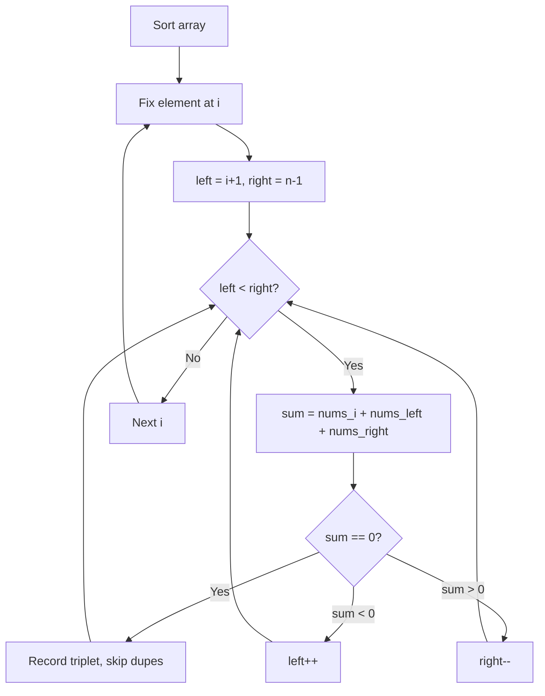

---

## Complexity Analysis

| Metric | Value |
|--------|-------|
| **Time** | O(n^2) |
| **Space** | O(1) extra |

---

## Solution Code

### Python3

```python
class Solution:
    def threeSum(self, nums: list[int]) -> list[list[int]]:
        nums.sort()
        result = []
        for i in range(len(nums) - 2):
            if i > 0 and nums[i] == nums[i - 1]:
                continue
            left, right = i + 1, len(nums) - 1
            while left < right:
                total = nums[i] + nums[left] + nums[right]
                if total < 0:
                    left += 1
                elif total > 0:
                    right -= 1
                else:
                    result.append([nums[i], nums[left], nums[right]])
                    while left < right and nums[left] == nums[left + 1]:
                        left += 1
                    while left < right and nums[right] == nums[right - 1]:
                        right -= 1
                    left += 1
                    right -= 1
        return result
```

### C++

```cpp
#include <algorithm>
#include <string>
#include <vector>
using namespace std;

class Solution {
public:
    vector<vector<int>> threeSum(vector<int>& nums) {
        // Sort + two pointers - O(n log n) time
        sort(nums.begin(), nums.end());
        int left = 0, right = nums.size() - 1;
        while (left < right) {
            int curr = nums[left] + nums[right];
            if (curr < nums) {
                left++;
            } else {
                right--;
            }
        }
        return {};
    }
};
```

### Summary

| Aspect | Detail |
|--------|--------|
| **Pattern** | Two Pointers |
| **Time** | O(n^2) |
| **Space** | O(1) extra |

---
---

# Problem 16: 3Sum Closest

| Attribute | Detail |
|-----------|--------|
| **ID** | 16 |
| **Title** | 3Sum Closest |
| **Difficulty** | Medium |
| **Tags** | Array, Two Pointers, Sorting |
| **Link** | [leetcode.com/problems/3sum-closest](https://leetcode.com/problems/3sum-closest/) |

Given an integer array `nums` of length `n` and an integer `target`, find three integers at **distinct indices** in `nums` such that the sum is closest to `target`.

Return *the sum of the three integers*.

You may assume that each input would have exactly one solution.

 

Example 1:

```

**Input:** nums = [-1,2,1,-4], target = 1
**Output:** 2
**Explanation:** The sum that is closest to the target is 2. (-1 + 2 + 1 = 2).

```

Example 2:

```

**Input:** nums = [0,0,0], target = 1
**Output:** 0
**Explanation:** The sum that is closest to the target is 0. (0 + 0 + 0 = 0).

```

 

**Constraints:**

	- `3 <= nums.length <= 500`
	- `-1000 <= nums[i] <= 1000`
	- `-10^4 <= target <= 10^4`

---

## Approach: Two Pointers

Sort + two pointers. Track the closest sum seen so far. Adjust pointers based on comparison with target.

### Pseudo-code

```
1. Sort nums, closest = inf
2. Fix i, two pointers left/right
3. Track closest sum, adjust pointers
4. Return closest
```

---

## Algorithm Flow

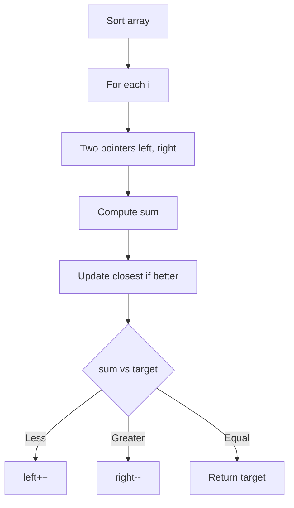

---

## Complexity Analysis

| Metric | Value |
|--------|-------|
| **Time** | O(n^2) |
| **Space** | O(1) |

---

## Solution Code

### Python3

```python
class Solution:
    def threeSumClosest(self, nums: list[int], target: int) -> int:
        nums.sort()
        closest = float('inf')
        for i in range(len(nums) - 2):
            left, right = i + 1, len(nums) - 1
            while left < right:
                total = nums[i] + nums[left] + nums[right]
                if abs(total - target) < abs(closest - target):
                    closest = total
                if total < target:
                    left += 1
                elif total > target:
                    right -= 1
                else:
                    return total
        return closest
```

### C++

```cpp
#include <algorithm>
#include <string>
#include <vector>
using namespace std;

class Solution {
public:
    int threeSumClosest(vector<int>& nums, int target) {
        // Sort + two pointers - O(n log n) time
        sort(nums.begin(), nums.end());
        int left = 0, right = nums.size() - 1;
        while (left < right) {
            int curr = nums[left] + nums[right];
            if (curr < target) {
                left++;
            } else {
                right--;
            }
        }
        return 0;
    }
};
```

### Summary

| Aspect | Detail |
|--------|--------|
| **Pattern** | Two Pointers |
| **Time** | O(n^2) |
| **Space** | O(1) |

---
---

# Problem 18: 4Sum

| Attribute | Detail |
|-----------|--------|
| **ID** | 18 |
| **Title** | 4Sum |
| **Difficulty** | Medium |
| **Tags** | Array, Two Pointers, Sorting |
| **Link** | [leetcode.com/problems/4sum](https://leetcode.com/problems/4sum/) |

Given an array `nums` of `n` integers, return *an array of all the **unique** quadruplets* `[nums[a], nums[b], nums[c], nums[d]]` such that:

	- `0 <= a, b, c, d < n`
	- `a`, `b`, `c`, and `d` are **distinct**.
	- `nums[a] + nums[b] + nums[c] + nums[d] == target`

You may return the answer in **any order**.

 

Example 1:

```

**Input:** nums = [1,0,-1,0,-2,2], target = 0
**Output:** [[-2,-1,1,2],[-2,0,0,2],[-1,0,0,1]]

```

Example 2:

```

**Input:** nums = [2,2,2,2,2], target = 8
**Output:** [[2,2,2,2]]

```

 

**Constraints:**

	- `1 <= nums.length <= 200`
	- `-10^9 <= nums[i] <= 10^9`
	- `-10^9 <= target <= 10^9`

---

## Approach: Two Pointers

Extension of 3Sum: fix two elements, use two pointers for the remaining two. Skip duplicates at all levels.

### Pseudo-code

```
1. Sort nums
2. Fix i, fix j > i
3. Two pointers left=j+1, right=n-1
4. Find quads summing to target, skip dupes
```

---

## Algorithm Flow

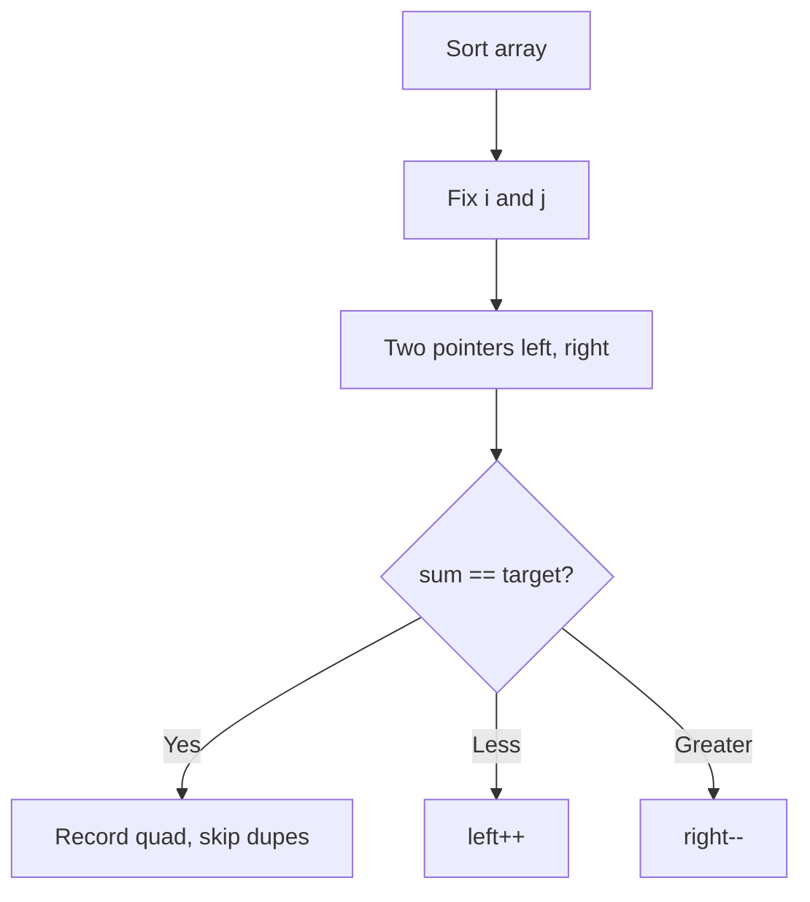

---

## Complexity Analysis

| Metric | Value |
|--------|-------|
| **Time** | O(n^3) |
| **Space** | O(1) extra |

---

## Solution Code

### Python3

```python
class Solution:
    def fourSum(self, nums: list[int], target: int) -> list[list[int]]:
        nums.sort()
        result = []
        n = len(nums)
        for i in range(n - 3):
            if i > 0 and nums[i] == nums[i - 1]:
                continue
            for j in range(i + 1, n - 2):
                if j > i + 1 and nums[j] == nums[j - 1]:
                    continue
                left, right = j + 1, n - 1
                while left < right:
                    total = nums[i] + nums[j] + nums[left] + nums[right]
                    if total < target:
                        left += 1
                    elif total > target:
                        right -= 1
                    else:
                        result.append([nums[i], nums[j], nums[left], nums[right]])
                        while left < right and nums[left] == nums[left + 1]:
                            left += 1
                        while left < right and nums[right] == nums[right - 1]:
                            right -= 1
                        left += 1
                        right -= 1
        return result
```

### C++

```cpp
#include <algorithm>
#include <string>
#include <vector>
using namespace std;

class Solution {
public:
    vector<vector<int>> fourSum(vector<int>& nums, int target) {
        // Sort + two pointers - O(n log n) time
        sort(nums.begin(), nums.end());
        int left = 0, right = nums.size() - 1;
        while (left < right) {
            int curr = nums[left] + nums[right];
            if (curr < target) {
                left++;
            } else {
                right--;
            }
        }
        return {};
    }
};
```

### Summary

| Aspect | Detail |
|--------|--------|
| **Pattern** | Two Pointers |
| **Time** | O(n^3) |
| **Space** | O(1) extra |

---
---

# Problem 49: Group Anagrams

| Attribute | Detail |
|-----------|--------|
| **ID** | 49 |
| **Title** | Group Anagrams |
| **Difficulty** | Medium |
| **Tags** | Array, Hash Table, String, Sorting |
| **Link** | [leetcode.com/problems/group-anagrams](https://leetcode.com/problems/group-anagrams/) |

Given an array of strings `strs`, group the anagrams together. You can return the answer in **any order**.

 

Example 1:

**Input:** strs = ["eat","tea","tan","ate","nat","bat"]

**Output:** [["bat"],["nat","tan"],["ate","eat","tea"]]

**Explanation:**

	- There is no string in strs that can be rearranged to form `"bat"`.
	- The strings `"nat"` and `"tan"` are anagrams as they can be rearranged to form each other.
	- The strings `"ate"`, `"eat"`, and `"tea"` are anagrams as they can be rearranged to form each other.

Example 2:

**Input:** strs = [""]

**Output:** [[""]]

Example 3:

**Input:** strs = ["a"]

**Output:** [["a"]]

 

**Constraints:**

	- `1 <= strs.length <= 10^4`
	- `0 <= strs[i].length <= 100`
	- `strs[i]` consists of lowercase English letters.

---

## Approach: Hash Map / Sorting

Group strings by their sorted version as key. All anagrams share the same sorted form.

### Pseudo-code

```
1. For each string: sort it to get key
2. Group strings by key in a dict
3. Return all groups
```

---

## Algorithm Flow

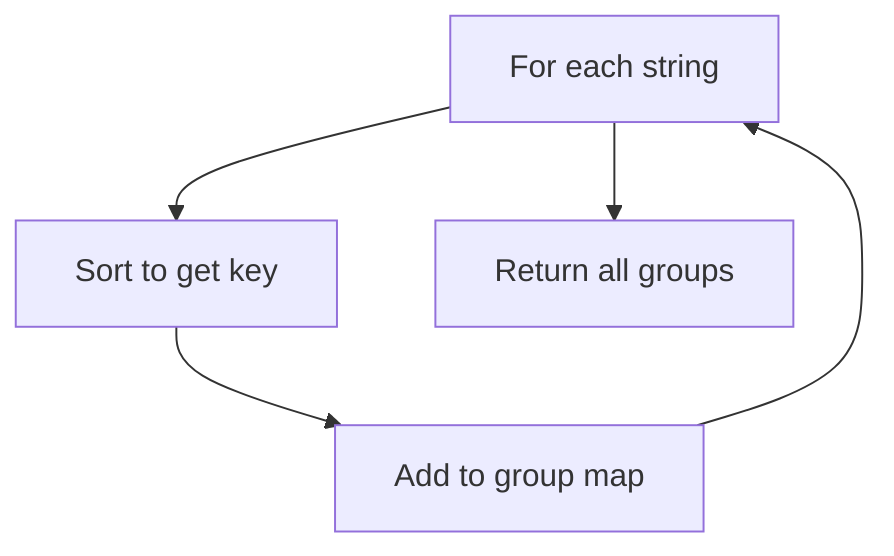

---

## Complexity Analysis

| Metric | Value |
|--------|-------|
| **Time** | O(n * k log k) |
| **Space** | O(n * k) |

---

## Solution Code

### Python3

```python
from collections import defaultdict

class Solution:
    def groupAnagrams(self, strs: list[str]) -> list[list[str]]:
        groups = defaultdict(list)
        for s in strs:
            key = ''.join(sorted(s))
            groups[key].append(s)
        return list(groups.values())
```

### C++

```cpp
#include <algorithm>
#include <string>
#include <vector>
using namespace std;

class Solution {
public:
    vector<vector<string>> groupAnagrams(vector<string>& strs) {
        // Sort-based approach - O(n log n) time
        sort(strs.begin(), strs.end());
        vector<vector<int>> result;
        result.push_back(strs[0]);
        for (int i = 1; i < (int)strs.size(); i++) {
            if (strs[i][0] <= result.back()[1]) {
                result.back()[1] = max(result.back()[1], strs[i][1]);
            } else {
                result.push_back(strs[i]);
            }
        }
        return result;
    }
};
```

### Summary

| Aspect | Detail |
|--------|--------|
| **Pattern** | Hash Map / Sorting |
| **Time** | O(n * k log k) |
| **Space** | O(n * k) |

---
---

# Problem 56: Merge Intervals

| Attribute | Detail |
|-----------|--------|
| **ID** | 56 |
| **Title** | Merge Intervals |
| **Difficulty** | Medium |
| **Tags** | Array, Sorting |
| **Link** | [leetcode.com/problems/merge-intervals](https://leetcode.com/problems/merge-intervals/) |

Given an array of `intervals` where `intervals[i] = [starti, endi]`, merge all overlapping intervals, and return *an array of the non-overlapping intervals that cover all the intervals in the input*.

 

Example 1:

```

**Input:** intervals = [[1,3],[2,6],[8,10],[15,18]]
**Output:** [[1,6],[8,10],[15,18]]
**Explanation:** Since intervals [1,3] and [2,6] overlap, merge them into [1,6].

```

Example 2:

```

**Input:** intervals = [[1,4],[4,5]]
**Output:** [[1,5]]
**Explanation:** Intervals [1,4] and [4,5] are considered overlapping.

```

Example 3:

```

**Input:** intervals = [[4,7],[1,4]]
**Output:** [[1,7]]
**Explanation:** Intervals [1,4] and [4,7] are considered overlapping.

```

 

**Constraints:**

	- `1 <= intervals.length <= 10^4`
	- `intervals[i].length == 2`
	- `0 <= starti <= endi <= 10^4`

---

## Approach: Intervals / Sort

Sort by start time. Merge overlapping intervals by extending the end of the last merged interval.

### Pseudo-code

```
1. Sort intervals by start
2. For each interval:
   If overlaps with last merged: extend end
   Else: add new interval
```

---

## Algorithm Flow

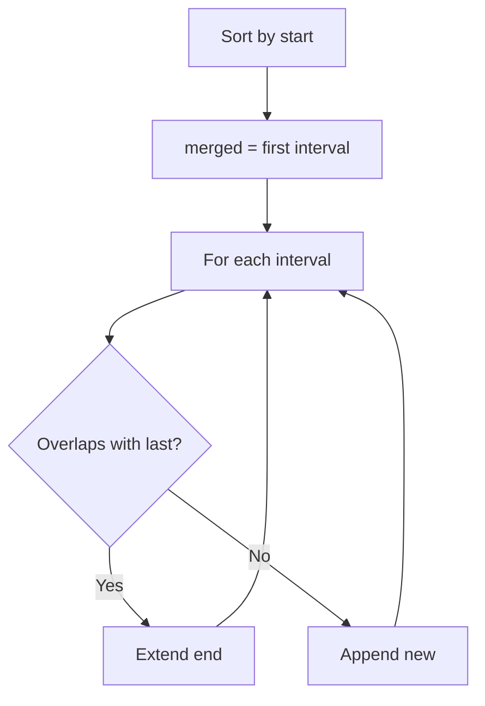

---

## Complexity Analysis

| Metric | Value |
|--------|-------|
| **Time** | O(n log n) |
| **Space** | O(n) |

---

## Solution Code

### Python3

```python
class Solution:
    def merge(self, intervals: list[list[int]]) -> list[list[int]]:
        intervals.sort()
        merged = [intervals[0]]
        for start, end in intervals[1:]:
            if start <= merged[-1][1]:
                merged[-1][1] = max(merged[-1][1], end)
            else:
                merged.append([start, end])
        return merged
```

### C++

```cpp
#include <algorithm>
#include <string>
#include <vector>
using namespace std;

class Solution {
public:
    vector<vector<int>> merge(vector<vector<int>>& intervals) {
        // Sort-based approach - O(n log n) time
        sort(intervals.begin(), intervals.end());
        vector<vector<int>> result;
        result.push_back(intervals[0]);
        for (int i = 1; i < (int)intervals.size(); i++) {
            if (intervals[i][0] <= result.back()[1]) {
                result.back()[1] = max(result.back()[1], intervals[i][1]);
            } else {
                result.push_back(intervals[i]);
            }
        }
        return result;
    }
};
```

### Summary

| Aspect | Detail |
|--------|--------|
| **Pattern** | Intervals / Sort |
| **Time** | O(n log n) |
| **Space** | O(n) |

---
---

# Problem 75: Sort Colors

| Attribute | Detail |
|-----------|--------|
| **ID** | 75 |
| **Title** | Sort Colors |
| **Difficulty** | Medium |
| **Tags** | Array, Two Pointers, Sorting |
| **Link** | [leetcode.com/problems/sort-colors](https://leetcode.com/problems/sort-colors/) |

Given an array `nums` with `n` objects colored red, white, or blue, sort them **in-place **so that objects of the same color are adjacent, with the colors in the order red, white, and blue.

We will use the integers `0`, `1`, and `2` to represent the color red, white, and blue, respectively.

You must solve this problem without using the library's sort function.

 

Example 1:

```

**Input:** nums = [2,0,2,1,1,0]
**Output:** [0,0,1,1,2,2]

```

Example 2:

```

**Input:** nums = [2,0,1]
**Output:** [0,1,2]

```

 

**Constraints:**

	- `n == nums.length`
	- `1 <= n <= 300`
	- `nums[i]` is either `0`, `1`, or `2`.

 

**Follow up:** Could you come up with a one-pass algorithm using only constant extra space?

---

## Approach: Dutch National Flag / Three Pointers

**Dutch National Flag:** Three pointers (lo, mid, hi). 0s go to front, 2s go to back, 1s stay in middle.

### Pseudo-code

```
1. lo=0, mid=0, hi=n-1
2. While mid <= hi:
   0: swap with lo, advance both
   1: advance mid
   2: swap with hi, decrement hi
```

---

## Algorithm Flow

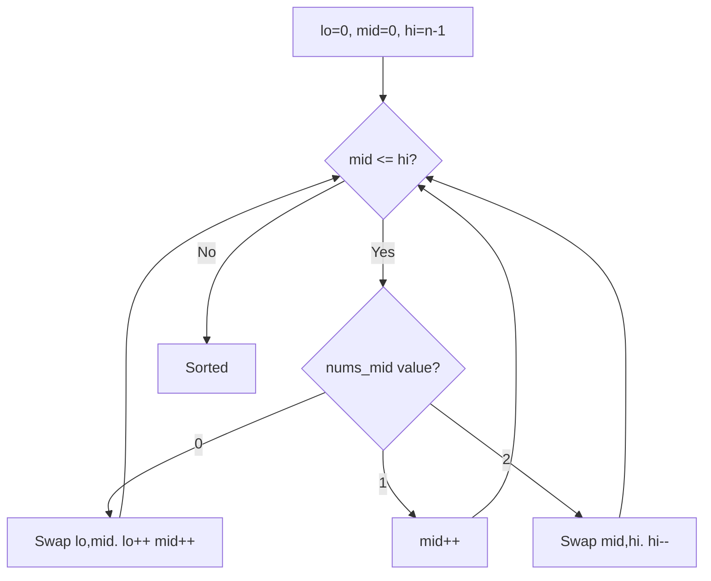

---

## Complexity Analysis

| Metric | Value |
|--------|-------|
| **Time** | O(n) |
| **Space** | O(1) |

---

## Solution Code

### Python3

```python
class Solution:
    def sortColors(self, nums: list[int]) -> None:
        lo, mid, hi = 0, 0, len(nums) - 1
        while mid <= hi:
            if nums[mid] == 0:
                nums[lo], nums[mid] = nums[mid], nums[lo]
                lo += 1; mid += 1
            elif nums[mid] == 1:
                mid += 1
            else:
                nums[mid], nums[hi] = nums[hi], nums[mid]
                hi -= 1
```

### C++

```cpp
#include <algorithm>
#include <string>
#include <vector>
using namespace std;

class Solution {
public:
    void sortColors(vector<int>& nums) {
        // Sort + two pointers - O(n log n) time
        sort(nums.begin(), nums.end());
        int left = 0, right = nums.size() - 1;
        while (left < right) {
            int curr = nums[left] + nums[right];
            if (curr < nums) {
                left++;
            } else {
                right--;
            }
        }
        return ;
    }
};
```

### Summary

| Aspect | Detail |
|--------|--------|
| **Pattern** | Dutch National Flag / Three Pointers |
| **Time** | O(n) |
| **Space** | O(1) |

---
---

# Problem 88: Merge Sorted Array

| Attribute | Detail |
|-----------|--------|
| **ID** | 88 |
| **Title** | Merge Sorted Array |
| **Difficulty** | Easy |
| **Tags** | Array, Two Pointers, Sorting |
| **Link** | [leetcode.com/problems/merge-sorted-array](https://leetcode.com/problems/merge-sorted-array/) |

You are given two integer arrays `nums1` and `nums2`, sorted in **non-decreasing order**, and two integers `m` and `n`, representing the number of elements in `nums1` and `nums2` respectively.

**Merge** `nums1` and `nums2` into a single array sorted in **non-decreasing order**.

The final sorted array should not be returned by the function, but instead be *stored inside the array *`nums1`. To accommodate this, `nums1` has a length of `m + n`, where the first `m` elements denote the elements that should be merged, and the last `n` elements are set to `0` and should be ignored. `nums2` has a length of `n`.

 

Example 1:

```

**Input:** nums1 = [1,2,3,0,0,0], m = 3, nums2 = [2,5,6], n = 3
**Output:** [1,2,2,3,5,6]
**Explanation:** The arrays we are merging are [1,2,3] and [2,5,6].
The result of the merge is [1,2,2,3,5,6] with the underlined elements coming from nums1.

```

Example 2:

```

**Input:** nums1 = [1], m = 1, nums2 = [], n = 0
**Output:** [1]
**Explanation:** The arrays we are merging are [1] and [].
The result of the merge is [1].

```

Example 3:

```

**Input:** nums1 = [0], m = 0, nums2 = [1], n = 1
**Output:** [1]
**Explanation:** The arrays we are merging are [] and [1].
The result of the merge is [1].
Note that because m = 0, there are no elements in nums1. The 0 is only there to ensure the merge result can fit in nums1.

```

 

**Constraints:**

	- `nums1.length == m + n`
	- `nums2.length == n`
	- `0 <= m, n <= 200`
	- `1 <= m + n <= 200`
	- `-10^9 <= nums1[i], nums2[j] <= 10^9`

 

**Follow up: **Can you come up with an algorithm that runs in `O(m + n)` time?

---

## Approach: Two Pointers / Merge

Merge from the end to avoid overwriting. Fill nums1 from position m+n-1 backwards.

### Pseudo-code

```
1. i=m-1, j=n-1, k=m+n-1
2. While j >= 0: pick larger of nums1[i], nums2[j]
3. Place at nums1[k], decrement pointers
```

---

## Algorithm Flow

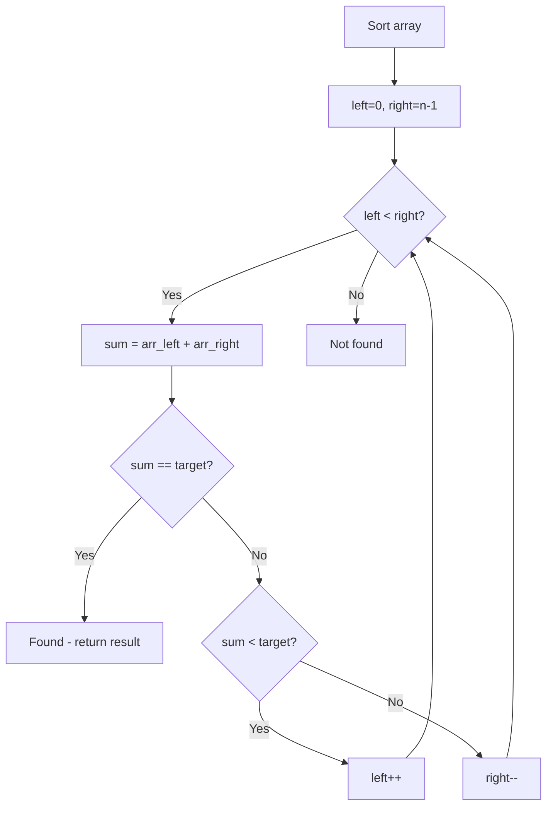

---

## Complexity Analysis

| Metric | Value |
|--------|-------|
| **Time** | O(m+n) |
| **Space** | O(1) |

---

## Solution Code

### Python3

```python
class Solution:
    def merge(self, nums1: list[int], m: int, nums2: list[int], n: int) -> None:
        i, j, k = m - 1, n - 1, m + n - 1
        while j >= 0:
            if i >= 0 and nums1[i] > nums2[j]:
                nums1[k] = nums1[i]
                i -= 1
            else:
                nums1[k] = nums2[j]
                j -= 1
            k -= 1
```

### C++

```cpp
#include <algorithm>
#include <string>
#include <vector>
using namespace std;

class Solution {
public:
    void merge(vector<int>& nums1, int m, vector<int>& nums2, int n) {
        // Sort + two pointers - O(n log n) time
        sort(nums1.begin(), nums1.end());
        int left = 0, right = nums1.size() - 1;
        while (left < right) {
            int curr = nums1[left] + nums1[right];
            if (curr < m) {
                left++;
            } else {
                right--;
            }
        }
        return ;
    }
};
```

### Summary

| Aspect | Detail |
|--------|--------|
| **Pattern** | Two Pointers / Merge |
| **Time** | O(m+n) |
| **Space** | O(1) |

---
---

# Problem 164: Maximum Gap

| Attribute | Detail |
|-----------|--------|
| **ID** | 164 |
| **Title** | Maximum Gap |
| **Difficulty** | Medium |
| **Tags** | Array, Sorting, Bucket Sort, Radix Sort |
| **Link** | [leetcode.com/problems/maximum-gap](https://leetcode.com/problems/maximum-gap/) |

Given an integer array `nums`, return *the maximum difference between two successive elements in its sorted form*. If the array contains less than two elements, return `0`.

You must write an algorithm that runs in linear time and uses linear extra space.

 

Example 1:

```

**Input:** nums = [3,6,9,1]
**Output:** 3
**Explanation:** The sorted form of the array is [1,3,6,9], either (3,6) or (6,9) has the maximum difference 3.

```

Example 2:

```

**Input:** nums = [10]
**Output:** 0
**Explanation:** The array contains less than 2 elements, therefore return 0.

```

 

**Constraints:**

	- `1 <= nums.length <= 10^5`
	- `0 <= nums[i] <= 10^9`

---

## Approach: Sorting

Sort the data to enable efficient processing. After sorting, use techniques like binary search, two pointers, or linear scan to solve the problem.

### Pseudo-code

```
1. Sort the input array
2. Process sorted data:
   - Use binary search for lookups
   - Use two pointers for pair finding
   - Scan for adjacent patterns
3. Return result
```

---

## Algorithm Flow

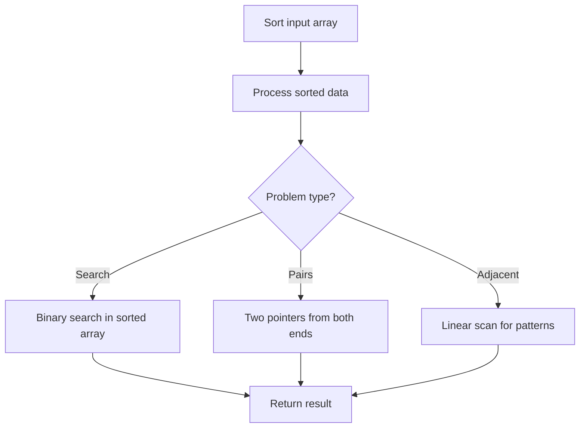

---

## Complexity Analysis

| Metric | Value |
|--------|-------|
| **Time** | O(n log n) |
| **Space** | O(n) |

---

## Solution Code

### Python3

```python
class Solution:
    def maximumGap(self, nums: List[int]) -> int:
        # Sort-based approach - O(n log n) time
        nums.sort(key=lambda x: x[0] if isinstance(x, (list, tuple)) else x)
        result = [nums[0]]
        for i in range(1, len(nums)):
            curr = nums[i]
            if isinstance(curr, (list, tuple)) and isinstance(result[-1], (list, tuple)):
                if curr[0] <= result[-1][1]:
                    result[-1] = [result[-1][0], max(result[-1][1], curr[1])]
                else:
                    result.append(curr)
            else:
                result.append(curr)
        return result
```

### C++

```cpp
#include <algorithm>
#include <string>
#include <vector>
using namespace std;

class Solution {
public:
    int maximumGap(vector<int>& nums) {
        // Sort-based approach - O(n log n) time
        sort(nums.begin(), nums.end());
        vector<vector<int>> result;
        result.push_back(nums[0]);
        for (int i = 1; i < (int)nums.size(); i++) {
            if (nums[i][0] <= result.back()[1]) {
                result.back()[1] = max(result.back()[1], nums[i][1]);
            } else {
                result.push_back(nums[i]);
            }
        }
        return result;
    }
};
```

### Summary

| Aspect | Detail |
|--------|--------|
| **Pattern** | Sorting |
| **Time** | O(n log n) |
| **Space** | O(n) |

---
---

# Problem 169: Majority Element

| Attribute | Detail |
|-----------|--------|
| **ID** | 169 |
| **Title** | Majority Element |
| **Difficulty** | Easy |
| **Tags** | Array, Hash Table, Divide and Conquer, Sorting, Counting |
| **Link** | [leetcode.com/problems/majority-element](https://leetcode.com/problems/majority-element/) |

Given an array `nums` of size `n`, return *the majority element*.

The majority element is the element that appears more than `⌊n / 2⌋` times. You may assume that the majority element always exists in the array.

 

Example 1:

```
**Input:** nums = [3,2,3]
**Output:** 3

```
Example 2:

```
**Input:** nums = [2,2,1,1,1,2,2]
**Output:** 2

```

 

**Constraints:**

	- `n == nums.length`
	- `1 <= n <= 5 * 10^4`
	- `-10^9 <= nums[i] <= 10^9`
	- The input is generated such that a majority element will exist in the array.

 

**Follow-up:** Could you solve the problem in linear time and in `O(1)` space?

---

## Approach: Boyer-Moore Voting

**Boyer-Moore Voting:** Maintain a candidate and count. The majority element survives all cancellations.

### Pseudo-code

```
1. candidate=0, count=0
2. For each num:
   If count==0: candidate = num
   count += 1 if same else -1
3. Return candidate
```

---

## Algorithm Flow

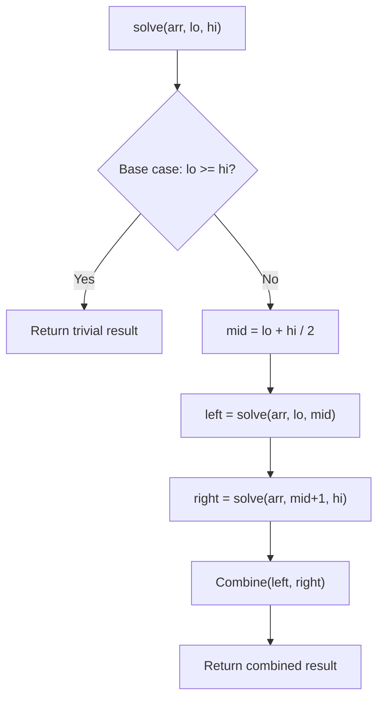

---

## Complexity Analysis

| Metric | Value |
|--------|-------|
| **Time** | O(n) |
| **Space** | O(1) |

---

## Solution Code

### Python3

```python
class Solution:
    def majorityElement(self, nums: list[int]) -> int:
        candidate = count = 0
        for num in nums:
            if count == 0:
                candidate = num
            count += 1 if num == candidate else -1
        return candidate
```

### C++

```cpp
#include <algorithm>
#include <functional>
#include <string>
#include <vector>
using namespace std;

class Solution {
public:
    int majorityElement(vector<int>& nums) {
        // Divide and conquer - O(n log n) time
        function<int(int, int)> solve = [&](int left, int right) -> int {
            if (left >= right) return left < (int)nums.size() ? nums[left] : 0;
            int mid = (left + right) / 2;
            int leftRes = solve(left, mid);
            int rightRes = solve(mid + 1, right);
            return max(leftRes, rightRes);
        };
        return nums.empty() ? 0 : solve(0, nums.size() - 1);
    }
};
```

### Summary

| Aspect | Detail |
|--------|--------|
| **Pattern** | Boyer-Moore Voting |
| **Time** | O(n) |
| **Space** | O(1) |

---
---

# Problem 215: Kth Largest Element in an Array

| Attribute | Detail |
|-----------|--------|
| **ID** | 215 |
| **Title** | Kth Largest Element in an Array |
| **Difficulty** | Medium |
| **Tags** | Array, Divide and Conquer, Sorting, Heap (Priority Queue), Quickselect |
| **Link** | [leetcode.com/problems/kth-largest-element-in-an-array](https://leetcode.com/problems/kth-largest-element-in-an-array/) |

Given an integer array `nums` and an integer `k`, return *the* `k^th` *largest element in the array*.

Note that it is the `k^th` largest element in the sorted order, not the `k^th` distinct element.

Can you solve it without sorting?

 

Example 1:

```
**Input:** nums = [3,2,1,5,6,4], k = 2
**Output:** 5

```
Example 2:

```
**Input:** nums = [3,2,3,1,2,4,5,5,6], k = 4
**Output:** 4

```

 

**Constraints:**

	- `1 <= k <= nums.length <= 10^5`
	- `-10^4 <= nums[i] <= 10^4`

---

## Approach: Heap / Quickselect

Use a min-heap of size k, or heapq.nlargest for simplicity.

### Pseudo-code

```
1. Return the kth largest using heap
2. heapq.nlargest(k, nums)[-1]
```

---

## Algorithm Flow

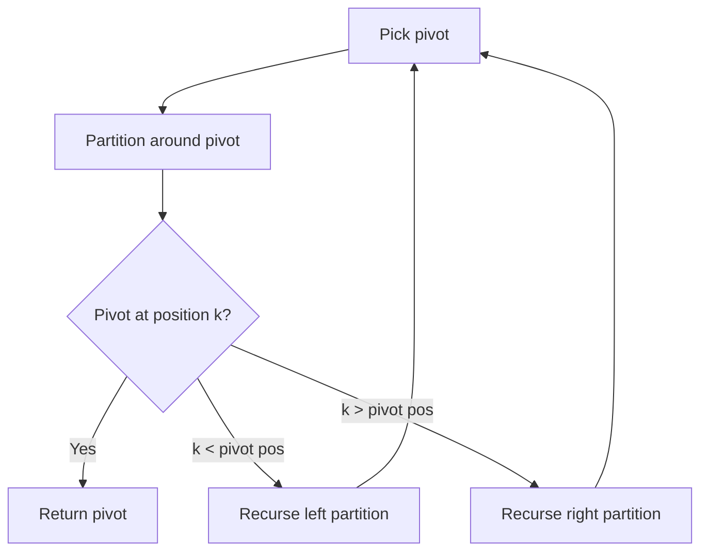

---

## Complexity Analysis

| Metric | Value |
|--------|-------|
| **Time** | O(n log k) |
| **Space** | O(k) |

---

## Solution Code

### Python3

```python
import heapq

class Solution:
    def findKthLargest(self, nums: list[int], k: int) -> int:
        return heapq.nlargest(k, nums)[-1]
```

### C++

```cpp
#include <algorithm>
#include <string>
#include <vector>
using namespace std;

class Solution {
public:
    int findKthLargest(vector<int>& nums, int k) {
        // Quickselect - O(n) average time
        int k = k;
        nth_element(nums.begin(), nums.begin() + nums.size() - k, nums.end());
        return nums[nums.size() - k];
    }
};
```

### Summary

| Aspect | Detail |
|--------|--------|
| **Pattern** | Heap / Quickselect |
| **Time** | O(n log k) |
| **Space** | O(k) |

---
---

# Problem 217: Contains Duplicate

| Attribute | Detail |
|-----------|--------|
| **ID** | 217 |
| **Title** | Contains Duplicate |
| **Difficulty** | Easy |
| **Tags** | Array, Hash Table, Sorting |
| **Link** | [leetcode.com/problems/contains-duplicate](https://leetcode.com/problems/contains-duplicate/) |

Given an integer array `nums`, return `true` if any value appears **at least twice** in the array, and return `false` if every element is distinct.

 

Example 1:

**Input:** nums = [1,2,3,1]

**Output:** true

**Explanation:**

The element 1 occurs at the indices 0 and 3.

Example 2:

**Input:** nums = [1,2,3,4]

**Output:** false

**Explanation:**

All elements are distinct.

Example 3:

**Input:** nums = [1,1,1,3,3,4,3,2,4,2]

**Output:** true

 

**Constraints:**

	- `1 <= nums.length <= 10^5`
	- `-10^9 <= nums[i] <= 10^9`

---

## Approach: Sorting

Sort the data to enable efficient processing. After sorting, use techniques like binary search, two pointers, or linear scan to solve the problem.

### Pseudo-code

```
1. Sort the input array
2. Process sorted data:
   - Use binary search for lookups
   - Use two pointers for pair finding
   - Scan for adjacent patterns
3. Return result
```

---

## Algorithm Flow


---

## Complexity Analysis

| Metric | Value |
|--------|-------|
| **Time** | O(n log n) |
| **Space** | O(n) |

---

## Solution Code

### Python3

```python
class Solution:
    def containsDuplicate(self, nums: List[int]) -> bool:
        # Sort-based approach - O(n log n) time
        nums.sort(key=lambda x: x[0] if isinstance(x, (list, tuple)) else x)
        result = [nums[0]]
        for i in range(1, len(nums)):
            curr = nums[i]
            if isinstance(curr, (list, tuple)) and isinstance(result[-1], (list, tuple)):
                if curr[0] <= result[-1][1]:
                    result[-1] = [result[-1][0], max(result[-1][1], curr[1])]
                else:
                    result.append(curr)
            else:
                result.append(curr)
        return result
```

### C++

```cpp
#include <algorithm>
#include <string>
#include <vector>
using namespace std;

class Solution {
public:
    bool containsDuplicate(vector<int>& nums) {
        // Sort-based approach - O(n log n) time
        sort(nums.begin(), nums.end());
        vector<vector<int>> result;
        result.push_back(nums[0]);
        for (int i = 1; i < (int)nums.size(); i++) {
            if (nums[i][0] <= result.back()[1]) {
                result.back()[1] = max(result.back()[1], nums[i][1]);
            } else {
                result.push_back(nums[i]);
            }
        }
        return result;
    }
};
```

### Summary

| Aspect | Detail |
|--------|--------|
| **Pattern** | Sorting |
| **Time** | O(n log n) |
| **Space** | O(n) |

---
---

# Problem 229: Majority Element II

| Attribute | Detail |
|-----------|--------|
| **ID** | 229 |
| **Title** | Majority Element II |
| **Difficulty** | Medium |
| **Tags** | Array, Hash Table, Sorting, Counting |
| **Link** | [leetcode.com/problems/majority-element-ii](https://leetcode.com/problems/majority-element-ii/) |

Given an integer array of size `n`, find all elements that appear more than `⌊ n/3 ⌋` times.

 

Example 1:

```

**Input:** nums = [3,2,3]
**Output:** [3]

```

Example 2:

```

**Input:** nums = [1]
**Output:** [1]

```

Example 3:

```

**Input:** nums = [1,2]
**Output:** [1,2]

```

 

**Constraints:**

	- `1 <= nums.length <= 5 * 10^4`
	- `-10^9 <= nums[i] <= 10^9`

 

**Follow up:** Could you solve the problem in linear time and in `O(1)` space?

---

## Approach: Sorting

Sort the data to enable efficient processing. After sorting, use techniques like binary search, two pointers, or linear scan to solve the problem.

### Pseudo-code

```
1. Sort the input array
2. Process sorted data:
   - Use binary search for lookups
   - Use two pointers for pair finding
   - Scan for adjacent patterns
3. Return result
```

---

## Algorithm Flow


---

## Complexity Analysis

| Metric | Value |
|--------|-------|
| **Time** | O(n log n) |
| **Space** | O(n) |

---

## Solution Code

### Python3

```python
class Solution:
    def majorityElement(self, nums: List[int]) -> List[int]:
        # Sort-based approach - O(n log n) time
        nums.sort(key=lambda x: x[0] if isinstance(x, (list, tuple)) else x)
        result = [nums[0]]
        for i in range(1, len(nums)):
            curr = nums[i]
            if isinstance(curr, (list, tuple)) and isinstance(result[-1], (list, tuple)):
                if curr[0] <= result[-1][1]:
                    result[-1] = [result[-1][0], max(result[-1][1], curr[1])]
                else:
                    result.append(curr)
            else:
                result.append(curr)
        return result
```

### C++

```cpp
#include <algorithm>
#include <string>
#include <vector>
using namespace std;

class Solution {
public:
    vector<int> majorityElement(vector<int>& nums) {
        // Sort-based approach - O(n log n) time
        sort(nums.begin(), nums.end());
        vector<vector<int>> result;
        result.push_back(nums[0]);
        for (int i = 1; i < (int)nums.size(); i++) {
            if (nums[i][0] <= result.back()[1]) {
                result.back()[1] = max(result.back()[1], nums[i][1]);
            } else {
                result.push_back(nums[i]);
            }
        }
        return result;
    }
};
```

### Summary

| Aspect | Detail |
|--------|--------|
| **Pattern** | Sorting |
| **Time** | O(n log n) |
| **Space** | O(n) |

---
---

# Problem 242: Valid Anagram

| Attribute | Detail |
|-----------|--------|
| **ID** | 242 |
| **Title** | Valid Anagram |
| **Difficulty** | Easy |
| **Tags** | Hash Table, String, Sorting |
| **Link** | [leetcode.com/problems/valid-anagram](https://leetcode.com/problems/valid-anagram/) |

Given two strings `s` and `t`, return `true` if `t` is an anagram of `s`, and `false` otherwise.

 

Example 1:

**Input:** s = "anagram", t = "nagaram"

**Output:** true

Example 2:

**Input:** s = "rat", t = "car"

**Output:** false

 

**Constraints:**

	- `1 <= s.length, t.length <= 5 * 10^4`
	- `s` and `t` consist of lowercase English letters.

 

**Follow up:** What if the inputs contain Unicode characters? How would you adapt your solution to such a case?

---

## Approach: Sorting

Sort the data to enable efficient processing. After sorting, use techniques like binary search, two pointers, or linear scan to solve the problem.

### Pseudo-code

```
1. Sort the input array
2. Process sorted data:
   - Use binary search for lookups
   - Use two pointers for pair finding
   - Scan for adjacent patterns
3. Return result
```

---

## Algorithm Flow


---

## Complexity Analysis

| Metric | Value |
|--------|-------|
| **Time** | O(n log n) |
| **Space** | O(n) |

---

## Solution Code

### Python3

```python
class Solution:
    def isAnagram(self, s: str, t: str) -> bool:
        # Sort-based approach - O(n log n) time
        s.sort(key=lambda x: x[0] if isinstance(x, (list, tuple)) else x)
        result = [s[0]]
        for i in range(1, len(s)):
            curr = s[i]
            if isinstance(curr, (list, tuple)) and isinstance(result[-1], (list, tuple)):
                if curr[0] <= result[-1][1]:
                    result[-1] = [result[-1][0], max(result[-1][1], curr[1])]
                else:
                    result.append(curr)
            else:
                result.append(curr)
        return result
```

### C++

```cpp
#include <algorithm>
#include <string>
#include <vector>
using namespace std;

class Solution {
public:
    bool isAnagram(string& s, string& t) {
        // Sort-based approach - O(n log n) time
        sort(s.begin(), s.end());
        vector<vector<int>> result;
        result.push_back(s[0]);
        for (int i = 1; i < (int)s.size(); i++) {
            if (s[i][0] <= result.back()[1]) {
                result.back()[1] = max(result.back()[1], s[i][1]);
            } else {
                result.push_back(s[i]);
            }
        }
        return result;
    }
};
```

### Summary

| Aspect | Detail |
|--------|--------|
| **Pattern** | Sorting |
| **Time** | O(n log n) |
| **Space** | O(n) |

---
---

# Problem 252: Meeting Rooms

| Attribute | Detail |
|-----------|--------|
| **ID** | 252 |
| **Title** | Meeting Rooms |
| **Difficulty** | Easy |
| **Tags** | Array, Sorting |
| **Link** | [leetcode.com/problems/meeting-rooms](https://leetcode.com/problems/meeting-rooms/) |

*(Premium problem -- description requires LeetCode subscription)*

---

## Approach: Sorting

Sort the data to enable efficient processing. After sorting, use techniques like binary search, two pointers, or linear scan to solve the problem.

### Pseudo-code

```
1. Sort the input array
2. Process sorted data:
   - Use binary search for lookups
   - Use two pointers for pair finding
   - Scan for adjacent patterns
3. Return result
```

---

## Algorithm Flow


---

## Complexity Analysis

| Metric | Value |
|--------|-------|
| **Time** | O(n log n) |
| **Space** | O(n) |

---

## Solution Code

### Python3

```python
class Solution:
    pass
```

### C++

```cpp
class Solution {
public:
    // Design problem stub
};
```

### Summary

| Aspect | Detail |
|--------|--------|
| **Pattern** | Sorting |
| **Time** | O(n log n) |
| **Space** | O(n) |

---
---

# Problem 274: H-Index

| Attribute | Detail |
|-----------|--------|
| **ID** | 274 |
| **Title** | H-Index |
| **Difficulty** | Medium |
| **Tags** | Array, Sorting, Counting Sort |
| **Link** | [leetcode.com/problems/h-index](https://leetcode.com/problems/h-index/) |

Given an array of integers `citations` where `citations[i]` is the number of citations a researcher received for their `i^th` paper, return *the researcher's h-index*.

According to the definition of h-index on Wikipedia: The h-index is defined as the maximum value of `h` such that the given researcher has published at least `h` papers that have each been cited at least `h` times.

 

Example 1:

```

**Input:** citations = [3,0,6,1,5]
**Output:** 3
**Explanation:** [3,0,6,1,5] means the researcher has 5 papers in total and each of them had received 3, 0, 6, 1, 5 citations respectively.
Since the researcher has 3 papers with at least 3 citations each and the remaining two with no more than 3 citations each, their h-index is 3.

```

Example 2:

```

**Input:** citations = [1,3,1]
**Output:** 1

```

 

**Constraints:**

	- `n == citations.length`
	- `1 <= n <= 5000`
	- `0 <= citations[i] <= 1000`

---

## Approach: Sorting

Sort the data to enable efficient processing. After sorting, use techniques like binary search, two pointers, or linear scan to solve the problem.

### Pseudo-code

```
1. Sort the input array
2. Process sorted data:
   - Use binary search for lookups
   - Use two pointers for pair finding
   - Scan for adjacent patterns
3. Return result
```

---

## Algorithm Flow


---

## Complexity Analysis

| Metric | Value |
|--------|-------|
| **Time** | O(n log n) |
| **Space** | O(n) |

---

## Solution Code

### Python3

```python
class Solution:
    def hIndex(self, citations: List[int]) -> int:
        # Sort-based approach - O(n log n) time
        citations.sort(key=lambda x: x[0] if isinstance(x, (list, tuple)) else x)
        result = [citations[0]]
        for i in range(1, len(citations)):
            curr = citations[i]
            if isinstance(curr, (list, tuple)) and isinstance(result[-1], (list, tuple)):
                if curr[0] <= result[-1][1]:
                    result[-1] = [result[-1][0], max(result[-1][1], curr[1])]
                else:
                    result.append(curr)
            else:
                result.append(curr)
        return result
```

### C++

```cpp
#include <algorithm>
#include <string>
#include <vector>
using namespace std;

class Solution {
public:
    int hIndex(vector<int>& citations) {
        // Sort-based approach - O(n log n) time
        sort(citations.begin(), citations.end());
        vector<vector<int>> result;
        result.push_back(citations[0]);
        for (int i = 1; i < (int)citations.size(); i++) {
            if (citations[i][0] <= result.back()[1]) {
                result.back()[1] = max(result.back()[1], citations[i][1]);
            } else {
                result.push_back(citations[i]);
            }
        }
        return result;
    }
};
```

### Summary

| Aspect | Detail |
|--------|--------|
| **Pattern** | Sorting |
| **Time** | O(n log n) |
| **Space** | O(n) |

---
---

# Problem 296: Best Meeting Point

| Attribute | Detail |
|-----------|--------|
| **ID** | 296 |
| **Title** | Best Meeting Point |
| **Difficulty** | Hard |
| **Tags** | Array, Math, Sorting, Matrix |
| **Link** | [leetcode.com/problems/best-meeting-point](https://leetcode.com/problems/best-meeting-point/) |

*(Premium problem -- description requires LeetCode subscription)*

---

## Approach: Sorting

Sort the data to enable efficient processing. After sorting, use techniques like binary search, two pointers, or linear scan to solve the problem.

### Pseudo-code

```
1. Sort the input array
2. Process sorted data:
   - Use binary search for lookups
   - Use two pointers for pair finding
   - Scan for adjacent patterns
3. Return result
```

---

## Algorithm Flow


---

## Complexity Analysis

| Metric | Value |
|--------|-------|
| **Time** | O(n log n) |
| **Space** | O(n) |

---

## Solution Code

### Python3

```python
class Solution:
    pass
```

### C++

```cpp
class Solution {
public:
    // Design problem stub
};
```

### Summary

| Aspect | Detail |
|--------|--------|
| **Pattern** | Sorting |
| **Time** | O(n log n) |
| **Space** | O(n) |

---
---

# Problem 314: Binary Tree Vertical Order Traversal

| Attribute | Detail |
|-----------|--------|
| **ID** | 314 |
| **Title** | Binary Tree Vertical Order Traversal |
| **Difficulty** | Medium |
| **Tags** | Hash Table, Tree, Depth-First Search, Breadth-First Search, Sorting, Binary Tree |
| **Link** | [leetcode.com/problems/binary-tree-vertical-order-traversal](https://leetcode.com/problems/binary-tree-vertical-order-traversal/) |

*(Premium problem -- description requires LeetCode subscription)*

---

## Approach: DFS Tree Traversal

Perform depth-first search on the tree. Recurse on left and right subtrees, combining results bottom-up. Track state (path, depth, sum) during traversal.

### Pseudo-code

```
1. Define dfs(node, state):
   a. Base case: if null, return default
   b. Process node with current state
   c. left_result = dfs(node.left, updated_state)
   d. right_result = dfs(node.right, updated_state)
   e. Return combine(left_result, right_result)
2. Return dfs(root, initial_state)
```

---

## Algorithm Flow

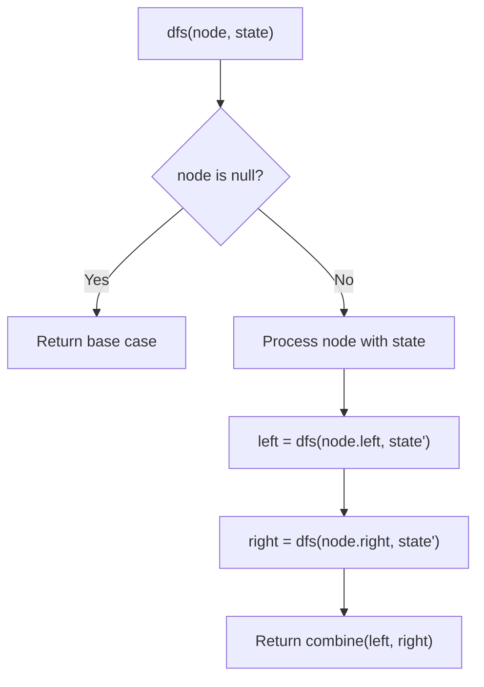

## Visual State Transitions

**DFS Tree Traversal Step-by-Step:**

**Frame 1: Start at root**
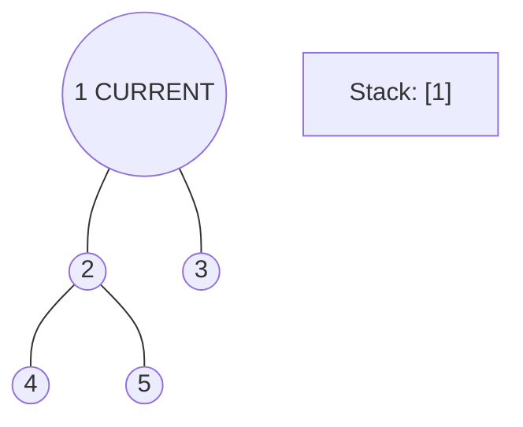

**Frame 2: Go left - visit node 2**
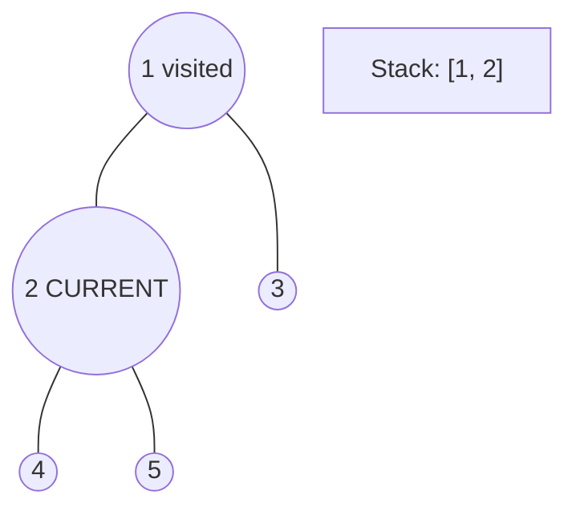

**Frame 3: Go left - visit node 4 (leaf)**
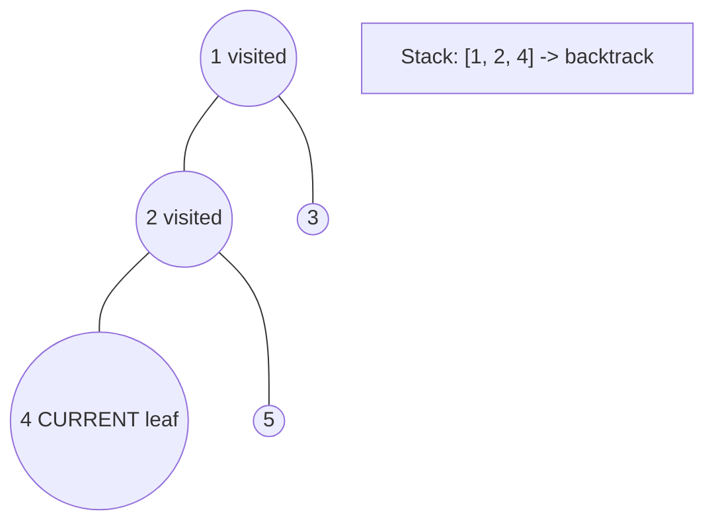

**Frame 4: Backtrack, visit node 5, then node 3**
```mermaid
graph TD
    A(("1 visited"))
    A --- B(("2 visited"))
    A --- C(("3 CURRENT"))
    B --- D(("4 visited"))
    B --- E(("5 visited"))
    S["All nodes visited, DFS complete"]
```


---

## Complexity Analysis

| Metric | Value |
|--------|-------|
| **Time** | O(n) |
| **Space** | O(h) |

---

## Solution Code

### Python3

```python
class Solution:
    pass
```

### C++

```cpp
class Solution {
public:
    // Design problem stub
};
```

### Summary

| Aspect | Detail |
|--------|--------|
| **Pattern** | DFS Tree Traversal |
| **Time** | O(n) |
| **Space** | O(h) |

---
---

# Problem 347: Top K Frequent Elements

| Attribute | Detail |
|-----------|--------|
| **ID** | 347 |
| **Title** | Top K Frequent Elements |
| **Difficulty** | Medium |
| **Tags** | Array, Hash Table, Divide and Conquer, Sorting, Heap (Priority Queue), Bucket Sort, Counting, Quickselect |
| **Link** | [leetcode.com/problems/top-k-frequent-elements](https://leetcode.com/problems/top-k-frequent-elements/) |

Given an integer array `nums` and an integer `k`, return *the* `k` *most frequent elements*. You may return the answer in **any order**.

 

Example 1:

**Input:** nums = [1,1,1,2,2,3], k = 2

**Output:** [1,2]

Example 2:

**Input:** nums = [1], k = 1

**Output:** [1]

Example 3:

**Input:** nums = [1,2,1,2,1,2,3,1,3,2], k = 2

**Output:** [1,2]

 

**Constraints:**

	- `1 <= nums.length <= 10^5`
	- `-10^4 <= nums[i] <= 10^4`
	- `k` is in the range `[1, the number of unique elements in the array]`.
	- It is **guaranteed** that the answer is **unique**.

 

**Follow up:** Your algorithm's time complexity must be better than `O(n log n)`, where n is the array's size.

---

## Approach: Hash Map / Heap

Count frequencies, return k most common elements.

### Pseudo-code

```
1. Count frequencies
2. Return top k by frequency
```

---

## Algorithm Flow

```mermaid
flowchart TD
    A[Pick pivot] --> B[Partition around pivot]
    B --> C{Pivot at position k?}
    C -- Yes --> D[Return pivot]
    C -- "k < pivot pos" --> E[Recurse left partition]
    C -- "k > pivot pos" --> F[Recurse right partition]
    E --> A
    F --> A
```

---

## Complexity Analysis

| Metric | Value |
|--------|-------|
| **Time** | O(n log k) |
| **Space** | O(n) |

---

## Solution Code

### Python3

```python
from collections import Counter

class Solution:
    def topKFrequent(self, nums: list[int], k: int) -> list[int]:
        count = Counter(nums)
        return [x for x, _ in count.most_common(k)]
```

### C++

```cpp
#include <algorithm>
#include <string>
#include <vector>
using namespace std;

class Solution {
public:
    vector<int> topKFrequent(vector<int>& nums, int k) {
        // Quickselect - O(n) average time
        int k = k;
        nth_element(nums.begin(), nums.begin() + nums.size() - k, nums.end());
        return nums[nums.size() - k];
    }
};
```

### Summary

| Aspect | Detail |
|--------|--------|
| **Pattern** | Hash Map / Heap |
| **Time** | O(n log k) |
| **Space** | O(n) |

---
---

# Problem 360: Sort Transformed Array

| Attribute | Detail |
|-----------|--------|
| **ID** | 360 |
| **Title** | Sort Transformed Array |
| **Difficulty** | Medium |
| **Tags** | Array, Math, Two Pointers, Sorting |
| **Link** | [leetcode.com/problems/sort-transformed-array](https://leetcode.com/problems/sort-transformed-array/) |

*(Premium problem -- description requires LeetCode subscription)*

---

## Approach: Two Pointers on Sorted Array

Sort the array first, then use two pointers converging from both ends. Move the left pointer right to increase the sum, or the right pointer left to decrease it.

### Pseudo-code

```
1. Sort the array
2. left = 0, right = n-1
3. While left < right:
   a. Compute current = arr[left] + arr[right]
   b. If current == target: found
   c. If current < target: left++
   d. If current > target: right--
4. Return result
```

---

## Algorithm Flow

```mermaid
flowchart TD
    A[Sort array] --> B[left=0, right=n-1]
    B --> C{left < right?}
    C -- Yes --> D[sum = arr_left + arr_right]
    D --> E{sum == target?}
    E -- Yes --> F[Found - return result]
    E -- No --> G{sum < target?}
    G -- Yes --> H[left++]
    G -- No --> I[right--]
    H --> C
    I --> C
    C -- No --> J[Not found]
```

---

## Complexity Analysis

| Metric | Value |
|--------|-------|
| **Time** | O(n log n) |
| **Space** | O(1) |

---

## Solution Code

### Python3

```python
class Solution:
    pass
```

### C++

```cpp
class Solution {
public:
    // Design problem stub
};
```

### Summary

| Aspect | Detail |
|--------|--------|
| **Pattern** | Two Pointers on Sorted Array |
| **Time** | O(n log n) |
| **Space** | O(1) |

---
---

# Problem 368: Largest Divisible Subset

| Attribute | Detail |
|-----------|--------|
| **ID** | 368 |
| **Title** | Largest Divisible Subset |
| **Difficulty** | Medium |
| **Tags** | Array, Math, Dynamic Programming, Sorting |
| **Link** | [leetcode.com/problems/largest-divisible-subset](https://leetcode.com/problems/largest-divisible-subset/) |

Given a set of **distinct** positive integers `nums`, return the largest subset `answer` such that every pair `(answer[i], answer[j])` of elements in this subset satisfies:

	- `answer[i] % answer[j] == 0`, or
	- `answer[j] % answer[i] == 0`

If there are multiple solutions, return any of them.

 

Example 1:

```

**Input:** nums = [1,2,3]
**Output:** [1,2]
**Explanation:** [1,3] is also accepted.

```

Example 2:

```

**Input:** nums = [1,2,4,8]
**Output:** [1,2,4,8]

```

 

**Constraints:**

	- `1 <= nums.length <= 1000`
	- `1 <= nums[i] <= 2 * 10^9`
	- All the integers in `nums` are **unique**.

---

## Approach: Dynamic Programming (1D)

Break the problem into overlapping subproblems. Define dp[i] as the optimal value for the subproblem ending at or considering index i. Build the solution bottom-up, using previously computed dp values.

### Pseudo-code

```
1. Define dp[i] = optimal value for subproblem i
2. Base case: dp[0] = initial value
3. For i from 1 to n:
   a. dp[i] = recurrence(dp[i-1], dp[i-2], ...)
4. Return dp[n] or max/min of dp
```

---

## Algorithm Flow

```mermaid
flowchart TD
    A["Define dp[i] meaning"] --> B["Base case: dp[0]"]
    B --> C[For i = 1 to n]
    C --> D["dp[i] = f(dp[i-1], dp[i-2], ...)"]
    D --> E{i < n?}
    E -- Yes --> C
    E -- No --> F["Return dp[n] or aggregate"]
```

## Visual State Transitions

**1D Dynamic Programming Table Build:**

**Frame 1: Initialize base cases**
```mermaid
graph LR
    subgraph DP [DP Table]
        D0["dp[0]=base"]
        D1["dp[1]=?"]
        D2["dp[2]=?"]
        D3["dp[3]=?"]
        D4["dp[4]=?"]
    end
```

**Frame 2: Fill dp[1] from dp[0]**
```mermaid
graph LR
    subgraph DP [DP Table]
        D0["dp[0]=base"]
        D1["dp[1]=f(dp[0])"]
        D2["dp[2]=?"]
        D3["dp[3]=?"]
        D4["dp[4]=?"]
    end
    D0 -.->|"transition"| D1
```

**Frame 3: Fill remaining cells**
```mermaid
graph LR
    subgraph DP [DP Table]
        D0["dp[0]=base"]
        D1["dp[1]=f(dp[0])"]
        D2["dp[2]=f(dp[0],dp[1])"]
        D3["dp[3]=f(dp[1],dp[2])"]
        D4["dp[4]=f(dp[2],dp[3])"]
    end
    A["Answer = dp[4]"]
```


---

## Complexity Analysis

| Metric | Value |
|--------|-------|
| **Time** | O(n) |
| **Space** | O(n) |

---

## Solution Code

### Python3

```python
class Solution:
    def largestDivisibleSubset(self, nums: List[int]) -> List[int]:
        # Dynamic programming (1D) - O(n) time, O(n) space
        if not nums:
            return 0
        n = len(nums) if isinstance(nums, list) else nums
        dp = [0] * (n + 1)
        dp[0] = 1  # base case
        for i in range(1, n + 1):
            dp[i] = dp[i-1]  # transition (customize per problem)
            if i >= 2:
                dp[i] += dp[i-2]
        return dp[n]
```

### C++

```cpp
#include <string>
#include <vector>
using namespace std;

class Solution {
public:
    vector<int> largestDivisibleSubset(vector<int>& nums) {
        // Dynamic programming (1D) - O(n) time, O(n) space
        int n = nums;
        if (n <= 0) return 0;
        vector<int> dp(n + 1, 0);
        dp[0] = 1;
        for (int i = 1; i <= n; i++) {
            dp[i] = dp[i-1];
            if (i >= 2) dp[i] += dp[i-2];
        }
        return dp[n];
    }
};
```

### Summary

| Aspect | Detail |
|--------|--------|
| **Pattern** | Dynamic Programming (1D) |
| **Time** | O(n) |
| **Space** | O(n) |

---
---

# Problem 389: Find the Difference

| Attribute | Detail |
|-----------|--------|
| **ID** | 389 |
| **Title** | Find the Difference |
| **Difficulty** | Easy |
| **Tags** | Hash Table, String, Bit Manipulation, Sorting |
| **Link** | [leetcode.com/problems/find-the-difference](https://leetcode.com/problems/find-the-difference/) |

You are given two strings `s` and `t`.

String `t` is generated by random shuffling string `s` and then add one more letter at a random position.

Return the letter that was added to `t`.

 

Example 1:

```

**Input:** s = "abcd", t = "abcde"
**Output:** "e"
**Explanation:** 'e' is the letter that was added.

```

Example 2:

```

**Input:** s = "", t = "y"
**Output:** "y"

```

 

**Constraints:**

	- `0 <= s.length <= 1000`
	- `t.length == s.length + 1`
	- `s` and `t` consist of lowercase English letters.

---

## Approach: Bit Manipulation

Operate on individual bits using bitwise operators (AND, OR, XOR, shift). Common tricks: x & (x-1) removes lowest set bit, x ^ x = 0, XOR all elements to find unique.

### Pseudo-code

```
1. Apply bitwise operations:
   - XOR all elements to cancel paired bits
   - Use bitmask to track state
   - Shift and mask to extract/set individual bits
2. Return result
```

---

## Algorithm Flow

```mermaid
flowchart TD
    A[Initialize result = 0 or mask] --> B[For each element or bit position]
    B --> C[Apply bitwise operation]
    C --> D["AND / OR / XOR / SHIFT"]
    D --> E[Update result or mask]
    E --> F{More elements?}
    F -- Yes --> B
    F -- No --> G[Return result]
```

---

## Complexity Analysis

| Metric | Value |
|--------|-------|
| **Time** | O(n) or O(log n) |
| **Space** | O(1) |

---

## Solution Code

### Python3

```python
class Solution:
    def findTheDifference(self, s: str, t: str) -> str:
        # Bit manipulation - O(n) time, O(1) space
        result = 0
        for val in s:
            result ^= val
        return result
```

### C++

```cpp
#include <string>
#include <vector>
using namespace std;

class Solution {
public:
    string findTheDifference(string& s, string& t) {
        // Bit manipulation - O(n) time, O(1) space
        int result = 0;
        for (int val : s) {
            result ^= val;
        }
        return result;
    }
};
```

### Summary

| Aspect | Detail |
|--------|--------|
| **Pattern** | Bit Manipulation |
| **Time** | O(n) or O(log n) |
| **Space** | O(1) |

---
---

# Problem 406: Queue Reconstruction by Height

| Attribute | Detail |
|-----------|--------|
| **ID** | 406 |
| **Title** | Queue Reconstruction by Height |
| **Difficulty** | Medium |
| **Tags** | Array, Binary Indexed Tree, Segment Tree, Sorting |
| **Link** | [leetcode.com/problems/queue-reconstruction-by-height](https://leetcode.com/problems/queue-reconstruction-by-height/) |

You are given an array of people, `people`, which are the attributes of some people in a queue (not necessarily in order). Each `people[i] = [hi, ki]` represents the `i^th` person of height `hi` with **exactly** `ki` other people in front who have a height greater than or equal to `hi`.

Reconstruct and return *the queue that is represented by the input array *`people`. The returned queue should be formatted as an array `queue`, where `queue[j] = [hj, kj]` is the attributes of the `j^th` person in the queue (`queue[0]` is the person at the front of the queue).

 

Example 1:

```

**Input:** people = [[7,0],[4,4],[7,1],[5,0],[6,1],[5,2]]
**Output:** [[5,0],[7,0],[5,2],[6,1],[4,4],[7,1]]
**Explanation:**
Person 0 has height 5 with no other people taller or the same height in front.
Person 1 has height 7 with no other people taller or the same height in front.
Person 2 has height 5 with two persons taller or the same height in front, which is person 0 and 1.
Person 3 has height 6 with one person taller or the same height in front, which is person 1.
Person 4 has height 4 with four people taller or the same height in front, which are people 0, 1, 2, and 3.
Person 5 has height 7 with one person taller or the same height in front, which is person 1.
Hence [[5,0],[7,0],[5,2],[6,1],[4,4],[7,1]] is the reconstructed queue.

```

Example 2:

```

**Input:** people = [[6,0],[5,0],[4,0],[3,2],[2,2],[1,4]]
**Output:** [[4,0],[5,0],[2,2],[3,2],[1,4],[6,0]]

```

 

**Constraints:**

	- `1 <= people.length <= 2000`
	- `0 <= hi <= 10^6`
	- `0 <= ki < people.length`
	- It is guaranteed that the queue can be reconstructed.

---

## Approach: Segment Tree

Build a segment tree for range queries (sum, min, max) with point or range updates. Each node covers a range; queries are answered by combining relevant segments.

### Pseudo-code

```
1. Build segment tree from array (O(n))
2. Query(l, r):
   - If node range within [l,r]: return node value
   - If no overlap: return identity
   - Else: combine query(left_child) and query(right_child)
3. Update(i, val): update leaf and propagate up
```

---

## Algorithm Flow

```mermaid
flowchart TD
    A[Build segment tree from array] --> B{"Query or Update?"}
    B -- "Query(l,r)" --> C{Node range in query range?}
    C -- Fully inside --> D[Return node value]
    C -- No overlap --> E[Return identity]
    C -- Partial --> F[Query both children, combine]
    B -- "Update(i,v)" --> G[Update leaf node]
    G --> H[Propagate changes up to root]
```

---

## Complexity Analysis

| Metric | Value |
|--------|-------|
| **Time** | O(n log n) build, O(log n) query/update |
| **Space** | O(n) |

---

## Solution Code

### Python3

```python
class Solution:
    def reconstructQueue(self, people: List[List[int]]) -> List[List[int]]:
        # Segment tree for range queries - O(n log n) build, O(log n) query
        n = len(people)
        tree = [0] * (4 * n)
        
        def build(node, start, end):
            if start == end:
                tree[node] = people[start]
                return
            mid = (start + end) // 2
            build(2*node, start, mid)
            build(2*node+1, mid+1, end)
            tree[node] = tree[2*node] + tree[2*node+1]
        
        def query(node, start, end, l, r):
            if r < start or end < l:
                return 0
            if l <= start and end <= r:
                return tree[node]
            mid = (start + end) // 2
            return query(2*node, start, mid, l, r) + query(2*node+1, mid+1, end, l, r)
        
        build(1, 0, n-1)
        return []
```

### C++

```cpp
#include <functional>
#include <string>
#include <vector>
using namespace std;

class Solution {
public:
    vector<vector<int>> reconstructQueue(vector<vector<int>>& people) {
        // Segment tree for range queries
        int n = people.size();
        vector<int> tree(4 * n, 0);
        function<void(int, int, int)> build = [&](int node, int s, int e) {
            if (s == e) { tree[node] = people[s]; return; }
            int mid = (s + e) / 2;
            build(2*node, s, mid);
            build(2*node+1, mid+1, e);
            tree[node] = tree[2*node] + tree[2*node+1];
        };
        function<int(int, int, int, int, int)> query = [&](int node, int s, int e, int l, int r) -> int {
            if (r < s || e < l) return 0;
            if (l <= s && e <= r) return tree[node];
            int mid = (s + e) / 2;
            return query(2*node, s, mid, l, r) + query(2*node+1, mid+1, e, l, r);
        };
        build(1, 0, n-1);
        return {};
    }
};
```

### Summary

| Aspect | Detail |
|--------|--------|
| **Pattern** | Segment Tree |
| **Time** | O(n log n) build, O(log n) query/update |
| **Space** | O(n) |

---
---

# Problem 414: Third Maximum Number

| Attribute | Detail |
|-----------|--------|
| **ID** | 414 |
| **Title** | Third Maximum Number |
| **Difficulty** | Easy |
| **Tags** | Array, Sorting |
| **Link** | [leetcode.com/problems/third-maximum-number](https://leetcode.com/problems/third-maximum-number/) |

Given an integer array `nums`, return *the **third distinct maximum** number in this array. If the third maximum does not exist, return the **maximum** number*.

 

Example 1:

```

**Input:** nums = [3,2,1]
**Output:** 1
**Explanation:**
The first distinct maximum is 3.
The second distinct maximum is 2.
The third distinct maximum is 1.

```

Example 2:

```

**Input:** nums = [1,2]
**Output:** 2
**Explanation:**
The first distinct maximum is 2.
The second distinct maximum is 1.
The third distinct maximum does not exist, so the maximum (2) is returned instead.

```

Example 3:

```

**Input:** nums = [2,2,3,1]
**Output:** 1
**Explanation:**
The first distinct maximum is 3.
The second distinct maximum is 2 (both 2's are counted together since they have the same value).
The third distinct maximum is 1.

```

 

**Constraints:**

	- `1 <= nums.length <= 10^4`
	- `-2^31 <= nums[i] <= 2^31 - 1`

 

**Follow up:** Can you find an `O(n)` solution?

---

## Approach: Sorting

Sort the data to enable efficient processing. After sorting, use techniques like binary search, two pointers, or linear scan to solve the problem.

### Pseudo-code

```
1. Sort the input array
2. Process sorted data:
   - Use binary search for lookups
   - Use two pointers for pair finding
   - Scan for adjacent patterns
3. Return result
```

---

## Algorithm Flow

```mermaid
flowchart TD
    A[Sort input array] --> B[Process sorted data]
    B --> C{Problem type?}
    C -- Search --> D[Binary search in sorted array]
    C -- Pairs --> E[Two pointers from both ends]
    C -- Adjacent --> F[Linear scan for patterns]
    D --> G[Return result]
    E --> G
    F --> G
```

---

## Complexity Analysis

| Metric | Value |
|--------|-------|
| **Time** | O(n log n) |
| **Space** | O(n) |

---

## Solution Code

### Python3

```python
class Solution:
    def thirdMax(self, nums: List[int]) -> int:
        # Sort-based approach - O(n log n) time
        nums.sort(key=lambda x: x[0] if isinstance(x, (list, tuple)) else x)
        result = [nums[0]]
        for i in range(1, len(nums)):
            curr = nums[i]
            if isinstance(curr, (list, tuple)) and isinstance(result[-1], (list, tuple)):
                if curr[0] <= result[-1][1]:
                    result[-1] = [result[-1][0], max(result[-1][1], curr[1])]
                else:
                    result.append(curr)
            else:
                result.append(curr)
        return result
```

### C++

```cpp
#include <algorithm>
#include <string>
#include <vector>
using namespace std;

class Solution {
public:
    int thirdMax(vector<int>& nums) {
        // Sort-based approach - O(n log n) time
        sort(nums.begin(), nums.end());
        vector<vector<int>> result;
        result.push_back(nums[0]);
        for (int i = 1; i < (int)nums.size(); i++) {
            if (nums[i][0] <= result.back()[1]) {
                result.back()[1] = max(result.back()[1], nums[i][1]);
            } else {
                result.push_back(nums[i]);
            }
        }
        return result;
    }
};
```

### Summary

| Aspect | Detail |
|--------|--------|
| **Pattern** | Sorting |
| **Time** | O(n log n) |
| **Space** | O(n) |

---
---

# Problem 442: Find All Duplicates in an Array

| Attribute | Detail |
|-----------|--------|
| **ID** | 442 |
| **Title** | Find All Duplicates in an Array |
| **Difficulty** | Medium |
| **Tags** | Array, Hash Table, Sorting |
| **Link** | [leetcode.com/problems/find-all-duplicates-in-an-array](https://leetcode.com/problems/find-all-duplicates-in-an-array/) |

Given an integer array `nums` of length `n` where all the integers of `nums` are in the range `[1, n]` and each integer appears **at most** **twice**, return *an array of all the integers that appears **twice***.

You must write an algorithm that runs in `O(n)` time and uses only *constant* auxiliary space, excluding the space needed to store the output

 

Example 1:

```
**Input:** nums = [4,3,2,7,8,2,3,1]
**Output:** [2,3]

```
Example 2:

```
**Input:** nums = [1,1,2]
**Output:** [1]

```
Example 3:

```
**Input:** nums = [1]
**Output:** []

```

 

**Constraints:**

	- `n == nums.length`
	- `1 <= n <= 10^5`
	- `1 <= nums[i] <= n`
	- Each element in `nums` appears **once** or **twice**.

---

## Approach: Sorting

Sort the data to enable efficient processing. After sorting, use techniques like binary search, two pointers, or linear scan to solve the problem.

### Pseudo-code

```
1. Sort the input array
2. Process sorted data:
   - Use binary search for lookups
   - Use two pointers for pair finding
   - Scan for adjacent patterns
3. Return result
```

---

## Algorithm Flow

```mermaid
flowchart TD
    A[Sort input array] --> B[Process sorted data]
    B --> C{Problem type?}
    C -- Search --> D[Binary search in sorted array]
    C -- Pairs --> E[Two pointers from both ends]
    C -- Adjacent --> F[Linear scan for patterns]
    D --> G[Return result]
    E --> G
    F --> G
```

---

## Complexity Analysis

| Metric | Value |
|--------|-------|
| **Time** | O(n log n) |
| **Space** | O(n) |

---

## Solution Code

### Python3

```python
class Solution:
    def findDuplicates(self, nums: List[int]) -> List[int]:
        # Sort-based approach - O(n log n) time
        nums.sort(key=lambda x: x[0] if isinstance(x, (list, tuple)) else x)
        result = [nums[0]]
        for i in range(1, len(nums)):
            curr = nums[i]
            if isinstance(curr, (list, tuple)) and isinstance(result[-1], (list, tuple)):
                if curr[0] <= result[-1][1]:
                    result[-1] = [result[-1][0], max(result[-1][1], curr[1])]
                else:
                    result.append(curr)
            else:
                result.append(curr)
        return result
```

### C++

```cpp
#include <algorithm>
#include <string>
#include <vector>
using namespace std;

class Solution {
public:
    vector<int> findDuplicates(vector<int>& nums) {
        // Sort-based approach - O(n log n) time
        sort(nums.begin(), nums.end());
        vector<vector<int>> result;
        result.push_back(nums[0]);
        for (int i = 1; i < (int)nums.size(); i++) {
            if (nums[i][0] <= result.back()[1]) {
                result.back()[1] = max(result.back()[1], nums[i][1]);
            } else {
                result.push_back(nums[i]);
            }
        }
        return result;
    }
};
```

### Summary

| Aspect | Detail |
|--------|--------|
| **Pattern** | Sorting |
| **Time** | O(n log n) |
| **Space** | O(n) |

---
---

# Problem 451: Sort Characters By Frequency

| Attribute | Detail |
|-----------|--------|
| **ID** | 451 |
| **Title** | Sort Characters By Frequency |
| **Difficulty** | Medium |
| **Tags** | Hash Table, String, Sorting, Heap (Priority Queue), Bucket Sort, Counting |
| **Link** | [leetcode.com/problems/sort-characters-by-frequency](https://leetcode.com/problems/sort-characters-by-frequency/) |

Given a string `s`, sort it in **decreasing order** based on the **frequency** of the characters. The **frequency** of a character is the number of times it appears in the string.

Return *the sorted string*. If there are multiple answers, return *any of them*.

 

Example 1:

```

**Input:** s = "tree"
**Output:** "eert"
**Explanation:** 'e' appears twice while 'r' and 't' both appear once.
So 'e' must appear before both 'r' and 't'. Therefore "eetr" is also a valid answer.

```

Example 2:

```

**Input:** s = "cccaaa"
**Output:** "aaaccc"
**Explanation:** Both 'c' and 'a' appear three times, so both "cccaaa" and "aaaccc" are valid answers.
Note that "cacaca" is incorrect, as the same characters must be together.

```

Example 3:

```

**Input:** s = "Aabb"
**Output:** "bbAa"
**Explanation:** "bbaA" is also a valid answer, but "Aabb" is incorrect.
Note that 'A' and 'a' are treated as two different characters.

```

 

**Constraints:**

	- `1 <= s.length <= 5 * 10^5`
	- `s` consists of uppercase and lowercase English letters and digits.

---

## Approach: Heap / Priority Queue

Use a min-heap or max-heap to efficiently access the smallest/largest element. Push elements and pop the top to process in priority order.

### Pseudo-code

```
1. Initialize heap (min or max)
2. Push initial elements onto heap
3. While heap not empty and condition:
   a. Pop top element (min or max)
   b. Process element
   c. Push new elements if needed
4. Return result
```

---

## Algorithm Flow

```mermaid
flowchart TD
    A[Initialize heap] --> B[Push starting elements]
    B --> C{Heap not empty?}
    C -- Yes --> D[Pop min or max element]
    D --> E[Process element]
    E --> F{Push new elements?}
    F -- Yes --> G[Push to heap]
    F -- No --> C
    G --> C
    C -- No --> H[Return result]
```

## Visual State Transitions

**Heap Operations (Min-Heap):**

**Frame 1: Initial heap**
```mermaid
graph TD
    A((3))
    A --- B((5))
    A --- C((7))
    B --- D((8))
    B --- E((10))
    S["Heap: [3, 5, 7, 8, 10]"]
```

**Frame 2: Insert 2 - bubble up**
```mermaid
graph TD
    A((2))
    A --- B((5))
    A --- C((3))
    B --- D((8))
    B --- E((10))
    C --- F((7))
    S["Insert 2: swapped up to root"]
```

**Frame 3: Pop minimum (2) - heapify down**
```mermaid
graph TD
    A((3))
    A --- B((5))
    A --- C((7))
    B --- D((8))
    B --- E((10))
    S["Popped 2. Root=3 after heapify"]
```


---

## Complexity Analysis

| Metric | Value |
|--------|-------|
| **Time** | O(n log n) |
| **Space** | O(n) |

---

## Solution Code

### Python3

```python
class Solution:
    def frequencySort(self, s: str) -> str:
        # Heap/Priority Queue - O(n log k) time
        import heapq
        if not s:
            return ""
        # Min heap (negate for max heap)
        heap = []
        for val in s:
            heapq.heappush(heap, val)
            if len(heap) > (s if isinstance(s, int) else len(s)):
                heapq.heappop(heap)
        return heap[0] if heap else ""
```

### C++

```cpp
#include <queue>
#include <string>
#include <vector>
using namespace std;

class Solution {
public:
    string frequencySort(string& s) {
        // Heap/Priority Queue - O(n log k) time
        priority_queue<int, vector<int>, greater<int>> pq;
        for (int val : s) {
            pq.push(val);
            if ((int)pq.size() > s)
                pq.pop();
        }
        return pq.empty() ? "" : pq.top();
    }
};
```

### Summary

| Aspect | Detail |
|--------|--------|
| **Pattern** | Heap / Priority Queue |
| **Time** | O(n log n) |
| **Space** | O(n) |

---
---

# Problem 462: Minimum Moves to Equal Array Elements II

| Attribute | Detail |
|-----------|--------|
| **ID** | 462 |
| **Title** | Minimum Moves to Equal Array Elements II |
| **Difficulty** | Medium |
| **Tags** | Array, Math, Sorting |
| **Link** | [leetcode.com/problems/minimum-moves-to-equal-array-elements-ii](https://leetcode.com/problems/minimum-moves-to-equal-array-elements-ii/) |

Given an integer array `nums` of size `n`, return *the minimum number of moves required to make all array elements equal*.

In one move, you can increment or decrement an element of the array by `1`.

Test cases are designed so that the answer will fit in a **32-bit** integer.

 

Example 1:

```

**Input:** nums = [1,2,3]
**Output:** 2
**Explanation:**
Only two moves are needed (remember each move increments or decrements one element):
[1,2,3]  =>  [2,2,3]  =>  [2,2,2]

```

Example 2:

```

**Input:** nums = [1,10,2,9]
**Output:** 16

```

 

**Constraints:**

	- `n == nums.length`
	- `1 <= nums.length <= 10^5`
	- `-10^9 <= nums[i] <= 10^9`

---

## Approach: Sorting

Sort the data to enable efficient processing. After sorting, use techniques like binary search, two pointers, or linear scan to solve the problem.

### Pseudo-code

```
1. Sort the input array
2. Process sorted data:
   - Use binary search for lookups
   - Use two pointers for pair finding
   - Scan for adjacent patterns
3. Return result
```

---

## Algorithm Flow

```mermaid
flowchart TD
    A[Sort input array] --> B[Process sorted data]
    B --> C{Problem type?}
    C -- Search --> D[Binary search in sorted array]
    C -- Pairs --> E[Two pointers from both ends]
    C -- Adjacent --> F[Linear scan for patterns]
    D --> G[Return result]
    E --> G
    F --> G
```

---

## Complexity Analysis

| Metric | Value |
|--------|-------|
| **Time** | O(n log n) |
| **Space** | O(n) |

---

## Solution Code

### Python3

```python
class Solution:
    def minMoves2(self, nums: List[int]) -> int:
        # Sort-based approach - O(n log n) time
        nums.sort(key=lambda x: x[0] if isinstance(x, (list, tuple)) else x)
        result = [nums[0]]
        for i in range(1, len(nums)):
            curr = nums[i]
            if isinstance(curr, (list, tuple)) and isinstance(result[-1], (list, tuple)):
                if curr[0] <= result[-1][1]:
                    result[-1] = [result[-1][0], max(result[-1][1], curr[1])]
                else:
                    result.append(curr)
            else:
                result.append(curr)
        return result
```

### C++

```cpp
#include <algorithm>
#include <string>
#include <vector>
using namespace std;

class Solution {
public:
    int minMoves2(vector<int>& nums) {
        // Sort-based approach - O(n log n) time
        sort(nums.begin(), nums.end());
        vector<vector<int>> result;
        result.push_back(nums[0]);
        for (int i = 1; i < (int)nums.size(); i++) {
            if (nums[i][0] <= result.back()[1]) {
                result.back()[1] = max(result.back()[1], nums[i][1]);
            } else {
                result.push_back(nums[i]);
            }
        }
        return result;
    }
};
```

### Summary

| Aspect | Detail |
|--------|--------|
| **Pattern** | Sorting |
| **Time** | O(n log n) |
| **Space** | O(n) |

---
---

# Problem 506: Relative Ranks

| Attribute | Detail |
|-----------|--------|
| **ID** | 506 |
| **Title** | Relative Ranks |
| **Difficulty** | Easy |
| **Tags** | Array, Sorting, Heap (Priority Queue) |
| **Link** | [leetcode.com/problems/relative-ranks](https://leetcode.com/problems/relative-ranks/) |

You are given an integer array `score` of size `n`, where `score[i]` is the score of the `i^th` athlete in a competition. All the scores are guaranteed to be **unique**.

The athletes are **placed** based on their scores, where the `1^st` place athlete has the highest score, the `2^nd` place athlete has the `2^nd` highest score, and so on. The placement of each athlete determines their rank:

	- The `1^st` place athlete's rank is `"Gold Medal"`.
	- The `2^nd` place athlete's rank is `"Silver Medal"`.
	- The `3^rd` place athlete's rank is `"Bronze Medal"`.
	- For the `4^th` place to the `n^th` place athlete, their rank is their placement number (i.e., the `x^th` place athlete's rank is `"x"`).

Return an array `answer` of size `n` where `answer[i]` is the **rank** of the `i^th` athlete.

 

Example 1:

```

**Input:** score = [5,4,3,2,1]
**Output:** ["Gold Medal","Silver Medal","Bronze Medal","4","5"]
**Explanation:** The placements are [1st, 2nd, 3rd, 4th, 5th].
```

Example 2:

```

**Input:** score = [10,3,8,9,4]
**Output:** ["Gold Medal","5","Bronze Medal","Silver Medal","4"]
**Explanation:** The placements are [1st, 5th, 3rd, 2nd, 4th].

```

 

**Constraints:**

	- `n == score.length`
	- `1 <= n <= 10^4`
	- `0 <= score[i] <= 10^6`
	- All the values in `score` are **unique**.

---

## Approach: Heap / Priority Queue

Use a min-heap or max-heap to efficiently access the smallest/largest element. Push elements and pop the top to process in priority order.

### Pseudo-code

```
1. Initialize heap (min or max)
2. Push initial elements onto heap
3. While heap not empty and condition:
   a. Pop top element (min or max)
   b. Process element
   c. Push new elements if needed
4. Return result
```

---

## Algorithm Flow

```mermaid
flowchart TD
    A[Initialize heap] --> B[Push starting elements]
    B --> C{Heap not empty?}
    C -- Yes --> D[Pop min or max element]
    D --> E[Process element]
    E --> F{Push new elements?}
    F -- Yes --> G[Push to heap]
    F -- No --> C
    G --> C
    C -- No --> H[Return result]
```

## Visual State Transitions

**Heap Operations (Min-Heap):**

**Frame 1: Initial heap**
```mermaid
graph TD
    A((3))
    A --- B((5))
    A --- C((7))
    B --- D((8))
    B --- E((10))
    S["Heap: [3, 5, 7, 8, 10]"]
```

**Frame 2: Insert 2 - bubble up**
```mermaid
graph TD
    A((2))
    A --- B((5))
    A --- C((3))
    B --- D((8))
    B --- E((10))
    C --- F((7))
    S["Insert 2: swapped up to root"]
```

**Frame 3: Pop minimum (2) - heapify down**
```mermaid
graph TD
    A((3))
    A --- B((5))
    A --- C((7))
    B --- D((8))
    B --- E((10))
    S["Popped 2. Root=3 after heapify"]
```


---

## Complexity Analysis

| Metric | Value |
|--------|-------|
| **Time** | O(n log n) |
| **Space** | O(n) |

---

## Solution Code

### Python3

```python
class Solution:
    def findRelativeRanks(self, score: List[int]) -> List[str]:
        # Heap/Priority Queue - O(n log k) time
        import heapq
        if not score:
            return []
        # Min heap (negate for max heap)
        heap = []
        for val in score:
            heapq.heappush(heap, val)
            if len(heap) > (score if isinstance(score, int) else len(score)):
                heapq.heappop(heap)
        return heap[0] if heap else []
```

### C++

```cpp
#include <queue>
#include <string>
#include <vector>
using namespace std;

class Solution {
public:
    vector<string> findRelativeRanks(vector<int>& score) {
        // Heap/Priority Queue - O(n log k) time
        priority_queue<int, vector<int>, greater<int>> pq;
        for (int val : score) {
            pq.push(val);
            if ((int)pq.size() > score)
                pq.pop();
        }
        return pq.empty() ? {} : pq.top();
    }
};
```

### Summary

| Aspect | Detail |
|--------|--------|
| **Pattern** | Heap / Priority Queue |
| **Time** | O(n log n) |
| **Space** | O(n) |

---
---

# Problem 522: Longest Uncommon Subsequence II

| Attribute | Detail |
|-----------|--------|
| **ID** | 522 |
| **Title** | Longest Uncommon Subsequence II |
| **Difficulty** | Medium |
| **Tags** | Array, Hash Table, Two Pointers, String, Sorting |
| **Link** | [leetcode.com/problems/longest-uncommon-subsequence-ii](https://leetcode.com/problems/longest-uncommon-subsequence-ii/) |

Given an array of strings `strs`, return *the length of the **longest uncommon subsequence** between them*. If the longest uncommon subsequence does not exist, return `-1`.

An **uncommon subsequence** between an array of strings is a string that is a **subsequence of one string but not the others**.

A **subsequence** of a string `s` is a string that can be obtained after deleting any number of characters from `s`.

	- For example, `"abc"` is a subsequence of `"aebdc"` because you can delete the underlined characters in `"aebdc"` to get `"abc"`. Other subsequences of `"aebdc"` include `"aebdc"`, `"aeb"`, and `""` (empty string).

 

Example 1:

```
**Input:** strs = ["aba","cdc","eae"]
**Output:** 3

```
Example 2:

```
**Input:** strs = ["aaa","aaa","aa"]
**Output:** -1

```

 

**Constraints:**

	- `2 <= strs.length <= 50`
	- `1 <= strs[i].length <= 10`
	- `strs[i]` consists of lowercase English letters.

---

## Approach: Two Pointers on Sorted Array

Sort the array first, then use two pointers converging from both ends. Move the left pointer right to increase the sum, or the right pointer left to decrease it.

### Pseudo-code

```
1. Sort the array
2. left = 0, right = n-1
3. While left < right:
   a. Compute current = arr[left] + arr[right]
   b. If current == target: found
   c. If current < target: left++
   d. If current > target: right--
4. Return result
```

---

## Algorithm Flow

```mermaid
flowchart TD
    A[Sort array] --> B[left=0, right=n-1]
    B --> C{left < right?}
    C -- Yes --> D[sum = arr_left + arr_right]
    D --> E{sum == target?}
    E -- Yes --> F[Found - return result]
    E -- No --> G{sum < target?}
    G -- Yes --> H[left++]
    G -- No --> I[right--]
    H --> C
    I --> C
    C -- No --> J[Not found]
```

---

## Complexity Analysis

| Metric | Value |
|--------|-------|
| **Time** | O(n log n) |
| **Space** | O(1) |

---

## Solution Code

### Python3

```python
class Solution:
    def findLUSlength(self, strs: List[str]) -> int:
        # Sort + two pointers - O(n log n) time
        strs.sort()
        left, right = 0, len(strs) - 1
        result = 0
        while left < right:
            curr_sum = strs[left] + strs[right]
            if curr_sum < strs if isinstance(strs, int) else 0:
                left += 1
            else:
                right -= 1
        return result
```

### C++

```cpp
#include <algorithm>
#include <string>
#include <vector>
using namespace std;

class Solution {
public:
    int findLUSlength(vector<string>& strs) {
        // Sort + two pointers - O(n log n) time
        sort(strs.begin(), strs.end());
        int left = 0, right = strs.size() - 1;
        while (left < right) {
            int curr = strs[left] + strs[right];
            if (curr < strs) {
                left++;
            } else {
                right--;
            }
        }
        return 0;
    }
};
```

### Summary

| Aspect | Detail |
|--------|--------|
| **Pattern** | Two Pointers on Sorted Array |
| **Time** | O(n log n) |
| **Space** | O(1) |

---
---

# Problem 524: Longest Word in Dictionary through Deleting

| Attribute | Detail |
|-----------|--------|
| **ID** | 524 |
| **Title** | Longest Word in Dictionary through Deleting |
| **Difficulty** | Medium |
| **Tags** | Array, Two Pointers, String, Sorting |
| **Link** | [leetcode.com/problems/longest-word-in-dictionary-through-deleting](https://leetcode.com/problems/longest-word-in-dictionary-through-deleting/) |

Given a string `s` and a string array `dictionary`, return *the longest string in the dictionary that can be formed by deleting some of the given string characters*. If there is more than one possible result, return the longest word with the smallest lexicographical order. If there is no possible result, return the empty string.

 

Example 1:

```

**Input:** s = "abpcplea", dictionary = ["ale","apple","monkey","plea"]
**Output:** "apple"

```

Example 2:

```

**Input:** s = "abpcplea", dictionary = ["a","b","c"]
**Output:** "a"

```

 

**Constraints:**

	- `1 <= s.length <= 1000`
	- `1 <= dictionary.length <= 1000`
	- `1 <= dictionary[i].length <= 1000`
	- `s` and `dictionary[i]` consist of lowercase English letters.

---

## Approach: Two Pointers on Sorted Array

Sort the array first, then use two pointers converging from both ends. Move the left pointer right to increase the sum, or the right pointer left to decrease it.

### Pseudo-code

```
1. Sort the array
2. left = 0, right = n-1
3. While left < right:
   a. Compute current = arr[left] + arr[right]
   b. If current == target: found
   c. If current < target: left++
   d. If current > target: right--
4. Return result
```

---

## Algorithm Flow

```mermaid
flowchart TD
    A[Sort array] --> B[left=0, right=n-1]
    B --> C{left < right?}
    C -- Yes --> D[sum = arr_left + arr_right]
    D --> E{sum == target?}
    E -- Yes --> F[Found - return result]
    E -- No --> G{sum < target?}
    G -- Yes --> H[left++]
    G -- No --> I[right--]
    H --> C
    I --> C
    C -- No --> J[Not found]
```

---

## Complexity Analysis

| Metric | Value |
|--------|-------|
| **Time** | O(n log n) |
| **Space** | O(1) |

---

## Solution Code

### Python3

```python
class Solution:
    def findLongestWord(self, s: str, dictionary: List[str]) -> str:
        # Sort + two pointers - O(n log n) time
        s.sort()
        left, right = 0, len(s) - 1
        result = ""
        while left < right:
            curr_sum = s[left] + s[right]
            if curr_sum < dictionary if isinstance(dictionary, int) else 0:
                left += 1
            else:
                right -= 1
        return result
```

### C++

```cpp
#include <algorithm>
#include <string>
#include <vector>
using namespace std;

class Solution {
public:
    string findLongestWord(string& s, vector<string>& dictionary) {
        // Sort + two pointers - O(n log n) time
        sort(s.begin(), s.end());
        int left = 0, right = s.size() - 1;
        while (left < right) {
            int curr = s[left] + s[right];
            if (curr < dictionary) {
                left++;
            } else {
                right--;
            }
        }
        return "";
    }
};
```

### Summary

| Aspect | Detail |
|--------|--------|
| **Pattern** | Two Pointers on Sorted Array |
| **Time** | O(n log n) |
| **Space** | O(1) |

---
---

# Problem 539: Minimum Time Difference

| Attribute | Detail |
|-----------|--------|
| **ID** | 539 |
| **Title** | Minimum Time Difference |
| **Difficulty** | Medium |
| **Tags** | Array, Math, String, Sorting |
| **Link** | [leetcode.com/problems/minimum-time-difference](https://leetcode.com/problems/minimum-time-difference/) |

Given a list of 24-hour clock time points in **"HH:MM"** format, return *the minimum **minutes** difference between any two time-points in the list*.
 

Example 1:

```
**Input:** timePoints = ["23:59","00:00"]
**Output:** 1

```
Example 2:

```
**Input:** timePoints = ["00:00","23:59","00:00"]
**Output:** 0

```

 

**Constraints:**

	- `2 <= timePoints.length <= 2 * 10^4`
	- `timePoints[i]` is in the format **"HH:MM"**.

---

## Approach: Sorting

Sort the data to enable efficient processing. After sorting, use techniques like binary search, two pointers, or linear scan to solve the problem.

### Pseudo-code

```
1. Sort the input array
2. Process sorted data:
   - Use binary search for lookups
   - Use two pointers for pair finding
   - Scan for adjacent patterns
3. Return result
```

---

## Algorithm Flow

```mermaid
flowchart TD
    A[Sort input array] --> B[Process sorted data]
    B --> C{Problem type?}
    C -- Search --> D[Binary search in sorted array]
    C -- Pairs --> E[Two pointers from both ends]
    C -- Adjacent --> F[Linear scan for patterns]
    D --> G[Return result]
    E --> G
    F --> G
```

---

## Complexity Analysis

| Metric | Value |
|--------|-------|
| **Time** | O(n log n) |
| **Space** | O(n) |

---

## Solution Code

### Python3

```python
class Solution:
    def findMinDifference(self, timePoints: List[str]) -> int:
        # Sort-based approach - O(n log n) time
        timePoints.sort(key=lambda x: x[0] if isinstance(x, (list, tuple)) else x)
        result = [timePoints[0]]
        for i in range(1, len(timePoints)):
            curr = timePoints[i]
            if isinstance(curr, (list, tuple)) and isinstance(result[-1], (list, tuple)):
                if curr[0] <= result[-1][1]:
                    result[-1] = [result[-1][0], max(result[-1][1], curr[1])]
                else:
                    result.append(curr)
            else:
                result.append(curr)
        return result
```

### C++

```cpp
#include <algorithm>
#include <string>
#include <vector>
using namespace std;

class Solution {
public:
    int findMinDifference(vector<string>& timePoints) {
        // Sort-based approach - O(n log n) time
        sort(timePoints.begin(), timePoints.end());
        vector<vector<int>> result;
        result.push_back(timePoints[0]);
        for (int i = 1; i < (int)timePoints.size(); i++) {
            if (timePoints[i][0] <= result.back()[1]) {
                result.back()[1] = max(result.back()[1], timePoints[i][1]);
            } else {
                result.push_back(timePoints[i]);
            }
        }
        return result;
    }
};
```

### Summary

| Aspect | Detail |
|--------|--------|
| **Pattern** | Sorting |
| **Time** | O(n log n) |
| **Space** | O(n) |

---
---

# Problem 628: Maximum Product of Three Numbers

| Attribute | Detail |
|-----------|--------|
| **ID** | 628 |
| **Title** | Maximum Product of Three Numbers |
| **Difficulty** | Easy |
| **Tags** | Array, Math, Sorting |
| **Link** | [leetcode.com/problems/maximum-product-of-three-numbers](https://leetcode.com/problems/maximum-product-of-three-numbers/) |

Given an integer array `nums`, *find three numbers whose product is maximum and return the maximum product*.

 

Example 1:

```
**Input:** nums = [1,2,3]
**Output:** 6

```
Example 2:

```
**Input:** nums = [1,2,3,4]
**Output:** 24

```
Example 3:

```
**Input:** nums = [-1,-2,-3]
**Output:** -6

```

 

**Constraints:**

	- `3 <= nums.length <= 10^4`
	- `-1000 <= nums[i] <= 1000`

---

## Approach: Sorting

Sort the data to enable efficient processing. After sorting, use techniques like binary search, two pointers, or linear scan to solve the problem.

### Pseudo-code

```
1. Sort the input array
2. Process sorted data:
   - Use binary search for lookups
   - Use two pointers for pair finding
   - Scan for adjacent patterns
3. Return result
```

---

## Algorithm Flow

```mermaid
flowchart TD
    A[Sort input array] --> B[Process sorted data]
    B --> C{Problem type?}
    C -- Search --> D[Binary search in sorted array]
    C -- Pairs --> E[Two pointers from both ends]
    C -- Adjacent --> F[Linear scan for patterns]
    D --> G[Return result]
    E --> G
    F --> G
```

---

## Complexity Analysis

| Metric | Value |
|--------|-------|
| **Time** | O(n log n) |
| **Space** | O(n) |

---

## Solution Code

### Python3

```python
class Solution:
    def maximumProduct(self, nums: List[int]) -> int:
        # Sort-based approach - O(n log n) time
        nums.sort(key=lambda x: x[0] if isinstance(x, (list, tuple)) else x)
        result = [nums[0]]
        for i in range(1, len(nums)):
            curr = nums[i]
            if isinstance(curr, (list, tuple)) and isinstance(result[-1], (list, tuple)):
                if curr[0] <= result[-1][1]:
                    result[-1] = [result[-1][0], max(result[-1][1], curr[1])]
                else:
                    result.append(curr)
            else:
                result.append(curr)
        return result
```

### C++

```cpp
#include <algorithm>
#include <string>
#include <vector>
using namespace std;

class Solution {
public:
    int maximumProduct(vector<int>& nums) {
        // Sort-based approach - O(n log n) time
        sort(nums.begin(), nums.end());
        vector<vector<int>> result;
        result.push_back(nums[0]);
        for (int i = 1; i < (int)nums.size(); i++) {
            if (nums[i][0] <= result.back()[1]) {
                result.back()[1] = max(result.back()[1], nums[i][1]);
            } else {
                result.push_back(nums[i]);
            }
        }
        return result;
    }
};
```

### Summary

| Aspect | Detail |
|--------|--------|
| **Pattern** | Sorting |
| **Time** | O(n log n) |
| **Space** | O(n) |

---
---

# Problem 645: Set Mismatch

| Attribute | Detail |
|-----------|--------|
| **ID** | 645 |
| **Title** | Set Mismatch |
| **Difficulty** | Easy |
| **Tags** | Array, Hash Table, Bit Manipulation, Sorting |
| **Link** | [leetcode.com/problems/set-mismatch](https://leetcode.com/problems/set-mismatch/) |

You have a set of integers `s`, which originally contains all the numbers from `1` to `n`. Unfortunately, due to some error, one of the numbers in `s` got duplicated to another number in the set, which results in **repetition of one** number and **loss of another** number.

You are given an integer array `nums` representing the data status of this set after the error.

Find the number that occurs twice and the number that is missing and return *them in the form of an array*.

 

Example 1:

```
**Input:** nums = [1,2,2,4]
**Output:** [2,3]

```
Example 2:

```
**Input:** nums = [1,1]
**Output:** [1,2]

```

 

**Constraints:**

	- `2 <= nums.length <= 10^4`
	- `1 <= nums[i] <= 10^4`

---

## Approach: Bit Manipulation

Operate on individual bits using bitwise operators (AND, OR, XOR, shift). Common tricks: x & (x-1) removes lowest set bit, x ^ x = 0, XOR all elements to find unique.

### Pseudo-code

```
1. Apply bitwise operations:
   - XOR all elements to cancel paired bits
   - Use bitmask to track state
   - Shift and mask to extract/set individual bits
2. Return result
```

---

## Algorithm Flow

```mermaid
flowchart TD
    A[Initialize result = 0 or mask] --> B[For each element or bit position]
    B --> C[Apply bitwise operation]
    C --> D["AND / OR / XOR / SHIFT"]
    D --> E[Update result or mask]
    E --> F{More elements?}
    F -- Yes --> B
    F -- No --> G[Return result]
```

---

## Complexity Analysis

| Metric | Value |
|--------|-------|
| **Time** | O(n) or O(log n) |
| **Space** | O(1) |

---

## Solution Code

### Python3

```python
class Solution:
    def findErrorNums(self, nums: List[int]) -> List[int]:
        # Bit manipulation - O(n) time, O(1) space
        result = 0
        for val in nums:
            result ^= val
        return result
```

### C++

```cpp
#include <string>
#include <vector>
using namespace std;

class Solution {
public:
    vector<int> findErrorNums(vector<int>& nums) {
        // Bit manipulation - O(n) time, O(1) space
        int result = 0;
        for (int val : nums) {
            result ^= val;
        }
        return result;
    }
};
```

### Summary

| Aspect | Detail |
|--------|--------|
| **Pattern** | Bit Manipulation |
| **Time** | O(n) or O(log n) |
| **Space** | O(1) |

---
---

# Problem 726: Number of Atoms

| Attribute | Detail |
|-----------|--------|
| **ID** | 726 |
| **Title** | Number of Atoms |
| **Difficulty** | Hard |
| **Tags** | Hash Table, String, Stack, Sorting |
| **Link** | [leetcode.com/problems/number-of-atoms](https://leetcode.com/problems/number-of-atoms/) |

Given a string `formula` representing a chemical formula, return *the count of each atom*.

The atomic element always starts with an uppercase character, then zero or more lowercase letters, representing the name.

One or more digits representing that element's count may follow if the count is greater than `1`. If the count is `1`, no digits will follow.

	- For example, `"H2O"` and `"H2O2"` are possible, but `"H1O2"` is impossible.

Two formulas are concatenated together to produce another formula.

	- For example, `"H2O2He3Mg4"` is also a formula.

A formula placed in parentheses, and a count (optionally added) is also a formula.

	- For example, `"(H2O2)"` and `"(H2O2)3"` are formulas.

Return the count of all elements as a string in the following form: the first name (in sorted order), followed by its count (if that count is more than `1`), followed by the second name (in sorted order), followed by its count (if that count is more than `1`), and so on.

The test cases are generated so that all the values in the output fit in a **32-bit** integer.

 

Example 1:

```

**Input:** formula = "H2O"
**Output:** "H2O"
**Explanation:** The count of elements are {'H': 2, 'O': 1}.

```

Example 2:

```

**Input:** formula = "Mg(OH)2"
**Output:** "H2MgO2"
**Explanation:** The count of elements are {'H': 2, 'Mg': 1, 'O': 2}.

```

Example 3:

```

**Input:** formula = "K4(ON(SO3)2)2"
**Output:** "K4N2O14S4"
**Explanation:** The count of elements are {'K': 4, 'N': 2, 'O': 14, 'S': 4}.

```

 

**Constraints:**

	- `1 <= formula.length <= 1000`
	- `formula` consists of English letters, digits, `'('`, and `')'`.
	- `formula` is always valid.

---

## Approach: Stack

Use a stack (LIFO) to process elements. Push elements when they might be needed later; pop when a matching or resolving condition is found. Common uses: parentheses matching, expression evaluation, next greater element.

### Pseudo-code

```
1. Initialize empty stack
2. For each element:
   a. While stack is not empty and condition met:
      - Pop and process top element
   b. Push current element onto stack
3. Process remaining elements in stack if needed
4. Return result
```

---

## Algorithm Flow

```mermaid
flowchart TD
    A[Initialize empty stack] --> B[For each element]
    B --> C{Stack not empty AND condition?}
    C -- Yes --> D[Pop top element]
    D --> E[Process popped element]
    E --> C
    C -- No --> F[Push current element]
    F --> G{More elements?}
    G -- Yes --> B
    G -- No --> H[Return result]
```

---

## Complexity Analysis

| Metric | Value |
|--------|-------|
| **Time** | O(n) |
| **Space** | O(n) |

---

## Solution Code

### Python3

```python
class Solution:
    def countOfAtoms(self, formula: str) -> str:
        # Stack-based approach - O(n) time
        stack = []
        for ch in formula:
            if stack and self._matches(stack[-1], ch):
                stack.pop()
            else:
                stack.append(ch)
        return len(stack) == 0 if isinstance("", bool) else stack

    def _matches(self, a, b):
        pairs = {'(': ')', '[': ']', '{': '}'}
        return pairs.get(a) == b
```

### C++

```cpp
#include <stack>
#include <string>
#include <unordered_map>
#include <vector>
using namespace std;

class Solution {
public:
    string countOfAtoms(string& formula) {
        // Stack-based approach - O(n) time
        stack<char> st;
        unordered_map<char, char> pairs = {{'(', ')'}, {'[', ']'}, {'{', '}'}};
        for (char ch : formula) {
            if (!st.empty() && pairs.count(st.top()) && pairs[st.top()] == ch) {
                st.pop();
            } else {
                st.push(ch);
            }
        }
        return st.empty();
    }
};
```

### Summary

| Aspect | Detail |
|--------|--------|
| **Pattern** | Stack |
| **Time** | O(n) |
| **Space** | O(n) |

---
---

# Problem 747: Largest Number At Least Twice of Others

| Attribute | Detail |
|-----------|--------|
| **ID** | 747 |
| **Title** | Largest Number At Least Twice of Others |
| **Difficulty** | Easy |
| **Tags** | Array, Sorting |
| **Link** | [leetcode.com/problems/largest-number-at-least-twice-of-others](https://leetcode.com/problems/largest-number-at-least-twice-of-others/) |

You are given an integer array `nums` where the largest integer is **unique**.

Determine whether the largest element in the array is **at least twice** as much as every other number in the array. If it is, return *the **index** of the largest element, or return *`-1`* otherwise*.

 

Example 1:

```

**Input:** nums = [3,6,1,0]
**Output:** 1
**Explanation:** 6 is the largest integer.
For every other number in the array x, 6 is at least twice as big as x.
The index of value 6 is 1, so we return 1.

```

Example 2:

```

**Input:** nums = [1,2,3,4]
**Output:** -1
**Explanation:** 4 is less than twice the value of 3, so we return -1.

```

 

**Constraints:**

	- `2 <= nums.length <= 50`
	- `0 <= nums[i] <= 100`
	- The largest element in `nums` is unique.

---

## Approach: Sorting

Sort the data to enable efficient processing. After sorting, use techniques like binary search, two pointers, or linear scan to solve the problem.

### Pseudo-code

```
1. Sort the input array
2. Process sorted data:
   - Use binary search for lookups
   - Use two pointers for pair finding
   - Scan for adjacent patterns
3. Return result
```

---

## Algorithm Flow

```mermaid
flowchart TD
    A[Sort input array] --> B[Process sorted data]
    B --> C{Problem type?}
    C -- Search --> D[Binary search in sorted array]
    C -- Pairs --> E[Two pointers from both ends]
    C -- Adjacent --> F[Linear scan for patterns]
    D --> G[Return result]
    E --> G
    F --> G
```

---

## Complexity Analysis

| Metric | Value |
|--------|-------|
| **Time** | O(n log n) |
| **Space** | O(n) |

---

## Solution Code

### Python3

```python
class Solution:
    def dominantIndex(self, nums: List[int]) -> int:
        # Sort-based approach - O(n log n) time
        nums.sort(key=lambda x: x[0] if isinstance(x, (list, tuple)) else x)
        result = [nums[0]]
        for i in range(1, len(nums)):
            curr = nums[i]
            if isinstance(curr, (list, tuple)) and isinstance(result[-1], (list, tuple)):
                if curr[0] <= result[-1][1]:
                    result[-1] = [result[-1][0], max(result[-1][1], curr[1])]
                else:
                    result.append(curr)
            else:
                result.append(curr)
        return result
```

### C++

```cpp
#include <algorithm>
#include <string>
#include <vector>
using namespace std;

class Solution {
public:
    int dominantIndex(vector<int>& nums) {
        // Sort-based approach - O(n log n) time
        sort(nums.begin(), nums.end());
        vector<vector<int>> result;
        result.push_back(nums[0]);
        for (int i = 1; i < (int)nums.size(); i++) {
            if (nums[i][0] <= result.back()[1]) {
                result.back()[1] = max(result.back()[1], nums[i][1]);
            } else {
                result.push_back(nums[i]);
            }
        }
        return result;
    }
};
```

### Summary

| Aspect | Detail |
|--------|--------|
| **Pattern** | Sorting |
| **Time** | O(n log n) |
| **Space** | O(n) |

---
---

# Problem 761: Special Binary String

| Attribute | Detail |
|-----------|--------|
| **ID** | 761 |
| **Title** | Special Binary String |
| **Difficulty** | Hard |
| **Tags** | String, Divide and Conquer, Sorting |
| **Link** | [leetcode.com/problems/special-binary-string](https://leetcode.com/problems/special-binary-string/) |

**Special binary strings** are binary strings with the following two properties:

	- The number of `0`'s is equal to the number of `1`'s.
	- Every prefix of the binary string has at least as many `1`'s as `0`'s.

You are given a **special binary** string `s`.

A move consists of choosing two consecutive, non-empty, special substrings of `s`, and swapping them. Two strings are consecutive if the last character of the first string is exactly one index before the first character of the second string.

Return *the lexicographically largest resulting string possible after applying the mentioned operations on the string*.

 

Example 1:

```

**Input:** s = "11011000"
**Output:** "11100100"
**Explanation:** The strings "10" [occuring at s[1]] and "1100" [at s[3]] are swapped.
This is the lexicographically largest string possible after some number of swaps.

```

Example 2:

```

**Input:** s = "10"
**Output:** "10"

```

 

**Constraints:**

	- `1 <= s.length <= 50`
	- `s[i]` is either `'0'` or `'1'`.
	- `s` is a special binary string.

---

## Approach: Divide and Conquer

Split the problem into smaller subproblems, solve them recursively, and combine the results. The key is the merge/combine step.

### Pseudo-code

```
1. Base case: if input size <= 1, return trivial answer
2. Divide: split input into two halves
3. Conquer: recursively solve left and right
4. Combine: merge solutions from left and right
5. Return combined result
```

---

## Algorithm Flow

```mermaid
flowchart TD
    A["solve(arr, lo, hi)"] --> B{Base case: lo >= hi?}
    B -- Yes --> C[Return trivial result]
    B -- No --> D[mid = lo + hi / 2]
    D --> E["left = solve(arr, lo, mid)"]
    E --> F["right = solve(arr, mid+1, hi)"]
    F --> G["Combine(left, right)"]
    G --> H[Return combined result]
```

---

## Complexity Analysis

| Metric | Value |
|--------|-------|
| **Time** | O(n log n) |
| **Space** | O(n) |

---

## Solution Code

### Python3

```python
class Solution:
    def makeLargestSpecial(self, s: str) -> str:
        # Divide and conquer approach - O(n log n) time
        def solve(left, right):
            if left >= right:
                return s[left] if left < len(s) else 0
            mid = (left + right) // 2
            left_result = solve(left, mid)
            right_result = solve(mid + 1, right)
            return max(left_result, right_result)  # merge step
        
        return solve(0, len(s) - 1) if s else ""
```

### C++

```cpp
#include <algorithm>
#include <functional>
#include <string>
#include <vector>
using namespace std;

class Solution {
public:
    string makeLargestSpecial(string& s) {
        // Divide and conquer - O(n log n) time
        function<int(int, int)> solve = [&](int left, int right) -> int {
            if (left >= right) return left < (int)s.size() ? s[left] : 0;
            int mid = (left + right) / 2;
            int leftRes = solve(left, mid);
            int rightRes = solve(mid + 1, right);
            return max(leftRes, rightRes);
        };
        return s.empty() ? "" : solve(0, s.size() - 1);
    }
};
```

### Summary

| Aspect | Detail |
|--------|--------|
| **Pattern** | Divide and Conquer |
| **Time** | O(n log n) |
| **Space** | O(n) |

---
---

# Problem 791: Custom Sort String

| Attribute | Detail |
|-----------|--------|
| **ID** | 791 |
| **Title** | Custom Sort String |
| **Difficulty** | Medium |
| **Tags** | Hash Table, String, Sorting |
| **Link** | [leetcode.com/problems/custom-sort-string](https://leetcode.com/problems/custom-sort-string/) |

You are given two strings `order` and `s`. All the characters of `order` are **unique** and were sorted in some custom order previously.

Permute the characters of `s` so that they match the order that `order` was sorted. More specifically, if a character `x` occurs before a character `y` in `order`, then `x` should occur before `y` in the permuted string.

Return *any permutation of *`s`* that satisfies this property*.

 

Example 1:

**Input: **  order = "cba", s = "abcd" 

**Output: **  "cbad" 

**Explanation: ** `"a"`, `"b"`, `"c"` appear in order, so the order of `"a"`, `"b"`, `"c"` should be `"c"`, `"b"`, and `"a"`.

Since `"d"` does not appear in `order`, it can be at any position in the returned string. `"dcba"`, `"cdba"`, `"cbda"` are also valid outputs.

Example 2:

**Input: **  order = "bcafg", s = "abcd" 

**Output: **  "bcad" 

**Explanation: ** The characters `"b"`, `"c"`, and `"a"` from `order` dictate the order for the characters in `s`. The character `"d"` in `s` does not appear in `order`, so its position is flexible.

Following the order of appearance in `order`, `"b"`, `"c"`, and `"a"` from `s` should be arranged as `"b"`, `"c"`, `"a"`. `"d"` can be placed at any position since it's not in order. The output `"bcad"` correctly follows this rule. Other arrangements like `"dbca"` or `"bcda"` would also be valid, as long as `"b"`, `"c"`, `"a"` maintain their order.

 

**Constraints:**

	- `1 <= order.length <= 26`
	- `1 <= s.length <= 200`
	- `order` and `s` consist of lowercase English letters.
	- All the characters of `order` are **unique**.

---

## Approach: Sorting

Sort the data to enable efficient processing. After sorting, use techniques like binary search, two pointers, or linear scan to solve the problem.

### Pseudo-code

```
1. Sort the input array
2. Process sorted data:
   - Use binary search for lookups
   - Use two pointers for pair finding
   - Scan for adjacent patterns
3. Return result
```

---

## Algorithm Flow

```mermaid
flowchart TD
    A[Sort input array] --> B[Process sorted data]
    B --> C{Problem type?}
    C -- Search --> D[Binary search in sorted array]
    C -- Pairs --> E[Two pointers from both ends]
    C -- Adjacent --> F[Linear scan for patterns]
    D --> G[Return result]
    E --> G
    F --> G
```

---

## Complexity Analysis

| Metric | Value |
|--------|-------|
| **Time** | O(n log n) |
| **Space** | O(n) |

---

## Solution Code

### Python3

```python
class Solution:
    def customSortString(self, order: str, s: str) -> str:
        # Sort-based approach - O(n log n) time
        order.sort(key=lambda x: x[0] if isinstance(x, (list, tuple)) else x)
        result = [order[0]]
        for i in range(1, len(order)):
            curr = order[i]
            if isinstance(curr, (list, tuple)) and isinstance(result[-1], (list, tuple)):
                if curr[0] <= result[-1][1]:
                    result[-1] = [result[-1][0], max(result[-1][1], curr[1])]
                else:
                    result.append(curr)
            else:
                result.append(curr)
        return result
```

### C++

```cpp
#include <algorithm>
#include <string>
#include <vector>
using namespace std;

class Solution {
public:
    string customSortString(string& order, string& s) {
        // Sort-based approach - O(n log n) time
        sort(order.begin(), order.end());
        vector<vector<int>> result;
        result.push_back(order[0]);
        for (int i = 1; i < (int)order.size(); i++) {
            if (order[i][0] <= result.back()[1]) {
                result.back()[1] = max(result.back()[1], order[i][1]);
            } else {
                result.push_back(order[i]);
            }
        }
        return result;
    }
};
```

### Summary

| Aspect | Detail |
|--------|--------|
| **Pattern** | Sorting |
| **Time** | O(n log n) |
| **Space** | O(n) |

---
---

# Problem 823: Binary Trees With Factors

| Attribute | Detail |
|-----------|--------|
| **ID** | 823 |
| **Title** | Binary Trees With Factors |
| **Difficulty** | Medium |
| **Tags** | Array, Hash Table, Dynamic Programming, Sorting |
| **Link** | [leetcode.com/problems/binary-trees-with-factors](https://leetcode.com/problems/binary-trees-with-factors/) |

Given an array of unique integers, `arr`, where each integer `arr[i]` is strictly greater than `1`.

We make a binary tree using these integers, and each number may be used for any number of times. Each non-leaf node's value should be equal to the product of the values of its children.

Return *the number of binary trees we can make*. The answer may be too large so return the answer **modulo** `10^9 + 7`.

 

Example 1:

```

**Input:** arr = [2,4]
**Output:** 3
**Explanation:** We can make these trees: `[2], [4], [4, 2, 2]`
```

Example 2:

```

**Input:** arr = [2,4,5,10]
**Output:** 7
**Explanation:** We can make these trees: `[2], [4], [5], [10], [4, 2, 2], [10, 2, 5], [10, 5, 2]`.
```

 

**Constraints:**

	- `1 <= arr.length <= 1000`
	- `2 <= arr[i] <= 10^9`
	- All the values of `arr` are **unique**.

---

## Approach: Dynamic Programming (1D)

Break the problem into overlapping subproblems. Define dp[i] as the optimal value for the subproblem ending at or considering index i. Build the solution bottom-up, using previously computed dp values.

### Pseudo-code

```
1. Define dp[i] = optimal value for subproblem i
2. Base case: dp[0] = initial value
3. For i from 1 to n:
   a. dp[i] = recurrence(dp[i-1], dp[i-2], ...)
4. Return dp[n] or max/min of dp
```

---

## Algorithm Flow

```mermaid
flowchart TD
    A["Define dp[i] meaning"] --> B["Base case: dp[0]"]
    B --> C[For i = 1 to n]
    C --> D["dp[i] = f(dp[i-1], dp[i-2], ...)"]
    D --> E{i < n?}
    E -- Yes --> C
    E -- No --> F["Return dp[n] or aggregate"]
```

## Visual State Transitions

**1D Dynamic Programming Table Build:**

**Frame 1: Initialize base cases**
```mermaid
graph LR
    subgraph DP [DP Table]
        D0["dp[0]=base"]
        D1["dp[1]=?"]
        D2["dp[2]=?"]
        D3["dp[3]=?"]
        D4["dp[4]=?"]
    end
```

**Frame 2: Fill dp[1] from dp[0]**
```mermaid
graph LR
    subgraph DP [DP Table]
        D0["dp[0]=base"]
        D1["dp[1]=f(dp[0])"]
        D2["dp[2]=?"]
        D3["dp[3]=?"]
        D4["dp[4]=?"]
    end
    D0 -.->|"transition"| D1
```

**Frame 3: Fill remaining cells**
```mermaid
graph LR
    subgraph DP [DP Table]
        D0["dp[0]=base"]
        D1["dp[1]=f(dp[0])"]
        D2["dp[2]=f(dp[0],dp[1])"]
        D3["dp[3]=f(dp[1],dp[2])"]
        D4["dp[4]=f(dp[2],dp[3])"]
    end
    A["Answer = dp[4]"]
```


---

## Complexity Analysis

| Metric | Value |
|--------|-------|
| **Time** | O(n) |
| **Space** | O(n) |

---

## Solution Code

### Python3

```python
class Solution:
    def numFactoredBinaryTrees(self, arr: List[int]) -> int:
        # Dynamic programming (1D) - O(n) time, O(n) space
        if not arr:
            return 0
        n = len(arr) if isinstance(arr, list) else arr
        dp = [0] * (n + 1)
        dp[0] = 1  # base case
        for i in range(1, n + 1):
            dp[i] = dp[i-1]  # transition (customize per problem)
            if i >= 2:
                dp[i] += dp[i-2]
        return dp[n]
```

### C++

```cpp
#include <string>
#include <vector>
using namespace std;

class Solution {
public:
    int numFactoredBinaryTrees(vector<int>& arr) {
        // Dynamic programming (1D) - O(n) time, O(n) space
        int n = arr;
        if (n <= 0) return 0;
        vector<int> dp(n + 1, 0);
        dp[0] = 1;
        for (int i = 1; i <= n; i++) {
            dp[i] = dp[i-1];
            if (i >= 2) dp[i] += dp[i-2];
        }
        return dp[n];
    }
};
```

### Summary

| Aspect | Detail |
|--------|--------|
| **Pattern** | Dynamic Programming (1D) |
| **Time** | O(n) |
| **Space** | O(n) |

---
---

# Problem 833: Find And Replace in String

| Attribute | Detail |
|-----------|--------|
| **ID** | 833 |
| **Title** | Find And Replace in String |
| **Difficulty** | Medium |
| **Tags** | Array, Hash Table, String, Sorting |
| **Link** | [leetcode.com/problems/find-and-replace-in-string](https://leetcode.com/problems/find-and-replace-in-string/) |

You are given a **0-indexed** string `s` that you must perform `k` replacement operations on. The replacement operations are given as three **0-indexed** parallel arrays, `indices`, `sources`, and `targets`, all of length `k`.

To complete the `i^th` replacement operation:

	- Check if the **substring** `sources[i]` occurs at index `indices[i]` in the **original string** `s`.
	- If it does not occur, **do nothing**.
	- Otherwise if it does occur, **replace** that substring with `targets[i]`.

For example, if `s = "abcd"`, `indices[i] = 0`, `sources[i] = "ab"`, and `targets[i] = "eee"`, then the result of this replacement will be `"eeecd"`.

All replacement operations must occur **simultaneously**, meaning the replacement operations should not affect the indexing of each other. The testcases will be generated such that the replacements will **not overlap**.

	- For example, a testcase with `s = "abc"`, `indices = [0, 1]`, and `sources = ["ab","bc"]` will not be generated because the `"ab"` and `"bc"` replacements overlap.

Return *the **resulting string** after performing all replacement operations on *`s`.

A **substring** is a contiguous sequence of characters in a string.

 

Example 1:

```

**Input:** s = "abcd", indices = [0, 2], sources = ["a", "cd"], targets = ["eee", "ffff"]
**Output:** "eeebffff"
**Explanation:**
"a" occurs at index 0 in s, so we replace it with "eee".
"cd" occurs at index 2 in s, so we replace it with "ffff".

```

Example 2:

```

**Input:** s = "abcd", indices = [0, 2], sources = ["ab","ec"], targets = ["eee","ffff"]
**Output:** "eeecd"
**Explanation:**
"ab" occurs at index 0 in s, so we replace it with "eee".
"ec" does not occur at index 2 in s, so we do nothing.

```

 

**Constraints:**

	- `1 <= s.length <= 1000`
	- `k == indices.length == sources.length == targets.length`
	- `1 <= k <= 100`
	- `0 <= indexes[i] < s.length`
	- `1 <= sources[i].length, targets[i].length <= 50`
	- `s` consists of only lowercase English letters.
	- `sources[i]` and `targets[i]` consist of only lowercase English letters.

---

## Approach: Sorting

Sort the data to enable efficient processing. After sorting, use techniques like binary search, two pointers, or linear scan to solve the problem.

### Pseudo-code

```
1. Sort the input array
2. Process sorted data:
   - Use binary search for lookups
   - Use two pointers for pair finding
   - Scan for adjacent patterns
3. Return result
```

---

## Algorithm Flow

```mermaid
flowchart TD
    A[Sort input array] --> B[Process sorted data]
    B --> C{Problem type?}
    C -- Search --> D[Binary search in sorted array]
    C -- Pairs --> E[Two pointers from both ends]
    C -- Adjacent --> F[Linear scan for patterns]
    D --> G[Return result]
    E --> G
    F --> G
```

---

## Complexity Analysis

| Metric | Value |
|--------|-------|
| **Time** | O(n log n) |
| **Space** | O(n) |

---

## Solution Code

### Python3

```python
class Solution:
    def findReplaceString(self, s: str, indices: List[int], sources: List[str], targets: List[str]) -> str:
        # Sort-based approach - O(n log n) time
        s.sort(key=lambda x: x[0] if isinstance(x, (list, tuple)) else x)
        result = [s[0]]
        for i in range(1, len(s)):
            curr = s[i]
            if isinstance(curr, (list, tuple)) and isinstance(result[-1], (list, tuple)):
                if curr[0] <= result[-1][1]:
                    result[-1] = [result[-1][0], max(result[-1][1], curr[1])]
                else:
                    result.append(curr)
            else:
                result.append(curr)
        return result
```

### C++

```cpp
#include <algorithm>
#include <string>
#include <vector>
using namespace std;

class Solution {
public:
    string findReplaceString(string& s, vector<int>& indices, vector<string>& sources, vector<string>& targets) {
        // Sort-based approach - O(n log n) time
        sort(s.begin(), s.end());
        vector<vector<int>> result;
        result.push_back(s[0]);
        for (int i = 1; i < (int)s.size(); i++) {
            if (s[i][0] <= result.back()[1]) {
                result.back()[1] = max(result.back()[1], s[i][1]);
            } else {
                result.push_back(s[i]);
            }
        }
        return result;
    }
};
```

### Summary

| Aspect | Detail |
|--------|--------|
| **Pattern** | Sorting |
| **Time** | O(n log n) |
| **Space** | O(n) |

---
---

# Problem 853: Car Fleet

| Attribute | Detail |
|-----------|--------|
| **ID** | 853 |
| **Title** | Car Fleet |
| **Difficulty** | Medium |
| **Tags** | Array, Stack, Sorting, Monotonic Stack |
| **Link** | [leetcode.com/problems/car-fleet](https://leetcode.com/problems/car-fleet/) |

There are `n` cars at given miles away from the starting mile 0, traveling to reach the mile `target`.

You are given two integer arrays `position` and `speed`, both of length `n`, where `position[i]` is the starting mile of the `i^th` car and `speed[i]` is the speed of the `i^th` car in miles per hour.

A car cannot pass another car, but it can catch up and then travel next to it at the speed of the slower car.

A **car fleet** is a single car or a group of cars driving next to each other. The speed of the car fleet is the **minimum** speed of any car in the fleet.

If a car catches up to a car fleet at the mile `target`, it will still be considered as part of the car fleet.

Return the number of car fleets that will arrive at the destination.

 

Example 1:

**Input:** target = 12, position = [10,8,0,5,3], speed = [2,4,1,1,3]

**Output:** 3

**Explanation:**

	- The cars starting at 10 (speed 2) and 8 (speed 4) become a fleet, meeting each other at 12. The fleet forms at `target`.
	- The car starting at 0 (speed 1) does not catch up to any other car, so it is a fleet by itself.
	- The cars starting at 5 (speed 1) and 3 (speed 3) become a fleet, meeting each other at 6. The fleet moves at speed 1 until it reaches `target`.

Example 2:

**Input:** target = 10, position = [3], speed = [3]

**Output:** 1

**Explanation:**

There is only one car, hence there is only one fleet.

Example 3:

**Input:** target = 100, position = [0,2,4], speed = [4,2,1]

**Output:** 1

**Explanation:**

	- The cars starting at 0 (speed 4) and 2 (speed 2) become a fleet, meeting each other at 4. The car starting at 4 (speed 1) travels to 5.
	- Then, the fleet at 4 (speed 2) and the car at position 5 (speed 1) become one fleet, meeting each other at 6. The fleet moves at speed 1 until it reaches `target`.

 

**Constraints:**

	- `n == position.length == speed.length`
	- `1 <= n <= 10^5`
	- `0 < target <= 10^6`
	- `0 <= position[i] < target`
	- All the values of `position` are **unique**.
	- `0 < speed[i] <= 10^6`

---

## Approach: Stack / Sorting

Sort by position descending. If a car takes longer than the one ahead, it forms a new fleet.

### Pseudo-code

```
1. Initialize empty stack, result array
2. For each element (index i):
   a. While stack not empty and arr[i] breaks monotonic order:
      - Pop index j from stack
      - result[j] = compute(i, j)
   b. Push i onto stack
3. Handle remaining elements in stack
4. Return result
```

---

## Algorithm Flow

```mermaid
flowchart TD
    A[Sort by position descending] --> B[For each car]
    B --> C[Compute arrival time]
    C --> D{Slower than previous?}
    D -- Yes --> E[New fleet, update prev_time]
    D -- No --> F[Joins previous fleet]
    E --> B
    F --> B
```

## Visual State Transitions

**Monotonic Stack (Next Greater Element):**

**Frame 1: Process first elements**
```mermaid
graph LR
    subgraph Array
        A0["4"] --- A1["2"] --- A2["1"] --- A3["3"] --- A4["5"]
    end
    S["Stack: [4]  Result: [-,-,-,-,-]"]
```

**Frame 2: Push smaller elements**
```mermaid
graph LR
    subgraph Array
        A0["4"] --- A1["2"] --- A2["1"] --- A3["3"] --- A4["5"]
    end
    S["Stack: [4,2,1]  Result: [-,-,-,-,-]"]
```

**Frame 3: Element 3 pops 1 and 2**
```mermaid
graph LR
    subgraph Array
        A0["4"] --- A1["2"] --- A2["1"] --- A3["3"] --- A4["5"]
    end
    S["Pop 1->NGE=3, Pop 2->NGE=3"]
    R["Stack: [4,3]  Result: [-,3,3,-,-]"]
```

**Frame 4: Element 5 pops all**
```mermaid
graph LR
    subgraph Array
        A0["4"] --- A1["2"] --- A2["1"] --- A3["3"] --- A4["5"]
    end
    S["Pop 3->NGE=5, Pop 4->NGE=5"]
    R["Stack: [5]  Result: [5,3,3,5,-]"]
```


---

## Complexity Analysis

| Metric | Value |
|--------|-------|
| **Time** | O(n log n) |
| **Space** | O(n) |

---

## Solution Code

### Python3

```python
class Solution:
    def carFleet(self, target: int, position: list[int], speed: list[int]) -> int:
        pairs = sorted(zip(position, speed), reverse=True)
        fleets = 0
        prev_time = 0
        for pos, spd in pairs:
            time = (target - pos) / spd
            if time > prev_time:
                fleets += 1
                prev_time = time
        return fleets
```

### C++

```cpp
#include <stack>
#include <string>
#include <vector>
using namespace std;

class Solution {
public:
    int carFleet(int target, vector<int>& position, vector<int>& speed) {
        // Monotonic stack - O(n) time, O(n) space
        int n = target.size();
        vector<int> result(n, 0);
        stack<int> st;
        for (int i = 0; i < n; i++) {
            while (!st.empty() && target[i] > target[st.top()]) {
                int idx = st.top(); st.pop();
                result[idx] = i - idx;
            }
            st.push(i);
        }
        return result;
    }
};
```

### Summary

| Aspect | Detail |
|--------|--------|
| **Pattern** | Stack / Sorting |
| **Time** | O(n log n) |
| **Space** | O(n) |

---
---

# Problem 869: Reordered Power of 2

| Attribute | Detail |
|-----------|--------|
| **ID** | 869 |
| **Title** | Reordered Power of 2 |
| **Difficulty** | Medium |
| **Tags** | Hash Table, Math, Sorting, Counting, Enumeration |
| **Link** | [leetcode.com/problems/reordered-power-of-2](https://leetcode.com/problems/reordered-power-of-2/) |

You are given an integer `n`. We reorder the digits in any order (including the original order) such that the leading digit is not zero.

Return `true` *if and only if we can do this so that the resulting number is a power of two*.

 

Example 1:

```

**Input:** n = 1
**Output:** true

```

Example 2:

```

**Input:** n = 10
**Output:** false

```

 

**Constraints:**

	- `1 <= n <= 10^9`

---

## Approach: Sorting

Sort the data to enable efficient processing. After sorting, use techniques like binary search, two pointers, or linear scan to solve the problem.

### Pseudo-code

```
1. Sort the input array
2. Process sorted data:
   - Use binary search for lookups
   - Use two pointers for pair finding
   - Scan for adjacent patterns
3. Return result
```

---

## Algorithm Flow

```mermaid
flowchart TD
    A[Sort input array] --> B[Process sorted data]
    B --> C{Problem type?}
    C -- Search --> D[Binary search in sorted array]
    C -- Pairs --> E[Two pointers from both ends]
    C -- Adjacent --> F[Linear scan for patterns]
    D --> G[Return result]
    E --> G
    F --> G
```

---

## Complexity Analysis

| Metric | Value |
|--------|-------|
| **Time** | O(n log n) |
| **Space** | O(n) |

---

## Solution Code

### Python3

```python
class Solution:
    def reorderedPowerOf2(self, n: int) -> bool:
        # Sort-based approach - O(n log n) time
        n.sort(key=lambda x: x[0] if isinstance(x, (list, tuple)) else x)
        result = [n[0]]
        for i in range(1, len(n)):
            curr = n[i]
            if isinstance(curr, (list, tuple)) and isinstance(result[-1], (list, tuple)):
                if curr[0] <= result[-1][1]:
                    result[-1] = [result[-1][0], max(result[-1][1], curr[1])]
                else:
                    result.append(curr)
            else:
                result.append(curr)
        return result
```

### C++

```cpp
#include <algorithm>
#include <string>
#include <vector>
using namespace std;

class Solution {
public:
    bool reorderedPowerOf2(int n) {
        // Sort-based approach - O(n log n) time
        sort(n.begin(), n.end());
        vector<vector<int>> result;
        result.push_back(n[0]);
        for (int i = 1; i < (int)n.size(); i++) {
            if (n[i][0] <= result.back()[1]) {
                result.back()[1] = max(result.back()[1], n[i][1]);
            } else {
                result.push_back(n[i]);
            }
        }
        return result;
    }
};
```

### Summary

| Aspect | Detail |
|--------|--------|
| **Pattern** | Sorting |
| **Time** | O(n log n) |
| **Space** | O(n) |

---
---

# Problem 891: Sum of Subsequence Widths

| Attribute | Detail |
|-----------|--------|
| **ID** | 891 |
| **Title** | Sum of Subsequence Widths |
| **Difficulty** | Hard |
| **Tags** | Array, Math, Sorting |
| **Link** | [leetcode.com/problems/sum-of-subsequence-widths](https://leetcode.com/problems/sum-of-subsequence-widths/) |

The **width** of a sequence is the difference between the maximum and minimum elements in the sequence.

Given an array of integers `nums`, return *the sum of the **widths** of all the non-empty **subsequences** of *`nums`. Since the answer may be very large, return it **modulo** `10^9 + 7`.

A **subsequence** is a sequence that can be derived from an array by deleting some or no elements without changing the order of the remaining elements. For example, `[3,6,2,7]` is a subsequence of the array `[0,3,1,6,2,2,7]`.

 

Example 1:

```

**Input:** nums = [2,1,3]
**Output:** 6
Explanation: The subsequences are [1], [2], [3], [2,1], [2,3], [1,3], [2,1,3].
The corresponding widths are 0, 0, 0, 1, 1, 2, 2.
The sum of these widths is 6.

```

Example 2:

```

**Input:** nums = [2]
**Output:** 0

```

 

**Constraints:**

	- `1 <= nums.length <= 10^5`
	- `1 <= nums[i] <= 10^5`

---

## Approach: Sorting

Sort the data to enable efficient processing. After sorting, use techniques like binary search, two pointers, or linear scan to solve the problem.

### Pseudo-code

```
1. Sort the input array
2. Process sorted data:
   - Use binary search for lookups
   - Use two pointers for pair finding
   - Scan for adjacent patterns
3. Return result
```

---

## Algorithm Flow

```mermaid
flowchart TD
    A[Sort input array] --> B[Process sorted data]
    B --> C{Problem type?}
    C -- Search --> D[Binary search in sorted array]
    C -- Pairs --> E[Two pointers from both ends]
    C -- Adjacent --> F[Linear scan for patterns]
    D --> G[Return result]
    E --> G
    F --> G
```

---

## Complexity Analysis

| Metric | Value |
|--------|-------|
| **Time** | O(n log n) |
| **Space** | O(n) |

---

## Solution Code

### Python3

```python
class Solution:
    def sumSubseqWidths(self, nums: List[int]) -> int:
        # Sort-based approach - O(n log n) time
        nums.sort(key=lambda x: x[0] if isinstance(x, (list, tuple)) else x)
        result = [nums[0]]
        for i in range(1, len(nums)):
            curr = nums[i]
            if isinstance(curr, (list, tuple)) and isinstance(result[-1], (list, tuple)):
                if curr[0] <= result[-1][1]:
                    result[-1] = [result[-1][0], max(result[-1][1], curr[1])]
                else:
                    result.append(curr)
            else:
                result.append(curr)
        return result
```

### C++

```cpp
#include <algorithm>
#include <string>
#include <vector>
using namespace std;

class Solution {
public:
    int sumSubseqWidths(vector<int>& nums) {
        // Sort-based approach - O(n log n) time
        sort(nums.begin(), nums.end());
        vector<vector<int>> result;
        result.push_back(nums[0]);
        for (int i = 1; i < (int)nums.size(); i++) {
            if (nums[i][0] <= result.back()[1]) {
                result.back()[1] = max(result.back()[1], nums[i][1]);
            } else {
                result.push_back(nums[i]);
            }
        }
        return result;
    }
};
```

### Summary

| Aspect | Detail |
|--------|--------|
| **Pattern** | Sorting |
| **Time** | O(n log n) |
| **Space** | O(n) |

---
---

# Problem 893: Groups of Special-Equivalent Strings

| Attribute | Detail |
|-----------|--------|
| **ID** | 893 |
| **Title** | Groups of Special-Equivalent Strings |
| **Difficulty** | Medium |
| **Tags** | Array, Hash Table, String, Sorting |
| **Link** | [leetcode.com/problems/groups-of-special-equivalent-strings](https://leetcode.com/problems/groups-of-special-equivalent-strings/) |

You are given an array of strings of the same length `words`.

In one **move**, you can swap any two even indexed characters or any two odd indexed characters of a string `words[i]`.

Two strings `words[i]` and `words[j]` are **special-equivalent** if after any number of moves, `words[i] == words[j]`.

	- For example, `words[i] = "zzxy"` and `words[j] = "xyzz"` are **special-equivalent** because we may make the moves `"zzxy" -> "xzzy" -> "xyzz"`.

A **group of special-equivalent strings** from `words` is a non-empty subset of words such that:

	- Every pair of strings in the group are special equivalent, and
	- The group is the largest size possible (i.e., there is not a string `words[i]` not in the group such that `words[i]` is special-equivalent to every string in the group).

Return *the number of **groups of special-equivalent strings** from *`words`.

 

Example 1:

```

**Input:** words = ["abcd","cdab","cbad","xyzz","zzxy","zzyx"]
**Output:** 3
**Explanation:** 
One group is ["abcd", "cdab", "cbad"], since they are all pairwise special equivalent, and none of the other strings is all pairwise special equivalent to these.
The other two groups are ["xyzz", "zzxy"] and ["zzyx"].
Note that in particular, "zzxy" is not special equivalent to "zzyx".

```

Example 2:

```

**Input:** words = ["abc","acb","bac","bca","cab","cba"]
**Output:** 3

```

 

**Constraints:**

	- `1 <= words.length <= 1000`
	- `1 <= words[i].length <= 20`
	- `words[i]` consist of lowercase English letters.
	- All the strings are of the same length.

---

## Approach: Sorting

Sort the data to enable efficient processing. After sorting, use techniques like binary search, two pointers, or linear scan to solve the problem.

### Pseudo-code

```
1. Sort the input array
2. Process sorted data:
   - Use binary search for lookups
   - Use two pointers for pair finding
   - Scan for adjacent patterns
3. Return result
```

---

## Algorithm Flow

```mermaid
flowchart TD
    A[Sort input array] --> B[Process sorted data]
    B --> C{Problem type?}
    C -- Search --> D[Binary search in sorted array]
    C -- Pairs --> E[Two pointers from both ends]
    C -- Adjacent --> F[Linear scan for patterns]
    D --> G[Return result]
    E --> G
    F --> G
```

---

## Complexity Analysis

| Metric | Value |
|--------|-------|
| **Time** | O(n log n) |
| **Space** | O(n) |

---

## Solution Code

### Python3

```python
class Solution:
    def numSpecialEquivGroups(self, words: List[str]) -> int:
        # Sort-based approach - O(n log n) time
        words.sort(key=lambda x: x[0] if isinstance(x, (list, tuple)) else x)
        result = [words[0]]
        for i in range(1, len(words)):
            curr = words[i]
            if isinstance(curr, (list, tuple)) and isinstance(result[-1], (list, tuple)):
                if curr[0] <= result[-1][1]:
                    result[-1] = [result[-1][0], max(result[-1][1], curr[1])]
                else:
                    result.append(curr)
            else:
                result.append(curr)
        return result
```

### C++

```cpp
#include <algorithm>
#include <string>
#include <vector>
using namespace std;

class Solution {
public:
    int numSpecialEquivGroups(vector<string>& words) {
        // Sort-based approach - O(n log n) time
        sort(words.begin(), words.end());
        vector<vector<int>> result;
        result.push_back(words[0]);
        for (int i = 1; i < (int)words.size(); i++) {
            if (words[i][0] <= result.back()[1]) {
                result.back()[1] = max(result.back()[1], words[i][1]);
            } else {
                result.push_back(words[i]);
            }
        }
        return result;
    }
};
```

### Summary

| Aspect | Detail |
|--------|--------|
| **Pattern** | Sorting |
| **Time** | O(n log n) |
| **Space** | O(n) |

---
---

# Problem 899: Orderly Queue

| Attribute | Detail |
|-----------|--------|
| **ID** | 899 |
| **Title** | Orderly Queue |
| **Difficulty** | Hard |
| **Tags** | Math, String, Sorting |
| **Link** | [leetcode.com/problems/orderly-queue](https://leetcode.com/problems/orderly-queue/) |

You are given a string `s` and an integer `k`. You can choose one of the first `k` letters of `s` and append it at the end of the string.

Return *the lexicographically smallest string you could have after applying the mentioned step any number of moves*.

 

Example 1:

```

**Input:** s = "cba", k = 1
**Output:** "acb"
**Explanation:** 
In the first move, we move the 1st character 'c' to the end, obtaining the string "bac".
In the second move, we move the 1st character 'b' to the end, obtaining the final result "acb".

```

Example 2:

```

**Input:** s = "baaca", k = 3
**Output:** "aaabc"
**Explanation:** 
In the first move, we move the 1st character 'b' to the end, obtaining the string "aacab".
In the second move, we move the 3rd character 'c' to the end, obtaining the final result "aaabc".

```

 

**Constraints:**

	- `1 <= k <= s.length <= 1000`
	- `s` consist of lowercase English letters.

---

## Approach: Sorting

Sort the data to enable efficient processing. After sorting, use techniques like binary search, two pointers, or linear scan to solve the problem.

### Pseudo-code

```
1. Sort the input array
2. Process sorted data:
   - Use binary search for lookups
   - Use two pointers for pair finding
   - Scan for adjacent patterns
3. Return result
```

---

## Algorithm Flow

```mermaid
flowchart TD
    A[Sort input array] --> B[Process sorted data]
    B --> C{Problem type?}
    C -- Search --> D[Binary search in sorted array]
    C -- Pairs --> E[Two pointers from both ends]
    C -- Adjacent --> F[Linear scan for patterns]
    D --> G[Return result]
    E --> G
    F --> G
```

---

## Complexity Analysis

| Metric | Value |
|--------|-------|
| **Time** | O(n log n) |
| **Space** | O(n) |

---

## Solution Code

### Python3

```python
class Solution:
    def orderlyQueue(self, s: str, k: int) -> str:
        # Sort-based approach - O(n log n) time
        s.sort(key=lambda x: x[0] if isinstance(x, (list, tuple)) else x)
        result = [s[0]]
        for i in range(1, len(s)):
            curr = s[i]
            if isinstance(curr, (list, tuple)) and isinstance(result[-1], (list, tuple)):
                if curr[0] <= result[-1][1]:
                    result[-1] = [result[-1][0], max(result[-1][1], curr[1])]
                else:
                    result.append(curr)
            else:
                result.append(curr)
        return result
```

### C++

```cpp
#include <algorithm>
#include <string>
#include <vector>
using namespace std;

class Solution {
public:
    string orderlyQueue(string& s, int k) {
        // Sort-based approach - O(n log n) time
        sort(s.begin(), s.end());
        vector<vector<int>> result;
        result.push_back(s[0]);
        for (int i = 1; i < (int)s.size(); i++) {
            if (s[i][0] <= result.back()[1]) {
                result.back()[1] = max(result.back()[1], s[i][1]);
            } else {
                result.push_back(s[i]);
            }
        }
        return result;
    }
};
```

### Summary

| Aspect | Detail |
|--------|--------|
| **Pattern** | Sorting |
| **Time** | O(n log n) |
| **Space** | O(n) |

---
---

# Problem 905: Sort Array By Parity

| Attribute | Detail |
|-----------|--------|
| **ID** | 905 |
| **Title** | Sort Array By Parity |
| **Difficulty** | Easy |
| **Tags** | Array, Two Pointers, Sorting |
| **Link** | [leetcode.com/problems/sort-array-by-parity](https://leetcode.com/problems/sort-array-by-parity/) |

Given an integer array `nums`, move all the even integers at the beginning of the array followed by all the odd integers.

Return ***any array** that satisfies this condition*.

 

Example 1:

```

**Input:** nums = [3,1,2,4]
**Output:** [2,4,3,1]
**Explanation:** The outputs [4,2,3,1], [2,4,1,3], and [4,2,1,3] would also be accepted.

```

Example 2:

```

**Input:** nums = [0]
**Output:** [0]

```

 

**Constraints:**

	- `1 <= nums.length <= 5000`
	- `0 <= nums[i] <= 5000`

---

## Approach: Two Pointers on Sorted Array

Sort the array first, then use two pointers converging from both ends. Move the left pointer right to increase the sum, or the right pointer left to decrease it.

### Pseudo-code

```
1. Sort the array
2. left = 0, right = n-1
3. While left < right:
   a. Compute current = arr[left] + arr[right]
   b. If current == target: found
   c. If current < target: left++
   d. If current > target: right--
4. Return result
```

---

## Algorithm Flow

```mermaid
flowchart TD
    A[Sort array] --> B[left=0, right=n-1]
    B --> C{left < right?}
    C -- Yes --> D[sum = arr_left + arr_right]
    D --> E{sum == target?}
    E -- Yes --> F[Found - return result]
    E -- No --> G{sum < target?}
    G -- Yes --> H[left++]
    G -- No --> I[right--]
    H --> C
    I --> C
    C -- No --> J[Not found]
```

---

## Complexity Analysis

| Metric | Value |
|--------|-------|
| **Time** | O(n log n) |
| **Space** | O(1) |

---

## Solution Code

### Python3

```python
class Solution:
    def sortArrayByParity(self, nums: List[int]) -> List[int]:
        # Sort + two pointers - O(n log n) time
        nums.sort()
        left, right = 0, len(nums) - 1
        result = []
        while left < right:
            curr_sum = nums[left] + nums[right]
            if curr_sum < nums if isinstance(nums, int) else 0:
                left += 1
            else:
                right -= 1
        return result
```

### C++

```cpp
#include <algorithm>
#include <string>
#include <vector>
using namespace std;

class Solution {
public:
    vector<int> sortArrayByParity(vector<int>& nums) {
        // Sort + two pointers - O(n log n) time
        sort(nums.begin(), nums.end());
        int left = 0, right = nums.size() - 1;
        while (left < right) {
            int curr = nums[left] + nums[right];
            if (curr < nums) {
                left++;
            } else {
                right--;
            }
        }
        return {};
    }
};
```

### Summary

| Aspect | Detail |
|--------|--------|
| **Pattern** | Two Pointers on Sorted Array |
| **Time** | O(n log n) |
| **Space** | O(1) |

---
---

# Problem 912: Sort an Array

| Attribute | Detail |
|-----------|--------|
| **ID** | 912 |
| **Title** | Sort an Array |
| **Difficulty** | Medium |
| **Tags** | Array, Divide and Conquer, Sorting, Heap (Priority Queue), Merge Sort, Bucket Sort, Radix Sort, Counting Sort |
| **Link** | [leetcode.com/problems/sort-an-array](https://leetcode.com/problems/sort-an-array/) |

Given an array of integers `nums`, sort the array in ascending order and return it.

You must solve the problem **without using any built-in** functions in `O(nlog(n))` time complexity and with the smallest space complexity possible.

 

Example 1:

```

**Input:** nums = [5,2,3,1]
**Output:** [1,2,3,5]
**Explanation:** After sorting the array, the positions of some numbers are not changed (for example, 2 and 3), while the positions of other numbers are changed (for example, 1 and 5).

```

Example 2:

```

**Input:** nums = [5,1,1,2,0,0]
**Output:** [0,0,1,1,2,5]
**Explanation:** Note that the values of nums are not necessarily unique.

```

 

**Constraints:**

	- `1 <= nums.length <= 5 * 10^4`
	- `-5 * 10^4 <= nums[i] <= 5 * 10^4`

---

## Approach: Merge Sort

Recursively split the array into halves until single elements, then merge sorted halves. Also used to count inversions or solve order-dependent problems.

### Pseudo-code

```
1. If len <= 1: return arr
2. Split into left, right halves
3. Recursively sort left and right
4. Merge: compare front elements, build sorted result
5. Return merged result
```

---

## Algorithm Flow

```mermaid
flowchart TD
    A["mergeSort(arr)"] --> B{len <= 1?}
    B -- Yes --> C[Return arr]
    B -- No --> D[Split into left, right]
    D --> E["left = mergeSort(left half)"]
    E --> F["right = mergeSort(right half)"]
    F --> G["Merge left and right"]
    G --> H[Return sorted array]
```

---

## Complexity Analysis

| Metric | Value |
|--------|-------|
| **Time** | O(n log n) |
| **Space** | O(n) |

---

## Solution Code

### Python3

```python
class Solution:
    def sortArray(self, nums: List[int]) -> List[int]:
        # Merge sort approach - O(n log n)
        def merge_sort(arr):
            if len(arr) <= 1:
                return arr
            mid = len(arr) // 2
            left = merge_sort(arr[:mid])
            right = merge_sort(arr[mid:])
            return merge(left, right)
        
        def merge(left, right):
            result = []
            i = j = 0
            while i < len(left) and j < len(right):
                if left[i] <= right[j]:
                    result.append(left[i]); i += 1
                else:
                    result.append(right[j]); j += 1
            result.extend(left[i:])
            result.extend(right[j:])
            return result
        
        return merge_sort(nums)
```

### C++

```cpp
#include <functional>
#include <string>
#include <vector>
using namespace std;

class Solution {
public:
    vector<int> sortArray(vector<int>& nums) {
        // Merge sort - O(n log n)
        function<void(int, int)> mergeSort = [&](int l, int r) {
            if (l >= r) return;
            int mid = (l + r) / 2;
            mergeSort(l, mid);
            mergeSort(mid + 1, r);
            vector<int> temp;
            int i = l, j = mid + 1;
            while (i <= mid && j <= r) {
                if (nums[i] <= nums[j]) temp.push_back(nums[i++]);
                else temp.push_back(nums[j++]);
            }
            while (i <= mid) temp.push_back(nums[i++]);
            while (j <= r) temp.push_back(nums[j++]);
            for (int k = l; k <= r; k++) nums[k] = temp[k - l];
        };
        mergeSort(0, nums.size() - 1);
        return nums;
    }
};
```

### Summary

| Aspect | Detail |
|--------|--------|
| **Pattern** | Merge Sort |
| **Time** | O(n log n) |
| **Space** | O(n) |

---
---

# Problem 922: Sort Array By Parity II

| Attribute | Detail |
|-----------|--------|
| **ID** | 922 |
| **Title** | Sort Array By Parity II |
| **Difficulty** | Easy |
| **Tags** | Array, Two Pointers, Sorting |
| **Link** | [leetcode.com/problems/sort-array-by-parity-ii](https://leetcode.com/problems/sort-array-by-parity-ii/) |

Given an array of integers `nums`, half of the integers in `nums` are **odd**, and the other half are **even**.

Sort the array so that whenever `nums[i]` is odd, `i` is **odd**, and whenever `nums[i]` is even, `i` is **even**.

Return *any answer array that satisfies this condition*.

 

Example 1:

```

**Input:** nums = [4,2,5,7]
**Output:** [4,5,2,7]
**Explanation:** [4,7,2,5], [2,5,4,7], [2,7,4,5] would also have been accepted.

```

Example 2:

```

**Input:** nums = [2,3]
**Output:** [2,3]

```

 

**Constraints:**

	- `2 <= nums.length <= 2 * 10^4`
	- `nums.length` is even.
	- Half of the integers in `nums` are even.
	- `0 <= nums[i] <= 1000`

 

**Follow Up:** Could you solve it in-place?

---

## Approach: Two Pointers on Sorted Array

Sort the array first, then use two pointers converging from both ends. Move the left pointer right to increase the sum, or the right pointer left to decrease it.

### Pseudo-code

```
1. Sort the array
2. left = 0, right = n-1
3. While left < right:
   a. Compute current = arr[left] + arr[right]
   b. If current == target: found
   c. If current < target: left++
   d. If current > target: right--
4. Return result
```

---

## Algorithm Flow

```mermaid
flowchart TD
    A[Sort array] --> B[left=0, right=n-1]
    B --> C{left < right?}
    C -- Yes --> D[sum = arr_left + arr_right]
    D --> E{sum == target?}
    E -- Yes --> F[Found - return result]
    E -- No --> G{sum < target?}
    G -- Yes --> H[left++]
    G -- No --> I[right--]
    H --> C
    I --> C
    C -- No --> J[Not found]
```

---

## Complexity Analysis

| Metric | Value |
|--------|-------|
| **Time** | O(n log n) |
| **Space** | O(1) |

---

## Solution Code

### Python3

```python
class Solution:
    def sortArrayByParityII(self, nums: List[int]) -> List[int]:
        # Sort + two pointers - O(n log n) time
        nums.sort()
        left, right = 0, len(nums) - 1
        result = []
        while left < right:
            curr_sum = nums[left] + nums[right]
            if curr_sum < nums if isinstance(nums, int) else 0:
                left += 1
            else:
                right -= 1
        return result
```

### C++

```cpp
#include <algorithm>
#include <string>
#include <vector>
using namespace std;

class Solution {
public:
    vector<int> sortArrayByParityII(vector<int>& nums) {
        // Sort + two pointers - O(n log n) time
        sort(nums.begin(), nums.end());
        int left = 0, right = nums.size() - 1;
        while (left < right) {
            int curr = nums[left] + nums[right];
            if (curr < nums) {
                left++;
            } else {
                right--;
            }
        }
        return {};
    }
};
```

### Summary

| Aspect | Detail |
|--------|--------|
| **Pattern** | Two Pointers on Sorted Array |
| **Time** | O(n log n) |
| **Space** | O(1) |

---
---

# Problem 923: 3Sum With Multiplicity

| Attribute | Detail |
|-----------|--------|
| **ID** | 923 |
| **Title** | 3Sum With Multiplicity |
| **Difficulty** | Medium |
| **Tags** | Array, Hash Table, Two Pointers, Sorting, Counting |
| **Link** | [leetcode.com/problems/3sum-with-multiplicity](https://leetcode.com/problems/3sum-with-multiplicity/) |

Given an integer array `arr`, and an integer `target`, return the number of tuples `i, j, k` such that `i < j < k` and `arr[i] + arr[j] + arr[k] == target`.

As the answer can be very large, return it **modulo** `10^9 + 7`.

 

Example 1:

```

**Input:** arr = [1,1,2,2,3,3,4,4,5,5], target = 8
**Output:** 20
**Explanation: **
Enumerating by the values (arr[i], arr[j], arr[k]):
(1, 2, 5) occurs 8 times;
(1, 3, 4) occurs 8 times;
(2, 2, 4) occurs 2 times;
(2, 3, 3) occurs 2 times.

```

Example 2:

```

**Input:** arr = [1,1,2,2,2,2], target = 5
**Output:** 12
**Explanation: **
arr[i] = 1, arr[j] = arr[k] = 2 occurs 12 times:
We choose one 1 from [1,1] in 2 ways,
and two 2s from [2,2,2,2] in 6 ways.

```

Example 3:

```

**Input:** arr = [2,1,3], target = 6
**Output:** 1
**Explanation:** (1, 2, 3) occured one time in the array so we return 1.

```

 

**Constraints:**

	- `3 <= arr.length <= 3000`
	- `0 <= arr[i] <= 100`
	- `0 <= target <= 300`

---

## Approach: Two Pointers on Sorted Array

Sort the array first, then use two pointers converging from both ends. Move the left pointer right to increase the sum, or the right pointer left to decrease it.

### Pseudo-code

```
1. Sort the array
2. left = 0, right = n-1
3. While left < right:
   a. Compute current = arr[left] + arr[right]
   b. If current == target: found
   c. If current < target: left++
   d. If current > target: right--
4. Return result
```

---

## Algorithm Flow

```mermaid
flowchart TD
    A[Sort array] --> B[left=0, right=n-1]
    B --> C{left < right?}
    C -- Yes --> D[sum = arr_left + arr_right]
    D --> E{sum == target?}
    E -- Yes --> F[Found - return result]
    E -- No --> G{sum < target?}
    G -- Yes --> H[left++]
    G -- No --> I[right--]
    H --> C
    I --> C
    C -- No --> J[Not found]
```

---

## Complexity Analysis

| Metric | Value |
|--------|-------|
| **Time** | O(n log n) |
| **Space** | O(1) |

---

## Solution Code

### Python3

```python
class Solution:
    def threeSumMulti(self, arr: List[int], target: int) -> int:
        # Sort + two pointers - O(n log n) time
        arr.sort()
        left, right = 0, len(arr) - 1
        result = 0
        while left < right:
            curr_sum = arr[left] + arr[right]
            if curr_sum < target if isinstance(target, int) else 0:
                left += 1
            else:
                right -= 1
        return result
```

### C++

```cpp
#include <algorithm>
#include <string>
#include <vector>
using namespace std;

class Solution {
public:
    int threeSumMulti(vector<int>& arr, int target) {
        // Sort + two pointers - O(n log n) time
        sort(arr.begin(), arr.end());
        int left = 0, right = arr.size() - 1;
        while (left < right) {
            int curr = arr[left] + arr[right];
            if (curr < target) {
                left++;
            } else {
                right--;
            }
        }
        return 0;
    }
};
```

### Summary

| Aspect | Detail |
|--------|--------|
| **Pattern** | Two Pointers on Sorted Array |
| **Time** | O(n log n) |
| **Space** | O(1) |

---
---

# Problem 937: Reorder Data in Log Files

| Attribute | Detail |
|-----------|--------|
| **ID** | 937 |
| **Title** | Reorder Data in Log Files |
| **Difficulty** | Medium |
| **Tags** | Array, String, Sorting |
| **Link** | [leetcode.com/problems/reorder-data-in-log-files](https://leetcode.com/problems/reorder-data-in-log-files/) |

You are given an array of `logs`. Each log is a space-delimited string of words, where the first word is the **identifier**.

There are two types of logs:

	- **Letter-logs**: All words (except the identifier) consist of lowercase English letters.
	- **Digit-logs**: All words (except the identifier) consist of digits.

Reorder these logs so that:

	- The **letter-logs** come before all **digit-logs**.
	- The **letter-logs** are sorted lexicographically by their contents. If their contents are the same, then sort them lexicographically by their identifiers.
	- The **digit-logs** maintain their relative ordering.

Return *the final order of the logs*.

 

Example 1:

```

**Input:** logs = ["dig1 8 1 5 1","let1 art can","dig2 3 6","let2 own kit dig","let3 art zero"]
**Output:** ["let1 art can","let3 art zero","let2 own kit dig","dig1 8 1 5 1","dig2 3 6"]
**Explanation:**
The letter-log contents are all different, so their ordering is "art can", "art zero", "own kit dig".
The digit-logs have a relative order of "dig1 8 1 5 1", "dig2 3 6".

```

Example 2:

```

**Input:** logs = ["a1 9 2 3 1","g1 act car","zo4 4 7","ab1 off key dog","a8 act zoo"]
**Output:** ["g1 act car","a8 act zoo","ab1 off key dog","a1 9 2 3 1","zo4 4 7"]

```

 

**Constraints:**

	- `1 <= logs.length <= 100`
	- `3 <= logs[i].length <= 100`
	- All the tokens of `logs[i]` are separated by a **single** space.
	- `logs[i]` is guaranteed to have an identifier and at least one word after the identifier.

---

## Approach: Sorting

Sort the data to enable efficient processing. After sorting, use techniques like binary search, two pointers, or linear scan to solve the problem.

### Pseudo-code

```
1. Sort the input array
2. Process sorted data:
   - Use binary search for lookups
   - Use two pointers for pair finding
   - Scan for adjacent patterns
3. Return result
```

---

## Algorithm Flow

```mermaid
flowchart TD
    A[Sort input array] --> B[Process sorted data]
    B --> C{Problem type?}
    C -- Search --> D[Binary search in sorted array]
    C -- Pairs --> E[Two pointers from both ends]
    C -- Adjacent --> F[Linear scan for patterns]
    D --> G[Return result]
    E --> G
    F --> G
```

---

## Complexity Analysis

| Metric | Value |
|--------|-------|
| **Time** | O(n log n) |
| **Space** | O(n) |

---

## Solution Code

### Python3

```python
class Solution:
    def reorderLogFiles(self, logs: List[str]) -> List[str]:
        # Sort-based approach - O(n log n) time
        logs.sort(key=lambda x: x[0] if isinstance(x, (list, tuple)) else x)
        result = [logs[0]]
        for i in range(1, len(logs)):
            curr = logs[i]
            if isinstance(curr, (list, tuple)) and isinstance(result[-1], (list, tuple)):
                if curr[0] <= result[-1][1]:
                    result[-1] = [result[-1][0], max(result[-1][1], curr[1])]
                else:
                    result.append(curr)
            else:
                result.append(curr)
        return result
```

### C++

```cpp
#include <algorithm>
#include <string>
#include <vector>
using namespace std;

class Solution {
public:
    vector<string> reorderLogFiles(vector<string>& logs) {
        // Sort-based approach - O(n log n) time
        sort(logs.begin(), logs.end());
        vector<vector<int>> result;
        result.push_back(logs[0]);
        for (int i = 1; i < (int)logs.size(); i++) {
            if (logs[i][0] <= result.back()[1]) {
                result.back()[1] = max(result.back()[1], logs[i][1]);
            } else {
                result.push_back(logs[i]);
            }
        }
        return result;
    }
};
```

### Summary

| Aspect | Detail |
|--------|--------|
| **Pattern** | Sorting |
| **Time** | O(n log n) |
| **Space** | O(n) |

---
---

# Problem 939: Minimum Area Rectangle

| Attribute | Detail |
|-----------|--------|
| **ID** | 939 |
| **Title** | Minimum Area Rectangle |
| **Difficulty** | Medium |
| **Tags** | Array, Hash Table, Math, Geometry, Sorting |
| **Link** | [leetcode.com/problems/minimum-area-rectangle](https://leetcode.com/problems/minimum-area-rectangle/) |

You are given an array of points in the **X-Y** plane `points` where `points[i] = [xi, yi]`.

Return *the minimum area of a rectangle formed from these points, with sides parallel to the X and Y axes*. If there is not any such rectangle, return `0`.

 

Example 1:

```

**Input:** points = [[1,1],[1,3],[3,1],[3,3],[2,2]]
**Output:** 4

```

Example 2:

```

**Input:** points = [[1,1],[1,3],[3,1],[3,3],[4,1],[4,3]]
**Output:** 2

```

 

**Constraints:**

	- `1 <= points.length <= 500`
	- `points[i].length == 2`
	- `0 <= xi, yi <= 4 * 10^4`
	- All the given points are **unique**.

---

## Approach: Sorting

Sort the data to enable efficient processing. After sorting, use techniques like binary search, two pointers, or linear scan to solve the problem.

### Pseudo-code

```
1. Sort the input array
2. Process sorted data:
   - Use binary search for lookups
   - Use two pointers for pair finding
   - Scan for adjacent patterns
3. Return result
```

---

## Algorithm Flow

```mermaid
flowchart TD
    A[Sort input array] --> B[Process sorted data]
    B --> C{Problem type?}
    C -- Search --> D[Binary search in sorted array]
    C -- Pairs --> E[Two pointers from both ends]
    C -- Adjacent --> F[Linear scan for patterns]
    D --> G[Return result]
    E --> G
    F --> G
```

---

## Complexity Analysis

| Metric | Value |
|--------|-------|
| **Time** | O(n log n) |
| **Space** | O(n) |

---

## Solution Code

### Python3

```python
class Solution:
    def minAreaRect(self, points: List[List[int]]) -> int:
        # Sort-based approach - O(n log n) time
        points.sort(key=lambda x: x[0] if isinstance(x, (list, tuple)) else x)
        result = [points[0]]
        for i in range(1, len(points)):
            curr = points[i]
            if isinstance(curr, (list, tuple)) and isinstance(result[-1], (list, tuple)):
                if curr[0] <= result[-1][1]:
                    result[-1] = [result[-1][0], max(result[-1][1], curr[1])]
                else:
                    result.append(curr)
            else:
                result.append(curr)
        return result
```

### C++

```cpp
#include <algorithm>
#include <string>
#include <vector>
using namespace std;

class Solution {
public:
    int minAreaRect(vector<vector<int>>& points) {
        // Sort-based approach - O(n log n) time
        sort(points.begin(), points.end());
        vector<vector<int>> result;
        result.push_back(points[0]);
        for (int i = 1; i < (int)points.size(); i++) {
            if (points[i][0] <= result.back()[1]) {
                result.back()[1] = max(result.back()[1], points[i][1]);
            } else {
                result.push_back(points[i]);
            }
        }
        return result;
    }
};
```

### Summary

| Aspect | Detail |
|--------|--------|
| **Pattern** | Sorting |
| **Time** | O(n log n) |
| **Space** | O(n) |

---
---

# Problem 950: Reveal Cards In Increasing Order

| Attribute | Detail |
|-----------|--------|
| **ID** | 950 |
| **Title** | Reveal Cards In Increasing Order |
| **Difficulty** | Medium |
| **Tags** | Array, Queue, Sorting, Simulation |
| **Link** | [leetcode.com/problems/reveal-cards-in-increasing-order](https://leetcode.com/problems/reveal-cards-in-increasing-order/) |

You are given an integer array `deck`. There is a deck of cards where every card has a unique integer. The integer on the `i^th` card is `deck[i]`.

You can order the deck in any order you want. Initially, all the cards start face down (unrevealed) in one deck.

You will do the following steps repeatedly until all cards are revealed:

	- Take the top card of the deck, reveal it, and take it out of the deck.
	- If there are still cards in the deck then put the next top card of the deck at the bottom of the deck.
	- If there are still unrevealed cards, go back to step 1. Otherwise, stop.

Return *an ordering of the deck that would reveal the cards in increasing order*.

**Note** that the first entry in the answer is considered to be the top of the deck.

 

Example 1:

```

**Input:** deck = [17,13,11,2,3,5,7]
**Output:** [2,13,3,11,5,17,7]
**Explanation:** 
We get the deck in the order [17,13,11,2,3,5,7] (this order does not matter), and reorder it.
After reordering, the deck starts as [2,13,3,11,5,17,7], where 2 is the top of the deck.
We reveal 2, and move 13 to the bottom.  The deck is now [3,11,5,17,7,13].
We reveal 3, and move 11 to the bottom.  The deck is now [5,17,7,13,11].
We reveal 5, and move 17 to the bottom.  The deck is now [7,13,11,17].
We reveal 7, and move 13 to the bottom.  The deck is now [11,17,13].
We reveal 11, and move 17 to the bottom.  The deck is now [13,17].
We reveal 13, and move 17 to the bottom.  The deck is now [17].
We reveal 17.
Since all the cards revealed are in increasing order, the answer is correct.

```

Example 2:

```

**Input:** deck = [1,1000]
**Output:** [1,1000]

```

 

**Constraints:**

	- `1 <= deck.length <= 1000`
	- `1 <= deck[i] <= 10^6`
	- All the values of `deck` are **unique**.

---

## Approach: Queue / BFS

Use a queue (FIFO) for level-order or breadth-first processing. Enqueue starting elements, then process level by level.

### Pseudo-code

```
1. Initialize queue with starting element(s)
2. While queue is not empty:
   a. Dequeue front element
   b. Process element
   c. Enqueue valid neighbors/children
3. Return result
```

---

## Algorithm Flow

```mermaid
flowchart TD
    A[Enqueue starting elements] --> B{Queue not empty?}
    B -- Yes --> C[Dequeue front element]
    C --> D[Process element]
    D --> E[Enqueue valid neighbors]
    E --> B
    B -- No --> F[Return result]
```

---

## Complexity Analysis

| Metric | Value |
|--------|-------|
| **Time** | O(n) |
| **Space** | O(n) |

---

## Solution Code

### Python3

```python
class Solution:
    def deckRevealedIncreasing(self, deck: List[int]) -> List[int]:
        # Queue-based approach - O(n) time
        from collections import deque
        queue = deque()
        for val in deck:
            queue.append(val)
        result = []
        while queue:
            result.append(queue.popleft())
        return result
```

### C++

```cpp
#include <queue>
#include <string>
#include <vector>
using namespace std;

class Solution {
public:
    vector<int> deckRevealedIncreasing(vector<int>& deck) {
        // Queue-based approach - O(n) time
        queue<int> q;
        for (int val : deck) {
            q.push(val);
        }
        vector<int> result;
        while (!q.empty()) {
            result.push_back(q.front());
            q.pop();
        }
        return result;
    }
};
```

### Summary

| Aspect | Detail |
|--------|--------|
| **Pattern** | Queue / BFS |
| **Time** | O(n) |
| **Space** | O(n) |

---
---

# Problem 973: K Closest Points to Origin

| Attribute | Detail |
|-----------|--------|
| **ID** | 973 |
| **Title** | K Closest Points to Origin |
| **Difficulty** | Medium |
| **Tags** | Array, Math, Divide and Conquer, Geometry, Sorting, Heap (Priority Queue), Quickselect |
| **Link** | [leetcode.com/problems/k-closest-points-to-origin](https://leetcode.com/problems/k-closest-points-to-origin/) |

Given an array of `points` where `points[i] = [xi, yi]` represents a point on the **X-Y** plane and an integer `k`, return the `k` closest points to the origin `(0, 0)`.

The distance between two points on the **X-Y** plane is the Euclidean distance (i.e., `√(x1 - x2)^2 + (y1 - y2)^2`).

You may return the answer in **any order**. The answer is **guaranteed** to be **unique** (except for the order that it is in).

 

Example 1:

```

**Input:** points = [[1,3],[-2,2]], k = 1
**Output:** [[-2,2]]
**Explanation:**
The distance between (1, 3) and the origin is sqrt(10).
The distance between (-2, 2) and the origin is sqrt(8).
Since sqrt(8) < sqrt(10), (-2, 2) is closer to the origin.
We only want the closest k = 1 points from the origin, so the answer is just [[-2,2]].

```

Example 2:

```

**Input:** points = [[3,3],[5,-1],[-2,4]], k = 2
**Output:** [[3,3],[-2,4]]
**Explanation:** The answer [[-2,4],[3,3]] would also be accepted.

```

 

**Constraints:**

	- `1 <= k <= points.length <= 10^4`
	- `-10^4 <= xi, yi <= 10^4`

---

## Approach: Heap / Quickselect

Max-heap of size k (negated distances). Keep k closest points.

### Pseudo-code

```
1. Pick pivot element
2. Partition: elements < pivot | pivot | elements > pivot
3. If pivot is at position k: return pivot
4. If k < pivot position: recurse left
5. If k > pivot position: recurse right
```

---

## Algorithm Flow

```mermaid
flowchart TD
    A[Pick pivot] --> B[Partition around pivot]
    B --> C{Pivot at position k?}
    C -- Yes --> D[Return pivot]
    C -- "k < pivot pos" --> E[Recurse left partition]
    C -- "k > pivot pos" --> F[Recurse right partition]
    E --> A
    F --> A
```

---

## Complexity Analysis

| Metric | Value |
|--------|-------|
| **Time** | O(n log k) |
| **Space** | O(k) |

---

## Solution Code

### Python3

```python
import heapq

class Solution:
    def kClosest(self, points: list[list[int]], k: int) -> list[list[int]]:
        heap = []
        for x, y in points:
            dist = -(x*x + y*y)
            if len(heap) < k:
                heapq.heappush(heap, (dist, x, y))
            elif dist > heap[0][0]:
                heapq.heapreplace(heap, (dist, x, y))
        return [[x, y] for _, x, y in heap]
```

### C++

```cpp
#include <algorithm>
#include <string>
#include <vector>
using namespace std;

class Solution {
public:
    vector<vector<int>> kClosest(vector<vector<int>>& points, int k) {
        // Quickselect - O(n) average time
        int k = k;
        nth_element(points.begin(), points.begin() + points.size() - k, points.end());
        return points[points.size() - k];
    }
};
```

### Summary

| Aspect | Detail |
|--------|--------|
| **Pattern** | Heap / Quickselect |
| **Time** | O(n log k) |
| **Space** | O(k) |

---
---

# Problem 975: Odd Even Jump

| Attribute | Detail |
|-----------|--------|
| **ID** | 975 |
| **Title** | Odd Even Jump |
| **Difficulty** | Hard |
| **Tags** | Array, Dynamic Programming, Stack, Sorting, Monotonic Stack, Ordered Set |
| **Link** | [leetcode.com/problems/odd-even-jump](https://leetcode.com/problems/odd-even-jump/) |

You are given an integer array `arr`. From some starting index, you can make a series of jumps. The (1^st, 3^rd, 5^th, ...) jumps in the series are called **odd-numbered jumps**, and the (2^nd, 4^th, 6^th, ...) jumps in the series are called **even-numbered jumps**. Note that the **jumps** are numbered, not the indices.

You may jump forward from index `i` to index `j` (with `i < j`) in the following way:

	- During **odd-numbered jumps** (i.e., jumps 1, 3, 5, ...), you jump to the index `j` such that `arr[i] <= arr[j]` and `arr[j]` is the smallest possible value. If there are multiple such indices `j`, you can only jump to the **smallest** such index `j`.
	- During **even-numbered jumps** (i.e., jumps 2, 4, 6, ...), you jump to the index `j` such that `arr[i] >= arr[j]` and `arr[j]` is the largest possible value. If there are multiple such indices `j`, you can only jump to the **smallest** such index `j`.
	- It may be the case that for some index `i`, there are no legal jumps.

A starting index is **good** if, starting from that index, you can reach the end of the array (index `arr.length - 1`) by jumping some number of times (possibly 0 or more than once).

Return *the number of **good** starting indices*.

 

Example 1:

```

**Input:** arr = [10,13,12,14,15]
**Output:** 2
**Explanation:** 
From starting index i = 0, we can make our 1st jump to i = 2 (since arr[2] is the smallest among arr[1], arr[2], arr[3], arr[4] that is greater or equal to arr[0]), then we cannot jump any more.
From starting index i = 1 and i = 2, we can make our 1st jump to i = 3, then we cannot jump any more.
From starting index i = 3, we can make our 1st jump to i = 4, so we have reached the end.
From starting index i = 4, we have reached the end already.
In total, there are 2 different starting indices i = 3 and i = 4, where we can reach the end with some number of
jumps.

```

Example 2:

```

**Input:** arr = [2,3,1,1,4]
**Output:** 3
**Explanation:** 
From starting index i = 0, we make jumps to i = 1, i = 2, i = 3:
During our 1st jump (odd-numbered), we first jump to i = 1 because arr[1] is the smallest value in [arr[1], arr[2], arr[3], arr[4]] that is greater than or equal to arr[0].
During our 2nd jump (even-numbered), we jump from i = 1 to i = 2 because arr[2] is the largest value in [arr[2], arr[3], arr[4]] that is less than or equal to arr[1]. arr[3] is also the largest value, but 2 is a smaller index, so we can only jump to i = 2 and not i = 3
During our 3rd jump (odd-numbered), we jump from i = 2 to i = 3 because arr[3] is the smallest value in [arr[3], arr[4]] that is greater than or equal to arr[2].
We can't jump from i = 3 to i = 4, so the starting index i = 0 is not good.
In a similar manner, we can deduce that:
From starting index i = 1, we jump to i = 4, so we reach the end.
From starting index i = 2, we jump to i = 3, and then we can't jump anymore.
From starting index i = 3, we jump to i = 4, so we reach the end.
From starting index i = 4, we are already at the end.
In total, there are 3 different starting indices i = 1, i = 3, and i = 4, where we can reach the end with some
number of jumps.

```

Example 3:

```

**Input:** arr = [5,1,3,4,2]
**Output:** 3
**Explanation:** We can reach the end from starting indices 1, 2, and 4.

```

 

**Constraints:**

	- `1 <= arr.length <= 2 * 10^4`
	- `0 <= arr[i] < 10^5`

---

## Approach: Monotonic Stack

Maintain a stack where elements are always in monotonic order (increasing or decreasing). When a new element violates the monotonic property, pop elements and compute results (e.g., next greater/smaller element, spans, areas).

### Pseudo-code

```
1. Initialize empty stack, result array
2. For each element (index i):
   a. While stack not empty and arr[i] breaks monotonic order:
      - Pop index j from stack
      - result[j] = compute(i, j)
   b. Push i onto stack
3. Handle remaining elements in stack
4. Return result
```

---

## Algorithm Flow

```mermaid
flowchart TD
    A[Stack = empty, result = default] --> B[For each element at index i]
    B --> C{Stack top violates monotonic order?}
    C -- Yes --> D[Pop index j from stack]
    D --> E["result[j] = f(i, j)"]
    E --> C
    C -- No --> F[Push i onto stack]
    F --> G{More elements?}
    G -- Yes --> B
    G -- No --> H[Handle remaining stack items]
    H --> I[Return result]
```

## Visual State Transitions

**Monotonic Stack (Next Greater Element):**

**Frame 1: Process first elements**
```mermaid
graph LR
    subgraph Array
        A0["4"] --- A1["2"] --- A2["1"] --- A3["3"] --- A4["5"]
    end
    S["Stack: [4]  Result: [-,-,-,-,-]"]
```

**Frame 2: Push smaller elements**
```mermaid
graph LR
    subgraph Array
        A0["4"] --- A1["2"] --- A2["1"] --- A3["3"] --- A4["5"]
    end
    S["Stack: [4,2,1]  Result: [-,-,-,-,-]"]
```

**Frame 3: Element 3 pops 1 and 2**
```mermaid
graph LR
    subgraph Array
        A0["4"] --- A1["2"] --- A2["1"] --- A3["3"] --- A4["5"]
    end
    S["Pop 1->NGE=3, Pop 2->NGE=3"]
    R["Stack: [4,3]  Result: [-,3,3,-,-]"]
```

**Frame 4: Element 5 pops all**
```mermaid
graph LR
    subgraph Array
        A0["4"] --- A1["2"] --- A2["1"] --- A3["3"] --- A4["5"]
    end
    S["Pop 3->NGE=5, Pop 4->NGE=5"]
    R["Stack: [5]  Result: [5,3,3,5,-]"]
```


---

## Complexity Analysis

| Metric | Value |
|--------|-------|
| **Time** | O(n) |
| **Space** | O(n) |

---

## Solution Code

### Python3

```python
class Solution:
    def oddEvenJumps(self, arr: List[int]) -> int:
        # Monotonic stack - O(n) time, O(n) space
        n = len(arr)
        result = [0] * n
        stack = []  # indices
        for i in range(n):
            while stack and arr[i] > arr[stack[-1]]:
                idx = stack.pop()
                result[idx] = i - idx
            stack.append(i)
        return result
```

### C++

```cpp
#include <stack>
#include <string>
#include <vector>
using namespace std;

class Solution {
public:
    int oddEvenJumps(vector<int>& arr) {
        // Monotonic stack - O(n) time, O(n) space
        int n = arr.size();
        vector<int> result(n, 0);
        stack<int> st;
        for (int i = 0; i < n; i++) {
            while (!st.empty() && arr[i] > arr[st.top()]) {
                int idx = st.top(); st.pop();
                result[idx] = i - idx;
            }
            st.push(i);
        }
        return result;
    }
};
```

### Summary

| Aspect | Detail |
|--------|--------|
| **Pattern** | Monotonic Stack |
| **Time** | O(n) |
| **Space** | O(n) |

---
---

# Problem 977: Squares of a Sorted Array

| Attribute | Detail |
|-----------|--------|
| **ID** | 977 |
| **Title** | Squares of a Sorted Array |
| **Difficulty** | Easy |
| **Tags** | Array, Two Pointers, Sorting |
| **Link** | [leetcode.com/problems/squares-of-a-sorted-array](https://leetcode.com/problems/squares-of-a-sorted-array/) |

Given an integer array `nums` sorted in **non-decreasing** order, return *an array of **the squares of each number** sorted in non-decreasing order*.

 

Example 1:

```

**Input:** nums = [-4,-1,0,3,10]
**Output:** [0,1,9,16,100]
**Explanation:** After squaring, the array becomes [16,1,0,9,100].
After sorting, it becomes [0,1,9,16,100].

```

Example 2:

```

**Input:** nums = [-7,-3,2,3,11]
**Output:** [4,9,9,49,121]

```

 

**Constraints:**

	- `1 <= nums.length <= 10^4`
	- `-10^4 <= nums[i] <= 10^4`
	- `nums` is sorted in **non-decreasing** order.

 

**Follow up:** Squaring each element and sorting the new array is very trivial, could you find an `O(n)` solution using a different approach?

---

## Approach: Two Pointers on Sorted Array

Sort the array first, then use two pointers converging from both ends. Move the left pointer right to increase the sum, or the right pointer left to decrease it.

### Pseudo-code

```
1. Sort the array
2. left = 0, right = n-1
3. While left < right:
   a. Compute current = arr[left] + arr[right]
   b. If current == target: found
   c. If current < target: left++
   d. If current > target: right--
4. Return result
```

---

## Algorithm Flow

```mermaid
flowchart TD
    A[Sort array] --> B[left=0, right=n-1]
    B --> C{left < right?}
    C -- Yes --> D[sum = arr_left + arr_right]
    D --> E{sum == target?}
    E -- Yes --> F[Found - return result]
    E -- No --> G{sum < target?}
    G -- Yes --> H[left++]
    G -- No --> I[right--]
    H --> C
    I --> C
    C -- No --> J[Not found]
```

---

## Complexity Analysis

| Metric | Value |
|--------|-------|
| **Time** | O(n log n) |
| **Space** | O(1) |

---

## Solution Code

### Python3

```python
class Solution:
    def sortedSquares(self, nums: List[int]) -> List[int]:
        # Sort + two pointers - O(n log n) time
        nums.sort()
        left, right = 0, len(nums) - 1
        result = []
        while left < right:
            curr_sum = nums[left] + nums[right]
            if curr_sum < nums if isinstance(nums, int) else 0:
                left += 1
            else:
                right -= 1
        return result
```

### C++

```cpp
#include <algorithm>
#include <string>
#include <vector>
using namespace std;

class Solution {
public:
    vector<int> sortedSquares(vector<int>& nums) {
        // Sort + two pointers - O(n log n) time
        sort(nums.begin(), nums.end());
        int left = 0, right = nums.size() - 1;
        while (left < right) {
            int curr = nums[left] + nums[right];
            if (curr < nums) {
                left++;
            } else {
                right--;
            }
        }
        return {};
    }
};
```

### Summary

| Aspect | Detail |
|--------|--------|
| **Pattern** | Two Pointers on Sorted Array |
| **Time** | O(n log n) |
| **Space** | O(1) |

---
---

# Problem 987: Vertical Order Traversal of a Binary Tree

| Attribute | Detail |
|-----------|--------|
| **ID** | 987 |
| **Title** | Vertical Order Traversal of a Binary Tree |
| **Difficulty** | Hard |
| **Tags** | Hash Table, Tree, Depth-First Search, Breadth-First Search, Sorting, Binary Tree |
| **Link** | [leetcode.com/problems/vertical-order-traversal-of-a-binary-tree](https://leetcode.com/problems/vertical-order-traversal-of-a-binary-tree/) |

Given the `root` of a binary tree, calculate the **vertical order traversal** of the binary tree.

For each node at position `(row, col)`, its left and right children will be at positions `(row + 1, col - 1)` and `(row + 1, col + 1)` respectively. The root of the tree is at `(0, 0)`.

The **vertical order traversal** of a binary tree is a list of top-to-bottom orderings for each column index starting from the leftmost column and ending on the rightmost column. There may be multiple nodes in the same row and same column. In such a case, sort these nodes by their values.

Return *the **vertical order traversal** of the binary tree*.

 

Example 1:

```

**Input:** root = [3,9,20,null,null,15,7]
**Output:** [[9],[3,15],[20],[7]]
**Explanation:**
Column -1: Only node 9 is in this column.
Column 0: Nodes 3 and 15 are in this column in that order from top to bottom.
Column 1: Only node 20 is in this column.
Column 2: Only node 7 is in this column.
```

Example 2:

```

**Input:** root = [1,2,3,4,5,6,7]
**Output:** [[4],[2],[1,5,6],[3],[7]]
**Explanation:**
Column -2: Only node 4 is in this column.
Column -1: Only node 2 is in this column.
Column 0: Nodes 1, 5, and 6 are in this column.
          1 is at the top, so it comes first.
          5 and 6 are at the same position (2, 0), so we order them by their value, 5 before 6.
Column 1: Only node 3 is in this column.
Column 2: Only node 7 is in this column.

```

Example 3:

```

**Input:** root = [1,2,3,4,6,5,7]
**Output:** [[4],[2],[1,5,6],[3],[7]]
**Explanation:**
This case is the exact same as example 2, but with nodes 5 and 6 swapped.
Note that the solution remains the same since 5 and 6 are in the same location and should be ordered by their values.

```

 

**Constraints:**

	- The number of nodes in the tree is in the range `[1, 1000]`.
	- `0 <= Node.val <= 1000`

---

## Approach: DFS Tree Traversal

Perform depth-first search on the tree. Recurse on left and right subtrees, combining results bottom-up. Track state (path, depth, sum) during traversal.

### Pseudo-code

```
1. Define dfs(node, state):
   a. Base case: if null, return default
   b. Process node with current state
   c. left_result = dfs(node.left, updated_state)
   d. right_result = dfs(node.right, updated_state)
   e. Return combine(left_result, right_result)
2. Return dfs(root, initial_state)
```

---

## Algorithm Flow

```mermaid
flowchart TD
    A["dfs(node, state)"] --> B{node is null?}
    B -- Yes --> C[Return base case]
    B -- No --> D[Process node with state]
    D --> E["left = dfs(node.left, state')"]
    E --> F["right = dfs(node.right, state')"]
    F --> G["Return combine(left, right)"]
```

## Visual State Transitions

**DFS Tree Traversal Step-by-Step:**

**Frame 1: Start at root**
```mermaid
graph TD
    A(("1 CURRENT"))
    A --- B((2))
    A --- C((3))
    B --- D((4))
    B --- E((5))
    S["Stack: [1]"]
```

**Frame 2: Go left - visit node 2**
```mermaid
graph TD
    A(("1 visited"))
    A --- B(("2 CURRENT"))
    A --- C((3))
    B --- D((4))
    B --- E((5))
    S["Stack: [1, 2]"]
```

**Frame 3: Go left - visit node 4 (leaf)**
```mermaid
graph TD
    A(("1 visited"))
    A --- B(("2 visited"))
    A --- C((3))
    B --- D(("4 CURRENT leaf"))
    B --- E((5))
    S["Stack: [1, 2, 4] -> backtrack"]
```

**Frame 4: Backtrack, visit node 5, then node 3**
```mermaid
graph TD
    A(("1 visited"))
    A --- B(("2 visited"))
    A --- C(("3 CURRENT"))
    B --- D(("4 visited"))
    B --- E(("5 visited"))
    S["All nodes visited, DFS complete"]
```


---

## Complexity Analysis

| Metric | Value |
|--------|-------|
| **Time** | O(n) |
| **Space** | O(h) |

---

## Solution Code

### Python3

```python
class Solution:
    def verticalTraversal(self, root: Optional[TreeNode]) -> List[List[int]]:
        # DFS on binary tree - O(n) time, O(h) space
        def dfs(node):
            if not node:
                return 0
            left = dfs(node.left)
            right = dfs(node.right)
            return 1 + max(left, right)
        
        result = dfs(root)
        return result
```

### C++

```cpp
#include <algorithm>
#include <functional>
#include <string>
#include <vector>
using namespace std;

class Solution {
public:
    vector<vector<int>> verticalTraversal(TreeNode* root) {
        // DFS on binary tree - O(n) time, O(h) space
        function<int(TreeNode*)> dfs = [&](TreeNode* node) -> int {
            if (!node) return 0;
            int left = dfs(node->left);
            int right = dfs(node->right);
            return 1 + max(left, right);
        };
        return dfs(root);
    }
};
```

### Summary

| Aspect | Detail |
|--------|--------|
| **Pattern** | DFS Tree Traversal |
| **Time** | O(n) |
| **Space** | O(h) |

---
---

# Problem 1030: Matrix Cells in Distance Order

| Attribute | Detail |
|-----------|--------|
| **ID** | 1030 |
| **Title** | Matrix Cells in Distance Order |
| **Difficulty** | Easy |
| **Tags** | Array, Math, Geometry, Sorting, Matrix |
| **Link** | [leetcode.com/problems/matrix-cells-in-distance-order](https://leetcode.com/problems/matrix-cells-in-distance-order/) |

You are given four integers `row`, `cols`, `rCenter`, and `cCenter`. There is a `rows x cols` matrix and you are on the cell with the coordinates `(rCenter, cCenter)`.

Return *the coordinates of all cells in the matrix, sorted by their **distance** from *`(rCenter, cCenter)`* from the smallest distance to the largest distance*. You may return the answer in **any order** that satisfies this condition.

The **distance** between two cells `(r1, c1)` and `(r2, c2)` is `|r1 - r2| + |c1 - c2|`.

 

Example 1:

```

**Input:** rows = 1, cols = 2, rCenter = 0, cCenter = 0
**Output:** [[0,0],[0,1]]
**Explanation:** The distances from (0, 0) to other cells are: [0,1]

```

Example 2:

```

**Input:** rows = 2, cols = 2, rCenter = 0, cCenter = 1
**Output:** [[0,1],[0,0],[1,1],[1,0]]
**Explanation:** The distances from (0, 1) to other cells are: [0,1,1,2]
The answer [[0,1],[1,1],[0,0],[1,0]] would also be accepted as correct.

```

Example 3:

```

**Input:** rows = 2, cols = 3, rCenter = 1, cCenter = 2
**Output:** [[1,2],[0,2],[1,1],[0,1],[1,0],[0,0]]
**Explanation:** The distances from (1, 2) to other cells are: [0,1,1,2,2,3]
There are other answers that would also be accepted as correct, such as [[1,2],[1,1],[0,2],[1,0],[0,1],[0,0]].

```

 

**Constraints:**

	- `1 <= rows, cols <= 100`
	- `0 <= rCenter < rows`
	- `0 <= cCenter < cols`

---

## Approach: Sorting

Sort the data to enable efficient processing. After sorting, use techniques like binary search, two pointers, or linear scan to solve the problem.

### Pseudo-code

```
1. Sort the input array
2. Process sorted data:
   - Use binary search for lookups
   - Use two pointers for pair finding
   - Scan for adjacent patterns
3. Return result
```

---

## Algorithm Flow

```mermaid
flowchart TD
    A[Sort input array] --> B[Process sorted data]
    B --> C{Problem type?}
    C -- Search --> D[Binary search in sorted array]
    C -- Pairs --> E[Two pointers from both ends]
    C -- Adjacent --> F[Linear scan for patterns]
    D --> G[Return result]
    E --> G
    F --> G
```

---

## Complexity Analysis

| Metric | Value |
|--------|-------|
| **Time** | O(n log n) |
| **Space** | O(n) |

---

## Solution Code

### Python3

```python
class Solution:
    def allCellsDistOrder(self, rows: int, cols: int, rCenter: int, cCenter: int) -> List[List[int]]:
        # Sort-based approach - O(n log n) time
        rows.sort(key=lambda x: x[0] if isinstance(x, (list, tuple)) else x)
        result = [rows[0]]
        for i in range(1, len(rows)):
            curr = rows[i]
            if isinstance(curr, (list, tuple)) and isinstance(result[-1], (list, tuple)):
                if curr[0] <= result[-1][1]:
                    result[-1] = [result[-1][0], max(result[-1][1], curr[1])]
                else:
                    result.append(curr)
            else:
                result.append(curr)
        return result
```

### C++

```cpp
#include <algorithm>
#include <string>
#include <vector>
using namespace std;

class Solution {
public:
    vector<vector<int>> allCellsDistOrder(int rows, int cols, int rCenter, int cCenter) {
        // Sort-based approach - O(n log n) time
        sort(rows.begin(), rows.end());
        vector<vector<int>> result;
        result.push_back(rows[0]);
        for (int i = 1; i < (int)rows.size(); i++) {
            if (rows[i][0] <= result.back()[1]) {
                result.back()[1] = max(result.back()[1], rows[i][1]);
            } else {
                result.push_back(rows[i]);
            }
        }
        return result;
    }
};
```

### Summary

| Aspect | Detail |
|--------|--------|
| **Pattern** | Sorting |
| **Time** | O(n log n) |
| **Space** | O(n) |

---
---

# Problem 1048: Longest String Chain

| Attribute | Detail |
|-----------|--------|
| **ID** | 1048 |
| **Title** | Longest String Chain |
| **Difficulty** | Medium |
| **Tags** | Array, Hash Table, Two Pointers, String, Dynamic Programming, Sorting |
| **Link** | [leetcode.com/problems/longest-string-chain](https://leetcode.com/problems/longest-string-chain/) |

You are given an array of `words` where each word consists of lowercase English letters.

`wordA` is a **predecessor** of `wordB` if and only if we can insert **exactly one** letter anywhere in `wordA` **without changing the order of the other characters** to make it equal to `wordB`.

	- For example, `"abc"` is a **predecessor** of `"abac"`, while `"cba"` is not a **predecessor** of `"bcad"`.

A **word chain*** *is a sequence of words `[word1, word2, ..., wordk]` with `k >= 1`, where `word1` is a **predecessor** of `word2`, `word2` is a **predecessor** of `word3`, and so on. A single word is trivially a **word chain** with `k == 1`.

Return *the **length** of the **longest possible word chain** with words chosen from the given list of *`words`.

 

Example 1:

```

**Input:** words = ["a","b","ba","bca","bda","bdca"]
**Output:** 4
**Explanation**: One of the longest word chains is ["a","ba","bda","bdca"].

```

Example 2:

```

**Input:** words = ["xbc","pcxbcf","xb","cxbc","pcxbc"]
**Output:** 5
**Explanation:** All the words can be put in a word chain ["xb", "xbc", "cxbc", "pcxbc", "pcxbcf"].

```

Example 3:

```

**Input:** words = ["abcd","dbqca"]
**Output:** 1
**Explanation:** The trivial word chain ["abcd"] is one of the longest word chains.
["abcd","dbqca"] is not a valid word chain because the ordering of the letters is changed.

```

 

**Constraints:**

	- `1 <= words.length <= 1000`
	- `1 <= words[i].length <= 16`
	- `words[i]` only consists of lowercase English letters.

---

## Approach: Dynamic Programming (String)

Compare or match two strings using a 2D DP table. dp[i][j] represents the answer for substrings s1[0..i-1] and s2[0..j-1]. Common patterns: LCS, edit distance, regex matching.

### Pseudo-code

```
1. Create dp[m+1][n+1]
2. Initialize base cases
3. For i from 1 to m:
   For j from 1 to n:
     If s1[i-1] == s2[j-1]: dp[i][j] = dp[i-1][j-1] + 1
     Else: dp[i][j] = best of (dp[i-1][j], dp[i][j-1], dp[i-1][j-1])
4. Return dp[m][n]
```

---

## Algorithm Flow

```mermaid
flowchart TD
    A["dp[m+1][n+1] = 0"] --> B[For i = 1 to m]
    B --> C[For j = 1 to n]
    C --> D{"s1[i-1] == s2[j-1]?"}
    D -- Yes --> E["dp[i][j] = dp[i-1][j-1] + 1"]
    D -- No --> F["dp[i][j] = max(dp[i-1][j], dp[i][j-1])"]
    E --> G{More chars?}
    F --> G
    G -- Yes --> C
    G -- No --> H["Return dp[m][n]"]
```

---

## Complexity Analysis

| Metric | Value |
|--------|-------|
| **Time** | O(m * n) |
| **Space** | O(m * n) |

---

## Solution Code

### Python3

```python
class Solution:
    def longestStrChain(self, words: List[str]) -> int:
        # String DP - O(m*n) time and space
        m, n = len(words), len(words)
        dp = [[0] * (n + 1) for _ in range(m + 1)]
        for i in range(1, m + 1):
            for j in range(1, n + 1):
                if words[i-1] == words[j-1]:
                    dp[i][j] = dp[i-1][j-1] + 1
                else:
                    dp[i][j] = max(dp[i-1][j], dp[i][j-1])
        return dp[m][n]
```

### C++

```cpp
#include <algorithm>
#include <string>
#include <vector>
using namespace std;

class Solution {
public:
    int longestStrChain(vector<string>& words) {
        // String DP - O(m*n) time and space
        int m = words.size(), n = words.size();
        vector<vector<int>> dp(m + 1, vector<int>(n + 1, 0));
        for (int i = 1; i <= m; i++) {
            for (int j = 1; j <= n; j++) {
                if (words[i-1] == words[j-1])
                    dp[i][j] = dp[i-1][j-1] + 1;
                else
                    dp[i][j] = max(dp[i-1][j], dp[i][j-1]);
            }
        }
        return dp[m][n];
    }
};
```

### Summary

| Aspect | Detail |
|--------|--------|
| **Pattern** | Dynamic Programming (String) |
| **Time** | O(m * n) |
| **Space** | O(m * n) |

---
---

# Problem 1051: Height Checker

| Attribute | Detail |
|-----------|--------|
| **ID** | 1051 |
| **Title** | Height Checker |
| **Difficulty** | Easy |
| **Tags** | Array, Sorting, Counting Sort |
| **Link** | [leetcode.com/problems/height-checker](https://leetcode.com/problems/height-checker/) |

A school is trying to take an annual photo of all the students. The students are asked to stand in a single file line in **non-decreasing order** by height. Let this ordering be represented by the integer array `expected` where `expected[i]` is the expected height of the `i^th` student in line.

You are given an integer array `heights` representing the **current order** that the students are standing in. Each `heights[i]` is the height of the `i^th` student in line (**0-indexed**).

Return *the **number of indices** where *`heights[i] != expected[i]`.

 

Example 1:

```

**Input:** heights = [1,1,4,2,1,3]
**Output:** 3
**Explanation:** 
heights:  [1,1,4,2,1,3]
expected: [1,1,1,2,3,4]
Indices 2, 4, and 5 do not match.

```

Example 2:

```

**Input:** heights = [5,1,2,3,4]
**Output:** 5
**Explanation:**
heights:  [5,1,2,3,4]
expected: [1,2,3,4,5]
All indices do not match.

```

Example 3:

```

**Input:** heights = [1,2,3,4,5]
**Output:** 0
**Explanation:**
heights:  [1,2,3,4,5]
expected: [1,2,3,4,5]
All indices match.

```

 

**Constraints:**

	- `1 <= heights.length <= 100`
	- `1 <= heights[i] <= 100`

---

## Approach: Sorting

Sort the data to enable efficient processing. After sorting, use techniques like binary search, two pointers, or linear scan to solve the problem.

### Pseudo-code

```
1. Sort the input array
2. Process sorted data:
   - Use binary search for lookups
   - Use two pointers for pair finding
   - Scan for adjacent patterns
3. Return result
```

---

## Algorithm Flow

```mermaid
flowchart TD
    A[Sort input array] --> B[Process sorted data]
    B --> C{Problem type?}
    C -- Search --> D[Binary search in sorted array]
    C -- Pairs --> E[Two pointers from both ends]
    C -- Adjacent --> F[Linear scan for patterns]
    D --> G[Return result]
    E --> G
    F --> G
```

---

## Complexity Analysis

| Metric | Value |
|--------|-------|
| **Time** | O(n log n) |
| **Space** | O(n) |

---

## Solution Code

### Python3

```python
class Solution:
    def heightChecker(self, heights: List[int]) -> int:
        # Sort-based approach - O(n log n) time
        heights.sort(key=lambda x: x[0] if isinstance(x, (list, tuple)) else x)
        result = [heights[0]]
        for i in range(1, len(heights)):
            curr = heights[i]
            if isinstance(curr, (list, tuple)) and isinstance(result[-1], (list, tuple)):
                if curr[0] <= result[-1][1]:
                    result[-1] = [result[-1][0], max(result[-1][1], curr[1])]
                else:
                    result.append(curr)
            else:
                result.append(curr)
        return result
```

### C++

```cpp
#include <algorithm>
#include <string>
#include <vector>
using namespace std;

class Solution {
public:
    int heightChecker(vector<int>& heights) {
        // Sort-based approach - O(n log n) time
        sort(heights.begin(), heights.end());
        vector<vector<int>> result;
        result.push_back(heights[0]);
        for (int i = 1; i < (int)heights.size(); i++) {
            if (heights[i][0] <= result.back()[1]) {
                result.back()[1] = max(result.back()[1], heights[i][1]);
            } else {
                result.push_back(heights[i]);
            }
        }
        return result;
    }
};
```

### Summary

| Aspect | Detail |
|--------|--------|
| **Pattern** | Sorting |
| **Time** | O(n log n) |
| **Space** | O(n) |

---
---

# Problem 1057: Campus Bikes

| Attribute | Detail |
|-----------|--------|
| **ID** | 1057 |
| **Title** | Campus Bikes |
| **Difficulty** | Medium |
| **Tags** | Array, Sorting, Heap (Priority Queue) |
| **Link** | [leetcode.com/problems/campus-bikes](https://leetcode.com/problems/campus-bikes/) |

*(Premium problem -- description requires LeetCode subscription)*

---

## Approach: Heap / Priority Queue

Use a min-heap or max-heap to efficiently access the smallest/largest element. Push elements and pop the top to process in priority order.

### Pseudo-code

```
1. Initialize heap (min or max)
2. Push initial elements onto heap
3. While heap not empty and condition:
   a. Pop top element (min or max)
   b. Process element
   c. Push new elements if needed
4. Return result
```

---

## Algorithm Flow

```mermaid
flowchart TD
    A[Initialize heap] --> B[Push starting elements]
    B --> C{Heap not empty?}
    C -- Yes --> D[Pop min or max element]
    D --> E[Process element]
    E --> F{Push new elements?}
    F -- Yes --> G[Push to heap]
    F -- No --> C
    G --> C
    C -- No --> H[Return result]
```

## Visual State Transitions

**Heap Operations (Min-Heap):**

**Frame 1: Initial heap**
```mermaid
graph TD
    A((3))
    A --- B((5))
    A --- C((7))
    B --- D((8))
    B --- E((10))
    S["Heap: [3, 5, 7, 8, 10]"]
```

**Frame 2: Insert 2 - bubble up**
```mermaid
graph TD
    A((2))
    A --- B((5))
    A --- C((3))
    B --- D((8))
    B --- E((10))
    C --- F((7))
    S["Insert 2: swapped up to root"]
```

**Frame 3: Pop minimum (2) - heapify down**
```mermaid
graph TD
    A((3))
    A --- B((5))
    A --- C((7))
    B --- D((8))
    B --- E((10))
    S["Popped 2. Root=3 after heapify"]
```


---

## Complexity Analysis

| Metric | Value |
|--------|-------|
| **Time** | O(n log n) |
| **Space** | O(n) |

---

## Solution Code

### Python3

```python
class Solution:
    pass
```

### C++

```cpp
class Solution {
public:
    // Design problem stub
};
```

### Summary

| Aspect | Detail |
|--------|--------|
| **Pattern** | Heap / Priority Queue |
| **Time** | O(n log n) |
| **Space** | O(n) |

---
---

# Problem 1086: High Five

| Attribute | Detail |
|-----------|--------|
| **ID** | 1086 |
| **Title** | High Five |
| **Difficulty** | Easy |
| **Tags** | Array, Hash Table, Sorting, Heap (Priority Queue) |
| **Link** | [leetcode.com/problems/high-five](https://leetcode.com/problems/high-five/) |

*(Premium problem -- description requires LeetCode subscription)*

---

## Approach: Heap / Priority Queue

Use a min-heap or max-heap to efficiently access the smallest/largest element. Push elements and pop the top to process in priority order.

### Pseudo-code

```
1. Initialize heap (min or max)
2. Push initial elements onto heap
3. While heap not empty and condition:
   a. Pop top element (min or max)
   b. Process element
   c. Push new elements if needed
4. Return result
```

---

## Algorithm Flow

```mermaid
flowchart TD
    A[Initialize heap] --> B[Push starting elements]
    B --> C{Heap not empty?}
    C -- Yes --> D[Pop min or max element]
    D --> E[Process element]
    E --> F{Push new elements?}
    F -- Yes --> G[Push to heap]
    F -- No --> C
    G --> C
    C -- No --> H[Return result]
```

## Visual State Transitions

**Heap Operations (Min-Heap):**

**Frame 1: Initial heap**
```mermaid
graph TD
    A((3))
    A --- B((5))
    A --- C((7))
    B --- D((8))
    B --- E((10))
    S["Heap: [3, 5, 7, 8, 10]"]
```

**Frame 2: Insert 2 - bubble up**
```mermaid
graph TD
    A((2))
    A --- B((5))
    A --- C((3))
    B --- D((8))
    B --- E((10))
    C --- F((7))
    S["Insert 2: swapped up to root"]
```

**Frame 3: Pop minimum (2) - heapify down**
```mermaid
graph TD
    A((3))
    A --- B((5))
    A --- C((7))
    B --- D((8))
    B --- E((10))
    S["Popped 2. Root=3 after heapify"]
```


---

## Complexity Analysis

| Metric | Value |
|--------|-------|
| **Time** | O(n log n) |
| **Space** | O(n) |

---

## Solution Code

### Python3

```python
class Solution:
    pass
```

### C++

```cpp
class Solution {
public:
    // Design problem stub
};
```

### Summary

| Aspect | Detail |
|--------|--------|
| **Pattern** | Heap / Priority Queue |
| **Time** | O(n log n) |
| **Space** | O(n) |

---
---

# Problem 1094: Car Pooling

| Attribute | Detail |
|-----------|--------|
| **ID** | 1094 |
| **Title** | Car Pooling |
| **Difficulty** | Medium |
| **Tags** | Array, Sorting, Heap (Priority Queue), Simulation, Prefix Sum |
| **Link** | [leetcode.com/problems/car-pooling](https://leetcode.com/problems/car-pooling/) |

There is a car with `capacity` empty seats. The vehicle only drives east (i.e., it cannot turn around and drive west).

You are given the integer `capacity` and an array `trips` where `trips[i] = [numPassengersi, fromi, toi]` indicates that the `i^th` trip has `numPassengersi` passengers and the locations to pick them up and drop them off are `fromi` and `toi` respectively. The locations are given as the number of kilometers due east from the car's initial location.

Return `true`* if it is possible to pick up and drop off all passengers for all the given trips, or *`false`* otherwise*.

 

Example 1:

```

**Input:** trips = [[2,1,5],[3,3,7]], capacity = 4
**Output:** false

```

Example 2:

```

**Input:** trips = [[2,1,5],[3,3,7]], capacity = 5
**Output:** true

```

 

**Constraints:**

	- `1 <= trips.length <= 1000`
	- `trips[i].length == 3`
	- `1 <= numPassengersi <= 100`
	- `0 <= fromi < toi <= 1000`
	- `1 <= capacity <= 10^5`

---

## Approach: Heap / Priority Queue

Use a min-heap or max-heap to efficiently access the smallest/largest element. Push elements and pop the top to process in priority order.

### Pseudo-code

```
1. Initialize heap (min or max)
2. Push initial elements onto heap
3. While heap not empty and condition:
   a. Pop top element (min or max)
   b. Process element
   c. Push new elements if needed
4. Return result
```

---

## Algorithm Flow

```mermaid
flowchart TD
    A[Initialize heap] --> B[Push starting elements]
    B --> C{Heap not empty?}
    C -- Yes --> D[Pop min or max element]
    D --> E[Process element]
    E --> F{Push new elements?}
    F -- Yes --> G[Push to heap]
    F -- No --> C
    G --> C
    C -- No --> H[Return result]
```

## Visual State Transitions

**Heap Operations (Min-Heap):**

**Frame 1: Initial heap**
```mermaid
graph TD
    A((3))
    A --- B((5))
    A --- C((7))
    B --- D((8))
    B --- E((10))
    S["Heap: [3, 5, 7, 8, 10]"]
```

**Frame 2: Insert 2 - bubble up**
```mermaid
graph TD
    A((2))
    A --- B((5))
    A --- C((3))
    B --- D((8))
    B --- E((10))
    C --- F((7))
    S["Insert 2: swapped up to root"]
```

**Frame 3: Pop minimum (2) - heapify down**
```mermaid
graph TD
    A((3))
    A --- B((5))
    A --- C((7))
    B --- D((8))
    B --- E((10))
    S["Popped 2. Root=3 after heapify"]
```


---

## Complexity Analysis

| Metric | Value |
|--------|-------|
| **Time** | O(n log n) |
| **Space** | O(n) |

---

## Solution Code

### Python3

```python
class Solution:
    def carPooling(self, trips: List[List[int]], capacity: int) -> bool:
        # Heap/Priority Queue - O(n log k) time
        import heapq
        if not trips:
            return False
        # Min heap (negate for max heap)
        heap = []
        for val in trips:
            heapq.heappush(heap, val)
            if len(heap) > (capacity if isinstance(capacity, int) else len(trips)):
                heapq.heappop(heap)
        return heap[0] if heap else False
```

### C++

```cpp
#include <queue>
#include <string>
#include <vector>
using namespace std;

class Solution {
public:
    bool carPooling(vector<vector<int>>& trips, int capacity) {
        // Heap/Priority Queue - O(n log k) time
        priority_queue<int, vector<int>, greater<int>> pq;
        for (int val : trips) {
            pq.push(val);
            if ((int)pq.size() > capacity)
                pq.pop();
        }
        return pq.empty() ? false : pq.top();
    }
};
```

### Summary

| Aspect | Detail |
|--------|--------|
| **Pattern** | Heap / Priority Queue |
| **Time** | O(n log n) |
| **Space** | O(n) |

---
---

# Problem 1122: Relative Sort Array

| Attribute | Detail |
|-----------|--------|
| **ID** | 1122 |
| **Title** | Relative Sort Array |
| **Difficulty** | Easy |
| **Tags** | Array, Hash Table, Sorting, Counting Sort |
| **Link** | [leetcode.com/problems/relative-sort-array](https://leetcode.com/problems/relative-sort-array/) |

Given two arrays `arr1` and `arr2`, the elements of `arr2` are distinct, and all elements in `arr2` are also in `arr1`.

Sort the elements of `arr1` such that the relative ordering of items in `arr1` are the same as in `arr2`. Elements that do not appear in `arr2` should be placed at the end of `arr1` in **ascending** order.

 

Example 1:

```

**Input:** arr1 = [2,3,1,3,2,4,6,7,9,2,19], arr2 = [2,1,4,3,9,6]
**Output:** [2,2,2,1,4,3,3,9,6,7,19]

```

Example 2:

```

**Input:** arr1 = [28,6,22,8,44,17], arr2 = [22,28,8,6]
**Output:** [22,28,8,6,17,44]

```

 

**Constraints:**

	- `1 <= arr1.length, arr2.length <= 1000`
	- `0 <= arr1[i], arr2[i] <= 1000`
	- All the elements of `arr2` are **distinct**.
	- Each `arr2[i]` is in `arr1`.

---

## Approach: Sorting

Sort the data to enable efficient processing. After sorting, use techniques like binary search, two pointers, or linear scan to solve the problem.

### Pseudo-code

```
1. Sort the input array
2. Process sorted data:
   - Use binary search for lookups
   - Use two pointers for pair finding
   - Scan for adjacent patterns
3. Return result
```

---

## Algorithm Flow

```mermaid
flowchart TD
    A[Sort input array] --> B[Process sorted data]
    B --> C{Problem type?}
    C -- Search --> D[Binary search in sorted array]
    C -- Pairs --> E[Two pointers from both ends]
    C -- Adjacent --> F[Linear scan for patterns]
    D --> G[Return result]
    E --> G
    F --> G
```

---

## Complexity Analysis

| Metric | Value |
|--------|-------|
| **Time** | O(n log n) |
| **Space** | O(n) |

---

## Solution Code

### Python3

```python
class Solution:
    def relativeSortArray(self, arr1: List[int], arr2: List[int]) -> List[int]:
        # Sort-based approach - O(n log n) time
        arr1.sort(key=lambda x: x[0] if isinstance(x, (list, tuple)) else x)
        result = [arr1[0]]
        for i in range(1, len(arr1)):
            curr = arr1[i]
            if isinstance(curr, (list, tuple)) and isinstance(result[-1], (list, tuple)):
                if curr[0] <= result[-1][1]:
                    result[-1] = [result[-1][0], max(result[-1][1], curr[1])]
                else:
                    result.append(curr)
            else:
                result.append(curr)
        return result
```

### C++

```cpp
#include <algorithm>
#include <string>
#include <vector>
using namespace std;

class Solution {
public:
    vector<int> relativeSortArray(vector<int>& arr1, vector<int>& arr2) {
        // Sort-based approach - O(n log n) time
        sort(arr1.begin(), arr1.end());
        vector<vector<int>> result;
        result.push_back(arr1[0]);
        for (int i = 1; i < (int)arr1.size(); i++) {
            if (arr1[i][0] <= result.back()[1]) {
                result.back()[1] = max(result.back()[1], arr1[i][1]);
            } else {
                result.push_back(arr1[i]);
            }
        }
        return result;
    }
};
```

### Summary

| Aspect | Detail |
|--------|--------|
| **Pattern** | Sorting |
| **Time** | O(n log n) |
| **Space** | O(n) |

---
---

# Problem 1133: Largest Unique Number

| Attribute | Detail |
|-----------|--------|
| **ID** | 1133 |
| **Title** | Largest Unique Number |
| **Difficulty** | Easy |
| **Tags** | Array, Hash Table, Sorting |
| **Link** | [leetcode.com/problems/largest-unique-number](https://leetcode.com/problems/largest-unique-number/) |

*(Premium problem -- description requires LeetCode subscription)*

---

## Approach: Sorting

Sort the data to enable efficient processing. After sorting, use techniques like binary search, two pointers, or linear scan to solve the problem.

### Pseudo-code

```
1. Sort the input array
2. Process sorted data:
   - Use binary search for lookups
   - Use two pointers for pair finding
   - Scan for adjacent patterns
3. Return result
```

---

## Algorithm Flow

```mermaid
flowchart TD
    A[Sort input array] --> B[Process sorted data]
    B --> C{Problem type?}
    C -- Search --> D[Binary search in sorted array]
    C -- Pairs --> E[Two pointers from both ends]
    C -- Adjacent --> F[Linear scan for patterns]
    D --> G[Return result]
    E --> G
    F --> G
```

---

## Complexity Analysis

| Metric | Value |
|--------|-------|
| **Time** | O(n log n) |
| **Space** | O(n) |

---

## Solution Code

### Python3

```python
class Solution:
    pass
```

### C++

```cpp
class Solution {
public:
    // Design problem stub
};
```

### Summary

| Aspect | Detail |
|--------|--------|
| **Pattern** | Sorting |
| **Time** | O(n log n) |
| **Space** | O(n) |

---
---

# Problem 1152: Analyze User Website Visit Pattern

| Attribute | Detail |
|-----------|--------|
| **ID** | 1152 |
| **Title** | Analyze User Website Visit Pattern |
| **Difficulty** | Medium |
| **Tags** | Array, Hash Table, String, Sorting |
| **Link** | [leetcode.com/problems/analyze-user-website-visit-pattern](https://leetcode.com/problems/analyze-user-website-visit-pattern/) |

*(Premium problem -- description requires LeetCode subscription)*

---

## Approach: Sorting

Sort the data to enable efficient processing. After sorting, use techniques like binary search, two pointers, or linear scan to solve the problem.

### Pseudo-code

```
1. Sort the input array
2. Process sorted data:
   - Use binary search for lookups
   - Use two pointers for pair finding
   - Scan for adjacent patterns
3. Return result
```

---

## Algorithm Flow

```mermaid
flowchart TD
    A[Sort input array] --> B[Process sorted data]
    B --> C{Problem type?}
    C -- Search --> D[Binary search in sorted array]
    C -- Pairs --> E[Two pointers from both ends]
    C -- Adjacent --> F[Linear scan for patterns]
    D --> G[Return result]
    E --> G
    F --> G
```

---

## Complexity Analysis

| Metric | Value |
|--------|-------|
| **Time** | O(n log n) |
| **Space** | O(n) |

---

## Solution Code

### Python3

```python
class Solution:
    pass
```

### C++

```cpp
class Solution {
public:
    // Design problem stub
};
```

### Summary

| Aspect | Detail |
|--------|--------|
| **Pattern** | Sorting |
| **Time** | O(n log n) |
| **Space** | O(n) |

---
---

# Problem 1169: Invalid Transactions

| Attribute | Detail |
|-----------|--------|
| **ID** | 1169 |
| **Title** | Invalid Transactions |
| **Difficulty** | Medium |
| **Tags** | Array, Hash Table, String, Sorting |
| **Link** | [leetcode.com/problems/invalid-transactions](https://leetcode.com/problems/invalid-transactions/) |

A transaction is possibly invalid if:

	- the amount exceeds `$1000`, or;
	- if it occurs within (and including) `60` minutes of another transaction with the **same name** in a **different city**.

You are given an array of strings `transaction` where `transactions[i]` consists of comma-separated values representing the name, time (in minutes), amount, and city of the transaction.

Return a list of `transactions` that are possibly invalid. You may return the answer in **any order**.

 

Example 1:

```

**Input:** transactions = ["alice,20,800,mtv","alice,50,100,beijing"]
**Output:** ["alice,20,800,mtv","alice,50,100,beijing"]
**Explanation:** The first transaction is invalid because the second transaction occurs within a difference of 60 minutes, have the same name and is in a different city. Similarly the second one is invalid too.
```

Example 2:

```

**Input:** transactions = ["alice,20,800,mtv","alice,50,1200,mtv"]
**Output:** ["alice,50,1200,mtv"]

```

Example 3:

```

**Input:** transactions = ["alice,20,800,mtv","bob,50,1200,mtv"]
**Output:** ["bob,50,1200,mtv"]

```

 

**Constraints:**

	- `transactions.length <= 1000`
	- Each `transactions[i]` takes the form `"{name},{time},{amount},{city}"`
	- Each `{name}` and `{city}` consist of lowercase English letters, and have lengths between `1` and `10`.
	- Each `{time}` consist of digits, and represent an integer between `0` and `1000`.
	- Each `{amount}` consist of digits, and represent an integer between `0` and `2000`.

---

## Approach: Sorting

Sort the data to enable efficient processing. After sorting, use techniques like binary search, two pointers, or linear scan to solve the problem.

### Pseudo-code

```
1. Sort the input array
2. Process sorted data:
   - Use binary search for lookups
   - Use two pointers for pair finding
   - Scan for adjacent patterns
3. Return result
```

---

## Algorithm Flow

```mermaid
flowchart TD
    A[Sort input array] --> B[Process sorted data]
    B --> C{Problem type?}
    C -- Search --> D[Binary search in sorted array]
    C -- Pairs --> E[Two pointers from both ends]
    C -- Adjacent --> F[Linear scan for patterns]
    D --> G[Return result]
    E --> G
    F --> G
```

---

## Complexity Analysis

| Metric | Value |
|--------|-------|
| **Time** | O(n log n) |
| **Space** | O(n) |

---

## Solution Code

### Python3

```python
class Solution:
    def invalidTransactions(self, transactions: List[str]) -> List[str]:
        # Sort-based approach - O(n log n) time
        transactions.sort(key=lambda x: x[0] if isinstance(x, (list, tuple)) else x)
        result = [transactions[0]]
        for i in range(1, len(transactions)):
            curr = transactions[i]
            if isinstance(curr, (list, tuple)) and isinstance(result[-1], (list, tuple)):
                if curr[0] <= result[-1][1]:
                    result[-1] = [result[-1][0], max(result[-1][1], curr[1])]
                else:
                    result.append(curr)
            else:
                result.append(curr)
        return result
```

### C++

```cpp
#include <algorithm>
#include <string>
#include <vector>
using namespace std;

class Solution {
public:
    vector<string> invalidTransactions(vector<string>& transactions) {
        // Sort-based approach - O(n log n) time
        sort(transactions.begin(), transactions.end());
        vector<vector<int>> result;
        result.push_back(transactions[0]);
        for (int i = 1; i < (int)transactions.size(); i++) {
            if (transactions[i][0] <= result.back()[1]) {
                result.back()[1] = max(result.back()[1], transactions[i][1]);
            } else {
                result.push_back(transactions[i]);
            }
        }
        return result;
    }
};
```

### Summary

| Aspect | Detail |
|--------|--------|
| **Pattern** | Sorting |
| **Time** | O(n log n) |
| **Space** | O(n) |

---
---

# Problem 1181: Before and After Puzzle

| Attribute | Detail |
|-----------|--------|
| **ID** | 1181 |
| **Title** | Before and After Puzzle |
| **Difficulty** | Medium |
| **Tags** | Array, Hash Table, String, Sorting |
| **Link** | [leetcode.com/problems/before-and-after-puzzle](https://leetcode.com/problems/before-and-after-puzzle/) |

*(Premium problem -- description requires LeetCode subscription)*

---

## Approach: Sorting

Sort the data to enable efficient processing. After sorting, use techniques like binary search, two pointers, or linear scan to solve the problem.

### Pseudo-code

```
1. Sort the input array
2. Process sorted data:
   - Use binary search for lookups
   - Use two pointers for pair finding
   - Scan for adjacent patterns
3. Return result
```

---

## Algorithm Flow

```mermaid
flowchart TD
    A[Sort input array] --> B[Process sorted data]
    B --> C{Problem type?}
    C -- Search --> D[Binary search in sorted array]
    C -- Pairs --> E[Two pointers from both ends]
    C -- Adjacent --> F[Linear scan for patterns]
    D --> G[Return result]
    E --> G
    F --> G
```

---

## Complexity Analysis

| Metric | Value |
|--------|-------|
| **Time** | O(n log n) |
| **Space** | O(n) |

---

## Solution Code

### Python3

```python
class Solution:
    pass
```

### C++

```cpp
class Solution {
public:
    // Design problem stub
};
```

### Summary

| Aspect | Detail |
|--------|--------|
| **Pattern** | Sorting |
| **Time** | O(n log n) |
| **Space** | O(n) |

---
---

# Problem 1200: Minimum Absolute Difference

| Attribute | Detail |
|-----------|--------|
| **ID** | 1200 |
| **Title** | Minimum Absolute Difference |
| **Difficulty** | Easy |
| **Tags** | Array, Sorting |
| **Link** | [leetcode.com/problems/minimum-absolute-difference](https://leetcode.com/problems/minimum-absolute-difference/) |

Given an array of **distinct** integers `arr`, find all pairs of elements with the minimum absolute difference of any two elements.

Return a list of pairs in ascending order(with respect to pairs), each pair `[a, b]` follows

	- `a, b` are from `arr`
	- `a < b`
	- `b - a` equals to the minimum absolute difference of any two elements in `arr`

 

Example 1:

```

**Input:** arr = [4,2,1,3]
**Output:** [[1,2],[2,3],[3,4]]
**Explanation: **The minimum absolute difference is 1. List all pairs with difference equal to 1 in ascending order.
```

Example 2:

```

**Input:** arr = [1,3,6,10,15]
**Output:** [[1,3]]

```

Example 3:

```

**Input:** arr = [3,8,-10,23,19,-4,-14,27]
**Output:** [[-14,-10],[19,23],[23,27]]

```

 

**Constraints:**

	- `2 <= arr.length <= 10^5`
	- `-10^6 <= arr[i] <= 10^6`

---

## Approach: Sorting

Sort the data to enable efficient processing. After sorting, use techniques like binary search, two pointers, or linear scan to solve the problem.

### Pseudo-code

```
1. Sort the input array
2. Process sorted data:
   - Use binary search for lookups
   - Use two pointers for pair finding
   - Scan for adjacent patterns
3. Return result
```

---

## Algorithm Flow

```mermaid
flowchart TD
    A[Sort input array] --> B[Process sorted data]
    B --> C{Problem type?}
    C -- Search --> D[Binary search in sorted array]
    C -- Pairs --> E[Two pointers from both ends]
    C -- Adjacent --> F[Linear scan for patterns]
    D --> G[Return result]
    E --> G
    F --> G
```

---

## Complexity Analysis

| Metric | Value |
|--------|-------|
| **Time** | O(n log n) |
| **Space** | O(n) |

---

## Solution Code

### Python3

```python
class Solution:
    def minimumAbsDifference(self, arr: List[int]) -> List[List[int]]:
        # Sort-based approach - O(n log n) time
        arr.sort(key=lambda x: x[0] if isinstance(x, (list, tuple)) else x)
        result = [arr[0]]
        for i in range(1, len(arr)):
            curr = arr[i]
            if isinstance(curr, (list, tuple)) and isinstance(result[-1], (list, tuple)):
                if curr[0] <= result[-1][1]:
                    result[-1] = [result[-1][0], max(result[-1][1], curr[1])]
                else:
                    result.append(curr)
            else:
                result.append(curr)
        return result
```

### C++

```cpp
#include <algorithm>
#include <string>
#include <vector>
using namespace std;

class Solution {
public:
    vector<vector<int>> minimumAbsDifference(vector<int>& arr) {
        // Sort-based approach - O(n log n) time
        sort(arr.begin(), arr.end());
        vector<vector<int>> result;
        result.push_back(arr[0]);
        for (int i = 1; i < (int)arr.size(); i++) {
            if (arr[i][0] <= result.back()[1]) {
                result.back()[1] = max(result.back()[1], arr[i][1]);
            } else {
                result.push_back(arr[i]);
            }
        }
        return result;
    }
};
```

### Summary

| Aspect | Detail |
|--------|--------|
| **Pattern** | Sorting |
| **Time** | O(n log n) |
| **Space** | O(n) |

---
---

# Problem 1229: Meeting Scheduler

| Attribute | Detail |
|-----------|--------|
| **ID** | 1229 |
| **Title** | Meeting Scheduler |
| **Difficulty** | Medium |
| **Tags** | Array, Two Pointers, Sorting |
| **Link** | [leetcode.com/problems/meeting-scheduler](https://leetcode.com/problems/meeting-scheduler/) |

*(Premium problem -- description requires LeetCode subscription)*

---

## Approach: Two Pointers on Sorted Array

Sort the array first, then use two pointers converging from both ends. Move the left pointer right to increase the sum, or the right pointer left to decrease it.

### Pseudo-code

```
1. Sort the array
2. left = 0, right = n-1
3. While left < right:
   a. Compute current = arr[left] + arr[right]
   b. If current == target: found
   c. If current < target: left++
   d. If current > target: right--
4. Return result
```

---

## Algorithm Flow

```mermaid
flowchart TD
    A[Sort array] --> B[left=0, right=n-1]
    B --> C{left < right?}
    C -- Yes --> D[sum = arr_left + arr_right]
    D --> E{sum == target?}
    E -- Yes --> F[Found - return result]
    E -- No --> G{sum < target?}
    G -- Yes --> H[left++]
    G -- No --> I[right--]
    H --> C
    I --> C
    C -- No --> J[Not found]
```

---

## Complexity Analysis

| Metric | Value |
|--------|-------|
| **Time** | O(n log n) |
| **Space** | O(1) |

---

## Solution Code

### Python3

```python
class Solution:
    pass
```

### C++

```cpp
class Solution {
public:
    // Design problem stub
};
```

### Summary

| Aspect | Detail |
|--------|--------|
| **Pattern** | Two Pointers on Sorted Array |
| **Time** | O(n log n) |
| **Space** | O(1) |

---
---

# Problem 1288: Remove Covered Intervals

| Attribute | Detail |
|-----------|--------|
| **ID** | 1288 |
| **Title** | Remove Covered Intervals |
| **Difficulty** | Medium |
| **Tags** | Array, Sorting |
| **Link** | [leetcode.com/problems/remove-covered-intervals](https://leetcode.com/problems/remove-covered-intervals/) |

Given an array `intervals` where `intervals[i] = [li, ri]` represent the interval `[li, ri)`, remove all intervals that are covered by another interval in the list.

The interval `[a, b)` is covered by the interval `[c, d)` if and only if `c <= a` and `b <= d`.

Return *the number of remaining intervals*.

 

Example 1:

```

**Input:** intervals = [[1,4],[3,6],[2,8]]
**Output:** 2
**Explanation:** Interval [3,6] is covered by [2,8], therefore it is removed.

```

Example 2:

```

**Input:** intervals = [[1,4],[2,3]]
**Output:** 1

```

 

**Constraints:**

	- `1 <= intervals.length <= 1000`
	- `intervals[i].length == 2`
	- `0 <= li < ri <= 10^5`
	- All the given intervals are **unique**.

---

## Approach: Sorting

Sort the data to enable efficient processing. After sorting, use techniques like binary search, two pointers, or linear scan to solve the problem.

### Pseudo-code

```
1. Sort the input array
2. Process sorted data:
   - Use binary search for lookups
   - Use two pointers for pair finding
   - Scan for adjacent patterns
3. Return result
```

---

## Algorithm Flow

```mermaid
flowchart TD
    A[Sort input array] --> B[Process sorted data]
    B --> C{Problem type?}
    C -- Search --> D[Binary search in sorted array]
    C -- Pairs --> E[Two pointers from both ends]
    C -- Adjacent --> F[Linear scan for patterns]
    D --> G[Return result]
    E --> G
    F --> G
```

---

## Complexity Analysis

| Metric | Value |
|--------|-------|
| **Time** | O(n log n) |
| **Space** | O(n) |

---

## Solution Code

### Python3

```python
class Solution:
    def removeCoveredIntervals(self, intervals: List[List[int]]) -> int:
        # Sort-based approach - O(n log n) time
        intervals.sort(key=lambda x: x[0] if isinstance(x, (list, tuple)) else x)
        result = [intervals[0]]
        for i in range(1, len(intervals)):
            curr = intervals[i]
            if isinstance(curr, (list, tuple)) and isinstance(result[-1], (list, tuple)):
                if curr[0] <= result[-1][1]:
                    result[-1] = [result[-1][0], max(result[-1][1], curr[1])]
                else:
                    result.append(curr)
            else:
                result.append(curr)
        return result
```

### C++

```cpp
#include <algorithm>
#include <string>
#include <vector>
using namespace std;

class Solution {
public:
    int removeCoveredIntervals(vector<vector<int>>& intervals) {
        // Sort-based approach - O(n log n) time
        sort(intervals.begin(), intervals.end());
        vector<vector<int>> result;
        result.push_back(intervals[0]);
        for (int i = 1; i < (int)intervals.size(); i++) {
            if (intervals[i][0] <= result.back()[1]) {
                result.back()[1] = max(result.back()[1], intervals[i][1]);
            } else {
                result.push_back(intervals[i]);
            }
        }
        return result;
    }
};
```

### Summary

| Aspect | Detail |
|--------|--------|
| **Pattern** | Sorting |
| **Time** | O(n log n) |
| **Space** | O(n) |

---
---

# Problem 1305: All Elements in Two Binary Search Trees

| Attribute | Detail |
|-----------|--------|
| **ID** | 1305 |
| **Title** | All Elements in Two Binary Search Trees |
| **Difficulty** | Medium |
| **Tags** | Tree, Depth-First Search, Binary Search Tree, Sorting, Binary Tree |
| **Link** | [leetcode.com/problems/all-elements-in-two-binary-search-trees](https://leetcode.com/problems/all-elements-in-two-binary-search-trees/) |

Given two binary search trees `root1` and `root2`, return *a list containing all the integers from both trees sorted in **ascending** order*.

 

Example 1:

```

**Input:** root1 = [2,1,4], root2 = [1,0,3]
**Output:** [0,1,1,2,3,4]

```

Example 2:

```

**Input:** root1 = [1,null,8], root2 = [8,1]
**Output:** [1,1,8,8]

```

 

**Constraints:**

	- The number of nodes in each tree is in the range `[0, 5000]`.
	- `-10^5 <= Node.val <= 10^5`

---

## Approach: Binary Search Tree

Leverage BST property: left < root < right. Navigate left for smaller values, right for larger values. Inorder traversal yields sorted order.

### Pseudo-code

```
1. Start at root
2. Compare target with current node:
   a. If target < node.val: go left
   b. If target > node.val: go right
   c. If equal: found
3. Return result
```

---

## Algorithm Flow

```mermaid
flowchart TD
    A[Start at root] --> B{node is null?}
    B -- Yes --> C[Not found / insert here]
    B -- No --> D{target vs node.val?}
    D -- Less --> E[Go to node.left]
    D -- Greater --> F[Go to node.right]
    D -- Equal --> G[Found target node]
    E --> B
    F --> B
```

---

## Complexity Analysis

| Metric | Value |
|--------|-------|
| **Time** | O(h) |
| **Space** | O(h) |

---

## Solution Code

### Python3

```python
class Solution:
    def getAllElements(self, root1: Optional[TreeNode], root2: Optional[TreeNode]) -> List[int]:
        # BST search/insert - O(h) time
        def search(node, target):
            if not node:
                return None
            if target == node.val:
                return node
            elif target < node.val:
                return search(node.left, target)
            else:
                return search(node.right, target)
        return search(root1, root2 if 'root2' != 'root1' else 0)
```

### C++

```cpp
#include <functional>
#include <string>
#include <vector>
using namespace std;

class Solution {
public:
    vector<int> getAllElements(TreeNode* root1, TreeNode* root2) {
        // BST search/insert - O(h) time
        function<TreeNode*(TreeNode*, int)> search = [&](TreeNode* node, int target) -> TreeNode* {
            if (!node) return nullptr;
            if (target == node->val) return node;
            else if (target < node->val) return search(node->left, target);
            else return search(node->right, target);
        };
        return search(root1, root2);
    }
};
```

### Summary

| Aspect | Detail |
|--------|--------|
| **Pattern** | Binary Search Tree |
| **Time** | O(h) |
| **Space** | O(h) |

---
---

# Problem 1329: Sort the Matrix Diagonally

| Attribute | Detail |
|-----------|--------|
| **ID** | 1329 |
| **Title** | Sort the Matrix Diagonally |
| **Difficulty** | Medium |
| **Tags** | Array, Sorting, Matrix |
| **Link** | [leetcode.com/problems/sort-the-matrix-diagonally](https://leetcode.com/problems/sort-the-matrix-diagonally/) |

A **matrix diagonal** is a diagonal line of cells starting from some cell in either the topmost row or leftmost column and going in the bottom-right direction until reaching the matrix's end. For example, the **matrix diagonal** starting from `mat[2][0]`, where `mat` is a `6 x 3` matrix, includes cells `mat[2][0]`, `mat[3][1]`, and `mat[4][2]`.

Given an `m x n` matrix `mat` of integers, sort each **matrix diagonal** in ascending order and return *the resulting matrix*.

 

Example 1:

```

**Input:** mat = [[3,3,1,1],[2,2,1,2],[1,1,1,2]]
**Output:** [[1,1,1,1],[1,2,2,2],[1,2,3,3]]

```

Example 2:

```

**Input:** mat = [[11,25,66,1,69,7],[23,55,17,45,15,52],[75,31,36,44,58,8],[22,27,33,25,68,4],[84,28,14,11,5,50]]
**Output:** [[5,17,4,1,52,7],[11,11,25,45,8,69],[14,23,25,44,58,15],[22,27,31,36,50,66],[84,28,75,33,55,68]]

```

 

**Constraints:**

	- `m == mat.length`
	- `n == mat[i].length`
	- `1 <= m, n <= 100`
	- `1 <= mat[i][j] <= 100`

---

## Approach: Sorting

Sort the data to enable efficient processing. After sorting, use techniques like binary search, two pointers, or linear scan to solve the problem.

### Pseudo-code

```
1. Sort the input array
2. Process sorted data:
   - Use binary search for lookups
   - Use two pointers for pair finding
   - Scan for adjacent patterns
3. Return result
```

---

## Algorithm Flow

```mermaid
flowchart TD
    A[Sort input array] --> B[Process sorted data]
    B --> C{Problem type?}
    C -- Search --> D[Binary search in sorted array]
    C -- Pairs --> E[Two pointers from both ends]
    C -- Adjacent --> F[Linear scan for patterns]
    D --> G[Return result]
    E --> G
    F --> G
```

---

## Complexity Analysis

| Metric | Value |
|--------|-------|
| **Time** | O(n log n) |
| **Space** | O(n) |

---

## Solution Code

### Python3

```python
class Solution:
    def diagonalSort(self, mat: List[List[int]]) -> List[List[int]]:
        # Sort-based approach - O(n log n) time
        mat.sort(key=lambda x: x[0] if isinstance(x, (list, tuple)) else x)
        result = [mat[0]]
        for i in range(1, len(mat)):
            curr = mat[i]
            if isinstance(curr, (list, tuple)) and isinstance(result[-1], (list, tuple)):
                if curr[0] <= result[-1][1]:
                    result[-1] = [result[-1][0], max(result[-1][1], curr[1])]
                else:
                    result.append(curr)
            else:
                result.append(curr)
        return result
```

### C++

```cpp
#include <algorithm>
#include <string>
#include <vector>
using namespace std;

class Solution {
public:
    vector<vector<int>> diagonalSort(vector<vector<int>>& mat) {
        // Sort-based approach - O(n log n) time
        sort(mat.begin(), mat.end());
        vector<vector<int>> result;
        result.push_back(mat[0]);
        for (int i = 1; i < (int)mat.size(); i++) {
            if (mat[i][0] <= result.back()[1]) {
                result.back()[1] = max(result.back()[1], mat[i][1]);
            } else {
                result.push_back(mat[i]);
            }
        }
        return result;
    }
};
```

### Summary

| Aspect | Detail |
|--------|--------|
| **Pattern** | Sorting |
| **Time** | O(n log n) |
| **Space** | O(n) |

---
---

# Problem 1331: Rank Transform of an Array

| Attribute | Detail |
|-----------|--------|
| **ID** | 1331 |
| **Title** | Rank Transform of an Array |
| **Difficulty** | Easy |
| **Tags** | Array, Hash Table, Sorting |
| **Link** | [leetcode.com/problems/rank-transform-of-an-array](https://leetcode.com/problems/rank-transform-of-an-array/) |

Given an array of integers `arr`, replace each element with its rank.

The rank represents how large the element is. The rank has the following rules:

	- Rank is an integer starting from 1.
	- The larger the element, the larger the rank. If two elements are equal, their rank must be the same.
	- Rank should be as small as possible.

 

Example 1:

```

**Input:** arr = [40,10,20,30]
**Output:** [4,1,2,3]
**Explanation**: 40 is the largest element. 10 is the smallest. 20 is the second smallest. 30 is the third smallest.
```

Example 2:

```

**Input:** arr = [100,100,100]
**Output:** [1,1,1]
**Explanation**: Same elements share the same rank.

```

Example 3:

```

**Input:** arr = [37,12,28,9,100,56,80,5,12]
**Output:** [5,3,4,2,8,6,7,1,3]

```

 

**Constraints:**

	- `0 <= arr.length <= 10^5`
	- `-10^9 <= arr[i] <= 10^9`

---

## Approach: Sorting

Sort the data to enable efficient processing. After sorting, use techniques like binary search, two pointers, or linear scan to solve the problem.

### Pseudo-code

```
1. Sort the input array
2. Process sorted data:
   - Use binary search for lookups
   - Use two pointers for pair finding
   - Scan for adjacent patterns
3. Return result
```

---

## Algorithm Flow

```mermaid
flowchart TD
    A[Sort input array] --> B[Process sorted data]
    B --> C{Problem type?}
    C -- Search --> D[Binary search in sorted array]
    C -- Pairs --> E[Two pointers from both ends]
    C -- Adjacent --> F[Linear scan for patterns]
    D --> G[Return result]
    E --> G
    F --> G
```

---

## Complexity Analysis

| Metric | Value |
|--------|-------|
| **Time** | O(n log n) |
| **Space** | O(n) |

---

## Solution Code

### Python3

```python
class Solution:
    def arrayRankTransform(self, arr: List[int]) -> List[int]:
        # Sort-based approach - O(n log n) time
        arr.sort(key=lambda x: x[0] if isinstance(x, (list, tuple)) else x)
        result = [arr[0]]
        for i in range(1, len(arr)):
            curr = arr[i]
            if isinstance(curr, (list, tuple)) and isinstance(result[-1], (list, tuple)):
                if curr[0] <= result[-1][1]:
                    result[-1] = [result[-1][0], max(result[-1][1], curr[1])]
                else:
                    result.append(curr)
            else:
                result.append(curr)
        return result
```

### C++

```cpp
#include <algorithm>
#include <string>
#include <vector>
using namespace std;

class Solution {
public:
    vector<int> arrayRankTransform(vector<int>& arr) {
        // Sort-based approach - O(n log n) time
        sort(arr.begin(), arr.end());
        vector<vector<int>> result;
        result.push_back(arr[0]);
        for (int i = 1; i < (int)arr.size(); i++) {
            if (arr[i][0] <= result.back()[1]) {
                result.back()[1] = max(result.back()[1], arr[i][1]);
            } else {
                result.push_back(arr[i]);
            }
        }
        return result;
    }
};
```

### Summary

| Aspect | Detail |
|--------|--------|
| **Pattern** | Sorting |
| **Time** | O(n log n) |
| **Space** | O(n) |

---
---

# Problem 1333: Filter Restaurants by Vegan-Friendly, Price and Distance

| Attribute | Detail |
|-----------|--------|
| **ID** | 1333 |
| **Title** | Filter Restaurants by Vegan-Friendly, Price and Distance |
| **Difficulty** | Medium |
| **Tags** | Array, Sorting |
| **Link** | [leetcode.com/problems/filter-restaurants-by-vegan-friendly-price-and-distance](https://leetcode.com/problems/filter-restaurants-by-vegan-friendly-price-and-distance/) |

Given the array `restaurants` where  `restaurants[i] = [idi, ratingi, veganFriendlyi, pricei, distancei]`. You have to filter the restaurants using three filters.

The `veganFriendly` filter will be either *true* (meaning you should only include restaurants with `veganFriendlyi` set to true) or *false* (meaning you can include any restaurant). In addition, you have the filters `maxPrice` and `maxDistance` which are the maximum value for price and distance of restaurants you should consider respectively.

Return the array of restaurant ***IDs*** after filtering, ordered by **rating** from highest to lowest. For restaurants with the same rating, order them by ***id*** from highest to lowest. For simplicity `veganFriendlyi` and `veganFriendly` take value *1* when it is *true*, and *0* when it is *false*.

 

Example 1:

```

**Input:** restaurants = [[1,4,1,40,10],[2,8,0,50,5],[3,8,1,30,4],[4,10,0,10,3],[5,1,1,15,1]], veganFriendly = 1, maxPrice = 50, maxDistance = 10
**Output:** [3,1,5] 
Explanation: 
The restaurants are:
Restaurant 1 [id=1, rating=4, veganFriendly=1, price=40, distance=10]
Restaurant 2 [id=2, rating=8, veganFriendly=0, price=50, distance=5]
Restaurant 3 [id=3, rating=8, veganFriendly=1, price=30, distance=4]
Restaurant 4 [id=4, rating=10, veganFriendly=0, price=10, distance=3]
Restaurant 5 [id=5, rating=1, veganFriendly=1, price=15, distance=1] 
After filter restaurants with veganFriendly = 1, maxPrice = 50 and maxDistance = 10 we have restaurant 3, restaurant 1 and restaurant 5 (ordered by rating from highest to lowest). 

```

Example 2:

```

**Input:** restaurants = [[1,4,1,40,10],[2,8,0,50,5],[3,8,1,30,4],[4,10,0,10,3],[5,1,1,15,1]], veganFriendly = 0, maxPrice = 50, maxDistance = 10
**Output:** [4,3,2,1,5]
**Explanation:** The restaurants are the same as in example 1, but in this case the filter veganFriendly = 0, therefore all restaurants are considered.

```

Example 3:

```

**Input:** restaurants = [[1,4,1,40,10],[2,8,0,50,5],[3,8,1,30,4],[4,10,0,10,3],[5,1,1,15,1]], veganFriendly = 0, maxPrice = 30, maxDistance = 3
**Output:** [4,5]

```

 

**Constraints:**

	- `1 <= restaurants.length <= 10^4`
	- `restaurants[i].length == 5`
	- `1 <= idi, ratingi, pricei, distancei <= 10^5`
	- `1 <= maxPrice, maxDistance <= 10^5`
	- `veganFriendlyi` and `veganFriendly` are 0 or 1.
	- All `idi` are distinct.

---

## Approach: Sorting

Sort the data to enable efficient processing. After sorting, use techniques like binary search, two pointers, or linear scan to solve the problem.

### Pseudo-code

```
1. Sort the input array
2. Process sorted data:
   - Use binary search for lookups
   - Use two pointers for pair finding
   - Scan for adjacent patterns
3. Return result
```

---

## Algorithm Flow

```mermaid
flowchart TD
    A[Sort input array] --> B[Process sorted data]
    B --> C{Problem type?}
    C -- Search --> D[Binary search in sorted array]
    C -- Pairs --> E[Two pointers from both ends]
    C -- Adjacent --> F[Linear scan for patterns]
    D --> G[Return result]
    E --> G
    F --> G
```

---

## Complexity Analysis

| Metric | Value |
|--------|-------|
| **Time** | O(n log n) |
| **Space** | O(n) |

---

## Solution Code

### Python3

```python
class Solution:
    def filterRestaurants(self, restaurants: List[List[int]], veganFriendly: int, maxPrice: int, maxDistance: int) -> List[int]:
        # Sort-based approach - O(n log n) time
        restaurants.sort(key=lambda x: x[0] if isinstance(x, (list, tuple)) else x)
        result = [restaurants[0]]
        for i in range(1, len(restaurants)):
            curr = restaurants[i]
            if isinstance(curr, (list, tuple)) and isinstance(result[-1], (list, tuple)):
                if curr[0] <= result[-1][1]:
                    result[-1] = [result[-1][0], max(result[-1][1], curr[1])]
                else:
                    result.append(curr)
            else:
                result.append(curr)
        return result
```

### C++

```cpp
#include <algorithm>
#include <string>
#include <vector>
using namespace std;

class Solution {
public:
    vector<int> filterRestaurants(vector<vector<int>>& restaurants, int veganFriendly, int maxPrice, int maxDistance) {
        // Sort-based approach - O(n log n) time
        sort(restaurants.begin(), restaurants.end());
        vector<vector<int>> result;
        result.push_back(restaurants[0]);
        for (int i = 1; i < (int)restaurants.size(); i++) {
            if (restaurants[i][0] <= result.back()[1]) {
                result.back()[1] = max(result.back()[1], restaurants[i][1]);
            } else {
                result.push_back(restaurants[i]);
            }
        }
        return result;
    }
};
```

### Summary

| Aspect | Detail |
|--------|--------|
| **Pattern** | Sorting |
| **Time** | O(n log n) |
| **Space** | O(n) |

---
---

# Problem 1340: Jump Game V

| Attribute | Detail |
|-----------|--------|
| **ID** | 1340 |
| **Title** | Jump Game V |
| **Difficulty** | Hard |
| **Tags** | Array, Dynamic Programming, Sorting |
| **Link** | [leetcode.com/problems/jump-game-v](https://leetcode.com/problems/jump-game-v/) |

Given an array of integers `arr` and an integer `d`. In one step you can jump from index `i` to index:

	- `i + x` where: `i + x < arr.length` and ` 0 < x <= d`.
	- `i - x` where: `i - x >= 0` and ` 0 < x <= d`.

In addition, you can only jump from index `i` to index `j` if `arr[i] > arr[j]` and `arr[i] > arr[k]` for all indices `k` between `i` and `j` (More formally `min(i, j) < k < max(i, j)`).

You can choose any index of the array and start jumping. Return *the maximum number of indices* you can visit.

Notice that you can not jump outside of the array at any time.

 

Example 1:

```

**Input:** arr = [6,4,14,6,8,13,9,7,10,6,12], d = 2
**Output:** 4
**Explanation:** You can start at index 10. You can jump 10 --> 8 --> 6 --> 7 as shown.
Note that if you start at index 6 you can only jump to index 7. You cannot jump to index 5 because 13 > 9. You cannot jump to index 4 because index 5 is between index 4 and 6 and 13 > 9.
Similarly You cannot jump from index 3 to index 2 or index 1.

```

Example 2:

```

**Input:** arr = [3,3,3,3,3], d = 3
**Output:** 1
**Explanation:** You can start at any index. You always cannot jump to any index.

```

Example 3:

```

**Input:** arr = [7,6,5,4,3,2,1], d = 1
**Output:** 7
**Explanation:** Start at index 0. You can visit all the indicies. 

```

 

**Constraints:**

	- `1 <= arr.length <= 1000`
	- `1 <= arr[i] <= 10^5`
	- `1 <= d <= arr.length`

---

## Approach: Dynamic Programming (1D)

Break the problem into overlapping subproblems. Define dp[i] as the optimal value for the subproblem ending at or considering index i. Build the solution bottom-up, using previously computed dp values.

### Pseudo-code

```
1. Define dp[i] = optimal value for subproblem i
2. Base case: dp[0] = initial value
3. For i from 1 to n:
   a. dp[i] = recurrence(dp[i-1], dp[i-2], ...)
4. Return dp[n] or max/min of dp
```

---

## Algorithm Flow

```mermaid
flowchart TD
    A["Define dp[i] meaning"] --> B["Base case: dp[0]"]
    B --> C[For i = 1 to n]
    C --> D["dp[i] = f(dp[i-1], dp[i-2], ...)"]
    D --> E{i < n?}
    E -- Yes --> C
    E -- No --> F["Return dp[n] or aggregate"]
```

## Visual State Transitions

**1D Dynamic Programming Table Build:**

**Frame 1: Initialize base cases**
```mermaid
graph LR
    subgraph DP [DP Table]
        D0["dp[0]=base"]
        D1["dp[1]=?"]
        D2["dp[2]=?"]
        D3["dp[3]=?"]
        D4["dp[4]=?"]
    end
```

**Frame 2: Fill dp[1] from dp[0]**
```mermaid
graph LR
    subgraph DP [DP Table]
        D0["dp[0]=base"]
        D1["dp[1]=f(dp[0])"]
        D2["dp[2]=?"]
        D3["dp[3]=?"]
        D4["dp[4]=?"]
    end
    D0 -.->|"transition"| D1
```

**Frame 3: Fill remaining cells**
```mermaid
graph LR
    subgraph DP [DP Table]
        D0["dp[0]=base"]
        D1["dp[1]=f(dp[0])"]
        D2["dp[2]=f(dp[0],dp[1])"]
        D3["dp[3]=f(dp[1],dp[2])"]
        D4["dp[4]=f(dp[2],dp[3])"]
    end
    A["Answer = dp[4]"]
```


---

## Complexity Analysis

| Metric | Value |
|--------|-------|
| **Time** | O(n) |
| **Space** | O(n) |

---

## Solution Code

### Python3

```python
class Solution:
    def maxJumps(self, arr: List[int], d: int) -> int:
        # Dynamic programming (1D) - O(n) time, O(n) space
        if not arr:
            return 0
        n = len(arr) if isinstance(arr, list) else arr
        dp = [0] * (n + 1)
        dp[0] = 1  # base case
        for i in range(1, n + 1):
            dp[i] = dp[i-1]  # transition (customize per problem)
            if i >= 2:
                dp[i] += dp[i-2]
        return dp[n]
```

### C++

```cpp
#include <string>
#include <vector>
using namespace std;

class Solution {
public:
    int maxJumps(vector<int>& arr, int d) {
        // Dynamic programming (1D) - O(n) time, O(n) space
        int n = arr;
        if (n <= 0) return 0;
        vector<int> dp(n + 1, 0);
        dp[0] = 1;
        for (int i = 1; i <= n; i++) {
            dp[i] = dp[i-1];
            if (i >= 2) dp[i] += dp[i-2];
        }
        return dp[n];
    }
};
```

### Summary

| Aspect | Detail |
|--------|--------|
| **Pattern** | Dynamic Programming (1D) |
| **Time** | O(n) |
| **Space** | O(n) |

---
---

# Problem 1356: Sort Integers by The Number of 1 Bits

| Attribute | Detail |
|-----------|--------|
| **ID** | 1356 |
| **Title** | Sort Integers by The Number of 1 Bits |
| **Difficulty** | Easy |
| **Tags** | Array, Bit Manipulation, Sorting, Counting |
| **Link** | [leetcode.com/problems/sort-integers-by-the-number-of-1-bits](https://leetcode.com/problems/sort-integers-by-the-number-of-1-bits/) |

You are given an integer array `arr`. Sort the integers in the array in ascending order by the number of `1`'s in their binary representation and in case of two or more integers have the same number of `1`'s you have to sort them in ascending order.

Return *the array after sorting it*.

 

Example 1:

```

**Input:** arr = [0,1,2,3,4,5,6,7,8]
**Output:** [0,1,2,4,8,3,5,6,7]
**Explantion:** [0] is the only integer with 0 bits.
[1,2,4,8] all have 1 bit.
[3,5,6] have 2 bits.
[7] has 3 bits.
The sorted array by bits is [0,1,2,4,8,3,5,6,7]

```

Example 2:

```

**Input:** arr = [1024,512,256,128,64,32,16,8,4,2,1]
**Output:** [1,2,4,8,16,32,64,128,256,512,1024]
**Explantion:** All integers have 1 bit in the binary representation, you should just sort them in ascending order.

```

 

**Constraints:**

	- `1 <= arr.length <= 500`
	- `0 <= arr[i] <= 10^4`

---

## Approach: Bit Manipulation

Operate on individual bits using bitwise operators (AND, OR, XOR, shift). Common tricks: x & (x-1) removes lowest set bit, x ^ x = 0, XOR all elements to find unique.

### Pseudo-code

```
1. Apply bitwise operations:
   - XOR all elements to cancel paired bits
   - Use bitmask to track state
   - Shift and mask to extract/set individual bits
2. Return result
```

---

## Algorithm Flow

```mermaid
flowchart TD
    A[Initialize result = 0 or mask] --> B[For each element or bit position]
    B --> C[Apply bitwise operation]
    C --> D["AND / OR / XOR / SHIFT"]
    D --> E[Update result or mask]
    E --> F{More elements?}
    F -- Yes --> B
    F -- No --> G[Return result]
```

---

## Complexity Analysis

| Metric | Value |
|--------|-------|
| **Time** | O(n) or O(log n) |
| **Space** | O(1) |

---

## Solution Code

### Python3

```python
class Solution:
    def sortByBits(self, arr: List[int]) -> List[int]:
        # Bit manipulation - O(n) time, O(1) space
        result = 0
        for val in arr:
            result ^= val
        return result
```

### C++

```cpp
#include <string>
#include <vector>
using namespace std;

class Solution {
public:
    vector<int> sortByBits(vector<int>& arr) {
        // Bit manipulation - O(n) time, O(1) space
        int result = 0;
        for (int val : arr) {
            result ^= val;
        }
        return result;
    }
};
```

### Summary

| Aspect | Detail |
|--------|--------|
| **Pattern** | Bit Manipulation |
| **Time** | O(n) or O(log n) |
| **Space** | O(1) |

---
---

# Problem 1365: How Many Numbers Are Smaller Than the Current Number

| Attribute | Detail |
|-----------|--------|
| **ID** | 1365 |
| **Title** | How Many Numbers Are Smaller Than the Current Number |
| **Difficulty** | Easy |
| **Tags** | Array, Hash Table, Sorting, Counting Sort |
| **Link** | [leetcode.com/problems/how-many-numbers-are-smaller-than-the-current-number](https://leetcode.com/problems/how-many-numbers-are-smaller-than-the-current-number/) |

Given the array `nums`, for each `nums[i]` find out how many numbers in the array are smaller than it. That is, for each `nums[i]` you have to count the number of valid `j's` such that `j != i` **and** `nums[j] < nums[i]`.

Return the answer in an array.

 

Example 1:

```

**Input:** nums = [8,1,2,2,3]
**Output:** [4,0,1,1,3]
**Explanation:** 
For nums[0]=8 there exist four smaller numbers than it (1, 2, 2 and 3). 
For nums[1]=1 does not exist any smaller number than it.
For nums[2]=2 there exist one smaller number than it (1). 
For nums[3]=2 there exist one smaller number than it (1). 
For nums[4]=3 there exist three smaller numbers than it (1, 2 and 2).

```

Example 2:

```

**Input:** nums = [6,5,4,8]
**Output:** [2,1,0,3]

```

Example 3:

```

**Input:** nums = [7,7,7,7]
**Output:** [0,0,0,0]

```

 

**Constraints:**

	- `2 <= nums.length <= 500`
	- `0 <= nums[i] <= 100`

---

## Approach: Sorting

Sort the data to enable efficient processing. After sorting, use techniques like binary search, two pointers, or linear scan to solve the problem.

### Pseudo-code

```
1. Sort the input array
2. Process sorted data:
   - Use binary search for lookups
   - Use two pointers for pair finding
   - Scan for adjacent patterns
3. Return result
```

---

## Algorithm Flow

```mermaid
flowchart TD
    A[Sort input array] --> B[Process sorted data]
    B --> C{Problem type?}
    C -- Search --> D[Binary search in sorted array]
    C -- Pairs --> E[Two pointers from both ends]
    C -- Adjacent --> F[Linear scan for patterns]
    D --> G[Return result]
    E --> G
    F --> G
```

---

## Complexity Analysis

| Metric | Value |
|--------|-------|
| **Time** | O(n log n) |
| **Space** | O(n) |

---

## Solution Code

### Python3

```python
class Solution:
    def smallerNumbersThanCurrent(self, nums: List[int]) -> List[int]:
        # Sort-based approach - O(n log n) time
        nums.sort(key=lambda x: x[0] if isinstance(x, (list, tuple)) else x)
        result = [nums[0]]
        for i in range(1, len(nums)):
            curr = nums[i]
            if isinstance(curr, (list, tuple)) and isinstance(result[-1], (list, tuple)):
                if curr[0] <= result[-1][1]:
                    result[-1] = [result[-1][0], max(result[-1][1], curr[1])]
                else:
                    result.append(curr)
            else:
                result.append(curr)
        return result
```

### C++

```cpp
#include <algorithm>
#include <string>
#include <vector>
using namespace std;

class Solution {
public:
    vector<int> smallerNumbersThanCurrent(vector<int>& nums) {
        // Sort-based approach - O(n log n) time
        sort(nums.begin(), nums.end());
        vector<vector<int>> result;
        result.push_back(nums[0]);
        for (int i = 1; i < (int)nums.size(); i++) {
            if (nums[i][0] <= result.back()[1]) {
                result.back()[1] = max(result.back()[1], nums[i][1]);
            } else {
                result.push_back(nums[i]);
            }
        }
        return result;
    }
};
```

### Summary

| Aspect | Detail |
|--------|--------|
| **Pattern** | Sorting |
| **Time** | O(n log n) |
| **Space** | O(n) |

---
---

# Problem 1366: Rank Teams by Votes

| Attribute | Detail |
|-----------|--------|
| **ID** | 1366 |
| **Title** | Rank Teams by Votes |
| **Difficulty** | Medium |
| **Tags** | Array, Hash Table, String, Sorting, Counting |
| **Link** | [leetcode.com/problems/rank-teams-by-votes](https://leetcode.com/problems/rank-teams-by-votes/) |

In a special ranking system, each voter gives a rank from highest to lowest to all teams participating in the competition.

The ordering of teams is decided by who received the most position-one votes. If two or more teams tie in the first position, we consider the second position to resolve the conflict, if they tie again, we continue this process until the ties are resolved. If two or more teams are still tied after considering all positions, we rank them alphabetically based on their team letter.

You are given an array of strings `votes` which is the votes of all voters in the ranking systems. Sort all teams according to the ranking system described above.

Return *a string of all teams **sorted** by the ranking system*.

 

Example 1:

```

**Input:** votes = ["ABC","ACB","ABC","ACB","ACB"]
**Output:** "ACB"
**Explanation:** 
Team A was ranked first place by 5 voters. No other team was voted as first place, so team A is the first team.
Team B was ranked second by 2 voters and ranked third by 3 voters.
Team C was ranked second by 3 voters and ranked third by 2 voters.
As most of the voters ranked C second, team C is the second team, and team B is the third.

```

Example 2:

```

**Input:** votes = ["WXYZ","XYZW"]
**Output:** "XWYZ"
**Explanation:**
X is the winner due to the tie-breaking rule. X has the same votes as W for the first position, but X has one vote in the second position, while W does not have any votes in the second position. 

```

Example 3:

```

**Input:** votes = ["ZMNAGUEDSJYLBOPHRQICWFXTVK"]
**Output:** "ZMNAGUEDSJYLBOPHRQICWFXTVK"
**Explanation:** Only one voter, so their votes are used for the ranking.

```

 

**Constraints:**

	- `1 <= votes.length <= 1000`
	- `1 <= votes[i].length <= 26`
	- `votes[i].length == votes[j].length` for `0 <= i, j < votes.length`.
	- `votes[i][j]` is an English **uppercase** letter.
	- All characters of `votes[i]` are unique.
	- All the characters that occur in `votes[0]` **also occur** in `votes[j]` where `1 <= j < votes.length`.

---

## Approach: Sorting

Sort the data to enable efficient processing. After sorting, use techniques like binary search, two pointers, or linear scan to solve the problem.

### Pseudo-code

```
1. Sort the input array
2. Process sorted data:
   - Use binary search for lookups
   - Use two pointers for pair finding
   - Scan for adjacent patterns
3. Return result
```

---

## Algorithm Flow

```mermaid
flowchart TD
    A[Sort input array] --> B[Process sorted data]
    B --> C{Problem type?}
    C -- Search --> D[Binary search in sorted array]
    C -- Pairs --> E[Two pointers from both ends]
    C -- Adjacent --> F[Linear scan for patterns]
    D --> G[Return result]
    E --> G
    F --> G
```

---

## Complexity Analysis

| Metric | Value |
|--------|-------|
| **Time** | O(n log n) |
| **Space** | O(n) |

---

## Solution Code

### Python3

```python
class Solution:
    def rankTeams(self, votes: List[str]) -> str:
        # Sort-based approach - O(n log n) time
        votes.sort(key=lambda x: x[0] if isinstance(x, (list, tuple)) else x)
        result = [votes[0]]
        for i in range(1, len(votes)):
            curr = votes[i]
            if isinstance(curr, (list, tuple)) and isinstance(result[-1], (list, tuple)):
                if curr[0] <= result[-1][1]:
                    result[-1] = [result[-1][0], max(result[-1][1], curr[1])]
                else:
                    result.append(curr)
            else:
                result.append(curr)
        return result
```

### C++

```cpp
#include <algorithm>
#include <string>
#include <vector>
using namespace std;

class Solution {
public:
    string rankTeams(vector<string>& votes) {
        // Sort-based approach - O(n log n) time
        sort(votes.begin(), votes.end());
        vector<vector<int>> result;
        result.push_back(votes[0]);
        for (int i = 1; i < (int)votes.size(); i++) {
            if (votes[i][0] <= result.back()[1]) {
                result.back()[1] = max(result.back()[1], votes[i][1]);
            } else {
                result.push_back(votes[i]);
            }
        }
        return result;
    }
};
```

### Summary

| Aspect | Detail |
|--------|--------|
| **Pattern** | Sorting |
| **Time** | O(n log n) |
| **Space** | O(n) |

---
---

# Problem 1387: Sort Integers by The Power Value

| Attribute | Detail |
|-----------|--------|
| **ID** | 1387 |
| **Title** | Sort Integers by The Power Value |
| **Difficulty** | Medium |
| **Tags** | Dynamic Programming, Memoization, Sorting |
| **Link** | [leetcode.com/problems/sort-integers-by-the-power-value](https://leetcode.com/problems/sort-integers-by-the-power-value/) |

The power of an integer `x` is defined as the number of steps needed to transform `x` into `1` using the following steps:

	- if `x` is even then `x = x / 2`
	- if `x` is odd then `x = 3 * x + 1`

For example, the power of `x = 3` is `7` because `3` needs `7` steps to become `1` (`3 --> 10 --> 5 --> 16 --> 8 --> 4 --> 2 --> 1`).

Given three integers `lo`, `hi` and `k`. The task is to sort all integers in the interval `[lo, hi]` by the power value in **ascending order**, if two or more integers have **the same** power value sort them by **ascending order**.

Return the `k^th` integer in the range `[lo, hi]` sorted by the power value.

Notice that for any integer `x` `(lo <= x <= hi)` it is **guaranteed** that `x` will transform into `1` using these steps and that the power of `x` is will **fit** in a 32-bit signed integer.

 

Example 1:

```

**Input:** lo = 12, hi = 15, k = 2
**Output:** 13
**Explanation:** The power of 12 is 9 (12 --> 6 --> 3 --> 10 --> 5 --> 16 --> 8 --> 4 --> 2 --> 1)
The power of 13 is 9
The power of 14 is 17
The power of 15 is 17
The interval sorted by the power value [12,13,14,15]. For k = 2 answer is the second element which is 13.
Notice that 12 and 13 have the same power value and we sorted them in ascending order. Same for 14 and 15.

```

Example 2:

```

**Input:** lo = 7, hi = 11, k = 4
**Output:** 7
**Explanation:** The power array corresponding to the interval [7, 8, 9, 10, 11] is [16, 3, 19, 6, 14].
The interval sorted by power is [8, 10, 11, 7, 9].
The fourth number in the sorted array is 7.

```

 

**Constraints:**

	- `1 <= lo <= hi <= 1000`
	- `1 <= k <= hi - lo + 1`

---

## Approach: Dynamic Programming (1D)

Break the problem into overlapping subproblems. Define dp[i] as the optimal value for the subproblem ending at or considering index i. Build the solution bottom-up, using previously computed dp values.

### Pseudo-code

```
1. Define dp[i] = optimal value for subproblem i
2. Base case: dp[0] = initial value
3. For i from 1 to n:
   a. dp[i] = recurrence(dp[i-1], dp[i-2], ...)
4. Return dp[n] or max/min of dp
```

---

## Algorithm Flow

```mermaid
flowchart TD
    A["Define dp[i] meaning"] --> B["Base case: dp[0]"]
    B --> C[For i = 1 to n]
    C --> D["dp[i] = f(dp[i-1], dp[i-2], ...)"]
    D --> E{i < n?}
    E -- Yes --> C
    E -- No --> F["Return dp[n] or aggregate"]
```

## Visual State Transitions

**1D Dynamic Programming Table Build:**

**Frame 1: Initialize base cases**
```mermaid
graph LR
    subgraph DP [DP Table]
        D0["dp[0]=base"]
        D1["dp[1]=?"]
        D2["dp[2]=?"]
        D3["dp[3]=?"]
        D4["dp[4]=?"]
    end
```

**Frame 2: Fill dp[1] from dp[0]**
```mermaid
graph LR
    subgraph DP [DP Table]
        D0["dp[0]=base"]
        D1["dp[1]=f(dp[0])"]
        D2["dp[2]=?"]
        D3["dp[3]=?"]
        D4["dp[4]=?"]
    end
    D0 -.->|"transition"| D1
```

**Frame 3: Fill remaining cells**
```mermaid
graph LR
    subgraph DP [DP Table]
        D0["dp[0]=base"]
        D1["dp[1]=f(dp[0])"]
        D2["dp[2]=f(dp[0],dp[1])"]
        D3["dp[3]=f(dp[1],dp[2])"]
        D4["dp[4]=f(dp[2],dp[3])"]
    end
    A["Answer = dp[4]"]
```


---

## Complexity Analysis

| Metric | Value |
|--------|-------|
| **Time** | O(n) |
| **Space** | O(n) |

---

## Solution Code

### Python3

```python
class Solution:
    def getKth(self, lo: int, hi: int, k: int) -> int:
        # Dynamic programming (1D) - O(n) time, O(n) space
        if not lo:
            return 0
        n = len(lo) if isinstance(lo, list) else lo
        dp = [0] * (n + 1)
        dp[0] = 1  # base case
        for i in range(1, n + 1):
            dp[i] = dp[i-1]  # transition (customize per problem)
            if i >= 2:
                dp[i] += dp[i-2]
        return dp[n]
```

### C++

```cpp
#include <string>
#include <vector>
using namespace std;

class Solution {
public:
    int getKth(int lo, int hi, int k) {
        // Dynamic programming (1D) - O(n) time, O(n) space
        int n = lo;
        if (n <= 0) return 0;
        vector<int> dp(n + 1, 0);
        dp[0] = 1;
        for (int i = 1; i <= n; i++) {
            dp[i] = dp[i-1];
            if (i >= 2) dp[i] += dp[i-2];
        }
        return dp[n];
    }
};
```

### Summary

| Aspect | Detail |
|--------|--------|
| **Pattern** | Dynamic Programming (1D) |
| **Time** | O(n) |
| **Space** | O(n) |

---
---

# Problem 1418: Display Table of Food Orders in a Restaurant

| Attribute | Detail |
|-----------|--------|
| **ID** | 1418 |
| **Title** | Display Table of Food Orders in a Restaurant |
| **Difficulty** | Medium |
| **Tags** | Array, Hash Table, String, Sorting, Ordered Set |
| **Link** | [leetcode.com/problems/display-table-of-food-orders-in-a-restaurant](https://leetcode.com/problems/display-table-of-food-orders-in-a-restaurant/) |

Given the array `orders`, which represents the orders that customers have done in a restaurant. More specifically `orders[i]=[customerNamei,tableNumberi,foodItemi]` where `customerNamei` is the name of the customer, `tableNumberi` is the table customer sit at, and `foodItemi` is the item customer orders.


*Return the restaurant's “**display table**”*. The “**display table**” is a table whose row entries denote how many of each food item each table ordered. The first column is the table number and the remaining columns correspond to each food item in alphabetical order. The first row should be a header whose first column is “Table”, followed by the names of the food items. Note that the customer names are not part of the table. Additionally, the rows should be sorted in numerically increasing order.


 

Example 1:


```

**Input:** orders = [["David","3","Ceviche"],["Corina","10","Beef Burrito"],["David","3","Fried Chicken"],["Carla","5","Water"],["Carla","5","Ceviche"],["Rous","3","Ceviche"]]
**Output:** [["Table","Beef Burrito","Ceviche","Fried Chicken","Water"],["3","0","2","1","0"],["5","0","1","0","1"],["10","1","0","0","0"]] 
Explanation:
The displaying table looks like:
**Table,Beef Burrito,Ceviche,Fried Chicken,Water**
3    ,0           ,2      ,1            ,0
5    ,0           ,1      ,0            ,1
10   ,1           ,0      ,0            ,0
For the table 3: David orders "Ceviche" and "Fried Chicken", and Rous orders "Ceviche".
For the table 5: Carla orders "Water" and "Ceviche".
For the table 10: Corina orders "Beef Burrito". 

```


Example 2:


```

**Input:** orders = [["James","12","Fried Chicken"],["Ratesh","12","Fried Chicken"],["Amadeus","12","Fried Chicken"],["Adam","1","Canadian Waffles"],["Brianna","1","Canadian Waffles"]]
**Output:** [["Table","Canadian Waffles","Fried Chicken"],["1","2","0"],["12","0","3"]] 
**Explanation:** 
For the table 1: Adam and Brianna order "Canadian Waffles".
For the table 12: James, Ratesh and Amadeus order "Fried Chicken".

```


Example 3:


```

**Input:** orders = [["Laura","2","Bean Burrito"],["Jhon","2","Beef Burrito"],["Melissa","2","Soda"]]
**Output:** [["Table","Bean Burrito","Beef Burrito","Soda"],["2","1","1","1"]]

```


 

**Constraints:**


	- `1 <= orders.length <= 5 * 10^4`
	- `orders[i].length == 3`
	- `1 <= customerNamei.length, foodItemi.length <= 20`
	- `customerNamei` and `foodItemi` consist of lowercase and uppercase English letters and the space character.
	- `tableNumberi `is a valid integer between `1` and `500`.

---

## Approach: Ordered Set / SortedList

Maintain elements in sorted order for efficient insertion, deletion, and rank queries. Use balanced BST, skip list, or sorted container.

### Pseudo-code

```
1. Initialize sorted container
2. For each operation:
   - Insert: add element in sorted position O(log n)
   - Delete: remove element O(log n)
   - Query: find kth element, count, or range O(log n)
3. Return results
```

---

## Algorithm Flow

```mermaid
flowchart TD
    A[Initialize sorted container] --> B{Operation?}
    B -- Insert --> C[Add in sorted position]
    B -- Delete --> D[Remove element]
    B -- Query --> E[Find by rank or range]
    C --> F[Container stays sorted]
    D --> F
    E --> G[Return query result]
```

---

## Complexity Analysis

| Metric | Value |
|--------|-------|
| **Time** | O(n log n) |
| **Space** | O(n) |

---

## Solution Code

### Python3

```python
class Solution:
    def displayTable(self, orders: List[List[str]]) -> List[List[str]]:
        # Ordered set / SortedList - O(n log n) time
        from sortedcontainers import SortedList
        sl = SortedList()
        result = 0
        for val in orders:
            pos = sl.bisect_left(val)
            if pos < len(sl):
                result = max(result, sl[pos] - val)
            sl.add(val)
        return result
```

### C++

```cpp
#include <algorithm>
#include <set>
#include <string>
#include <vector>
using namespace std;

class Solution {
public:
    vector<vector<string>> displayTable(vector<vector<string>>& orders) {
        // Ordered set - O(n log n) time
        set<int> ordered;
        int result = 0;
        for (int val : orders) {
            auto it = ordered.lower_bound(val);
            if (it != ordered.end()) {
                result = max(result, *it - val);
            }
            ordered.insert(val);
        }
        return result;
    }
};
```

### Summary

| Aspect | Detail |
|--------|--------|
| **Pattern** | Ordered Set / SortedList |
| **Time** | O(n log n) |
| **Space** | O(n) |

---
---

# Problem 1424: Diagonal Traverse II

| Attribute | Detail |
|-----------|--------|
| **ID** | 1424 |
| **Title** | Diagonal Traverse II |
| **Difficulty** | Medium |
| **Tags** | Array, Sorting, Heap (Priority Queue) |
| **Link** | [leetcode.com/problems/diagonal-traverse-ii](https://leetcode.com/problems/diagonal-traverse-ii/) |

Given a 2D integer array `nums`, return *all elements of *`nums`* in diagonal order as shown in the below images*.

 

Example 1:

```

**Input:** nums = [[1,2,3],[4,5,6],[7,8,9]]
**Output:** [1,4,2,7,5,3,8,6,9]

```

Example 2:

```

**Input:** nums = [[1,2,3,4,5],[6,7],[8],[9,10,11],[12,13,14,15,16]]
**Output:** [1,6,2,8,7,3,9,4,12,10,5,13,11,14,15,16]

```

 

**Constraints:**

	- `1 <= nums.length <= 10^5`
	- `1 <= nums[i].length <= 10^5`
	- `1 <= sum(nums[i].length) <= 10^5`
	- `1 <= nums[i][j] <= 10^5`

---

## Approach: Heap / Priority Queue

Use a min-heap or max-heap to efficiently access the smallest/largest element. Push elements and pop the top to process in priority order.

### Pseudo-code

```
1. Initialize heap (min or max)
2. Push initial elements onto heap
3. While heap not empty and condition:
   a. Pop top element (min or max)
   b. Process element
   c. Push new elements if needed
4. Return result
```

---

## Algorithm Flow

```mermaid
flowchart TD
    A[Initialize heap] --> B[Push starting elements]
    B --> C{Heap not empty?}
    C -- Yes --> D[Pop min or max element]
    D --> E[Process element]
    E --> F{Push new elements?}
    F -- Yes --> G[Push to heap]
    F -- No --> C
    G --> C
    C -- No --> H[Return result]
```

## Visual State Transitions

**Heap Operations (Min-Heap):**

**Frame 1: Initial heap**
```mermaid
graph TD
    A((3))
    A --- B((5))
    A --- C((7))
    B --- D((8))
    B --- E((10))
    S["Heap: [3, 5, 7, 8, 10]"]
```

**Frame 2: Insert 2 - bubble up**
```mermaid
graph TD
    A((2))
    A --- B((5))
    A --- C((3))
    B --- D((8))
    B --- E((10))
    C --- F((7))
    S["Insert 2: swapped up to root"]
```

**Frame 3: Pop minimum (2) - heapify down**
```mermaid
graph TD
    A((3))
    A --- B((5))
    A --- C((7))
    B --- D((8))
    B --- E((10))
    S["Popped 2. Root=3 after heapify"]
```


---

## Complexity Analysis

| Metric | Value |
|--------|-------|
| **Time** | O(n log n) |
| **Space** | O(n) |

---

## Solution Code

### Python3

```python
class Solution:
    def findDiagonalOrder(self, nums: List[List[int]]) -> List[int]:
        # Heap/Priority Queue - O(n log k) time
        import heapq
        if not nums:
            return []
        # Min heap (negate for max heap)
        heap = []
        for val in nums:
            heapq.heappush(heap, val)
            if len(heap) > (nums if isinstance(nums, int) else len(nums)):
                heapq.heappop(heap)
        return heap[0] if heap else []
```

### C++

```cpp
#include <queue>
#include <string>
#include <vector>
using namespace std;

class Solution {
public:
    vector<int> findDiagonalOrder(vector<vector<int>>& nums) {
        // Heap/Priority Queue - O(n log k) time
        priority_queue<int, vector<int>, greater<int>> pq;
        for (int val : nums) {
            pq.push(val);
            if ((int)pq.size() > nums)
                pq.pop();
        }
        return pq.empty() ? {} : pq.top();
    }
};
```

### Summary

| Aspect | Detail |
|--------|--------|
| **Pattern** | Heap / Priority Queue |
| **Time** | O(n log n) |
| **Space** | O(n) |

---
---

# Problem 1451: Rearrange Words in a Sentence

| Attribute | Detail |
|-----------|--------|
| **ID** | 1451 |
| **Title** | Rearrange Words in a Sentence |
| **Difficulty** | Medium |
| **Tags** | String, Sorting |
| **Link** | [leetcode.com/problems/rearrange-words-in-a-sentence](https://leetcode.com/problems/rearrange-words-in-a-sentence/) |

Given a sentence `text` (A *sentence* is a string of space-separated words) in the following format:

	- First letter is in upper case.
	- Each word in `text` are separated by a single space.

Your task is to rearrange the words in text such that all words are rearranged in an increasing order of their lengths. If two words have the same length, arrange them in their original order.

Return the new text following the format shown above.

 

Example 1:

```

**Input:** text = "Leetcode is cool"
**Output:** "Is cool leetcode"
**Explanation: **There are 3 words, "Leetcode" of length 8, "is" of length 2 and "cool" of length 4.
Output is ordered by length and the new first word starts with capital letter.

```

Example 2:

```

**Input:** text = "Keep calm and code on"
**Output:** "On and keep calm code"
**Explanation: **Output is ordered as follows:
"On" 2 letters.
"and" 3 letters.
"keep" 4 letters in case of tie order by position in original text.
"calm" 4 letters.
"code" 4 letters.

```

Example 3:

```

**Input:** text = "To be or not to be"
**Output:** "To be or to be not"

```

 

**Constraints:**

	- `text` begins with a capital letter and then contains lowercase letters and single space between words.
	- `1 <= text.length <= 10^5`

---

## Approach: Sorting

Sort the data to enable efficient processing. After sorting, use techniques like binary search, two pointers, or linear scan to solve the problem.

### Pseudo-code

```
1. Sort the input array
2. Process sorted data:
   - Use binary search for lookups
   - Use two pointers for pair finding
   - Scan for adjacent patterns
3. Return result
```

---

## Algorithm Flow

```mermaid
flowchart TD
    A[Sort input array] --> B[Process sorted data]
    B --> C{Problem type?}
    C -- Search --> D[Binary search in sorted array]
    C -- Pairs --> E[Two pointers from both ends]
    C -- Adjacent --> F[Linear scan for patterns]
    D --> G[Return result]
    E --> G
    F --> G
```

---

## Complexity Analysis

| Metric | Value |
|--------|-------|
| **Time** | O(n log n) |
| **Space** | O(n) |

---

## Solution Code

### Python3

```python
class Solution:
    def arrangeWords(self, text: str) -> str:
        # Sort-based approach - O(n log n) time
        text.sort(key=lambda x: x[0] if isinstance(x, (list, tuple)) else x)
        result = [text[0]]
        for i in range(1, len(text)):
            curr = text[i]
            if isinstance(curr, (list, tuple)) and isinstance(result[-1], (list, tuple)):
                if curr[0] <= result[-1][1]:
                    result[-1] = [result[-1][0], max(result[-1][1], curr[1])]
                else:
                    result.append(curr)
            else:
                result.append(curr)
        return result
```

### C++

```cpp
#include <algorithm>
#include <string>
#include <vector>
using namespace std;

class Solution {
public:
    string arrangeWords(string& text) {
        // Sort-based approach - O(n log n) time
        sort(text.begin(), text.end());
        vector<vector<int>> result;
        result.push_back(text[0]);
        for (int i = 1; i < (int)text.size(); i++) {
            if (text[i][0] <= result.back()[1]) {
                result.back()[1] = max(result.back()[1], text[i][1]);
            } else {
                result.push_back(text[i]);
            }
        }
        return result;
    }
};
```

### Summary

| Aspect | Detail |
|--------|--------|
| **Pattern** | Sorting |
| **Time** | O(n log n) |
| **Space** | O(n) |

---
---

# Problem 1460: Make Two Arrays Equal by Reversing Subarrays

| Attribute | Detail |
|-----------|--------|
| **ID** | 1460 |
| **Title** | Make Two Arrays Equal by Reversing Subarrays |
| **Difficulty** | Easy |
| **Tags** | Array, Hash Table, Sorting |
| **Link** | [leetcode.com/problems/make-two-arrays-equal-by-reversing-subarrays](https://leetcode.com/problems/make-two-arrays-equal-by-reversing-subarrays/) |

You are given two integer arrays of equal length `target` and `arr`. In one step, you can select any **non-empty subarray** of `arr` and reverse it. You are allowed to make any number of steps.

Return `true` *if you can make *`arr`* equal to *`target`* or *`false`* otherwise*.

 

Example 1:

```

**Input:** target = [1,2,3,4], arr = [2,4,1,3]
**Output:** true
**Explanation:** You can follow the next steps to convert arr to target:
1- Reverse subarray [2,4,1], arr becomes [1,4,2,3]
2- Reverse subarray [4,2], arr becomes [1,2,4,3]
3- Reverse subarray [4,3], arr becomes [1,2,3,4]
There are multiple ways to convert arr to target, this is not the only way to do so.

```

Example 2:

```

**Input:** target = [7], arr = [7]
**Output:** true
**Explanation:** arr is equal to target without any reverses.

```

Example 3:

```

**Input:** target = [3,7,9], arr = [3,7,11]
**Output:** false
**Explanation:** arr does not have value 9 and it can never be converted to target.

```

 

**Constraints:**

	- `target.length == arr.length`
	- `1 <= target.length <= 1000`
	- `1 <= target[i] <= 1000`
	- `1 <= arr[i] <= 1000`

---

## Approach: Sorting

Sort the data to enable efficient processing. After sorting, use techniques like binary search, two pointers, or linear scan to solve the problem.

### Pseudo-code

```
1. Sort the input array
2. Process sorted data:
   - Use binary search for lookups
   - Use two pointers for pair finding
   - Scan for adjacent patterns
3. Return result
```

---

## Algorithm Flow

```mermaid
flowchart TD
    A[Sort input array] --> B[Process sorted data]
    B --> C{Problem type?}
    C -- Search --> D[Binary search in sorted array]
    C -- Pairs --> E[Two pointers from both ends]
    C -- Adjacent --> F[Linear scan for patterns]
    D --> G[Return result]
    E --> G
    F --> G
```

---

## Complexity Analysis

| Metric | Value |
|--------|-------|
| **Time** | O(n log n) |
| **Space** | O(n) |

---

## Solution Code

### Python3

```python
class Solution:
    def canBeEqual(self, target: List[int], arr: List[int]) -> bool:
        # Sort-based approach - O(n log n) time
        target.sort(key=lambda x: x[0] if isinstance(x, (list, tuple)) else x)
        result = [target[0]]
        for i in range(1, len(target)):
            curr = target[i]
            if isinstance(curr, (list, tuple)) and isinstance(result[-1], (list, tuple)):
                if curr[0] <= result[-1][1]:
                    result[-1] = [result[-1][0], max(result[-1][1], curr[1])]
                else:
                    result.append(curr)
            else:
                result.append(curr)
        return result
```

### C++

```cpp
#include <algorithm>
#include <string>
#include <vector>
using namespace std;

class Solution {
public:
    bool canBeEqual(vector<int>& target, vector<int>& arr) {
        // Sort-based approach - O(n log n) time
        sort(target.begin(), target.end());
        vector<vector<int>> result;
        result.push_back(target[0]);
        for (int i = 1; i < (int)target.size(); i++) {
            if (target[i][0] <= result.back()[1]) {
                result.back()[1] = max(result.back()[1], target[i][1]);
            } else {
                result.push_back(target[i]);
            }
        }
        return result;
    }
};
```

### Summary

| Aspect | Detail |
|--------|--------|
| **Pattern** | Sorting |
| **Time** | O(n log n) |
| **Space** | O(n) |

---
---

# Problem 1464: Maximum Product of Two Elements in an Array

| Attribute | Detail |
|-----------|--------|
| **ID** | 1464 |
| **Title** | Maximum Product of Two Elements in an Array |
| **Difficulty** | Easy |
| **Tags** | Array, Sorting, Heap (Priority Queue) |
| **Link** | [leetcode.com/problems/maximum-product-of-two-elements-in-an-array](https://leetcode.com/problems/maximum-product-of-two-elements-in-an-array/) |

Given the array of integers `nums`, you will choose two different indices `i` and `j` of that array. *Return the maximum value of* `(nums[i]-1)*(nums[j]-1)`.
 

Example 1:

```

**Input:** nums = [3,4,5,2]
**Output:** 12 
**Explanation:** If you choose the indices i=1 and j=2 (indexed from 0), you will get the maximum value, that is, (nums[1]-1)*(nums[2]-1) = (4-1)*(5-1) = 3*4 = 12. 

```

Example 2:

```

**Input:** nums = [1,5,4,5]
**Output:** 16
**Explanation:** Choosing the indices i=1 and j=3 (indexed from 0), you will get the maximum value of (5-1)*(5-1) = 16.

```

Example 3:

```

**Input:** nums = [3,7]
**Output:** 12

```

 

**Constraints:**

	- `2 <= nums.length <= 500`
	- `1 <= nums[i] <= 10^3`

---

## Approach: Heap / Priority Queue

Use a min-heap or max-heap to efficiently access the smallest/largest element. Push elements and pop the top to process in priority order.

### Pseudo-code

```
1. Initialize heap (min or max)
2. Push initial elements onto heap
3. While heap not empty and condition:
   a. Pop top element (min or max)
   b. Process element
   c. Push new elements if needed
4. Return result
```

---

## Algorithm Flow

```mermaid
flowchart TD
    A[Initialize heap] --> B[Push starting elements]
    B --> C{Heap not empty?}
    C -- Yes --> D[Pop min or max element]
    D --> E[Process element]
    E --> F{Push new elements?}
    F -- Yes --> G[Push to heap]
    F -- No --> C
    G --> C
    C -- No --> H[Return result]
```

## Visual State Transitions

**Heap Operations (Min-Heap):**

**Frame 1: Initial heap**
```mermaid
graph TD
    A((3))
    A --- B((5))
    A --- C((7))
    B --- D((8))
    B --- E((10))
    S["Heap: [3, 5, 7, 8, 10]"]
```

**Frame 2: Insert 2 - bubble up**
```mermaid
graph TD
    A((2))
    A --- B((5))
    A --- C((3))
    B --- D((8))
    B --- E((10))
    C --- F((7))
    S["Insert 2: swapped up to root"]
```

**Frame 3: Pop minimum (2) - heapify down**
```mermaid
graph TD
    A((3))
    A --- B((5))
    A --- C((7))
    B --- D((8))
    B --- E((10))
    S["Popped 2. Root=3 after heapify"]
```


---

## Complexity Analysis

| Metric | Value |
|--------|-------|
| **Time** | O(n log n) |
| **Space** | O(n) |

---

## Solution Code

### Python3

```python
class Solution:
    def maxProduct(self, nums: List[int]) -> int:
        # Heap/Priority Queue - O(n log k) time
        import heapq
        if not nums:
            return 0
        # Min heap (negate for max heap)
        heap = []
        for val in nums:
            heapq.heappush(heap, val)
            if len(heap) > (nums if isinstance(nums, int) else len(nums)):
                heapq.heappop(heap)
        return heap[0] if heap else 0
```

### C++

```cpp
#include <queue>
#include <string>
#include <vector>
using namespace std;

class Solution {
public:
    int maxProduct(vector<int>& nums) {
        // Heap/Priority Queue - O(n log k) time
        priority_queue<int, vector<int>, greater<int>> pq;
        for (int val : nums) {
            pq.push(val);
            if ((int)pq.size() > nums)
                pq.pop();
        }
        return pq.empty() ? 0 : pq.top();
    }
};
```

### Summary

| Aspect | Detail |
|--------|--------|
| **Pattern** | Heap / Priority Queue |
| **Time** | O(n log n) |
| **Space** | O(n) |

---
---

# Problem 1471: The k Strongest Values in an Array

| Attribute | Detail |
|-----------|--------|
| **ID** | 1471 |
| **Title** | The k Strongest Values in an Array |
| **Difficulty** | Medium |
| **Tags** | Array, Two Pointers, Sorting |
| **Link** | [leetcode.com/problems/the-k-strongest-values-in-an-array](https://leetcode.com/problems/the-k-strongest-values-in-an-array/) |

Given an array of integers `arr` and an integer `k`.

A value `arr[i]` is said to be stronger than a value `arr[j]` if `|arr[i] - m| > |arr[j] - m|` where `m` is the **centre** of the array.

If `|arr[i] - m| == |arr[j] - m|`, then `arr[i]` is said to be stronger than `arr[j]` if `arr[i] > arr[j]`.

Return *a list of the strongest `k`* values in the array. return the answer **in any arbitrary order**.

The **centre** is the middle value in an ordered integer list. More formally, if the length of the list is n, the centre is the element in position `((n - 1) / 2)` in the sorted list **(0-indexed)**.

	- For `arr = [6, -3, 7, 2, 11]`, `n = 5` and the centre is obtained by sorting the array `arr = [-3, 2, 6, 7, 11]` and the centre is `arr[m]` where `m = ((5 - 1) / 2) = 2`. The centre is `6`.
	- For `arr = [-7, 22, 17, 3]`, `n = 4` and the centre is obtained by sorting the array `arr = [-7, 3, 17, 22]` and the centre is `arr[m]` where `m = ((4 - 1) / 2) = 1`. The centre is `3`.

 

 

 

 

 

Example 1:

```

**Input:** arr = [1,2,3,4,5], k = 2
**Output:** [5,1]
**Explanation:** Centre is 3, the elements of the array sorted by the strongest are [5,1,4,2,3]. The strongest 2 elements are [5, 1]. [1, 5] is also **accepted** answer.
Please note that although |5 - 3| == |1 - 3| but 5 is stronger than 1 because 5 > 1.

```

Example 2:

```

**Input:** arr = [1,1,3,5,5], k = 2
**Output:** [5,5]
**Explanation:** Centre is 3, the elements of the array sorted by the strongest are [5,5,1,1,3]. The strongest 2 elements are [5, 5].

```

Example 3:

```

**Input:** arr = [6,7,11,7,6,8], k = 5
**Output:** [11,8,6,6,7]
**Explanation:** Centre is 7, the elements of the array sorted by the strongest are [11,8,6,6,7,7].
Any permutation of [11,8,6,6,7] is **accepted**.

```

 

**Constraints:**

	- `1 <= arr.length <= 10^5`
	- `-10^5 <= arr[i] <= 10^5`
	- `1 <= k <= arr.length`

---

## Approach: Two Pointers on Sorted Array

Sort the array first, then use two pointers converging from both ends. Move the left pointer right to increase the sum, or the right pointer left to decrease it.

### Pseudo-code

```
1. Sort the array
2. left = 0, right = n-1
3. While left < right:
   a. Compute current = arr[left] + arr[right]
   b. If current == target: found
   c. If current < target: left++
   d. If current > target: right--
4. Return result
```

---

## Algorithm Flow

```mermaid
flowchart TD
    A[Sort array] --> B[left=0, right=n-1]
    B --> C{left < right?}
    C -- Yes --> D[sum = arr_left + arr_right]
    D --> E{sum == target?}
    E -- Yes --> F[Found - return result]
    E -- No --> G{sum < target?}
    G -- Yes --> H[left++]
    G -- No --> I[right--]
    H --> C
    I --> C
    C -- No --> J[Not found]
```

---

## Complexity Analysis

| Metric | Value |
|--------|-------|
| **Time** | O(n log n) |
| **Space** | O(1) |

---

## Solution Code

### Python3

```python
class Solution:
    def getStrongest(self, arr: List[int], k: int) -> List[int]:
        # Sort + two pointers - O(n log n) time
        arr.sort()
        left, right = 0, len(arr) - 1
        result = []
        while left < right:
            curr_sum = arr[left] + arr[right]
            if curr_sum < k if isinstance(k, int) else 0:
                left += 1
            else:
                right -= 1
        return result
```

### C++

```cpp
#include <algorithm>
#include <string>
#include <vector>
using namespace std;

class Solution {
public:
    vector<int> getStrongest(vector<int>& arr, int k) {
        // Sort + two pointers - O(n log n) time
        sort(arr.begin(), arr.end());
        int left = 0, right = arr.size() - 1;
        while (left < right) {
            int curr = arr[left] + arr[right];
            if (curr < k) {
                left++;
            } else {
                right--;
            }
        }
        return {};
    }
};
```

### Summary

| Aspect | Detail |
|--------|--------|
| **Pattern** | Two Pointers on Sorted Array |
| **Time** | O(n log n) |
| **Space** | O(1) |

---
---

# Problem 1478: Allocate Mailboxes

| Attribute | Detail |
|-----------|--------|
| **ID** | 1478 |
| **Title** | Allocate Mailboxes |
| **Difficulty** | Hard |
| **Tags** | Array, Math, Dynamic Programming, Sorting |
| **Link** | [leetcode.com/problems/allocate-mailboxes](https://leetcode.com/problems/allocate-mailboxes/) |

Given the array `houses` where `houses[i]` is the location of the `i^th` house along a street and an integer `k`, allocate `k` mailboxes in the street.

Return *the **minimum** total distance between each house and its nearest mailbox*.

The test cases are generated so that the answer fits in a 32-bit integer.

 

Example 1:

```

**Input:** houses = [1,4,8,10,20], k = 3
**Output:** 5
**Explanation:** Allocate mailboxes in position 3, 9 and 20.
Minimum total distance from each houses to nearest mailboxes is |3-1| + |4-3| + |9-8| + |10-9| + |20-20| = 5 

```

Example 2:

```

**Input:** houses = [2,3,5,12,18], k = 2
**Output:** 9
**Explanation:** Allocate mailboxes in position 3 and 14.
Minimum total distance from each houses to nearest mailboxes is |2-3| + |3-3| + |5-3| + |12-14| + |18-14| = 9.

```

 

**Constraints:**

	- `1 <= k <= houses.length <= 100`
	- `1 <= houses[i] <= 10^4`
	- All the integers of `houses` are **unique**.

---

## Approach: Dynamic Programming (1D)

Break the problem into overlapping subproblems. Define dp[i] as the optimal value for the subproblem ending at or considering index i. Build the solution bottom-up, using previously computed dp values.

### Pseudo-code

```
1. Define dp[i] = optimal value for subproblem i
2. Base case: dp[0] = initial value
3. For i from 1 to n:
   a. dp[i] = recurrence(dp[i-1], dp[i-2], ...)
4. Return dp[n] or max/min of dp
```

---

## Algorithm Flow

```mermaid
flowchart TD
    A["Define dp[i] meaning"] --> B["Base case: dp[0]"]
    B --> C[For i = 1 to n]
    C --> D["dp[i] = f(dp[i-1], dp[i-2], ...)"]
    D --> E{i < n?}
    E -- Yes --> C
    E -- No --> F["Return dp[n] or aggregate"]
```

## Visual State Transitions

**1D Dynamic Programming Table Build:**

**Frame 1: Initialize base cases**
```mermaid
graph LR
    subgraph DP [DP Table]
        D0["dp[0]=base"]
        D1["dp[1]=?"]
        D2["dp[2]=?"]
        D3["dp[3]=?"]
        D4["dp[4]=?"]
    end
```

**Frame 2: Fill dp[1] from dp[0]**
```mermaid
graph LR
    subgraph DP [DP Table]
        D0["dp[0]=base"]
        D1["dp[1]=f(dp[0])"]
        D2["dp[2]=?"]
        D3["dp[3]=?"]
        D4["dp[4]=?"]
    end
    D0 -.->|"transition"| D1
```

**Frame 3: Fill remaining cells**
```mermaid
graph LR
    subgraph DP [DP Table]
        D0["dp[0]=base"]
        D1["dp[1]=f(dp[0])"]
        D2["dp[2]=f(dp[0],dp[1])"]
        D3["dp[3]=f(dp[1],dp[2])"]
        D4["dp[4]=f(dp[2],dp[3])"]
    end
    A["Answer = dp[4]"]
```


---

## Complexity Analysis

| Metric | Value |
|--------|-------|
| **Time** | O(n) |
| **Space** | O(n) |

---

## Solution Code

### Python3

```python
class Solution:
    def minDistance(self, houses: List[int], k: int) -> int:
        # Dynamic programming (1D) - O(n) time, O(n) space
        if not houses:
            return 0
        n = len(houses) if isinstance(houses, list) else houses
        dp = [0] * (n + 1)
        dp[0] = 1  # base case
        for i in range(1, n + 1):
            dp[i] = dp[i-1]  # transition (customize per problem)
            if i >= 2:
                dp[i] += dp[i-2]
        return dp[n]
```

### C++

```cpp
#include <string>
#include <vector>
using namespace std;

class Solution {
public:
    int minDistance(vector<int>& houses, int k) {
        // Dynamic programming (1D) - O(n) time, O(n) space
        int n = houses;
        if (n <= 0) return 0;
        vector<int> dp(n + 1, 0);
        dp[0] = 1;
        for (int i = 1; i <= n; i++) {
            dp[i] = dp[i-1];
            if (i >= 2) dp[i] += dp[i-2];
        }
        return dp[n];
    }
};
```

### Summary

| Aspect | Detail |
|--------|--------|
| **Pattern** | Dynamic Programming (1D) |
| **Time** | O(n) |
| **Space** | O(n) |

---
---

# Problem 1491: Average Salary Excluding the Minimum and Maximum Salary

| Attribute | Detail |
|-----------|--------|
| **ID** | 1491 |
| **Title** | Average Salary Excluding the Minimum and Maximum Salary |
| **Difficulty** | Easy |
| **Tags** | Array, Sorting |
| **Link** | [leetcode.com/problems/average-salary-excluding-the-minimum-and-maximum-salary](https://leetcode.com/problems/average-salary-excluding-the-minimum-and-maximum-salary/) |

You are given an array of **unique** integers `salary` where `salary[i]` is the salary of the `i^th` employee.

Return *the average salary of employees excluding the minimum and maximum salary*. Answers within `10^-5` of the actual answer will be accepted.

 

Example 1:

```

**Input:** salary = [4000,3000,1000,2000]
**Output:** 2500.00000
**Explanation:** Minimum salary and maximum salary are 1000 and 4000 respectively.
Average salary excluding minimum and maximum salary is (2000+3000) / 2 = 2500

```

Example 2:

```

**Input:** salary = [1000,2000,3000]
**Output:** 2000.00000
**Explanation:** Minimum salary and maximum salary are 1000 and 3000 respectively.
Average salary excluding minimum and maximum salary is (2000) / 1 = 2000

```

 

**Constraints:**

	- `3 <= salary.length <= 100`
	- `1000 <= salary[i] <= 10^6`
	- All the integers of `salary` are **unique**.

---

## Approach: Sorting

Sort the data to enable efficient processing. After sorting, use techniques like binary search, two pointers, or linear scan to solve the problem.

### Pseudo-code

```
1. Sort the input array
2. Process sorted data:
   - Use binary search for lookups
   - Use two pointers for pair finding
   - Scan for adjacent patterns
3. Return result
```

---

## Algorithm Flow

```mermaid
flowchart TD
    A[Sort input array] --> B[Process sorted data]
    B --> C{Problem type?}
    C -- Search --> D[Binary search in sorted array]
    C -- Pairs --> E[Two pointers from both ends]
    C -- Adjacent --> F[Linear scan for patterns]
    D --> G[Return result]
    E --> G
    F --> G
```

---

## Complexity Analysis

| Metric | Value |
|--------|-------|
| **Time** | O(n log n) |
| **Space** | O(n) |

---

## Solution Code

### Python3

```python
class Solution:
    def average(self, salary: List[int]) -> float:
        # Sort-based approach - O(n log n) time
        salary.sort(key=lambda x: x[0] if isinstance(x, (list, tuple)) else x)
        result = [salary[0]]
        for i in range(1, len(salary)):
            curr = salary[i]
            if isinstance(curr, (list, tuple)) and isinstance(result[-1], (list, tuple)):
                if curr[0] <= result[-1][1]:
                    result[-1] = [result[-1][0], max(result[-1][1], curr[1])]
                else:
                    result.append(curr)
            else:
                result.append(curr)
        return result
```

### C++

```cpp
#include <algorithm>
#include <string>
#include <vector>
using namespace std;

class Solution {
public:
    double average(vector<int>& salary) {
        // Sort-based approach - O(n log n) time
        sort(salary.begin(), salary.end());
        vector<vector<int>> result;
        result.push_back(salary[0]);
        for (int i = 1; i < (int)salary.size(); i++) {
            if (salary[i][0] <= result.back()[1]) {
                result.back()[1] = max(result.back()[1], salary[i][1]);
            } else {
                result.push_back(salary[i]);
            }
        }
        return result;
    }
};
```

### Summary

| Aspect | Detail |
|--------|--------|
| **Pattern** | Sorting |
| **Time** | O(n log n) |
| **Space** | O(n) |

---
---

# Problem 1502: Can Make Arithmetic Progression From Sequence

| Attribute | Detail |
|-----------|--------|
| **ID** | 1502 |
| **Title** | Can Make Arithmetic Progression From Sequence |
| **Difficulty** | Easy |
| **Tags** | Array, Sorting |
| **Link** | [leetcode.com/problems/can-make-arithmetic-progression-from-sequence](https://leetcode.com/problems/can-make-arithmetic-progression-from-sequence/) |

A sequence of numbers is called an **arithmetic progression** if the difference between any two consecutive elements is the same.

Given an array of numbers `arr`, return `true` *if the array can be rearranged to form an **arithmetic progression**. Otherwise, return* `false`.

 

Example 1:

```

**Input:** arr = [3,5,1]
**Output:** true
**Explanation: **We can reorder the elements as [1,3,5] or [5,3,1] with differences 2 and -2 respectively, between each consecutive elements.

```

Example 2:

```

**Input:** arr = [1,2,4]
**Output:** false
**Explanation: **There is no way to reorder the elements to obtain an arithmetic progression.

```

 

**Constraints:**

	- `2 <= arr.length <= 1000`
	- `-10^6 <= arr[i] <= 10^6`

---

## Approach: Sorting

Sort the data to enable efficient processing. After sorting, use techniques like binary search, two pointers, or linear scan to solve the problem.

### Pseudo-code

```
1. Sort the input array
2. Process sorted data:
   - Use binary search for lookups
   - Use two pointers for pair finding
   - Scan for adjacent patterns
3. Return result
```

---

## Algorithm Flow

```mermaid
flowchart TD
    A[Sort input array] --> B[Process sorted data]
    B --> C{Problem type?}
    C -- Search --> D[Binary search in sorted array]
    C -- Pairs --> E[Two pointers from both ends]
    C -- Adjacent --> F[Linear scan for patterns]
    D --> G[Return result]
    E --> G
    F --> G
```

---

## Complexity Analysis

| Metric | Value |
|--------|-------|
| **Time** | O(n log n) |
| **Space** | O(n) |

---

## Solution Code

### Python3

```python
class Solution:
    def canMakeArithmeticProgression(self, arr: List[int]) -> bool:
        # Sort-based approach - O(n log n) time
        arr.sort(key=lambda x: x[0] if isinstance(x, (list, tuple)) else x)
        result = [arr[0]]
        for i in range(1, len(arr)):
            curr = arr[i]
            if isinstance(curr, (list, tuple)) and isinstance(result[-1], (list, tuple)):
                if curr[0] <= result[-1][1]:
                    result[-1] = [result[-1][0], max(result[-1][1], curr[1])]
                else:
                    result.append(curr)
            else:
                result.append(curr)
        return result
```

### C++

```cpp
#include <algorithm>
#include <string>
#include <vector>
using namespace std;

class Solution {
public:
    bool canMakeArithmeticProgression(vector<int>& arr) {
        // Sort-based approach - O(n log n) time
        sort(arr.begin(), arr.end());
        vector<vector<int>> result;
        result.push_back(arr[0]);
        for (int i = 1; i < (int)arr.size(); i++) {
            if (arr[i][0] <= result.back()[1]) {
                result.back()[1] = max(result.back()[1], arr[i][1]);
            } else {
                result.push_back(arr[i]);
            }
        }
        return result;
    }
};
```

### Summary

| Aspect | Detail |
|--------|--------|
| **Pattern** | Sorting |
| **Time** | O(n log n) |
| **Space** | O(n) |

---
---

# Problem 1547: Minimum Cost to Cut a Stick

| Attribute | Detail |
|-----------|--------|
| **ID** | 1547 |
| **Title** | Minimum Cost to Cut a Stick |
| **Difficulty** | Hard |
| **Tags** | Array, Dynamic Programming, Sorting |
| **Link** | [leetcode.com/problems/minimum-cost-to-cut-a-stick](https://leetcode.com/problems/minimum-cost-to-cut-a-stick/) |

Given a wooden stick of length `n` units. The stick is labelled from `0` to `n`. For example, a stick of length **6** is labelled as follows:

Given an integer array `cuts` where `cuts[i]` denotes a position you should perform a cut at.

You should perform the cuts in order, you can change the order of the cuts as you wish.

The cost of one cut is the length of the stick to be cut, the total cost is the sum of costs of all cuts. When you cut a stick, it will be split into two smaller sticks (i.e. the sum of their lengths is the length of the stick before the cut). Please refer to the first example for a better explanation.

Return *the minimum total cost* of the cuts.

 

Example 1:

```

**Input:** n = 7, cuts = [1,3,4,5]
**Output:** 16
**Explanation:** Using cuts order = [1, 3, 4, 5] as in the input leads to the following scenario:

The first cut is done to a rod of length 7 so the cost is 7. The second cut is done to a rod of length 6 (i.e. the second part of the first cut), the third is done to a rod of length 4 and the last cut is to a rod of length 3. The total cost is 7 + 6 + 4 + 3 = 20.
Rearranging the cuts to be [3, 5, 1, 4] for example will lead to a scenario with total cost = 16 (as shown in the example photo 7 + 4 + 3 + 2 = 16).
```

Example 2:

```

**Input:** n = 9, cuts = [5,6,1,4,2]
**Output:** 22
**Explanation:** If you try the given cuts ordering the cost will be 25.
There are much ordering with total cost <= 25, for example, the order [4, 6, 5, 2, 1] has total cost = 22 which is the minimum possible.

```

 

**Constraints:**

	- `2 <= n <= 10^6`
	- `1 <= cuts.length <= min(n - 1, 100)`
	- `1 <= cuts[i] <= n - 1`
	- All the integers in `cuts` array are **distinct**.

---

## Approach: Dynamic Programming (1D)

Break the problem into overlapping subproblems. Define dp[i] as the optimal value for the subproblem ending at or considering index i. Build the solution bottom-up, using previously computed dp values.

### Pseudo-code

```
1. Define dp[i] = optimal value for subproblem i
2. Base case: dp[0] = initial value
3. For i from 1 to n:
   a. dp[i] = recurrence(dp[i-1], dp[i-2], ...)
4. Return dp[n] or max/min of dp
```

---

## Algorithm Flow

```mermaid
flowchart TD
    A["Define dp[i] meaning"] --> B["Base case: dp[0]"]
    B --> C[For i = 1 to n]
    C --> D["dp[i] = f(dp[i-1], dp[i-2], ...)"]
    D --> E{i < n?}
    E -- Yes --> C
    E -- No --> F["Return dp[n] or aggregate"]
```

## Visual State Transitions

**1D Dynamic Programming Table Build:**

**Frame 1: Initialize base cases**
```mermaid
graph LR
    subgraph DP [DP Table]
        D0["dp[0]=base"]
        D1["dp[1]=?"]
        D2["dp[2]=?"]
        D3["dp[3]=?"]
        D4["dp[4]=?"]
    end
```

**Frame 2: Fill dp[1] from dp[0]**
```mermaid
graph LR
    subgraph DP [DP Table]
        D0["dp[0]=base"]
        D1["dp[1]=f(dp[0])"]
        D2["dp[2]=?"]
        D3["dp[3]=?"]
        D4["dp[4]=?"]
    end
    D0 -.->|"transition"| D1
```

**Frame 3: Fill remaining cells**
```mermaid
graph LR
    subgraph DP [DP Table]
        D0["dp[0]=base"]
        D1["dp[1]=f(dp[0])"]
        D2["dp[2]=f(dp[0],dp[1])"]
        D3["dp[3]=f(dp[1],dp[2])"]
        D4["dp[4]=f(dp[2],dp[3])"]
    end
    A["Answer = dp[4]"]
```


---

## Complexity Analysis

| Metric | Value |
|--------|-------|
| **Time** | O(n) |
| **Space** | O(n) |

---

## Solution Code

### Python3

```python
class Solution:
    def minCost(self, n: int, cuts: List[int]) -> int:
        # Dynamic programming (1D) - O(n) time, O(n) space
        if not n:
            return 0
        n = len(n) if isinstance(n, list) else n
        dp = [0] * (n + 1)
        dp[0] = 1  # base case
        for i in range(1, n + 1):
            dp[i] = dp[i-1]  # transition (customize per problem)
            if i >= 2:
                dp[i] += dp[i-2]
        return dp[n]
```

### C++

```cpp
#include <string>
#include <vector>
using namespace std;

class Solution {
public:
    int minCost(int n, vector<int>& cuts) {
        // Dynamic programming (1D) - O(n) time, O(n) space
        int n = n;
        if (n <= 0) return 0;
        vector<int> dp(n + 1, 0);
        dp[0] = 1;
        for (int i = 1; i <= n; i++) {
            dp[i] = dp[i-1];
            if (i >= 2) dp[i] += dp[i-2];
        }
        return dp[n];
    }
};
```

### Summary

| Aspect | Detail |
|--------|--------|
| **Pattern** | Dynamic Programming (1D) |
| **Time** | O(n) |
| **Space** | O(n) |

---
---

# Problem 1604: Alert Using Same Key-Card Three or More Times in a One Hour Period

| Attribute | Detail |
|-----------|--------|
| **ID** | 1604 |
| **Title** | Alert Using Same Key-Card Three or More Times in a One Hour Period |
| **Difficulty** | Medium |
| **Tags** | Array, Hash Table, String, Sorting |
| **Link** | [leetcode.com/problems/alert-using-same-key-card-three-or-more-times-in-a-one-hour-period](https://leetcode.com/problems/alert-using-same-key-card-three-or-more-times-in-a-one-hour-period/) |

LeetCode company workers use key-cards to unlock office doors. Each time a worker uses their key-card, the security system saves the worker's name and the time when it was used. The system emits an **alert** if any worker uses the key-card **three or more times** in a one-hour period.

You are given a list of strings `keyName` and `keyTime` where `[keyName[i], keyTime[i]]` corresponds to a person's name and the time when their key-card was used **in a** **single day**.

Access times are given in the **24-hour time format "HH:MM"**, such as `"23:51"` and `"09:49"`.

Return a *list of unique worker names who received an alert for frequent keycard use*. Sort the names in **ascending order alphabetically**.

Notice that `"10:00"` - `"11:00"` is considered to be within a one-hour period, while `"22:51"` - `"23:52"` is not considered to be within a one-hour period.

 

Example 1:

```

**Input:** keyName = ["daniel","daniel","daniel","luis","luis","luis","luis"], keyTime = ["10:00","10:40","11:00","09:00","11:00","13:00","15:00"]
**Output:** ["daniel"]
**Explanation:** "daniel" used the keycard 3 times in a one-hour period ("10:00","10:40", "11:00").

```

Example 2:

```

**Input:** keyName = ["alice","alice","alice","bob","bob","bob","bob"], keyTime = ["12:01","12:00","18:00","21:00","21:20","21:30","23:00"]
**Output:** ["bob"]
**Explanation:** "bob" used the keycard 3 times in a one-hour period ("21:00","21:20", "21:30").

```

 

**Constraints:**

	- `1 <= keyName.length, keyTime.length <= 10^5`
	- `keyName.length == keyTime.length`
	- `keyTime[i]` is in the format **"HH:MM"**.
	- `[keyName[i], keyTime[i]]` is **unique**.
	- `1 <= keyName[i].length <= 10`
	- `keyName[i] contains only lowercase English letters.`

---

## Approach: Sorting

Sort the data to enable efficient processing. After sorting, use techniques like binary search, two pointers, or linear scan to solve the problem.

### Pseudo-code

```
1. Sort the input array
2. Process sorted data:
   - Use binary search for lookups
   - Use two pointers for pair finding
   - Scan for adjacent patterns
3. Return result
```

---

## Algorithm Flow

```mermaid
flowchart TD
    A[Sort input array] --> B[Process sorted data]
    B --> C{Problem type?}
    C -- Search --> D[Binary search in sorted array]
    C -- Pairs --> E[Two pointers from both ends]
    C -- Adjacent --> F[Linear scan for patterns]
    D --> G[Return result]
    E --> G
    F --> G
```

---

## Complexity Analysis

| Metric | Value |
|--------|-------|
| **Time** | O(n log n) |
| **Space** | O(n) |

---

## Solution Code

### Python3

```python
class Solution:
    def alertNames(self, keyName: List[str], keyTime: List[str]) -> List[str]:
        # Sort-based approach - O(n log n) time
        keyName.sort(key=lambda x: x[0] if isinstance(x, (list, tuple)) else x)
        result = [keyName[0]]
        for i in range(1, len(keyName)):
            curr = keyName[i]
            if isinstance(curr, (list, tuple)) and isinstance(result[-1], (list, tuple)):
                if curr[0] <= result[-1][1]:
                    result[-1] = [result[-1][0], max(result[-1][1], curr[1])]
                else:
                    result.append(curr)
            else:
                result.append(curr)
        return result
```

### C++

```cpp
#include <algorithm>
#include <string>
#include <vector>
using namespace std;

class Solution {
public:
    vector<string> alertNames(vector<string>& keyName, vector<string>& keyTime) {
        // Sort-based approach - O(n log n) time
        sort(keyName.begin(), keyName.end());
        vector<vector<int>> result;
        result.push_back(keyName[0]);
        for (int i = 1; i < (int)keyName.size(); i++) {
            if (keyName[i][0] <= result.back()[1]) {
                result.back()[1] = max(result.back()[1], keyName[i][1]);
            } else {
                result.push_back(keyName[i]);
            }
        }
        return result;
    }
};
```

### Summary

| Aspect | Detail |
|--------|--------|
| **Pattern** | Sorting |
| **Time** | O(n log n) |
| **Space** | O(n) |

---
---

# Problem 1619: Mean of Array After Removing Some Elements

| Attribute | Detail |
|-----------|--------|
| **ID** | 1619 |
| **Title** | Mean of Array After Removing Some Elements |
| **Difficulty** | Easy |
| **Tags** | Array, Sorting |
| **Link** | [leetcode.com/problems/mean-of-array-after-removing-some-elements](https://leetcode.com/problems/mean-of-array-after-removing-some-elements/) |

Given an integer array `arr`, return *the mean of the remaining integers after removing the smallest `5%` and the largest `5%` of the elements.*

Answers within `10^-5` of the **actual answer** will be considered accepted.

 

Example 1:

```

**Input:** arr = [1,2,2,2,2,2,2,2,2,2,2,2,2,2,2,2,2,2,2,3]
**Output:** 2.00000
**Explanation:** After erasing the minimum and the maximum values of this array, all elements are equal to 2, so the mean is 2.

```

Example 2:

```

**Input:** arr = [6,2,7,5,1,2,0,3,10,2,5,0,5,5,0,8,7,6,8,0]
**Output:** 4.00000

```

Example 3:

```

**Input:** arr = [6,0,7,0,7,5,7,8,3,4,0,7,8,1,6,8,1,1,2,4,8,1,9,5,4,3,8,5,10,8,6,6,1,0,6,10,8,2,3,4]
**Output:** 4.77778

```

 

**Constraints:**

	- `20 <= arr.length <= 1000`
	- `arr.length`** ****is a multiple** of `20`.
	- `0 <= arr[i] <= 10^5`

---

## Approach: Sorting

Sort the data to enable efficient processing. After sorting, use techniques like binary search, two pointers, or linear scan to solve the problem.

### Pseudo-code

```
1. Sort the input array
2. Process sorted data:
   - Use binary search for lookups
   - Use two pointers for pair finding
   - Scan for adjacent patterns
3. Return result
```

---

## Algorithm Flow

```mermaid
flowchart TD
    A[Sort input array] --> B[Process sorted data]
    B --> C{Problem type?}
    C -- Search --> D[Binary search in sorted array]
    C -- Pairs --> E[Two pointers from both ends]
    C -- Adjacent --> F[Linear scan for patterns]
    D --> G[Return result]
    E --> G
    F --> G
```

---

## Complexity Analysis

| Metric | Value |
|--------|-------|
| **Time** | O(n log n) |
| **Space** | O(n) |

---

## Solution Code

### Python3

```python
class Solution:
    def trimMean(self, arr: List[int]) -> float:
        # Sort-based approach - O(n log n) time
        arr.sort(key=lambda x: x[0] if isinstance(x, (list, tuple)) else x)
        result = [arr[0]]
        for i in range(1, len(arr)):
            curr = arr[i]
            if isinstance(curr, (list, tuple)) and isinstance(result[-1], (list, tuple)):
                if curr[0] <= result[-1][1]:
                    result[-1] = [result[-1][0], max(result[-1][1], curr[1])]
                else:
                    result.append(curr)
            else:
                result.append(curr)
        return result
```

### C++

```cpp
#include <algorithm>
#include <string>
#include <vector>
using namespace std;

class Solution {
public:
    double trimMean(vector<int>& arr) {
        // Sort-based approach - O(n log n) time
        sort(arr.begin(), arr.end());
        vector<vector<int>> result;
        result.push_back(arr[0]);
        for (int i = 1; i < (int)arr.size(); i++) {
            if (arr[i][0] <= result.back()[1]) {
                result.back()[1] = max(result.back()[1], arr[i][1]);
            } else {
                result.push_back(arr[i]);
            }
        }
        return result;
    }
};
```

### Summary

| Aspect | Detail |
|--------|--------|
| **Pattern** | Sorting |
| **Time** | O(n log n) |
| **Space** | O(n) |

---
---

# Problem 1626: Best Team With No Conflicts

| Attribute | Detail |
|-----------|--------|
| **ID** | 1626 |
| **Title** | Best Team With No Conflicts |
| **Difficulty** | Medium |
| **Tags** | Array, Dynamic Programming, Sorting |
| **Link** | [leetcode.com/problems/best-team-with-no-conflicts](https://leetcode.com/problems/best-team-with-no-conflicts/) |

You are the manager of a basketball team. For the upcoming tournament, you want to choose the team with the highest overall score. The score of the team is the **sum** of scores of all the players in the team.

However, the basketball team is not allowed to have **conflicts**. A **conflict** exists if a younger player has a **strictly higher** score than an older player. A conflict does **not** occur between players of the same age.

Given two lists, `scores` and `ages`, where each `scores[i]` and `ages[i]` represents the score and age of the `i^th` player, respectively, return *the highest overall score of all possible basketball teams*.

 

Example 1:

```

**Input:** scores = [1,3,5,10,15], ages = [1,2,3,4,5]
**Output:** 34
**Explanation:** You can choose all the players.

```

Example 2:

```

**Input:** scores = [4,5,6,5], ages = [2,1,2,1]
**Output:** 16
**Explanation:** It is best to choose the last 3 players. Notice that you are allowed to choose multiple people of the same age.

```

Example 3:

```

**Input:** scores = [1,2,3,5], ages = [8,9,10,1]
**Output:** 6
**Explanation:** It is best to choose the first 3 players. 

```

 

**Constraints:**

	- `1 <= scores.length, ages.length <= 1000`
	- `scores.length == ages.length`
	- `1 <= scores[i] <= 10^6`
	- `1 <= ages[i] <= 1000`

---

## Approach: Dynamic Programming (1D)

Break the problem into overlapping subproblems. Define dp[i] as the optimal value for the subproblem ending at or considering index i. Build the solution bottom-up, using previously computed dp values.

### Pseudo-code

```
1. Define dp[i] = optimal value for subproblem i
2. Base case: dp[0] = initial value
3. For i from 1 to n:
   a. dp[i] = recurrence(dp[i-1], dp[i-2], ...)
4. Return dp[n] or max/min of dp
```

---

## Algorithm Flow

```mermaid
flowchart TD
    A["Define dp[i] meaning"] --> B["Base case: dp[0]"]
    B --> C[For i = 1 to n]
    C --> D["dp[i] = f(dp[i-1], dp[i-2], ...)"]
    D --> E{i < n?}
    E -- Yes --> C
    E -- No --> F["Return dp[n] or aggregate"]
```

## Visual State Transitions

**1D Dynamic Programming Table Build:**

**Frame 1: Initialize base cases**
```mermaid
graph LR
    subgraph DP [DP Table]
        D0["dp[0]=base"]
        D1["dp[1]=?"]
        D2["dp[2]=?"]
        D3["dp[3]=?"]
        D4["dp[4]=?"]
    end
```

**Frame 2: Fill dp[1] from dp[0]**
```mermaid
graph LR
    subgraph DP [DP Table]
        D0["dp[0]=base"]
        D1["dp[1]=f(dp[0])"]
        D2["dp[2]=?"]
        D3["dp[3]=?"]
        D4["dp[4]=?"]
    end
    D0 -.->|"transition"| D1
```

**Frame 3: Fill remaining cells**
```mermaid
graph LR
    subgraph DP [DP Table]
        D0["dp[0]=base"]
        D1["dp[1]=f(dp[0])"]
        D2["dp[2]=f(dp[0],dp[1])"]
        D3["dp[3]=f(dp[1],dp[2])"]
        D4["dp[4]=f(dp[2],dp[3])"]
    end
    A["Answer = dp[4]"]
```


---

## Complexity Analysis

| Metric | Value |
|--------|-------|
| **Time** | O(n) |
| **Space** | O(n) |

---

## Solution Code

### Python3

```python
class Solution:
    def bestTeamScore(self, scores: List[int], ages: List[int]) -> int:
        # Dynamic programming (1D) - O(n) time, O(n) space
        if not scores:
            return 0
        n = len(scores) if isinstance(scores, list) else scores
        dp = [0] * (n + 1)
        dp[0] = 1  # base case
        for i in range(1, n + 1):
            dp[i] = dp[i-1]  # transition (customize per problem)
            if i >= 2:
                dp[i] += dp[i-2]
        return dp[n]
```

### C++

```cpp
#include <string>
#include <vector>
using namespace std;

class Solution {
public:
    int bestTeamScore(vector<int>& scores, vector<int>& ages) {
        // Dynamic programming (1D) - O(n) time, O(n) space
        int n = scores;
        if (n <= 0) return 0;
        vector<int> dp(n + 1, 0);
        dp[0] = 1;
        for (int i = 1; i <= n; i++) {
            dp[i] = dp[i-1];
            if (i >= 2) dp[i] += dp[i-2];
        }
        return dp[n];
    }
};
```

### Summary

| Aspect | Detail |
|--------|--------|
| **Pattern** | Dynamic Programming (1D) |
| **Time** | O(n) |
| **Space** | O(n) |

---
---

# Problem 1630: Arithmetic Subarrays

| Attribute | Detail |
|-----------|--------|
| **ID** | 1630 |
| **Title** | Arithmetic Subarrays |
| **Difficulty** | Medium |
| **Tags** | Array, Hash Table, Sorting |
| **Link** | [leetcode.com/problems/arithmetic-subarrays](https://leetcode.com/problems/arithmetic-subarrays/) |

A sequence of numbers is called **arithmetic** if it consists of at least two elements, and the difference between every two consecutive elements is the same. More formally, a sequence `s` is arithmetic if and only if `s[i+1] - s[i] == s[1] - s[0] `for all valid `i`.

For example, these are **arithmetic** sequences:

```

1, 3, 5, 7, 9
7, 7, 7, 7
3, -1, -5, -9
```

The following sequence is not **arithmetic**:

```

1, 1, 2, 5, 7
```

You are given an array of `n` integers, `nums`, and two arrays of `m` integers each, `l` and `r`, representing the `m` range queries, where the `i^th` query is the range `[l[i], r[i]]`. All the arrays are **0-indexed**.

Return *a list of *`boolean` *elements* `answer`*, where* `answer[i]` *is* `true` *if the subarray* `nums[l[i]], nums[l[i]+1], ... , nums[r[i]]`* can be **rearranged** to form an **arithmetic** sequence, and* `false` *otherwise.*

 

Example 1:

```

**Input:** nums = `[4,6,5,9,3,7]`, l = `[0,0,2]`, r = `[2,3,5]`
**Output:** `[true,false,true]`
**Explanation:**
In the 0th query, the subarray is [4,6,5]. This can be rearranged as [6,5,4], which is an arithmetic sequence.
In the 1st query, the subarray is [4,6,5,9]. This cannot be rearranged as an arithmetic sequence.
In the 2nd query, the subarray is `[5,9,3,7]. This` can be rearranged as `[3,5,7,9]`, which is an arithmetic sequence.
```

Example 2:

```

**Input:** nums = [-12,-9,-3,-12,-6,15,20,-25,-20,-15,-10], l = [0,1,6,4,8,7], r = [4,4,9,7,9,10]
**Output:** [false,true,false,false,true,true]

```

 

**Constraints:**

	- `n == nums.length`
	- `m == l.length`
	- `m == r.length`
	- `2 <= n <= 500`
	- `1 <= m <= 500`
	- `0 <= l[i] < r[i] < n`
	- `-10^5 <= nums[i] <= 10^5`

---

## Approach: Sorting

Sort the data to enable efficient processing. After sorting, use techniques like binary search, two pointers, or linear scan to solve the problem.

### Pseudo-code

```
1. Sort the input array
2. Process sorted data:
   - Use binary search for lookups
   - Use two pointers for pair finding
   - Scan for adjacent patterns
3. Return result
```

---

## Algorithm Flow

```mermaid
flowchart TD
    A[Sort input array] --> B[Process sorted data]
    B --> C{Problem type?}
    C -- Search --> D[Binary search in sorted array]
    C -- Pairs --> E[Two pointers from both ends]
    C -- Adjacent --> F[Linear scan for patterns]
    D --> G[Return result]
    E --> G
    F --> G
```

---

## Complexity Analysis

| Metric | Value |
|--------|-------|
| **Time** | O(n log n) |
| **Space** | O(n) |

---

## Solution Code

### Python3

```python
class Solution:
    def checkArithmeticSubarrays(self, nums: List[int], l: List[int], r: List[int]) -> List[bool]:
        # Sort-based approach - O(n log n) time
        nums.sort(key=lambda x: x[0] if isinstance(x, (list, tuple)) else x)
        result = [nums[0]]
        for i in range(1, len(nums)):
            curr = nums[i]
            if isinstance(curr, (list, tuple)) and isinstance(result[-1], (list, tuple)):
                if curr[0] <= result[-1][1]:
                    result[-1] = [result[-1][0], max(result[-1][1], curr[1])]
                else:
                    result.append(curr)
            else:
                result.append(curr)
        return result
```

### C++

```cpp
#include <algorithm>
#include <string>
#include <vector>
using namespace std;

class Solution {
public:
    vector<bool> checkArithmeticSubarrays(vector<int>& nums, vector<int>& l, vector<int>& r) {
        // Sort-based approach - O(n log n) time
        sort(nums.begin(), nums.end());
        vector<vector<int>> result;
        result.push_back(nums[0]);
        for (int i = 1; i < (int)nums.size(); i++) {
            if (nums[i][0] <= result.back()[1]) {
                result.back()[1] = max(result.back()[1], nums[i][1]);
            } else {
                result.push_back(nums[i]);
            }
        }
        return result;
    }
};
```

### Summary

| Aspect | Detail |
|--------|--------|
| **Pattern** | Sorting |
| **Time** | O(n log n) |
| **Space** | O(n) |

---
---

# Problem 1636: Sort Array by Increasing Frequency

| Attribute | Detail |
|-----------|--------|
| **ID** | 1636 |
| **Title** | Sort Array by Increasing Frequency |
| **Difficulty** | Easy |
| **Tags** | Array, Hash Table, Sorting |
| **Link** | [leetcode.com/problems/sort-array-by-increasing-frequency](https://leetcode.com/problems/sort-array-by-increasing-frequency/) |

Given an array of integers `nums`, sort the array in **increasing** order based on the frequency of the values. If multiple values have the same frequency, sort them in **decreasing** order.

Return the *sorted array*.

 

Example 1:

```

**Input:** nums = [1,1,2,2,2,3]
**Output:** [3,1,1,2,2,2]
**Explanation:** '3' has a frequency of 1, '1' has a frequency of 2, and '2' has a frequency of 3.

```

Example 2:

```

**Input:** nums = [2,3,1,3,2]
**Output:** [1,3,3,2,2]
**Explanation:** '2' and '3' both have a frequency of 2, so they are sorted in decreasing order.

```

Example 3:

```

**Input:** nums = [-1,1,-6,4,5,-6,1,4,1]
**Output:** [5,-1,4,4,-6,-6,1,1,1]
```

 

**Constraints:**

	- `1 <= nums.length <= 100`
	- `-100 <= nums[i] <= 100`

---

## Approach: Sorting

Sort the data to enable efficient processing. After sorting, use techniques like binary search, two pointers, or linear scan to solve the problem.

### Pseudo-code

```
1. Sort the input array
2. Process sorted data:
   - Use binary search for lookups
   - Use two pointers for pair finding
   - Scan for adjacent patterns
3. Return result
```

---

## Algorithm Flow

```mermaid
flowchart TD
    A[Sort input array] --> B[Process sorted data]
    B --> C{Problem type?}
    C -- Search --> D[Binary search in sorted array]
    C -- Pairs --> E[Two pointers from both ends]
    C -- Adjacent --> F[Linear scan for patterns]
    D --> G[Return result]
    E --> G
    F --> G
```

---

## Complexity Analysis

| Metric | Value |
|--------|-------|
| **Time** | O(n log n) |
| **Space** | O(n) |

---

## Solution Code

### Python3

```python
class Solution:
    def frequencySort(self, nums: List[int]) -> List[int]:
        # Sort-based approach - O(n log n) time
        nums.sort(key=lambda x: x[0] if isinstance(x, (list, tuple)) else x)
        result = [nums[0]]
        for i in range(1, len(nums)):
            curr = nums[i]
            if isinstance(curr, (list, tuple)) and isinstance(result[-1], (list, tuple)):
                if curr[0] <= result[-1][1]:
                    result[-1] = [result[-1][0], max(result[-1][1], curr[1])]
                else:
                    result.append(curr)
            else:
                result.append(curr)
        return result
```

### C++

```cpp
#include <algorithm>
#include <string>
#include <vector>
using namespace std;

class Solution {
public:
    vector<int> frequencySort(vector<int>& nums) {
        // Sort-based approach - O(n log n) time
        sort(nums.begin(), nums.end());
        vector<vector<int>> result;
        result.push_back(nums[0]);
        for (int i = 1; i < (int)nums.size(); i++) {
            if (nums[i][0] <= result.back()[1]) {
                result.back()[1] = max(result.back()[1], nums[i][1]);
            } else {
                result.push_back(nums[i]);
            }
        }
        return result;
    }
};
```

### Summary

| Aspect | Detail |
|--------|--------|
| **Pattern** | Sorting |
| **Time** | O(n log n) |
| **Space** | O(n) |

---
---

# Problem 1637: Widest Vertical Area Between Two Points Containing No Points

| Attribute | Detail |
|-----------|--------|
| **ID** | 1637 |
| **Title** | Widest Vertical Area Between Two Points Containing No Points |
| **Difficulty** | Easy |
| **Tags** | Array, Sorting |
| **Link** | [leetcode.com/problems/widest-vertical-area-between-two-points-containing-no-points](https://leetcode.com/problems/widest-vertical-area-between-two-points-containing-no-points/) |

Given `n` `points` on a 2D plane where `points[i] = [xi, yi]`, Return* the **widest vertical area** between two points such that no points are inside the area.*

A **vertical area** is an area of fixed-width extending infinitely along the y-axis (i.e., infinite height). The **widest vertical area** is the one with the maximum width.

Note that points **on the edge** of a vertical area **are not** considered included in the area.

 

Example 1:

​

```

**Input:** points = [[8,7],[9,9],[7,4],[9,7]]
**Output:** 1
**Explanation:** Both the red and the blue area are optimal.

```

Example 2:

```

**Input:** points = [[3,1],[9,0],[1,0],[1,4],[5,3],[8,8]]
**Output:** 3

```

 

**Constraints:**

	- `n == points.length`
	- `2 <= n <= 10^5`
	- `points[i].length == 2`
	- `0 <= xi, yi <= 10^9`

---

## Approach: Sorting

Sort the data to enable efficient processing. After sorting, use techniques like binary search, two pointers, or linear scan to solve the problem.

### Pseudo-code

```
1. Sort the input array
2. Process sorted data:
   - Use binary search for lookups
   - Use two pointers for pair finding
   - Scan for adjacent patterns
3. Return result
```

---

## Algorithm Flow

```mermaid
flowchart TD
    A[Sort input array] --> B[Process sorted data]
    B --> C{Problem type?}
    C -- Search --> D[Binary search in sorted array]
    C -- Pairs --> E[Two pointers from both ends]
    C -- Adjacent --> F[Linear scan for patterns]
    D --> G[Return result]
    E --> G
    F --> G
```

---

## Complexity Analysis

| Metric | Value |
|--------|-------|
| **Time** | O(n log n) |
| **Space** | O(n) |

---

## Solution Code

### Python3

```python
class Solution:
    def maxWidthOfVerticalArea(self, points: List[List[int]]) -> int:
        # Sort-based approach - O(n log n) time
        points.sort(key=lambda x: x[0] if isinstance(x, (list, tuple)) else x)
        result = [points[0]]
        for i in range(1, len(points)):
            curr = points[i]
            if isinstance(curr, (list, tuple)) and isinstance(result[-1], (list, tuple)):
                if curr[0] <= result[-1][1]:
                    result[-1] = [result[-1][0], max(result[-1][1], curr[1])]
                else:
                    result.append(curr)
            else:
                result.append(curr)
        return result
```

### C++

```cpp
#include <algorithm>
#include <string>
#include <vector>
using namespace std;

class Solution {
public:
    int maxWidthOfVerticalArea(vector<vector<int>>& points) {
        // Sort-based approach - O(n log n) time
        sort(points.begin(), points.end());
        vector<vector<int>> result;
        result.push_back(points[0]);
        for (int i = 1; i < (int)points.size(); i++) {
            if (points[i][0] <= result.back()[1]) {
                result.back()[1] = max(result.back()[1], points[i][1]);
            } else {
                result.push_back(points[i]);
            }
        }
        return result;
    }
};
```

### Summary

| Aspect | Detail |
|--------|--------|
| **Pattern** | Sorting |
| **Time** | O(n log n) |
| **Space** | O(n) |

---
---

# Problem 1657: Determine if Two Strings Are Close

| Attribute | Detail |
|-----------|--------|
| **ID** | 1657 |
| **Title** | Determine if Two Strings Are Close |
| **Difficulty** | Medium |
| **Tags** | Hash Table, String, Sorting, Counting |
| **Link** | [leetcode.com/problems/determine-if-two-strings-are-close](https://leetcode.com/problems/determine-if-two-strings-are-close/) |

Two strings are considered **close** if you can attain one from the other using the following operations:

	- Operation 1: Swap any two **existing** characters.

	
		For example, `abcde -> aecdb`
	
	
	- Operation 2: Transform **every** occurrence of one **existing** character into another **existing** character, and do the same with the other character.
	
		For example, `aacabb -> bbcbaa` (all `a`'s turn into `b`'s, and all `b`'s turn into `a`'s)
	
	

You can use the operations on either string as many times as necessary.

Given two strings, `word1` and `word2`, return `true`* if *`word1`* and *`word2`* are **close**, and *`false`* otherwise.*

 

Example 1:

```

**Input:** word1 = "abc", word2 = "bca"
**Output:** true
**Explanation:** You can attain word2 from word1 in 2 operations.
Apply Operation 1: "abc" -> "acb"
Apply Operation 1: "acb" -> "bca"

```

Example 2:

```

**Input:** word1 = "a", word2 = "aa"
**Output:** false
**Explanation: **It is impossible to attain word2 from word1, or vice versa, in any number of operations.

```

Example 3:

```

**Input:** word1 = "cabbba", word2 = "abbccc"
**Output:** true
**Explanation:** You can attain word2 from word1 in 3 operations.
Apply Operation 1: "cabbba" -> "caabbb"
Apply Operation 2: "caabbb" -> "baaccc"
Apply Operation 2: "baaccc" -> "abbccc"

```

 

**Constraints:**

	- `1 <= word1.length, word2.length <= 10^5`
	- `word1` and `word2` contain only lowercase English letters.

---

## Approach: Hash Map / String

Two strings are close if they have same character sets and same sorted frequency lists.

### Pseudo-code

```
1. Sort the input array
2. Process sorted data:
   - Use binary search for lookups
   - Use two pointers for pair finding
   - Scan for adjacent patterns
3. Return result
```

---

## Algorithm Flow

```mermaid
flowchart TD
    A[Sort input array] --> B[Process sorted data]
    B --> C{Problem type?}
    C -- Search --> D[Binary search in sorted array]
    C -- Pairs --> E[Two pointers from both ends]
    C -- Adjacent --> F[Linear scan for patterns]
    D --> G[Return result]
    E --> G
    F --> G
```

---

## Complexity Analysis

| Metric | Value |
|--------|-------|
| **Time** | O(n) |
| **Space** | O(1) |

---

## Solution Code

### Python3

```python
class Solution:
    def closeStrings(self, word1: str, word2: str) -> bool:
        from collections import Counter
        if len(word1) != len(word2):
            return False
        c1, c2 = Counter(word1), Counter(word2)
        return set(c1.keys()) == set(c2.keys()) and sorted(c1.values()) == sorted(c2.values())
```

### C++

```cpp
#include <algorithm>
#include <string>
#include <vector>
using namespace std;

class Solution {
public:
    bool closeStrings(string& word1, string& word2) {
        // Sort-based approach - O(n log n) time
        sort(word1.begin(), word1.end());
        vector<vector<int>> result;
        result.push_back(word1[0]);
        for (int i = 1; i < (int)word1.size(); i++) {
            if (word1[i][0] <= result.back()[1]) {
                result.back()[1] = max(result.back()[1], word1[i][1]);
            } else {
                result.push_back(word1[i]);
            }
        }
        return result;
    }
};
```

### Summary

| Aspect | Detail |
|--------|--------|
| **Pattern** | Hash Map / String |
| **Time** | O(n) |
| **Space** | O(1) |

---
---

# Problem 1679: Max Number of K-Sum Pairs

| Attribute | Detail |
|-----------|--------|
| **ID** | 1679 |
| **Title** | Max Number of K-Sum Pairs |
| **Difficulty** | Medium |
| **Tags** | Array, Hash Table, Two Pointers, Sorting |
| **Link** | [leetcode.com/problems/max-number-of-k-sum-pairs](https://leetcode.com/problems/max-number-of-k-sum-pairs/) |

You are given an integer array `nums` and an integer `k`.

In one operation, you can pick two numbers from the array whose sum equals `k` and remove them from the array.

Return *the maximum number of operations you can perform on the array*.

 

Example 1:

```

**Input:** nums = [1,2,3,4], k = 5
**Output:** 2
**Explanation:** Starting with nums = [1,2,3,4]:
- Remove numbers 1 and 4, then nums = [2,3]
- Remove numbers 2 and 3, then nums = []
There are no more pairs that sum up to 5, hence a total of 2 operations.
```

Example 2:

```

**Input:** nums = [3,1,3,4,3], k = 6
**Output:** 1
**Explanation:** Starting with nums = [3,1,3,4,3]:
- Remove the first two 3's, then nums = [1,4,3]
There are no more pairs that sum up to 6, hence a total of 1 operation.
```

 

**Constraints:**

	- `1 <= nums.length <= 10^5`
	- `1 <= nums[i] <= 10^9`
	- `1 <= k <= 10^9`

---

## Approach: Hash Map / Two Sum Variant

Count frequencies. For each number, find complement k-num. Count pairs.

### Pseudo-code

```
1. Sort the array
2. left = 0, right = n-1
3. While left < right:
   a. Compute current = arr[left] + arr[right]
   b. If current == target: found
   c. If current < target: left++
   d. If current > target: right--
4. Return result
```

---

## Algorithm Flow

```mermaid
flowchart TD
    A[Sort array] --> B[left=0, right=n-1]
    B --> C{left < right?}
    C -- Yes --> D[sum = arr_left + arr_right]
    D --> E{sum == target?}
    E -- Yes --> F[Found - return result]
    E -- No --> G{sum < target?}
    G -- Yes --> H[left++]
    G -- No --> I[right--]
    H --> C
    I --> C
    C -- No --> J[Not found]
```

---

## Complexity Analysis

| Metric | Value |
|--------|-------|
| **Time** | O(n) |
| **Space** | O(n) |

---

## Solution Code

### Python3

```python
class Solution:
    def maxOperations(self, nums: list[int], k: int) -> int:
        from collections import Counter
        count = Counter(nums)
        result = 0
        for num in list(count.keys()):
            comp = k - num
            if comp == num:
                result += count[num] // 2
            elif comp in count:
                pairs = min(count[num], count[comp])
                result += pairs
                count[num] -= pairs
                count[comp] -= pairs
        return result
```

### C++

```cpp
#include <algorithm>
#include <string>
#include <vector>
using namespace std;

class Solution {
public:
    int maxOperations(vector<int>& nums, int k) {
        // Sort + two pointers - O(n log n) time
        sort(nums.begin(), nums.end());
        int left = 0, right = nums.size() - 1;
        while (left < right) {
            int curr = nums[left] + nums[right];
            if (curr < k) {
                left++;
            } else {
                right--;
            }
        }
        return 0;
    }
};
```

### Summary

| Aspect | Detail |
|--------|--------|
| **Pattern** | Hash Map / Two Sum Variant |
| **Time** | O(n) |
| **Space** | O(n) |

---
---

# Problem 1691: Maximum Height by Stacking Cuboids 

| Attribute | Detail |
|-----------|--------|
| **ID** | 1691 |
| **Title** | Maximum Height by Stacking Cuboids  |
| **Difficulty** | Hard |
| **Tags** | Array, Dynamic Programming, Sorting |
| **Link** | [leetcode.com/problems/maximum-height-by-stacking-cuboids](https://leetcode.com/problems/maximum-height-by-stacking-cuboids/) |

Given `n` `cuboids` where the dimensions of the `i^th` cuboid is `cuboids[i] = [widthi, lengthi, heighti]` (**0-indexed**). Choose a **subset** of `cuboids` and place them on each other.

You can place cuboid `i` on cuboid `j` if `widthi <= widthj` and `lengthi <= lengthj` and `heighti <= heightj`. You can rearrange any cuboid's dimensions by rotating it to put it on another cuboid.

Return *the **maximum height** of the stacked* `cuboids`.

 

Example 1:

****

```

**Input:** cuboids = [[50,45,20],[95,37,53],[45,23,12]]
**Output:** 190
**Explanation:**
Cuboid 1 is placed on the bottom with the 53x37 side facing down with height 95.
Cuboid 0 is placed next with the 45x20 side facing down with height 50.
Cuboid 2 is placed next with the 23x12 side facing down with height 45.
The total height is 95 + 50 + 45 = 190.

```

Example 2:

```

**Input:** cuboids = [[38,25,45],[76,35,3]]
**Output:** 76
**Explanation:**
You can't place any of the cuboids on the other.
We choose cuboid 1 and rotate it so that the 35x3 side is facing down and its height is 76.

```

Example 3:

```

**Input:** cuboids = [[7,11,17],[7,17,11],[11,7,17],[11,17,7],[17,7,11],[17,11,7]]
**Output:** 102
**Explanation:**
After rearranging the cuboids, you can see that all cuboids have the same dimension.
You can place the 11x7 side down on all cuboids so their heights are 17.
The maximum height of stacked cuboids is 6 * 17 = 102.

```

 

**Constraints:**

	- `n == cuboids.length`
	- `1 <= n <= 100`
	- `1 <= widthi, lengthi, heighti <= 100`

---

## Approach: Dynamic Programming (1D)

Break the problem into overlapping subproblems. Define dp[i] as the optimal value for the subproblem ending at or considering index i. Build the solution bottom-up, using previously computed dp values.

### Pseudo-code

```
1. Define dp[i] = optimal value for subproblem i
2. Base case: dp[0] = initial value
3. For i from 1 to n:
   a. dp[i] = recurrence(dp[i-1], dp[i-2], ...)
4. Return dp[n] or max/min of dp
```

---

## Algorithm Flow

```mermaid
flowchart TD
    A["Define dp[i] meaning"] --> B["Base case: dp[0]"]
    B --> C[For i = 1 to n]
    C --> D["dp[i] = f(dp[i-1], dp[i-2], ...)"]
    D --> E{i < n?}
    E -- Yes --> C
    E -- No --> F["Return dp[n] or aggregate"]
```

## Visual State Transitions

**1D Dynamic Programming Table Build:**

**Frame 1: Initialize base cases**
```mermaid
graph LR
    subgraph DP [DP Table]
        D0["dp[0]=base"]
        D1["dp[1]=?"]
        D2["dp[2]=?"]
        D3["dp[3]=?"]
        D4["dp[4]=?"]
    end
```

**Frame 2: Fill dp[1] from dp[0]**
```mermaid
graph LR
    subgraph DP [DP Table]
        D0["dp[0]=base"]
        D1["dp[1]=f(dp[0])"]
        D2["dp[2]=?"]
        D3["dp[3]=?"]
        D4["dp[4]=?"]
    end
    D0 -.->|"transition"| D1
```

**Frame 3: Fill remaining cells**
```mermaid
graph LR
    subgraph DP [DP Table]
        D0["dp[0]=base"]
        D1["dp[1]=f(dp[0])"]
        D2["dp[2]=f(dp[0],dp[1])"]
        D3["dp[3]=f(dp[1],dp[2])"]
        D4["dp[4]=f(dp[2],dp[3])"]
    end
    A["Answer = dp[4]"]
```


---

## Complexity Analysis

| Metric | Value |
|--------|-------|
| **Time** | O(n) |
| **Space** | O(n) |

---

## Solution Code

### Python3

```python
class Solution:
    def maxHeight(self, cuboids: List[List[int]]) -> int:
        # Dynamic programming (1D) - O(n) time, O(n) space
        if not cuboids:
            return 0
        n = len(cuboids) if isinstance(cuboids, list) else cuboids
        dp = [0] * (n + 1)
        dp[0] = 1  # base case
        for i in range(1, n + 1):
            dp[i] = dp[i-1]  # transition (customize per problem)
            if i >= 2:
                dp[i] += dp[i-2]
        return dp[n]
```

### C++

```cpp
#include <string>
#include <vector>
using namespace std;

class Solution {
public:
    int maxHeight(vector<vector<int>>& cuboids) {
        // Dynamic programming (1D) - O(n) time, O(n) space
        int n = cuboids;
        if (n <= 0) return 0;
        vector<int> dp(n + 1, 0);
        dp[0] = 1;
        for (int i = 1; i <= n; i++) {
            dp[i] = dp[i-1];
            if (i >= 2) dp[i] += dp[i-2];
        }
        return dp[n];
    }
};
```

### Summary

| Aspect | Detail |
|--------|--------|
| **Pattern** | Dynamic Programming (1D) |
| **Time** | O(n) |
| **Space** | O(n) |

---
---

# Problem 1738: Find Kth Largest XOR Coordinate Value

| Attribute | Detail |
|-----------|--------|
| **ID** | 1738 |
| **Title** | Find Kth Largest XOR Coordinate Value |
| **Difficulty** | Medium |
| **Tags** | Array, Divide and Conquer, Bit Manipulation, Sorting, Heap (Priority Queue), Matrix, Prefix Sum, Quickselect |
| **Link** | [leetcode.com/problems/find-kth-largest-xor-coordinate-value](https://leetcode.com/problems/find-kth-largest-xor-coordinate-value/) |

You are given a 2D `matrix` of size `m x n`, consisting of non-negative integers. You are also given an integer `k`.

The **value** of coordinate `(a, b)` of the matrix is the XOR of all `matrix[i][j]` where `0 <= i <= a < m` and `0 <= j <= b < n` **(0-indexed)**.

Find the `k^th` largest value **(1-indexed)** of all the coordinates of `matrix`.

 

Example 1:

```

**Input:** matrix = [[5,2],[1,6]], k = 1
**Output:** 7
**Explanation:** The value of coordinate (0,1) is 5 XOR 2 = 7, which is the largest value.

```

Example 2:

```

**Input:** matrix = [[5,2],[1,6]], k = 2
**Output:** 5
**Explanation:** The value of coordinate (0,0) is 5 = 5, which is the 2nd largest value.

```

Example 3:

```

**Input:** matrix = [[5,2],[1,6]], k = 3
**Output:** 4
**Explanation:** The value of coordinate (1,0) is 5 XOR 1 = 4, which is the 3rd largest value.
```

 

**Constraints:**

	- `m == matrix.length`
	- `n == matrix[i].length`
	- `1 <= m, n <= 1000`
	- `0 <= matrix[i][j] <= 10^6`
	- `1 <= k <= m * n`

---

## Approach: Quickselect

Find the kth element by partitioning: pick a pivot, partition elements around it, then recurse only into the partition containing kth position.

### Pseudo-code

```
1. Pick pivot element
2. Partition: elements < pivot | pivot | elements > pivot
3. If pivot is at position k: return pivot
4. If k < pivot position: recurse left
5. If k > pivot position: recurse right
```

---

## Algorithm Flow

```mermaid
flowchart TD
    A[Pick pivot] --> B[Partition around pivot]
    B --> C{Pivot at position k?}
    C -- Yes --> D[Return pivot]
    C -- "k < pivot pos" --> E[Recurse left partition]
    C -- "k > pivot pos" --> F[Recurse right partition]
    E --> A
    F --> A
```

---

## Complexity Analysis

| Metric | Value |
|--------|-------|
| **Time** | O(n) average |
| **Space** | O(1) |

---

## Solution Code

### Python3

```python
class Solution:
    def kthLargestValue(self, matrix: List[List[int]], k: int) -> int:
        # Quickselect - O(n) average time
        import random
        def quickselect(arr, k):
            if len(arr) == 1:
                return arr[0]
            pivot = random.choice(arr)
            lows = [x for x in arr if x < pivot]
            highs = [x for x in arr if x > pivot]
            pivots = [x for x in arr if x == pivot]
            if k < len(lows):
                return quickselect(lows, k)
            elif k < len(lows) + len(pivots):
                return pivot
            else:
                return quickselect(highs, k - len(lows) - len(pivots))
        
        k = k if isinstance(k, int) else 1
        return quickselect(matrix, len(matrix) - k)
```

### C++

```cpp
#include <algorithm>
#include <string>
#include <vector>
using namespace std;

class Solution {
public:
    int kthLargestValue(vector<vector<int>>& matrix, int k) {
        // Quickselect - O(n) average time
        int k = k;
        nth_element(matrix.begin(), matrix.begin() + matrix.size() - k, matrix.end());
        return matrix[matrix.size() - k];
    }
};
```

### Summary

| Aspect | Detail |
|--------|--------|
| **Pattern** | Quickselect |
| **Time** | O(n) average |
| **Space** | O(1) |

---
---

# Problem 1755: Closest Subsequence Sum

| Attribute | Detail |
|-----------|--------|
| **ID** | 1755 |
| **Title** | Closest Subsequence Sum |
| **Difficulty** | Hard |
| **Tags** | Array, Two Pointers, Dynamic Programming, Bit Manipulation, Sorting, Bitmask |
| **Link** | [leetcode.com/problems/closest-subsequence-sum](https://leetcode.com/problems/closest-subsequence-sum/) |

You are given an integer array `nums` and an integer `goal`.

You want to choose a subsequence of `nums` such that the sum of its elements is the closest possible to `goal`. That is, if the sum of the subsequence's elements is `sum`, then you want to **minimize the absolute difference** `abs(sum - goal)`.

Return *the **minimum** possible value of* `abs(sum - goal)`.

Note that a subsequence of an array is an array formed by removing some elements **(possibly all or none)** of the original array.

 

Example 1:

```

**Input:** nums = [5,-7,3,5], goal = 6
**Output:** 0
**Explanation:** Choose the whole array as a subsequence, with a sum of 6.
This is equal to the goal, so the absolute difference is 0.

```

Example 2:

```

**Input:** nums = [7,-9,15,-2], goal = -5
**Output:** 1
**Explanation:** Choose the subsequence [7,-9,-2], with a sum of -4.
The absolute difference is abs(-4 - (-5)) = abs(1) = 1, which is the minimum.

```

Example 3:

```

**Input:** nums = [1,2,3], goal = -7
**Output:** 7

```

 

**Constraints:**

	- `1 <= nums.length <= 40`
	- `-10^7 <= nums[i] <= 10^7`
	- `-10^9 <= goal <= 10^9`

---

## Approach: Dynamic Programming (Bitmask)

Use bitmask to represent subsets of n elements. dp[mask] = optimal value when the selected subset is represented by mask. Iterate over all masks and transitions.

### Pseudo-code

```
1. dp[0] = base case
2. For mask from 0 to 2^n - 1:
   a. For each bit i not set in mask:
      - new_mask = mask | (1 << i)
      - dp[new_mask] = best of dp[new_mask], dp[mask] + cost(i)
3. Return dp[(1 << n) - 1]
```

---

## Algorithm Flow

```mermaid
flowchart TD
    A["dp[0] = base case"] --> B[For each bitmask state]
    B --> C[For each unset bit i]
    C --> D["new_mask = mask | 1 left-shift i"]
    D --> E["dp[new_mask] = best(dp[new_mask], dp[mask] + cost)"]
    E --> C
    C --> F{All masks processed?}
    F -- No --> B
    F -- Yes --> G["Return dp[all bits set]"]
```

---

## Complexity Analysis

| Metric | Value |
|--------|-------|
| **Time** | O(2^n * n) |
| **Space** | O(2^n) |

---

## Solution Code

### Python3

```python
class Solution:
    def minAbsDifference(self, nums: List[int], goal: int) -> int:
        # Bitmask DP - O(2^n * n) time
        n = len(nums)
        dp = [float('inf')] * (1 << n)
        dp[0] = 0
        for mask in range(1 << n):
            bits = bin(mask).count('1')
            for i in range(n):
                if mask & (1 << i):
                    continue
                new_mask = mask | (1 << i)
                dp[new_mask] = min(dp[new_mask], dp[mask] + 1)
        return dp[(1 << n) - 1]
```

### C++

```cpp
#include <algorithm>
#include <climits>
#include <string>
#include <vector>
using namespace std;

class Solution {
public:
    int minAbsDifference(vector<int>& nums, int goal) {
        // Bitmask DP - O(2^n * n) time
        int n = nums.size();
        vector<int> dp(1 << n, INT_MAX);
        dp[0] = 0;
        for (int mask = 0; mask < (1 << n); mask++) {
            for (int i = 0; i < n; i++) {
                if (mask & (1 << i)) continue;
                int new_mask = mask | (1 << i);
                dp[new_mask] = min(dp[new_mask], dp[mask] + 1);
            }
        }
        return dp[(1 << n) - 1];
    }
};
```

### Summary

| Aspect | Detail |
|--------|--------|
| **Pattern** | Dynamic Programming (Bitmask) |
| **Time** | O(2^n * n) |
| **Space** | O(2^n) |

---
---

# Problem 1772: Sort Features by Popularity

| Attribute | Detail |
|-----------|--------|
| **ID** | 1772 |
| **Title** | Sort Features by Popularity |
| **Difficulty** | Medium |
| **Tags** | Array, Hash Table, String, Sorting |
| **Link** | [leetcode.com/problems/sort-features-by-popularity](https://leetcode.com/problems/sort-features-by-popularity/) |

*(Premium problem -- description requires LeetCode subscription)*

---

## Approach: Sorting

Sort the data to enable efficient processing. After sorting, use techniques like binary search, two pointers, or linear scan to solve the problem.

### Pseudo-code

```
1. Sort the input array
2. Process sorted data:
   - Use binary search for lookups
   - Use two pointers for pair finding
   - Scan for adjacent patterns
3. Return result
```

---

## Algorithm Flow

```mermaid
flowchart TD
    A[Sort input array] --> B[Process sorted data]
    B --> C{Problem type?}
    C -- Search --> D[Binary search in sorted array]
    C -- Pairs --> E[Two pointers from both ends]
    C -- Adjacent --> F[Linear scan for patterns]
    D --> G[Return result]
    E --> G
    F --> G
```

---

## Complexity Analysis

| Metric | Value |
|--------|-------|
| **Time** | O(n log n) |
| **Space** | O(n) |

---

## Solution Code

### Python3

```python
class Solution:
    pass
```

### C++

```cpp
class Solution {
public:
    // Design problem stub
};
```

### Summary

| Aspect | Detail |
|--------|--------|
| **Pattern** | Sorting |
| **Time** | O(n log n) |
| **Space** | O(n) |

---
---

# Problem 1834: Single-Threaded CPU

| Attribute | Detail |
|-----------|--------|
| **ID** | 1834 |
| **Title** | Single-Threaded CPU |
| **Difficulty** | Medium |
| **Tags** | Array, Sorting, Heap (Priority Queue) |
| **Link** | [leetcode.com/problems/single-threaded-cpu](https://leetcode.com/problems/single-threaded-cpu/) |

You are given `n`​​​​​​ tasks labeled from `0` to `n - 1` represented by a 2D integer array `tasks`, where `tasks[i] = [enqueueTimei, processingTimei]` means that the `i^​​​​​​th`​​​​ task will be available to process at `enqueueTimei` and will take `processingTimei` to finish processing.

You have a single-threaded CPU that can process **at most one** task at a time and will act in the following way:

	- If the CPU is idle and there are no available tasks to process, the CPU remains idle.
	- If the CPU is idle and there are available tasks, the CPU will choose the one with the **shortest processing time**. If multiple tasks have the same shortest processing time, it will choose the task with the smallest index.
	- Once a task is started, the CPU will **process the entire task** without stopping.
	- The CPU can finish a task then start a new one instantly.

Return *the order in which the CPU will process the tasks.*

 

Example 1:

```

**Input:** tasks = [[1,2],[2,4],[3,2],[4,1]]
**Output:** [0,2,3,1]
**Explanation: **The events go as follows: 
- At time = 1, task 0 is available to process. Available tasks = {0}.
- Also at time = 1, the idle CPU starts processing task 0. Available tasks = {}.
- At time = 2, task 1 is available to process. Available tasks = {1}.
- At time = 3, task 2 is available to process. Available tasks = {1, 2}.
- Also at time = 3, the CPU finishes task 0 and starts processing task 2 as it is the shortest. Available tasks = {1}.
- At time = 4, task 3 is available to process. Available tasks = {1, 3}.
- At time = 5, the CPU finishes task 2 and starts processing task 3 as it is the shortest. Available tasks = {1}.
- At time = 6, the CPU finishes task 3 and starts processing task 1. Available tasks = {}.
- At time = 10, the CPU finishes task 1 and becomes idle.

```

Example 2:

```

**Input:** tasks = [[7,10],[7,12],[7,5],[7,4],[7,2]]
**Output:** [4,3,2,0,1]
**Explanation****: **The events go as follows:
- At time = 7, all the tasks become available. Available tasks = {0,1,2,3,4}.
- Also at time = 7, the idle CPU starts processing task 4. Available tasks = {0,1,2,3}.
- At time = 9, the CPU finishes task 4 and starts processing task 3. Available tasks = {0,1,2}.
- At time = 13, the CPU finishes task 3 and starts processing task 2. Available tasks = {0,1}.
- At time = 18, the CPU finishes task 2 and starts processing task 0. Available tasks = {1}.
- At time = 28, the CPU finishes task 0 and starts processing task 1. Available tasks = {}.
- At time = 40, the CPU finishes task 1 and becomes idle.

```

 

**Constraints:**

	- `tasks.length == n`
	- `1 <= n <= 10^5`
	- `1 <= enqueueTimei, processingTimei <= 10^9`

---

## Approach: Heap / Priority Queue

Use a min-heap or max-heap to efficiently access the smallest/largest element. Push elements and pop the top to process in priority order.

### Pseudo-code

```
1. Initialize heap (min or max)
2. Push initial elements onto heap
3. While heap not empty and condition:
   a. Pop top element (min or max)
   b. Process element
   c. Push new elements if needed
4. Return result
```

---

## Algorithm Flow

```mermaid
flowchart TD
    A[Initialize heap] --> B[Push starting elements]
    B --> C{Heap not empty?}
    C -- Yes --> D[Pop min or max element]
    D --> E[Process element]
    E --> F{Push new elements?}
    F -- Yes --> G[Push to heap]
    F -- No --> C
    G --> C
    C -- No --> H[Return result]
```

## Visual State Transitions

**Heap Operations (Min-Heap):**

**Frame 1: Initial heap**
```mermaid
graph TD
    A((3))
    A --- B((5))
    A --- C((7))
    B --- D((8))
    B --- E((10))
    S["Heap: [3, 5, 7, 8, 10]"]
```

**Frame 2: Insert 2 - bubble up**
```mermaid
graph TD
    A((2))
    A --- B((5))
    A --- C((3))
    B --- D((8))
    B --- E((10))
    C --- F((7))
    S["Insert 2: swapped up to root"]
```

**Frame 3: Pop minimum (2) - heapify down**
```mermaid
graph TD
    A((3))
    A --- B((5))
    A --- C((7))
    B --- D((8))
    B --- E((10))
    S["Popped 2. Root=3 after heapify"]
```


---

## Complexity Analysis

| Metric | Value |
|--------|-------|
| **Time** | O(n log n) |
| **Space** | O(n) |

---

## Solution Code

### Python3

```python
class Solution:
    def getOrder(self, tasks: List[List[int]]) -> List[int]:
        # Heap/Priority Queue - O(n log k) time
        import heapq
        if not tasks:
            return []
        # Min heap (negate for max heap)
        heap = []
        for val in tasks:
            heapq.heappush(heap, val)
            if len(heap) > (tasks if isinstance(tasks, int) else len(tasks)):
                heapq.heappop(heap)
        return heap[0] if heap else []
```

### C++

```cpp
#include <queue>
#include <string>
#include <vector>
using namespace std;

class Solution {
public:
    vector<int> getOrder(vector<vector<int>>& tasks) {
        // Heap/Priority Queue - O(n log k) time
        priority_queue<int, vector<int>, greater<int>> pq;
        for (int val : tasks) {
            pq.push(val);
            if ((int)pq.size() > tasks)
                pq.pop();
        }
        return pq.empty() ? {} : pq.top();
    }
};
```

### Summary

| Aspect | Detail |
|--------|--------|
| **Pattern** | Heap / Priority Queue |
| **Time** | O(n log n) |
| **Space** | O(n) |

---
---

# Problem 1840: Maximum Building Height

| Attribute | Detail |
|-----------|--------|
| **ID** | 1840 |
| **Title** | Maximum Building Height |
| **Difficulty** | Hard |
| **Tags** | Array, Math, Sorting |
| **Link** | [leetcode.com/problems/maximum-building-height](https://leetcode.com/problems/maximum-building-height/) |

You want to build `n` new buildings in a city. The new buildings will be built in a line and are labeled from `1` to `n`.

However, there are city restrictions on the heights of the new buildings:

	- The height of each building must be a non-negative integer.
	- The height of the first building **must** be `0`.
	- The height difference between any two adjacent buildings **cannot exceed** `1`.

Additionally, there are city restrictions on the maximum height of specific buildings. These restrictions are given as a 2D integer array `restrictions` where `restrictions[i] = [idi, maxHeighti]` indicates that building `idi` must have a height **less than or equal to** `maxHeighti`.

It is guaranteed that each building will appear **at most once** in `restrictions`, and building `1` will **not** be in `restrictions`.

Return *the **maximum possible height** of the **tallest** building*.

 

Example 1:

```

**Input:** n = 5, restrictions = [[2,1],[4,1]]
**Output:** 2
**Explanation:** The green area in the image indicates the maximum allowed height for each building.
We can build the buildings with heights [0,1,2,1,2], and the tallest building has a height of 2.
```

Example 2:

```

**Input:** n = 6, restrictions = []
**Output:** 5
**Explanation:** The green area in the image indicates the maximum allowed height for each building.
We can build the buildings with heights [0,1,2,3,4,5], and the tallest building has a height of 5.

```

Example 3:

```

**Input:** n = 10, restrictions = [[5,3],[2,5],[7,4],[10,3]]
**Output:** 5
**Explanation:** The green area in the image indicates the maximum allowed height for each building.
We can build the buildings with heights [0,1,2,3,3,4,4,5,4,3], and the tallest building has a height of 5.

```

 

**Constraints:**

	- `2 <= n <= 10^9`
	- `0 <= restrictions.length <= min(n - 1, 10^5)`
	- `2 <= idi <= n`
	- `idi` is **unique**.
	- `0 <= maxHeighti <= 10^9`

---

## Approach: Sorting

Sort the data to enable efficient processing. After sorting, use techniques like binary search, two pointers, or linear scan to solve the problem.

### Pseudo-code

```
1. Sort the input array
2. Process sorted data:
   - Use binary search for lookups
   - Use two pointers for pair finding
   - Scan for adjacent patterns
3. Return result
```

---

## Algorithm Flow

```mermaid
flowchart TD
    A[Sort input array] --> B[Process sorted data]
    B --> C{Problem type?}
    C -- Search --> D[Binary search in sorted array]
    C -- Pairs --> E[Two pointers from both ends]
    C -- Adjacent --> F[Linear scan for patterns]
    D --> G[Return result]
    E --> G
    F --> G
```

---

## Complexity Analysis

| Metric | Value |
|--------|-------|
| **Time** | O(n log n) |
| **Space** | O(n) |

---

## Solution Code

### Python3

```python
class Solution:
    def maxBuilding(self, n: int, restrictions: List[List[int]]) -> int:
        # Sort-based approach - O(n log n) time
        n.sort(key=lambda x: x[0] if isinstance(x, (list, tuple)) else x)
        result = [n[0]]
        for i in range(1, len(n)):
            curr = n[i]
            if isinstance(curr, (list, tuple)) and isinstance(result[-1], (list, tuple)):
                if curr[0] <= result[-1][1]:
                    result[-1] = [result[-1][0], max(result[-1][1], curr[1])]
                else:
                    result.append(curr)
            else:
                result.append(curr)
        return result
```

### C++

```cpp
#include <algorithm>
#include <string>
#include <vector>
using namespace std;

class Solution {
public:
    int maxBuilding(int n, vector<vector<int>>& restrictions) {
        // Sort-based approach - O(n log n) time
        sort(n.begin(), n.end());
        vector<vector<int>> result;
        result.push_back(n[0]);
        for (int i = 1; i < (int)n.size(); i++) {
            if (n[i][0] <= result.back()[1]) {
                result.back()[1] = max(result.back()[1], n[i][1]);
            } else {
                result.push_back(n[i]);
            }
        }
        return result;
    }
};
```

### Summary

| Aspect | Detail |
|--------|--------|
| **Pattern** | Sorting |
| **Time** | O(n log n) |
| **Space** | O(n) |

---
---

# Problem 1859: Sorting the Sentence

| Attribute | Detail |
|-----------|--------|
| **ID** | 1859 |
| **Title** | Sorting the Sentence |
| **Difficulty** | Easy |
| **Tags** | String, Sorting |
| **Link** | [leetcode.com/problems/sorting-the-sentence](https://leetcode.com/problems/sorting-the-sentence/) |

A **sentence** is a list of words that are separated by a single space with no leading or trailing spaces. Each word consists of lowercase and uppercase English letters.

A sentence can be **shuffled** by appending the **1-indexed word position** to each word then rearranging the words in the sentence.

	- For example, the sentence `"This is a sentence"` can be shuffled as `"sentence4 a3 is2 This1"` or `"is2 sentence4 This1 a3"`.

Given a **shuffled sentence** `s` containing no more than `9` words, reconstruct and return *the original sentence*.

 

Example 1:

```

**Input:** s = "is2 sentence4 This1 a3"
**Output:** "This is a sentence"
**Explanation:** Sort the words in s to their original positions "This1 is2 a3 sentence4", then remove the numbers.

```

Example 2:

```

**Input:** s = "Myself2 Me1 I4 and3"
**Output:** "Me Myself and I"
**Explanation:** Sort the words in s to their original positions "Me1 Myself2 and3 I4", then remove the numbers.

```

 

**Constraints:**

	- `2 <= s.length <= 200`
	- `s` consists of lowercase and uppercase English letters, spaces, and digits from `1` to `9`.
	- The number of words in `s` is between `1` and `9`.
	- The words in `s` are separated by a single space.
	- `s` contains no leading or trailing spaces.

---

## Approach: Sorting

Sort the data to enable efficient processing. After sorting, use techniques like binary search, two pointers, or linear scan to solve the problem.

### Pseudo-code

```
1. Sort the input array
2. Process sorted data:
   - Use binary search for lookups
   - Use two pointers for pair finding
   - Scan for adjacent patterns
3. Return result
```

---

## Algorithm Flow

```mermaid
flowchart TD
    A[Sort input array] --> B[Process sorted data]
    B --> C{Problem type?}
    C -- Search --> D[Binary search in sorted array]
    C -- Pairs --> E[Two pointers from both ends]
    C -- Adjacent --> F[Linear scan for patterns]
    D --> G[Return result]
    E --> G
    F --> G
```

---

## Complexity Analysis

| Metric | Value |
|--------|-------|
| **Time** | O(n log n) |
| **Space** | O(n) |

---

## Solution Code

### Python3

```python
class Solution:
    def sortSentence(self, s: str) -> str:
        # Sort-based approach - O(n log n) time
        s.sort(key=lambda x: x[0] if isinstance(x, (list, tuple)) else x)
        result = [s[0]]
        for i in range(1, len(s)):
            curr = s[i]
            if isinstance(curr, (list, tuple)) and isinstance(result[-1], (list, tuple)):
                if curr[0] <= result[-1][1]:
                    result[-1] = [result[-1][0], max(result[-1][1], curr[1])]
                else:
                    result.append(curr)
            else:
                result.append(curr)
        return result
```

### C++

```cpp
#include <algorithm>
#include <string>
#include <vector>
using namespace std;

class Solution {
public:
    string sortSentence(string& s) {
        // Sort-based approach - O(n log n) time
        sort(s.begin(), s.end());
        vector<vector<int>> result;
        result.push_back(s[0]);
        for (int i = 1; i < (int)s.size(); i++) {
            if (s[i][0] <= result.back()[1]) {
                result.back()[1] = max(result.back()[1], s[i][1]);
            } else {
                result.push_back(s[i]);
            }
        }
        return result;
    }
};
```

### Summary

| Aspect | Detail |
|--------|--------|
| **Pattern** | Sorting |
| **Time** | O(n log n) |
| **Space** | O(n) |

---
---

# Problem 1878: Get Biggest Three Rhombus Sums in a Grid

| Attribute | Detail |
|-----------|--------|
| **ID** | 1878 |
| **Title** | Get Biggest Three Rhombus Sums in a Grid |
| **Difficulty** | Medium |
| **Tags** | Array, Math, Sorting, Heap (Priority Queue), Matrix, Prefix Sum |
| **Link** | [leetcode.com/problems/get-biggest-three-rhombus-sums-in-a-grid](https://leetcode.com/problems/get-biggest-three-rhombus-sums-in-a-grid/) |

You are given an `m x n` integer matrix `grid`​​​.

A **rhombus sum** is the sum of the elements that form **the** **border** of a regular rhombus shape in `grid`​​​. The rhombus must have the shape of a square rotated 45 degrees with each of the corners centered in a grid cell. Below is an image of four valid rhombus shapes with the corresponding colored cells that should be included in each **rhombus sum**:

Note that the rhombus can have an area of 0, which is depicted by the purple rhombus in the bottom right corner.

Return *the biggest three **distinct rhombus sums** in the *`grid`* in **descending order****. If there are less than three distinct values, return all of them*.

 

Example 1:

```

**Input:** grid = [[3,4,5,1,3],[3,3,4,2,3],[20,30,200,40,10],[1,5,5,4,1],[4,3,2,2,5]]
**Output:** [228,216,211]
**Explanation:** The rhombus shapes for the three biggest distinct rhombus sums are depicted above.
- Blue: 20 + 3 + 200 + 5 = 228
- Red: 200 + 2 + 10 + 4 = 216
- Green: 5 + 200 + 4 + 2 = 211

```

Example 2:

```

**Input:** grid = [[1,2,3],[4,5,6],[7,8,9]]
**Output:** [20,9,8]
**Explanation:** The rhombus shapes for the three biggest distinct rhombus sums are depicted above.
- Blue: 4 + 2 + 6 + 8 = 20
- Red: 9 (area 0 rhombus in the bottom right corner)
- Green: 8 (area 0 rhombus in the bottom middle)

```

Example 3:

```

**Input:** grid = [[7,7,7]]
**Output:** [7]
**Explanation:** All three possible rhombus sums are the same, so return [7].

```

 

**Constraints:**

	- `m == grid.length`
	- `n == grid[i].length`
	- `1 <= m, n <= 50`
	- `1 <= grid[i][j] <= 10^5`

---

## Approach: Heap / Priority Queue

Use a min-heap or max-heap to efficiently access the smallest/largest element. Push elements and pop the top to process in priority order.

### Pseudo-code

```
1. Initialize heap (min or max)
2. Push initial elements onto heap
3. While heap not empty and condition:
   a. Pop top element (min or max)
   b. Process element
   c. Push new elements if needed
4. Return result
```

---

## Algorithm Flow

```mermaid
flowchart TD
    A[Initialize heap] --> B[Push starting elements]
    B --> C{Heap not empty?}
    C -- Yes --> D[Pop min or max element]
    D --> E[Process element]
    E --> F{Push new elements?}
    F -- Yes --> G[Push to heap]
    F -- No --> C
    G --> C
    C -- No --> H[Return result]
```

## Visual State Transitions

**Heap Operations (Min-Heap):**

**Frame 1: Initial heap**
```mermaid
graph TD
    A((3))
    A --- B((5))
    A --- C((7))
    B --- D((8))
    B --- E((10))
    S["Heap: [3, 5, 7, 8, 10]"]
```

**Frame 2: Insert 2 - bubble up**
```mermaid
graph TD
    A((2))
    A --- B((5))
    A --- C((3))
    B --- D((8))
    B --- E((10))
    C --- F((7))
    S["Insert 2: swapped up to root"]
```

**Frame 3: Pop minimum (2) - heapify down**
```mermaid
graph TD
    A((3))
    A --- B((5))
    A --- C((7))
    B --- D((8))
    B --- E((10))
    S["Popped 2. Root=3 after heapify"]
```


---

## Complexity Analysis

| Metric | Value |
|--------|-------|
| **Time** | O(n log n) |
| **Space** | O(n) |

---

## Solution Code

### Python3

```python
class Solution:
    def getBiggestThree(self, grid: List[List[int]]) -> List[int]:
        # Heap/Priority Queue - O(n log k) time
        import heapq
        if not grid:
            return []
        # Min heap (negate for max heap)
        heap = []
        for val in grid:
            heapq.heappush(heap, val)
            if len(heap) > (grid if isinstance(grid, int) else len(grid)):
                heapq.heappop(heap)
        return heap[0] if heap else []
```

### C++

```cpp
#include <queue>
#include <string>
#include <vector>
using namespace std;

class Solution {
public:
    vector<int> getBiggestThree(vector<vector<int>>& grid) {
        // Heap/Priority Queue - O(n log k) time
        priority_queue<int, vector<int>, greater<int>> pq;
        for (int val : grid) {
            pq.push(val);
            if ((int)pq.size() > grid)
                pq.pop();
        }
        return pq.empty() ? {} : pq.top();
    }
};
```

### Summary

| Aspect | Detail |
|--------|--------|
| **Pattern** | Heap / Priority Queue |
| **Time** | O(n log n) |
| **Space** | O(n) |

---
---

# Problem 1887: Reduction Operations to Make the Array Elements Equal

| Attribute | Detail |
|-----------|--------|
| **ID** | 1887 |
| **Title** | Reduction Operations to Make the Array Elements Equal |
| **Difficulty** | Medium |
| **Tags** | Array, Sorting |
| **Link** | [leetcode.com/problems/reduction-operations-to-make-the-array-elements-equal](https://leetcode.com/problems/reduction-operations-to-make-the-array-elements-equal/) |

Given an integer array `nums`, your goal is to make all elements in `nums` equal. To complete one operation, follow these steps:

	- Find the **largest** value in `nums`. Let its index be `i` (**0-indexed**) and its value be `largest`. If there are multiple elements with the largest value, pick the smallest `i`.
	- Find the **next largest** value in `nums` **strictly smaller** than `largest`. Let its value be `nextLargest`.
	- Reduce `nums[i]` to `nextLargest`.

Return *the number of operations to make all elements in *`nums`* equal*.

 

Example 1:

```

**Input:** nums = [5,1,3]
**Output:** 3
**Explanation:** It takes 3 operations to make all elements in nums equal:
1. largest = 5 at index 0. nextLargest = 3. Reduce nums[0] to 3. nums = [3,1,3].
2. largest = 3 at index 0. nextLargest = 1. Reduce nums[0] to 1. nums = [1,1,3].
3. largest = 3 at index 2. nextLargest = 1. Reduce nums[2] to 1. nums = [1,1,1].

```

Example 2:

```

**Input:** nums = [1,1,1]
**Output:** 0
**Explanation:** All elements in nums are already equal.

```

Example 3:

```

**Input:** nums = [1,1,2,2,3]
**Output:** 4
**Explanation:** It takes 4 operations to make all elements in nums equal:
1. largest = 3 at index 4. nextLargest = 2. Reduce nums[4] to 2. nums = [1,1,2,2,2].
2. largest = 2 at index 2. nextLargest = 1. Reduce nums[2] to 1. nums = [1,1,1,2,2].
3. largest = 2 at index 3. nextLargest = 1. Reduce nums[3] to 1. nums = [1,1,1,1,2].
4. largest = 2 at index 4. nextLargest = 1. Reduce nums[4] to 1. nums = [1,1,1,1,1].

```

 

**Constraints:**

	- `1 <= nums.length <= 5 * 10^4`
	- `1 <= nums[i] <= 5 * 10^4`

---

## Approach: Sorting

Sort the data to enable efficient processing. After sorting, use techniques like binary search, two pointers, or linear scan to solve the problem.

### Pseudo-code

```
1. Sort the input array
2. Process sorted data:
   - Use binary search for lookups
   - Use two pointers for pair finding
   - Scan for adjacent patterns
3. Return result
```

---

## Algorithm Flow

```mermaid
flowchart TD
    A[Sort input array] --> B[Process sorted data]
    B --> C{Problem type?}
    C -- Search --> D[Binary search in sorted array]
    C -- Pairs --> E[Two pointers from both ends]
    C -- Adjacent --> F[Linear scan for patterns]
    D --> G[Return result]
    E --> G
    F --> G
```

---

## Complexity Analysis

| Metric | Value |
|--------|-------|
| **Time** | O(n log n) |
| **Space** | O(n) |

---

## Solution Code

### Python3

```python
class Solution:
    def reductionOperations(self, nums: List[int]) -> int:
        # Sort-based approach - O(n log n) time
        nums.sort(key=lambda x: x[0] if isinstance(x, (list, tuple)) else x)
        result = [nums[0]]
        for i in range(1, len(nums)):
            curr = nums[i]
            if isinstance(curr, (list, tuple)) and isinstance(result[-1], (list, tuple)):
                if curr[0] <= result[-1][1]:
                    result[-1] = [result[-1][0], max(result[-1][1], curr[1])]
                else:
                    result.append(curr)
            else:
                result.append(curr)
        return result
```

### C++

```cpp
#include <algorithm>
#include <string>
#include <vector>
using namespace std;

class Solution {
public:
    int reductionOperations(vector<int>& nums) {
        // Sort-based approach - O(n log n) time
        sort(nums.begin(), nums.end());
        vector<vector<int>> result;
        result.push_back(nums[0]);
        for (int i = 1; i < (int)nums.size(); i++) {
            if (nums[i][0] <= result.back()[1]) {
                result.back()[1] = max(result.back()[1], nums[i][1]);
            } else {
                result.push_back(nums[i]);
            }
        }
        return result;
    }
};
```

### Summary

| Aspect | Detail |
|--------|--------|
| **Pattern** | Sorting |
| **Time** | O(n log n) |
| **Space** | O(n) |

---
---

# Problem 1913: Maximum Product Difference Between Two Pairs

| Attribute | Detail |
|-----------|--------|
| **ID** | 1913 |
| **Title** | Maximum Product Difference Between Two Pairs |
| **Difficulty** | Easy |
| **Tags** | Array, Sorting |
| **Link** | [leetcode.com/problems/maximum-product-difference-between-two-pairs](https://leetcode.com/problems/maximum-product-difference-between-two-pairs/) |

The **product difference** between two pairs `(a, b)` and `(c, d)` is defined as `(a * b) - (c * d)`.


	- For example, the product difference between `(5, 6)` and `(2, 7)` is `(5 * 6) - (2 * 7) = 16`.


Given an integer array `nums`, choose four **distinct** indices `w`, `x`, `y`, and `z` such that the **product difference** between pairs `(nums[w], nums[x])` and `(nums[y], nums[z])` is **maximized**.


Return *the **maximum** such product difference*.


 

Example 1:


```

**Input:** nums = [5,6,2,7,4]
**Output:** 34
**Explanation:** We can choose indices 1 and 3 for the first pair (6, 7) and indices 2 and 4 for the second pair (2, 4).
The product difference is (6 * 7) - (2 * 4) = 34.

```


Example 2:


```

**Input:** nums = [4,2,5,9,7,4,8]
**Output:** 64
**Explanation:** We can choose indices 3 and 6 for the first pair (9, 8) and indices 1 and 5 for the second pair (2, 4).
The product difference is (9 * 8) - (2 * 4) = 64.

```


 

**Constraints:**


	- `4 <= nums.length <= 10^4`
	- `1 <= nums[i] <= 10^4`

---

## Approach: Sorting

Sort the data to enable efficient processing. After sorting, use techniques like binary search, two pointers, or linear scan to solve the problem.

### Pseudo-code

```
1. Sort the input array
2. Process sorted data:
   - Use binary search for lookups
   - Use two pointers for pair finding
   - Scan for adjacent patterns
3. Return result
```

---

## Algorithm Flow

```mermaid
flowchart TD
    A[Sort input array] --> B[Process sorted data]
    B --> C{Problem type?}
    C -- Search --> D[Binary search in sorted array]
    C -- Pairs --> E[Two pointers from both ends]
    C -- Adjacent --> F[Linear scan for patterns]
    D --> G[Return result]
    E --> G
    F --> G
```

---

## Complexity Analysis

| Metric | Value |
|--------|-------|
| **Time** | O(n log n) |
| **Space** | O(n) |

---

## Solution Code

### Python3

```python
class Solution:
    def maxProductDifference(self, nums: List[int]) -> int:
        # Sort-based approach - O(n log n) time
        nums.sort(key=lambda x: x[0] if isinstance(x, (list, tuple)) else x)
        result = [nums[0]]
        for i in range(1, len(nums)):
            curr = nums[i]
            if isinstance(curr, (list, tuple)) and isinstance(result[-1], (list, tuple)):
                if curr[0] <= result[-1][1]:
                    result[-1] = [result[-1][0], max(result[-1][1], curr[1])]
                else:
                    result.append(curr)
            else:
                result.append(curr)
        return result
```

### C++

```cpp
#include <algorithm>
#include <string>
#include <vector>
using namespace std;

class Solution {
public:
    int maxProductDifference(vector<int>& nums) {
        // Sort-based approach - O(n log n) time
        sort(nums.begin(), nums.end());
        vector<vector<int>> result;
        result.push_back(nums[0]);
        for (int i = 1; i < (int)nums.size(); i++) {
            if (nums[i][0] <= result.back()[1]) {
                result.back()[1] = max(result.back()[1], nums[i][1]);
            } else {
                result.push_back(nums[i]);
            }
        }
        return result;
    }
};
```

### Summary

| Aspect | Detail |
|--------|--------|
| **Pattern** | Sorting |
| **Time** | O(n log n) |
| **Space** | O(n) |

---
---

# Problem 1943: Describe the Painting

| Attribute | Detail |
|-----------|--------|
| **ID** | 1943 |
| **Title** | Describe the Painting |
| **Difficulty** | Medium |
| **Tags** | Array, Hash Table, Sorting, Prefix Sum |
| **Link** | [leetcode.com/problems/describe-the-painting](https://leetcode.com/problems/describe-the-painting/) |

There is a long and thin painting that can be represented by a number line. The painting was painted with multiple overlapping segments where each segment was painted with a **unique** color. You are given a 2D integer array `segments`, where `segments[i] = [starti, endi, colori]` represents the **half-closed segment** `[starti, endi)` with `colori` as the color.

The colors in the overlapping segments of the painting were **mixed** when it was painted. When two or more colors mix, they form a new color that can be represented as a **set** of mixed colors.

	- For example, if colors `2`, `4`, and `6` are mixed, then the resulting mixed color is `{2,4,6}`.

For the sake of simplicity, you should only output the **sum** of the elements in the set rather than the full set.

You want to **describe** the painting with the **minimum** number of non-overlapping **half-closed segments** of these mixed colors. These segments can be represented by the 2D array `painting` where `painting[j] = [leftj, rightj, mixj]` describes a **half-closed segment** `[leftj, rightj)` with the mixed color **sum** of `mixj`.

	- For example, the painting created with `segments = [[1,4,5],[1,7,7]]` can be described by `painting = [[1,4,12],[4,7,7]]` because:

	
		`[1,4)` is colored `{5,7}` (with a sum of `12`) from both the first and second segments.
		- `[4,7)` is colored `{7}` from only the second segment.
	
	

Return *the 2D array *`painting`* describing the finished painting (excluding any parts that are **not **painted). You may return the segments in **any order***.

A **half-closed segment** `[a, b)` is the section of the number line between points `a` and `b` **including** point `a` and **not including** point `b`.

 

Example 1:

```

**Input:** segments = [[1,4,5],[4,7,7],[1,7,9]]
**Output:** [[1,4,14],[4,7,16]]
**Explanation: **The painting can be described as follows:
- [1,4) is colored {5,9} (with a sum of 14) from the first and third segments.
- [4,7) is colored {7,9} (with a sum of 16) from the second and third segments.

```

Example 2:

```

**Input:** segments = [[1,7,9],[6,8,15],[8,10,7]]
**Output:** [[1,6,9],[6,7,24],[7,8,15],[8,10,7]]
**Explanation: **The painting can be described as follows:
- [1,6) is colored 9 from the first segment.
- [6,7) is colored {9,15} (with a sum of 24) from the first and second segments.
- [7,8) is colored 15 from the second segment.
- [8,10) is colored 7 from the third segment.

```

Example 3:

```

**Input:** segments = [[1,4,5],[1,4,7],[4,7,1],[4,7,11]]
**Output:** [[1,4,12],[4,7,12]]
**Explanation: **The painting can be described as follows:
- [1,4) is colored {5,7} (with a sum of 12) from the first and second segments.
- [4,7) is colored {1,11} (with a sum of 12) from the third and fourth segments.
Note that returning a single segment [1,7) is incorrect because the mixed color sets are different.

```

 

**Constraints:**

	- `1 <= segments.length <= 2 * 10^4`
	- `segments[i].length == 3`
	- `1 <= starti < endi <= 10^5`
	- `1 <= colori <= 10^9`
	- Each `colori` is distinct.

---

## Approach: Prefix Sum

Build a prefix sum array where prefix[i] = sum of elements 0..i-1. Any subarray sum [l..r] = prefix[r+1] - prefix[l]. Combine with hash map for O(n) subarray sum queries.

### Pseudo-code

```
1. Build prefix sum array: prefix[0]=0, prefix[i]=prefix[i-1]+arr[i-1]
2. Use prefix sums to answer queries:
   - Subarray sum [l..r] = prefix[r+1] - prefix[l]
   - Or use hash map to find prefix[j]-prefix[i] == target
3. Return result
```

---

## Algorithm Flow

```mermaid
flowchart TD
    A["prefix[0] = 0"] --> B[For i = 1 to n]
    B --> C["prefix[i] = prefix[i-1] + arr[i-1]"]
    C --> D{Query type?}
    D -- Range sum --> E["sum(l,r) = prefix[r+1] - prefix[l]"]
    D -- Find target --> F["Use hash map: check prefix - target"]
    E --> G[Return result]
    F --> G
```

---

## Complexity Analysis

| Metric | Value |
|--------|-------|
| **Time** | O(n) |
| **Space** | O(n) |

---

## Solution Code

### Python3

```python
class Solution:
    def splitPainting(self, segments: List[List[int]]) -> List[List[int]]:
        # Prefix sum approach - O(n) time, O(n) space
        prefix = {0: -1}
        curr_sum = 0
        result = 0
        target = segments if isinstance(segments, int) else 0
        for i, val in enumerate(segments):
            curr_sum += val
            if curr_sum - target in prefix:
                result = max(result, i - prefix[curr_sum - target])
            if curr_sum not in prefix:
                prefix[curr_sum] = i
        return result
```

### C++

```cpp
#include <algorithm>
#include <string>
#include <unordered_map>
#include <vector>
using namespace std;

class Solution {
public:
    vector<vector<int>> splitPainting(vector<vector<int>>& segments) {
        // Prefix sum approach - O(n) time, O(n) space
        unordered_map<int, int> prefix;
        prefix[0] = -1;
        int curr_sum = 0, result = 0;
        int target = segments;
        for (int i = 0; i < (int)segments.size(); i++) {
            curr_sum += segments[i];
            if (prefix.count(curr_sum - target)) {
                result = max(result, i - prefix[curr_sum - target]);
            }
            if (!prefix.count(curr_sum)) {
                prefix[curr_sum] = i;
            }
        }
        return result;
    }
};
```

### Summary

| Aspect | Detail |
|--------|--------|
| **Pattern** | Prefix Sum |
| **Time** | O(n) |
| **Space** | O(n) |

---
---

# Problem 1985: Find the Kth Largest Integer in the Array

| Attribute | Detail |
|-----------|--------|
| **ID** | 1985 |
| **Title** | Find the Kth Largest Integer in the Array |
| **Difficulty** | Medium |
| **Tags** | Array, String, Divide and Conquer, Sorting, Heap (Priority Queue), Quickselect |
| **Link** | [leetcode.com/problems/find-the-kth-largest-integer-in-the-array](https://leetcode.com/problems/find-the-kth-largest-integer-in-the-array/) |

You are given an array of strings `nums` and an integer `k`. Each string in `nums` represents an integer without leading zeros.

Return *the string that represents the *`k^th`*** largest integer** in *`nums`.

**Note**: Duplicate numbers should be counted distinctly. For example, if `nums` is `["1","2","2"]`, `"2"` is the first largest integer, `"2"` is the second-largest integer, and `"1"` is the third-largest integer.

 

Example 1:

```

**Input:** nums = ["3","6","7","10"], k = 4
**Output:** "3"
**Explanation:**
The numbers in nums sorted in non-decreasing order are ["3","6","7","10"].
The 4th largest integer in nums is "3".

```

Example 2:

```

**Input:** nums = ["2","21","12","1"], k = 3
**Output:** "2"
**Explanation:**
The numbers in nums sorted in non-decreasing order are ["1","2","12","21"].
The 3rd largest integer in nums is "2".

```

Example 3:

```

**Input:** nums = ["0","0"], k = 2
**Output:** "0"
**Explanation:**
The numbers in nums sorted in non-decreasing order are ["0","0"].
The 2nd largest integer in nums is "0".

```

 

**Constraints:**

	- `1 <= k <= nums.length <= 10^4`
	- `1 <= nums[i].length <= 100`
	- `nums[i]` consists of only digits.
	- `nums[i]` will not have any leading zeros.

---

## Approach: Quickselect

Find the kth element by partitioning: pick a pivot, partition elements around it, then recurse only into the partition containing kth position.

### Pseudo-code

```
1. Pick pivot element
2. Partition: elements < pivot | pivot | elements > pivot
3. If pivot is at position k: return pivot
4. If k < pivot position: recurse left
5. If k > pivot position: recurse right
```

---

## Algorithm Flow

```mermaid
flowchart TD
    A[Pick pivot] --> B[Partition around pivot]
    B --> C{Pivot at position k?}
    C -- Yes --> D[Return pivot]
    C -- "k < pivot pos" --> E[Recurse left partition]
    C -- "k > pivot pos" --> F[Recurse right partition]
    E --> A
    F --> A
```

---

## Complexity Analysis

| Metric | Value |
|--------|-------|
| **Time** | O(n) average |
| **Space** | O(1) |

---

## Solution Code

### Python3

```python
class Solution:
    def kthLargestNumber(self, nums: List[str], k: int) -> str:
        # Quickselect - O(n) average time
        import random
        def quickselect(arr, k):
            if len(arr) == 1:
                return arr[0]
            pivot = random.choice(arr)
            lows = [x for x in arr if x < pivot]
            highs = [x for x in arr if x > pivot]
            pivots = [x for x in arr if x == pivot]
            if k < len(lows):
                return quickselect(lows, k)
            elif k < len(lows) + len(pivots):
                return pivot
            else:
                return quickselect(highs, k - len(lows) - len(pivots))
        
        k = k if isinstance(k, int) else 1
        return quickselect(nums, len(nums) - k)
```

### C++

```cpp
#include <algorithm>
#include <string>
#include <vector>
using namespace std;

class Solution {
public:
    string kthLargestNumber(vector<string>& nums, int k) {
        // Quickselect - O(n) average time
        int k = k;
        nth_element(nums.begin(), nums.begin() + nums.size() - k, nums.end());
        return nums[nums.size() - k];
    }
};
```

### Summary

| Aspect | Detail |
|--------|--------|
| **Pattern** | Quickselect |
| **Time** | O(n) average |
| **Space** | O(1) |

---
---

# Problem 2015: Average Height of Buildings in Each Segment

| Attribute | Detail |
|-----------|--------|
| **ID** | 2015 |
| **Title** | Average Height of Buildings in Each Segment |
| **Difficulty** | Medium |
| **Tags** | Array, Sorting, Heap (Priority Queue), Prefix Sum |
| **Link** | [leetcode.com/problems/average-height-of-buildings-in-each-segment](https://leetcode.com/problems/average-height-of-buildings-in-each-segment/) |

*(Premium problem -- description requires LeetCode subscription)*

---

## Approach: Heap / Priority Queue

Use a min-heap or max-heap to efficiently access the smallest/largest element. Push elements and pop the top to process in priority order.

### Pseudo-code

```
1. Initialize heap (min or max)
2. Push initial elements onto heap
3. While heap not empty and condition:
   a. Pop top element (min or max)
   b. Process element
   c. Push new elements if needed
4. Return result
```

---

## Algorithm Flow

```mermaid
flowchart TD
    A[Initialize heap] --> B[Push starting elements]
    B --> C{Heap not empty?}
    C -- Yes --> D[Pop min or max element]
    D --> E[Process element]
    E --> F{Push new elements?}
    F -- Yes --> G[Push to heap]
    F -- No --> C
    G --> C
    C -- No --> H[Return result]
```

## Visual State Transitions

**Heap Operations (Min-Heap):**

**Frame 1: Initial heap**
```mermaid
graph TD
    A((3))
    A --- B((5))
    A --- C((7))
    B --- D((8))
    B --- E((10))
    S["Heap: [3, 5, 7, 8, 10]"]
```

**Frame 2: Insert 2 - bubble up**
```mermaid
graph TD
    A((2))
    A --- B((5))
    A --- C((3))
    B --- D((8))
    B --- E((10))
    C --- F((7))
    S["Insert 2: swapped up to root"]
```

**Frame 3: Pop minimum (2) - heapify down**
```mermaid
graph TD
    A((3))
    A --- B((5))
    A --- C((7))
    B --- D((8))
    B --- E((10))
    S["Popped 2. Root=3 after heapify"]
```


---

## Complexity Analysis

| Metric | Value |
|--------|-------|
| **Time** | O(n log n) |
| **Space** | O(n) |

---

## Solution Code

### Python3

```python
class Solution:
    pass
```

### C++

```cpp
class Solution {
public:
    // Design problem stub
};
```

### Summary

| Aspect | Detail |
|--------|--------|
| **Pattern** | Heap / Priority Queue |
| **Time** | O(n log n) |
| **Space** | O(n) |

---
---

# Problem 2021: Brightest Position on Street

| Attribute | Detail |
|-----------|--------|
| **ID** | 2021 |
| **Title** | Brightest Position on Street |
| **Difficulty** | Medium |
| **Tags** | Array, Sorting, Prefix Sum, Ordered Set |
| **Link** | [leetcode.com/problems/brightest-position-on-street](https://leetcode.com/problems/brightest-position-on-street/) |

*(Premium problem -- description requires LeetCode subscription)*

---

## Approach: Ordered Set / SortedList

Maintain elements in sorted order for efficient insertion, deletion, and rank queries. Use balanced BST, skip list, or sorted container.

### Pseudo-code

```
1. Initialize sorted container
2. For each operation:
   - Insert: add element in sorted position O(log n)
   - Delete: remove element O(log n)
   - Query: find kth element, count, or range O(log n)
3. Return results
```

---

## Algorithm Flow

```mermaid
flowchart TD
    A[Initialize sorted container] --> B{Operation?}
    B -- Insert --> C[Add in sorted position]
    B -- Delete --> D[Remove element]
    B -- Query --> E[Find by rank or range]
    C --> F[Container stays sorted]
    D --> F
    E --> G[Return query result]
```

---

## Complexity Analysis

| Metric | Value |
|--------|-------|
| **Time** | O(n log n) |
| **Space** | O(n) |

---

## Solution Code

### Python3

```python
class Solution:
    pass
```

### C++

```cpp
class Solution {
public:
    // Design problem stub
};
```

### Summary

| Aspect | Detail |
|--------|--------|
| **Pattern** | Ordered Set / SortedList |
| **Time** | O(n log n) |
| **Space** | O(n) |

---
---

# Problem 2033: Minimum Operations to Make a Uni-Value Grid

| Attribute | Detail |
|-----------|--------|
| **ID** | 2033 |
| **Title** | Minimum Operations to Make a Uni-Value Grid |
| **Difficulty** | Medium |
| **Tags** | Array, Math, Sorting, Matrix |
| **Link** | [leetcode.com/problems/minimum-operations-to-make-a-uni-value-grid](https://leetcode.com/problems/minimum-operations-to-make-a-uni-value-grid/) |

You are given a 2D integer `grid` of size `m x n` and an integer `x`. In one operation, you can **add** `x` to or **subtract** `x` from any element in the `grid`.

A **uni-value grid** is a grid where all the elements of it are equal.

Return *the **minimum** number of operations to make the grid **uni-value***. If it is not possible, return `-1`.

 

Example 1:

```

**Input:** grid = [[2,4],[6,8]], x = 2
**Output:** 4
**Explanation:** We can make every element equal to 4 by doing the following: 
- Add x to 2 once.
- Subtract x from 6 once.
- Subtract x from 8 twice.
A total of 4 operations were used.

```

Example 2:

```

**Input:** grid = [[1,5],[2,3]], x = 1
**Output:** 5
**Explanation:** We can make every element equal to 3.

```

Example 3:

```

**Input:** grid = [[1,2],[3,4]], x = 2
**Output:** -1
**Explanation:** It is impossible to make every element equal.

```

 

**Constraints:**

	- `m == grid.length`
	- `n == grid[i].length`
	- `1 <= m, n <= 10^5`
	- `1 <= m * n <= 10^5`
	- `1 <= x, grid[i][j] <= 10^4`

---

## Approach: Sorting

Sort the data to enable efficient processing. After sorting, use techniques like binary search, two pointers, or linear scan to solve the problem.

### Pseudo-code

```
1. Sort the input array
2. Process sorted data:
   - Use binary search for lookups
   - Use two pointers for pair finding
   - Scan for adjacent patterns
3. Return result
```

---

## Algorithm Flow

```mermaid
flowchart TD
    A[Sort input array] --> B[Process sorted data]
    B --> C{Problem type?}
    C -- Search --> D[Binary search in sorted array]
    C -- Pairs --> E[Two pointers from both ends]
    C -- Adjacent --> F[Linear scan for patterns]
    D --> G[Return result]
    E --> G
    F --> G
```

---

## Complexity Analysis

| Metric | Value |
|--------|-------|
| **Time** | O(n log n) |
| **Space** | O(n) |

---

## Solution Code

### Python3

```python
class Solution:
    def minOperations(self, grid: List[List[int]], x: int) -> int:
        # Sort-based approach - O(n log n) time
        grid.sort(key=lambda x: x[0] if isinstance(x, (list, tuple)) else x)
        result = [grid[0]]
        for i in range(1, len(grid)):
            curr = grid[i]
            if isinstance(curr, (list, tuple)) and isinstance(result[-1], (list, tuple)):
                if curr[0] <= result[-1][1]:
                    result[-1] = [result[-1][0], max(result[-1][1], curr[1])]
                else:
                    result.append(curr)
            else:
                result.append(curr)
        return result
```

### C++

```cpp
#include <algorithm>
#include <string>
#include <vector>
using namespace std;

class Solution {
public:
    int minOperations(vector<vector<int>>& grid, int x) {
        // Sort-based approach - O(n log n) time
        sort(grid.begin(), grid.end());
        vector<vector<int>> result;
        result.push_back(grid[0]);
        for (int i = 1; i < (int)grid.size(); i++) {
            if (grid[i][0] <= result.back()[1]) {
                result.back()[1] = max(result.back()[1], grid[i][1]);
            } else {
                result.push_back(grid[i]);
            }
        }
        return result;
    }
};
```

### Summary

| Aspect | Detail |
|--------|--------|
| **Pattern** | Sorting |
| **Time** | O(n log n) |
| **Space** | O(n) |

---
---

# Problem 2094: Finding 3-Digit Even Numbers

| Attribute | Detail |
|-----------|--------|
| **ID** | 2094 |
| **Title** | Finding 3-Digit Even Numbers |
| **Difficulty** | Easy |
| **Tags** | Array, Hash Table, Recursion, Sorting, Enumeration |
| **Link** | [leetcode.com/problems/finding-3-digit-even-numbers](https://leetcode.com/problems/finding-3-digit-even-numbers/) |

You are given an integer array `digits`, where each element is a digit. The array may contain duplicates.

You need to find **all** the **unique** integers that follow the given requirements:

	- The integer consists of the **concatenation** of **three** elements from `digits` in **any** arbitrary order.
	- The integer does not have **leading zeros**.
	- The integer is **even**.

For example, if the given `digits` were `[1, 2, 3]`, integers `132` and `312` follow the requirements.

Return *a **sorted** array of the unique integers.*

 

Example 1:

```

**Input:** digits = [2,1,3,0]
**Output:** [102,120,130,132,210,230,302,310,312,320]
**Explanation:** All the possible integers that follow the requirements are in the output array. 
Notice that there are no **odd** integers or integers with **leading zeros**.

```

Example 2:

```

**Input:** digits = [2,2,8,8,2]
**Output:** [222,228,282,288,822,828,882]
**Explanation:** The same digit can be used as many times as it appears in digits. 
In this example, the digit 8 is used twice each time in 288, 828, and 882. 

```

Example 3:

```

**Input:** digits = [3,7,5]
**Output:** []
**Explanation:** No **even** integers can be formed using the given digits.

```

 

**Constraints:**

	- `3 <= digits.length <= 100`
	- `0 <= digits[i] <= 9`

---

## Approach: Sorting

Sort the data to enable efficient processing. After sorting, use techniques like binary search, two pointers, or linear scan to solve the problem.

### Pseudo-code

```
1. Sort the input array
2. Process sorted data:
   - Use binary search for lookups
   - Use two pointers for pair finding
   - Scan for adjacent patterns
3. Return result
```

---

## Algorithm Flow

```mermaid
flowchart TD
    A[Sort input array] --> B[Process sorted data]
    B --> C{Problem type?}
    C -- Search --> D[Binary search in sorted array]
    C -- Pairs --> E[Two pointers from both ends]
    C -- Adjacent --> F[Linear scan for patterns]
    D --> G[Return result]
    E --> G
    F --> G
```

---

## Complexity Analysis

| Metric | Value |
|--------|-------|
| **Time** | O(n log n) |
| **Space** | O(n) |

---

## Solution Code

### Python3

```python
class Solution:
    def findEvenNumbers(self, digits: List[int]) -> List[int]:
        # Sort-based approach - O(n log n) time
        digits.sort(key=lambda x: x[0] if isinstance(x, (list, tuple)) else x)
        result = [digits[0]]
        for i in range(1, len(digits)):
            curr = digits[i]
            if isinstance(curr, (list, tuple)) and isinstance(result[-1], (list, tuple)):
                if curr[0] <= result[-1][1]:
                    result[-1] = [result[-1][0], max(result[-1][1], curr[1])]
                else:
                    result.append(curr)
            else:
                result.append(curr)
        return result
```

### C++

```cpp
#include <algorithm>
#include <string>
#include <vector>
using namespace std;

class Solution {
public:
    vector<int> findEvenNumbers(vector<int>& digits) {
        // Sort-based approach - O(n log n) time
        sort(digits.begin(), digits.end());
        vector<vector<int>> result;
        result.push_back(digits[0]);
        for (int i = 1; i < (int)digits.size(); i++) {
            if (digits[i][0] <= result.back()[1]) {
                result.back()[1] = max(result.back()[1], digits[i][1]);
            } else {
                result.push_back(digits[i]);
            }
        }
        return result;
    }
};
```

### Summary

| Aspect | Detail |
|--------|--------|
| **Pattern** | Sorting |
| **Time** | O(n log n) |
| **Space** | O(n) |

---
---

# Problem 2099: Find Subsequence of Length K With the Largest Sum

| Attribute | Detail |
|-----------|--------|
| **ID** | 2099 |
| **Title** | Find Subsequence of Length K With the Largest Sum |
| **Difficulty** | Easy |
| **Tags** | Array, Hash Table, Sorting, Heap (Priority Queue) |
| **Link** | [leetcode.com/problems/find-subsequence-of-length-k-with-the-largest-sum](https://leetcode.com/problems/find-subsequence-of-length-k-with-the-largest-sum/) |

You are given an integer array `nums` and an integer `k`. You want to find a **subsequence **of `nums` of length `k` that has the **largest** sum.

Return* ****any** such subsequence as an integer array of length *`k`.

A **subsequence** is an array that can be derived from another array by deleting some or no elements without changing the order of the remaining elements.

 

Example 1:

```

**Input:** nums = [2,1,3,3], k = 2
**Output:** [3,3]
**Explanation:**
The subsequence has the largest sum of 3 + 3 = 6.
```

Example 2:

```

**Input:** nums = [-1,-2,3,4], k = 3
**Output:** [-1,3,4]
**Explanation:** 
The subsequence has the largest sum of -1 + 3 + 4 = 6.

```

Example 3:

```

**Input:** nums = [3,4,3,3], k = 2
**Output:** [3,4]
**Explanation:**
The subsequence has the largest sum of 3 + 4 = 7. 
Another possible subsequence is [4, 3].

```

 

**Constraints:**

	- `1 <= nums.length <= 1000`
	- `-10^5 <= nums[i] <= 10^5`
	- `1 <= k <= nums.length`

---

## Approach: Heap / Priority Queue

Use a min-heap or max-heap to efficiently access the smallest/largest element. Push elements and pop the top to process in priority order.

### Pseudo-code

```
1. Initialize heap (min or max)
2. Push initial elements onto heap
3. While heap not empty and condition:
   a. Pop top element (min or max)
   b. Process element
   c. Push new elements if needed
4. Return result
```

---

## Algorithm Flow

```mermaid
flowchart TD
    A[Initialize heap] --> B[Push starting elements]
    B --> C{Heap not empty?}
    C -- Yes --> D[Pop min or max element]
    D --> E[Process element]
    E --> F{Push new elements?}
    F -- Yes --> G[Push to heap]
    F -- No --> C
    G --> C
    C -- No --> H[Return result]
```

## Visual State Transitions

**Heap Operations (Min-Heap):**

**Frame 1: Initial heap**
```mermaid
graph TD
    A((3))
    A --- B((5))
    A --- C((7))
    B --- D((8))
    B --- E((10))
    S["Heap: [3, 5, 7, 8, 10]"]
```

**Frame 2: Insert 2 - bubble up**
```mermaid
graph TD
    A((2))
    A --- B((5))
    A --- C((3))
    B --- D((8))
    B --- E((10))
    C --- F((7))
    S["Insert 2: swapped up to root"]
```

**Frame 3: Pop minimum (2) - heapify down**
```mermaid
graph TD
    A((3))
    A --- B((5))
    A --- C((7))
    B --- D((8))
    B --- E((10))
    S["Popped 2. Root=3 after heapify"]
```


---

## Complexity Analysis

| Metric | Value |
|--------|-------|
| **Time** | O(n log n) |
| **Space** | O(n) |

---

## Solution Code

### Python3

```python
class Solution:
    def maxSubsequence(self, nums: List[int], k: int) -> List[int]:
        # Heap/Priority Queue - O(n log k) time
        import heapq
        if not nums:
            return []
        # Min heap (negate for max heap)
        heap = []
        for val in nums:
            heapq.heappush(heap, val)
            if len(heap) > (k if isinstance(k, int) else len(nums)):
                heapq.heappop(heap)
        return heap[0] if heap else []
```

### C++

```cpp
#include <queue>
#include <string>
#include <vector>
using namespace std;

class Solution {
public:
    vector<int> maxSubsequence(vector<int>& nums, int k) {
        // Heap/Priority Queue - O(n log k) time
        priority_queue<int, vector<int>, greater<int>> pq;
        for (int val : nums) {
            pq.push(val);
            if ((int)pq.size() > k)
                pq.pop();
        }
        return pq.empty() ? {} : pq.top();
    }
};
```

### Summary

| Aspect | Detail |
|--------|--------|
| **Pattern** | Heap / Priority Queue |
| **Time** | O(n log n) |
| **Space** | O(n) |

---
---

# Problem 2122: Recover the Original Array

| Attribute | Detail |
|-----------|--------|
| **ID** | 2122 |
| **Title** | Recover the Original Array |
| **Difficulty** | Hard |
| **Tags** | Array, Hash Table, Two Pointers, Sorting, Enumeration |
| **Link** | [leetcode.com/problems/recover-the-original-array](https://leetcode.com/problems/recover-the-original-array/) |

Alice had a **0-indexed** array `arr` consisting of `n` **positive** integers. She chose an arbitrary **positive integer** `k` and created two new **0-indexed** integer arrays `lower` and `higher` in the following manner:

	- `lower[i] = arr[i] - k`, for every index `i` where `0 <= i < n`
	- `higher[i] = arr[i] + k`, for every index `i` where `0 <= i < n`

Unfortunately, Alice lost all three arrays. However, she remembers the integers that were present in the arrays `lower` and `higher`, but not the array each integer belonged to. Help Alice and recover the original array.

Given an array `nums` consisting of `2n` integers, where **exactly** `n` of the integers were present in `lower` and the remaining in `higher`, return *the **original** array* `arr`. In case the answer is not unique, return ***any** valid array*.

**Note:** The test cases are generated such that there exists **at least one** valid array `arr`.

 

Example 1:

```

**Input:** nums = [2,10,6,4,8,12]
**Output:** [3,7,11]
**Explanation:**
If arr = [3,7,11] and k = 1, we get lower = [2,6,10] and higher = [4,8,12].
Combining lower and higher gives us [2,6,10,4,8,12], which is a permutation of nums.
Another valid possibility is that arr = [5,7,9] and k = 3. In that case, lower = [2,4,6] and higher = [8,10,12]. 

```

Example 2:

```

**Input:** nums = [1,1,3,3]
**Output:** [2,2]
**Explanation:**
If arr = [2,2] and k = 1, we get lower = [1,1] and higher = [3,3].
Combining lower and higher gives us [1,1,3,3], which is equal to nums.
Note that arr cannot be [1,3] because in that case, the only possible way to obtain [1,1,3,3] is with k = 0.
This is invalid since k must be positive.

```

Example 3:

```

**Input:** nums = [5,435]
**Output:** [220]
**Explanation:**
The only possible combination is arr = [220] and k = 215. Using them, we get lower = [5] and higher = [435].

```

 

**Constraints:**

	- `2 * n == nums.length`
	- `1 <= n <= 1000`
	- `1 <= nums[i] <= 10^9`
	- The test cases are generated such that there exists **at least one** valid array `arr`.

---

## Approach: Two Pointers on Sorted Array

Sort the array first, then use two pointers converging from both ends. Move the left pointer right to increase the sum, or the right pointer left to decrease it.

### Pseudo-code

```
1. Sort the array
2. left = 0, right = n-1
3. While left < right:
   a. Compute current = arr[left] + arr[right]
   b. If current == target: found
   c. If current < target: left++
   d. If current > target: right--
4. Return result
```

---

## Algorithm Flow

```mermaid
flowchart TD
    A[Sort array] --> B[left=0, right=n-1]
    B --> C{left < right?}
    C -- Yes --> D[sum = arr_left + arr_right]
    D --> E{sum == target?}
    E -- Yes --> F[Found - return result]
    E -- No --> G{sum < target?}
    G -- Yes --> H[left++]
    G -- No --> I[right--]
    H --> C
    I --> C
    C -- No --> J[Not found]
```

---

## Complexity Analysis

| Metric | Value |
|--------|-------|
| **Time** | O(n log n) |
| **Space** | O(1) |

---

## Solution Code

### Python3

```python
class Solution:
    def recoverArray(self, nums: List[int]) -> List[int]:
        # Sort + two pointers - O(n log n) time
        nums.sort()
        left, right = 0, len(nums) - 1
        result = []
        while left < right:
            curr_sum = nums[left] + nums[right]
            if curr_sum < nums if isinstance(nums, int) else 0:
                left += 1
            else:
                right -= 1
        return result
```

### C++

```cpp
#include <algorithm>
#include <string>
#include <vector>
using namespace std;

class Solution {
public:
    vector<int> recoverArray(vector<int>& nums) {
        // Sort + two pointers - O(n log n) time
        sort(nums.begin(), nums.end());
        int left = 0, right = nums.size() - 1;
        while (left < right) {
            int curr = nums[left] + nums[right];
            if (curr < nums) {
                left++;
            } else {
                right--;
            }
        }
        return {};
    }
};
```

### Summary

| Aspect | Detail |
|--------|--------|
| **Pattern** | Two Pointers on Sorted Array |
| **Time** | O(n log n) |
| **Space** | O(1) |

---
---

# Problem 2135: Count Words Obtained After Adding a Letter

| Attribute | Detail |
|-----------|--------|
| **ID** | 2135 |
| **Title** | Count Words Obtained After Adding a Letter |
| **Difficulty** | Medium |
| **Tags** | Array, Hash Table, String, Bit Manipulation, Sorting |
| **Link** | [leetcode.com/problems/count-words-obtained-after-adding-a-letter](https://leetcode.com/problems/count-words-obtained-after-adding-a-letter/) |

You are given two **0-indexed** arrays of strings `startWords` and `targetWords`. Each string consists of **lowercase English letters** only.

For each string in `targetWords`, check if it is possible to choose a string from `startWords` and perform a **conversion operation** on it to be equal to that from `targetWords`.

The **conversion operation** is described in the following two steps:

	- **Append** any lowercase letter that is **not present** in the string to its end.

	
		For example, if the string is `"abc"`, the letters `'d'`, `'e'`, or `'y'` can be added to it, but not `'a'`. If `'d'` is added, the resulting string will be `"abcd"`.
	
	
	- **Rearrange** the letters of the new string in **any** arbitrary order.
	
		For example, `"abcd"` can be rearranged to `"acbd"`, `"bacd"`, `"cbda"`, and so on. Note that it can also be rearranged to `"abcd"` itself.
	
	

Return *the **number of strings** in *`targetWords`* that can be obtained by performing the operations on **any** string of *`startWords`.

**Note** that you will only be verifying if the string in `targetWords` can be obtained from a string in `startWords` by performing the operations. The strings in `startWords` **do not** actually change during this process.

 

Example 1:

```

**Input:** startWords = ["ant","act","tack"], targetWords = ["tack","act","acti"]
**Output:** 2
**Explanation:**
- In order to form targetWords[0] = "tack", we use startWords[1] = "act", append 'k' to it, and rearrange "actk" to "tack".
- There is no string in startWords that can be used to obtain targetWords[1] = "act".
  Note that "act" does exist in startWords, but we **must** append one letter to the string before rearranging it.
- In order to form targetWords[2] = "acti", we use startWords[1] = "act", append 'i' to it, and rearrange "acti" to "acti" itself.

```

Example 2:

```

**Input:** startWords = ["ab","a"], targetWords = ["abc","abcd"]
**Output:** 1
**Explanation:**
- In order to form targetWords[0] = "abc", we use startWords[0] = "ab", add 'c' to it, and rearrange it to "abc".
- There is no string in startWords that can be used to obtain targetWords[1] = "abcd".

```

 

**Constraints:**

	- `1 <= startWords.length, targetWords.length <= 5 * 10^4`
	- `1 <= startWords[i].length, targetWords[j].length <= 26`
	- Each string of `startWords` and `targetWords` consists of lowercase English letters only.
	- No letter occurs more than once in any string of `startWords` or `targetWords`.

---

## Approach: Bit Manipulation

Operate on individual bits using bitwise operators (AND, OR, XOR, shift). Common tricks: x & (x-1) removes lowest set bit, x ^ x = 0, XOR all elements to find unique.

### Pseudo-code

```
1. Apply bitwise operations:
   - XOR all elements to cancel paired bits
   - Use bitmask to track state
   - Shift and mask to extract/set individual bits
2. Return result
```

---

## Algorithm Flow

```mermaid
flowchart TD
    A[Initialize result = 0 or mask] --> B[For each element or bit position]
    B --> C[Apply bitwise operation]
    C --> D["AND / OR / XOR / SHIFT"]
    D --> E[Update result or mask]
    E --> F{More elements?}
    F -- Yes --> B
    F -- No --> G[Return result]
```

---

## Complexity Analysis

| Metric | Value |
|--------|-------|
| **Time** | O(n) or O(log n) |
| **Space** | O(1) |

---

## Solution Code

### Python3

```python
class Solution:
    def wordCount(self, startWords: List[str], targetWords: List[str]) -> int:
        # Bit manipulation - O(n) time, O(1) space
        result = 0
        for val in startWords:
            result ^= val
        return result
```

### C++

```cpp
#include <string>
#include <vector>
using namespace std;

class Solution {
public:
    int wordCount(vector<string>& startWords, vector<string>& targetWords) {
        // Bit manipulation - O(n) time, O(1) space
        int result = 0;
        for (int val : startWords) {
            result ^= val;
        }
        return result;
    }
};
```

### Summary

| Aspect | Detail |
|--------|--------|
| **Pattern** | Bit Manipulation |
| **Time** | O(n) or O(log n) |
| **Space** | O(1) |

---
---

# Problem 2146: K Highest Ranked Items Within a Price Range

| Attribute | Detail |
|-----------|--------|
| **ID** | 2146 |
| **Title** | K Highest Ranked Items Within a Price Range |
| **Difficulty** | Medium |
| **Tags** | Array, Breadth-First Search, Sorting, Heap (Priority Queue), Matrix |
| **Link** | [leetcode.com/problems/k-highest-ranked-items-within-a-price-range](https://leetcode.com/problems/k-highest-ranked-items-within-a-price-range/) |

You are given a **0-indexed** 2D integer array `grid` of size `m x n` that represents a map of the items in a shop. The integers in the grid represent the following:

	- `0` represents a wall that you cannot pass through.
	- `1` represents an empty cell that you can freely move to and from.
	- All other positive integers represent the price of an item in that cell. You may also freely move to and from these item cells.

It takes `1` step to travel between adjacent grid cells.

You are also given integer arrays `pricing` and `start` where `pricing = [low, high]` and `start = [row, col]` indicates that you start at the position `(row, col)` and are interested only in items with a price in the range of `[low, high]` (**inclusive**). You are further given an integer `k`.

You are interested in the **positions** of the `k` **highest-ranked** items whose prices are **within** the given price range. The rank is determined by the **first** of these criteria that is different:

	- Distance, defined as the length of the shortest path from the `start` (**shorter** distance has a higher rank).
	- Price (**lower** price has a higher rank, but it must be **in the price range**).
	- The row number (**smaller** row number has a higher rank).
	- The column number (**smaller** column number has a higher rank).

Return *the *`k`* highest-ranked items within the price range **sorted** by their rank (highest to lowest)*. If there are fewer than `k` reachable items within the price range, return ***all** of them*.

 

Example 1:

```

**Input:** grid = [[1,2,0,1],[1,3,0,1],[0,2,5,1]], pricing = [2,5], start = [0,0], k = 3
**Output:** [[0,1],[1,1],[2,1]]
**Explanation:** You start at (0,0).
With a price range of [2,5], we can take items from (0,1), (1,1), (2,1) and (2,2).
The ranks of these items are:
- (0,1) with distance 1
- (1,1) with distance 2
- (2,1) with distance 3
- (2,2) with distance 4
Thus, the 3 highest ranked items in the price range are (0,1), (1,1), and (2,1).

```

Example 2:

```

**Input:** grid = [[1,2,0,1],[1,3,3,1],[0,2,5,1]], pricing = [2,3], start = [2,3], k = 2
**Output:** [[2,1],[1,2]]
**Explanation:** You start at (2,3).
With a price range of [2,3], we can take items from (0,1), (1,1), (1,2) and (2,1).
The ranks of these items are:
- (2,1) with distance 2, price 2
- (1,2) with distance 2, price 3
- (1,1) with distance 3
- (0,1) with distance 4
Thus, the 2 highest ranked items in the price range are (2,1) and (1,2).

```

Example 3:

```

**Input:** grid = [[1,1,1],[0,0,1],[2,3,4]], pricing = [2,3], start = [0,0], k = 3
**Output:** [[2,1],[2,0]]
**Explanation:** You start at (0,0).
With a price range of [2,3], we can take items from (2,0) and (2,1). 
The ranks of these items are: 
- (2,1) with distance 5
- (2,0) with distance 6
Thus, the 2 highest ranked items in the price range are (2,1) and (2,0). 
Note that k = 3 but there are only 2 reachable items within the price range.

```

 

**Constraints:**

	- `m == grid.length`
	- `n == grid[i].length`
	- `1 <= m, n <= 10^5`
	- `1 <= m * n <= 10^5`
	- `0 <= grid[i][j] <= 10^5`
	- `pricing.length == 2`
	- `2 <= low <= high <= 10^5`
	- `start.length == 2`
	- `0 <= row <= m - 1`
	- `0 <= col <= n - 1`
	- `grid[row][col] > 0`
	- `1 <= k <= m * n`

---

## Approach: Heap / Priority Queue

Use a min-heap or max-heap to efficiently access the smallest/largest element. Push elements and pop the top to process in priority order.

### Pseudo-code

```
1. Initialize heap (min or max)
2. Push initial elements onto heap
3. While heap not empty and condition:
   a. Pop top element (min or max)
   b. Process element
   c. Push new elements if needed
4. Return result
```

---

## Algorithm Flow

```mermaid
flowchart TD
    A[Initialize heap] --> B[Push starting elements]
    B --> C{Heap not empty?}
    C -- Yes --> D[Pop min or max element]
    D --> E[Process element]
    E --> F{Push new elements?}
    F -- Yes --> G[Push to heap]
    F -- No --> C
    G --> C
    C -- No --> H[Return result]
```

## Visual State Transitions

**Heap Operations (Min-Heap):**

**Frame 1: Initial heap**
```mermaid
graph TD
    A((3))
    A --- B((5))
    A --- C((7))
    B --- D((8))
    B --- E((10))
    S["Heap: [3, 5, 7, 8, 10]"]
```

**Frame 2: Insert 2 - bubble up**
```mermaid
graph TD
    A((2))
    A --- B((5))
    A --- C((3))
    B --- D((8))
    B --- E((10))
    C --- F((7))
    S["Insert 2: swapped up to root"]
```

**Frame 3: Pop minimum (2) - heapify down**
```mermaid
graph TD
    A((3))
    A --- B((5))
    A --- C((7))
    B --- D((8))
    B --- E((10))
    S["Popped 2. Root=3 after heapify"]
```


---

## Complexity Analysis

| Metric | Value |
|--------|-------|
| **Time** | O(n log n) |
| **Space** | O(n) |

---

## Solution Code

### Python3

```python
class Solution:
    def highestRankedKItems(self, grid: List[List[int]], pricing: List[int], start: List[int], k: int) -> List[List[int]]:
        # Heap/Priority Queue - O(n log k) time
        import heapq
        if not grid:
            return []
        # Min heap (negate for max heap)
        heap = []
        for val in grid:
            heapq.heappush(heap, val)
            if len(heap) > (pricing if isinstance(pricing, int) else len(grid)):
                heapq.heappop(heap)
        return heap[0] if heap else []
```

### C++

```cpp
#include <queue>
#include <string>
#include <vector>
using namespace std;

class Solution {
public:
    vector<vector<int>> highestRankedKItems(vector<vector<int>>& grid, vector<int>& pricing, vector<int>& start, int k) {
        // Heap/Priority Queue - O(n log k) time
        priority_queue<int, vector<int>, greater<int>> pq;
        for (int val : grid) {
            pq.push(val);
            if ((int)pq.size() > pricing)
                pq.pop();
        }
        return pq.empty() ? {} : pq.top();
    }
};
```

### Summary

| Aspect | Detail |
|--------|--------|
| **Pattern** | Heap / Priority Queue |
| **Time** | O(n log n) |
| **Space** | O(n) |

---
---

# Problem 2148: Count Elements With Strictly Smaller and Greater Elements 

| Attribute | Detail |
|-----------|--------|
| **ID** | 2148 |
| **Title** | Count Elements With Strictly Smaller and Greater Elements  |
| **Difficulty** | Easy |
| **Tags** | Array, Sorting, Counting |
| **Link** | [leetcode.com/problems/count-elements-with-strictly-smaller-and-greater-elements](https://leetcode.com/problems/count-elements-with-strictly-smaller-and-greater-elements/) |

Given an integer array `nums`, return *the number of elements that have **both** a strictly smaller and a strictly greater element appear in *`nums`.

 

Example 1:

```

**Input:** nums = [11,7,2,15]
**Output:** 2
**Explanation:** The element 7 has the element 2 strictly smaller than it and the element 11 strictly greater than it.
Element 11 has element 7 strictly smaller than it and element 15 strictly greater than it.
In total there are 2 elements having both a strictly smaller and a strictly greater element appear in `nums`.

```

Example 2:

```

**Input:** nums = [-3,3,3,90]
**Output:** 2
**Explanation:** The element 3 has the element -3 strictly smaller than it and the element 90 strictly greater than it.
Since there are two elements with the value 3, in total there are 2 elements having both a strictly smaller and a strictly greater element appear in `nums`.

```

 

**Constraints:**

	- `1 <= nums.length <= 100`
	- `-10^5 <= nums[i] <= 10^5`

---

## Approach: Sorting

Sort the data to enable efficient processing. After sorting, use techniques like binary search, two pointers, or linear scan to solve the problem.

### Pseudo-code

```
1. Sort the input array
2. Process sorted data:
   - Use binary search for lookups
   - Use two pointers for pair finding
   - Scan for adjacent patterns
3. Return result
```

---

## Algorithm Flow

```mermaid
flowchart TD
    A[Sort input array] --> B[Process sorted data]
    B --> C{Problem type?}
    C -- Search --> D[Binary search in sorted array]
    C -- Pairs --> E[Two pointers from both ends]
    C -- Adjacent --> F[Linear scan for patterns]
    D --> G[Return result]
    E --> G
    F --> G
```

---

## Complexity Analysis

| Metric | Value |
|--------|-------|
| **Time** | O(n log n) |
| **Space** | O(n) |

---

## Solution Code

### Python3

```python
class Solution:
    def countElements(self, nums: List[int]) -> int:
        # Sort-based approach - O(n log n) time
        nums.sort(key=lambda x: x[0] if isinstance(x, (list, tuple)) else x)
        result = [nums[0]]
        for i in range(1, len(nums)):
            curr = nums[i]
            if isinstance(curr, (list, tuple)) and isinstance(result[-1], (list, tuple)):
                if curr[0] <= result[-1][1]:
                    result[-1] = [result[-1][0], max(result[-1][1], curr[1])]
                else:
                    result.append(curr)
            else:
                result.append(curr)
        return result
```

### C++

```cpp
#include <algorithm>
#include <string>
#include <vector>
using namespace std;

class Solution {
public:
    int countElements(vector<int>& nums) {
        // Sort-based approach - O(n log n) time
        sort(nums.begin(), nums.end());
        vector<vector<int>> result;
        result.push_back(nums[0]);
        for (int i = 1; i < (int)nums.size(); i++) {
            if (nums[i][0] <= result.back()[1]) {
                result.back()[1] = max(result.back()[1], nums[i][1]);
            } else {
                result.push_back(nums[i]);
            }
        }
        return result;
    }
};
```

### Summary

| Aspect | Detail |
|--------|--------|
| **Pattern** | Sorting |
| **Time** | O(n log n) |
| **Space** | O(n) |

---
---

# Problem 2154: Keep Multiplying Found Values by Two

| Attribute | Detail |
|-----------|--------|
| **ID** | 2154 |
| **Title** | Keep Multiplying Found Values by Two |
| **Difficulty** | Easy |
| **Tags** | Array, Hash Table, Sorting, Simulation |
| **Link** | [leetcode.com/problems/keep-multiplying-found-values-by-two](https://leetcode.com/problems/keep-multiplying-found-values-by-two/) |

You are given an array of integers `nums`. You are also given an integer `original` which is the first number that needs to be searched for in `nums`.

You then do the following steps:

	- If `original` is found in `nums`, **multiply** it by two (i.e., set `original = 2 * original`).
	- Otherwise, **stop** the process.
	- **Repeat** this process with the new number as long as you keep finding the number.

Return *the **final** value of *`original`.

 

Example 1:

```

**Input:** nums = [5,3,6,1,12], original = 3
**Output:** 24
**Explanation:** 
- 3 is found in nums. 3 is multiplied by 2 to obtain 6.
- 6 is found in nums. 6 is multiplied by 2 to obtain 12.
- 12 is found in nums. 12 is multiplied by 2 to obtain 24.
- 24 is not found in nums. Thus, 24 is returned.

```

Example 2:

```

**Input:** nums = [2,7,9], original = 4
**Output:** 4
**Explanation:**
- 4 is not found in nums. Thus, 4 is returned.

```

 

**Constraints:**

	- `1 <= nums.length <= 1000`
	- `1 <= nums[i], original <= 1000`

---

## Approach: Sorting

Sort the data to enable efficient processing. After sorting, use techniques like binary search, two pointers, or linear scan to solve the problem.

### Pseudo-code

```
1. Sort the input array
2. Process sorted data:
   - Use binary search for lookups
   - Use two pointers for pair finding
   - Scan for adjacent patterns
3. Return result
```

---

## Algorithm Flow

```mermaid
flowchart TD
    A[Sort input array] --> B[Process sorted data]
    B --> C{Problem type?}
    C -- Search --> D[Binary search in sorted array]
    C -- Pairs --> E[Two pointers from both ends]
    C -- Adjacent --> F[Linear scan for patterns]
    D --> G[Return result]
    E --> G
    F --> G
```

---

## Complexity Analysis

| Metric | Value |
|--------|-------|
| **Time** | O(n log n) |
| **Space** | O(n) |

---

## Solution Code

### Python3

```python
class Solution:
    def findFinalValue(self, nums: List[int], original: int) -> int:
        # Sort-based approach - O(n log n) time
        nums.sort(key=lambda x: x[0] if isinstance(x, (list, tuple)) else x)
        result = [nums[0]]
        for i in range(1, len(nums)):
            curr = nums[i]
            if isinstance(curr, (list, tuple)) and isinstance(result[-1], (list, tuple)):
                if curr[0] <= result[-1][1]:
                    result[-1] = [result[-1][0], max(result[-1][1], curr[1])]
                else:
                    result.append(curr)
            else:
                result.append(curr)
        return result
```

### C++

```cpp
#include <algorithm>
#include <string>
#include <vector>
using namespace std;

class Solution {
public:
    int findFinalValue(vector<int>& nums, int original) {
        // Sort-based approach - O(n log n) time
        sort(nums.begin(), nums.end());
        vector<vector<int>> result;
        result.push_back(nums[0]);
        for (int i = 1; i < (int)nums.size(); i++) {
            if (nums[i][0] <= result.back()[1]) {
                result.back()[1] = max(result.back()[1], nums[i][1]);
            } else {
                result.push_back(nums[i]);
            }
        }
        return result;
    }
};
```

### Summary

| Aspect | Detail |
|--------|--------|
| **Pattern** | Sorting |
| **Time** | O(n log n) |
| **Space** | O(n) |

---
---

# Problem 2164: Sort Even and Odd Indices Independently

| Attribute | Detail |
|-----------|--------|
| **ID** | 2164 |
| **Title** | Sort Even and Odd Indices Independently |
| **Difficulty** | Easy |
| **Tags** | Array, Sorting |
| **Link** | [leetcode.com/problems/sort-even-and-odd-indices-independently](https://leetcode.com/problems/sort-even-and-odd-indices-independently/) |

You are given a **0-indexed** integer array `nums`. Rearrange the values of `nums` according to the following rules:

	- Sort the values at **odd indices** of `nums` in **non-increasing** order.

	
		For example, if `nums = [4,**1**,2,**3**]` before this step, it becomes `[4,**3**,2,**1**]` after. The values at odd indices `1` and `3` are sorted in non-increasing order.
	
	
	- Sort the values at **even indices** of `nums` in **non-decreasing** order.
	
		For example, if `nums = [**4**,1,**2**,3]` before this step, it becomes `[**2**,1,**4**,3]` after. The values at even indices `0` and `2` are sorted in non-decreasing order.
	
	

Return *the array formed after rearranging the values of* `nums`.

 

Example 1:

```

**Input:** nums = [4,1,2,3]
**Output:** [2,3,4,1]
**Explanation:** 
First, we sort the values present at odd indices (1 and 3) in non-increasing order.
So, nums changes from [4,**1**,2,**3**] to [4,**3**,2,**1**].
Next, we sort the values present at even indices (0 and 2) in non-decreasing order.
So, nums changes from [**4**,1,**2**,3] to [**2**,3,**4**,1].
Thus, the array formed after rearranging the values is [2,3,4,1].

```

Example 2:

```

**Input:** nums = [2,1]
**Output:** [2,1]
**Explanation:** 
Since there is exactly one odd index and one even index, no rearrangement of values takes place.
The resultant array formed is [2,1], which is the same as the initial array. 

```

 

**Constraints:**

	- `1 <= nums.length <= 100`
	- `1 <= nums[i] <= 100`

---

## Approach: Sorting

Sort the data to enable efficient processing. After sorting, use techniques like binary search, two pointers, or linear scan to solve the problem.

### Pseudo-code

```
1. Sort the input array
2. Process sorted data:
   - Use binary search for lookups
   - Use two pointers for pair finding
   - Scan for adjacent patterns
3. Return result
```

---

## Algorithm Flow

```mermaid
flowchart TD
    A[Sort input array] --> B[Process sorted data]
    B --> C{Problem type?}
    C -- Search --> D[Binary search in sorted array]
    C -- Pairs --> E[Two pointers from both ends]
    C -- Adjacent --> F[Linear scan for patterns]
    D --> G[Return result]
    E --> G
    F --> G
```

---

## Complexity Analysis

| Metric | Value |
|--------|-------|
| **Time** | O(n log n) |
| **Space** | O(n) |

---

## Solution Code

### Python3

```python
class Solution:
    def sortEvenOdd(self, nums: List[int]) -> List[int]:
        # Sort-based approach - O(n log n) time
        nums.sort(key=lambda x: x[0] if isinstance(x, (list, tuple)) else x)
        result = [nums[0]]
        for i in range(1, len(nums)):
            curr = nums[i]
            if isinstance(curr, (list, tuple)) and isinstance(result[-1], (list, tuple)):
                if curr[0] <= result[-1][1]:
                    result[-1] = [result[-1][0], max(result[-1][1], curr[1])]
                else:
                    result.append(curr)
            else:
                result.append(curr)
        return result
```

### C++

```cpp
#include <algorithm>
#include <string>
#include <vector>
using namespace std;

class Solution {
public:
    vector<int> sortEvenOdd(vector<int>& nums) {
        // Sort-based approach - O(n log n) time
        sort(nums.begin(), nums.end());
        vector<vector<int>> result;
        result.push_back(nums[0]);
        for (int i = 1; i < (int)nums.size(); i++) {
            if (nums[i][0] <= result.back()[1]) {
                result.back()[1] = max(result.back()[1], nums[i][1]);
            } else {
                result.push_back(nums[i]);
            }
        }
        return result;
    }
};
```

### Summary

| Aspect | Detail |
|--------|--------|
| **Pattern** | Sorting |
| **Time** | O(n log n) |
| **Space** | O(n) |

---
---

# Problem 2165: Smallest Value of the Rearranged Number

| Attribute | Detail |
|-----------|--------|
| **ID** | 2165 |
| **Title** | Smallest Value of the Rearranged Number |
| **Difficulty** | Medium |
| **Tags** | Math, Sorting |
| **Link** | [leetcode.com/problems/smallest-value-of-the-rearranged-number](https://leetcode.com/problems/smallest-value-of-the-rearranged-number/) |

You are given an integer `num.` **Rearrange** the digits of `num` such that its value is **minimized** and it does not contain **any** leading zeros.

Return *the rearranged number with minimal value*.

Note that the sign of the number does not change after rearranging the digits.

 

Example 1:

```

**Input:** num = 310
**Output:** 103
**Explanation:** The possible arrangements for the digits of 310 are 013, 031, 103, 130, 301, 310. 
The arrangement with the smallest value that does not contain any leading zeros is 103.

```

Example 2:

```

**Input:** num = -7605
**Output:** -7650
**Explanation:** Some possible arrangements for the digits of -7605 are -7650, -6705, -5076, -0567.
The arrangement with the smallest value that does not contain any leading zeros is -7650.

```

 

**Constraints:**

	- `-10^15 <= num <= 10^15`

---

## Approach: Sorting

Sort the data to enable efficient processing. After sorting, use techniques like binary search, two pointers, or linear scan to solve the problem.

### Pseudo-code

```
1. Sort the input array
2. Process sorted data:
   - Use binary search for lookups
   - Use two pointers for pair finding
   - Scan for adjacent patterns
3. Return result
```

---

## Algorithm Flow

```mermaid
flowchart TD
    A[Sort input array] --> B[Process sorted data]
    B --> C{Problem type?}
    C -- Search --> D[Binary search in sorted array]
    C -- Pairs --> E[Two pointers from both ends]
    C -- Adjacent --> F[Linear scan for patterns]
    D --> G[Return result]
    E --> G
    F --> G
```

---

## Complexity Analysis

| Metric | Value |
|--------|-------|
| **Time** | O(n log n) |
| **Space** | O(n) |

---

## Solution Code

### Python3

```python
class Solution:
    def smallestNumber(self, num: int) -> int:
        # Sort-based approach - O(n log n) time
        num.sort(key=lambda x: x[0] if isinstance(x, (list, tuple)) else x)
        result = [num[0]]
        for i in range(1, len(num)):
            curr = num[i]
            if isinstance(curr, (list, tuple)) and isinstance(result[-1], (list, tuple)):
                if curr[0] <= result[-1][1]:
                    result[-1] = [result[-1][0], max(result[-1][1], curr[1])]
                else:
                    result.append(curr)
            else:
                result.append(curr)
        return result
```

### C++

```cpp
#include <algorithm>
#include <string>
#include <vector>
using namespace std;

class Solution {
public:
    int smallestNumber(int num) {
        // Sort-based approach - O(n log n) time
        sort(num.begin(), num.end());
        vector<vector<int>> result;
        result.push_back(num[0]);
        for (int i = 1; i < (int)num.size(); i++) {
            if (num[i][0] <= result.back()[1]) {
                result.back()[1] = max(result.back()[1], num[i][1]);
            } else {
                result.push_back(num[i]);
            }
        }
        return result;
    }
};
```

### Summary

| Aspect | Detail |
|--------|--------|
| **Pattern** | Sorting |
| **Time** | O(n log n) |
| **Space** | O(n) |

---
---

# Problem 2191: Sort the Jumbled Numbers

| Attribute | Detail |
|-----------|--------|
| **ID** | 2191 |
| **Title** | Sort the Jumbled Numbers |
| **Difficulty** | Medium |
| **Tags** | Array, Sorting |
| **Link** | [leetcode.com/problems/sort-the-jumbled-numbers](https://leetcode.com/problems/sort-the-jumbled-numbers/) |

You are given a **0-indexed** integer array `mapping` which represents the mapping rule of a shuffled decimal system. `mapping[i] = j` means digit `i` should be mapped to digit `j` in this system.

The **mapped value** of an integer is the new integer obtained by replacing each occurrence of digit `i` in the integer with `mapping[i]` for all `0 <= i <= 9`.

You are also given another integer array `nums`. Return *the array *`nums`* sorted in **non-decreasing** order based on the **mapped values** of its elements.*

**Notes:**

	- Elements with the same mapped values should appear in the **same relative order** as in the input.
	- The elements of `nums` should only be sorted based on their mapped values and **not be replaced** by them.

 

Example 1:

```

**Input:** mapping = [8,9,4,0,2,1,3,5,7,6], nums = [991,338,38]
**Output:** [338,38,991]
**Explanation:** 
Map the number 991 as follows:
1. mapping[9] = 6, so all occurrences of the digit 9 will become 6.
2. mapping[1] = 9, so all occurrences of the digit 1 will become 9.
Therefore, the mapped value of 991 is 669.
338 maps to 007, or 7 after removing the leading zeros.
38 maps to 07, which is also 7 after removing leading zeros.
Since 338 and 38 share the same mapped value, they should remain in the same relative order, so 338 comes before 38.
Thus, the sorted array is [338,38,991].

```

Example 2:

```

**Input:** mapping = [0,1,2,3,4,5,6,7,8,9], nums = [789,456,123]
**Output:** [123,456,789]
**Explanation:** 789 maps to 789, 456 maps to 456, and 123 maps to 123. Thus, the sorted array is [123,456,789].

```

 

**Constraints:**

	- `mapping.length == 10`
	- `0 <= mapping[i] <= 9`
	- All the values of `mapping[i]` are **unique**.
	- `1 <= nums.length <= 3 * 10^4`
	- `0 <= nums[i] < 10^9`

---

## Approach: Sorting

Sort the data to enable efficient processing. After sorting, use techniques like binary search, two pointers, or linear scan to solve the problem.

### Pseudo-code

```
1. Sort the input array
2. Process sorted data:
   - Use binary search for lookups
   - Use two pointers for pair finding
   - Scan for adjacent patterns
3. Return result
```

---

## Algorithm Flow

```mermaid
flowchart TD
    A[Sort input array] --> B[Process sorted data]
    B --> C{Problem type?}
    C -- Search --> D[Binary search in sorted array]
    C -- Pairs --> E[Two pointers from both ends]
    C -- Adjacent --> F[Linear scan for patterns]
    D --> G[Return result]
    E --> G
    F --> G
```

---

## Complexity Analysis

| Metric | Value |
|--------|-------|
| **Time** | O(n log n) |
| **Space** | O(n) |

---

## Solution Code

### Python3

```python
class Solution:
    def sortJumbled(self, mapping: List[int], nums: List[int]) -> List[int]:
        # Sort-based approach - O(n log n) time
        mapping.sort(key=lambda x: x[0] if isinstance(x, (list, tuple)) else x)
        result = [mapping[0]]
        for i in range(1, len(mapping)):
            curr = mapping[i]
            if isinstance(curr, (list, tuple)) and isinstance(result[-1], (list, tuple)):
                if curr[0] <= result[-1][1]:
                    result[-1] = [result[-1][0], max(result[-1][1], curr[1])]
                else:
                    result.append(curr)
            else:
                result.append(curr)
        return result
```

### C++

```cpp
#include <algorithm>
#include <string>
#include <vector>
using namespace std;

class Solution {
public:
    vector<int> sortJumbled(vector<int>& mapping, vector<int>& nums) {
        // Sort-based approach - O(n log n) time
        sort(mapping.begin(), mapping.end());
        vector<vector<int>> result;
        result.push_back(mapping[0]);
        for (int i = 1; i < (int)mapping.size(); i++) {
            if (mapping[i][0] <= result.back()[1]) {
                result.back()[1] = max(result.back()[1], mapping[i][1]);
            } else {
                result.push_back(mapping[i]);
            }
        }
        return result;
    }
};
```

### Summary

| Aspect | Detail |
|--------|--------|
| **Pattern** | Sorting |
| **Time** | O(n log n) |
| **Space** | O(n) |

---
---

# Problem 2225: Find Players With Zero or One Losses

| Attribute | Detail |
|-----------|--------|
| **ID** | 2225 |
| **Title** | Find Players With Zero or One Losses |
| **Difficulty** | Medium |
| **Tags** | Array, Hash Table, Sorting, Counting |
| **Link** | [leetcode.com/problems/find-players-with-zero-or-one-losses](https://leetcode.com/problems/find-players-with-zero-or-one-losses/) |

You are given an integer array `matches` where `matches[i] = [winneri, loseri]` indicates that the player `winneri` defeated player `loseri` in a match.

Return *a list *`answer`* of size *`2`* where:*

	- `answer[0]` is a list of all players that have **not** lost any matches.
	- `answer[1]` is a list of all players that have lost exactly **one** match.

The values in the two lists should be returned in **increasing** order.

**Note:**

	- You should only consider the players that have played **at least one** match.
	- The testcases will be generated such that **no** two matches will have the **same** outcome.

 

Example 1:

```

**Input:** matches = [[1,3],[2,3],[3,6],[5,6],[5,7],[4,5],[4,8],[4,9],[10,4],[10,9]]
**Output:** [[1,2,10],[4,5,7,8]]
**Explanation:**
Players 1, 2, and 10 have not lost any matches.
Players 4, 5, 7, and 8 each have lost one match.
Players 3, 6, and 9 each have lost two matches.
Thus, answer[0] = [1,2,10] and answer[1] = [4,5,7,8].

```

Example 2:

```

**Input:** matches = [[2,3],[1,3],[5,4],[6,4]]
**Output:** [[1,2,5,6],[]]
**Explanation:**
Players 1, 2, 5, and 6 have not lost any matches.
Players 3 and 4 each have lost two matches.
Thus, answer[0] = [1,2,5,6] and answer[1] = [].

```

 

**Constraints:**

	- `1 <= matches.length <= 10^5`
	- `matches[i].length == 2`
	- `1 <= winneri, loseri <= 10^5`
	- `winneri != loseri`
	- All `matches[i]` are **unique**.

---

## Approach: Sorting

Sort the data to enable efficient processing. After sorting, use techniques like binary search, two pointers, or linear scan to solve the problem.

### Pseudo-code

```
1. Sort the input array
2. Process sorted data:
   - Use binary search for lookups
   - Use two pointers for pair finding
   - Scan for adjacent patterns
3. Return result
```

---

## Algorithm Flow

```mermaid
flowchart TD
    A[Sort input array] --> B[Process sorted data]
    B --> C{Problem type?}
    C -- Search --> D[Binary search in sorted array]
    C -- Pairs --> E[Two pointers from both ends]
    C -- Adjacent --> F[Linear scan for patterns]
    D --> G[Return result]
    E --> G
    F --> G
```

---

## Complexity Analysis

| Metric | Value |
|--------|-------|
| **Time** | O(n log n) |
| **Space** | O(n) |

---

## Solution Code

### Python3

```python
class Solution:
    def findWinners(self, matches: List[List[int]]) -> List[List[int]]:
        # Sort-based approach - O(n log n) time
        matches.sort(key=lambda x: x[0] if isinstance(x, (list, tuple)) else x)
        result = [matches[0]]
        for i in range(1, len(matches)):
            curr = matches[i]
            if isinstance(curr, (list, tuple)) and isinstance(result[-1], (list, tuple)):
                if curr[0] <= result[-1][1]:
                    result[-1] = [result[-1][0], max(result[-1][1], curr[1])]
                else:
                    result.append(curr)
            else:
                result.append(curr)
        return result
```

### C++

```cpp
#include <algorithm>
#include <string>
#include <vector>
using namespace std;

class Solution {
public:
    vector<vector<int>> findWinners(vector<vector<int>>& matches) {
        // Sort-based approach - O(n log n) time
        sort(matches.begin(), matches.end());
        vector<vector<int>> result;
        result.push_back(matches[0]);
        for (int i = 1; i < (int)matches.size(); i++) {
            if (matches[i][0] <= result.back()[1]) {
                result.back()[1] = max(result.back()[1], matches[i][1]);
            } else {
                result.push_back(matches[i]);
            }
        }
        return result;
    }
};
```

### Summary

| Aspect | Detail |
|--------|--------|
| **Pattern** | Sorting |
| **Time** | O(n log n) |
| **Space** | O(n) |

---
---

# Problem 2229: Check if an Array Is Consecutive

| Attribute | Detail |
|-----------|--------|
| **ID** | 2229 |
| **Title** | Check if an Array Is Consecutive |
| **Difficulty** | Easy |
| **Tags** | Array, Hash Table, Sorting |
| **Link** | [leetcode.com/problems/check-if-an-array-is-consecutive](https://leetcode.com/problems/check-if-an-array-is-consecutive/) |

*(Premium problem -- description requires LeetCode subscription)*

---

## Approach: Sorting

Sort the data to enable efficient processing. After sorting, use techniques like binary search, two pointers, or linear scan to solve the problem.

### Pseudo-code

```
1. Sort the input array
2. Process sorted data:
   - Use binary search for lookups
   - Use two pointers for pair finding
   - Scan for adjacent patterns
3. Return result
```

---

## Algorithm Flow

```mermaid
flowchart TD
    A[Sort input array] --> B[Process sorted data]
    B --> C{Problem type?}
    C -- Search --> D[Binary search in sorted array]
    C -- Pairs --> E[Two pointers from both ends]
    C -- Adjacent --> F[Linear scan for patterns]
    D --> G[Return result]
    E --> G
    F --> G
```

---

## Complexity Analysis

| Metric | Value |
|--------|-------|
| **Time** | O(n log n) |
| **Space** | O(n) |

---

## Solution Code

### Python3

```python
class Solution:
    pass
```

### C++

```cpp
class Solution {
public:
    // Design problem stub
};
```

### Summary

| Aspect | Detail |
|--------|--------|
| **Pattern** | Sorting |
| **Time** | O(n log n) |
| **Space** | O(n) |

---
---

# Problem 2231: Largest Number After Digit Swaps by Parity

| Attribute | Detail |
|-----------|--------|
| **ID** | 2231 |
| **Title** | Largest Number After Digit Swaps by Parity |
| **Difficulty** | Easy |
| **Tags** | Sorting, Heap (Priority Queue) |
| **Link** | [leetcode.com/problems/largest-number-after-digit-swaps-by-parity](https://leetcode.com/problems/largest-number-after-digit-swaps-by-parity/) |

You are given a positive integer `num`. You may swap any two digits of `num` that have the same **parity** (i.e. both odd digits or both even digits).

Return* the **largest** possible value of *`num`* after **any** number of swaps.*

 

Example 1:

```

**Input:** num = 1234
**Output:** 3412
**Explanation:** Swap the digit 3 with the digit 1, this results in the number 3214.
Swap the digit 2 with the digit 4, this results in the number 3412.
Note that there may be other sequences of swaps but it can be shown that 3412 is the largest possible number.
Also note that we may not swap the digit 4 with the digit 1 since they are of different parities.

```

Example 2:

```

**Input:** num = 65875
**Output:** 87655
**Explanation:** Swap the digit 8 with the digit 6, this results in the number 85675.
Swap the first digit 5 with the digit 7, this results in the number 87655.
Note that there may be other sequences of swaps but it can be shown that 87655 is the largest possible number.

```

 

**Constraints:**

	- `1 <= num <= 10^9`

---

## Approach: Heap / Priority Queue

Use a min-heap or max-heap to efficiently access the smallest/largest element. Push elements and pop the top to process in priority order.

### Pseudo-code

```
1. Initialize heap (min or max)
2. Push initial elements onto heap
3. While heap not empty and condition:
   a. Pop top element (min or max)
   b. Process element
   c. Push new elements if needed
4. Return result
```

---

## Algorithm Flow

```mermaid
flowchart TD
    A[Initialize heap] --> B[Push starting elements]
    B --> C{Heap not empty?}
    C -- Yes --> D[Pop min or max element]
    D --> E[Process element]
    E --> F{Push new elements?}
    F -- Yes --> G[Push to heap]
    F -- No --> C
    G --> C
    C -- No --> H[Return result]
```

## Visual State Transitions

**Heap Operations (Min-Heap):**

**Frame 1: Initial heap**
```mermaid
graph TD
    A((3))
    A --- B((5))
    A --- C((7))
    B --- D((8))
    B --- E((10))
    S["Heap: [3, 5, 7, 8, 10]"]
```

**Frame 2: Insert 2 - bubble up**
```mermaid
graph TD
    A((2))
    A --- B((5))
    A --- C((3))
    B --- D((8))
    B --- E((10))
    C --- F((7))
    S["Insert 2: swapped up to root"]
```

**Frame 3: Pop minimum (2) - heapify down**
```mermaid
graph TD
    A((3))
    A --- B((5))
    A --- C((7))
    B --- D((8))
    B --- E((10))
    S["Popped 2. Root=3 after heapify"]
```


---

## Complexity Analysis

| Metric | Value |
|--------|-------|
| **Time** | O(n log n) |
| **Space** | O(n) |

---

## Solution Code

### Python3

```python
class Solution:
    def largestInteger(self, num: int) -> int:
        # Heap/Priority Queue - O(n log k) time
        import heapq
        if not num:
            return 0
        # Min heap (negate for max heap)
        heap = []
        for val in num:
            heapq.heappush(heap, val)
            if len(heap) > (num if isinstance(num, int) else len(num)):
                heapq.heappop(heap)
        return heap[0] if heap else 0
```

### C++

```cpp
#include <queue>
#include <string>
#include <vector>
using namespace std;

class Solution {
public:
    int largestInteger(int num) {
        // Heap/Priority Queue - O(n log k) time
        priority_queue<int, vector<int>, greater<int>> pq;
        for (int val : num) {
            pq.push(val);
            if ((int)pq.size() > num)
                pq.pop();
        }
        return pq.empty() ? 0 : pq.top();
    }
};
```

### Summary

| Aspect | Detail |
|--------|--------|
| **Pattern** | Heap / Priority Queue |
| **Time** | O(n log n) |
| **Space** | O(n) |

---
---

# Problem 2248: Intersection of Multiple Arrays

| Attribute | Detail |
|-----------|--------|
| **ID** | 2248 |
| **Title** | Intersection of Multiple Arrays |
| **Difficulty** | Easy |
| **Tags** | Array, Hash Table, Sorting, Counting |
| **Link** | [leetcode.com/problems/intersection-of-multiple-arrays](https://leetcode.com/problems/intersection-of-multiple-arrays/) |

Given a 2D integer array `nums` where `nums[i]` is a non-empty array of **distinct** positive integers, return *the list of integers that are present in **each array** of* `nums`* sorted in **ascending order***.
 

Example 1:

```

**Input:** nums = [[**3**,1,2,**4**,5],[1,2,**3**,**4**],[**3**,**4**,5,6]]
**Output:** [3,4]
**Explanation:** 
The only integers present in each of nums[0] = [**3**,1,2,**4**,5], nums[1] = [1,2,**3**,**4**], and nums[2] = [**3**,**4**,5,6] are 3 and 4, so we return [3,4].
```

Example 2:

```

**Input:** nums = [[1,2,3],[4,5,6]]
**Output:** []
**Explanation:** 
There does not exist any integer present both in nums[0] and nums[1], so we return an empty list [].

```

 

**Constraints:**

	- `1 <= nums.length <= 1000`
	- `1 <= sum(nums[i].length) <= 1000`
	- `1 <= nums[i][j] <= 1000`
	- All the values of `nums[i]` are **unique**.

---

## Approach: Sorting

Sort the data to enable efficient processing. After sorting, use techniques like binary search, two pointers, or linear scan to solve the problem.

### Pseudo-code

```
1. Sort the input array
2. Process sorted data:
   - Use binary search for lookups
   - Use two pointers for pair finding
   - Scan for adjacent patterns
3. Return result
```

---

## Algorithm Flow

```mermaid
flowchart TD
    A[Sort input array] --> B[Process sorted data]
    B --> C{Problem type?}
    C -- Search --> D[Binary search in sorted array]
    C -- Pairs --> E[Two pointers from both ends]
    C -- Adjacent --> F[Linear scan for patterns]
    D --> G[Return result]
    E --> G
    F --> G
```

---

## Complexity Analysis

| Metric | Value |
|--------|-------|
| **Time** | O(n log n) |
| **Space** | O(n) |

---

## Solution Code

### Python3

```python
class Solution:
    def intersection(self, nums: List[List[int]]) -> List[int]:
        # Sort-based approach - O(n log n) time
        nums.sort(key=lambda x: x[0] if isinstance(x, (list, tuple)) else x)
        result = [nums[0]]
        for i in range(1, len(nums)):
            curr = nums[i]
            if isinstance(curr, (list, tuple)) and isinstance(result[-1], (list, tuple)):
                if curr[0] <= result[-1][1]:
                    result[-1] = [result[-1][0], max(result[-1][1], curr[1])]
                else:
                    result.append(curr)
            else:
                result.append(curr)
        return result
```

### C++

```cpp
#include <algorithm>
#include <string>
#include <vector>
using namespace std;

class Solution {
public:
    vector<int> intersection(vector<vector<int>>& nums) {
        // Sort-based approach - O(n log n) time
        sort(nums.begin(), nums.end());
        vector<vector<int>> result;
        result.push_back(nums[0]);
        for (int i = 1; i < (int)nums.size(); i++) {
            if (nums[i][0] <= result.back()[1]) {
                result.back()[1] = max(result.back()[1], nums[i][1]);
            } else {
                result.push_back(nums[i]);
            }
        }
        return result;
    }
};
```

### Summary

| Aspect | Detail |
|--------|--------|
| **Pattern** | Sorting |
| **Time** | O(n log n) |
| **Space** | O(n) |

---
---

# Problem 2273: Find Resultant Array After Removing Anagrams

| Attribute | Detail |
|-----------|--------|
| **ID** | 2273 |
| **Title** | Find Resultant Array After Removing Anagrams |
| **Difficulty** | Easy |
| **Tags** | Array, Hash Table, String, Sorting |
| **Link** | [leetcode.com/problems/find-resultant-array-after-removing-anagrams](https://leetcode.com/problems/find-resultant-array-after-removing-anagrams/) |

You are given a **0-indexed** string array `words`, where `words[i]` consists of lowercase English letters.

In one operation, select any index `i` such that `0 < i < words.length` and `words[i - 1]` and `words[i]` are **anagrams**, and **delete** `words[i]` from `words`. Keep performing this operation as long as you can select an index that satisfies the conditions.

Return `words` *after performing all operations*. It can be shown that selecting the indices for each operation in **any** arbitrary order will lead to the same result.

An **Anagram** is a word or phrase formed by rearranging the letters of a different word or phrase using all the original letters exactly once. For example, `"dacb"` is an anagram of `"abdc"`.

 

Example 1:

```

**Input:** words = ["abba","baba","bbaa","cd","cd"]
**Output:** ["abba","cd"]
**Explanation:**
One of the ways we can obtain the resultant array is by using the following operations:
- Since words[2] = "bbaa" and words[1] = "baba" are anagrams, we choose index 2 and delete words[2].
  Now words = ["abba","baba","cd","cd"].
- Since words[1] = "baba" and words[0] = "abba" are anagrams, we choose index 1 and delete words[1].
  Now words = ["abba","cd","cd"].
- Since words[2] = "cd" and words[1] = "cd" are anagrams, we choose index 2 and delete words[2].
  Now words = ["abba","cd"].
We can no longer perform any operations, so ["abba","cd"] is the final answer.
```

Example 2:

```

**Input:** words = ["a","b","c","d","e"]
**Output:** ["a","b","c","d","e"]
**Explanation:**
No two adjacent strings in words are anagrams of each other, so no operations are performed.
```

 

**Constraints:**

	- `1 <= words.length <= 100`
	- `1 <= words[i].length <= 10`
	- `words[i]` consists of lowercase English letters.

---

## Approach: Sorting

Sort the data to enable efficient processing. After sorting, use techniques like binary search, two pointers, or linear scan to solve the problem.

### Pseudo-code

```
1. Sort the input array
2. Process sorted data:
   - Use binary search for lookups
   - Use two pointers for pair finding
   - Scan for adjacent patterns
3. Return result
```

---

## Algorithm Flow

```mermaid
flowchart TD
    A[Sort input array] --> B[Process sorted data]
    B --> C{Problem type?}
    C -- Search --> D[Binary search in sorted array]
    C -- Pairs --> E[Two pointers from both ends]
    C -- Adjacent --> F[Linear scan for patterns]
    D --> G[Return result]
    E --> G
    F --> G
```

---

## Complexity Analysis

| Metric | Value |
|--------|-------|
| **Time** | O(n log n) |
| **Space** | O(n) |

---

## Solution Code

### Python3

```python
class Solution:
    def removeAnagrams(self, words: List[str]) -> List[str]:
        # Sort-based approach - O(n log n) time
        words.sort(key=lambda x: x[0] if isinstance(x, (list, tuple)) else x)
        result = [words[0]]
        for i in range(1, len(words)):
            curr = words[i]
            if isinstance(curr, (list, tuple)) and isinstance(result[-1], (list, tuple)):
                if curr[0] <= result[-1][1]:
                    result[-1] = [result[-1][0], max(result[-1][1], curr[1])]
                else:
                    result.append(curr)
            else:
                result.append(curr)
        return result
```

### C++

```cpp
#include <algorithm>
#include <string>
#include <vector>
using namespace std;

class Solution {
public:
    vector<string> removeAnagrams(vector<string>& words) {
        // Sort-based approach - O(n log n) time
        sort(words.begin(), words.end());
        vector<vector<int>> result;
        result.push_back(words[0]);
        for (int i = 1; i < (int)words.size(); i++) {
            if (words[i][0] <= result.back()[1]) {
                result.back()[1] = max(result.back()[1], words[i][1]);
            } else {
                result.push_back(words[i]);
            }
        }
        return result;
    }
};
```

### Summary

| Aspect | Detail |
|--------|--------|
| **Pattern** | Sorting |
| **Time** | O(n log n) |
| **Space** | O(n) |

---
---

# Problem 2274: Maximum Consecutive Floors Without Special Floors

| Attribute | Detail |
|-----------|--------|
| **ID** | 2274 |
| **Title** | Maximum Consecutive Floors Without Special Floors |
| **Difficulty** | Medium |
| **Tags** | Array, Sorting |
| **Link** | [leetcode.com/problems/maximum-consecutive-floors-without-special-floors](https://leetcode.com/problems/maximum-consecutive-floors-without-special-floors/) |

Alice manages a company and has rented some floors of a building as office space. Alice has decided some of these floors should be **special floors**, used for relaxation only.

You are given two integers `bottom` and `top`, which denote that Alice has rented all the floors from `bottom` to `top` (**inclusive**). You are also given the integer array `special`, where `special[i]` denotes a special floor that Alice has designated for relaxation.

Return *the **maximum** number of consecutive floors without a special floor*.

 

Example 1:

```

**Input:** bottom = 2, top = 9, special = [4,6]
**Output:** 3
**Explanation:** The following are the ranges (inclusive) of consecutive floors without a special floor:
- (2, 3) with a total amount of 2 floors.
- (5, 5) with a total amount of 1 floor.
- (7, 9) with a total amount of 3 floors.
Therefore, we return the maximum number which is 3 floors.

```

Example 2:

```

**Input:** bottom = 6, top = 8, special = [7,6,8]
**Output:** 0
**Explanation:** Every floor rented is a special floor, so we return 0.

```

 

**Constraints:**

	- `1 <= special.length <= 10^5`
	- `1 <= bottom <= special[i] <= top <= 10^9`
	- All the values of `special` are **unique**.

---

## Approach: Sorting

Sort the data to enable efficient processing. After sorting, use techniques like binary search, two pointers, or linear scan to solve the problem.

### Pseudo-code

```
1. Sort the input array
2. Process sorted data:
   - Use binary search for lookups
   - Use two pointers for pair finding
   - Scan for adjacent patterns
3. Return result
```

---

## Algorithm Flow

```mermaid
flowchart TD
    A[Sort input array] --> B[Process sorted data]
    B --> C{Problem type?}
    C -- Search --> D[Binary search in sorted array]
    C -- Pairs --> E[Two pointers from both ends]
    C -- Adjacent --> F[Linear scan for patterns]
    D --> G[Return result]
    E --> G
    F --> G
```

---

## Complexity Analysis

| Metric | Value |
|--------|-------|
| **Time** | O(n log n) |
| **Space** | O(n) |

---

## Solution Code

### Python3

```python
class Solution:
    def maxConsecutive(self, bottom: int, top: int, special: List[int]) -> int:
        # Sort-based approach - O(n log n) time
        bottom.sort(key=lambda x: x[0] if isinstance(x, (list, tuple)) else x)
        result = [bottom[0]]
        for i in range(1, len(bottom)):
            curr = bottom[i]
            if isinstance(curr, (list, tuple)) and isinstance(result[-1], (list, tuple)):
                if curr[0] <= result[-1][1]:
                    result[-1] = [result[-1][0], max(result[-1][1], curr[1])]
                else:
                    result.append(curr)
            else:
                result.append(curr)
        return result
```

### C++

```cpp
#include <algorithm>
#include <string>
#include <vector>
using namespace std;

class Solution {
public:
    int maxConsecutive(int bottom, int top, vector<int>& special) {
        // Sort-based approach - O(n log n) time
        sort(bottom.begin(), bottom.end());
        vector<vector<int>> result;
        result.push_back(bottom[0]);
        for (int i = 1; i < (int)bottom.size(); i++) {
            if (bottom[i][0] <= result.back()[1]) {
                result.back()[1] = max(result.back()[1], bottom[i][1]);
            } else {
                result.push_back(bottom[i]);
            }
        }
        return result;
    }
};
```

### Summary

| Aspect | Detail |
|--------|--------|
| **Pattern** | Sorting |
| **Time** | O(n log n) |
| **Space** | O(n) |

---
---

# Problem 2280: Minimum Lines to Represent a Line Chart

| Attribute | Detail |
|-----------|--------|
| **ID** | 2280 |
| **Title** | Minimum Lines to Represent a Line Chart |
| **Difficulty** | Medium |
| **Tags** | Array, Math, Geometry, Sorting, Number Theory |
| **Link** | [leetcode.com/problems/minimum-lines-to-represent-a-line-chart](https://leetcode.com/problems/minimum-lines-to-represent-a-line-chart/) |

You are given a 2D integer array `stockPrices` where `stockPrices[i] = [dayi, pricei]` indicates the price of the stock on day `dayi` is `pricei`. A **line chart** is created from the array by plotting the points on an XY plane with the X-axis representing the day and the Y-axis representing the price and connecting adjacent points. One such example is shown below:

Return *the **minimum number of lines** needed to represent the line chart*.

 

Example 1:

```

**Input:** stockPrices = [[1,7],[2,6],[3,5],[4,4],[5,4],[6,3],[7,2],[8,1]]
**Output:** 3
**Explanation:**
The diagram above represents the input, with the X-axis representing the day and Y-axis representing the price.
The following 3 lines can be drawn to represent the line chart:
- Line 1 (in red) from (1,7) to (4,4) passing through (1,7), (2,6), (3,5), and (4,4).
- Line 2 (in blue) from (4,4) to (5,4).
- Line 3 (in green) from (5,4) to (8,1) passing through (5,4), (6,3), (7,2), and (8,1).
It can be shown that it is not possible to represent the line chart using less than 3 lines.

```

Example 2:

```

**Input:** stockPrices = [[3,4],[1,2],[7,8],[2,3]]
**Output:** 1
**Explanation:**
As shown in the diagram above, the line chart can be represented with a single line.

```

 

**Constraints:**

	- `1 <= stockPrices.length <= 10^5`
	- `stockPrices[i].length == 2`
	- `1 <= dayi, pricei <= 10^9`
	- All `dayi` are **distinct**.

---

## Approach: Sorting

Sort the data to enable efficient processing. After sorting, use techniques like binary search, two pointers, or linear scan to solve the problem.

### Pseudo-code

```
1. Sort the input array
2. Process sorted data:
   - Use binary search for lookups
   - Use two pointers for pair finding
   - Scan for adjacent patterns
3. Return result
```

---

## Algorithm Flow

```mermaid
flowchart TD
    A[Sort input array] --> B[Process sorted data]
    B --> C{Problem type?}
    C -- Search --> D[Binary search in sorted array]
    C -- Pairs --> E[Two pointers from both ends]
    C -- Adjacent --> F[Linear scan for patterns]
    D --> G[Return result]
    E --> G
    F --> G
```

---

## Complexity Analysis

| Metric | Value |
|--------|-------|
| **Time** | O(n log n) |
| **Space** | O(n) |

---

## Solution Code

### Python3

```python
class Solution:
    def minimumLines(self, stockPrices: List[List[int]]) -> int:
        # Sort-based approach - O(n log n) time
        stockPrices.sort(key=lambda x: x[0] if isinstance(x, (list, tuple)) else x)
        result = [stockPrices[0]]
        for i in range(1, len(stockPrices)):
            curr = stockPrices[i]
            if isinstance(curr, (list, tuple)) and isinstance(result[-1], (list, tuple)):
                if curr[0] <= result[-1][1]:
                    result[-1] = [result[-1][0], max(result[-1][1], curr[1])]
                else:
                    result.append(curr)
            else:
                result.append(curr)
        return result
```

### C++

```cpp
#include <algorithm>
#include <string>
#include <vector>
using namespace std;

class Solution {
public:
    int minimumLines(vector<vector<int>>& stockPrices) {
        // Sort-based approach - O(n log n) time
        sort(stockPrices.begin(), stockPrices.end());
        vector<vector<int>> result;
        result.push_back(stockPrices[0]);
        for (int i = 1; i < (int)stockPrices.size(); i++) {
            if (stockPrices[i][0] <= result.back()[1]) {
                result.back()[1] = max(result.back()[1], stockPrices[i][1]);
            } else {
                result.push_back(stockPrices[i]);
            }
        }
        return result;
    }
};
```

### Summary

| Aspect | Detail |
|--------|--------|
| **Pattern** | Sorting |
| **Time** | O(n log n) |
| **Space** | O(n) |

---
---

# Problem 2342: Max Sum of a Pair With Equal Sum of Digits

| Attribute | Detail |
|-----------|--------|
| **ID** | 2342 |
| **Title** | Max Sum of a Pair With Equal Sum of Digits |
| **Difficulty** | Medium |
| **Tags** | Array, Hash Table, Sorting, Heap (Priority Queue) |
| **Link** | [leetcode.com/problems/max-sum-of-a-pair-with-equal-sum-of-digits](https://leetcode.com/problems/max-sum-of-a-pair-with-equal-sum-of-digits/) |

You are given a **0-indexed** array `nums` consisting of **positive** integers. You can choose two indices `i` and `j`, such that `i != j`, and the sum of digits of the number `nums[i]` is equal to that of `nums[j]`.

Return the **maximum** value of* *`nums[i] + nums[j]`* *that you can obtain over all possible indices `i` and `j` that satisfy the conditions. If no such pair of indices exists, return -1.

 

Example 1:

```

**Input:** nums = [18,43,36,13,7]
**Output:** 54
**Explanation:** The pairs (i, j) that satisfy the conditions are:
- (0, 2), both numbers have a sum of digits equal to 9, and their sum is 18 + 36 = 54.
- (1, 4), both numbers have a sum of digits equal to 7, and their sum is 43 + 7 = 50.
So the maximum sum that we can obtain is 54.

```

Example 2:

```

**Input:** nums = [10,12,19,14]
**Output:** -1
**Explanation:** There are no two numbers that satisfy the conditions, so we return -1.

```

 

**Constraints:**

	- `1 <= nums.length <= 10^5`
	- `1 <= nums[i] <= 10^9`

---

## Approach: Heap / Priority Queue

Use a min-heap or max-heap to efficiently access the smallest/largest element. Push elements and pop the top to process in priority order.

### Pseudo-code

```
1. Initialize heap (min or max)
2. Push initial elements onto heap
3. While heap not empty and condition:
   a. Pop top element (min or max)
   b. Process element
   c. Push new elements if needed
4. Return result
```

---

## Algorithm Flow

```mermaid
flowchart TD
    A[Initialize heap] --> B[Push starting elements]
    B --> C{Heap not empty?}
    C -- Yes --> D[Pop min or max element]
    D --> E[Process element]
    E --> F{Push new elements?}
    F -- Yes --> G[Push to heap]
    F -- No --> C
    G --> C
    C -- No --> H[Return result]
```

## Visual State Transitions

**Heap Operations (Min-Heap):**

**Frame 1: Initial heap**
```mermaid
graph TD
    A((3))
    A --- B((5))
    A --- C((7))
    B --- D((8))
    B --- E((10))
    S["Heap: [3, 5, 7, 8, 10]"]
```

**Frame 2: Insert 2 - bubble up**
```mermaid
graph TD
    A((2))
    A --- B((5))
    A --- C((3))
    B --- D((8))
    B --- E((10))
    C --- F((7))
    S["Insert 2: swapped up to root"]
```

**Frame 3: Pop minimum (2) - heapify down**
```mermaid
graph TD
    A((3))
    A --- B((5))
    A --- C((7))
    B --- D((8))
    B --- E((10))
    S["Popped 2. Root=3 after heapify"]
```


---

## Complexity Analysis

| Metric | Value |
|--------|-------|
| **Time** | O(n log n) |
| **Space** | O(n) |

---

## Solution Code

### Python3

```python
class Solution:
    def maximumSum(self, nums: List[int]) -> int:
        # Heap/Priority Queue - O(n log k) time
        import heapq
        if not nums:
            return 0
        # Min heap (negate for max heap)
        heap = []
        for val in nums:
            heapq.heappush(heap, val)
            if len(heap) > (nums if isinstance(nums, int) else len(nums)):
                heapq.heappop(heap)
        return heap[0] if heap else 0
```

### C++

```cpp
#include <queue>
#include <string>
#include <vector>
using namespace std;

class Solution {
public:
    int maximumSum(vector<int>& nums) {
        // Heap/Priority Queue - O(n log k) time
        priority_queue<int, vector<int>, greater<int>> pq;
        for (int val : nums) {
            pq.push(val);
            if ((int)pq.size() > nums)
                pq.pop();
        }
        return pq.empty() ? 0 : pq.top();
    }
};
```

### Summary

| Aspect | Detail |
|--------|--------|
| **Pattern** | Heap / Priority Queue |
| **Time** | O(n log n) |
| **Space** | O(n) |

---
---

# Problem 2343: Query Kth Smallest Trimmed Number

| Attribute | Detail |
|-----------|--------|
| **ID** | 2343 |
| **Title** | Query Kth Smallest Trimmed Number |
| **Difficulty** | Medium |
| **Tags** | Array, String, Divide and Conquer, Sorting, Heap (Priority Queue), Radix Sort, Quickselect |
| **Link** | [leetcode.com/problems/query-kth-smallest-trimmed-number](https://leetcode.com/problems/query-kth-smallest-trimmed-number/) |

You are given a **0-indexed** array of strings `nums`, where each string is of **equal length** and consists of only digits.

You are also given a **0-indexed** 2D integer array `queries` where `queries[i] = [ki, trimi]`. For each `queries[i]`, you need to:

	- **Trim** each number in `nums` to its **rightmost** `trimi` digits.
	- Determine the **index** of the `ki^th` smallest trimmed number in `nums`. If two trimmed numbers are equal, the number with the **lower** index is considered to be smaller.
	- Reset each number in `nums` to its original length.

Return *an array *`answer`* of the same length as *`queries`,* where *`answer[i]`* is the answer to the *`i^th`* query.*

**Note**:

	- To trim to the rightmost `x` digits means to keep removing the leftmost digit, until only `x` digits remain.
	- Strings in `nums` may contain leading zeros.

 

Example 1:

```

**Input:** nums = ["102","473","251","814"], queries = [[1,1],[2,3],[4,2],[1,2]]
**Output:** [2,2,1,0]
**Explanation:**
1. After trimming to the last digit, nums = ["2","3","1","4"]. The smallest number is 1 at index 2.
2. Trimmed to the last 3 digits, nums is unchanged. The 2nd smallest number is 251 at index 2.
3. Trimmed to the last 2 digits, nums = ["02","73","51","14"]. The 4th smallest number is 73.
4. Trimmed to the last 2 digits, the smallest number is 2 at index 0.
   Note that the trimmed number "02" is evaluated as 2.

```

Example 2:

```

**Input:** nums = ["24","37","96","04"], queries = [[2,1],[2,2]]
**Output:** [3,0]
**Explanation:**
1. Trimmed to the last digit, nums = ["4","7","6","4"]. The 2nd smallest number is 4 at index 3.
   There are two occurrences of 4, but the one at index 0 is considered smaller than the one at index 3.
2. Trimmed to the last 2 digits, nums is unchanged. The 2nd smallest number is 24.

```

 

**Constraints:**

	- `1 <= nums.length <= 100`
	- `1 <= nums[i].length <= 100`
	- `nums[i]` consists of only digits.
	- All `nums[i].length` are **equal**.
	- `1 <= queries.length <= 100`
	- `queries[i].length == 2`
	- `1 <= ki <= nums.length`
	- `1 <= trimi <= nums[i].length`

 

**Follow up:** Could you use the **Radix Sort Algorithm** to solve this problem? What will be the complexity of that solution?

---

## Approach: Quickselect

Find the kth element by partitioning: pick a pivot, partition elements around it, then recurse only into the partition containing kth position.

### Pseudo-code

```
1. Pick pivot element
2. Partition: elements < pivot | pivot | elements > pivot
3. If pivot is at position k: return pivot
4. If k < pivot position: recurse left
5. If k > pivot position: recurse right
```

---

## Algorithm Flow

```mermaid
flowchart TD
    A[Pick pivot] --> B[Partition around pivot]
    B --> C{Pivot at position k?}
    C -- Yes --> D[Return pivot]
    C -- "k < pivot pos" --> E[Recurse left partition]
    C -- "k > pivot pos" --> F[Recurse right partition]
    E --> A
    F --> A
```

---

## Complexity Analysis

| Metric | Value |
|--------|-------|
| **Time** | O(n) average |
| **Space** | O(1) |

---

## Solution Code

### Python3

```python
class Solution:
    def smallestTrimmedNumbers(self, nums: List[str], queries: List[List[int]]) -> List[int]:
        # Quickselect - O(n) average time
        import random
        def quickselect(arr, k):
            if len(arr) == 1:
                return arr[0]
            pivot = random.choice(arr)
            lows = [x for x in arr if x < pivot]
            highs = [x for x in arr if x > pivot]
            pivots = [x for x in arr if x == pivot]
            if k < len(lows):
                return quickselect(lows, k)
            elif k < len(lows) + len(pivots):
                return pivot
            else:
                return quickselect(highs, k - len(lows) - len(pivots))
        
        k = queries if isinstance(queries, int) else 1
        return quickselect(nums, len(nums) - k)
```

### C++

```cpp
#include <algorithm>
#include <string>
#include <vector>
using namespace std;

class Solution {
public:
    vector<int> smallestTrimmedNumbers(vector<string>& nums, vector<vector<int>>& queries) {
        // Quickselect - O(n) average time
        int k = queries;
        nth_element(nums.begin(), nums.begin() + nums.size() - k, nums.end());
        return nums[nums.size() - k];
    }
};
```

### Summary

| Aspect | Detail |
|--------|--------|
| **Pattern** | Quickselect |
| **Time** | O(n) average |
| **Space** | O(1) |

---
---

# Problem 2344: Minimum Deletions to Make Array Divisible

| Attribute | Detail |
|-----------|--------|
| **ID** | 2344 |
| **Title** | Minimum Deletions to Make Array Divisible |
| **Difficulty** | Hard |
| **Tags** | Array, Math, Sorting, Heap (Priority Queue), Number Theory |
| **Link** | [leetcode.com/problems/minimum-deletions-to-make-array-divisible](https://leetcode.com/problems/minimum-deletions-to-make-array-divisible/) |

You are given two positive integer arrays `nums` and `numsDivide`. You can delete any number of elements from `nums`.

Return *the **minimum** number of deletions such that the **smallest** element in *`nums`* **divides** all the elements of *`numsDivide`. If this is not possible, return `-1`.

Note that an integer `x` divides `y` if `y % x == 0`.

 

Example 1:

```

**Input:** nums = [2,3,2,4,3], numsDivide = [9,6,9,3,15]
**Output:** 2
**Explanation:** 
The smallest element in [2,3,2,4,3] is 2, which does not divide all the elements of numsDivide.
We use 2 deletions to delete the elements in nums that are equal to 2 which makes nums = [3,4,3].
The smallest element in [3,4,3] is 3, which divides all the elements of numsDivide.
It can be shown that 2 is the minimum number of deletions needed.

```

Example 2:

```

**Input:** nums = [4,3,6], numsDivide = [8,2,6,10]
**Output:** -1
**Explanation:** 
We want the smallest element in nums to divide all the elements of numsDivide.
There is no way to delete elements from nums to allow this.
```

 

**Constraints:**

	- `1 <= nums.length, numsDivide.length <= 10^5`
	- `1 <= nums[i], numsDivide[i] <= 10^9`

---

## Approach: Heap / Priority Queue

Use a min-heap or max-heap to efficiently access the smallest/largest element. Push elements and pop the top to process in priority order.

### Pseudo-code

```
1. Initialize heap (min or max)
2. Push initial elements onto heap
3. While heap not empty and condition:
   a. Pop top element (min or max)
   b. Process element
   c. Push new elements if needed
4. Return result
```

---

## Algorithm Flow

```mermaid
flowchart TD
    A[Initialize heap] --> B[Push starting elements]
    B --> C{Heap not empty?}
    C -- Yes --> D[Pop min or max element]
    D --> E[Process element]
    E --> F{Push new elements?}
    F -- Yes --> G[Push to heap]
    F -- No --> C
    G --> C
    C -- No --> H[Return result]
```

## Visual State Transitions

**Heap Operations (Min-Heap):**

**Frame 1: Initial heap**
```mermaid
graph TD
    A((3))
    A --- B((5))
    A --- C((7))
    B --- D((8))
    B --- E((10))
    S["Heap: [3, 5, 7, 8, 10]"]
```

**Frame 2: Insert 2 - bubble up**
```mermaid
graph TD
    A((2))
    A --- B((5))
    A --- C((3))
    B --- D((8))
    B --- E((10))
    C --- F((7))
    S["Insert 2: swapped up to root"]
```

**Frame 3: Pop minimum (2) - heapify down**
```mermaid
graph TD
    A((3))
    A --- B((5))
    A --- C((7))
    B --- D((8))
    B --- E((10))
    S["Popped 2. Root=3 after heapify"]
```


---

## Complexity Analysis

| Metric | Value |
|--------|-------|
| **Time** | O(n log n) |
| **Space** | O(n) |

---

## Solution Code

### Python3

```python
class Solution:
    def minOperations(self, nums: List[int], numsDivide: List[int]) -> int:
        # Heap/Priority Queue - O(n log k) time
        import heapq
        if not nums:
            return 0
        # Min heap (negate for max heap)
        heap = []
        for val in nums:
            heapq.heappush(heap, val)
            if len(heap) > (numsDivide if isinstance(numsDivide, int) else len(nums)):
                heapq.heappop(heap)
        return heap[0] if heap else 0
```

### C++

```cpp
#include <queue>
#include <string>
#include <vector>
using namespace std;

class Solution {
public:
    int minOperations(vector<int>& nums, vector<int>& numsDivide) {
        // Heap/Priority Queue - O(n log k) time
        priority_queue<int, vector<int>, greater<int>> pq;
        for (int val : nums) {
            pq.push(val);
            if ((int)pq.size() > numsDivide)
                pq.pop();
        }
        return pq.empty() ? 0 : pq.top();
    }
};
```

### Summary

| Aspect | Detail |
|--------|--------|
| **Pattern** | Heap / Priority Queue |
| **Time** | O(n log n) |
| **Space** | O(n) |

---
---

# Problem 2345: Finding the Number of Visible Mountains

| Attribute | Detail |
|-----------|--------|
| **ID** | 2345 |
| **Title** | Finding the Number of Visible Mountains |
| **Difficulty** | Medium |
| **Tags** | Array, Stack, Sorting, Monotonic Stack |
| **Link** | [leetcode.com/problems/finding-the-number-of-visible-mountains](https://leetcode.com/problems/finding-the-number-of-visible-mountains/) |

*(Premium problem -- description requires LeetCode subscription)*

---

## Approach: Monotonic Stack

Maintain a stack where elements are always in monotonic order (increasing or decreasing). When a new element violates the monotonic property, pop elements and compute results (e.g., next greater/smaller element, spans, areas).

### Pseudo-code

```
1. Initialize empty stack, result array
2. For each element (index i):
   a. While stack not empty and arr[i] breaks monotonic order:
      - Pop index j from stack
      - result[j] = compute(i, j)
   b. Push i onto stack
3. Handle remaining elements in stack
4. Return result
```

---

## Algorithm Flow

```mermaid
flowchart TD
    A[Stack = empty, result = default] --> B[For each element at index i]
    B --> C{Stack top violates monotonic order?}
    C -- Yes --> D[Pop index j from stack]
    D --> E["result[j] = f(i, j)"]
    E --> C
    C -- No --> F[Push i onto stack]
    F --> G{More elements?}
    G -- Yes --> B
    G -- No --> H[Handle remaining stack items]
    H --> I[Return result]
```

## Visual State Transitions

**Monotonic Stack (Next Greater Element):**

**Frame 1: Process first elements**
```mermaid
graph LR
    subgraph Array
        A0["4"] --- A1["2"] --- A2["1"] --- A3["3"] --- A4["5"]
    end
    S["Stack: [4]  Result: [-,-,-,-,-]"]
```

**Frame 2: Push smaller elements**
```mermaid
graph LR
    subgraph Array
        A0["4"] --- A1["2"] --- A2["1"] --- A3["3"] --- A4["5"]
    end
    S["Stack: [4,2,1]  Result: [-,-,-,-,-]"]
```

**Frame 3: Element 3 pops 1 and 2**
```mermaid
graph LR
    subgraph Array
        A0["4"] --- A1["2"] --- A2["1"] --- A3["3"] --- A4["5"]
    end
    S["Pop 1->NGE=3, Pop 2->NGE=3"]
    R["Stack: [4,3]  Result: [-,3,3,-,-]"]
```

**Frame 4: Element 5 pops all**
```mermaid
graph LR
    subgraph Array
        A0["4"] --- A1["2"] --- A2["1"] --- A3["3"] --- A4["5"]
    end
    S["Pop 3->NGE=5, Pop 4->NGE=5"]
    R["Stack: [5]  Result: [5,3,3,5,-]"]
```


---

## Complexity Analysis

| Metric | Value |
|--------|-------|
| **Time** | O(n) |
| **Space** | O(n) |

---

## Solution Code

### Python3

```python
class Solution:
    pass
```

### C++

```cpp
class Solution {
public:
    // Design problem stub
};
```

### Summary

| Aspect | Detail |
|--------|--------|
| **Pattern** | Monotonic Stack |
| **Time** | O(n) |
| **Space** | O(n) |

---
---

# Problem 2363: Merge Similar Items

| Attribute | Detail |
|-----------|--------|
| **ID** | 2363 |
| **Title** | Merge Similar Items |
| **Difficulty** | Easy |
| **Tags** | Array, Hash Table, Sorting, Ordered Set |
| **Link** | [leetcode.com/problems/merge-similar-items](https://leetcode.com/problems/merge-similar-items/) |

You are given two 2D integer arrays, `items1` and `items2`, representing two sets of items. Each array `items` has the following properties:

	- `items[i] = [valuei, weighti]` where `valuei` represents the **value** and `weighti` represents the **weight **of the `i^th` item.
	- The value of each item in `items` is **unique**.

Return *a 2D integer array* `ret` *where* `ret[i] = [valuei, weighti]`*,* *with* `weighti` *being the **sum of weights** of all items with value* `valuei`.

**Note:** `ret` should be returned in **ascending** order by value.

 

Example 1:

```

**Input:** items1 = [[1,1],[4,5],[3,8]], items2 = [[3,1],[1,5]]
**Output:** [[1,6],[3,9],[4,5]]
**Explanation:** 
The item with value = 1 occurs in items1 with weight = 1 and in items2 with weight = 5, total weight = 1 + 5 = 6.
The item with value = 3 occurs in items1 with weight = 8 and in items2 with weight = 1, total weight = 8 + 1 = 9.
The item with value = 4 occurs in items1 with weight = 5, total weight = 5.  
Therefore, we return [[1,6],[3,9],[4,5]].

```

Example 2:

```

**Input:** items1 = [[1,1],[3,2],[2,3]], items2 = [[2,1],[3,2],[1,3]]
**Output:** [[1,4],[2,4],[3,4]]
**Explanation:** 
The item with value = 1 occurs in items1 with weight = 1 and in items2 with weight = 3, total weight = 1 + 3 = 4.
The item with value = 2 occurs in items1 with weight = 3 and in items2 with weight = 1, total weight = 3 + 1 = 4.
The item with value = 3 occurs in items1 with weight = 2 and in items2 with weight = 2, total weight = 2 + 2 = 4.
Therefore, we return [[1,4],[2,4],[3,4]].
```

Example 3:

```

**Input:** items1 = [[1,3],[2,2]], items2 = [[7,1],[2,2],[1,4]]
**Output:** [[1,7],[2,4],[7,1]]
Explanation:
The item with value = 1 occurs in items1 with weight = 3 and in items2 with weight = 4, total weight = 3 + 4 = 7. 
The item with value = 2 occurs in items1 with weight = 2 and in items2 with weight = 2, total weight = 2 + 2 = 4. 
The item with value = 7 occurs in items2 with weight = 1, total weight = 1.
Therefore, we return [[1,7],[2,4],[7,1]].

```

 

**Constraints:**

	- `1 <= items1.length, items2.length <= 1000`
	- `items1[i].length == items2[i].length == 2`
	- `1 <= valuei, weighti <= 1000`
	- Each `valuei` in `items1` is **unique**.
	- Each `valuei` in `items2` is **unique**.

---

## Approach: Ordered Set / SortedList

Maintain elements in sorted order for efficient insertion, deletion, and rank queries. Use balanced BST, skip list, or sorted container.

### Pseudo-code

```
1. Initialize sorted container
2. For each operation:
   - Insert: add element in sorted position O(log n)
   - Delete: remove element O(log n)
   - Query: find kth element, count, or range O(log n)
3. Return results
```

---

## Algorithm Flow

```mermaid
flowchart TD
    A[Initialize sorted container] --> B{Operation?}
    B -- Insert --> C[Add in sorted position]
    B -- Delete --> D[Remove element]
    B -- Query --> E[Find by rank or range]
    C --> F[Container stays sorted]
    D --> F
    E --> G[Return query result]
```

---

## Complexity Analysis

| Metric | Value |
|--------|-------|
| **Time** | O(n log n) |
| **Space** | O(n) |

---

## Solution Code

### Python3

```python
class Solution:
    def mergeSimilarItems(self, items1: List[List[int]], items2: List[List[int]]) -> List[List[int]]:
        # Ordered set / SortedList - O(n log n) time
        from sortedcontainers import SortedList
        sl = SortedList()
        result = 0
        for val in items1:
            pos = sl.bisect_left(val)
            if pos < len(sl):
                result = max(result, sl[pos] - val)
            sl.add(val)
        return result
```

### C++

```cpp
#include <algorithm>
#include <set>
#include <string>
#include <vector>
using namespace std;

class Solution {
public:
    vector<vector<int>> mergeSimilarItems(vector<vector<int>>& items1, vector<vector<int>>& items2) {
        // Ordered set - O(n log n) time
        set<int> ordered;
        int result = 0;
        for (int val : items1) {
            auto it = ordered.lower_bound(val);
            if (it != ordered.end()) {
                result = max(result, *it - val);
            }
            ordered.insert(val);
        }
        return result;
    }
};
```

### Summary

| Aspect | Detail |
|--------|--------|
| **Pattern** | Ordered Set / SortedList |
| **Time** | O(n log n) |
| **Space** | O(n) |

---
---

# Problem 2386: Find the K-Sum of an Array

| Attribute | Detail |
|-----------|--------|
| **ID** | 2386 |
| **Title** | Find the K-Sum of an Array |
| **Difficulty** | Hard |
| **Tags** | Array, Sorting, Heap (Priority Queue) |
| **Link** | [leetcode.com/problems/find-the-k-sum-of-an-array](https://leetcode.com/problems/find-the-k-sum-of-an-array/) |

You are given an integer array `nums` and a **positive** integer `k`. You can choose any **subsequence** of the array and sum all of its elements together.

We define the **K-Sum** of the array as the `k^th` **largest** subsequence sum that can be obtained (**not** necessarily distinct).

Return *the K-Sum of the array*.

A **subsequence** is an array that can be derived from another array by deleting some or no elements without changing the order of the remaining elements.

**Note** that the empty subsequence is considered to have a sum of `0`.

 

Example 1:

```

**Input:** nums = [2,4,-2], k = 5
**Output:** 2
**Explanation:** All the possible subsequence sums that we can obtain are the following sorted in decreasing order:
6, 4, 4, 2, 2, 0, 0, -2.
The 5-Sum of the array is 2.

```

Example 2:

```

**Input:** nums = [1,-2,3,4,-10,12], k = 16
**Output:** 10
**Explanation:** The 16-Sum of the array is 10.

```

 

**Constraints:**

	- `n == nums.length`
	- `1 <= n <= 10^5`
	- `-10^9 <= nums[i] <= 10^9`
	- `1 <= k <= min(2000, 2^n)`

---

## Approach: Heap / Priority Queue

Use a min-heap or max-heap to efficiently access the smallest/largest element. Push elements and pop the top to process in priority order.

### Pseudo-code

```
1. Initialize heap (min or max)
2. Push initial elements onto heap
3. While heap not empty and condition:
   a. Pop top element (min or max)
   b. Process element
   c. Push new elements if needed
4. Return result
```

---

## Algorithm Flow

```mermaid
flowchart TD
    A[Initialize heap] --> B[Push starting elements]
    B --> C{Heap not empty?}
    C -- Yes --> D[Pop min or max element]
    D --> E[Process element]
    E --> F{Push new elements?}
    F -- Yes --> G[Push to heap]
    F -- No --> C
    G --> C
    C -- No --> H[Return result]
```

## Visual State Transitions

**Heap Operations (Min-Heap):**

**Frame 1: Initial heap**
```mermaid
graph TD
    A((3))
    A --- B((5))
    A --- C((7))
    B --- D((8))
    B --- E((10))
    S["Heap: [3, 5, 7, 8, 10]"]
```

**Frame 2: Insert 2 - bubble up**
```mermaid
graph TD
    A((2))
    A --- B((5))
    A --- C((3))
    B --- D((8))
    B --- E((10))
    C --- F((7))
    S["Insert 2: swapped up to root"]
```

**Frame 3: Pop minimum (2) - heapify down**
```mermaid
graph TD
    A((3))
    A --- B((5))
    A --- C((7))
    B --- D((8))
    B --- E((10))
    S["Popped 2. Root=3 after heapify"]
```


---

## Complexity Analysis

| Metric | Value |
|--------|-------|
| **Time** | O(n log n) |
| **Space** | O(n) |

---

## Solution Code

### Python3

```python
class Solution:
    def kSum(self, nums: List[int], k: int) -> int:
        # Heap/Priority Queue - O(n log k) time
        import heapq
        if not nums:
            return 0
        # Min heap (negate for max heap)
        heap = []
        for val in nums:
            heapq.heappush(heap, val)
            if len(heap) > (k if isinstance(k, int) else len(nums)):
                heapq.heappop(heap)
        return heap[0] if heap else 0
```

### C++

```cpp
#include <queue>
#include <string>
#include <vector>
using namespace std;

class Solution {
public:
    int kSum(vector<int>& nums, int k) {
        // Heap/Priority Queue - O(n log k) time
        priority_queue<int, vector<int>, greater<int>> pq;
        for (int val : nums) {
            pq.push(val);
            if ((int)pq.size() > k)
                pq.pop();
        }
        return pq.empty() ? 0 : pq.top();
    }
};
```

### Summary

| Aspect | Detail |
|--------|--------|
| **Pattern** | Heap / Priority Queue |
| **Time** | O(n log n) |
| **Space** | O(n) |

---
---

# Problem 2402: Meeting Rooms III

| Attribute | Detail |
|-----------|--------|
| **ID** | 2402 |
| **Title** | Meeting Rooms III |
| **Difficulty** | Hard |
| **Tags** | Array, Hash Table, Sorting, Heap (Priority Queue), Simulation |
| **Link** | [leetcode.com/problems/meeting-rooms-iii](https://leetcode.com/problems/meeting-rooms-iii/) |

You are given an integer `n`. There are `n` rooms numbered from `0` to `n - 1`.

You are given a 2D integer array `meetings` where `meetings[i] = [starti, endi]` means that a meeting will be held during the **half-closed** time interval `[starti, endi)`. All the values of `starti` are **unique**.

Meetings are allocated to rooms in the following manner:

	- Each meeting will take place in the unused room with the **lowest** number.
	- If there are no available rooms, the meeting will be delayed until a room becomes free. The delayed meeting should have the **same** duration as the original meeting.
	- When a room becomes unused, meetings that have an earlier original **start** time should be given the room.

Return* the **number** of the room that held the most meetings. *If there are multiple rooms, return* the room with the **lowest** number.*

A **half-closed interval** `[a, b)` is the interval between `a` and `b` **including** `a` and **not including** `b`.

 

Example 1:

```

**Input:** n = 2, meetings = [[0,10],[1,5],[2,7],[3,4]]
**Output:** 0
**Explanation:**
- At time 0, both rooms are not being used. The first meeting starts in room 0.
- At time 1, only room 1 is not being used. The second meeting starts in room 1.
- At time 2, both rooms are being used. The third meeting is delayed.
- At time 3, both rooms are being used. The fourth meeting is delayed.
- At time 5, the meeting in room 1 finishes. The third meeting starts in room 1 for the time period [5,10).
- At time 10, the meetings in both rooms finish. The fourth meeting starts in room 0 for the time period [10,11).
Both rooms 0 and 1 held 2 meetings, so we return 0. 

```

Example 2:

```

**Input:** n = 3, meetings = [[1,20],[2,10],[3,5],[4,9],[6,8]]
**Output:** 1
**Explanation:**
- At time 1, all three rooms are not being used. The first meeting starts in room 0.
- At time 2, rooms 1 and 2 are not being used. The second meeting starts in room 1.
- At time 3, only room 2 is not being used. The third meeting starts in room 2.
- At time 4, all three rooms are being used. The fourth meeting is delayed.
- At time 5, the meeting in room 2 finishes. The fourth meeting starts in room 2 for the time period [5,10).
- At time 6, all three rooms are being used. The fifth meeting is delayed.
- At time 10, the meetings in rooms 1 and 2 finish. The fifth meeting starts in room 1 for the time period [10,12).
Room 0 held 1 meeting while rooms 1 and 2 each held 2 meetings, so we return 1. 

```

 

**Constraints:**

	- `1 <= n <= 100`
	- `1 <= meetings.length <= 10^5`
	- `meetings[i].length == 2`
	- `0 <= starti < endi <= 5 * 10^5`
	- All the values of `starti` are **unique**.

---

## Approach: Heap / Priority Queue

Use a min-heap or max-heap to efficiently access the smallest/largest element. Push elements and pop the top to process in priority order.

### Pseudo-code

```
1. Initialize heap (min or max)
2. Push initial elements onto heap
3. While heap not empty and condition:
   a. Pop top element (min or max)
   b. Process element
   c. Push new elements if needed
4. Return result
```

---

## Algorithm Flow

```mermaid
flowchart TD
    A[Initialize heap] --> B[Push starting elements]
    B --> C{Heap not empty?}
    C -- Yes --> D[Pop min or max element]
    D --> E[Process element]
    E --> F{Push new elements?}
    F -- Yes --> G[Push to heap]
    F -- No --> C
    G --> C
    C -- No --> H[Return result]
```

## Visual State Transitions

**Heap Operations (Min-Heap):**

**Frame 1: Initial heap**
```mermaid
graph TD
    A((3))
    A --- B((5))
    A --- C((7))
    B --- D((8))
    B --- E((10))
    S["Heap: [3, 5, 7, 8, 10]"]
```

**Frame 2: Insert 2 - bubble up**
```mermaid
graph TD
    A((2))
    A --- B((5))
    A --- C((3))
    B --- D((8))
    B --- E((10))
    C --- F((7))
    S["Insert 2: swapped up to root"]
```

**Frame 3: Pop minimum (2) - heapify down**
```mermaid
graph TD
    A((3))
    A --- B((5))
    A --- C((7))
    B --- D((8))
    B --- E((10))
    S["Popped 2. Root=3 after heapify"]
```


---

## Complexity Analysis

| Metric | Value |
|--------|-------|
| **Time** | O(n log n) |
| **Space** | O(n) |

---

## Solution Code

### Python3

```python
class Solution:
    def mostBooked(self, n: int, meetings: List[List[int]]) -> int:
        # Heap/Priority Queue - O(n log k) time
        import heapq
        if not n:
            return 0
        # Min heap (negate for max heap)
        heap = []
        for val in n:
            heapq.heappush(heap, val)
            if len(heap) > (meetings if isinstance(meetings, int) else len(n)):
                heapq.heappop(heap)
        return heap[0] if heap else 0
```

### C++

```cpp
#include <queue>
#include <string>
#include <vector>
using namespace std;

class Solution {
public:
    int mostBooked(int n, vector<vector<int>>& meetings) {
        // Heap/Priority Queue - O(n log k) time
        priority_queue<int, vector<int>, greater<int>> pq;
        for (int val : n) {
            pq.push(val);
            if ((int)pq.size() > meetings)
                pq.pop();
        }
        return pq.empty() ? 0 : pq.top();
    }
};
```

### Summary

| Aspect | Detail |
|--------|--------|
| **Pattern** | Heap / Priority Queue |
| **Time** | O(n log n) |
| **Space** | O(n) |

---
---

# Problem 2418: Sort the People

| Attribute | Detail |
|-----------|--------|
| **ID** | 2418 |
| **Title** | Sort the People |
| **Difficulty** | Easy |
| **Tags** | Array, Hash Table, String, Sorting |
| **Link** | [leetcode.com/problems/sort-the-people](https://leetcode.com/problems/sort-the-people/) |

You are given an array of strings `names`, and an array `heights` that consists of **distinct** positive integers. Both arrays are of length `n`.

For each index `i`, `names[i]` and `heights[i]` denote the name and height of the `i^th` person.

Return `names`* sorted in **descending** order by the people's heights*.

 

Example 1:

```

**Input:** names = ["Mary","John","Emma"], heights = [180,165,170]
**Output:** ["Mary","Emma","John"]
**Explanation:** Mary is the tallest, followed by Emma and John.

```

Example 2:

```

**Input:** names = ["Alice","Bob","Bob"], heights = [155,185,150]
**Output:** ["Bob","Alice","Bob"]
**Explanation:** The first Bob is the tallest, followed by Alice and the second Bob.

```

 

**Constraints:**

	- `n == names.length == heights.length`
	- `1 <= n <= 10^3`
	- `1 <= names[i].length <= 20`
	- `1 <= heights[i] <= 10^5`
	- `names[i]` consists of lower and upper case English letters.
	- All the values of `heights` are distinct.

---

## Approach: Sorting

Sort the data to enable efficient processing. After sorting, use techniques like binary search, two pointers, or linear scan to solve the problem.

### Pseudo-code

```
1. Sort the input array
2. Process sorted data:
   - Use binary search for lookups
   - Use two pointers for pair finding
   - Scan for adjacent patterns
3. Return result
```

---

## Algorithm Flow

```mermaid
flowchart TD
    A[Sort input array] --> B[Process sorted data]
    B --> C{Problem type?}
    C -- Search --> D[Binary search in sorted array]
    C -- Pairs --> E[Two pointers from both ends]
    C -- Adjacent --> F[Linear scan for patterns]
    D --> G[Return result]
    E --> G
    F --> G
```

---

## Complexity Analysis

| Metric | Value |
|--------|-------|
| **Time** | O(n log n) |
| **Space** | O(n) |

---

## Solution Code

### Python3

```python
class Solution:
    def sortPeople(self, names: List[str], heights: List[int]) -> List[str]:
        # Sort-based approach - O(n log n) time
        names.sort(key=lambda x: x[0] if isinstance(x, (list, tuple)) else x)
        result = [names[0]]
        for i in range(1, len(names)):
            curr = names[i]
            if isinstance(curr, (list, tuple)) and isinstance(result[-1], (list, tuple)):
                if curr[0] <= result[-1][1]:
                    result[-1] = [result[-1][0], max(result[-1][1], curr[1])]
                else:
                    result.append(curr)
            else:
                result.append(curr)
        return result
```

### C++

```cpp
#include <algorithm>
#include <string>
#include <vector>
using namespace std;

class Solution {
public:
    vector<string> sortPeople(vector<string>& names, vector<int>& heights) {
        // Sort-based approach - O(n log n) time
        sort(names.begin(), names.end());
        vector<vector<int>> result;
        result.push_back(names[0]);
        for (int i = 1; i < (int)names.size(); i++) {
            if (names[i][0] <= result.back()[1]) {
                result.back()[1] = max(result.back()[1], names[i][1]);
            } else {
                result.push_back(names[i]);
            }
        }
        return result;
    }
};
```

### Summary

| Aspect | Detail |
|--------|--------|
| **Pattern** | Sorting |
| **Time** | O(n log n) |
| **Space** | O(n) |

---
---

# Problem 2441: Largest Positive Integer That Exists With Its Negative

| Attribute | Detail |
|-----------|--------|
| **ID** | 2441 |
| **Title** | Largest Positive Integer That Exists With Its Negative |
| **Difficulty** | Easy |
| **Tags** | Array, Hash Table, Two Pointers, Sorting |
| **Link** | [leetcode.com/problems/largest-positive-integer-that-exists-with-its-negative](https://leetcode.com/problems/largest-positive-integer-that-exists-with-its-negative/) |

Given an integer array `nums` that **does not contain** any zeros, find **the largest positive** integer `k` such that `-k` also exists in the array.

Return *the positive integer *`k`. If there is no such integer, return `-1`.

 

Example 1:

```

**Input:** nums = [-1,2,-3,3]
**Output:** 3
**Explanation:** 3 is the only valid k we can find in the array.

```

Example 2:

```

**Input:** nums = [-1,10,6,7,-7,1]
**Output:** 7
**Explanation:** Both 1 and 7 have their corresponding negative values in the array. 7 has a larger value.

```

Example 3:

```

**Input:** nums = [-10,8,6,7,-2,-3]
**Output:** -1
**Explanation:** There is no a single valid k, we return -1.

```

 

**Constraints:**

	- `1 <= nums.length <= 1000`
	- `-1000 <= nums[i] <= 1000`
	- `nums[i] != 0`

---

## Approach: Two Pointers on Sorted Array

Sort the array first, then use two pointers converging from both ends. Move the left pointer right to increase the sum, or the right pointer left to decrease it.

### Pseudo-code

```
1. Sort the array
2. left = 0, right = n-1
3. While left < right:
   a. Compute current = arr[left] + arr[right]
   b. If current == target: found
   c. If current < target: left++
   d. If current > target: right--
4. Return result
```

---

## Algorithm Flow

```mermaid
flowchart TD
    A[Sort array] --> B[left=0, right=n-1]
    B --> C{left < right?}
    C -- Yes --> D[sum = arr_left + arr_right]
    D --> E{sum == target?}
    E -- Yes --> F[Found - return result]
    E -- No --> G{sum < target?}
    G -- Yes --> H[left++]
    G -- No --> I[right--]
    H --> C
    I --> C
    C -- No --> J[Not found]
```

---

## Complexity Analysis

| Metric | Value |
|--------|-------|
| **Time** | O(n log n) |
| **Space** | O(1) |

---

## Solution Code

### Python3

```python
class Solution:
    def findMaxK(self, nums: List[int]) -> int:
        # Sort + two pointers - O(n log n) time
        nums.sort()
        left, right = 0, len(nums) - 1
        result = 0
        while left < right:
            curr_sum = nums[left] + nums[right]
            if curr_sum < nums if isinstance(nums, int) else 0:
                left += 1
            else:
                right -= 1
        return result
```

### C++

```cpp
#include <algorithm>
#include <string>
#include <vector>
using namespace std;

class Solution {
public:
    int findMaxK(vector<int>& nums) {
        // Sort + two pointers - O(n log n) time
        sort(nums.begin(), nums.end());
        int left = 0, right = nums.size() - 1;
        while (left < right) {
            int curr = nums[left] + nums[right];
            if (curr < nums) {
                left++;
            } else {
                right--;
            }
        }
        return 0;
    }
};
```

### Summary

| Aspect | Detail |
|--------|--------|
| **Pattern** | Two Pointers on Sorted Array |
| **Time** | O(n log n) |
| **Space** | O(1) |

---
---

# Problem 2456: Most Popular Video Creator

| Attribute | Detail |
|-----------|--------|
| **ID** | 2456 |
| **Title** | Most Popular Video Creator |
| **Difficulty** | Medium |
| **Tags** | Array, Hash Table, String, Sorting, Heap (Priority Queue) |
| **Link** | [leetcode.com/problems/most-popular-video-creator](https://leetcode.com/problems/most-popular-video-creator/) |

You are given two string arrays `creators` and `ids`, and an integer array `views`, all of length `n`. The `i^th` video on a platform was created by `creators[i]`, has an id of `ids[i]`, and has `views[i]` views.

The **popularity** of a creator is the **sum** of the number of views on **all** of the creator's videos. Find the creator with the **highest** popularity and the id of their **most** viewed video.

	- If multiple creators have the highest popularity, find all of them.
	- If multiple videos have the highest view count for a creator, find the lexicographically **smallest** id.

Note: It is possible for different videos to have the same `id`, meaning that `id`s do not uniquely identify a video. For example, two videos with the same ID are considered as distinct videos with their own viewcount.

Return* *a **2D array** of **strings** `answer` where `answer[i] = [creatorsi, idi]` means that `creatorsi` has the **highest** popularity and `idi` is the **id** of their most **popular** video. The answer can be returned in any order.

 

Example 1:

**Input:** creators = ["alice","bob","alice","chris"], ids = ["one","two","three","four"], views = [5,10,5,4]

**Output:** [["alice","one"],["bob","two"]]

**Explanation:**

The popularity of alice is 5 + 5 = 10.

The popularity of bob is 10.

The popularity of chris is 4.

alice and bob are the most popular creators.

For bob, the video with the highest view count is "two".

For alice, the videos with the highest view count are "one" and "three". Since "one" is lexicographically smaller than "three", it is included in the answer.

Example 2:

**Input:** creators = ["alice","alice","alice"], ids = ["a","b","c"], views = [1,2,2]

**Output:** [["alice","b"]]

**Explanation:**

The videos with id "b" and "c" have the highest view count.

Since "b" is lexicographically smaller than "c", it is included in the answer.

 

**Constraints:**

	- `n == creators.length == ids.length == views.length`
	- `1 <= n <= 10^5`
	- `1 <= creators[i].length, ids[i].length <= 5`
	- `creators[i]` and `ids[i]` consist only of lowercase English letters.
	- `0 <= views[i] <= 10^5`

---

## Approach: Heap / Priority Queue

Use a min-heap or max-heap to efficiently access the smallest/largest element. Push elements and pop the top to process in priority order.

### Pseudo-code

```
1. Initialize heap (min or max)
2. Push initial elements onto heap
3. While heap not empty and condition:
   a. Pop top element (min or max)
   b. Process element
   c. Push new elements if needed
4. Return result
```

---

## Algorithm Flow

```mermaid
flowchart TD
    A[Initialize heap] --> B[Push starting elements]
    B --> C{Heap not empty?}
    C -- Yes --> D[Pop min or max element]
    D --> E[Process element]
    E --> F{Push new elements?}
    F -- Yes --> G[Push to heap]
    F -- No --> C
    G --> C
    C -- No --> H[Return result]
```

## Visual State Transitions

**Heap Operations (Min-Heap):**

**Frame 1: Initial heap**
```mermaid
graph TD
    A((3))
    A --- B((5))
    A --- C((7))
    B --- D((8))
    B --- E((10))
    S["Heap: [3, 5, 7, 8, 10]"]
```

**Frame 2: Insert 2 - bubble up**
```mermaid
graph TD
    A((2))
    A --- B((5))
    A --- C((3))
    B --- D((8))
    B --- E((10))
    C --- F((7))
    S["Insert 2: swapped up to root"]
```

**Frame 3: Pop minimum (2) - heapify down**
```mermaid
graph TD
    A((3))
    A --- B((5))
    A --- C((7))
    B --- D((8))
    B --- E((10))
    S["Popped 2. Root=3 after heapify"]
```


---

## Complexity Analysis

| Metric | Value |
|--------|-------|
| **Time** | O(n log n) |
| **Space** | O(n) |

---

## Solution Code

### Python3

```python
class Solution:
    def mostPopularCreator(self, creators: List[str], ids: List[str], views: List[int]) -> List[List[str]]:
        # Heap/Priority Queue - O(n log k) time
        import heapq
        if not creators:
            return []
        # Min heap (negate for max heap)
        heap = []
        for val in creators:
            heapq.heappush(heap, val)
            if len(heap) > (ids if isinstance(ids, int) else len(creators)):
                heapq.heappop(heap)
        return heap[0] if heap else []
```

### C++

```cpp
#include <queue>
#include <string>
#include <vector>
using namespace std;

class Solution {
public:
    vector<vector<string>> mostPopularCreator(vector<string>& creators, vector<string>& ids, vector<int>& views) {
        // Heap/Priority Queue - O(n log k) time
        priority_queue<int, vector<int>, greater<int>> pq;
        for (int val : creators) {
            pq.push(val);
            if ((int)pq.size() > ids)
                pq.pop();
        }
        return pq.empty() ? {} : pq.top();
    }
};
```

### Summary

| Aspect | Detail |
|--------|--------|
| **Pattern** | Heap / Priority Queue |
| **Time** | O(n log n) |
| **Space** | O(n) |

---
---

# Problem 2459: Sort Array by Moving Items to Empty Space

| Attribute | Detail |
|-----------|--------|
| **ID** | 2459 |
| **Title** | Sort Array by Moving Items to Empty Space |
| **Difficulty** | Hard |
| **Tags** | Array, Hash Table, Sorting |
| **Link** | [leetcode.com/problems/sort-array-by-moving-items-to-empty-space](https://leetcode.com/problems/sort-array-by-moving-items-to-empty-space/) |

*(Premium problem -- description requires LeetCode subscription)*

---

## Approach: Sorting

Sort the data to enable efficient processing. After sorting, use techniques like binary search, two pointers, or linear scan to solve the problem.

### Pseudo-code

```
1. Sort the input array
2. Process sorted data:
   - Use binary search for lookups
   - Use two pointers for pair finding
   - Scan for adjacent patterns
3. Return result
```

---

## Algorithm Flow

```mermaid
flowchart TD
    A[Sort input array] --> B[Process sorted data]
    B --> C{Problem type?}
    C -- Search --> D[Binary search in sorted array]
    C -- Pairs --> E[Two pointers from both ends]
    C -- Adjacent --> F[Linear scan for patterns]
    D --> G[Return result]
    E --> G
    F --> G
```

---

## Complexity Analysis

| Metric | Value |
|--------|-------|
| **Time** | O(n log n) |
| **Space** | O(n) |

---

## Solution Code

### Python3

```python
class Solution:
    pass
```

### C++

```cpp
class Solution {
public:
    // Design problem stub
};
```

### Summary

| Aspect | Detail |
|--------|--------|
| **Pattern** | Sorting |
| **Time** | O(n log n) |
| **Space** | O(n) |

---
---

# Problem 2463: Minimum Total Distance Traveled

| Attribute | Detail |
|-----------|--------|
| **ID** | 2463 |
| **Title** | Minimum Total Distance Traveled |
| **Difficulty** | Hard |
| **Tags** | Array, Dynamic Programming, Sorting |
| **Link** | [leetcode.com/problems/minimum-total-distance-traveled](https://leetcode.com/problems/minimum-total-distance-traveled/) |

There are some robots and factories on the X-axis. You are given an integer array `robot` where `robot[i]` is the position of the `i^th` robot. You are also given a 2D integer array `factory` where `factory[j] = [positionj, limitj]` indicates that `positionj` is the position of the `j^th` factory and that the `j^th` factory can repair at most `limitj` robots.

The positions of each robot are **unique**. The positions of each factory are also **unique**. Note that a robot can be **in the same position** as a factory initially.

All the robots are initially broken; they keep moving in one direction. The direction could be the negative or the positive direction of the X-axis. When a robot reaches a factory that did not reach its limit, the factory repairs the robot, and it stops moving.

**At any moment**, you can set the initial direction of moving for **some** robot. Your target is to minimize the total distance traveled by all the robots.

Return *the minimum total distance traveled by all the robots*. The test cases are generated such that all the robots can be repaired.

**Note that**

	- All robots move at the same speed.
	- If two robots move in the same direction, they will never collide.
	- If two robots move in opposite directions and they meet at some point, they do not collide. They cross each other.
	- If a robot passes by a factory that reached its limits, it crosses it as if it does not exist.
	- If the robot moved from a position `x` to a position `y`, the distance it moved is `|y - x|`.

 

Example 1:

```

**Input:** robot = [0,4,6], factory = [[2,2],[6,2]]
**Output:** 4
**Explanation:** As shown in the figure:
- The first robot at position 0 moves in the positive direction. It will be repaired at the first factory.
- The second robot at position 4 moves in the negative direction. It will be repaired at the first factory.
- The third robot at position 6 will be repaired at the second factory. It does not need to move.
The limit of the first factory is 2, and it fixed 2 robots.
The limit of the second factory is 2, and it fixed 1 robot.
The total distance is |2 - 0| + |2 - 4| + |6 - 6| = 4. It can be shown that we cannot achieve a better total distance than 4.

```

Example 2:

```

**Input:** robot = [1,-1], factory = [[-2,1],[2,1]]
**Output:** 2
**Explanation:** As shown in the figure:
- The first robot at position 1 moves in the positive direction. It will be repaired at the second factory.
- The second robot at position -1 moves in the negative direction. It will be repaired at the first factory.
The limit of the first factory is 1, and it fixed 1 robot.
The limit of the second factory is 1, and it fixed 1 robot.
The total distance is |2 - 1| + |(-2) - (-1)| = 2. It can be shown that we cannot achieve a better total distance than 2.

```

 

**Constraints:**

	- `1 <= robot.length, factory.length <= 100`
	- `factory[j].length == 2`
	- `-10^9 <= robot[i], positionj <= 10^9`
	- `0 <= limitj <= robot.length`
	- The input will be generated such that it is always possible to repair every robot.

---

## Approach: Dynamic Programming (1D)

Break the problem into overlapping subproblems. Define dp[i] as the optimal value for the subproblem ending at or considering index i. Build the solution bottom-up, using previously computed dp values.

### Pseudo-code

```
1. Define dp[i] = optimal value for subproblem i
2. Base case: dp[0] = initial value
3. For i from 1 to n:
   a. dp[i] = recurrence(dp[i-1], dp[i-2], ...)
4. Return dp[n] or max/min of dp
```

---

## Algorithm Flow

```mermaid
flowchart TD
    A["Define dp[i] meaning"] --> B["Base case: dp[0]"]
    B --> C[For i = 1 to n]
    C --> D["dp[i] = f(dp[i-1], dp[i-2], ...)"]
    D --> E{i < n?}
    E -- Yes --> C
    E -- No --> F["Return dp[n] or aggregate"]
```

## Visual State Transitions

**1D Dynamic Programming Table Build:**

**Frame 1: Initialize base cases**
```mermaid
graph LR
    subgraph DP [DP Table]
        D0["dp[0]=base"]
        D1["dp[1]=?"]
        D2["dp[2]=?"]
        D3["dp[3]=?"]
        D4["dp[4]=?"]
    end
```

**Frame 2: Fill dp[1] from dp[0]**
```mermaid
graph LR
    subgraph DP [DP Table]
        D0["dp[0]=base"]
        D1["dp[1]=f(dp[0])"]
        D2["dp[2]=?"]
        D3["dp[3]=?"]
        D4["dp[4]=?"]
    end
    D0 -.->|"transition"| D1
```

**Frame 3: Fill remaining cells**
```mermaid
graph LR
    subgraph DP [DP Table]
        D0["dp[0]=base"]
        D1["dp[1]=f(dp[0])"]
        D2["dp[2]=f(dp[0],dp[1])"]
        D3["dp[3]=f(dp[1],dp[2])"]
        D4["dp[4]=f(dp[2],dp[3])"]
    end
    A["Answer = dp[4]"]
```


---

## Complexity Analysis

| Metric | Value |
|--------|-------|
| **Time** | O(n) |
| **Space** | O(n) |

---

## Solution Code

### Python3

```python
class Solution:
    def minimumTotalDistance(self, robot: List[int], factory: List[List[int]]) -> int:
        # Dynamic programming (1D) - O(n) time, O(n) space
        if not robot:
            return 0
        n = len(robot) if isinstance(robot, list) else robot
        dp = [0] * (n + 1)
        dp[0] = 1  # base case
        for i in range(1, n + 1):
            dp[i] = dp[i-1]  # transition (customize per problem)
            if i >= 2:
                dp[i] += dp[i-2]
        return dp[n]
```

### C++

```cpp
#include <string>
#include <vector>
using namespace std;

class Solution {
public:
    int minimumTotalDistance(vector<int>& robot, vector<vector<int>>& factory) {
        // Dynamic programming (1D) - O(n) time, O(n) space
        int n = robot;
        if (n <= 0) return 0;
        vector<int> dp(n + 1, 0);
        dp[0] = 1;
        for (int i = 1; i <= n; i++) {
            dp[i] = dp[i-1];
            if (i >= 2) dp[i] += dp[i-2];
        }
        return dp[n];
    }
};
```

### Summary

| Aspect | Detail |
|--------|--------|
| **Pattern** | Dynamic Programming (1D) |
| **Time** | O(n) |
| **Space** | O(n) |

---
---

# Problem 2465: Number of Distinct Averages

| Attribute | Detail |
|-----------|--------|
| **ID** | 2465 |
| **Title** | Number of Distinct Averages |
| **Difficulty** | Easy |
| **Tags** | Array, Hash Table, Two Pointers, Sorting |
| **Link** | [leetcode.com/problems/number-of-distinct-averages](https://leetcode.com/problems/number-of-distinct-averages/) |

You are given a **0-indexed** integer array `nums` of **even** length.

As long as `nums` is **not** empty, you must repetitively:

	- Find the minimum number in `nums` and remove it.
	- Find the maximum number in `nums` and remove it.
	- Calculate the average of the two removed numbers.

The **average** of two numbers `a` and `b` is `(a + b) / 2`.

	- For example, the average of `2` and `3` is `(2 + 3) / 2 = 2.5`.

Return* the number of **distinct** averages calculated using the above process*.

**Note** that when there is a tie for a minimum or maximum number, any can be removed.

 

Example 1:

```

**Input:** nums = [4,1,4,0,3,5]
**Output:** 2
**Explanation:**
1. Remove 0 and 5, and the average is (0 + 5) / 2 = 2.5. Now, nums = [4,1,4,3].
2. Remove 1 and 4. The average is (1 + 4) / 2 = 2.5, and nums = [4,3].
3. Remove 3 and 4, and the average is (3 + 4) / 2 = 3.5.
Since there are 2 distinct numbers among 2.5, 2.5, and 3.5, we return 2.

```

Example 2:

```

**Input:** nums = [1,100]
**Output:** 1
**Explanation:**
There is only one average to be calculated after removing 1 and 100, so we return 1.

```

 

**Constraints:**

	- `2 <= nums.length <= 100`
	- `nums.length` is even.
	- `0 <= nums[i] <= 100`

---

## Approach: Two Pointers on Sorted Array

Sort the array first, then use two pointers converging from both ends. Move the left pointer right to increase the sum, or the right pointer left to decrease it.

### Pseudo-code

```
1. Sort the array
2. left = 0, right = n-1
3. While left < right:
   a. Compute current = arr[left] + arr[right]
   b. If current == target: found
   c. If current < target: left++
   d. If current > target: right--
4. Return result
```

---

## Algorithm Flow

```mermaid
flowchart TD
    A[Sort array] --> B[left=0, right=n-1]
    B --> C{left < right?}
    C -- Yes --> D[sum = arr_left + arr_right]
    D --> E{sum == target?}
    E -- Yes --> F[Found - return result]
    E -- No --> G{sum < target?}
    G -- Yes --> H[left++]
    G -- No --> I[right--]
    H --> C
    I --> C
    C -- No --> J[Not found]
```

---

## Complexity Analysis

| Metric | Value |
|--------|-------|
| **Time** | O(n log n) |
| **Space** | O(1) |

---

## Solution Code

### Python3

```python
class Solution:
    def distinctAverages(self, nums: List[int]) -> int:
        # Sort + two pointers - O(n log n) time
        nums.sort()
        left, right = 0, len(nums) - 1
        result = 0
        while left < right:
            curr_sum = nums[left] + nums[right]
            if curr_sum < nums if isinstance(nums, int) else 0:
                left += 1
            else:
                right -= 1
        return result
```

### C++

```cpp
#include <algorithm>
#include <string>
#include <vector>
using namespace std;

class Solution {
public:
    int distinctAverages(vector<int>& nums) {
        // Sort + two pointers - O(n log n) time
        sort(nums.begin(), nums.end());
        int left = 0, right = nums.size() - 1;
        while (left < right) {
            int curr = nums[left] + nums[right];
            if (curr < nums) {
                left++;
            } else {
                right--;
            }
        }
        return 0;
    }
};
```

### Summary

| Aspect | Detail |
|--------|--------|
| **Pattern** | Two Pointers on Sorted Array |
| **Time** | O(n log n) |
| **Space** | O(1) |

---
---

# Problem 2475: Number of Unequal Triplets in Array

| Attribute | Detail |
|-----------|--------|
| **ID** | 2475 |
| **Title** | Number of Unequal Triplets in Array |
| **Difficulty** | Easy |
| **Tags** | Array, Hash Table, Sorting |
| **Link** | [leetcode.com/problems/number-of-unequal-triplets-in-array](https://leetcode.com/problems/number-of-unequal-triplets-in-array/) |

You are given a **0-indexed** array of positive integers `nums`. Find the number of triplets `(i, j, k)` that meet the following conditions:

	- `0 <= i < j < k < nums.length`
	- `nums[i]`, `nums[j]`, and `nums[k]` are **pairwise distinct**.
	
		In other words, `nums[i] != nums[j]`, `nums[i] != nums[k]`, and `nums[j] != nums[k]`.
	
	

Return *the number of triplets that meet the conditions.*

 

Example 1:

```

**Input:** nums = [4,4,2,4,3]
**Output:** 3
**Explanation:** The following triplets meet the conditions:
- (0, 2, 4) because 4 != 2 != 3
- (1, 2, 4) because 4 != 2 != 3
- (2, 3, 4) because 2 != 4 != 3
Since there are 3 triplets, we return 3.
Note that (2, 0, 4) is not a valid triplet because 2 > 0.

```

Example 2:

```

**Input:** nums = [1,1,1,1,1]
**Output:** 0
**Explanation:** No triplets meet the conditions so we return 0.

```

 

**Constraints:**

	- `3 <= nums.length <= 100`
	- `1 <= nums[i] <= 1000`

---

## Approach: Sorting

Sort the data to enable efficient processing. After sorting, use techniques like binary search, two pointers, or linear scan to solve the problem.

### Pseudo-code

```
1. Sort the input array
2. Process sorted data:
   - Use binary search for lookups
   - Use two pointers for pair finding
   - Scan for adjacent patterns
3. Return result
```

---

## Algorithm Flow

```mermaid
flowchart TD
    A[Sort input array] --> B[Process sorted data]
    B --> C{Problem type?}
    C -- Search --> D[Binary search in sorted array]
    C -- Pairs --> E[Two pointers from both ends]
    C -- Adjacent --> F[Linear scan for patterns]
    D --> G[Return result]
    E --> G
    F --> G
```

---

## Complexity Analysis

| Metric | Value |
|--------|-------|
| **Time** | O(n log n) |
| **Space** | O(n) |

---

## Solution Code

### Python3

```python
class Solution:
    def unequalTriplets(self, nums: List[int]) -> int:
        # Sort-based approach - O(n log n) time
        nums.sort(key=lambda x: x[0] if isinstance(x, (list, tuple)) else x)
        result = [nums[0]]
        for i in range(1, len(nums)):
            curr = nums[i]
            if isinstance(curr, (list, tuple)) and isinstance(result[-1], (list, tuple)):
                if curr[0] <= result[-1][1]:
                    result[-1] = [result[-1][0], max(result[-1][1], curr[1])]
                else:
                    result.append(curr)
            else:
                result.append(curr)
        return result
```

### C++

```cpp
#include <algorithm>
#include <string>
#include <vector>
using namespace std;

class Solution {
public:
    int unequalTriplets(vector<int>& nums) {
        // Sort-based approach - O(n log n) time
        sort(nums.begin(), nums.end());
        vector<vector<int>> result;
        result.push_back(nums[0]);
        for (int i = 1; i < (int)nums.size(); i++) {
            if (nums[i][0] <= result.back()[1]) {
                result.back()[1] = max(result.back()[1], nums[i][1]);
            } else {
                result.push_back(nums[i]);
            }
        }
        return result;
    }
};
```

### Summary

| Aspect | Detail |
|--------|--------|
| **Pattern** | Sorting |
| **Time** | O(n log n) |
| **Space** | O(n) |

---
---

# Problem 2491: Divide Players Into Teams of Equal Skill

| Attribute | Detail |
|-----------|--------|
| **ID** | 2491 |
| **Title** | Divide Players Into Teams of Equal Skill |
| **Difficulty** | Medium |
| **Tags** | Array, Hash Table, Two Pointers, Sorting |
| **Link** | [leetcode.com/problems/divide-players-into-teams-of-equal-skill](https://leetcode.com/problems/divide-players-into-teams-of-equal-skill/) |

You are given a positive integer array `skill` of **even** length `n` where `skill[i]` denotes the skill of the `i^th` player. Divide the players into `n / 2` teams of size `2` such that the total skill of each team is **equal**.

The **chemistry** of a team is equal to the **product** of the skills of the players on that team.

Return *the sum of the **chemistry** of all the teams, or return *`-1`* if there is no way to divide the players into teams such that the total skill of each team is equal.*

 

Example 1:

```

**Input:** skill = [3,2,5,1,3,4]
**Output:** 22
**Explanation:** 
Divide the players into the following teams: (1, 5), (2, 4), (3, 3), where each team has a total skill of 6.
The sum of the chemistry of all the teams is: 1 * 5 + 2 * 4 + 3 * 3 = 5 + 8 + 9 = 22.

```

Example 2:

```

**Input:** skill = [3,4]
**Output:** 12
**Explanation:** 
The two players form a team with a total skill of 7.
The chemistry of the team is 3 * 4 = 12.

```

Example 3:

```

**Input:** skill = [1,1,2,3]
**Output:** -1
**Explanation:** 
There is no way to divide the players into teams such that the total skill of each team is equal.

```

 

**Constraints:**

	- `2 <= skill.length <= 10^5`
	- `skill.length` is even.
	- `1 <= skill[i] <= 1000`

---

## Approach: Two Pointers on Sorted Array

Sort the array first, then use two pointers converging from both ends. Move the left pointer right to increase the sum, or the right pointer left to decrease it.

### Pseudo-code

```
1. Sort the array
2. left = 0, right = n-1
3. While left < right:
   a. Compute current = arr[left] + arr[right]
   b. If current == target: found
   c. If current < target: left++
   d. If current > target: right--
4. Return result
```

---

## Algorithm Flow

```mermaid
flowchart TD
    A[Sort array] --> B[left=0, right=n-1]
    B --> C{left < right?}
    C -- Yes --> D[sum = arr_left + arr_right]
    D --> E{sum == target?}
    E -- Yes --> F[Found - return result]
    E -- No --> G{sum < target?}
    G -- Yes --> H[left++]
    G -- No --> I[right--]
    H --> C
    I --> C
    C -- No --> J[Not found]
```

---

## Complexity Analysis

| Metric | Value |
|--------|-------|
| **Time** | O(n log n) |
| **Space** | O(1) |

---

## Solution Code

### Python3

```python
class Solution:
    def dividePlayers(self, skill: List[int]) -> int:
        # Sort + two pointers - O(n log n) time
        skill.sort()
        left, right = 0, len(skill) - 1
        result = 0
        while left < right:
            curr_sum = skill[left] + skill[right]
            if curr_sum < skill if isinstance(skill, int) else 0:
                left += 1
            else:
                right -= 1
        return result
```

### C++

```cpp
#include <algorithm>
#include <string>
#include <vector>
using namespace std;

class Solution {
public:
    int dividePlayers(vector<int>& skill) {
        // Sort + two pointers - O(n log n) time
        sort(skill.begin(), skill.end());
        int left = 0, right = skill.size() - 1;
        while (left < right) {
            int curr = skill[left] + skill[right];
            if (curr < skill) {
                left++;
            } else {
                right--;
            }
        }
        return 0;
    }
};
```

### Summary

| Aspect | Detail |
|--------|--------|
| **Pattern** | Two Pointers on Sorted Array |
| **Time** | O(n log n) |
| **Space** | O(1) |

---
---

# Problem 2500: Delete Greatest Value in Each Row

| Attribute | Detail |
|-----------|--------|
| **ID** | 2500 |
| **Title** | Delete Greatest Value in Each Row |
| **Difficulty** | Easy |
| **Tags** | Array, Sorting, Heap (Priority Queue), Matrix, Simulation |
| **Link** | [leetcode.com/problems/delete-greatest-value-in-each-row](https://leetcode.com/problems/delete-greatest-value-in-each-row/) |

You are given an `m x n` matrix `grid` consisting of positive integers.

Perform the following operation until `grid` becomes empty:

	- Delete the element with the greatest value from each row. If multiple such elements exist, delete any of them.
	- Add the maximum of deleted elements to the answer.

**Note** that the number of columns decreases by one after each operation.

Return *the answer after performing the operations described above*.

 

Example 1:

```

**Input:** grid = [[1,2,4],[3,3,1]]
**Output:** 8
**Explanation:** The diagram above shows the removed values in each step.
- In the first operation, we remove 4 from the first row and 3 from the second row (notice that, there are two cells with value 3 and we can remove any of them). We add 4 to the answer.
- In the second operation, we remove 2 from the first row and 3 from the second row. We add 3 to the answer.
- In the third operation, we remove 1 from the first row and 1 from the second row. We add 1 to the answer.
The final answer = 4 + 3 + 1 = 8.

```

Example 2:

```

**Input:** grid = [[10]]
**Output:** 10
**Explanation:** The diagram above shows the removed values in each step.
- In the first operation, we remove 10 from the first row. We add 10 to the answer.
The final answer = 10.

```

 

**Constraints:**

	- `m == grid.length`
	- `n == grid[i].length`
	- `1 <= m, n <= 50`
	- `1 <= grid[i][j] <= 100`

---

## Approach: Heap / Priority Queue

Use a min-heap or max-heap to efficiently access the smallest/largest element. Push elements and pop the top to process in priority order.

### Pseudo-code

```
1. Initialize heap (min or max)
2. Push initial elements onto heap
3. While heap not empty and condition:
   a. Pop top element (min or max)
   b. Process element
   c. Push new elements if needed
4. Return result
```

---

## Algorithm Flow

```mermaid
flowchart TD
    A[Initialize heap] --> B[Push starting elements]
    B --> C{Heap not empty?}
    C -- Yes --> D[Pop min or max element]
    D --> E[Process element]
    E --> F{Push new elements?}
    F -- Yes --> G[Push to heap]
    F -- No --> C
    G --> C
    C -- No --> H[Return result]
```

## Visual State Transitions

**Heap Operations (Min-Heap):**

**Frame 1: Initial heap**
```mermaid
graph TD
    A((3))
    A --- B((5))
    A --- C((7))
    B --- D((8))
    B --- E((10))
    S["Heap: [3, 5, 7, 8, 10]"]
```

**Frame 2: Insert 2 - bubble up**
```mermaid
graph TD
    A((2))
    A --- B((5))
    A --- C((3))
    B --- D((8))
    B --- E((10))
    C --- F((7))
    S["Insert 2: swapped up to root"]
```

**Frame 3: Pop minimum (2) - heapify down**
```mermaid
graph TD
    A((3))
    A --- B((5))
    A --- C((7))
    B --- D((8))
    B --- E((10))
    S["Popped 2. Root=3 after heapify"]
```


---

## Complexity Analysis

| Metric | Value |
|--------|-------|
| **Time** | O(n log n) |
| **Space** | O(n) |

---

## Solution Code

### Python3

```python
class Solution:
    def deleteGreatestValue(self, grid: List[List[int]]) -> int:
        # Heap/Priority Queue - O(n log k) time
        import heapq
        if not grid:
            return 0
        # Min heap (negate for max heap)
        heap = []
        for val in grid:
            heapq.heappush(heap, val)
            if len(heap) > (grid if isinstance(grid, int) else len(grid)):
                heapq.heappop(heap)
        return heap[0] if heap else 0
```

### C++

```cpp
#include <queue>
#include <string>
#include <vector>
using namespace std;

class Solution {
public:
    int deleteGreatestValue(vector<vector<int>>& grid) {
        // Heap/Priority Queue - O(n log k) time
        priority_queue<int, vector<int>, greater<int>> pq;
        for (int val : grid) {
            pq.push(val);
            if ((int)pq.size() > grid)
                pq.pop();
        }
        return pq.empty() ? 0 : pq.top();
    }
};
```

### Summary

| Aspect | Detail |
|--------|--------|
| **Pattern** | Heap / Priority Queue |
| **Time** | O(n log n) |
| **Space** | O(n) |

---
---
