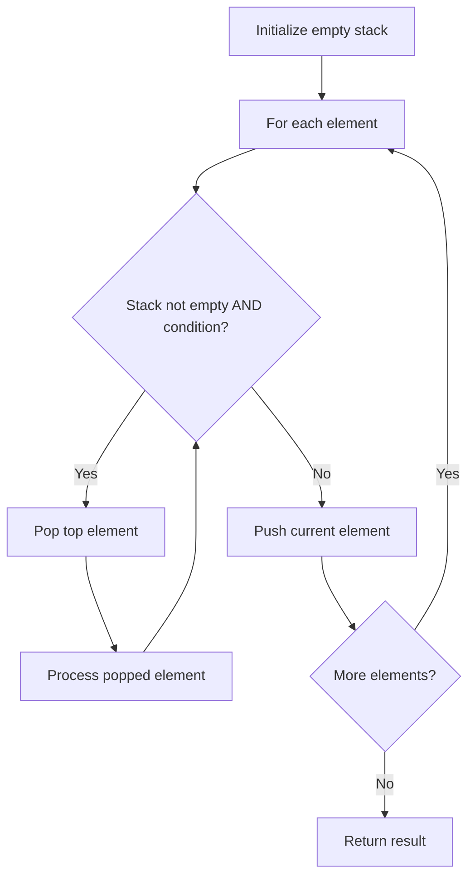
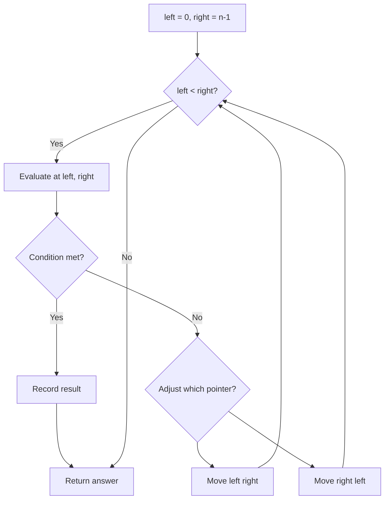
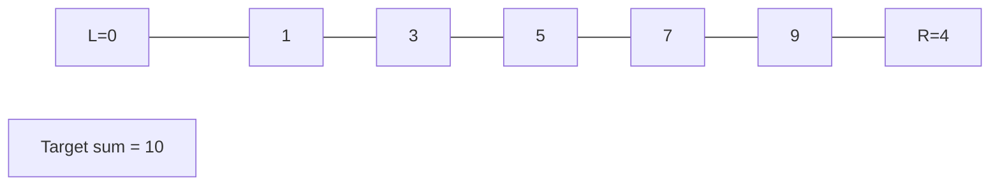
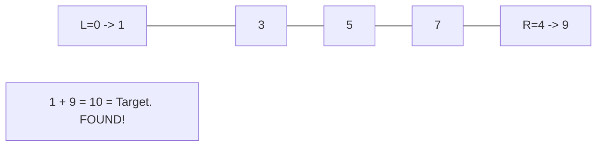
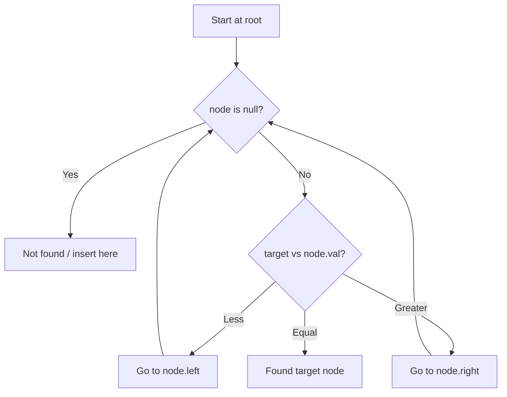
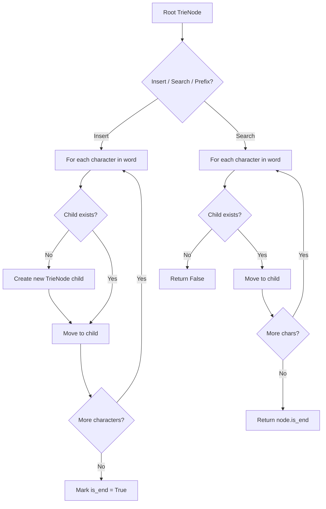
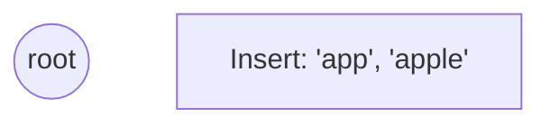
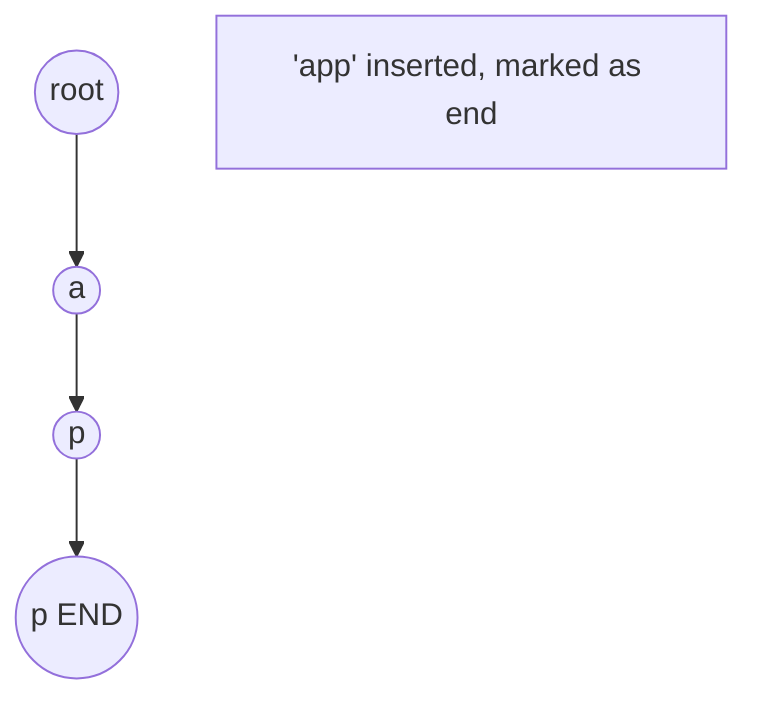
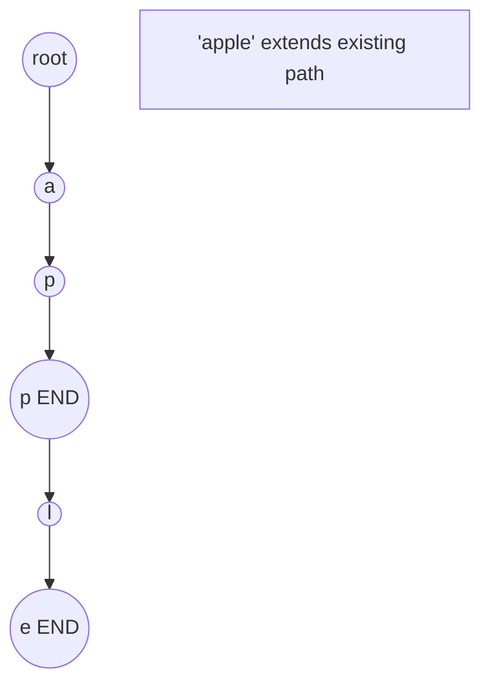
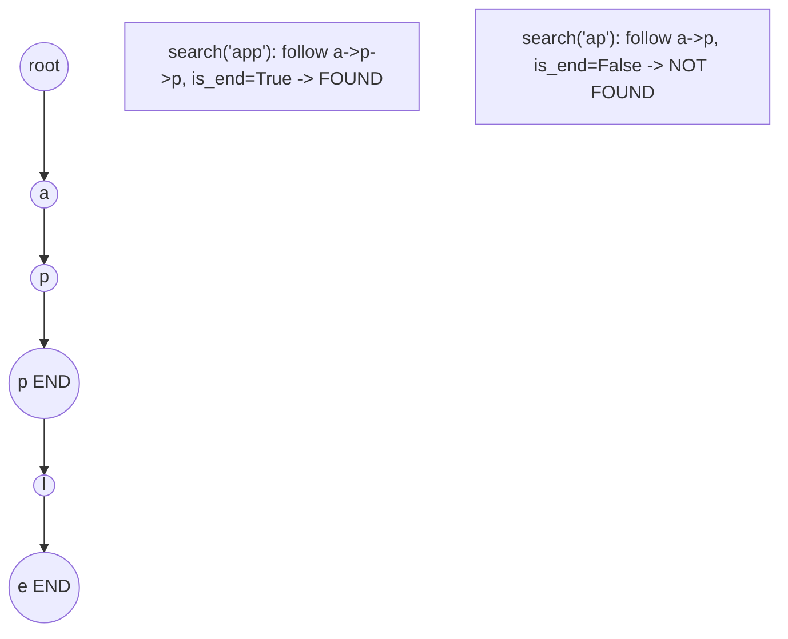

# Design

> Chapter covering 83 problems related to **Design**.


## Problems in this Chapter

| # | Problem | Difficulty | Pattern | Time | Space |
|---|---------|------------|---------|------|-------|
| 155 | [Min Stack](#problem-155-min_stack) | Medium | Stack / Design | O(1) per operation | O(n) |
| 170 | [Two Sum III - Data structure design](#problem-170-two_sum_iii_data_structure_design) | Easy | Two Pointers | O(n) | O(1) |
| 173 | [Binary Search Tree Iterator](#problem-173-binary_search_tree_iterator) | Medium | Binary Search Tree | O(h) | O(h) |
| 208 | [Implement Trie (Prefix Tree)](#problem-208-implement_trie_prefix_tree) | Medium | Trie / Prefix Tree | O(L) per operation | O(N * L) |
| 211 | [Design Add and Search Words Data Structure](#problem-211-design_add_and_search_words_data_structure) | Medium | Trie / Prefix Tree | O(L) per operation | O(N * L) |
| 225 | [Implement Stack using Queues](#problem-225-implement_stack_using_queues) | Easy | Stack | O(n) | O(n) |
| 232 | [Implement Queue using Stacks](#problem-232-implement_queue_using_stacks) | Easy | Stack | O(n) | O(n) |
| 244 | [Shortest Word Distance II](#problem-244-shortest_word_distance_ii) | Medium | Two Pointers | O(n) | O(1) |
| 251 | [Flatten 2D Vector](#problem-251-flatten_2d_vector) | Medium | Two Pointers | O(n) | O(1) |
| 271 | [Encode and Decode Strings](#problem-271-encode_and_decode_strings) | Medium | Design | O(1) per operation | O(n) |
| 281 | [Zigzag Iterator](#problem-281-zigzag_iterator) | Medium | Queue / BFS | O(n) | O(n) |
| 284 | [Peeking Iterator](#problem-284-peeking_iterator) | Medium | Design | O(1) per operation | O(n) |
| 288 | [Unique Word Abbreviation](#problem-288-unique_word_abbreviation) | Medium | Design | O(1) per operation | O(n) |
| 295 | [Find Median from Data Stream](#problem-295-find_median_from_data_stream) | Hard | Two Heaps / Design | O(log n) add, O(1) find | O(n) |
| 297 | [Serialize and Deserialize Binary Tree](#problem-297-serialize_and_deserialize_binary_tree) | Hard | Tree / DFS / Serialization | O(n) | O(n) |
| 303 | [Range Sum Query - Immutable](#problem-303-range_sum_query_immutable) | Easy | Prefix Sum | O(n) | O(n) |
| 304 | [Range Sum Query 2D - Immutable](#problem-304-range_sum_query_2d_immutable) | Medium | Prefix Sum | O(n) | O(n) |
| 307 | [Range Sum Query - Mutable](#problem-307-range_sum_query_mutable) | Medium | Segment Tree | O(n log n) build, O(log n) query/update | O(n) |
| 308 | [Range Sum Query 2D - Mutable](#problem-308-range_sum_query_2d_mutable) | Medium | Segment Tree | O(n log n) build, O(log n) query/update | O(n) |
| 341 | [Flatten Nested List Iterator](#problem-341-flatten_nested_list_iterator) | Medium | DFS Tree Traversal | O(n) | O(h) |
| 346 | [Moving Average from Data Stream](#problem-346-moving_average_from_data_stream) | Easy | Queue / BFS | O(n) | O(n) |
| 348 | [Design Tic-Tac-Toe](#problem-348-design_tic_tac_toe) | Medium | Design | O(1) per operation | O(n) |
| 353 | [Design Snake Game](#problem-353-design_snake_game) | Medium | Queue / BFS | O(n) | O(n) |
| 359 | [Logger Rate Limiter](#problem-359-logger_rate_limiter) | Easy | Data Stream Design | O(log n) per operation | O(n) |
| 380 | [Insert Delete GetRandom O(1)](#problem-380-insert_delete_getrandom_o1) | Medium | Design | O(1) per operation | O(n) |
| 381 | [Insert Delete GetRandom O(1) - Duplicates allowed](#problem-381-insert_delete_getrandom_o1_duplicates_allowed) | Hard | Design | O(1) per operation | O(n) |
| 384 | [Shuffle an Array](#problem-384-shuffle_an_array) | Medium | Design | O(1) per operation | O(n) |
| 431 | [Encode N-ary Tree to Binary Tree](#problem-431-encode_n_ary_tree_to_binary_tree) | Hard | DFS Tree Traversal | O(n) | O(h) |
| 449 | [Serialize and Deserialize BST](#problem-449-serialize_and_deserialize_bst) | Medium | Binary Search Tree | O(h) | O(h) |
| 535 | [Encode and Decode TinyURL](#problem-535-encode_and_decode_tinyurl) | Medium | Design | O(1) per operation | O(n) |
| 588 | [Design In-Memory File System](#problem-588-design_in_memory_file_system) | Hard | Trie / Prefix Tree | O(L) per operation | O(N * L) |
| 604 | [Design Compressed String Iterator](#problem-604-design_compressed_string_iterator) | Easy | Design | O(1) per operation | O(n) |
| 635 | [Design Log Storage System](#problem-635-design_log_storage_system) | Medium | Ordered Set / SortedList | O(n log n) | O(n) |
| 642 | [Design Search Autocomplete System](#problem-642-design_search_autocomplete_system) | Hard | Trie / Prefix Tree | O(L) per operation | O(N * L) |
| 676 | [Implement Magic Dictionary](#problem-676-implement_magic_dictionary) | Medium | Trie / Prefix Tree | O(L) per operation | O(N * L) |
| 677 | [Map Sum Pairs](#problem-677-map_sum_pairs) | Medium | Trie / Prefix Tree | O(L) per operation | O(N * L) |
| 703 | [Kth Largest Element in a Stream](#problem-703-kth_largest_element_in_a_stream) | Easy | Heap / Design | O(log k) per add | O(k) |
| 715 | [Range Module](#problem-715-range_module) | Hard | Segment Tree | O(n log n) build, O(log n) query/update | O(n) |
| 745 | [Prefix and Suffix Search](#problem-745-prefix_and_suffix_search) | Hard | Trie / Prefix Tree | O(L) per operation | O(N * L) |
| 855 | [Exam Room](#problem-855-exam_room) | Medium | Ordered Set / SortedList | O(n log n) | O(n) |
| 895 | [Maximum Frequency Stack](#problem-895-maximum_frequency_stack) | Hard | Stack + Hash Map / Design | O(1) per operation | O(n) |
| 900 | [RLE Iterator](#problem-900-rle_iterator) | Medium | Design | O(1) per operation | O(n) |
| 901 | [Online Stock Span](#problem-901-online_stock_span) | Medium | Monotonic Stack | O(n) | O(n) |
| 919 | [Complete Binary Tree Inserter](#problem-919-complete_binary_tree_inserter) | Medium | BFS Level-Order Traversal | O(n) | O(w) |
| 933 | [Number of Recent Calls](#problem-933-number_of_recent_calls) | Easy | Queue / Design | O(1) amortized | O(n) |
| 1032 | [Stream of Characters](#problem-1032-stream_of_characters) | Hard | Trie / Prefix Tree | O(L) per operation | O(N * L) |
| 1166 | [Design File System](#problem-1166-design_file_system) | Medium | Trie / Prefix Tree | O(L) per operation | O(N * L) |
| 1172 | [Dinner Plate Stacks](#problem-1172-dinner_plate_stacks) | Hard | Heap / Priority Queue | O(n log n) | O(n) |
| 1244 | [Design A Leaderboard](#problem-1244-design_a_leaderboard) | Medium | Sorting | O(n log n) | O(n) |
| 1261 | [Find Elements in a Contaminated Binary Tree](#problem-1261-find_elements_in_a_contaminated_binary_tree) | Medium | DFS Tree Traversal | O(n) | O(h) |
| 1352 | [Product of the Last K Numbers](#problem-1352-product_of_the_last_k_numbers) | Medium | Prefix Sum | O(n) | O(n) |
| 1357 | [Apply Discount Every n Orders](#problem-1357-apply_discount_every_n_orders) | Medium | Design | O(1) per operation | O(n) |
| 1381 | [Design a Stack With Increment Operation](#problem-1381-design_a_stack_with_increment_operation) | Medium | Stack | O(n) | O(n) |
| 1396 | [Design Underground System](#problem-1396-design_underground_system) | Medium | Design / Hash Map | O(1) per operation | O(n) |
| 1429 | [First Unique Number](#problem-1429-first_unique_number) | Medium | Queue / BFS | O(n) | O(n) |
| 1476 | [Subrectangle Queries](#problem-1476-subrectangle_queries) | Medium | Design | O(1) per operation | O(n) |
| 1500 | [Design a File Sharing System](#problem-1500-design_a_file_sharing_system) | Medium | Heap / Priority Queue | O(n log n) | O(n) |
| 1570 | [Dot Product of Two Sparse Vectors](#problem-1570-dot_product_of_two_sparse_vectors) | Medium | Two Pointers | O(n) | O(1) |
| 1586 | [Binary Search Tree Iterator II](#problem-1586-binary_search_tree_iterator_ii) | Medium | Binary Search Tree | O(h) | O(h) |
| 1600 | [Throne Inheritance](#problem-1600-throne_inheritance) | Medium | DFS Tree Traversal | O(n) | O(h) |
| 1603 | [Design Parking System](#problem-1603-design_parking_system) | Easy | Design | O(1) per operation | O(n) |
| 1622 | [Fancy Sequence](#problem-1622-fancy_sequence) | Hard | Segment Tree | O(n log n) build, O(log n) query/update | O(n) |
| 1628 | [Design an Expression Tree With Evaluate Function](#problem-1628-design_an_expression_tree_with_evaluate_function) | Medium | Tree Traversal | O(n) | O(h) |
| 1656 | [Design an Ordered Stream](#problem-1656-design_an_ordered_stream) | Easy | Data Stream Design | O(log n) per operation | O(n) |
| 1804 | [Implement Trie II (Prefix Tree)](#problem-1804-implement_trie_ii_prefix_tree) | Medium | Trie / Prefix Tree | O(L) per operation | O(N * L) |
| 1825 | [Finding MK Average](#problem-1825-finding_mk_average) | Hard | Ordered Set / SortedList | O(n log n) | O(n) |
| 1845 | [Seat Reservation Manager](#problem-1845-seat_reservation_manager) | Medium | Heap / Priority Queue | O(n log n) | O(n) |
| 1865 | [Finding Pairs With a Certain Sum](#problem-1865-finding_pairs_with_a_certain_sum) | Medium | Design | O(1) per operation | O(n) |
| 1912 | [Design Movie Rental System](#problem-1912-design_movie_rental_system) | Hard | Ordered Set / SortedList | O(n log n) | O(n) |
| 1993 | [Operations on Tree](#problem-1993-operations_on_tree) | Medium | DFS Tree Traversal | O(n) | O(h) |
| 2013 | [Detect Squares](#problem-2013-detect_squares) | Medium | Hash Map / Design | O(n) count | O(n) |
| 2034 | [Stock Price Fluctuation ](#problem-2034-stock_price_fluctuation) | Medium | Ordered Set / SortedList | O(n log n) | O(n) |
| 2043 | [Simple Bank System](#problem-2043-simple_bank_system) | Medium | Design | O(1) per operation | O(n) |
| 2069 | [Walking Robot Simulation II](#problem-2069-walking_robot_simulation_ii) | Medium | Design | O(1) per operation | O(n) |
| 2102 | [Sequentially Ordinal Rank Tracker](#problem-2102-sequentially_ordinal_rank_tracker) | Hard | Ordered Set / SortedList | O(n log n) | O(n) |
| 2166 | [Design Bitset](#problem-2166-design_bitset) | Medium | Design | O(1) per operation | O(n) |
| 2227 | [Encrypt and Decrypt Strings](#problem-2227-encrypt_and_decrypt_strings) | Hard | Trie / Prefix Tree | O(L) per operation | O(N * L) |
| 2254 | [Design Video Sharing Platform](#problem-2254-design_video_sharing_platform) | Hard | Ordered Set / SortedList | O(n log n) | O(n) |
| 2276 | [Count Integers in Intervals](#problem-2276-count_integers_in_intervals) | Hard | Segment Tree | O(n log n) build, O(log n) query/update | O(n) |
| 2336 | [Smallest Number in Infinite Set](#problem-2336-smallest_number_in_infinite_set) | Medium | Heap / Design | O(log n) per op | O(n) |
| 2349 | [Design a Number Container System](#problem-2349-design_a_number_container_system) | Medium | Ordered Set / SortedList | O(n log n) | O(n) |
| 2353 | [Design a Food Rating System](#problem-2353-design_a_food_rating_system) | Medium | Ordered Set / SortedList | O(n log n) | O(n) |
| 2408 | [Design SQL](#problem-2408-design_sql) | Medium | Design | O(1) per operation | O(n) |

---
---

# Problem 155: Min Stack

| Attribute | Detail |
|-----------|--------|
| **ID** | 155 |
| **Title** | Min Stack |
| **Difficulty** | Medium |
| **Tags** | Stack, Design |
| **Link** | [leetcode.com/problems/min-stack](https://leetcode.com/problems/min-stack/) |

Design a stack that supports push, pop, top, and retrieving the minimum element in constant time.

Implement the `MinStack` class:

	- `MinStack()` initializes the stack object.
	- `void push(int val)` pushes the element `val` onto the stack.
	- `void pop()` removes the element on the top of the stack.
	- `int top()` gets the top element of the stack.
	- `int getMin()` retrieves the minimum element in the stack.

You must implement a solution with `O(1)` time complexity for each function.

 

Example 1:

```

**Input**
["MinStack","push","push","push","getMin","pop","top","getMin"]
[[],[-2],[0],[-3],[],[],[],[]]

**Output**
[null,null,null,null,-3,null,0,-2]

**Explanation**
MinStack minStack = new MinStack();
minStack.push(-2);
minStack.push(0);
minStack.push(-3);
minStack.getMin(); // return -3
minStack.pop();
minStack.top();    // return 0
minStack.getMin(); // return -2

```

 

**Constraints:**

	- `-2^31 <= val <= 2^31 - 1`
	- Methods `pop`, `top` and `getMin` operations will always be called on **non-empty** stacks.
	- At most `3 * 10^4` calls will be made to `push`, `pop`, `top`, and `getMin`.

---

## Approach: Stack / Design

Maintain a parallel min stack that tracks the minimum at each level.

### Pseudo-code

```
1. Two stacks: main + min tracker
2. Push: push val and min(val, current min)
3. Pop: pop both
4. getMin: peek min stack
```

---

## Algorithm Flow



---

## Complexity Analysis

| Metric | Value |
|--------|-------|
| **Time** | O(1) per operation |
| **Space** | O(n) |

---

## Solution Code

### Python3

```python
class Solution:
    pass

class MinStack:
    def __init__(self):
        self.stack = []
        self.min_stack = []

    def push(self, val: int) -> None:
        self.stack.append(val)
        self.min_stack.append(min(val, self.min_stack[-1] if self.min_stack else val))

    def pop(self) -> None:
        self.stack.pop()
        self.min_stack.pop()

    def top(self) -> int:
        return self.stack[-1]

    def getMin(self) -> int:
        return self.min_stack[-1]
```

### C++

```cpp
class MinStack {
    stack<int> st, minSt;
public:
    MinStack() {}
    void push(int val) {
        st.push(val);
        minSt.push(minSt.empty() ? val : min(val, minSt.top()));
    }
    void pop() { st.pop(); minSt.pop(); }
    int top() { return st.top(); }
    int getMin() { return minSt.top(); }
};
```

### Summary

| Aspect | Detail |
|--------|--------|
| **Pattern** | Stack / Design |
| **Time** | O(1) per operation |
| **Space** | O(n) |

---
---

# Problem 170: Two Sum III - Data structure design

| Attribute | Detail |
|-----------|--------|
| **ID** | 170 |
| **Title** | Two Sum III - Data structure design |
| **Difficulty** | Easy |
| **Tags** | Array, Hash Table, Two Pointers, Design, Data Stream |
| **Link** | [leetcode.com/problems/two-sum-iii-data-structure-design](https://leetcode.com/problems/two-sum-iii-data-structure-design/) |

*(Premium problem -- description requires LeetCode subscription)*

---

## Approach: Two Pointers

Use two pointers moving through the data structure. Depending on the problem, pointers may move toward each other (converging), in the same direction (fast/slow), or independently.

### Pseudo-code

```
1. Initialize left = 0, right = n-1 (or two independent pointers)
2. While pointers haven't crossed:
   a. Evaluate condition at pointer positions
   b. Move left pointer right or right pointer left
3. Return result
```

---

## Algorithm Flow



## Visual State Transitions

**Two Pointer Convergence:**

**Frame 1: Initialize pointers**


**Frame 2: Sum = 1+9 = 10, found!**



---

## Complexity Analysis

| Metric | Value |
|--------|-------|
| **Time** | O(n) |
| **Space** | O(1) |

---

## Solution Code

### Python3

```python
class Solution:
    pass
```

### C++

```cpp
class Solution {
public:
    // Design problem stub
};
```

### Summary

| Aspect | Detail |
|--------|--------|
| **Pattern** | Two Pointers |
| **Time** | O(n) |
| **Space** | O(1) |

---
---

# Problem 173: Binary Search Tree Iterator

| Attribute | Detail |
|-----------|--------|
| **ID** | 173 |
| **Title** | Binary Search Tree Iterator |
| **Difficulty** | Medium |
| **Tags** | Stack, Tree, Design, Binary Search Tree, Binary Tree, Iterator |
| **Link** | [leetcode.com/problems/binary-search-tree-iterator](https://leetcode.com/problems/binary-search-tree-iterator/) |

Implement the `BSTIterator` class that represents an iterator over the **in-order traversal** of a binary search tree (BST):

	- `BSTIterator(TreeNode root)` Initializes an object of the `BSTIterator` class. The `root` of the BST is given as part of the constructor. The pointer should be initialized to a non-existent number smaller than any element in the BST.
	- `boolean hasNext()` Returns `true` if there exists a number in the traversal to the right of the pointer, otherwise returns `false`.
	- `int next()` Moves the pointer to the right, then returns the number at the pointer.

Notice that by initializing the pointer to a non-existent smallest number, the first call to `next()` will return the smallest element in the BST.

You may assume that `next()` calls will always be valid. That is, there will be at least a next number in the in-order traversal when `next()` is called.

 

Example 1:

```

**Input**
["BSTIterator", "next", "next", "hasNext", "next", "hasNext", "next", "hasNext", "next", "hasNext"]
[[[7, 3, 15, null, null, 9, 20]], [], [], [], [], [], [], [], [], []]
**Output**
[null, 3, 7, true, 9, true, 15, true, 20, false]

**Explanation**
BSTIterator bSTIterator = new BSTIterator([7, 3, 15, null, null, 9, 20]);
bSTIterator.next();    // return 3
bSTIterator.next();    // return 7
bSTIterator.hasNext(); // return True
bSTIterator.next();    // return 9
bSTIterator.hasNext(); // return True
bSTIterator.next();    // return 15
bSTIterator.hasNext(); // return True
bSTIterator.next();    // return 20
bSTIterator.hasNext(); // return False

```

 

**Constraints:**

	- The number of nodes in the tree is in the range `[1, 10^5]`.
	- `0 <= Node.val <= 10^6`
	- At most `10^5` calls will be made to `hasNext`, and `next`.

 

**Follow up:**

	- Could you implement `next()` and `hasNext()` to run in average `O(1)` time and use `O(h)` memory, where `h` is the height of the tree?

---

## Approach: Binary Search Tree

Leverage BST property: left < root < right. Navigate left for smaller values, right for larger values. Inorder traversal yields sorted order.

### Pseudo-code

```
1. Start at root
2. Compare target with current node:
   a. If target < node.val: go left
   b. If target > node.val: go right
   c. If equal: found
3. Return result
```

---

## Algorithm Flow



---

## Complexity Analysis

| Metric | Value |
|--------|-------|
| **Time** | O(h) |
| **Space** | O(h) |

---

## Solution Code

### Python3

```python
class BSTIterator:
    def __init__(self, root: Optional[TreeNode]):
        # Initialize data structure
        self.root = root

    def next(self) -> int:
        return 0

    def hasNext(self) -> bool:
        return False

```

### C++

```cpp
#include <functional>
#include <string>
#include <vector>
using namespace std;

class BSTIterator {
public:
    BSTIterator(TreeNode* root) {
        // Initialize
    }

    int next() {
        return 0;
    }

    bool hasNext() {
        return false;
    }

};
```

### Summary

| Aspect | Detail |
|--------|--------|
| **Pattern** | Binary Search Tree |
| **Time** | O(h) |
| **Space** | O(h) |

---
---

# Problem 208: Implement Trie (Prefix Tree)

| Attribute | Detail |
|-----------|--------|
| **ID** | 208 |
| **Title** | Implement Trie (Prefix Tree) |
| **Difficulty** | Medium |
| **Tags** | Hash Table, String, Design, Trie |
| **Link** | [leetcode.com/problems/implement-trie-prefix-tree](https://leetcode.com/problems/implement-trie-prefix-tree/) |

A **trie** (pronounced as "try") or **prefix tree** is a tree data structure used to efficiently store and retrieve keys in a dataset of strings. There are various applications of this data structure, such as autocomplete and spellchecker.

Implement the Trie class:

	- `Trie()` Initializes the trie object.
	- `void insert(String word)` Inserts the string `word` into the trie.
	- `boolean search(String word)` Returns `true` if the string `word` is in the trie (i.e., was inserted before), and `false` otherwise.
	- `boolean startsWith(String prefix)` Returns `true` if there is a previously inserted string `word` that has the prefix `prefix`, and `false` otherwise.

 

Example 1:

```

**Input**
["Trie", "insert", "search", "search", "startsWith", "insert", "search"]
[[], ["apple"], ["apple"], ["app"], ["app"], ["app"], ["app"]]
**Output**
[null, null, true, false, true, null, true]

**Explanation**
Trie trie = new Trie();
trie.insert("apple");
trie.search("apple");   // return True
trie.search("app");     // return False
trie.startsWith("app"); // return True
trie.insert("app");
trie.search("app");     // return True

```

 

**Constraints:**

	- `1 <= word.length, prefix.length <= 2000`
	- `word` and `prefix` consist only of lowercase English letters.
	- At most `3 * 10^4` calls **in total** will be made to `insert`, `search`, and `startsWith`.

---

## Approach: Trie / Prefix Tree

Build a trie (prefix tree) where each node represents a character. Insert words character by character, and search by following child pointers. Supports efficient prefix matching.

### Pseudo-code

```
1. TrieNode: children = {}, is_end = False
2. Insert(word):
   - For each char: create child if absent, move to child
   - Mark last node as end
3. Search(word):
   - For each char: if child absent return False, move to child
   - Return node.is_end
4. StartsWith(prefix): same as search but return True at end
```

---

## Algorithm Flow



## Visual State Transitions

**Trie Insert and Search:**

**Frame 1: Empty trie**


**Frame 2: Insert 'app'**


**Frame 3: Insert 'apple'**


**Frame 4: Search 'app' = True, 'ap' = False**



---

## Complexity Analysis

| Metric | Value |
|--------|-------|
| **Time** | O(L) per operation |
| **Space** | O(N * L) |

---

## Solution Code

### Python3

```python
class Trie:
    def __init__(self):
        # Initialize data structure
        pass

    def insert(self, word: str) -> None:
        return None

    def search(self, word: str) -> bool:
        return False

    def startsWith(self, prefix: str) -> bool:
        return False

```

### C++

```cpp
#include <string>
#include <vector>
using namespace std;

class Trie {
public:
    Trie() {
        // Initialize
    }

    void insert(string& word) {
        return ;
    }

    bool search(string& word) {
        return false;
    }

    bool startsWith(string& prefix) {
        return false;
    }

};
```

### Summary

| Aspect | Detail |
|--------|--------|
| **Pattern** | Trie / Prefix Tree |
| **Time** | O(L) per operation |
| **Space** | O(N * L) |

---
---

# Problem 211: Design Add and Search Words Data Structure

| Attribute | Detail |
|-----------|--------|
| **ID** | 211 |
| **Title** | Design Add and Search Words Data Structure |
| **Difficulty** | Medium |
| **Tags** | String, Depth-First Search, Design, Trie |
| **Link** | [leetcode.com/problems/design-add-and-search-words-data-structure](https://leetcode.com/problems/design-add-and-search-words-data-structure/) |

Design a data structure that supports adding new words and finding if a string matches any previously added string.

Implement the `WordDictionary` class:

	- `WordDictionary()` Initializes the object.
	- `void addWord(word)` Adds `word` to the data structure, it can be matched later.
	- `bool search(word)` Returns `true` if there is any string in the data structure that matches `word` or `false` otherwise. `word` may contain dots `'.'` where dots can be matched with any letter.

 

Example:

```

**Input**
["WordDictionary","addWord","addWord","addWord","search","search","search","search"]
[[],["bad"],["dad"],["mad"],["pad"],["bad"],[".ad"],["b.."]]
**Output**
[null,null,null,null,false,true,true,true]

**Explanation**
WordDictionary wordDictionary = new WordDictionary();
wordDictionary.addWord("bad");
wordDictionary.addWord("dad");
wordDictionary.addWord("mad");
wordDictionary.search("pad"); // return False
wordDictionary.search("bad"); // return True
wordDictionary.search(".ad"); // return True
wordDictionary.search("b.."); // return True

```

 

**Constraints:**

	- `1 <= word.length <= 25`
	- `word` in `addWord` consists of lowercase English letters.
	- `word` in `search` consist of `'.'` or lowercase English letters.
	- There will be at most `2` dots in `word` for `search` queries.
	- At most `10^4` calls will be made to `addWord` and `search`.

---

## Approach: Trie / Prefix Tree

Build a trie (prefix tree) where each node represents a character. Insert words character by character, and search by following child pointers. Supports efficient prefix matching.

### Pseudo-code

```
1. TrieNode: children = {}, is_end = False
2. Insert(word):
   - For each char: create child if absent, move to child
   - Mark last node as end
3. Search(word):
   - For each char: if child absent return False, move to child
   - Return node.is_end
4. StartsWith(prefix): same as search but return True at end
```

---

## Algorithm Flow


## Visual State Transitions

**Trie Insert and Search:**

**Frame 1: Empty trie**


**Frame 2: Insert 'app'**


**Frame 3: Insert 'apple'**


**Frame 4: Search 'app' = True, 'ap' = False**


---

## Complexity Analysis

| Metric | Value |
|--------|-------|
| **Time** | O(L) per operation |
| **Space** | O(N * L) |

---

## Solution Code

### Python3

```python
class WordDictionary:
    def __init__(self):
        # Initialize data structure
        pass

    def addWord(self, word: str) -> None:
        return None

    def search(self, word: str) -> bool:
        return False

```

### C++

```cpp
#include <string>
#include <vector>
using namespace std;

class WordDictionary {
public:
    WordDictionary() {
        // Initialize
    }

    void addWord(string& word) {
        return ;
    }

    bool search(string& word) {
        return false;
    }

};
```

### Summary

| Aspect | Detail |
|--------|--------|
| **Pattern** | Trie / Prefix Tree |
| **Time** | O(L) per operation |
| **Space** | O(N * L) |

---
---

# Problem 225: Implement Stack using Queues

| Attribute | Detail |
|-----------|--------|
| **ID** | 225 |
| **Title** | Implement Stack using Queues |
| **Difficulty** | Easy |
| **Tags** | Stack, Design, Queue |
| **Link** | [leetcode.com/problems/implement-stack-using-queues](https://leetcode.com/problems/implement-stack-using-queues/) |

Implement a last-in-first-out (LIFO) stack using only two queues. The implemented stack should support all the functions of a normal stack (`push`, `top`, `pop`, and `empty`).

Implement the `MyStack` class:

	- `void push(int x)` Pushes element x to the top of the stack.
	- `int pop()` Removes the element on the top of the stack and returns it.
	- `int top()` Returns the element on the top of the stack.
	- `boolean empty()` Returns `true` if the stack is empty, `false` otherwise.

**Notes:**

	- You must use **only** standard operations of a queue, which means that only `push to back`, `peek/pop from front`, `size` and `is empty` operations are valid.
	- Depending on your language, the queue may not be supported natively. You may simulate a queue using a list or deque (double-ended queue) as long as you use only a queue's standard operations.

 

Example 1:

```

**Input**
["MyStack", "push", "push", "top", "pop", "empty"]
[[], [1], [2], [], [], []]
**Output**
[null, null, null, 2, 2, false]

**Explanation**
MyStack myStack = new MyStack();
myStack.push(1);
myStack.push(2);
myStack.top(); // return 2
myStack.pop(); // return 2
myStack.empty(); // return False

```

 

**Constraints:**

	- `1 <= x <= 9`
	- At most `100` calls will be made to `push`, `pop`, `top`, and `empty`.
	- All the calls to `pop` and `top` are valid.

 

**Follow-up:** Can you implement the stack using only one queue?

---

## Approach: Stack

Use a stack (LIFO) to process elements. Push elements when they might be needed later; pop when a matching or resolving condition is found. Common uses: parentheses matching, expression evaluation, next greater element.

### Pseudo-code

```
1. Initialize empty stack
2. For each element:
   a. While stack is not empty and condition met:
      - Pop and process top element
   b. Push current element onto stack
3. Process remaining elements in stack if needed
4. Return result
```

---

## Algorithm Flow


---

## Complexity Analysis

| Metric | Value |
|--------|-------|
| **Time** | O(n) |
| **Space** | O(n) |

---

## Solution Code

### Python3

```python
class MyStack:
    def __init__(self):
        # Initialize data structure
        pass

    def push(self, x: int) -> None:
        return None

    def pop(self) -> int:
        return 0

    def top(self) -> int:
        return 0

    def empty(self) -> bool:
        return False

```

### C++

```cpp
#include <stack>
#include <string>
#include <unordered_map>
#include <vector>
using namespace std;

class MyStack {
public:
    MyStack() {
        // Initialize
    }

    void push(int x) {
        return ;
    }

    int pop() {
        return 0;
    }

    int top() {
        return 0;
    }

    bool empty() {
        return false;
    }

};
```

### Summary

| Aspect | Detail |
|--------|--------|
| **Pattern** | Stack |
| **Time** | O(n) |
| **Space** | O(n) |

---
---

# Problem 232: Implement Queue using Stacks

| Attribute | Detail |
|-----------|--------|
| **ID** | 232 |
| **Title** | Implement Queue using Stacks |
| **Difficulty** | Easy |
| **Tags** | Stack, Design, Queue |
| **Link** | [leetcode.com/problems/implement-queue-using-stacks](https://leetcode.com/problems/implement-queue-using-stacks/) |

Implement a first in first out (FIFO) queue using only two stacks. The implemented queue should support all the functions of a normal queue (`push`, `peek`, `pop`, and `empty`).

Implement the `MyQueue` class:

	- `void push(int x)` Pushes element x to the back of the queue.
	- `int pop()` Removes the element from the front of the queue and returns it.
	- `int peek()` Returns the element at the front of the queue.
	- `boolean empty()` Returns `true` if the queue is empty, `false` otherwise.

**Notes:**

	- You must use **only** standard operations of a stack, which means only `push to top`, `peek/pop from top`, `size`, and `is empty` operations are valid.
	- Depending on your language, the stack may not be supported natively. You may simulate a stack using a list or deque (double-ended queue) as long as you use only a stack's standard operations.

 

Example 1:

```

**Input**
["MyQueue", "push", "push", "peek", "pop", "empty"]
[[], [1], [2], [], [], []]
**Output**
[null, null, null, 1, 1, false]

**Explanation**
MyQueue myQueue = new MyQueue();
myQueue.push(1); // queue is: [1]
myQueue.push(2); // queue is: [1, 2] (leftmost is front of the queue)
myQueue.peek(); // return 1
myQueue.pop(); // return 1, queue is [2]
myQueue.empty(); // return false

```

 

**Constraints:**

	- `1 <= x <= 9`
	- At most `100` calls will be made to `push`, `pop`, `peek`, and `empty`.
	- All the calls to `pop` and `peek` are valid.

 

**Follow-up:** Can you implement the queue such that each operation is **amortized** `O(1)` time complexity? In other words, performing `n` operations will take overall `O(n)` time even if one of those operations may take longer.

---

## Approach: Stack

Use a stack (LIFO) to process elements. Push elements when they might be needed later; pop when a matching or resolving condition is found. Common uses: parentheses matching, expression evaluation, next greater element.

### Pseudo-code

```
1. Initialize empty stack
2. For each element:
   a. While stack is not empty and condition met:
      - Pop and process top element
   b. Push current element onto stack
3. Process remaining elements in stack if needed
4. Return result
```

---

## Algorithm Flow


---

## Complexity Analysis

| Metric | Value |
|--------|-------|
| **Time** | O(n) |
| **Space** | O(n) |

---

## Solution Code

### Python3

```python
class MyQueue:
    def __init__(self):
        # Initialize data structure
        pass

    def push(self, x: int) -> None:
        return None

    def pop(self) -> int:
        return 0

    def peek(self) -> int:
        return 0

    def empty(self) -> bool:
        return False

```

### C++

```cpp
#include <stack>
#include <string>
#include <unordered_map>
#include <vector>
using namespace std;

class MyQueue {
public:
    MyQueue() {
        // Initialize
    }

    void push(int x) {
        return ;
    }

    int pop() {
        return 0;
    }

    int peek() {
        return 0;
    }

    bool empty() {
        return false;
    }

};
```

### Summary

| Aspect | Detail |
|--------|--------|
| **Pattern** | Stack |
| **Time** | O(n) |
| **Space** | O(n) |

---
---

# Problem 244: Shortest Word Distance II

| Attribute | Detail |
|-----------|--------|
| **ID** | 244 |
| **Title** | Shortest Word Distance II |
| **Difficulty** | Medium |
| **Tags** | Array, Hash Table, Two Pointers, String, Design |
| **Link** | [leetcode.com/problems/shortest-word-distance-ii](https://leetcode.com/problems/shortest-word-distance-ii/) |

*(Premium problem -- description requires LeetCode subscription)*

---

## Approach: Two Pointers

Use two pointers moving through the data structure. Depending on the problem, pointers may move toward each other (converging), in the same direction (fast/slow), or independently.

### Pseudo-code

```
1. Initialize left = 0, right = n-1 (or two independent pointers)
2. While pointers haven't crossed:
   a. Evaluate condition at pointer positions
   b. Move left pointer right or right pointer left
3. Return result
```

---

## Algorithm Flow


## Visual State Transitions

**Two Pointer Convergence:**

**Frame 1: Initialize pointers**


**Frame 2: Sum = 1+9 = 10, found!**


---

## Complexity Analysis

| Metric | Value |
|--------|-------|
| **Time** | O(n) |
| **Space** | O(1) |

---

## Solution Code

### Python3

```python
class Solution:
    pass
```

### C++

```cpp
class Solution {
public:
    // Design problem stub
};
```

### Summary

| Aspect | Detail |
|--------|--------|
| **Pattern** | Two Pointers |
| **Time** | O(n) |
| **Space** | O(1) |

---
---

# Problem 251: Flatten 2D Vector

| Attribute | Detail |
|-----------|--------|
| **ID** | 251 |
| **Title** | Flatten 2D Vector |
| **Difficulty** | Medium |
| **Tags** | Array, Two Pointers, Design, Iterator |
| **Link** | [leetcode.com/problems/flatten-2d-vector](https://leetcode.com/problems/flatten-2d-vector/) |

*(Premium problem -- description requires LeetCode subscription)*

---

## Approach: Two Pointers

Use two pointers moving through the data structure. Depending on the problem, pointers may move toward each other (converging), in the same direction (fast/slow), or independently.

### Pseudo-code

```
1. Initialize left = 0, right = n-1 (or two independent pointers)
2. While pointers haven't crossed:
   a. Evaluate condition at pointer positions
   b. Move left pointer right or right pointer left
3. Return result
```

---

## Algorithm Flow

```mermaid
flowchart TD
    A[left = 0, right = n-1] --> B{left < right?}
    B -- Yes --> C[Evaluate at left, right]
    C --> D{Condition met?}
    D -- Yes --> E[Record result]
    D -- No --> F{Adjust which pointer?}
    F --> G[Move left right]
    F --> H[Move right left]
    G --> B
    H --> B
    E --> I[Return answer]
    B -- No --> I
```

## Visual State Transitions

**Two Pointer Convergence:**

**Frame 1: Initialize pointers**
```mermaid
graph LR
    L["L=0"] --- A0["1"] --- A1["3"] --- A2["5"] --- A3["7"] --- A4["9"] --- R["R=4"]
    S["Target sum = 10"]
```

**Frame 2: Sum = 1+9 = 10, found!**
```mermaid
graph LR
    L["L=0 -> 1"] --- A1["3"] --- A2["5"] --- A3["7"] --- R["R=4 -> 9"]
    S["1 + 9 = 10 = Target. FOUND!"]
```


---

## Complexity Analysis

| Metric | Value |
|--------|-------|
| **Time** | O(n) |
| **Space** | O(1) |

---

## Solution Code

### Python3

```python
class Solution:
    pass
```

### C++

```cpp
class Solution {
public:
    // Design problem stub
};
```

### Summary

| Aspect | Detail |
|--------|--------|
| **Pattern** | Two Pointers |
| **Time** | O(n) |
| **Space** | O(1) |

---
---

# Problem 271: Encode and Decode Strings

| Attribute | Detail |
|-----------|--------|
| **ID** | 271 |
| **Title** | Encode and Decode Strings |
| **Difficulty** | Medium |
| **Tags** | Array, String, Design |
| **Link** | [leetcode.com/problems/encode-and-decode-strings](https://leetcode.com/problems/encode-and-decode-strings/) |

*(Premium problem -- description requires LeetCode subscription)*

---

## Approach: Design

Design a data structure or system that supports specific operations efficiently. Choose appropriate underlying data structures (hash map, linked list, heap, etc.).

### Pseudo-code

```
1. Choose data structures for internal state
2. Implement constructor: initialize state
3. Implement each operation:
   - Maintain invariants
   - Optimize for target time complexity
4. Handle edge cases
```

---

## Algorithm Flow

```mermaid
flowchart TD
    A[Constructor: initialize internal state] --> B{Operation called?}
    B -- op1 --> C[Process operation 1]
    C --> D[Update internal state]
    B -- op2 --> E[Process operation 2]
    E --> D
    B -- query --> F[Read from internal state]
    D --> G[Maintain invariants]
    F --> H[Return result]
```

---

## Complexity Analysis

| Metric | Value |
|--------|-------|
| **Time** | O(1) per operation |
| **Space** | O(n) |

---

## Solution Code

### Python3

```python
class Solution:
    pass
```

### C++

```cpp
class Solution {
public:
    // Design problem stub
};
```

### Summary

| Aspect | Detail |
|--------|--------|
| **Pattern** | Design |
| **Time** | O(1) per operation |
| **Space** | O(n) |

---
---

# Problem 281: Zigzag Iterator

| Attribute | Detail |
|-----------|--------|
| **ID** | 281 |
| **Title** | Zigzag Iterator |
| **Difficulty** | Medium |
| **Tags** | Array, Design, Queue, Iterator |
| **Link** | [leetcode.com/problems/zigzag-iterator](https://leetcode.com/problems/zigzag-iterator/) |

*(Premium problem -- description requires LeetCode subscription)*

---

## Approach: Queue / BFS

Use a queue (FIFO) for level-order or breadth-first processing. Enqueue starting elements, then process level by level.

### Pseudo-code

```
1. Initialize queue with starting element(s)
2. While queue is not empty:
   a. Dequeue front element
   b. Process element
   c. Enqueue valid neighbors/children
3. Return result
```

---

## Algorithm Flow

```mermaid
flowchart TD
    A[Enqueue starting elements] --> B{Queue not empty?}
    B -- Yes --> C[Dequeue front element]
    C --> D[Process element]
    D --> E[Enqueue valid neighbors]
    E --> B
    B -- No --> F[Return result]
```

---

## Complexity Analysis

| Metric | Value |
|--------|-------|
| **Time** | O(n) |
| **Space** | O(n) |

---

## Solution Code

### Python3

```python
class Solution:
    pass
```

### C++

```cpp
class Solution {
public:
    // Design problem stub
};
```

### Summary

| Aspect | Detail |
|--------|--------|
| **Pattern** | Queue / BFS |
| **Time** | O(n) |
| **Space** | O(n) |

---
---

# Problem 284: Peeking Iterator

| Attribute | Detail |
|-----------|--------|
| **ID** | 284 |
| **Title** | Peeking Iterator |
| **Difficulty** | Medium |
| **Tags** | Array, Design, Iterator |
| **Link** | [leetcode.com/problems/peeking-iterator](https://leetcode.com/problems/peeking-iterator/) |

Design an iterator that supports the `peek` operation on an existing iterator in addition to the `hasNext` and the `next` operations.

Implement the `PeekingIterator` class:

	- `PeekingIterator(Iterator<int> nums)` Initializes the object with the given integer iterator `iterator`.
	- `int next()` Returns the next element in the array and moves the pointer to the next element.
	- `boolean hasNext()` Returns `true` if there are still elements in the array.
	- `int peek()` Returns the next element in the array **without** moving the pointer.

**Note:** Each language may have a different implementation of the constructor and `Iterator`, but they all support the `int next()` and `boolean hasNext()` functions.

 

Example 1:

```

**Input**
["PeekingIterator", "next", "peek", "next", "next", "hasNext"]
[[[1, 2, 3]], [], [], [], [], []]
**Output**
[null, 1, 2, 2, 3, false]

**Explanation**
PeekingIterator peekingIterator = new PeekingIterator([1, 2, 3]); // [**1**,2,3]
peekingIterator.next();    // return 1, the pointer moves to the next element [1,**2**,3].
peekingIterator.peek();    // return 2, the pointer does not move [1,**2**,3].
peekingIterator.next();    // return 2, the pointer moves to the next element [1,2,**3**]
peekingIterator.next();    // return 3, the pointer moves to the next element [1,2,3]
peekingIterator.hasNext(); // return False

```

 

**Constraints:**

	- `1 <= nums.length <= 1000`
	- `1 <= nums[i] <= 1000`
	- All the calls to `next` and `peek` are valid.
	- At most `1000` calls will be made to `next`, `hasNext`, and `peek`.

 

**Follow up:** How would you extend your design to be generic and work with all types, not just integer?

---

## Approach: Design

Design a data structure or system that supports specific operations efficiently. Choose appropriate underlying data structures (hash map, linked list, heap, etc.).

### Pseudo-code

```
1. Choose data structures for internal state
2. Implement constructor: initialize state
3. Implement each operation:
   - Maintain invariants
   - Optimize for target time complexity
4. Handle edge cases
```

---

## Algorithm Flow

```mermaid
flowchart TD
    A[Constructor: initialize internal state] --> B{Operation called?}
    B -- op1 --> C[Process operation 1]
    C --> D[Update internal state]
    B -- op2 --> E[Process operation 2]
    E --> D
    B -- query --> F[Read from internal state]
    D --> G[Maintain invariants]
    F --> H[Return result]
```

---

## Complexity Analysis

| Metric | Value |
|--------|-------|
| **Time** | O(1) per operation |
| **Space** | O(n) |

---

## Solution Code

### Python3

```python
class PeekingIterator:
    def __init__(self, iterator: int):
        # Initialize data structure
        self.iterator = iterator

    def peek(self) -> None:
        return None

    def next(self) -> None:
        return None

    def hasNext(self) -> None:
        return None

```

### C++

```cpp
#include <string>
#include <vector>
using namespace std;

class PeekingIterator {
public:
    PeekingIterator(int iterator) {
        // Initialize
    }

    void peek() {
        return ;
    }

    void next() {
        return ;
    }

    void hasNext() {
        return ;
    }

};
```

### Summary

| Aspect | Detail |
|--------|--------|
| **Pattern** | Design |
| **Time** | O(1) per operation |
| **Space** | O(n) |

---
---

# Problem 288: Unique Word Abbreviation

| Attribute | Detail |
|-----------|--------|
| **ID** | 288 |
| **Title** | Unique Word Abbreviation |
| **Difficulty** | Medium |
| **Tags** | Array, Hash Table, String, Design |
| **Link** | [leetcode.com/problems/unique-word-abbreviation](https://leetcode.com/problems/unique-word-abbreviation/) |

*(Premium problem -- description requires LeetCode subscription)*

---

## Approach: Design

Design a data structure or system that supports specific operations efficiently. Choose appropriate underlying data structures (hash map, linked list, heap, etc.).

### Pseudo-code

```
1. Choose data structures for internal state
2. Implement constructor: initialize state
3. Implement each operation:
   - Maintain invariants
   - Optimize for target time complexity
4. Handle edge cases
```

---

## Algorithm Flow

```mermaid
flowchart TD
    A[Constructor: initialize internal state] --> B{Operation called?}
    B -- op1 --> C[Process operation 1]
    C --> D[Update internal state]
    B -- op2 --> E[Process operation 2]
    E --> D
    B -- query --> F[Read from internal state]
    D --> G[Maintain invariants]
    F --> H[Return result]
```

---

## Complexity Analysis

| Metric | Value |
|--------|-------|
| **Time** | O(1) per operation |
| **Space** | O(n) |

---

## Solution Code

### Python3

```python
class Solution:
    pass
```

### C++

```cpp
class Solution {
public:
    // Design problem stub
};
```

### Summary

| Aspect | Detail |
|--------|--------|
| **Pattern** | Design |
| **Time** | O(1) per operation |
| **Space** | O(n) |

---
---

# Problem 295: Find Median from Data Stream

| Attribute | Detail |
|-----------|--------|
| **ID** | 295 |
| **Title** | Find Median from Data Stream |
| **Difficulty** | Hard |
| **Tags** | Two Pointers, Design, Sorting, Heap (Priority Queue), Data Stream |
| **Link** | [leetcode.com/problems/find-median-from-data-stream](https://leetcode.com/problems/find-median-from-data-stream/) |

The **median** is the middle value in an ordered integer list. If the size of the list is even, there is no middle value, and the median is the mean of the two middle values.

	- For example, for `arr = [2,3,4]`, the median is `3`.
	- For example, for `arr = [2,3]`, the median is `(2 + 3) / 2 = 2.5`.

Implement the MedianFinder class:

	- `MedianFinder()` initializes the `MedianFinder` object.
	- `void addNum(int num)` adds the integer `num` from the data stream to the data structure.
	- `double findMedian()` returns the median of all elements so far. Answers within `10^-5` of the actual answer will be accepted.

 

Example 1:

```

**Input**
["MedianFinder", "addNum", "addNum", "findMedian", "addNum", "findMedian"]
[[], [1], [2], [], [3], []]
**Output**
[null, null, null, 1.5, null, 2.0]

**Explanation**
MedianFinder medianFinder = new MedianFinder();
medianFinder.addNum(1);    // arr = [1]
medianFinder.addNum(2);    // arr = [1, 2]
medianFinder.findMedian(); // return 1.5 (i.e., (1 + 2) / 2)
medianFinder.addNum(3);    // arr[1, 2, 3]
medianFinder.findMedian(); // return 2.0

```

 

**Constraints:**

	- `-10^5 <= num <= 10^5`
	- There will be at least one element in the data structure before calling `findMedian`.
	- At most `5 * 10^4` calls will be made to `addNum` and `findMedian`.

 

**Follow up:**

	- If all integer numbers from the stream are in the range `[0, 100]`, how would you optimize your solution?
	- If `99%` of all integer numbers from the stream are in the range `[0, 100]`, how would you optimize your solution?

---

## Approach: Two Heaps / Design

**Two Heaps:** Max-heap for lower half, min-heap for upper half. Balance sizes.

### Pseudo-code

```
1. addNum: push to lo, rebalance to hi, keep lo >= hi size
2. findMedian: if unequal sizes, lo top; else average of tops
```

---

## Algorithm Flow

```mermaid
flowchart TD
    A["addNum(num)"] --> B[Push to max-heap lo]
    B --> C[Move lo top to min-heap hi]
    C --> D{hi bigger than lo?}
    D -- Yes --> E[Move hi top to lo]
    D -- No --> F[Done]
    G[findMedian] --> H{Equal sizes?}
    H -- Yes --> I[Average of both tops]
    H -- No --> J[Lo top is median]
```

## Visual State Transitions

**Heap Operations (Min-Heap):**

**Frame 1: Initial heap**
```mermaid
graph TD
    A((3))
    A --- B((5))
    A --- C((7))
    B --- D((8))
    B --- E((10))
    S["Heap: [3, 5, 7, 8, 10]"]
```

**Frame 2: Insert 2 - bubble up**
```mermaid
graph TD
    A((2))
    A --- B((5))
    A --- C((3))
    B --- D((8))
    B --- E((10))
    C --- F((7))
    S["Insert 2: swapped up to root"]
```

**Frame 3: Pop minimum (2) - heapify down**
```mermaid
graph TD
    A((3))
    A --- B((5))
    A --- C((7))
    B --- D((8))
    B --- E((10))
    S["Popped 2. Root=3 after heapify"]
```


---

## Complexity Analysis

| Metric | Value |
|--------|-------|
| **Time** | O(log n) add, O(1) find |
| **Space** | O(n) |

---

## Solution Code

### Python3

```python
import heapq

class Solution:
    pass

class MedianFinder:
    def __init__(self):
        self.lo = []  # max-heap (negated)
        self.hi = []  # min-heap

    def addNum(self, num: int) -> None:
        heapq.heappush(self.lo, -num)
        heapq.heappush(self.hi, -heapq.heappop(self.lo))
        if len(self.hi) > len(self.lo):
            heapq.heappush(self.lo, -heapq.heappop(self.hi))

    def findMedian(self) -> float:
        if len(self.lo) > len(self.hi):
            return -self.lo[0]
        return (-self.lo[0] + self.hi[0]) / 2
```

### C++

```cpp
#include <queue>
#include <string>
#include <vector>
using namespace std;

class MedianFinder {
public:
    MedianFinder() {
        // Initialize
    }

    void addNum(int num) {
        return ;
    }

    double findMedian() {
        return 0.0;
    }

};
```

### Summary

| Aspect | Detail |
|--------|--------|
| **Pattern** | Two Heaps / Design |
| **Time** | O(log n) add, O(1) find |
| **Space** | O(n) |

---
---

# Problem 297: Serialize and Deserialize Binary Tree

| Attribute | Detail |
|-----------|--------|
| **ID** | 297 |
| **Title** | Serialize and Deserialize Binary Tree |
| **Difficulty** | Hard |
| **Tags** | String, Tree, Depth-First Search, Breadth-First Search, Design, Binary Tree |
| **Link** | [leetcode.com/problems/serialize-and-deserialize-binary-tree](https://leetcode.com/problems/serialize-and-deserialize-binary-tree/) |

Serialization is the process of converting a data structure or object into a sequence of bits so that it can be stored in a file or memory buffer, or transmitted across a network connection link to be reconstructed later in the same or another computer environment.

Design an algorithm to serialize and deserialize a binary tree. There is no restriction on how your serialization/deserialization algorithm should work. You just need to ensure that a binary tree can be serialized to a string and this string can be deserialized to the original tree structure.

**Clarification:** The input/output format is the same as how LeetCode serializes a binary tree. You do not necessarily need to follow this format, so please be creative and come up with different approaches yourself.

 

Example 1:

```

**Input:** root = [1,2,3,null,null,4,5]
**Output:** [1,2,3,null,null,4,5]

```

Example 2:

```

**Input:** root = []
**Output:** []

```

 

**Constraints:**

	- The number of nodes in the tree is in the range `[0, 10^4]`.
	- `-1000 <= Node.val <= 1000`

---

## Approach: Tree / DFS / Serialization

Preorder DFS with '#' for nulls. Deserialize by consuming tokens in same order.

### Pseudo-code

```
1. Serialize: preorder DFS, '#' for null
2. Deserialize: consume tokens, reconstruct tree recursively
```

---

## Algorithm Flow

```mermaid
flowchart TD
    A["dfs(node, state)"] --> B{node is null?}
    B -- Yes --> C[Return base case]
    B -- No --> D[Process node with state]
    D --> E["left = dfs(node.left, state')"]
    E --> F["right = dfs(node.right, state')"]
    F --> G["Return combine(left, right)"]
```

## Visual State Transitions

**DFS Tree Traversal Step-by-Step:**

**Frame 1: Start at root**
```mermaid
graph TD
    A(("1 CURRENT"))
    A --- B((2))
    A --- C((3))
    B --- D((4))
    B --- E((5))
    S["Stack: [1]"]
```

**Frame 2: Go left - visit node 2**
```mermaid
graph TD
    A(("1 visited"))
    A --- B(("2 CURRENT"))
    A --- C((3))
    B --- D((4))
    B --- E((5))
    S["Stack: [1, 2]"]
```

**Frame 3: Go left - visit node 4 (leaf)**
```mermaid
graph TD
    A(("1 visited"))
    A --- B(("2 visited"))
    A --- C((3))
    B --- D(("4 CURRENT leaf"))
    B --- E((5))
    S["Stack: [1, 2, 4] -> backtrack"]
```

**Frame 4: Backtrack, visit node 5, then node 3**
```mermaid
graph TD
    A(("1 visited"))
    A --- B(("2 visited"))
    A --- C(("3 CURRENT"))
    B --- D(("4 visited"))
    B --- E(("5 visited"))
    S["All nodes visited, DFS complete"]
```


---

## Complexity Analysis

| Metric | Value |
|--------|-------|
| **Time** | O(n) |
| **Space** | O(n) |

---

## Solution Code

### Python3

```python
class Codec:
    def serialize(self, root):
        vals = []
        def dfs(node):
            if not node:
                vals.append('#')
                return
            vals.append(str(node.val))
            dfs(node.left)
            dfs(node.right)
        dfs(root)
        return ','.join(vals)

    def deserialize(self, data):
        vals = iter(data.split(','))
        def dfs():
            val = next(vals)
            if val == '#':
                return None
            node = TreeNode(int(val))
            node.left = dfs()
            node.right = dfs()
            return node
        return dfs()
```

### C++

```cpp
#include <algorithm>
#include <functional>
#include <string>
#include <vector>
using namespace std;

class Codec {
public:
    void serialize(int root) {
        return ;
    }

    void deserialize(int data) {
        return ;
    }

};
```

### Summary

| Aspect | Detail |
|--------|--------|
| **Pattern** | Tree / DFS / Serialization |
| **Time** | O(n) |
| **Space** | O(n) |

---
---

# Problem 303: Range Sum Query - Immutable

| Attribute | Detail |
|-----------|--------|
| **ID** | 303 |
| **Title** | Range Sum Query - Immutable |
| **Difficulty** | Easy |
| **Tags** | Array, Design, Prefix Sum |
| **Link** | [leetcode.com/problems/range-sum-query-immutable](https://leetcode.com/problems/range-sum-query-immutable/) |

Given an integer array `nums`, handle multiple queries of the following type:

	- Calculate the **sum** of the elements of `nums` between indices `left` and `right` **inclusive** where `left <= right`.

Implement the `NumArray` class:

	- `NumArray(int[] nums)` Initializes the object with the integer array `nums`.
	- `int sumRange(int left, int right)` Returns the **sum** of the elements of `nums` between indices `left` and `right` **inclusive** (i.e. `nums[left] + nums[left + 1] + ... + nums[right]`).

 

Example 1:

```

**Input**
["NumArray", "sumRange", "sumRange", "sumRange"]
[[[-2, 0, 3, -5, 2, -1]], [0, 2], [2, 5], [0, 5]]
**Output**
[null, 1, -1, -3]

**Explanation**
NumArray numArray = new NumArray([-2, 0, 3, -5, 2, -1]);
numArray.sumRange(0, 2); // return (-2) + 0 + 3 = 1
numArray.sumRange(2, 5); // return 3 + (-5) + 2 + (-1) = -1
numArray.sumRange(0, 5); // return (-2) + 0 + 3 + (-5) + 2 + (-1) = -3

```

 

**Constraints:**

	- `1 <= nums.length <= 10^4`
	- `-10^5 <= nums[i] <= 10^5`
	- `0 <= left <= right < nums.length`
	- At most `10^4` calls will be made to `sumRange`.

---

## Approach: Prefix Sum

Build a prefix sum array where prefix[i] = sum of elements 0..i-1. Any subarray sum [l..r] = prefix[r+1] - prefix[l]. Combine with hash map for O(n) subarray sum queries.

### Pseudo-code

```
1. Build prefix sum array: prefix[0]=0, prefix[i]=prefix[i-1]+arr[i-1]
2. Use prefix sums to answer queries:
   - Subarray sum [l..r] = prefix[r+1] - prefix[l]
   - Or use hash map to find prefix[j]-prefix[i] == target
3. Return result
```

---

## Algorithm Flow

```mermaid
flowchart TD
    A["prefix[0] = 0"] --> B[For i = 1 to n]
    B --> C["prefix[i] = prefix[i-1] + arr[i-1]"]
    C --> D{Query type?}
    D -- Range sum --> E["sum(l,r) = prefix[r+1] - prefix[l]"]
    D -- Find target --> F["Use hash map: check prefix - target"]
    E --> G[Return result]
    F --> G
```

---

## Complexity Analysis

| Metric | Value |
|--------|-------|
| **Time** | O(n) |
| **Space** | O(n) |

---

## Solution Code

### Python3

```python
class NumArray:
    def __init__(self, nums: List[int]):
        # Initialize data structure
        self.nums = nums

    def sumRange(self, left: int, right: int) -> int:
        return 0

```

### C++

```cpp
#include <algorithm>
#include <string>
#include <unordered_map>
#include <vector>
using namespace std;

class NumArray {
public:
    NumArray(vector<int>& nums) {
        // Initialize
    }

    int sumRange(int left, int right) {
        return 0;
    }

};
```

### Summary

| Aspect | Detail |
|--------|--------|
| **Pattern** | Prefix Sum |
| **Time** | O(n) |
| **Space** | O(n) |

---
---

# Problem 304: Range Sum Query 2D - Immutable

| Attribute | Detail |
|-----------|--------|
| **ID** | 304 |
| **Title** | Range Sum Query 2D - Immutable |
| **Difficulty** | Medium |
| **Tags** | Array, Design, Matrix, Prefix Sum |
| **Link** | [leetcode.com/problems/range-sum-query-2d-immutable](https://leetcode.com/problems/range-sum-query-2d-immutable/) |

Given a 2D matrix `matrix`, handle multiple queries of the following type:

	- Calculate the **sum** of the elements of `matrix` inside the rectangle defined by its **upper left corner** `(row1, col1)` and **lower right corner** `(row2, col2)`.

Implement the `NumMatrix` class:

	- `NumMatrix(int[][] matrix)` Initializes the object with the integer matrix `matrix`.
	- `int sumRegion(int row1, int col1, int row2, int col2)` Returns the **sum** of the elements of `matrix` inside the rectangle defined by its **upper left corner** `(row1, col1)` and **lower right corner** `(row2, col2)`.

You must design an algorithm where `sumRegion` works on `O(1)` time complexity.

 

Example 1:

```

**Input**
["NumMatrix", "sumRegion", "sumRegion", "sumRegion"]
[[[[3, 0, 1, 4, 2], [5, 6, 3, 2, 1], [1, 2, 0, 1, 5], [4, 1, 0, 1, 7], [1, 0, 3, 0, 5]]], [2, 1, 4, 3], [1, 1, 2, 2], [1, 2, 2, 4]]
**Output**
[null, 8, 11, 12]

**Explanation**
NumMatrix numMatrix = new NumMatrix([[3, 0, 1, 4, 2], [5, 6, 3, 2, 1], [1, 2, 0, 1, 5], [4, 1, 0, 1, 7], [1, 0, 3, 0, 5]]);
numMatrix.sumRegion(2, 1, 4, 3); // return 8 (i.e sum of the red rectangle)
numMatrix.sumRegion(1, 1, 2, 2); // return 11 (i.e sum of the green rectangle)
numMatrix.sumRegion(1, 2, 2, 4); // return 12 (i.e sum of the blue rectangle)

```

 

**Constraints:**

	- `m == matrix.length`
	- `n == matrix[i].length`
	- `1 <= m, n <= 200`
	- `-10^4 <= matrix[i][j] <= 10^4`
	- `0 <= row1 <= row2 < m`
	- `0 <= col1 <= col2 < n`
	- At most `10^4` calls will be made to `sumRegion`.

---

## Approach: Prefix Sum

Build a prefix sum array where prefix[i] = sum of elements 0..i-1. Any subarray sum [l..r] = prefix[r+1] - prefix[l]. Combine with hash map for O(n) subarray sum queries.

### Pseudo-code

```
1. Build prefix sum array: prefix[0]=0, prefix[i]=prefix[i-1]+arr[i-1]
2. Use prefix sums to answer queries:
   - Subarray sum [l..r] = prefix[r+1] - prefix[l]
   - Or use hash map to find prefix[j]-prefix[i] == target
3. Return result
```

---

## Algorithm Flow

```mermaid
flowchart TD
    A["prefix[0] = 0"] --> B[For i = 1 to n]
    B --> C["prefix[i] = prefix[i-1] + arr[i-1]"]
    C --> D{Query type?}
    D -- Range sum --> E["sum(l,r) = prefix[r+1] - prefix[l]"]
    D -- Find target --> F["Use hash map: check prefix - target"]
    E --> G[Return result]
    F --> G
```

---

## Complexity Analysis

| Metric | Value |
|--------|-------|
| **Time** | O(n) |
| **Space** | O(n) |

---

## Solution Code

### Python3

```python
class NumMatrix:
    def __init__(self, matrix: List[List[int]]):
        # Initialize data structure
        self.matrix = matrix

    def sumRegion(self, row1: int, col1: int, row2: int, col2: int) -> int:
        return 0

```

### C++

```cpp
#include <algorithm>
#include <string>
#include <unordered_map>
#include <vector>
using namespace std;

class NumMatrix {
public:
    NumMatrix(vector<vector<int>>& matrix) {
        // Initialize
    }

    int sumRegion(int row1, int col1, int row2, int col2) {
        return 0;
    }

};
```

### Summary

| Aspect | Detail |
|--------|--------|
| **Pattern** | Prefix Sum |
| **Time** | O(n) |
| **Space** | O(n) |

---
---

# Problem 307: Range Sum Query - Mutable

| Attribute | Detail |
|-----------|--------|
| **ID** | 307 |
| **Title** | Range Sum Query - Mutable |
| **Difficulty** | Medium |
| **Tags** | Array, Divide and Conquer, Design, Binary Indexed Tree, Segment Tree |
| **Link** | [leetcode.com/problems/range-sum-query-mutable](https://leetcode.com/problems/range-sum-query-mutable/) |

Given an integer array `nums`, handle multiple queries of the following types:

	- **Update** the value of an element in `nums`.
	- Calculate the **sum** of the elements of `nums` between indices `left` and `right` **inclusive** where `left <= right`.

Implement the `NumArray` class:

	- `NumArray(int[] nums)` Initializes the object with the integer array `nums`.
	- `void update(int index, int val)` **Updates** the value of `nums[index]` to be `val`.
	- `int sumRange(int left, int right)` Returns the **sum** of the elements of `nums` between indices `left` and `right` **inclusive** (i.e. `nums[left] + nums[left + 1] + ... + nums[right]`).

 

Example 1:

```

**Input**
["NumArray", "sumRange", "update", "sumRange"]
[[[1, 3, 5]], [0, 2], [1, 2], [0, 2]]
**Output**
[null, 9, null, 8]

**Explanation**
NumArray numArray = new NumArray([1, 3, 5]);
numArray.sumRange(0, 2); // return 1 + 3 + 5 = 9
numArray.update(1, 2);   // nums = [1, 2, 5]
numArray.sumRange(0, 2); // return 1 + 2 + 5 = 8

```

 

**Constraints:**

	- `1 <= nums.length <= 3 * 10^4`
	- `-100 <= nums[i] <= 100`
	- `0 <= index < nums.length`
	- `-100 <= val <= 100`
	- `0 <= left <= right < nums.length`
	- At most `3 * 10^4` calls will be made to `update` and `sumRange`.

---

## Approach: Segment Tree

Build a segment tree for range queries (sum, min, max) with point or range updates. Each node covers a range; queries are answered by combining relevant segments.

### Pseudo-code

```
1. Build segment tree from array (O(n))
2. Query(l, r):
   - If node range within [l,r]: return node value
   - If no overlap: return identity
   - Else: combine query(left_child) and query(right_child)
3. Update(i, val): update leaf and propagate up
```

---

## Algorithm Flow

```mermaid
flowchart TD
    A[Build segment tree from array] --> B{"Query or Update?"}
    B -- "Query(l,r)" --> C{Node range in query range?}
    C -- Fully inside --> D[Return node value]
    C -- No overlap --> E[Return identity]
    C -- Partial --> F[Query both children, combine]
    B -- "Update(i,v)" --> G[Update leaf node]
    G --> H[Propagate changes up to root]
```

---

## Complexity Analysis

| Metric | Value |
|--------|-------|
| **Time** | O(n log n) build, O(log n) query/update |
| **Space** | O(n) |

---

## Solution Code

### Python3

```python
class NumArray:
    def __init__(self, nums: List[int]):
        # Initialize data structure
        self.nums = nums

    def update(self, index: int, val: int) -> None:
        return None

    def sumRange(self, left: int, right: int) -> int:
        return 0

```

### C++

```cpp
#include <functional>
#include <string>
#include <vector>
using namespace std;

class NumArray {
public:
    NumArray(vector<int>& nums) {
        // Initialize
    }

    void update(int index, int val) {
        return ;
    }

    int sumRange(int left, int right) {
        return 0;
    }

};
```

### Summary

| Aspect | Detail |
|--------|--------|
| **Pattern** | Segment Tree |
| **Time** | O(n log n) build, O(log n) query/update |
| **Space** | O(n) |

---
---

# Problem 308: Range Sum Query 2D - Mutable

| Attribute | Detail |
|-----------|--------|
| **ID** | 308 |
| **Title** | Range Sum Query 2D - Mutable |
| **Difficulty** | Medium |
| **Tags** | Array, Design, Binary Indexed Tree, Segment Tree, Matrix |
| **Link** | [leetcode.com/problems/range-sum-query-2d-mutable](https://leetcode.com/problems/range-sum-query-2d-mutable/) |

*(Premium problem -- description requires LeetCode subscription)*

---

## Approach: Segment Tree

Build a segment tree for range queries (sum, min, max) with point or range updates. Each node covers a range; queries are answered by combining relevant segments.

### Pseudo-code

```
1. Build segment tree from array (O(n))
2. Query(l, r):
   - If node range within [l,r]: return node value
   - If no overlap: return identity
   - Else: combine query(left_child) and query(right_child)
3. Update(i, val): update leaf and propagate up
```

---

## Algorithm Flow

```mermaid
flowchart TD
    A[Build segment tree from array] --> B{"Query or Update?"}
    B -- "Query(l,r)" --> C{Node range in query range?}
    C -- Fully inside --> D[Return node value]
    C -- No overlap --> E[Return identity]
    C -- Partial --> F[Query both children, combine]
    B -- "Update(i,v)" --> G[Update leaf node]
    G --> H[Propagate changes up to root]
```

---

## Complexity Analysis

| Metric | Value |
|--------|-------|
| **Time** | O(n log n) build, O(log n) query/update |
| **Space** | O(n) |

---

## Solution Code

### Python3

```python
class Solution:
    pass
```

### C++

```cpp
class Solution {
public:
    // Design problem stub
};
```

### Summary

| Aspect | Detail |
|--------|--------|
| **Pattern** | Segment Tree |
| **Time** | O(n log n) build, O(log n) query/update |
| **Space** | O(n) |

---
---

# Problem 341: Flatten Nested List Iterator

| Attribute | Detail |
|-----------|--------|
| **ID** | 341 |
| **Title** | Flatten Nested List Iterator |
| **Difficulty** | Medium |
| **Tags** | Stack, Tree, Depth-First Search, Design, Queue, Iterator |
| **Link** | [leetcode.com/problems/flatten-nested-list-iterator](https://leetcode.com/problems/flatten-nested-list-iterator/) |

You are given a nested list of integers `nestedList`. Each element is either an integer or a list whose elements may also be integers or other lists. Implement an iterator to flatten it.

Implement the `NestedIterator` class:

	- `NestedIterator(List<NestedInteger> nestedList)` Initializes the iterator with the nested list `nestedList`.
	- `int next()` Returns the next integer in the nested list.
	- `boolean hasNext()` Returns `true` if there are still some integers in the nested list and `false` otherwise.

Your code will be tested with the following pseudocode:

```

initialize iterator with nestedList
res = []
while iterator.hasNext()
    append iterator.next() to the end of res
return res

```

If `res` matches the expected flattened list, then your code will be judged as correct.

 

Example 1:

```

**Input:** nestedList = [[1,1],2,[1,1]]
**Output:** [1,1,2,1,1]
**Explanation:** By calling next repeatedly until hasNext returns false, the order of elements returned by next should be: [1,1,2,1,1].

```

Example 2:

```

**Input:** nestedList = [1,[4,[6]]]
**Output:** [1,4,6]
**Explanation:** By calling next repeatedly until hasNext returns false, the order of elements returned by next should be: [1,4,6].

```

 

**Constraints:**

	- `1 <= nestedList.length <= 500`
	- The values of the integers in the nested list is in the range `[-10^6, 10^6]`.

---

## Approach: DFS Tree Traversal

Perform depth-first search on the tree. Recurse on left and right subtrees, combining results bottom-up. Track state (path, depth, sum) during traversal.

### Pseudo-code

```
1. Define dfs(node, state):
   a. Base case: if null, return default
   b. Process node with current state
   c. left_result = dfs(node.left, updated_state)
   d. right_result = dfs(node.right, updated_state)
   e. Return combine(left_result, right_result)
2. Return dfs(root, initial_state)
```

---

## Algorithm Flow

```mermaid
flowchart TD
    A["dfs(node, state)"] --> B{node is null?}
    B -- Yes --> C[Return base case]
    B -- No --> D[Process node with state]
    D --> E["left = dfs(node.left, state')"]
    E --> F["right = dfs(node.right, state')"]
    F --> G["Return combine(left, right)"]
```

## Visual State Transitions

**DFS Tree Traversal Step-by-Step:**

**Frame 1: Start at root**
```mermaid
graph TD
    A(("1 CURRENT"))
    A --- B((2))
    A --- C((3))
    B --- D((4))
    B --- E((5))
    S["Stack: [1]"]
```

**Frame 2: Go left - visit node 2**
```mermaid
graph TD
    A(("1 visited"))
    A --- B(("2 CURRENT"))
    A --- C((3))
    B --- D((4))
    B --- E((5))
    S["Stack: [1, 2]"]
```

**Frame 3: Go left - visit node 4 (leaf)**
```mermaid
graph TD
    A(("1 visited"))
    A --- B(("2 visited"))
    A --- C((3))
    B --- D(("4 CURRENT leaf"))
    B --- E((5))
    S["Stack: [1, 2, 4] -> backtrack"]
```

**Frame 4: Backtrack, visit node 5, then node 3**
```mermaid
graph TD
    A(("1 visited"))
    A --- B(("2 visited"))
    A --- C(("3 CURRENT"))
    B --- D(("4 visited"))
    B --- E(("5 visited"))
    S["All nodes visited, DFS complete"]
```


---

## Complexity Analysis

| Metric | Value |
|--------|-------|
| **Time** | O(n) |
| **Space** | O(h) |

---

## Solution Code

### Python3

```python
class NestedIterator:
    def __init__(self, nestedList: [NestedInteger]):
        # Initialize data structure
        self.nestedList = nestedList

    def next(self) -> int:
        return 0

    def hasNext(self) -> bool:
        return False

```

### C++

```cpp
#include <algorithm>
#include <functional>
#include <string>
#include <vector>
using namespace std;

class NestedIterator {
public:
    NestedIterator([NestedInteger] nestedList) {
        // Initialize
    }

    int next() {
        return 0;
    }

    bool hasNext() {
        return false;
    }

};
```

### Summary

| Aspect | Detail |
|--------|--------|
| **Pattern** | DFS Tree Traversal |
| **Time** | O(n) |
| **Space** | O(h) |

---
---

# Problem 346: Moving Average from Data Stream

| Attribute | Detail |
|-----------|--------|
| **ID** | 346 |
| **Title** | Moving Average from Data Stream |
| **Difficulty** | Easy |
| **Tags** | Array, Design, Queue, Data Stream |
| **Link** | [leetcode.com/problems/moving-average-from-data-stream](https://leetcode.com/problems/moving-average-from-data-stream/) |

*(Premium problem -- description requires LeetCode subscription)*

---

## Approach: Queue / BFS

Use a queue (FIFO) for level-order or breadth-first processing. Enqueue starting elements, then process level by level.

### Pseudo-code

```
1. Initialize queue with starting element(s)
2. While queue is not empty:
   a. Dequeue front element
   b. Process element
   c. Enqueue valid neighbors/children
3. Return result
```

---

## Algorithm Flow

```mermaid
flowchart TD
    A[Enqueue starting elements] --> B{Queue not empty?}
    B -- Yes --> C[Dequeue front element]
    C --> D[Process element]
    D --> E[Enqueue valid neighbors]
    E --> B
    B -- No --> F[Return result]
```

---

## Complexity Analysis

| Metric | Value |
|--------|-------|
| **Time** | O(n) |
| **Space** | O(n) |

---

## Solution Code

### Python3

```python
class Solution:
    pass
```

### C++

```cpp
class Solution {
public:
    // Design problem stub
};
```

### Summary

| Aspect | Detail |
|--------|--------|
| **Pattern** | Queue / BFS |
| **Time** | O(n) |
| **Space** | O(n) |

---
---

# Problem 348: Design Tic-Tac-Toe

| Attribute | Detail |
|-----------|--------|
| **ID** | 348 |
| **Title** | Design Tic-Tac-Toe |
| **Difficulty** | Medium |
| **Tags** | Array, Hash Table, Design, Matrix, Simulation |
| **Link** | [leetcode.com/problems/design-tic-tac-toe](https://leetcode.com/problems/design-tic-tac-toe/) |

*(Premium problem -- description requires LeetCode subscription)*

---

## Approach: Design

Design a data structure or system that supports specific operations efficiently. Choose appropriate underlying data structures (hash map, linked list, heap, etc.).

### Pseudo-code

```
1. Choose data structures for internal state
2. Implement constructor: initialize state
3. Implement each operation:
   - Maintain invariants
   - Optimize for target time complexity
4. Handle edge cases
```

---

## Algorithm Flow

```mermaid
flowchart TD
    A[Constructor: initialize internal state] --> B{Operation called?}
    B -- op1 --> C[Process operation 1]
    C --> D[Update internal state]
    B -- op2 --> E[Process operation 2]
    E --> D
    B -- query --> F[Read from internal state]
    D --> G[Maintain invariants]
    F --> H[Return result]
```

---

## Complexity Analysis

| Metric | Value |
|--------|-------|
| **Time** | O(1) per operation |
| **Space** | O(n) |

---

## Solution Code

### Python3

```python
class Solution:
    pass
```

### C++

```cpp
class Solution {
public:
    // Design problem stub
};
```

### Summary

| Aspect | Detail |
|--------|--------|
| **Pattern** | Design |
| **Time** | O(1) per operation |
| **Space** | O(n) |

---
---

# Problem 353: Design Snake Game

| Attribute | Detail |
|-----------|--------|
| **ID** | 353 |
| **Title** | Design Snake Game |
| **Difficulty** | Medium |
| **Tags** | Array, Hash Table, Design, Queue, Simulation |
| **Link** | [leetcode.com/problems/design-snake-game](https://leetcode.com/problems/design-snake-game/) |

*(Premium problem -- description requires LeetCode subscription)*

---

## Approach: Queue / BFS

Use a queue (FIFO) for level-order or breadth-first processing. Enqueue starting elements, then process level by level.

### Pseudo-code

```
1. Initialize queue with starting element(s)
2. While queue is not empty:
   a. Dequeue front element
   b. Process element
   c. Enqueue valid neighbors/children
3. Return result
```

---

## Algorithm Flow

```mermaid
flowchart TD
    A[Enqueue starting elements] --> B{Queue not empty?}
    B -- Yes --> C[Dequeue front element]
    C --> D[Process element]
    D --> E[Enqueue valid neighbors]
    E --> B
    B -- No --> F[Return result]
```

---

## Complexity Analysis

| Metric | Value |
|--------|-------|
| **Time** | O(n) |
| **Space** | O(n) |

---

## Solution Code

### Python3

```python
class Solution:
    pass
```

### C++

```cpp
class Solution {
public:
    // Design problem stub
};
```

### Summary

| Aspect | Detail |
|--------|--------|
| **Pattern** | Queue / BFS |
| **Time** | O(n) |
| **Space** | O(n) |

---
---

# Problem 359: Logger Rate Limiter

| Attribute | Detail |
|-----------|--------|
| **ID** | 359 |
| **Title** | Logger Rate Limiter |
| **Difficulty** | Easy |
| **Tags** | Hash Table, Design, Data Stream |
| **Link** | [leetcode.com/problems/logger-rate-limiter](https://leetcode.com/problems/logger-rate-limiter/) |

*(Premium problem -- description requires LeetCode subscription)*

---

## Approach: Data Stream Design

Design for streaming data: elements arrive one at a time and queries must be answered efficiently. Use sorted structures, heaps, or running aggregations.

### Pseudo-code

```
1. Initialize: sorted list, heap, or aggregation state
2. addNum(val):
   - Insert into sorted structure
   - Update running stats
3. query():
   - Read from maintained state
   - Return in O(1) or O(log n)
```

---

## Algorithm Flow

```mermaid
flowchart TD
    A[Init sorted structure / heap] --> B{Operation?}
    B -- Add element --> C[Insert into structure]
    C --> D[Rebalance / update stats]
    B -- Query --> E[Read from maintained state]
    D --> F[Ready for next operation]
    E --> G[Return result]
```

---

## Complexity Analysis

| Metric | Value |
|--------|-------|
| **Time** | O(log n) per operation |
| **Space** | O(n) |

---

## Solution Code

### Python3

```python
class Solution:
    pass
```

### C++

```cpp
class Solution {
public:
    // Design problem stub
};
```

### Summary

| Aspect | Detail |
|--------|--------|
| **Pattern** | Data Stream Design |
| **Time** | O(log n) per operation |
| **Space** | O(n) |

---
---

# Problem 380: Insert Delete GetRandom O(1)

| Attribute | Detail |
|-----------|--------|
| **ID** | 380 |
| **Title** | Insert Delete GetRandom O(1) |
| **Difficulty** | Medium |
| **Tags** | Array, Hash Table, Math, Design, Randomized |
| **Link** | [leetcode.com/problems/insert-delete-getrandom-o1](https://leetcode.com/problems/insert-delete-getrandom-o1/) |

Implement the `RandomizedSet` class:

	- `RandomizedSet()` Initializes the `RandomizedSet` object.
	- `bool insert(int val)` Inserts an item `val` into the set if not present. Returns `true` if the item was not present, `false` otherwise.
	- `bool remove(int val)` Removes an item `val` from the set if present. Returns `true` if the item was present, `false` otherwise.
	- `int getRandom()` Returns a random element from the current set of elements (it's guaranteed that at least one element exists when this method is called). Each element must have the **same probability** of being returned.

You must implement the functions of the class such that each function works in **average** `O(1)` time complexity.

 

Example 1:

```

**Input**
["RandomizedSet", "insert", "remove", "insert", "getRandom", "remove", "insert", "getRandom"]
[[], [1], [2], [2], [], [1], [2], []]
**Output**
[null, true, false, true, 2, true, false, 2]

**Explanation**
RandomizedSet randomizedSet = new RandomizedSet();
randomizedSet.insert(1); // Inserts 1 to the set. Returns true as 1 was inserted successfully.
randomizedSet.remove(2); // Returns false as 2 does not exist in the set.
randomizedSet.insert(2); // Inserts 2 to the set, returns true. Set now contains [1,2].
randomizedSet.getRandom(); // getRandom() should return either 1 or 2 randomly.
randomizedSet.remove(1); // Removes 1 from the set, returns true. Set now contains [2].
randomizedSet.insert(2); // 2 was already in the set, so return false.
randomizedSet.getRandom(); // Since 2 is the only number in the set, getRandom() will always return 2.

```

 

**Constraints:**

	- `-2^31 <= val <= 2^31 - 1`
	- At most `2 * ``10^5` calls will be made to `insert`, `remove`, and `getRandom`.
	- There will be **at least one** element in the data structure when `getRandom` is called.

---

## Approach: Design

Design a data structure or system that supports specific operations efficiently. Choose appropriate underlying data structures (hash map, linked list, heap, etc.).

### Pseudo-code

```
1. Choose data structures for internal state
2. Implement constructor: initialize state
3. Implement each operation:
   - Maintain invariants
   - Optimize for target time complexity
4. Handle edge cases
```

---

## Algorithm Flow

```mermaid
flowchart TD
    A[Constructor: initialize internal state] --> B{Operation called?}
    B -- op1 --> C[Process operation 1]
    C --> D[Update internal state]
    B -- op2 --> E[Process operation 2]
    E --> D
    B -- query --> F[Read from internal state]
    D --> G[Maintain invariants]
    F --> H[Return result]
```

---

## Complexity Analysis

| Metric | Value |
|--------|-------|
| **Time** | O(1) per operation |
| **Space** | O(n) |

---

## Solution Code

### Python3

```python
class RandomizedSet:
    def __init__(self):
        # Initialize data structure
        pass

    def insert(self, val: int) -> bool:
        return False

    def remove(self, val: int) -> bool:
        return False

    def getRandom(self) -> int:
        return 0

```

### C++

```cpp
#include <string>
#include <vector>
using namespace std;

class RandomizedSet {
public:
    RandomizedSet() {
        // Initialize
    }

    bool insert(int val) {
        return false;
    }

    bool remove(int val) {
        return false;
    }

    int getRandom() {
        return 0;
    }

};
```

### Summary

| Aspect | Detail |
|--------|--------|
| **Pattern** | Design |
| **Time** | O(1) per operation |
| **Space** | O(n) |

---
---

# Problem 381: Insert Delete GetRandom O(1) - Duplicates allowed

| Attribute | Detail |
|-----------|--------|
| **ID** | 381 |
| **Title** | Insert Delete GetRandom O(1) - Duplicates allowed |
| **Difficulty** | Hard |
| **Tags** | Array, Hash Table, Math, Design, Randomized |
| **Link** | [leetcode.com/problems/insert-delete-getrandom-o1-duplicates-allowed](https://leetcode.com/problems/insert-delete-getrandom-o1-duplicates-allowed/) |

`RandomizedCollection` is a data structure that contains a collection of numbers, possibly duplicates (i.e., a multiset). It should support inserting and removing specific elements and also reporting a random element.

Implement the `RandomizedCollection` class:

	- `RandomizedCollection()` Initializes the empty `RandomizedCollection` object.
	- `bool insert(int val)` Inserts an item `val` into the multiset, even if the item is already present. Returns `true` if the item is not present, `false` otherwise.
	- `bool remove(int val)` Removes an item `val` from the multiset if present. Returns `true` if the item is present, `false` otherwise. Note that if `val` has multiple occurrences in the multiset, we only remove one of them.
	- `int getRandom()` Returns a random element from the current multiset of elements. The probability of each element being returned is **linearly related** to the number of the same values the multiset contains.

You must implement the functions of the class such that each function works on **average** `O(1)` time complexity.

**Note:** The test cases are generated such that `getRandom` will only be called if there is **at least one** item in the `RandomizedCollection`.

 

Example 1:

```

**Input**
["RandomizedCollection", "insert", "insert", "insert", "getRandom", "remove", "getRandom"]
[[], [1], [1], [2], [], [1], []]
**Output**
[null, true, false, true, 2, true, 1]

**Explanation**
RandomizedCollection randomizedCollection = new RandomizedCollection();
randomizedCollection.insert(1);   // return true since the collection does not contain 1.
                                  // Inserts 1 into the collection.
randomizedCollection.insert(1);   // return false since the collection contains 1.
                                  // Inserts another 1 into the collection. Collection now contains [1,1].
randomizedCollection.insert(2);   // return true since the collection does not contain 2.
                                  // Inserts 2 into the collection. Collection now contains [1,1,2].
randomizedCollection.getRandom(); // getRandom should:
                                  // - return 1 with probability 2/3, or
                                  // - return 2 with probability 1/3.
randomizedCollection.remove(1);   // return true since the collection contains 1.
                                  // Removes 1 from the collection. Collection now contains [1,2].
randomizedCollection.getRandom(); // getRandom should return 1 or 2, both equally likely.

```

 

**Constraints:**

	- `-2^31 <= val <= 2^31 - 1`
	- At most `2 * 10^5` calls **in total** will be made to `insert`, `remove`, and `getRandom`.
	- There will be **at least one** element in the data structure when `getRandom` is called.

---

## Approach: Design

Design a data structure or system that supports specific operations efficiently. Choose appropriate underlying data structures (hash map, linked list, heap, etc.).

### Pseudo-code

```
1. Choose data structures for internal state
2. Implement constructor: initialize state
3. Implement each operation:
   - Maintain invariants
   - Optimize for target time complexity
4. Handle edge cases
```

---

## Algorithm Flow

```mermaid
flowchart TD
    A[Constructor: initialize internal state] --> B{Operation called?}
    B -- op1 --> C[Process operation 1]
    C --> D[Update internal state]
    B -- op2 --> E[Process operation 2]
    E --> D
    B -- query --> F[Read from internal state]
    D --> G[Maintain invariants]
    F --> H[Return result]
```

---

## Complexity Analysis

| Metric | Value |
|--------|-------|
| **Time** | O(1) per operation |
| **Space** | O(n) |

---

## Solution Code

### Python3

```python
class RandomizedCollection:
    def __init__(self):
        # Initialize data structure
        pass

    def insert(self, val: int) -> bool:
        return False

    def remove(self, val: int) -> bool:
        return False

    def getRandom(self) -> int:
        return 0

```

### C++

```cpp
#include <string>
#include <vector>
using namespace std;

class RandomizedCollection {
public:
    RandomizedCollection() {
        // Initialize
    }

    bool insert(int val) {
        return false;
    }

    bool remove(int val) {
        return false;
    }

    int getRandom() {
        return 0;
    }

};
```

### Summary

| Aspect | Detail |
|--------|--------|
| **Pattern** | Design |
| **Time** | O(1) per operation |
| **Space** | O(n) |

---
---

# Problem 384: Shuffle an Array

| Attribute | Detail |
|-----------|--------|
| **ID** | 384 |
| **Title** | Shuffle an Array |
| **Difficulty** | Medium |
| **Tags** | Array, Math, Design, Randomized |
| **Link** | [leetcode.com/problems/shuffle-an-array](https://leetcode.com/problems/shuffle-an-array/) |

Given an integer array `nums`, design an algorithm to randomly shuffle the array. All permutations of the array should be **equally likely** as a result of the shuffling.

Implement the `Solution` class:

	- `Solution(int[] nums)` Initializes the object with the integer array `nums`.
	- `int[] reset()` Resets the array to its original configuration and returns it.
	- `int[] shuffle()` Returns a random shuffling of the array.

 

Example 1:

```

**Input**
["Solution", "shuffle", "reset", "shuffle"]
[[[1, 2, 3]], [], [], []]
**Output**
[null, [3, 1, 2], [1, 2, 3], [1, 3, 2]]

**Explanation**
Solution solution = new Solution([1, 2, 3]);
solution.shuffle();    // Shuffle the array [1,2,3] and return its result.
                       // Any permutation of [1,2,3] must be equally likely to be returned.
                       // Example: return [3, 1, 2]
solution.reset();      // Resets the array back to its original configuration [1,2,3]. Return [1, 2, 3]
solution.shuffle();    // Returns the random shuffling of array [1,2,3]. Example: return [1, 3, 2]

```

 

**Constraints:**

	- `1 <= nums.length <= 50`
	- `-10^6 <= nums[i] <= 10^6`
	- All the elements of `nums` are **unique**.
	- At most `10^4` calls **in total** will be made to `reset` and `shuffle`.

---

## Approach: Design

Design a data structure or system that supports specific operations efficiently. Choose appropriate underlying data structures (hash map, linked list, heap, etc.).

### Pseudo-code

```
1. Choose data structures for internal state
2. Implement constructor: initialize state
3. Implement each operation:
   - Maintain invariants
   - Optimize for target time complexity
4. Handle edge cases
```

---

## Algorithm Flow

```mermaid
flowchart TD
    A[Constructor: initialize internal state] --> B{Operation called?}
    B -- op1 --> C[Process operation 1]
    C --> D[Update internal state]
    B -- op2 --> E[Process operation 2]
    E --> D
    B -- query --> F[Read from internal state]
    D --> G[Maintain invariants]
    F --> H[Return result]
```

---

## Complexity Analysis

| Metric | Value |
|--------|-------|
| **Time** | O(1) per operation |
| **Space** | O(n) |

---

## Solution Code

### Python3

```python
class Solution:
    def __init__(self, nums: List[int]):
        # Initialize data structure
        self.nums = nums

    def reset(self) -> List[int]:
        return []

    def shuffle(self) -> List[int]:
        return []

```

### C++

```cpp
#include <string>
#include <vector>
using namespace std;

class Solution {
public:
    Solution(vector<int>& nums) {
        // Initialize
    }

    vector<int> reset() {
        return {};
    }

    vector<int> shuffle() {
        return {};
    }

};
```

### Summary

| Aspect | Detail |
|--------|--------|
| **Pattern** | Design |
| **Time** | O(1) per operation |
| **Space** | O(n) |

---
---

# Problem 431: Encode N-ary Tree to Binary Tree

| Attribute | Detail |
|-----------|--------|
| **ID** | 431 |
| **Title** | Encode N-ary Tree to Binary Tree |
| **Difficulty** | Hard |
| **Tags** | Tree, Depth-First Search, Breadth-First Search, Design, Binary Tree |
| **Link** | [leetcode.com/problems/encode-n-ary-tree-to-binary-tree](https://leetcode.com/problems/encode-n-ary-tree-to-binary-tree/) |

*(Premium problem -- description requires LeetCode subscription)*

---

## Approach: DFS Tree Traversal

Perform depth-first search on the tree. Recurse on left and right subtrees, combining results bottom-up. Track state (path, depth, sum) during traversal.

### Pseudo-code

```
1. Define dfs(node, state):
   a. Base case: if null, return default
   b. Process node with current state
   c. left_result = dfs(node.left, updated_state)
   d. right_result = dfs(node.right, updated_state)
   e. Return combine(left_result, right_result)
2. Return dfs(root, initial_state)
```

---

## Algorithm Flow

```mermaid
flowchart TD
    A["dfs(node, state)"] --> B{node is null?}
    B -- Yes --> C[Return base case]
    B -- No --> D[Process node with state]
    D --> E["left = dfs(node.left, state')"]
    E --> F["right = dfs(node.right, state')"]
    F --> G["Return combine(left, right)"]
```

## Visual State Transitions

**DFS Tree Traversal Step-by-Step:**

**Frame 1: Start at root**
```mermaid
graph TD
    A(("1 CURRENT"))
    A --- B((2))
    A --- C((3))
    B --- D((4))
    B --- E((5))
    S["Stack: [1]"]
```

**Frame 2: Go left - visit node 2**
```mermaid
graph TD
    A(("1 visited"))
    A --- B(("2 CURRENT"))
    A --- C((3))
    B --- D((4))
    B --- E((5))
    S["Stack: [1, 2]"]
```

**Frame 3: Go left - visit node 4 (leaf)**
```mermaid
graph TD
    A(("1 visited"))
    A --- B(("2 visited"))
    A --- C((3))
    B --- D(("4 CURRENT leaf"))
    B --- E((5))
    S["Stack: [1, 2, 4] -> backtrack"]
```

**Frame 4: Backtrack, visit node 5, then node 3**
```mermaid
graph TD
    A(("1 visited"))
    A --- B(("2 visited"))
    A --- C(("3 CURRENT"))
    B --- D(("4 visited"))
    B --- E(("5 visited"))
    S["All nodes visited, DFS complete"]
```


---

## Complexity Analysis

| Metric | Value |
|--------|-------|
| **Time** | O(n) |
| **Space** | O(h) |

---

## Solution Code

### Python3

```python
class Solution:
    pass
```

### C++

```cpp
class Solution {
public:
    // Design problem stub
};
```

### Summary

| Aspect | Detail |
|--------|--------|
| **Pattern** | DFS Tree Traversal |
| **Time** | O(n) |
| **Space** | O(h) |

---
---

# Problem 449: Serialize and Deserialize BST

| Attribute | Detail |
|-----------|--------|
| **ID** | 449 |
| **Title** | Serialize and Deserialize BST |
| **Difficulty** | Medium |
| **Tags** | String, Tree, Depth-First Search, Breadth-First Search, Design, Binary Search Tree, Binary Tree |
| **Link** | [leetcode.com/problems/serialize-and-deserialize-bst](https://leetcode.com/problems/serialize-and-deserialize-bst/) |

Serialization is converting a data structure or object into a sequence of bits so that it can be stored in a file or memory buffer, or transmitted across a network connection link to be reconstructed later in the same or another computer environment.

Design an algorithm to serialize and deserialize a **binary search tree**. There is no restriction on how your serialization/deserialization algorithm should work. You need to ensure that a binary search tree can be serialized to a string, and this string can be deserialized to the original tree structure.

**The encoded string should be as compact as possible.**

 

Example 1:

```
**Input:** root = [2,1,3]
**Output:** [2,1,3]

```
Example 2:

```
**Input:** root = []
**Output:** []

```

 

**Constraints:**

	- The number of nodes in the tree is in the range `[0, 10^4]`.
	- `0 <= Node.val <= 10^4`
	- The input tree is **guaranteed** to be a binary search tree.

---

## Approach: Binary Search Tree

Leverage BST property: left < root < right. Navigate left for smaller values, right for larger values. Inorder traversal yields sorted order.

### Pseudo-code

```
1. Start at root
2. Compare target with current node:
   a. If target < node.val: go left
   b. If target > node.val: go right
   c. If equal: found
3. Return result
```

---

## Algorithm Flow

```mermaid
flowchart TD
    A[Start at root] --> B{node is null?}
    B -- Yes --> C[Not found / insert here]
    B -- No --> D{target vs node.val?}
    D -- Less --> E[Go to node.left]
    D -- Greater --> F[Go to node.right]
    D -- Equal --> G[Found target node]
    E --> B
    F --> B
```

---

## Complexity Analysis

| Metric | Value |
|--------|-------|
| **Time** | O(h) |
| **Space** | O(h) |

---

## Solution Code

### Python3

```python
class Codec:
    def serialize(self, root: Optional[TreeNode]) -> str:
        return ""

    def deserialize(self, data: str) -> Optional[TreeNode]:
        return None

```

### C++

```cpp
#include <functional>
#include <string>
#include <vector>
using namespace std;

class Codec {
public:
    string serialize(TreeNode* root) {
        return "";
    }

    TreeNode* deserialize(string& data) {
        return nullptr;
    }

};
```

### Summary

| Aspect | Detail |
|--------|--------|
| **Pattern** | Binary Search Tree |
| **Time** | O(h) |
| **Space** | O(h) |

---
---

# Problem 535: Encode and Decode TinyURL

| Attribute | Detail |
|-----------|--------|
| **ID** | 535 |
| **Title** | Encode and Decode TinyURL |
| **Difficulty** | Medium |
| **Tags** | Hash Table, String, Design, Hash Function |
| **Link** | [leetcode.com/problems/encode-and-decode-tinyurl](https://leetcode.com/problems/encode-and-decode-tinyurl/) |

Note: This is a companion problem to the System Design problem: Design TinyURL.

TinyURL is a URL shortening service where you enter a URL such as `https://leetcode.com/problems/design-tinyurl` and it returns a short URL such as `http://tinyurl.com/4e9iAk`. Design a class to encode a URL and decode a tiny URL.

There is no restriction on how your encode/decode algorithm should work. You just need to ensure that a URL can be encoded to a tiny URL and the tiny URL can be decoded to the original URL.

Implement the `Solution` class:

	- `Solution()` Initializes the object of the system.
	- `String encode(String longUrl)` Returns a tiny URL for the given `longUrl`.
	- `String decode(String shortUrl)` Returns the original long URL for the given `shortUrl`. It is guaranteed that the given `shortUrl` was encoded by the same object.

 

Example 1:

```

**Input:** url = "https://leetcode.com/problems/design-tinyurl"
**Output:** "https://leetcode.com/problems/design-tinyurl"

**Explanation:**
Solution obj = new Solution();
string tiny = obj.encode(url); // returns the encoded tiny url.
string ans = obj.decode(tiny); // returns the original url after decoding it.

```

 

**Constraints:**

	- `1 <= url.length <= 10^4`
	- `url` is guranteed to be a valid URL.

---

## Approach: Design

Design a data structure or system that supports specific operations efficiently. Choose appropriate underlying data structures (hash map, linked list, heap, etc.).

### Pseudo-code

```
1. Choose data structures for internal state
2. Implement constructor: initialize state
3. Implement each operation:
   - Maintain invariants
   - Optimize for target time complexity
4. Handle edge cases
```

---

## Algorithm Flow

```mermaid
flowchart TD
    A[Constructor: initialize internal state] --> B{Operation called?}
    B -- op1 --> C[Process operation 1]
    C --> D[Update internal state]
    B -- op2 --> E[Process operation 2]
    E --> D
    B -- query --> F[Read from internal state]
    D --> G[Maintain invariants]
    F --> H[Return result]
```

---

## Complexity Analysis

| Metric | Value |
|--------|-------|
| **Time** | O(1) per operation |
| **Space** | O(n) |

---

## Solution Code

### Python3

```python
class Codec:
    def encode(self, longUrl: str) -> str:
        return ""

    def decode(self, shortUrl: str) -> str:
        return ""

```

### C++

```cpp
#include <string>
#include <vector>
using namespace std;

class Codec {
public:
    string encode(string& longUrl) {
        return "";
    }

    string decode(string& shortUrl) {
        return "";
    }

};
```

### Summary

| Aspect | Detail |
|--------|--------|
| **Pattern** | Design |
| **Time** | O(1) per operation |
| **Space** | O(n) |

---
---

# Problem 588: Design In-Memory File System

| Attribute | Detail |
|-----------|--------|
| **ID** | 588 |
| **Title** | Design In-Memory File System |
| **Difficulty** | Hard |
| **Tags** | Hash Table, String, Design, Trie, Sorting |
| **Link** | [leetcode.com/problems/design-in-memory-file-system](https://leetcode.com/problems/design-in-memory-file-system/) |

*(Premium problem -- description requires LeetCode subscription)*

---

## Approach: Trie / Prefix Tree

Build a trie (prefix tree) where each node represents a character. Insert words character by character, and search by following child pointers. Supports efficient prefix matching.

### Pseudo-code

```
1. TrieNode: children = {}, is_end = False
2. Insert(word):
   - For each char: create child if absent, move to child
   - Mark last node as end
3. Search(word):
   - For each char: if child absent return False, move to child
   - Return node.is_end
4. StartsWith(prefix): same as search but return True at end
```

---

## Algorithm Flow

```mermaid
flowchart TD
    A[Root TrieNode] --> B{"Insert / Search / Prefix?"}
    B -- Insert --> C[For each character in word]
    C --> D{Child exists?}
    D -- No --> E[Create new TrieNode child]
    D -- Yes --> F[Move to child]
    E --> F
    F --> G{More characters?}
    G -- Yes --> C
    G -- No --> H[Mark is_end = True]
    B -- Search --> I[For each character in word]
    I --> J{Child exists?}
    J -- No --> K[Return False]
    J -- Yes --> L[Move to child]
    L --> M{More chars?}
    M -- Yes --> I
    M -- No --> N[Return node.is_end]
```

## Visual State Transitions

**Trie Insert and Search:**

**Frame 1: Empty trie**
```mermaid
graph TD
    R((root))
    S["Insert: 'app', 'apple'"]
```

**Frame 2: Insert 'app'**
```mermaid
graph TD
    R((root)) --> A((a))
    A --> P1((p))
    P1 --> P2(("p END"))
    S["'app' inserted, marked as end"]
```

**Frame 3: Insert 'apple'**
```mermaid
graph TD
    R((root)) --> A((a))
    A --> P1((p))
    P1 --> P2(("p END"))
    P2 --> L((l))
    L --> E(("e END"))
    S["'apple' extends existing path"]
```

**Frame 4: Search 'app' = True, 'ap' = False**
```mermaid
graph TD
    R((root)) --> A((a))
    A --> P1((p))
    P1 --> P2(("p END"))
    P2 --> L((l))
    L --> E(("e END"))
    S1["search('app'): follow a->p->p, is_end=True -> FOUND"]
    S2["search('ap'): follow a->p, is_end=False -> NOT FOUND"]
```


---

## Complexity Analysis

| Metric | Value |
|--------|-------|
| **Time** | O(L) per operation |
| **Space** | O(N * L) |

---

## Solution Code

### Python3

```python
class Solution:
    pass
```

### C++

```cpp
class Solution {
public:
    // Design problem stub
};
```

### Summary

| Aspect | Detail |
|--------|--------|
| **Pattern** | Trie / Prefix Tree |
| **Time** | O(L) per operation |
| **Space** | O(N * L) |

---
---

# Problem 604: Design Compressed String Iterator

| Attribute | Detail |
|-----------|--------|
| **ID** | 604 |
| **Title** | Design Compressed String Iterator |
| **Difficulty** | Easy |
| **Tags** | Array, String, Design, Iterator |
| **Link** | [leetcode.com/problems/design-compressed-string-iterator](https://leetcode.com/problems/design-compressed-string-iterator/) |

*(Premium problem -- description requires LeetCode subscription)*

---

## Approach: Design

Design a data structure or system that supports specific operations efficiently. Choose appropriate underlying data structures (hash map, linked list, heap, etc.).

### Pseudo-code

```
1. Choose data structures for internal state
2. Implement constructor: initialize state
3. Implement each operation:
   - Maintain invariants
   - Optimize for target time complexity
4. Handle edge cases
```

---

## Algorithm Flow

```mermaid
flowchart TD
    A[Constructor: initialize internal state] --> B{Operation called?}
    B -- op1 --> C[Process operation 1]
    C --> D[Update internal state]
    B -- op2 --> E[Process operation 2]
    E --> D
    B -- query --> F[Read from internal state]
    D --> G[Maintain invariants]
    F --> H[Return result]
```

---

## Complexity Analysis

| Metric | Value |
|--------|-------|
| **Time** | O(1) per operation |
| **Space** | O(n) |

---

## Solution Code

### Python3

```python
class Solution:
    pass
```

### C++

```cpp
class Solution {
public:
    // Design problem stub
};
```

### Summary

| Aspect | Detail |
|--------|--------|
| **Pattern** | Design |
| **Time** | O(1) per operation |
| **Space** | O(n) |

---
---

# Problem 635: Design Log Storage System

| Attribute | Detail |
|-----------|--------|
| **ID** | 635 |
| **Title** | Design Log Storage System |
| **Difficulty** | Medium |
| **Tags** | Hash Table, String, Design, Ordered Set |
| **Link** | [leetcode.com/problems/design-log-storage-system](https://leetcode.com/problems/design-log-storage-system/) |

*(Premium problem -- description requires LeetCode subscription)*

---

## Approach: Ordered Set / SortedList

Maintain elements in sorted order for efficient insertion, deletion, and rank queries. Use balanced BST, skip list, or sorted container.

### Pseudo-code

```
1. Initialize sorted container
2. For each operation:
   - Insert: add element in sorted position O(log n)
   - Delete: remove element O(log n)
   - Query: find kth element, count, or range O(log n)
3. Return results
```

---

## Algorithm Flow

```mermaid
flowchart TD
    A[Initialize sorted container] --> B{Operation?}
    B -- Insert --> C[Add in sorted position]
    B -- Delete --> D[Remove element]
    B -- Query --> E[Find by rank or range]
    C --> F[Container stays sorted]
    D --> F
    E --> G[Return query result]
```

---

## Complexity Analysis

| Metric | Value |
|--------|-------|
| **Time** | O(n log n) |
| **Space** | O(n) |

---

## Solution Code

### Python3

```python
class Solution:
    pass
```

### C++

```cpp
class Solution {
public:
    // Design problem stub
};
```

### Summary

| Aspect | Detail |
|--------|--------|
| **Pattern** | Ordered Set / SortedList |
| **Time** | O(n log n) |
| **Space** | O(n) |

---
---

# Problem 642: Design Search Autocomplete System

| Attribute | Detail |
|-----------|--------|
| **ID** | 642 |
| **Title** | Design Search Autocomplete System |
| **Difficulty** | Hard |
| **Tags** | String, Depth-First Search, Design, Trie, Sorting, Heap (Priority Queue), Data Stream |
| **Link** | [leetcode.com/problems/design-search-autocomplete-system](https://leetcode.com/problems/design-search-autocomplete-system/) |

*(Premium problem -- description requires LeetCode subscription)*

---

## Approach: Trie / Prefix Tree

Build a trie (prefix tree) where each node represents a character. Insert words character by character, and search by following child pointers. Supports efficient prefix matching.

### Pseudo-code

```
1. TrieNode: children = {}, is_end = False
2. Insert(word):
   - For each char: create child if absent, move to child
   - Mark last node as end
3. Search(word):
   - For each char: if child absent return False, move to child
   - Return node.is_end
4. StartsWith(prefix): same as search but return True at end
```

---

## Algorithm Flow

```mermaid
flowchart TD
    A[Root TrieNode] --> B{"Insert / Search / Prefix?"}
    B -- Insert --> C[For each character in word]
    C --> D{Child exists?}
    D -- No --> E[Create new TrieNode child]
    D -- Yes --> F[Move to child]
    E --> F
    F --> G{More characters?}
    G -- Yes --> C
    G -- No --> H[Mark is_end = True]
    B -- Search --> I[For each character in word]
    I --> J{Child exists?}
    J -- No --> K[Return False]
    J -- Yes --> L[Move to child]
    L --> M{More chars?}
    M -- Yes --> I
    M -- No --> N[Return node.is_end]
```

## Visual State Transitions

**Trie Insert and Search:**

**Frame 1: Empty trie**
```mermaid
graph TD
    R((root))
    S["Insert: 'app', 'apple'"]
```

**Frame 2: Insert 'app'**
```mermaid
graph TD
    R((root)) --> A((a))
    A --> P1((p))
    P1 --> P2(("p END"))
    S["'app' inserted, marked as end"]
```

**Frame 3: Insert 'apple'**
```mermaid
graph TD
    R((root)) --> A((a))
    A --> P1((p))
    P1 --> P2(("p END"))
    P2 --> L((l))
    L --> E(("e END"))
    S["'apple' extends existing path"]
```

**Frame 4: Search 'app' = True, 'ap' = False**
```mermaid
graph TD
    R((root)) --> A((a))
    A --> P1((p))
    P1 --> P2(("p END"))
    P2 --> L((l))
    L --> E(("e END"))
    S1["search('app'): follow a->p->p, is_end=True -> FOUND"]
    S2["search('ap'): follow a->p, is_end=False -> NOT FOUND"]
```


---

## Complexity Analysis

| Metric | Value |
|--------|-------|
| **Time** | O(L) per operation |
| **Space** | O(N * L) |

---

## Solution Code

### Python3

```python
class Solution:
    pass
```

### C++

```cpp
class Solution {
public:
    // Design problem stub
};
```

### Summary

| Aspect | Detail |
|--------|--------|
| **Pattern** | Trie / Prefix Tree |
| **Time** | O(L) per operation |
| **Space** | O(N * L) |

---
---

# Problem 676: Implement Magic Dictionary

| Attribute | Detail |
|-----------|--------|
| **ID** | 676 |
| **Title** | Implement Magic Dictionary |
| **Difficulty** | Medium |
| **Tags** | Hash Table, String, Depth-First Search, Design, Trie |
| **Link** | [leetcode.com/problems/implement-magic-dictionary](https://leetcode.com/problems/implement-magic-dictionary/) |

Design a data structure that is initialized with a list of **different** words. Provided a string, you should determine if you can change exactly one character in this string to match any word in the data structure.

Implement the `MagicDictionary` class:

	- `MagicDictionary()` Initializes the object.
	- `void buildDict(String[] dictionary)` Sets the data structure with an array of distinct strings `dictionary`.
	- `bool search(String searchWord)` Returns `true` if you can change **exactly one character** in `searchWord` to match any string in the data structure, otherwise returns `false`.

 

Example 1:

```

**Input**
["MagicDictionary", "buildDict", "search", "search", "search", "search"]
[[], [["hello", "leetcode"]], ["hello"], ["hhllo"], ["hell"], ["leetcoded"]]
**Output**
[null, null, false, true, false, false]

**Explanation**
MagicDictionary magicDictionary = new MagicDictionary();
magicDictionary.buildDict(["hello", "leetcode"]);
magicDictionary.search("hello"); // return False
magicDictionary.search("hhllo"); // We can change the second 'h' to 'e' to match "hello" so we return True
magicDictionary.search("hell"); // return False
magicDictionary.search("leetcoded"); // return False

```

 

**Constraints:**

	- `1 <= dictionary.length <= 100`
	- `1 <= dictionary[i].length <= 100`
	- `dictionary[i]` consists of only lower-case English letters.
	- All the strings in `dictionary` are **distinct**.
	- `1 <= searchWord.length <= 100`
	- `searchWord` consists of only lower-case English letters.
	- `buildDict` will be called only once before `search`.
	- At most `100` calls will be made to `search`.

---

## Approach: Trie / Prefix Tree

Build a trie (prefix tree) where each node represents a character. Insert words character by character, and search by following child pointers. Supports efficient prefix matching.

### Pseudo-code

```
1. TrieNode: children = {}, is_end = False
2. Insert(word):
   - For each char: create child if absent, move to child
   - Mark last node as end
3. Search(word):
   - For each char: if child absent return False, move to child
   - Return node.is_end
4. StartsWith(prefix): same as search but return True at end
```

---

## Algorithm Flow

```mermaid
flowchart TD
    A[Root TrieNode] --> B{"Insert / Search / Prefix?"}
    B -- Insert --> C[For each character in word]
    C --> D{Child exists?}
    D -- No --> E[Create new TrieNode child]
    D -- Yes --> F[Move to child]
    E --> F
    F --> G{More characters?}
    G -- Yes --> C
    G -- No --> H[Mark is_end = True]
    B -- Search --> I[For each character in word]
    I --> J{Child exists?}
    J -- No --> K[Return False]
    J -- Yes --> L[Move to child]
    L --> M{More chars?}
    M -- Yes --> I
    M -- No --> N[Return node.is_end]
```

## Visual State Transitions

**Trie Insert and Search:**

**Frame 1: Empty trie**
```mermaid
graph TD
    R((root))
    S["Insert: 'app', 'apple'"]
```

**Frame 2: Insert 'app'**
```mermaid
graph TD
    R((root)) --> A((a))
    A --> P1((p))
    P1 --> P2(("p END"))
    S["'app' inserted, marked as end"]
```

**Frame 3: Insert 'apple'**
```mermaid
graph TD
    R((root)) --> A((a))
    A --> P1((p))
    P1 --> P2(("p END"))
    P2 --> L((l))
    L --> E(("e END"))
    S["'apple' extends existing path"]
```

**Frame 4: Search 'app' = True, 'ap' = False**
```mermaid
graph TD
    R((root)) --> A((a))
    A --> P1((p))
    P1 --> P2(("p END"))
    P2 --> L((l))
    L --> E(("e END"))
    S1["search('app'): follow a->p->p, is_end=True -> FOUND"]
    S2["search('ap'): follow a->p, is_end=False -> NOT FOUND"]
```


---

## Complexity Analysis

| Metric | Value |
|--------|-------|
| **Time** | O(L) per operation |
| **Space** | O(N * L) |

---

## Solution Code

### Python3

```python
class MagicDictionary:
    def __init__(self):
        # Initialize data structure
        pass

    def buildDict(self, dictionary: List[str]) -> None:
        return None

    def search(self, searchWord: str) -> bool:
        return False

```

### C++

```cpp
#include <string>
#include <vector>
using namespace std;

class MagicDictionary {
public:
    MagicDictionary() {
        // Initialize
    }

    void buildDict(vector<string>& dictionary) {
        return ;
    }

    bool search(string& searchWord) {
        return false;
    }

};
```

### Summary

| Aspect | Detail |
|--------|--------|
| **Pattern** | Trie / Prefix Tree |
| **Time** | O(L) per operation |
| **Space** | O(N * L) |

---
---

# Problem 677: Map Sum Pairs

| Attribute | Detail |
|-----------|--------|
| **ID** | 677 |
| **Title** | Map Sum Pairs |
| **Difficulty** | Medium |
| **Tags** | Hash Table, String, Design, Trie |
| **Link** | [leetcode.com/problems/map-sum-pairs](https://leetcode.com/problems/map-sum-pairs/) |

Design a map that allows you to do the following:

	- Maps a string key to a given value.
	- Returns the sum of the values that have a key with a prefix equal to a given string.

Implement the `MapSum` class:

	- `MapSum()` Initializes the `MapSum` object.
	- `void insert(String key, int val)` Inserts the `key-val` pair into the map. If the `key` already existed, the original `key-value` pair will be overridden to the new one.
	- `int sum(string prefix)` Returns the sum of all the pairs' value whose `key` starts with the `prefix`.

 

Example 1:

```

**Input**
["MapSum", "insert", "sum", "insert", "sum"]
[[], ["apple", 3], ["ap"], ["app", 2], ["ap"]]
**Output**
[null, null, 3, null, 5]

**Explanation**
MapSum mapSum = new MapSum();
mapSum.insert("apple", 3);  
mapSum.sum("ap");           // return 3 (apple = 3)
mapSum.insert("app", 2);    
mapSum.sum("ap");           // return 5 (apple + app = 3 + 2 = 5)

```

 

**Constraints:**

	- `1 <= key.length, prefix.length <= 50`
	- `key` and `prefix` consist of only lowercase English letters.
	- `1 <= val <= 1000`
	- At most `50` calls will be made to `insert` and `sum`.

---

## Approach: Trie / Prefix Tree

Build a trie (prefix tree) where each node represents a character. Insert words character by character, and search by following child pointers. Supports efficient prefix matching.

### Pseudo-code

```
1. TrieNode: children = {}, is_end = False
2. Insert(word):
   - For each char: create child if absent, move to child
   - Mark last node as end
3. Search(word):
   - For each char: if child absent return False, move to child
   - Return node.is_end
4. StartsWith(prefix): same as search but return True at end
```

---

## Algorithm Flow

```mermaid
flowchart TD
    A[Root TrieNode] --> B{"Insert / Search / Prefix?"}
    B -- Insert --> C[For each character in word]
    C --> D{Child exists?}
    D -- No --> E[Create new TrieNode child]
    D -- Yes --> F[Move to child]
    E --> F
    F --> G{More characters?}
    G -- Yes --> C
    G -- No --> H[Mark is_end = True]
    B -- Search --> I[For each character in word]
    I --> J{Child exists?}
    J -- No --> K[Return False]
    J -- Yes --> L[Move to child]
    L --> M{More chars?}
    M -- Yes --> I
    M -- No --> N[Return node.is_end]
```

## Visual State Transitions

**Trie Insert and Search:**

**Frame 1: Empty trie**
```mermaid
graph TD
    R((root))
    S["Insert: 'app', 'apple'"]
```

**Frame 2: Insert 'app'**
```mermaid
graph TD
    R((root)) --> A((a))
    A --> P1((p))
    P1 --> P2(("p END"))
    S["'app' inserted, marked as end"]
```

**Frame 3: Insert 'apple'**
```mermaid
graph TD
    R((root)) --> A((a))
    A --> P1((p))
    P1 --> P2(("p END"))
    P2 --> L((l))
    L --> E(("e END"))
    S["'apple' extends existing path"]
```

**Frame 4: Search 'app' = True, 'ap' = False**
```mermaid
graph TD
    R((root)) --> A((a))
    A --> P1((p))
    P1 --> P2(("p END"))
    P2 --> L((l))
    L --> E(("e END"))
    S1["search('app'): follow a->p->p, is_end=True -> FOUND"]
    S2["search('ap'): follow a->p, is_end=False -> NOT FOUND"]
```


---

## Complexity Analysis

| Metric | Value |
|--------|-------|
| **Time** | O(L) per operation |
| **Space** | O(N * L) |

---

## Solution Code

### Python3

```python
class MapSum:
    def __init__(self):
        # Initialize data structure
        pass

    def insert(self, key: str, val: int) -> None:
        return None

    def sum(self, prefix: str) -> int:
        return 0

```

### C++

```cpp
#include <string>
#include <vector>
using namespace std;

class MapSum {
public:
    MapSum() {
        // Initialize
    }

    void insert(string& key, int val) {
        return ;
    }

    int sum(string& prefix) {
        return 0;
    }

};
```

### Summary

| Aspect | Detail |
|--------|--------|
| **Pattern** | Trie / Prefix Tree |
| **Time** | O(L) per operation |
| **Space** | O(N * L) |

---
---

# Problem 703: Kth Largest Element in a Stream

| Attribute | Detail |
|-----------|--------|
| **ID** | 703 |
| **Title** | Kth Largest Element in a Stream |
| **Difficulty** | Easy |
| **Tags** | Tree, Design, Binary Search Tree, Heap (Priority Queue), Binary Tree, Data Stream |
| **Link** | [leetcode.com/problems/kth-largest-element-in-a-stream](https://leetcode.com/problems/kth-largest-element-in-a-stream/) |

You are part of a university admissions office and need to keep track of the `kth` highest test score from applicants in real-time. This helps to determine cut-off marks for interviews and admissions dynamically as new applicants submit their scores.

You are tasked to implement a class which, for a given integer `k`, maintains a stream of test scores and continuously returns the `k`th highest test score **after** a new score has been submitted. More specifically, we are looking for the `k`th highest score in the sorted list of all scores.

Implement the `KthLargest` class:

	- `KthLargest(int k, int[] nums)` Initializes the object with the integer `k` and the stream of test scores `nums`.
	- `int add(int val)` Adds a new test score `val` to the stream and returns the element representing the `k^th` largest element in the pool of test scores so far.

 

Example 1:

**Input:**

["KthLargest", "add", "add", "add", "add", "add"]

[[3, [4, 5, 8, 2]], [3], [5], [10], [9], [4]]

**Output:** [null, 4, 5, 5, 8, 8]

**Explanation:**

KthLargest kthLargest = new KthLargest(3, [4, 5, 8, 2]);

kthLargest.add(3); // return 4

kthLargest.add(5); // return 5

kthLargest.add(10); // return 5

kthLargest.add(9); // return 8

kthLargest.add(4); // return 8

Example 2:

**Input:**

["KthLargest", "add", "add", "add", "add"]

[[4, [7, 7, 7, 7, 8, 3]], [2], [10], [9], [9]]

**Output:** [null, 7, 7, 7, 8]

**Explanation:**

KthLargest kthLargest = new KthLargest(4, [7, 7, 7, 7, 8, 3]);

kthLargest.add(2); // return 7

kthLargest.add(10); // return 7

kthLargest.add(9); // return 7

kthLargest.add(9); // return 8

 

**Constraints:**

	- `0 <= nums.length <= 10^4`
	- `1 <= k <= nums.length + 1`
	- `-10^4 <= nums[i] <= 10^4`
	- `-10^4 <= val <= 10^4`
	- At most `10^4` calls will be made to `add`.

---

## Approach: Heap / Design

Maintain a min-heap of size k. The top is always the kth largest.

### Pseudo-code

```
1. Initialize heap (min or max)
2. Push initial elements onto heap
3. While heap not empty and condition:
   a. Pop top element (min or max)
   b. Process element
   c. Push new elements if needed
4. Return result
```

---

## Algorithm Flow

```mermaid
flowchart TD
    A[Initialize heap] --> B[Push starting elements]
    B --> C{Heap not empty?}
    C -- Yes --> D[Pop min or max element]
    D --> E[Process element]
    E --> F{Push new elements?}
    F -- Yes --> G[Push to heap]
    F -- No --> C
    G --> C
    C -- No --> H[Return result]
```

## Visual State Transitions

**Heap Operations (Min-Heap):**

**Frame 1: Initial heap**
```mermaid
graph TD
    A((3))
    A --- B((5))
    A --- C((7))
    B --- D((8))
    B --- E((10))
    S["Heap: [3, 5, 7, 8, 10]"]
```

**Frame 2: Insert 2 - bubble up**
```mermaid
graph TD
    A((2))
    A --- B((5))
    A --- C((3))
    B --- D((8))
    B --- E((10))
    C --- F((7))
    S["Insert 2: swapped up to root"]
```

**Frame 3: Pop minimum (2) - heapify down**
```mermaid
graph TD
    A((3))
    A --- B((5))
    A --- C((7))
    B --- D((8))
    B --- E((10))
    S["Popped 2. Root=3 after heapify"]
```


---

## Complexity Analysis

| Metric | Value |
|--------|-------|
| **Time** | O(log k) per add |
| **Space** | O(k) |

---

## Solution Code

### Python3

```python
import heapq

class KthLargest:
    def __init__(self, k: int, nums: list[int]):
        self.k = k
        self.heap = nums
        heapq.heapify(self.heap)
        while len(self.heap) > k:
            heapq.heappop(self.heap)

    def add(self, val: int) -> int:
        heapq.heappush(self.heap, val)
        if len(self.heap) > self.k:
            heapq.heappop(self.heap)
        return self.heap[0]
```

### C++

```cpp
#include <queue>
#include <string>
#include <vector>
using namespace std;

class KthLargest {
public:
    KthLargest(int k, vector<int>& nums) {
        // Initialize
    }

    int add(int val) {
        return 0;
    }

};
```

### Summary

| Aspect | Detail |
|--------|--------|
| **Pattern** | Heap / Design |
| **Time** | O(log k) per add |
| **Space** | O(k) |

---
---

# Problem 715: Range Module

| Attribute | Detail |
|-----------|--------|
| **ID** | 715 |
| **Title** | Range Module |
| **Difficulty** | Hard |
| **Tags** | Design, Segment Tree, Ordered Set |
| **Link** | [leetcode.com/problems/range-module](https://leetcode.com/problems/range-module/) |

A Range Module is a module that tracks ranges of numbers. Design a data structure to track the ranges represented as **half-open intervals** and query about them.

A **half-open interval** `[left, right)` denotes all the real numbers `x` where `left <= x < right`.

Implement the `RangeModule` class:

	- `RangeModule()` Initializes the object of the data structure.
	- `void addRange(int left, int right)` Adds the **half-open interval** `[left, right)`, tracking every real number in that interval. Adding an interval that partially overlaps with currently tracked numbers should add any numbers in the interval `[left, right)` that are not already tracked.
	- `boolean queryRange(int left, int right)` Returns `true` if every real number in the interval `[left, right)` is currently being tracked, and `false` otherwise.
	- `void removeRange(int left, int right)` Stops tracking every real number currently being tracked in the **half-open interval** `[left, right)`.

 

Example 1:

```

**Input**
["RangeModule", "addRange", "removeRange", "queryRange", "queryRange", "queryRange"]
[[], [10, 20], [14, 16], [10, 14], [13, 15], [16, 17]]
**Output**
[null, null, null, true, false, true]

**Explanation**
RangeModule rangeModule = new RangeModule();
rangeModule.addRange(10, 20);
rangeModule.removeRange(14, 16);
rangeModule.queryRange(10, 14); // return True,(Every number in [10, 14) is being tracked)
rangeModule.queryRange(13, 15); // return False,(Numbers like 14, 14.03, 14.17 in [13, 15) are not being tracked)
rangeModule.queryRange(16, 17); // return True, (The number 16 in [16, 17) is still being tracked, despite the remove operation)

```

 

**Constraints:**

	- `1 <= left < right <= 10^9`
	- At most `10^4` calls will be made to `addRange`, `queryRange`, and `removeRange`.

---

## Approach: Segment Tree

Build a segment tree for range queries (sum, min, max) with point or range updates. Each node covers a range; queries are answered by combining relevant segments.

### Pseudo-code

```
1. Build segment tree from array (O(n))
2. Query(l, r):
   - If node range within [l,r]: return node value
   - If no overlap: return identity
   - Else: combine query(left_child) and query(right_child)
3. Update(i, val): update leaf and propagate up
```

---

## Algorithm Flow

```mermaid
flowchart TD
    A[Build segment tree from array] --> B{"Query or Update?"}
    B -- "Query(l,r)" --> C{Node range in query range?}
    C -- Fully inside --> D[Return node value]
    C -- No overlap --> E[Return identity]
    C -- Partial --> F[Query both children, combine]
    B -- "Update(i,v)" --> G[Update leaf node]
    G --> H[Propagate changes up to root]
```

---

## Complexity Analysis

| Metric | Value |
|--------|-------|
| **Time** | O(n log n) build, O(log n) query/update |
| **Space** | O(n) |

---

## Solution Code

### Python3

```python
class RangeModule:
    def __init__(self):
        # Initialize data structure
        pass

    def addRange(self, left: int, right: int) -> None:
        return None

    def queryRange(self, left: int, right: int) -> bool:
        return False

    def removeRange(self, left: int, right: int) -> None:
        return None

```

### C++

```cpp
#include <functional>
#include <string>
#include <vector>
using namespace std;

class RangeModule {
public:
    RangeModule() {
        // Initialize
    }

    void addRange(int left, int right) {
        return ;
    }

    bool queryRange(int left, int right) {
        return false;
    }

    void removeRange(int left, int right) {
        return ;
    }

};
```

### Summary

| Aspect | Detail |
|--------|--------|
| **Pattern** | Segment Tree |
| **Time** | O(n log n) build, O(log n) query/update |
| **Space** | O(n) |

---
---

# Problem 745: Prefix and Suffix Search

| Attribute | Detail |
|-----------|--------|
| **ID** | 745 |
| **Title** | Prefix and Suffix Search |
| **Difficulty** | Hard |
| **Tags** | Array, Hash Table, String, Design, Trie |
| **Link** | [leetcode.com/problems/prefix-and-suffix-search](https://leetcode.com/problems/prefix-and-suffix-search/) |

Design a special dictionary that searches the words in it by a prefix and a suffix.

Implement the `WordFilter` class:

	- `WordFilter(string[] words)` Initializes the object with the `words` in the dictionary.
	- `f(string pref, string suff)` Returns *the index of the word in the dictionary,* which has the prefix `pref` and the suffix `suff`. If there is more than one valid index, return **the largest** of them. If there is no such word in the dictionary, return `-1`.

 

Example 1:

```

**Input**
["WordFilter", "f"]
[[["apple"]], ["a", "e"]]
**Output**
[null, 0]
**Explanation**
WordFilter wordFilter = new WordFilter(["apple"]);
wordFilter.f("a", "e"); // return 0, because the word at index 0 has prefix = "a" and suffix = "e".

```

 

**Constraints:**

	- `1 <= words.length <= 10^4`
	- `1 <= words[i].length <= 7`
	- `1 <= pref.length, suff.length <= 7`
	- `words[i]`, `pref` and `suff` consist of lowercase English letters only.
	- At most `10^4` calls will be made to the function `f`.

---

## Approach: Trie / Prefix Tree

Build a trie (prefix tree) where each node represents a character. Insert words character by character, and search by following child pointers. Supports efficient prefix matching.

### Pseudo-code

```
1. TrieNode: children = {}, is_end = False
2. Insert(word):
   - For each char: create child if absent, move to child
   - Mark last node as end
3. Search(word):
   - For each char: if child absent return False, move to child
   - Return node.is_end
4. StartsWith(prefix): same as search but return True at end
```

---

## Algorithm Flow

```mermaid
flowchart TD
    A[Root TrieNode] --> B{"Insert / Search / Prefix?"}
    B -- Insert --> C[For each character in word]
    C --> D{Child exists?}
    D -- No --> E[Create new TrieNode child]
    D -- Yes --> F[Move to child]
    E --> F
    F --> G{More characters?}
    G -- Yes --> C
    G -- No --> H[Mark is_end = True]
    B -- Search --> I[For each character in word]
    I --> J{Child exists?}
    J -- No --> K[Return False]
    J -- Yes --> L[Move to child]
    L --> M{More chars?}
    M -- Yes --> I
    M -- No --> N[Return node.is_end]
```

## Visual State Transitions

**Trie Insert and Search:**

**Frame 1: Empty trie**
```mermaid
graph TD
    R((root))
    S["Insert: 'app', 'apple'"]
```

**Frame 2: Insert 'app'**
```mermaid
graph TD
    R((root)) --> A((a))
    A --> P1((p))
    P1 --> P2(("p END"))
    S["'app' inserted, marked as end"]
```

**Frame 3: Insert 'apple'**
```mermaid
graph TD
    R((root)) --> A((a))
    A --> P1((p))
    P1 --> P2(("p END"))
    P2 --> L((l))
    L --> E(("e END"))
    S["'apple' extends existing path"]
```

**Frame 4: Search 'app' = True, 'ap' = False**
```mermaid
graph TD
    R((root)) --> A((a))
    A --> P1((p))
    P1 --> P2(("p END"))
    P2 --> L((l))
    L --> E(("e END"))
    S1["search('app'): follow a->p->p, is_end=True -> FOUND"]
    S2["search('ap'): follow a->p, is_end=False -> NOT FOUND"]
```


---

## Complexity Analysis

| Metric | Value |
|--------|-------|
| **Time** | O(L) per operation |
| **Space** | O(N * L) |

---

## Solution Code

### Python3

```python
class WordFilter:
    def __init__(self, words: List[str]):
        # Initialize data structure
        self.words = words

    def f(self, pref: str, suff: str) -> int:
        return 0

```

### C++

```cpp
#include <string>
#include <vector>
using namespace std;

class WordFilter {
public:
    WordFilter(vector<string>& words) {
        // Initialize
    }

    int f(string& pref, string& suff) {
        return 0;
    }

};
```

### Summary

| Aspect | Detail |
|--------|--------|
| **Pattern** | Trie / Prefix Tree |
| **Time** | O(L) per operation |
| **Space** | O(N * L) |

---
---

# Problem 855: Exam Room

| Attribute | Detail |
|-----------|--------|
| **ID** | 855 |
| **Title** | Exam Room |
| **Difficulty** | Medium |
| **Tags** | Design, Heap (Priority Queue), Ordered Set |
| **Link** | [leetcode.com/problems/exam-room](https://leetcode.com/problems/exam-room/) |

There is an exam room with `n` seats in a single row labeled from `0` to `n - 1`.

When a student enters the room, they must sit in the seat that maximizes the distance to the closest person. If there are multiple such seats, they sit in the seat with the lowest number. If no one is in the room, then the student sits at seat number `0`.

Design a class that simulates the mentioned exam room.

Implement the `ExamRoom` class:

	- `ExamRoom(int n)` Initializes the object of the exam room with the number of the seats `n`.
	- `int seat()` Returns the label of the seat at which the next student will set.
	- `void leave(int p)` Indicates that the student sitting at seat `p` will leave the room. It is guaranteed that there will be a student sitting at seat `p`.

 

Example 1:

```

**Input**
["ExamRoom", "seat", "seat", "seat", "seat", "leave", "seat"]
[[10], [], [], [], [], [4], []]
**Output**
[null, 0, 9, 4, 2, null, 5]

**Explanation**
ExamRoom examRoom = new ExamRoom(10);
examRoom.seat(); // return 0, no one is in the room, then the student sits at seat number 0.
examRoom.seat(); // return 9, the student sits at the last seat number 9.
examRoom.seat(); // return 4, the student sits at the last seat number 4.
examRoom.seat(); // return 2, the student sits at the last seat number 2.
examRoom.leave(4);
examRoom.seat(); // return 5, the student sits at the last seat number 5.

```

 

**Constraints:**

	- `1 <= n <= 10^9`
	- It is guaranteed that there is a student sitting at seat `p`.
	- At most `10^4` calls will be made to `seat` and `leave`.

---

## Approach: Ordered Set / SortedList

Maintain elements in sorted order for efficient insertion, deletion, and rank queries. Use balanced BST, skip list, or sorted container.

### Pseudo-code

```
1. Initialize sorted container
2. For each operation:
   - Insert: add element in sorted position O(log n)
   - Delete: remove element O(log n)
   - Query: find kth element, count, or range O(log n)
3. Return results
```

---

## Algorithm Flow

```mermaid
flowchart TD
    A[Initialize sorted container] --> B{Operation?}
    B -- Insert --> C[Add in sorted position]
    B -- Delete --> D[Remove element]
    B -- Query --> E[Find by rank or range]
    C --> F[Container stays sorted]
    D --> F
    E --> G[Return query result]
```

---

## Complexity Analysis

| Metric | Value |
|--------|-------|
| **Time** | O(n log n) |
| **Space** | O(n) |

---

## Solution Code

### Python3

```python
class ExamRoom:
    def __init__(self, n: int):
        # Initialize data structure
        self.n = n

    def seat(self) -> int:
        return 0

    def leave(self, p: int) -> None:
        return None

```

### C++

```cpp
#include <algorithm>
#include <set>
#include <string>
#include <vector>
using namespace std;

class ExamRoom {
public:
    ExamRoom(int n) {
        // Initialize
    }

    int seat() {
        return 0;
    }

    void leave(int p) {
        return ;
    }

};
```

### Summary

| Aspect | Detail |
|--------|--------|
| **Pattern** | Ordered Set / SortedList |
| **Time** | O(n log n) |
| **Space** | O(n) |

---
---

# Problem 895: Maximum Frequency Stack

| Attribute | Detail |
|-----------|--------|
| **ID** | 895 |
| **Title** | Maximum Frequency Stack |
| **Difficulty** | Hard |
| **Tags** | Hash Table, Stack, Design, Ordered Set |
| **Link** | [leetcode.com/problems/maximum-frequency-stack](https://leetcode.com/problems/maximum-frequency-stack/) |

Design a stack-like data structure to push elements to the stack and pop the most frequent element from the stack.

Implement the `FreqStack` class:

	- `FreqStack()` constructs an empty frequency stack.
	- `void push(int val)` pushes an integer `val` onto the top of the stack.
	- `int pop()` removes and returns the most frequent element in the stack.
	
		If there is a tie for the most frequent element, the element closest to the stack's top is removed and returned.
	
	

 

Example 1:

```

**Input**
["FreqStack", "push", "push", "push", "push", "push", "push", "pop", "pop", "pop", "pop"]
[[], [5], [7], [5], [7], [4], [5], [], [], [], []]
**Output**
[null, null, null, null, null, null, null, 5, 7, 5, 4]

**Explanation**
FreqStack freqStack = new FreqStack();
freqStack.push(5); // The stack is [5]
freqStack.push(7); // The stack is [5,7]
freqStack.push(5); // The stack is [5,7,5]
freqStack.push(7); // The stack is [5,7,5,7]
freqStack.push(4); // The stack is [5,7,5,7,4]
freqStack.push(5); // The stack is [5,7,5,7,4,5]
freqStack.pop();   // return 5, as 5 is the most frequent. The stack becomes [5,7,5,7,4].
freqStack.pop();   // return 7, as 5 and 7 is the most frequent, but 7 is closest to the top. The stack becomes [5,7,5,4].
freqStack.pop();   // return 5, as 5 is the most frequent. The stack becomes [5,7,4].
freqStack.pop();   // return 4, as 4, 5 and 7 is the most frequent, but 4 is closest to the top. The stack becomes [5,7].

```

 

**Constraints:**

	- `0 <= val <= 10^9`
	- At most `2 * 10^4` calls will be made to `push` and `pop`.
	- It is guaranteed that there will be at least one element in the stack before calling `pop`.

---

## Approach: Stack + Hash Map / Design

Group elements by frequency in stacks. Pop from the highest frequency group.

### Pseudo-code

```
1. Initialize sorted container
2. For each operation:
   - Insert: add element in sorted position O(log n)
   - Delete: remove element O(log n)
   - Query: find kth element, count, or range O(log n)
3. Return results
```

---

## Algorithm Flow

```mermaid
flowchart TD
    A[Initialize sorted container] --> B{Operation?}
    B -- Insert --> C[Add in sorted position]
    B -- Delete --> D[Remove element]
    B -- Query --> E[Find by rank or range]
    C --> F[Container stays sorted]
    D --> F
    E --> G[Return query result]
```

---

## Complexity Analysis

| Metric | Value |
|--------|-------|
| **Time** | O(1) per operation |
| **Space** | O(n) |

---

## Solution Code

### Python3

```python
from collections import defaultdict

class FreqStack:
    def __init__(self):
        self.freq = defaultdict(int)
        self.group = defaultdict(list)
        self.maxfreq = 0

    def push(self, val: int) -> None:
        self.freq[val] += 1
        f = self.freq[val]
        self.maxfreq = max(self.maxfreq, f)
        self.group[f].append(val)

    def pop(self) -> int:
        val = self.group[self.maxfreq].pop()
        self.freq[val] -= 1
        if not self.group[self.maxfreq]:
            self.maxfreq -= 1
        return val
```

### C++

```cpp
#include <algorithm>
#include <set>
#include <string>
#include <vector>
using namespace std;

class FreqStack {
public:
    FreqStack() {
        // Initialize
    }

    void push(int val) {
        return ;
    }

    int pop() {
        return 0;
    }

};
```

### Summary

| Aspect | Detail |
|--------|--------|
| **Pattern** | Stack + Hash Map / Design |
| **Time** | O(1) per operation |
| **Space** | O(n) |

---
---

# Problem 900: RLE Iterator

| Attribute | Detail |
|-----------|--------|
| **ID** | 900 |
| **Title** | RLE Iterator |
| **Difficulty** | Medium |
| **Tags** | Array, Design, Counting, Iterator |
| **Link** | [leetcode.com/problems/rle-iterator](https://leetcode.com/problems/rle-iterator/) |

We can use run-length encoding (i.e., **RLE**) to encode a sequence of integers. In a run-length encoded array of even length `encoding` (**0-indexed**), for all even `i`, `encoding[i]` tells us the number of times that the non-negative integer value `encoding[i + 1]` is repeated in the sequence.

	- For example, the sequence `arr = [8,8,8,5,5]` can be encoded to be `encoding = [3,8,2,5]`. `encoding = [3,8,0,9,2,5]` and `encoding = [2,8,1,8,2,5]` are also valid **RLE** of `arr`.

Given a run-length encoded array, design an iterator that iterates through it.

Implement the `RLEIterator` class:

	- `RLEIterator(int[] encoded)` Initializes the object with the encoded array `encoded`.
	- `int next(int n)` Exhausts the next `n` elements and returns the last element exhausted in this way. If there is no element left to exhaust, return `-1` instead.

 

Example 1:

```

**Input**
["RLEIterator", "next", "next", "next", "next"]
[[[3, 8, 0, 9, 2, 5]], [2], [1], [1], [2]]
**Output**
[null, 8, 8, 5, -1]

**Explanation**
RLEIterator rLEIterator = new RLEIterator([3, 8, 0, 9, 2, 5]); // This maps to the sequence [8,8,8,5,5].
rLEIterator.next(2); // exhausts 2 terms of the sequence, returning 8. The remaining sequence is now [8, 5, 5].
rLEIterator.next(1); // exhausts 1 term of the sequence, returning 8. The remaining sequence is now [5, 5].
rLEIterator.next(1); // exhausts 1 term of the sequence, returning 5. The remaining sequence is now [5].
rLEIterator.next(2); // exhausts 2 terms, returning -1. This is because the first term exhausted was 5,
but the second term did not exist. Since the last term exhausted does not exist, we return -1.

```

 

**Constraints:**

	- `2 <= encoding.length <= 1000`
	- `encoding.length` is even.
	- `0 <= encoding[i] <= 10^9`
	- `1 <= n <= 10^9`
	- At most `1000` calls will be made to `next`.

---

## Approach: Design

Design a data structure or system that supports specific operations efficiently. Choose appropriate underlying data structures (hash map, linked list, heap, etc.).

### Pseudo-code

```
1. Choose data structures for internal state
2. Implement constructor: initialize state
3. Implement each operation:
   - Maintain invariants
   - Optimize for target time complexity
4. Handle edge cases
```

---

## Algorithm Flow

```mermaid
flowchart TD
    A[Constructor: initialize internal state] --> B{Operation called?}
    B -- op1 --> C[Process operation 1]
    C --> D[Update internal state]
    B -- op2 --> E[Process operation 2]
    E --> D
    B -- query --> F[Read from internal state]
    D --> G[Maintain invariants]
    F --> H[Return result]
```

---

## Complexity Analysis

| Metric | Value |
|--------|-------|
| **Time** | O(1) per operation |
| **Space** | O(n) |

---

## Solution Code

### Python3

```python
class RLEIterator:
    def __init__(self, encoding: List[int]):
        # Initialize data structure
        self.encoding = encoding

    def next(self, n: int) -> int:
        return 0

```

### C++

```cpp
#include <string>
#include <vector>
using namespace std;

class RLEIterator {
public:
    RLEIterator(vector<int>& encoding) {
        // Initialize
    }

    int next(int n) {
        return 0;
    }

};
```

### Summary

| Aspect | Detail |
|--------|--------|
| **Pattern** | Design |
| **Time** | O(1) per operation |
| **Space** | O(n) |

---
---

# Problem 901: Online Stock Span

| Attribute | Detail |
|-----------|--------|
| **ID** | 901 |
| **Title** | Online Stock Span |
| **Difficulty** | Medium |
| **Tags** | Stack, Design, Monotonic Stack, Data Stream |
| **Link** | [leetcode.com/problems/online-stock-span](https://leetcode.com/problems/online-stock-span/) |

Design an algorithm that collects daily price quotes for some stock and returns **the span** of that stock's price for the current day.

The **span** of the stock's price in one day is the maximum number of consecutive days (starting from that day and going backward) for which the stock price was less than or equal to the price of that day.

	- For example, if the prices of the stock in the last four days is `[7,2,1,2]` and the price of the stock today is `2`, then the span of today is `4` because starting from today, the price of the stock was less than or equal `2` for `4` consecutive days.
	- Also, if the prices of the stock in the last four days is `[7,34,1,2]` and the price of the stock today is `8`, then the span of today is `3` because starting from today, the price of the stock was less than or equal `8` for `3` consecutive days.

Implement the `StockSpanner` class:

	- `StockSpanner()` Initializes the object of the class.
	- `int next(int price)` Returns the **span** of the stock's price given that today's price is `price`.

 

Example 1:

```

**Input**
["StockSpanner", "next", "next", "next", "next", "next", "next", "next"]
[[], [100], [80], [60], [70], [60], [75], [85]]
**Output**
[null, 1, 1, 1, 2, 1, 4, 6]

**Explanation**
StockSpanner stockSpanner = new StockSpanner();
stockSpanner.next(100); // return 1
stockSpanner.next(80);  // return 1
stockSpanner.next(60);  // return 1
stockSpanner.next(70);  // return 2
stockSpanner.next(60);  // return 1
stockSpanner.next(75);  // return 4, because the last 4 prices (including today's price of 75) were less than or equal to today's price.
stockSpanner.next(85);  // return 6

```

 

**Constraints:**

	- `1 <= price <= 10^5`
	- At most `10^4` calls will be made to `next`.

---

## Approach: Monotonic Stack

Maintain a stack where elements are always in monotonic order (increasing or decreasing). When a new element violates the monotonic property, pop elements and compute results (e.g., next greater/smaller element, spans, areas).

### Pseudo-code

```
1. Initialize empty stack, result array
2. For each element (index i):
   a. While stack not empty and arr[i] breaks monotonic order:
      - Pop index j from stack
      - result[j] = compute(i, j)
   b. Push i onto stack
3. Handle remaining elements in stack
4. Return result
```

---

## Algorithm Flow

```mermaid
flowchart TD
    A[Stack = empty, result = default] --> B[For each element at index i]
    B --> C{Stack top violates monotonic order?}
    C -- Yes --> D[Pop index j from stack]
    D --> E["result[j] = f(i, j)"]
    E --> C
    C -- No --> F[Push i onto stack]
    F --> G{More elements?}
    G -- Yes --> B
    G -- No --> H[Handle remaining stack items]
    H --> I[Return result]
```

## Visual State Transitions

**Monotonic Stack (Next Greater Element):**

**Frame 1: Process first elements**
```mermaid
graph LR
    subgraph Array
        A0["4"] --- A1["2"] --- A2["1"] --- A3["3"] --- A4["5"]
    end
    S["Stack: [4]  Result: [-,-,-,-,-]"]
```

**Frame 2: Push smaller elements**
```mermaid
graph LR
    subgraph Array
        A0["4"] --- A1["2"] --- A2["1"] --- A3["3"] --- A4["5"]
    end
    S["Stack: [4,2,1]  Result: [-,-,-,-,-]"]
```

**Frame 3: Element 3 pops 1 and 2**
```mermaid
graph LR
    subgraph Array
        A0["4"] --- A1["2"] --- A2["1"] --- A3["3"] --- A4["5"]
    end
    S["Pop 1->NGE=3, Pop 2->NGE=3"]
    R["Stack: [4,3]  Result: [-,3,3,-,-]"]
```

**Frame 4: Element 5 pops all**
```mermaid
graph LR
    subgraph Array
        A0["4"] --- A1["2"] --- A2["1"] --- A3["3"] --- A4["5"]
    end
    S["Pop 3->NGE=5, Pop 4->NGE=5"]
    R["Stack: [5]  Result: [5,3,3,5,-]"]
```


---

## Complexity Analysis

| Metric | Value |
|--------|-------|
| **Time** | O(n) |
| **Space** | O(n) |

---

## Solution Code

### Python3

```python
class StockSpanner:
    def __init__(self):
        # Initialize data structure
        pass

    def next(self, price: int) -> int:
        return 0

```

### C++

```cpp
#include <stack>
#include <string>
#include <vector>
using namespace std;

class StockSpanner {
public:
    StockSpanner() {
        // Initialize
    }

    int next(int price) {
        return 0;
    }

};
```

### Summary

| Aspect | Detail |
|--------|--------|
| **Pattern** | Monotonic Stack |
| **Time** | O(n) |
| **Space** | O(n) |

---
---

# Problem 919: Complete Binary Tree Inserter

| Attribute | Detail |
|-----------|--------|
| **ID** | 919 |
| **Title** | Complete Binary Tree Inserter |
| **Difficulty** | Medium |
| **Tags** | Tree, Breadth-First Search, Design, Binary Tree |
| **Link** | [leetcode.com/problems/complete-binary-tree-inserter](https://leetcode.com/problems/complete-binary-tree-inserter/) |

A **complete binary tree** is a binary tree in which every level, except possibly the last, is completely filled, and all nodes are as far left as possible.

Design an algorithm to insert a new node to a complete binary tree keeping it complete after the insertion.

Implement the `CBTInserter` class:

	- `CBTInserter(TreeNode root)` Initializes the data structure with the `root` of the complete binary tree.
	- `int insert(int v)` Inserts a `TreeNode` into the tree with value `Node.val == val` so that the tree remains complete, and returns the value of the parent of the inserted `TreeNode`.
	- `TreeNode get_root()` Returns the root node of the tree.

 

Example 1:

```

**Input**
["CBTInserter", "insert", "insert", "get_root"]
[[[1, 2]], [3], [4], []]
**Output**
[null, 1, 2, [1, 2, 3, 4]]

**Explanation**
CBTInserter cBTInserter = new CBTInserter([1, 2]);
cBTInserter.insert(3);  // return 1
cBTInserter.insert(4);  // return 2
cBTInserter.get_root(); // return [1, 2, 3, 4]

```

 

**Constraints:**

	- The number of nodes in the tree will be in the range `[1, 1000]`.
	- `0 <= Node.val <= 5000`
	- `root` is a complete binary tree.
	- `0 <= val <= 5000`
	- At most `10^4` calls will be made to `insert` and `get_root`.

---

## Approach: BFS Level-Order Traversal

Traverse the tree level by level using a queue. Process all nodes at the current depth before moving to the next level.

### Pseudo-code

```
1. If root is null, return empty
2. Queue = [root]
3. While queue not empty:
   a. level_size = len(queue)
   b. For i in range(level_size):
      - node = dequeue
      - Process node
      - Enqueue node.left, node.right if not null
4. Return result
```

---

## Algorithm Flow

```mermaid
flowchart TD
    A["Queue = [root]"] --> B{Queue not empty?}
    B -- Yes --> C[level_size = len queue]
    C --> D[Process level_size nodes]
    D --> E[Enqueue children of each node]
    E --> F[Record level result]
    F --> B
    B -- No --> G[Return all level results]
```

---

## Complexity Analysis

| Metric | Value |
|--------|-------|
| **Time** | O(n) |
| **Space** | O(w) |

---

## Solution Code

### Python3

```python
class CBTInserter:
    def __init__(self, root: Optional[TreeNode]):
        # Initialize data structure
        self.root = root

    def insert(self, val: int) -> int:
        return 0

    def get_root(self) -> Optional[TreeNode]:
        return None

```

### C++

```cpp
#include <queue>
#include <string>
#include <vector>
using namespace std;

class CBTInserter {
public:
    CBTInserter(TreeNode* root) {
        // Initialize
    }

    int insert(int val) {
        return 0;
    }

    TreeNode* get_root() {
        return nullptr;
    }

};
```

### Summary

| Aspect | Detail |
|--------|--------|
| **Pattern** | BFS Level-Order Traversal |
| **Time** | O(n) |
| **Space** | O(w) |

---
---

# Problem 933: Number of Recent Calls

| Attribute | Detail |
|-----------|--------|
| **ID** | 933 |
| **Title** | Number of Recent Calls |
| **Difficulty** | Easy |
| **Tags** | Design, Queue, Data Stream |
| **Link** | [leetcode.com/problems/number-of-recent-calls](https://leetcode.com/problems/number-of-recent-calls/) |

You have a `RecentCounter` class which counts the number of recent requests within a certain time frame.

Implement the `RecentCounter` class:

	- `RecentCounter()` Initializes the counter with zero recent requests.
	- `int ping(int t)` Adds a new request at time `t`, where `t` represents some time in milliseconds, and returns the number of requests that has happened in the past `3000` milliseconds (including the new request). Specifically, return the number of requests that have happened in the inclusive range `[t - 3000, t]`.

It is **guaranteed** that every call to `ping` uses a strictly larger value of `t` than the previous call.

 

Example 1:

```

**Input**
["RecentCounter", "ping", "ping", "ping", "ping"]
[[], [1], [100], [3001], [3002]]
**Output**
[null, 1, 2, 3, 3]

**Explanation**
RecentCounter recentCounter = new RecentCounter();
recentCounter.ping(1);     // requests = [1], range is [-2999,1], return 1
recentCounter.ping(100);   // requests = [1, 100], range is [-2900,100], return 2
recentCounter.ping(3001);  // requests = [1, 100, 3001], range is [1,3001], return 3
recentCounter.ping(3002);  // requests = [1, 100, 3001, 3002], range is [2,3002], return 3

```

 

**Constraints:**

	- `1 <= t <= 10^9`
	- Each test case will call `ping` with **strictly increasing** values of `t`.
	- At most `10^4` calls will be made to `ping`.

---

## Approach: Queue / Design

Queue of timestamps. Pop timestamps older than t-3000. Return queue size.

### Pseudo-code

```
1. Initialize queue with starting element(s)
2. While queue is not empty:
   a. Dequeue front element
   b. Process element
   c. Enqueue valid neighbors/children
3. Return result
```

---

## Algorithm Flow

```mermaid
flowchart TD
    A[Enqueue starting elements] --> B{Queue not empty?}
    B -- Yes --> C[Dequeue front element]
    C --> D[Process element]
    D --> E[Enqueue valid neighbors]
    E --> B
    B -- No --> F[Return result]
```

---

## Complexity Analysis

| Metric | Value |
|--------|-------|
| **Time** | O(1) amortized |
| **Space** | O(n) |

---

## Solution Code

### Python3

```python
from collections import deque

class RecentCounter:
    def __init__(self):
        self.queue = deque()

    def ping(self, t: int) -> int:
        self.queue.append(t)
        while self.queue[0] < t - 3000:
            self.queue.popleft()
        return len(self.queue)
```

### C++

```cpp
#include <queue>
#include <string>
#include <vector>
using namespace std;

class RecentCounter {
public:
    RecentCounter() {
        // Initialize
    }

    int ping(int t) {
        return 0;
    }

};
```

### Summary

| Aspect | Detail |
|--------|--------|
| **Pattern** | Queue / Design |
| **Time** | O(1) amortized |
| **Space** | O(n) |

---
---

# Problem 1032: Stream of Characters

| Attribute | Detail |
|-----------|--------|
| **ID** | 1032 |
| **Title** | Stream of Characters |
| **Difficulty** | Hard |
| **Tags** | Array, String, Design, Trie, Data Stream |
| **Link** | [leetcode.com/problems/stream-of-characters](https://leetcode.com/problems/stream-of-characters/) |

Design an algorithm that accepts a stream of characters and checks if a suffix of these characters is a string of a given array of strings `words`.

For example, if `words = ["abc", "xyz"]` and the stream added the four characters (one by one) `'a'`, `'x'`, `'y'`, and `'z'`, your algorithm should detect that the suffix `"xyz"` of the characters `"axyz"` matches `"xyz"` from `words`.

Implement the `StreamChecker` class:

	- `StreamChecker(String[] words)` Initializes the object with the strings array `words`.
	- `boolean query(char letter)` Accepts a new character from the stream and returns `true` if any non-empty suffix from the stream forms a word that is in `words`.

 

Example 1:

```

**Input**
["StreamChecker", "query", "query", "query", "query", "query", "query", "query", "query", "query", "query", "query", "query"]
[[["cd", "f", "kl"]], ["a"], ["b"], ["c"], ["d"], ["e"], ["f"], ["g"], ["h"], ["i"], ["j"], ["k"], ["l"]]
**Output**
[null, false, false, false, true, false, true, false, false, false, false, false, true]

**Explanation**
StreamChecker streamChecker = new StreamChecker(["cd", "f", "kl"]);
streamChecker.query("a"); // return False
streamChecker.query("b"); // return False
streamChecker.query("c"); // return False
streamChecker.query("d"); // return True, because 'cd' is in the wordlist
streamChecker.query("e"); // return False
streamChecker.query("f"); // return True, because 'f' is in the wordlist
streamChecker.query("g"); // return False
streamChecker.query("h"); // return False
streamChecker.query("i"); // return False
streamChecker.query("j"); // return False
streamChecker.query("k"); // return False
streamChecker.query("l"); // return True, because 'kl' is in the wordlist

```

 

**Constraints:**

	- `1 <= words.length <= 2000`
	- `1 <= words[i].length <= 200`
	- `words[i]` consists of lowercase English letters.
	- `letter` is a lowercase English letter.
	- At most `4 * 10^4` calls will be made to query.

---

## Approach: Trie / Prefix Tree

Build a trie (prefix tree) where each node represents a character. Insert words character by character, and search by following child pointers. Supports efficient prefix matching.

### Pseudo-code

```
1. TrieNode: children = {}, is_end = False
2. Insert(word):
   - For each char: create child if absent, move to child
   - Mark last node as end
3. Search(word):
   - For each char: if child absent return False, move to child
   - Return node.is_end
4. StartsWith(prefix): same as search but return True at end
```

---

## Algorithm Flow

```mermaid
flowchart TD
    A[Root TrieNode] --> B{"Insert / Search / Prefix?"}
    B -- Insert --> C[For each character in word]
    C --> D{Child exists?}
    D -- No --> E[Create new TrieNode child]
    D -- Yes --> F[Move to child]
    E --> F
    F --> G{More characters?}
    G -- Yes --> C
    G -- No --> H[Mark is_end = True]
    B -- Search --> I[For each character in word]
    I --> J{Child exists?}
    J -- No --> K[Return False]
    J -- Yes --> L[Move to child]
    L --> M{More chars?}
    M -- Yes --> I
    M -- No --> N[Return node.is_end]
```

## Visual State Transitions

**Trie Insert and Search:**

**Frame 1: Empty trie**
```mermaid
graph TD
    R((root))
    S["Insert: 'app', 'apple'"]
```

**Frame 2: Insert 'app'**
```mermaid
graph TD
    R((root)) --> A((a))
    A --> P1((p))
    P1 --> P2(("p END"))
    S["'app' inserted, marked as end"]
```

**Frame 3: Insert 'apple'**
```mermaid
graph TD
    R((root)) --> A((a))
    A --> P1((p))
    P1 --> P2(("p END"))
    P2 --> L((l))
    L --> E(("e END"))
    S["'apple' extends existing path"]
```

**Frame 4: Search 'app' = True, 'ap' = False**
```mermaid
graph TD
    R((root)) --> A((a))
    A --> P1((p))
    P1 --> P2(("p END"))
    P2 --> L((l))
    L --> E(("e END"))
    S1["search('app'): follow a->p->p, is_end=True -> FOUND"]
    S2["search('ap'): follow a->p, is_end=False -> NOT FOUND"]
```


---

## Complexity Analysis

| Metric | Value |
|--------|-------|
| **Time** | O(L) per operation |
| **Space** | O(N * L) |

---

## Solution Code

### Python3

```python
class StreamChecker:
    def __init__(self, words: List[str]):
        # Initialize data structure
        self.words = words

    def query(self, letter: str) -> bool:
        return False

```

### C++

```cpp
#include <string>
#include <vector>
using namespace std;

class StreamChecker {
public:
    StreamChecker(vector<string>& words) {
        // Initialize
    }

    bool query(string& letter) {
        return false;
    }

};
```

### Summary

| Aspect | Detail |
|--------|--------|
| **Pattern** | Trie / Prefix Tree |
| **Time** | O(L) per operation |
| **Space** | O(N * L) |

---
---

# Problem 1166: Design File System

| Attribute | Detail |
|-----------|--------|
| **ID** | 1166 |
| **Title** | Design File System |
| **Difficulty** | Medium |
| **Tags** | Hash Table, String, Design, Trie |
| **Link** | [leetcode.com/problems/design-file-system](https://leetcode.com/problems/design-file-system/) |

*(Premium problem -- description requires LeetCode subscription)*

---

## Approach: Trie / Prefix Tree

Build a trie (prefix tree) where each node represents a character. Insert words character by character, and search by following child pointers. Supports efficient prefix matching.

### Pseudo-code

```
1. TrieNode: children = {}, is_end = False
2. Insert(word):
   - For each char: create child if absent, move to child
   - Mark last node as end
3. Search(word):
   - For each char: if child absent return False, move to child
   - Return node.is_end
4. StartsWith(prefix): same as search but return True at end
```

---

## Algorithm Flow

```mermaid
flowchart TD
    A[Root TrieNode] --> B{"Insert / Search / Prefix?"}
    B -- Insert --> C[For each character in word]
    C --> D{Child exists?}
    D -- No --> E[Create new TrieNode child]
    D -- Yes --> F[Move to child]
    E --> F
    F --> G{More characters?}
    G -- Yes --> C
    G -- No --> H[Mark is_end = True]
    B -- Search --> I[For each character in word]
    I --> J{Child exists?}
    J -- No --> K[Return False]
    J -- Yes --> L[Move to child]
    L --> M{More chars?}
    M -- Yes --> I
    M -- No --> N[Return node.is_end]
```

## Visual State Transitions

**Trie Insert and Search:**

**Frame 1: Empty trie**
```mermaid
graph TD
    R((root))
    S["Insert: 'app', 'apple'"]
```

**Frame 2: Insert 'app'**
```mermaid
graph TD
    R((root)) --> A((a))
    A --> P1((p))
    P1 --> P2(("p END"))
    S["'app' inserted, marked as end"]
```

**Frame 3: Insert 'apple'**
```mermaid
graph TD
    R((root)) --> A((a))
    A --> P1((p))
    P1 --> P2(("p END"))
    P2 --> L((l))
    L --> E(("e END"))
    S["'apple' extends existing path"]
```

**Frame 4: Search 'app' = True, 'ap' = False**
```mermaid
graph TD
    R((root)) --> A((a))
    A --> P1((p))
    P1 --> P2(("p END"))
    P2 --> L((l))
    L --> E(("e END"))
    S1["search('app'): follow a->p->p, is_end=True -> FOUND"]
    S2["search('ap'): follow a->p, is_end=False -> NOT FOUND"]
```


---

## Complexity Analysis

| Metric | Value |
|--------|-------|
| **Time** | O(L) per operation |
| **Space** | O(N * L) |

---

## Solution Code

### Python3

```python
class Solution:
    pass
```

### C++

```cpp
class Solution {
public:
    // Design problem stub
};
```

### Summary

| Aspect | Detail |
|--------|--------|
| **Pattern** | Trie / Prefix Tree |
| **Time** | O(L) per operation |
| **Space** | O(N * L) |

---
---

# Problem 1172: Dinner Plate Stacks

| Attribute | Detail |
|-----------|--------|
| **ID** | 1172 |
| **Title** | Dinner Plate Stacks |
| **Difficulty** | Hard |
| **Tags** | Hash Table, Stack, Design, Heap (Priority Queue) |
| **Link** | [leetcode.com/problems/dinner-plate-stacks](https://leetcode.com/problems/dinner-plate-stacks/) |

You have an infinite number of stacks arranged in a row and numbered (left to right) from `0`, each of the stacks has the same maximum capacity.

Implement the `DinnerPlates` class:

	- `DinnerPlates(int capacity)` Initializes the object with the maximum capacity of the stacks `capacity`.
	- `void push(int val)` Pushes the given integer `val` into the leftmost stack with a size less than `capacity`.
	- `int pop()` Returns the value at the top of the rightmost non-empty stack and removes it from that stack, and returns `-1` if all the stacks are empty.
	- `int popAtStack(int index)` Returns the value at the top of the stack with the given index `index` and removes it from that stack or returns `-1` if the stack with that given index is empty.

 

Example 1:

```

**Input**
["DinnerPlates", "push", "push", "push", "push", "push", "popAtStack", "push", "push", "popAtStack", "popAtStack", "pop", "pop", "pop", "pop", "pop"]
[[2], [1], [2], [3], [4], [5], [0], [20], [21], [0], [2], [], [], [], [], []]
**Output**
[null, null, null, null, null, null, 2, null, null, 20, 21, 5, 4, 3, 1, -1]

**Explanation:** 
DinnerPlates D = DinnerPlates(2);  // Initialize with capacity = 2
D.push(1);
D.push(2);
D.push(3);
D.push(4);
D.push(5);         // The stacks are now:  2  4
                                           1  3  5
                                           ﹈ ﹈ ﹈
D.popAtStack(0);   // Returns 2.  The stacks are now:     4
                                                       1  3  5
                                                       ﹈ ﹈ ﹈
D.push(20);        // The stacks are now: 20  4
                                           1  3  5
                                           ﹈ ﹈ ﹈
D.push(21);        // The stacks are now: 20  4 21
                                           1  3  5
                                           ﹈ ﹈ ﹈
D.popAtStack(0);   // Returns 20.  The stacks are now:     4 21
                                                        1  3  5
                                                        ﹈ ﹈ ﹈
D.popAtStack(2);   // Returns 21.  The stacks are now:     4
                                                        1  3  5
                                                        ﹈ ﹈ ﹈ 
D.pop()            // Returns 5.  The stacks are now:      4
                                                        1  3 
                                                        ﹈ ﹈  
D.pop()            // Returns 4.  The stacks are now:   1  3 
                                                        ﹈ ﹈   
D.pop()            // Returns 3.  The stacks are now:   1 
                                                        ﹈   
D.pop()            // Returns 1.  There are no stacks.
D.pop()            // Returns -1.  There are still no stacks.

```

 

**Constraints:**

	- `1 <= capacity <= 2 * 10^4`
	- `1 <= val <= 2 * 10^4`
	- `0 <= index <= 10^5`
	- At most `2 * 10^5` calls will be made to `push`, `pop`, and `popAtStack`.

---

## Approach: Heap / Priority Queue

Use a min-heap or max-heap to efficiently access the smallest/largest element. Push elements and pop the top to process in priority order.

### Pseudo-code

```
1. Initialize heap (min or max)
2. Push initial elements onto heap
3. While heap not empty and condition:
   a. Pop top element (min or max)
   b. Process element
   c. Push new elements if needed
4. Return result
```

---

## Algorithm Flow

```mermaid
flowchart TD
    A[Initialize heap] --> B[Push starting elements]
    B --> C{Heap not empty?}
    C -- Yes --> D[Pop min or max element]
    D --> E[Process element]
    E --> F{Push new elements?}
    F -- Yes --> G[Push to heap]
    F -- No --> C
    G --> C
    C -- No --> H[Return result]
```

## Visual State Transitions

**Heap Operations (Min-Heap):**

**Frame 1: Initial heap**
```mermaid
graph TD
    A((3))
    A --- B((5))
    A --- C((7))
    B --- D((8))
    B --- E((10))
    S["Heap: [3, 5, 7, 8, 10]"]
```

**Frame 2: Insert 2 - bubble up**
```mermaid
graph TD
    A((2))
    A --- B((5))
    A --- C((3))
    B --- D((8))
    B --- E((10))
    C --- F((7))
    S["Insert 2: swapped up to root"]
```

**Frame 3: Pop minimum (2) - heapify down**
```mermaid
graph TD
    A((3))
    A --- B((5))
    A --- C((7))
    B --- D((8))
    B --- E((10))
    S["Popped 2. Root=3 after heapify"]
```


---

## Complexity Analysis

| Metric | Value |
|--------|-------|
| **Time** | O(n log n) |
| **Space** | O(n) |

---

## Solution Code

### Python3

```python
class DinnerPlates:
    def __init__(self, capacity: int):
        # Initialize data structure
        self.capacity = capacity

    def push(self, val: int) -> None:
        return None

    def pop(self) -> int:
        return 0

    def popAtStack(self, index: int) -> int:
        return 0

```

### C++

```cpp
#include <queue>
#include <string>
#include <vector>
using namespace std;

class DinnerPlates {
public:
    DinnerPlates(int capacity) {
        // Initialize
    }

    void push(int val) {
        return ;
    }

    int pop() {
        return 0;
    }

    int popAtStack(int index) {
        return 0;
    }

};
```

### Summary

| Aspect | Detail |
|--------|--------|
| **Pattern** | Heap / Priority Queue |
| **Time** | O(n log n) |
| **Space** | O(n) |

---
---

# Problem 1244: Design A Leaderboard

| Attribute | Detail |
|-----------|--------|
| **ID** | 1244 |
| **Title** | Design A Leaderboard |
| **Difficulty** | Medium |
| **Tags** | Hash Table, Design, Sorting |
| **Link** | [leetcode.com/problems/design-a-leaderboard](https://leetcode.com/problems/design-a-leaderboard/) |

*(Premium problem -- description requires LeetCode subscription)*

---

## Approach: Sorting

Sort the data to enable efficient processing. After sorting, use techniques like binary search, two pointers, or linear scan to solve the problem.

### Pseudo-code

```
1. Sort the input array
2. Process sorted data:
   - Use binary search for lookups
   - Use two pointers for pair finding
   - Scan for adjacent patterns
3. Return result
```

---

## Algorithm Flow

```mermaid
flowchart TD
    A[Sort input array] --> B[Process sorted data]
    B --> C{Problem type?}
    C -- Search --> D[Binary search in sorted array]
    C -- Pairs --> E[Two pointers from both ends]
    C -- Adjacent --> F[Linear scan for patterns]
    D --> G[Return result]
    E --> G
    F --> G
```

---

## Complexity Analysis

| Metric | Value |
|--------|-------|
| **Time** | O(n log n) |
| **Space** | O(n) |

---

## Solution Code

### Python3

```python
class Solution:
    pass
```

### C++

```cpp
class Solution {
public:
    // Design problem stub
};
```

### Summary

| Aspect | Detail |
|--------|--------|
| **Pattern** | Sorting |
| **Time** | O(n log n) |
| **Space** | O(n) |

---
---

# Problem 1261: Find Elements in a Contaminated Binary Tree

| Attribute | Detail |
|-----------|--------|
| **ID** | 1261 |
| **Title** | Find Elements in a Contaminated Binary Tree |
| **Difficulty** | Medium |
| **Tags** | Hash Table, Tree, Depth-First Search, Breadth-First Search, Design, Binary Tree |
| **Link** | [leetcode.com/problems/find-elements-in-a-contaminated-binary-tree](https://leetcode.com/problems/find-elements-in-a-contaminated-binary-tree/) |

Given a binary tree with the following rules:

	- `root.val == 0`
	- For any `treeNode`:
	
		If `treeNode.val` has a value `x` and `treeNode.left != null`, then `treeNode.left.val == 2 * x + 1`
		- If `treeNode.val` has a value `x` and `treeNode.right != null`, then `treeNode.right.val == 2 * x + 2`
	
	

Now the binary tree is contaminated, which means all `treeNode.val` have been changed to `-1`.

Implement the `FindElements` class:

	- `FindElements(TreeNode* root)` Initializes the object with a contaminated binary tree and recovers it.
	- `bool find(int target)` Returns `true` if the `target` value exists in the recovered binary tree.

 

Example 1:

```

**Input**
["FindElements","find","find"]
[[[-1,null,-1]],[1],[2]]
**Output**
[null,false,true]
**Explanation**
FindElements findElements = new FindElements([-1,null,-1]); 
findElements.find(1); // return False 
findElements.find(2); // return True 
```

Example 2:

```

**Input**
["FindElements","find","find","find"]
[[[-1,-1,-1,-1,-1]],[1],[3],[5]]
**Output**
[null,true,true,false]
**Explanation**
FindElements findElements = new FindElements([-1,-1,-1,-1,-1]);
findElements.find(1); // return True
findElements.find(3); // return True
findElements.find(5); // return False
```

Example 3:

```

**Input**
["FindElements","find","find","find","find"]
[[[-1,null,-1,-1,null,-1]],[2],[3],[4],[5]]
**Output**
[null,true,false,false,true]
**Explanation**
FindElements findElements = new FindElements([-1,null,-1,-1,null,-1]);
findElements.find(2); // return True
findElements.find(3); // return False
findElements.find(4); // return False
findElements.find(5); // return True

```

 

**Constraints:**

	- `TreeNode.val == -1`
	- The height of the binary tree is less than or equal to `20`
	- The total number of nodes is between `[1, 10^4]`
	- Total calls of `find()` is between `[1, 10^4]`
	- `0 <= target <= 10^6`

---

## Approach: DFS Tree Traversal

Perform depth-first search on the tree. Recurse on left and right subtrees, combining results bottom-up. Track state (path, depth, sum) during traversal.

### Pseudo-code

```
1. Define dfs(node, state):
   a. Base case: if null, return default
   b. Process node with current state
   c. left_result = dfs(node.left, updated_state)
   d. right_result = dfs(node.right, updated_state)
   e. Return combine(left_result, right_result)
2. Return dfs(root, initial_state)
```

---

## Algorithm Flow

```mermaid
flowchart TD
    A["dfs(node, state)"] --> B{node is null?}
    B -- Yes --> C[Return base case]
    B -- No --> D[Process node with state]
    D --> E["left = dfs(node.left, state')"]
    E --> F["right = dfs(node.right, state')"]
    F --> G["Return combine(left, right)"]
```

## Visual State Transitions

**DFS Tree Traversal Step-by-Step:**

**Frame 1: Start at root**
```mermaid
graph TD
    A(("1 CURRENT"))
    A --- B((2))
    A --- C((3))
    B --- D((4))
    B --- E((5))
    S["Stack: [1]"]
```

**Frame 2: Go left - visit node 2**
```mermaid
graph TD
    A(("1 visited"))
    A --- B(("2 CURRENT"))
    A --- C((3))
    B --- D((4))
    B --- E((5))
    S["Stack: [1, 2]"]
```

**Frame 3: Go left - visit node 4 (leaf)**
```mermaid
graph TD
    A(("1 visited"))
    A --- B(("2 visited"))
    A --- C((3))
    B --- D(("4 CURRENT leaf"))
    B --- E((5))
    S["Stack: [1, 2, 4] -> backtrack"]
```

**Frame 4: Backtrack, visit node 5, then node 3**
```mermaid
graph TD
    A(("1 visited"))
    A --- B(("2 visited"))
    A --- C(("3 CURRENT"))
    B --- D(("4 visited"))
    B --- E(("5 visited"))
    S["All nodes visited, DFS complete"]
```


---

## Complexity Analysis

| Metric | Value |
|--------|-------|
| **Time** | O(n) |
| **Space** | O(h) |

---

## Solution Code

### Python3

```python
class FindElements:
    def __init__(self, root: Optional[TreeNode]):
        # Initialize data structure
        self.root = root

    def find(self, target: int) -> bool:
        return False

```

### C++

```cpp
#include <algorithm>
#include <functional>
#include <string>
#include <vector>
using namespace std;

class FindElements {
public:
    FindElements(TreeNode* root) {
        // Initialize
    }

    bool find(int target) {
        return false;
    }

};
```

### Summary

| Aspect | Detail |
|--------|--------|
| **Pattern** | DFS Tree Traversal |
| **Time** | O(n) |
| **Space** | O(h) |

---
---

# Problem 1352: Product of the Last K Numbers

| Attribute | Detail |
|-----------|--------|
| **ID** | 1352 |
| **Title** | Product of the Last K Numbers |
| **Difficulty** | Medium |
| **Tags** | Array, Math, Design, Data Stream, Prefix Sum |
| **Link** | [leetcode.com/problems/product-of-the-last-k-numbers](https://leetcode.com/problems/product-of-the-last-k-numbers/) |

Design an algorithm that accepts a stream of integers and retrieves the product of the last `k` integers of the stream.

Implement the `ProductOfNumbers` class:

	- `ProductOfNumbers()` Initializes the object with an empty stream.
	- `void add(int num)` Appends the integer `num` to the stream.
	- `int getProduct(int k)` Returns the product of the last `k` numbers in the current list. You can assume that always the current list has at least `k` numbers.

The test cases are generated so that, at any time, the product of any contiguous sequence of numbers will fit into a single 32-bit integer without overflowing.

 

Example:

```

**Input**
["ProductOfNumbers","add","add","add","add","add","getProduct","getProduct","getProduct","add","getProduct"]
[[],[3],[0],[2],[5],[4],[2],[3],[4],[8],[2]]

**Output**
[null,null,null,null,null,null,20,40,0,null,32]

**Explanation**
ProductOfNumbers productOfNumbers = new ProductOfNumbers();
productOfNumbers.add(3);        // [3]
productOfNumbers.add(0);        // [3,0]
productOfNumbers.add(2);        // [3,0,2]
productOfNumbers.add(5);        // [3,0,2,5]
productOfNumbers.add(4);        // [3,0,2,5,4]
productOfNumbers.getProduct(2); // return 20. The product of the last 2 numbers is 5 * 4 = 20
productOfNumbers.getProduct(3); // return 40. The product of the last 3 numbers is 2 * 5 * 4 = 40
productOfNumbers.getProduct(4); // return 0. The product of the last 4 numbers is 0 * 2 * 5 * 4 = 0
productOfNumbers.add(8);        // [3,0,2,5,4,8]
productOfNumbers.getProduct(2); // return 32. The product of the last 2 numbers is 4 * 8 = 32 

```

 

**Constraints:**

	- `0 <= num <= 100`
	- `1 <= k <= 4 * 10^4`
	- At most `4 * 10^4` calls will be made to `add` and `getProduct`.
	- The product of the stream at any point in time will fit in a **32-bit** integer.

 

**Follow-up: **Can you implement **both** `GetProduct` and `Add` to work in `O(1)` time complexity instead of `O(k)` time complexity?

---

## Approach: Prefix Sum

Build a prefix sum array where prefix[i] = sum of elements 0..i-1. Any subarray sum [l..r] = prefix[r+1] - prefix[l]. Combine with hash map for O(n) subarray sum queries.

### Pseudo-code

```
1. Build prefix sum array: prefix[0]=0, prefix[i]=prefix[i-1]+arr[i-1]
2. Use prefix sums to answer queries:
   - Subarray sum [l..r] = prefix[r+1] - prefix[l]
   - Or use hash map to find prefix[j]-prefix[i] == target
3. Return result
```

---

## Algorithm Flow

```mermaid
flowchart TD
    A["prefix[0] = 0"] --> B[For i = 1 to n]
    B --> C["prefix[i] = prefix[i-1] + arr[i-1]"]
    C --> D{Query type?}
    D -- Range sum --> E["sum(l,r) = prefix[r+1] - prefix[l]"]
    D -- Find target --> F["Use hash map: check prefix - target"]
    E --> G[Return result]
    F --> G
```

---

## Complexity Analysis

| Metric | Value |
|--------|-------|
| **Time** | O(n) |
| **Space** | O(n) |

---

## Solution Code

### Python3

```python
class ProductOfNumbers:
    def __init__(self):
        # Initialize data structure
        pass

    def add(self, num: int) -> None:
        return None

    def getProduct(self, k: int) -> int:
        return 0

```

### C++

```cpp
#include <algorithm>
#include <string>
#include <unordered_map>
#include <vector>
using namespace std;

class ProductOfNumbers {
public:
    ProductOfNumbers() {
        // Initialize
    }

    void add(int num) {
        return ;
    }

    int getProduct(int k) {
        return 0;
    }

};
```

### Summary

| Aspect | Detail |
|--------|--------|
| **Pattern** | Prefix Sum |
| **Time** | O(n) |
| **Space** | O(n) |

---
---

# Problem 1357: Apply Discount Every n Orders

| Attribute | Detail |
|-----------|--------|
| **ID** | 1357 |
| **Title** | Apply Discount Every n Orders |
| **Difficulty** | Medium |
| **Tags** | Array, Hash Table, Design |
| **Link** | [leetcode.com/problems/apply-discount-every-n-orders](https://leetcode.com/problems/apply-discount-every-n-orders/) |

There is a supermarket that is frequented by many customers. The products sold at the supermarket are represented as two parallel integer arrays `products` and `prices`, where the `i^th` product has an ID of `products[i]` and a price of `prices[i]`.

When a customer is paying, their bill is represented as two parallel integer arrays `product` and `amount`, where the `j^th` product they purchased has an ID of `product[j]`, and `amount[j]` is how much of the product they bought. Their subtotal is calculated as the sum of each `amount[j] * (price of the j^th product)`.

The supermarket decided to have a sale. Every `n^th` customer paying for their groceries will be given a **percentage discount**. The discount amount is given by `discount`, where they will be given `discount` percent off their subtotal. More formally, if their subtotal is `bill`, then they would actually pay `bill * ((100 - discount) / 100)`.

Implement the `Cashier` class:

	- `Cashier(int n, int discount, int[] products, int[] prices)` Initializes the object with `n`, the `discount`, and the `products` and their `prices`.
	- `double getBill(int[] product, int[] amount)` Returns the final total of the bill with the discount applied (if any). Answers within `10^-5` of the actual value will be accepted.

 

Example 1:

```

**Input**
["Cashier","getBill","getBill","getBill","getBill","getBill","getBill","getBill"]
[[3,50,[1,2,3,4,5,6,7],[100,200,300,400,300,200,100]],[[1,2],[1,2]],[[3,7],[10,10]],[[1,2,3,4,5,6,7],[1,1,1,1,1,1,1]],[[4],[10]],[[7,3],[10,10]],[[7,5,3,1,6,4,2],[10,10,10,9,9,9,7]],[[2,3,5],[5,3,2]]]
**Output**
[null,500.0,4000.0,800.0,4000.0,4000.0,7350.0,2500.0]
**Explanation**
Cashier cashier = new Cashier(3,50,[1,2,3,4,5,6,7],[100,200,300,400,300,200,100]);
cashier.getBill([1,2],[1,2]);                        // return 500.0. 1st customer, no discount.
                                                     // bill = 1 * 100 + 2 * 200 = 500.
cashier.getBill([3,7],[10,10]);                      // return 4000.0. 2nd customer, no discount.
                                                     // bill = 10 * 300 + 10 * 100 = 4000.
cashier.getBill([1,2,3,4,5,6,7],[1,1,1,1,1,1,1]);    // return 800.0. 3rd customer, 50% discount.
                                                     // Original bill = 1600
                                                     // Actual bill = 1600 * ((100 - 50) / 100) = 800.
cashier.getBill([4],[10]);                           // return 4000.0. 4th customer, no discount.
cashier.getBill([7,3],[10,10]);                      // return 4000.0. 5th customer, no discount.
cashier.getBill([7,5,3,1,6,4,2],[10,10,10,9,9,9,7]); // return 7350.0. 6th customer, 50% discount.
                                                     // Original bill = 14700, but with
                                                     // Actual bill = 14700 * ((100 - 50) / 100) = 7350.
cashier.getBill([2,3,5],[5,3,2]);                    // return 2500.0.  7th customer, no discount.

```

 

**Constraints:**

	- `1 <= n <= 10^4`
	- `0 <= discount <= 100`
	- `1 <= products.length <= 200`
	- `prices.length == products.length`
	- `1 <= products[i] <= 200`
	- `1 <= prices[i] <= 1000`
	- The elements in `products` are **unique**.
	- `1 <= product.length <= products.length`
	- `amount.length == product.length`
	- `product[j]` exists in `products`.
	- `1 <= amount[j] <= 1000`
	- The elements of `product` are **unique**.
	- At most `1000` calls will be made to `getBill`.
	- Answers within `10^-5` of the actual value will be accepted.

---

## Approach: Design

Design a data structure or system that supports specific operations efficiently. Choose appropriate underlying data structures (hash map, linked list, heap, etc.).

### Pseudo-code

```
1. Choose data structures for internal state
2. Implement constructor: initialize state
3. Implement each operation:
   - Maintain invariants
   - Optimize for target time complexity
4. Handle edge cases
```

---

## Algorithm Flow

```mermaid
flowchart TD
    A[Constructor: initialize internal state] --> B{Operation called?}
    B -- op1 --> C[Process operation 1]
    C --> D[Update internal state]
    B -- op2 --> E[Process operation 2]
    E --> D
    B -- query --> F[Read from internal state]
    D --> G[Maintain invariants]
    F --> H[Return result]
```

---

## Complexity Analysis

| Metric | Value |
|--------|-------|
| **Time** | O(1) per operation |
| **Space** | O(n) |

---

## Solution Code

### Python3

```python
class Cashier:
    def __init__(self, n: int, discount: int, products: List[int], prices: List[int]):
        # Initialize data structure
        self.n = n
        self.discount = discount
        self.products = products
        self.prices = prices

    def getBill(self, product: List[int], amount: List[int]) -> float:
        return 0.0

```

### C++

```cpp
#include <string>
#include <vector>
using namespace std;

class Cashier {
public:
    Cashier(int n, int discount, vector<int>& products, vector<int>& prices) {
        // Initialize
    }

    double getBill(vector<int>& product, vector<int>& amount) {
        return 0.0;
    }

};
```

### Summary

| Aspect | Detail |
|--------|--------|
| **Pattern** | Design |
| **Time** | O(1) per operation |
| **Space** | O(n) |

---
---

# Problem 1381: Design a Stack With Increment Operation

| Attribute | Detail |
|-----------|--------|
| **ID** | 1381 |
| **Title** | Design a Stack With Increment Operation |
| **Difficulty** | Medium |
| **Tags** | Array, Stack, Design |
| **Link** | [leetcode.com/problems/design-a-stack-with-increment-operation](https://leetcode.com/problems/design-a-stack-with-increment-operation/) |

Design a stack that supports increment operations on its elements.

Implement the `CustomStack` class:

	- `CustomStack(int maxSize)` Initializes the object with `maxSize` which is the maximum number of elements in the stack.
	- `void push(int x)` Adds `x` to the top of the stack if the stack has not reached the `maxSize`.
	- `int pop()` Pops and returns the top of the stack or `-1` if the stack is empty.
	- `void inc(int k, int val)` Increments the bottom `k` elements of the stack by `val`. If there are less than `k` elements in the stack, increment all the elements in the stack.

 

Example 1:

```

**Input**
["CustomStack","push","push","pop","push","push","push","increment","increment","pop","pop","pop","pop"]
[[3],[1],[2],[],[2],[3],[4],[5,100],[2,100],[],[],[],[]]
**Output**
[null,null,null,2,null,null,null,null,null,103,202,201,-1]
**Explanation**
CustomStack stk = new CustomStack(3); // Stack is Empty []
stk.push(1);                          // stack becomes [1]
stk.push(2);                          // stack becomes [1, 2]
stk.pop();                            // return 2 --> Return top of the stack 2, stack becomes [1]
stk.push(2);                          // stack becomes [1, 2]
stk.push(3);                          // stack becomes [1, 2, 3]
stk.push(4);                          // stack still [1, 2, 3], Do not add another elements as size is 4
stk.increment(5, 100);                // stack becomes [101, 102, 103]
stk.increment(2, 100);                // stack becomes [201, 202, 103]
stk.pop();                            // return 103 --> Return top of the stack 103, stack becomes [201, 202]
stk.pop();                            // return 202 --> Return top of the stack 202, stack becomes [201]
stk.pop();                            // return 201 --> Return top of the stack 201, stack becomes []
stk.pop();                            // return -1 --> Stack is empty return -1.

```

 

**Constraints:**

	- `1 <= maxSize, x, k <= 1000`
	- `0 <= val <= 100`
	- At most `1000` calls will be made to each method of `increment`, `push` and `pop` each separately.

---

## Approach: Stack

Use a stack (LIFO) to process elements. Push elements when they might be needed later; pop when a matching or resolving condition is found. Common uses: parentheses matching, expression evaluation, next greater element.

### Pseudo-code

```
1. Initialize empty stack
2. For each element:
   a. While stack is not empty and condition met:
      - Pop and process top element
   b. Push current element onto stack
3. Process remaining elements in stack if needed
4. Return result
```

---

## Algorithm Flow

```mermaid
flowchart TD
    A[Initialize empty stack] --> B[For each element]
    B --> C{Stack not empty AND condition?}
    C -- Yes --> D[Pop top element]
    D --> E[Process popped element]
    E --> C
    C -- No --> F[Push current element]
    F --> G{More elements?}
    G -- Yes --> B
    G -- No --> H[Return result]
```

---

## Complexity Analysis

| Metric | Value |
|--------|-------|
| **Time** | O(n) |
| **Space** | O(n) |

---

## Solution Code

### Python3

```python
class CustomStack:
    def __init__(self, maxSize: int):
        # Initialize data structure
        self.maxSize = maxSize

    def push(self, x: int) -> None:
        return None

    def pop(self) -> int:
        return 0

    def increment(self, k: int, val: int) -> None:
        return None

```

### C++

```cpp
#include <stack>
#include <string>
#include <unordered_map>
#include <vector>
using namespace std;

class CustomStack {
public:
    CustomStack(int maxSize) {
        // Initialize
    }

    void push(int x) {
        return ;
    }

    int pop() {
        return 0;
    }

    void increment(int k, int val) {
        return ;
    }

};
```

### Summary

| Aspect | Detail |
|--------|--------|
| **Pattern** | Stack |
| **Time** | O(n) |
| **Space** | O(n) |

---
---

# Problem 1396: Design Underground System

| Attribute | Detail |
|-----------|--------|
| **ID** | 1396 |
| **Title** | Design Underground System |
| **Difficulty** | Medium |
| **Tags** | Hash Table, String, Design |
| **Link** | [leetcode.com/problems/design-underground-system](https://leetcode.com/problems/design-underground-system/) |

An underground railway system is keeping track of customer travel times between different stations. They are using this data to calculate the average time it takes to travel from one station to another.

Implement the `UndergroundSystem` class:

	- `void checkIn(int id, string stationName, int t)`

	
		A customer with a card ID equal to `id`, checks in at the station `stationName` at time `t`.
		- A customer can only be checked into one place at a time.
	
	
	- `void checkOut(int id, string stationName, int t)`
	
		A customer with a card ID equal to `id`, checks out from the station `stationName` at time `t`.
	
	
	- `double getAverageTime(string startStation, string endStation)`
	
		Returns the average time it takes to travel from `startStation` to `endStation`.
		- The average time is computed from all the previous traveling times from `startStation` to `endStation` that happened **directly**, meaning a check in at `startStation` followed by a check out from `endStation`.
		- The time it takes to travel from `startStation` to `endStation` **may be different** from the time it takes to travel from `endStation` to `startStation`.
		- There will be at least one customer that has traveled from `startStation` to `endStation` before `getAverageTime` is called.
	
	

You may assume all calls to the `checkIn` and `checkOut` methods are consistent. If a customer checks in at time `t1` then checks out at time `t2`, then `t1 < t2`. All events happen in chronological order.

 

Example 1:

```

**Input**
["UndergroundSystem","checkIn","checkIn","checkIn","checkOut","checkOut","checkOut","getAverageTime","getAverageTime","checkIn","getAverageTime","checkOut","getAverageTime"]
[[],[45,"Leyton",3],[32,"Paradise",8],[27,"Leyton",10],[45,"Waterloo",15],[27,"Waterloo",20],[32,"Cambridge",22],["Paradise","Cambridge"],["Leyton","Waterloo"],[10,"Leyton",24],["Leyton","Waterloo"],[10,"Waterloo",38],["Leyton","Waterloo"]]

**Output**
[null,null,null,null,null,null,null,14.00000,11.00000,null,11.00000,null,12.00000]

**Explanation**
UndergroundSystem undergroundSystem = new UndergroundSystem();
undergroundSystem.checkIn(45, "Leyton", 3);
undergroundSystem.checkIn(32, "Paradise", 8);
undergroundSystem.checkIn(27, "Leyton", 10);
undergroundSystem.checkOut(45, "Waterloo", 15);  // Customer 45 "Leyton" -> "Waterloo" in 15-3 = 12
undergroundSystem.checkOut(27, "Waterloo", 20);  // Customer 27 "Leyton" -> "Waterloo" in 20-10 = 10
undergroundSystem.checkOut(32, "Cambridge", 22); // Customer 32 "Paradise" -> "Cambridge" in 22-8 = 14
undergroundSystem.getAverageTime("Paradise", "Cambridge"); // return 14.00000. One trip "Paradise" -> "Cambridge", (14) / 1 = 14
undergroundSystem.getAverageTime("Leyton", "Waterloo");    // return 11.00000. Two trips "Leyton" -> "Waterloo", (10 + 12) / 2 = 11
undergroundSystem.checkIn(10, "Leyton", 24);
undergroundSystem.getAverageTime("Leyton", "Waterloo");    // return 11.00000
undergroundSystem.checkOut(10, "Waterloo", 38);  // Customer 10 "Leyton" -> "Waterloo" in 38-24 = 14
undergroundSystem.getAverageTime("Leyton", "Waterloo");    // return 12.00000. Three trips "Leyton" -> "Waterloo", (10 + 12 + 14) / 3 = 12

```

Example 2:

```

**Input**
["UndergroundSystem","checkIn","checkOut","getAverageTime","checkIn","checkOut","getAverageTime","checkIn","checkOut","getAverageTime"]
[[],[10,"Leyton",3],[10,"Paradise",8],["Leyton","Paradise"],[5,"Leyton",10],[5,"Paradise",16],["Leyton","Paradise"],[2,"Leyton",21],[2,"Paradise",30],["Leyton","Paradise"]]

**Output**
[null,null,null,5.00000,null,null,5.50000,null,null,6.66667]

**Explanation**
UndergroundSystem undergroundSystem = new UndergroundSystem();
undergroundSystem.checkIn(10, "Leyton", 3);
undergroundSystem.checkOut(10, "Paradise", 8); // Customer 10 "Leyton" -> "Paradise" in 8-3 = 5
undergroundSystem.getAverageTime("Leyton", "Paradise"); // return 5.00000, (5) / 1 = 5
undergroundSystem.checkIn(5, "Leyton", 10);
undergroundSystem.checkOut(5, "Paradise", 16); // Customer 5 "Leyton" -> "Paradise" in 16-10 = 6
undergroundSystem.getAverageTime("Leyton", "Paradise"); // return 5.50000, (5 + 6) / 2 = 5.5
undergroundSystem.checkIn(2, "Leyton", 21);
undergroundSystem.checkOut(2, "Paradise", 30); // Customer 2 "Leyton" -> "Paradise" in 30-21 = 9
undergroundSystem.getAverageTime("Leyton", "Paradise"); // return 6.66667, (5 + 6 + 9) / 3 = 6.66667

```

 

**Constraints:**

	- `1 <= id, t <= 10^6`
	- `1 <= stationName.length, startStation.length, endStation.length <= 10`
	- All strings consist of uppercase and lowercase English letters and digits.
	- There will be at most `2 * 10^4` calls **in total** to `checkIn`, `checkOut`, and `getAverageTime`.
	- Answers within `10^-5` of the actual value will be accepted.

---

## Approach: Design / Hash Map

Track checkins by id, accumulate (total_time, count) per route pair.

### Pseudo-code

```
1. Choose data structures for internal state
2. Implement constructor: initialize state
3. Implement each operation:
   - Maintain invariants
   - Optimize for target time complexity
4. Handle edge cases
```

---

## Algorithm Flow

```mermaid
flowchart TD
    A[Constructor: initialize internal state] --> B{Operation called?}
    B -- op1 --> C[Process operation 1]
    C --> D[Update internal state]
    B -- op2 --> E[Process operation 2]
    E --> D
    B -- query --> F[Read from internal state]
    D --> G[Maintain invariants]
    F --> H[Return result]
```

---

## Complexity Analysis

| Metric | Value |
|--------|-------|
| **Time** | O(1) per operation |
| **Space** | O(n) |

---

## Solution Code

### Python3

```python
from collections import defaultdict

class UndergroundSystem:
    def __init__(self):
        self.checkins = {}
        self.totals = defaultdict(lambda: [0, 0])

    def checkIn(self, id, stationName, t):
        self.checkins[id] = (stationName, t)

    def checkOut(self, id, stationName, t):
        start, t0 = self.checkins.pop(id)
        key = (start, stationName)
        self.totals[key][0] += t - t0
        self.totals[key][1] += 1

    def getAverageTime(self, startStation, endStation):
        total, count = self.totals[(startStation, endStation)]
        return total / count
```

### C++

```cpp
#include <string>
#include <vector>
using namespace std;

class UndergroundSystem {
public:
    UndergroundSystem() {
        // Initialize
    }

    void checkIn(int id, string& stationName, int t) {
        return ;
    }

    void checkOut(int id, string& stationName, int t) {
        return ;
    }

    double getAverageTime(string& startStation, string& endStation) {
        return 0.0;
    }

};
```

### Summary

| Aspect | Detail |
|--------|--------|
| **Pattern** | Design / Hash Map |
| **Time** | O(1) per operation |
| **Space** | O(n) |

---
---

# Problem 1429: First Unique Number

| Attribute | Detail |
|-----------|--------|
| **ID** | 1429 |
| **Title** | First Unique Number |
| **Difficulty** | Medium |
| **Tags** | Array, Hash Table, Design, Queue, Data Stream |
| **Link** | [leetcode.com/problems/first-unique-number](https://leetcode.com/problems/first-unique-number/) |

*(Premium problem -- description requires LeetCode subscription)*

---

## Approach: Queue / BFS

Use a queue (FIFO) for level-order or breadth-first processing. Enqueue starting elements, then process level by level.

### Pseudo-code

```
1. Initialize queue with starting element(s)
2. While queue is not empty:
   a. Dequeue front element
   b. Process element
   c. Enqueue valid neighbors/children
3. Return result
```

---

## Algorithm Flow

```mermaid
flowchart TD
    A[Enqueue starting elements] --> B{Queue not empty?}
    B -- Yes --> C[Dequeue front element]
    C --> D[Process element]
    D --> E[Enqueue valid neighbors]
    E --> B
    B -- No --> F[Return result]
```

---

## Complexity Analysis

| Metric | Value |
|--------|-------|
| **Time** | O(n) |
| **Space** | O(n) |

---

## Solution Code

### Python3

```python
class Solution:
    pass
```

### C++

```cpp
class Solution {
public:
    // Design problem stub
};
```

### Summary

| Aspect | Detail |
|--------|--------|
| **Pattern** | Queue / BFS |
| **Time** | O(n) |
| **Space** | O(n) |

---
---

# Problem 1476: Subrectangle Queries

| Attribute | Detail |
|-----------|--------|
| **ID** | 1476 |
| **Title** | Subrectangle Queries |
| **Difficulty** | Medium |
| **Tags** | Array, Design, Matrix |
| **Link** | [leetcode.com/problems/subrectangle-queries](https://leetcode.com/problems/subrectangle-queries/) |

Implement the class `SubrectangleQueries` which receives a `rows x cols` rectangle as a matrix of integers in the constructor and supports two methods:

1.` updateSubrectangle(int row1, int col1, int row2, int col2, int newValue)`

	- Updates all values with `newValue` in the subrectangle whose upper left coordinate is `(row1,col1)` and bottom right coordinate is `(row2,col2)`.

2.` getValue(int row, int col)`

	- Returns the current value of the coordinate `(row,col)` from the rectangle.

 

Example 1:

```

**Input**
["SubrectangleQueries","getValue","updateSubrectangle","getValue","getValue","updateSubrectangle","getValue","getValue"]
[[[[1,2,1],[4,3,4],[3,2,1],[1,1,1]]],[0,2],[0,0,3,2,5],[0,2],[3,1],[3,0,3,2,10],[3,1],[0,2]]
**Output**
[null,1,null,5,5,null,10,5]
**Explanation**
SubrectangleQueries subrectangleQueries = new SubrectangleQueries([[1,2,1],[4,3,4],[3,2,1],[1,1,1]]);  
// The initial rectangle (4x3) looks like:
// 1 2 1
// 4 3 4
// 3 2 1
// 1 1 1
subrectangleQueries.getValue(0, 2); // return 1
subrectangleQueries.updateSubrectangle(0, 0, 3, 2, 5);
// After this update the rectangle looks like:
// 5 5 5
// 5 5 5
// 5 5 5
// 5 5 5 
subrectangleQueries.getValue(0, 2); // return 5
subrectangleQueries.getValue(3, 1); // return 5
subrectangleQueries.updateSubrectangle(3, 0, 3, 2, 10);
// After this update the rectangle looks like:
// 5   5   5
// 5   5   5
// 5   5   5
// 10  10  10 
subrectangleQueries.getValue(3, 1); // return 10
subrectangleQueries.getValue(0, 2); // return 5

```

Example 2:

```

**Input**
["SubrectangleQueries","getValue","updateSubrectangle","getValue","getValue","updateSubrectangle","getValue"]
[[[[1,1,1],[2,2,2],[3,3,3]]],[0,0],[0,0,2,2,100],[0,0],[2,2],[1,1,2,2,20],[2,2]]
**Output**
[null,1,null,100,100,null,20]
**Explanation**
SubrectangleQueries subrectangleQueries = new SubrectangleQueries([[1,1,1],[2,2,2],[3,3,3]]);
subrectangleQueries.getValue(0, 0); // return 1
subrectangleQueries.updateSubrectangle(0, 0, 2, 2, 100);
subrectangleQueries.getValue(0, 0); // return 100
subrectangleQueries.getValue(2, 2); // return 100
subrectangleQueries.updateSubrectangle(1, 1, 2, 2, 20);
subrectangleQueries.getValue(2, 2); // return 20

```

 

**Constraints:**

	- There will be at most `500` operations considering both methods: `updateSubrectangle` and `getValue`.
	- `1 <= rows, cols <= 100`
	- `rows == rectangle.length`
	- `cols == rectangle[i].length`
	- `0 <= row1 <= row2 < rows`
	- `0 <= col1 <= col2 < cols`
	- `1 <= newValue, rectangle[i][j] <= 10^9`
	- `0 <= row < rows`
	- `0 <= col < cols`

---

## Approach: Design

Design a data structure or system that supports specific operations efficiently. Choose appropriate underlying data structures (hash map, linked list, heap, etc.).

### Pseudo-code

```
1. Choose data structures for internal state
2. Implement constructor: initialize state
3. Implement each operation:
   - Maintain invariants
   - Optimize for target time complexity
4. Handle edge cases
```

---

## Algorithm Flow

```mermaid
flowchart TD
    A[Constructor: initialize internal state] --> B{Operation called?}
    B -- op1 --> C[Process operation 1]
    C --> D[Update internal state]
    B -- op2 --> E[Process operation 2]
    E --> D
    B -- query --> F[Read from internal state]
    D --> G[Maintain invariants]
    F --> H[Return result]
```

---

## Complexity Analysis

| Metric | Value |
|--------|-------|
| **Time** | O(1) per operation |
| **Space** | O(n) |

---

## Solution Code

### Python3

```python
class SubrectangleQueries:
    def __init__(self, rectangle: List[List[int]]):
        # Initialize data structure
        self.rectangle = rectangle

    def updateSubrectangle(self, row1: int, col1: int, row2: int, col2: int, newValue: int) -> None:
        return None

    def getValue(self, row: int, col: int) -> int:
        return 0

```

### C++

```cpp
#include <string>
#include <vector>
using namespace std;

class SubrectangleQueries {
public:
    SubrectangleQueries(vector<vector<int>>& rectangle) {
        // Initialize
    }

    void updateSubrectangle(int row1, int col1, int row2, int col2, int newValue) {
        return ;
    }

    int getValue(int row, int col) {
        return 0;
    }

};
```

### Summary

| Aspect | Detail |
|--------|--------|
| **Pattern** | Design |
| **Time** | O(1) per operation |
| **Space** | O(n) |

---
---

# Problem 1500: Design a File Sharing System

| Attribute | Detail |
|-----------|--------|
| **ID** | 1500 |
| **Title** | Design a File Sharing System |
| **Difficulty** | Medium |
| **Tags** | Hash Table, Design, Sorting, Heap (Priority Queue), Data Stream |
| **Link** | [leetcode.com/problems/design-a-file-sharing-system](https://leetcode.com/problems/design-a-file-sharing-system/) |

*(Premium problem -- description requires LeetCode subscription)*

---

## Approach: Heap / Priority Queue

Use a min-heap or max-heap to efficiently access the smallest/largest element. Push elements and pop the top to process in priority order.

### Pseudo-code

```
1. Initialize heap (min or max)
2. Push initial elements onto heap
3. While heap not empty and condition:
   a. Pop top element (min or max)
   b. Process element
   c. Push new elements if needed
4. Return result
```

---

## Algorithm Flow

```mermaid
flowchart TD
    A[Initialize heap] --> B[Push starting elements]
    B --> C{Heap not empty?}
    C -- Yes --> D[Pop min or max element]
    D --> E[Process element]
    E --> F{Push new elements?}
    F -- Yes --> G[Push to heap]
    F -- No --> C
    G --> C
    C -- No --> H[Return result]
```

## Visual State Transitions

**Heap Operations (Min-Heap):**

**Frame 1: Initial heap**
```mermaid
graph TD
    A((3))
    A --- B((5))
    A --- C((7))
    B --- D((8))
    B --- E((10))
    S["Heap: [3, 5, 7, 8, 10]"]
```

**Frame 2: Insert 2 - bubble up**
```mermaid
graph TD
    A((2))
    A --- B((5))
    A --- C((3))
    B --- D((8))
    B --- E((10))
    C --- F((7))
    S["Insert 2: swapped up to root"]
```

**Frame 3: Pop minimum (2) - heapify down**
```mermaid
graph TD
    A((3))
    A --- B((5))
    A --- C((7))
    B --- D((8))
    B --- E((10))
    S["Popped 2. Root=3 after heapify"]
```


---

## Complexity Analysis

| Metric | Value |
|--------|-------|
| **Time** | O(n log n) |
| **Space** | O(n) |

---

## Solution Code

### Python3

```python
class Solution:
    pass
```

### C++

```cpp
class Solution {
public:
    // Design problem stub
};
```

### Summary

| Aspect | Detail |
|--------|--------|
| **Pattern** | Heap / Priority Queue |
| **Time** | O(n log n) |
| **Space** | O(n) |

---
---

# Problem 1570: Dot Product of Two Sparse Vectors

| Attribute | Detail |
|-----------|--------|
| **ID** | 1570 |
| **Title** | Dot Product of Two Sparse Vectors |
| **Difficulty** | Medium |
| **Tags** | Array, Hash Table, Two Pointers, Design |
| **Link** | [leetcode.com/problems/dot-product-of-two-sparse-vectors](https://leetcode.com/problems/dot-product-of-two-sparse-vectors/) |

*(Premium problem -- description requires LeetCode subscription)*

---

## Approach: Two Pointers

Use two pointers moving through the data structure. Depending on the problem, pointers may move toward each other (converging), in the same direction (fast/slow), or independently.

### Pseudo-code

```
1. Initialize left = 0, right = n-1 (or two independent pointers)
2. While pointers haven't crossed:
   a. Evaluate condition at pointer positions
   b. Move left pointer right or right pointer left
3. Return result
```

---

## Algorithm Flow

```mermaid
flowchart TD
    A[left = 0, right = n-1] --> B{left < right?}
    B -- Yes --> C[Evaluate at left, right]
    C --> D{Condition met?}
    D -- Yes --> E[Record result]
    D -- No --> F{Adjust which pointer?}
    F --> G[Move left right]
    F --> H[Move right left]
    G --> B
    H --> B
    E --> I[Return answer]
    B -- No --> I
```

## Visual State Transitions

**Two Pointer Convergence:**

**Frame 1: Initialize pointers**
```mermaid
graph LR
    L["L=0"] --- A0["1"] --- A1["3"] --- A2["5"] --- A3["7"] --- A4["9"] --- R["R=4"]
    S["Target sum = 10"]
```

**Frame 2: Sum = 1+9 = 10, found!**
```mermaid
graph LR
    L["L=0 -> 1"] --- A1["3"] --- A2["5"] --- A3["7"] --- R["R=4 -> 9"]
    S["1 + 9 = 10 = Target. FOUND!"]
```


---

## Complexity Analysis

| Metric | Value |
|--------|-------|
| **Time** | O(n) |
| **Space** | O(1) |

---

## Solution Code

### Python3

```python
class Solution:
    pass
```

### C++

```cpp
class Solution {
public:
    // Design problem stub
};
```

### Summary

| Aspect | Detail |
|--------|--------|
| **Pattern** | Two Pointers |
| **Time** | O(n) |
| **Space** | O(1) |

---
---

# Problem 1586: Binary Search Tree Iterator II

| Attribute | Detail |
|-----------|--------|
| **ID** | 1586 |
| **Title** | Binary Search Tree Iterator II |
| **Difficulty** | Medium |
| **Tags** | Stack, Tree, Design, Binary Search Tree, Binary Tree, Iterator |
| **Link** | [leetcode.com/problems/binary-search-tree-iterator-ii](https://leetcode.com/problems/binary-search-tree-iterator-ii/) |

*(Premium problem -- description requires LeetCode subscription)*

---

## Approach: Binary Search Tree

Leverage BST property: left < root < right. Navigate left for smaller values, right for larger values. Inorder traversal yields sorted order.

### Pseudo-code

```
1. Start at root
2. Compare target with current node:
   a. If target < node.val: go left
   b. If target > node.val: go right
   c. If equal: found
3. Return result
```

---

## Algorithm Flow

```mermaid
flowchart TD
    A[Start at root] --> B{node is null?}
    B -- Yes --> C[Not found / insert here]
    B -- No --> D{target vs node.val?}
    D -- Less --> E[Go to node.left]
    D -- Greater --> F[Go to node.right]
    D -- Equal --> G[Found target node]
    E --> B
    F --> B
```

---

## Complexity Analysis

| Metric | Value |
|--------|-------|
| **Time** | O(h) |
| **Space** | O(h) |

---

## Solution Code

### Python3

```python
class Solution:
    pass
```

### C++

```cpp
class Solution {
public:
    // Design problem stub
};
```

### Summary

| Aspect | Detail |
|--------|--------|
| **Pattern** | Binary Search Tree |
| **Time** | O(h) |
| **Space** | O(h) |

---
---

# Problem 1600: Throne Inheritance

| Attribute | Detail |
|-----------|--------|
| **ID** | 1600 |
| **Title** | Throne Inheritance |
| **Difficulty** | Medium |
| **Tags** | Hash Table, Tree, Depth-First Search, Design |
| **Link** | [leetcode.com/problems/throne-inheritance](https://leetcode.com/problems/throne-inheritance/) |

A kingdom consists of a king, his children, his grandchildren, and so on. Every once in a while, someone in the family dies or a child is born.

The kingdom has a well-defined order of inheritance that consists of the king as the first member. Let's define the recursive function `Successor(x, curOrder)`, which given a person `x` and the inheritance order so far, returns who should be the next person after `x` in the order of inheritance.

```

Successor(x, curOrder):
    if x has no children or all of x's children are in curOrder:
        if x is the king return null
        else return Successor(x's parent, curOrder)
    else return x's oldest child who's not in curOrder

```

For example, assume we have a kingdom that consists of the king, his children Alice and Bob (Alice is older than Bob), and finally Alice's son Jack.

	- In the beginning, `curOrder` will be `["king"]`.
	- Calling `Successor(king, curOrder)` will return Alice, so we append to `curOrder` to get `["king", "Alice"]`.
	- Calling `Successor(Alice, curOrder)` will return Jack, so we append to `curOrder` to get `["king", "Alice", "Jack"]`.
	- Calling `Successor(Jack, curOrder)` will return Bob, so we append to `curOrder` to get `["king", "Alice", "Jack", "Bob"]`.
	- Calling `Successor(Bob, curOrder)` will return `null`. Thus the order of inheritance will be `["king", "Alice", "Jack", "Bob"]`.

Using the above function, we can always obtain a unique order of inheritance.

Implement the `ThroneInheritance` class:

	- `ThroneInheritance(string kingName)` Initializes an object of the `ThroneInheritance` class. The name of the king is given as part of the constructor.
	- `void birth(string parentName, string childName)` Indicates that `parentName` gave birth to `childName`.
	- `void death(string name)` Indicates the death of `name`. The death of the person doesn't affect the `Successor` function nor the current inheritance order. You can treat it as just marking the person as dead.
	- `string[] getInheritanceOrder()` Returns a list representing the current order of inheritance **excluding** dead people.

 

Example 1:

```

**Input**
["ThroneInheritance", "birth", "birth", "birth", "birth", "birth", "birth", "getInheritanceOrder", "death", "getInheritanceOrder"]
[["king"], ["king", "andy"], ["king", "bob"], ["king", "catherine"], ["andy", "matthew"], ["bob", "alex"], ["bob", "asha"], [null], ["bob"], [null]]
**Output**
[null, null, null, null, null, null, null, ["king", "andy", "matthew", "bob", "alex", "asha", "catherine"], null, ["king", "andy", "matthew", "alex", "asha", "catherine"]]

**Explanation**
ThroneInheritance t= new ThroneInheritance("king"); // order: **king**
t.birth("king", "andy"); // order: king > **andy**
t.birth("king", "bob"); // order: king > andy > **bob**
t.birth("king", "catherine"); // order: king > andy > bob > **catherine**
t.birth("andy", "matthew"); // order: king > andy > **matthew** > bob > catherine
t.birth("bob", "alex"); // order: king > andy > matthew > bob > **alex** > catherine
t.birth("bob", "asha"); // order: king > andy > matthew > bob > alex > **asha** > catherine
t.getInheritanceOrder(); // return ["king", "andy", "matthew", "bob", "alex", "asha", "catherine"]
t.death("bob"); // order: king > andy > matthew > **bob** > alex > asha > catherine
t.getInheritanceOrder(); // return ["king", "andy", "matthew", "alex", "asha", "catherine"]

```

 

**Constraints:**

	- `1 <= kingName.length, parentName.length, childName.length, name.length <= 15`
	- `kingName`, `parentName`, `childName`, and `name` consist of lowercase English letters only.
	- All arguments `childName` and `kingName` are **distinct**.
	- All `name` arguments of `death` will be passed to either the constructor or as `childName` to `birth` first.
	- For each call to `birth(parentName, childName)`, it is guaranteed that `parentName` is alive.
	- At most `10^5` calls will be made to `birth` and `death`.
	- At most `10` calls will be made to `getInheritanceOrder`.

---

## Approach: DFS Tree Traversal

Perform depth-first search on the tree. Recurse on left and right subtrees, combining results bottom-up. Track state (path, depth, sum) during traversal.

### Pseudo-code

```
1. Define dfs(node, state):
   a. Base case: if null, return default
   b. Process node with current state
   c. left_result = dfs(node.left, updated_state)
   d. right_result = dfs(node.right, updated_state)
   e. Return combine(left_result, right_result)
2. Return dfs(root, initial_state)
```

---

## Algorithm Flow

```mermaid
flowchart TD
    A["dfs(node, state)"] --> B{node is null?}
    B -- Yes --> C[Return base case]
    B -- No --> D[Process node with state]
    D --> E["left = dfs(node.left, state')"]
    E --> F["right = dfs(node.right, state')"]
    F --> G["Return combine(left, right)"]
```

## Visual State Transitions

**DFS Tree Traversal Step-by-Step:**

**Frame 1: Start at root**
```mermaid
graph TD
    A(("1 CURRENT"))
    A --- B((2))
    A --- C((3))
    B --- D((4))
    B --- E((5))
    S["Stack: [1]"]
```

**Frame 2: Go left - visit node 2**
```mermaid
graph TD
    A(("1 visited"))
    A --- B(("2 CURRENT"))
    A --- C((3))
    B --- D((4))
    B --- E((5))
    S["Stack: [1, 2]"]
```

**Frame 3: Go left - visit node 4 (leaf)**
```mermaid
graph TD
    A(("1 visited"))
    A --- B(("2 visited"))
    A --- C((3))
    B --- D(("4 CURRENT leaf"))
    B --- E((5))
    S["Stack: [1, 2, 4] -> backtrack"]
```

**Frame 4: Backtrack, visit node 5, then node 3**
```mermaid
graph TD
    A(("1 visited"))
    A --- B(("2 visited"))
    A --- C(("3 CURRENT"))
    B --- D(("4 visited"))
    B --- E(("5 visited"))
    S["All nodes visited, DFS complete"]
```


---

## Complexity Analysis

| Metric | Value |
|--------|-------|
| **Time** | O(n) |
| **Space** | O(h) |

---

## Solution Code

### Python3

```python
class ThroneInheritance:
    def __init__(self, kingName: str):
        # Initialize data structure
        self.kingName = kingName

    def birth(self, parentName: str, childName: str) -> None:
        return None

    def death(self, name: str) -> None:
        return None

    def getInheritanceOrder(self) -> List[str]:
        return []

```

### C++

```cpp
#include <algorithm>
#include <functional>
#include <string>
#include <vector>
using namespace std;

class ThroneInheritance {
public:
    ThroneInheritance(string& kingName) {
        // Initialize
    }

    void birth(string& parentName, string& childName) {
        return ;
    }

    void death(string& name) {
        return ;
    }

    vector<string> getInheritanceOrder() {
        return {};
    }

};
```

### Summary

| Aspect | Detail |
|--------|--------|
| **Pattern** | DFS Tree Traversal |
| **Time** | O(n) |
| **Space** | O(h) |

---
---

# Problem 1603: Design Parking System

| Attribute | Detail |
|-----------|--------|
| **ID** | 1603 |
| **Title** | Design Parking System |
| **Difficulty** | Easy |
| **Tags** | Design, Simulation, Counting |
| **Link** | [leetcode.com/problems/design-parking-system](https://leetcode.com/problems/design-parking-system/) |

Design a parking system for a parking lot. The parking lot has three kinds of parking spaces: big, medium, and small, with a fixed number of slots for each size.

Implement the `ParkingSystem` class:

	- `ParkingSystem(int big, int medium, int small)` Initializes object of the `ParkingSystem` class. The number of slots for each parking space are given as part of the constructor.
	- `bool addCar(int carType)` Checks whether there is a parking space of `carType` for the car that wants to get into the parking lot. `carType` can be of three kinds: big, medium, or small, which are represented by `1`, `2`, and `3` respectively. **A car can only park in a parking space of its **`carType`. If there is no space available, return `false`, else park the car in that size space and return `true`.

 

Example 1:

```

**Input**
["ParkingSystem", "addCar", "addCar", "addCar", "addCar"]
[[1, 1, 0], [1], [2], [3], [1]]
**Output**
[null, true, true, false, false]

**Explanation**
ParkingSystem parkingSystem = new ParkingSystem(1, 1, 0);
parkingSystem.addCar(1); // return true because there is 1 available slot for a big car
parkingSystem.addCar(2); // return true because there is 1 available slot for a medium car
parkingSystem.addCar(3); // return false because there is no available slot for a small car
parkingSystem.addCar(1); // return false because there is no available slot for a big car. It is already occupied.

```

 

**Constraints:**

	- `0 <= big, medium, small <= 1000`
	- `carType` is `1`, `2`, or `3`
	- At most `1000` calls will be made to `addCar`

---

## Approach: Design

Design a data structure or system that supports specific operations efficiently. Choose appropriate underlying data structures (hash map, linked list, heap, etc.).

### Pseudo-code

```
1. Choose data structures for internal state
2. Implement constructor: initialize state
3. Implement each operation:
   - Maintain invariants
   - Optimize for target time complexity
4. Handle edge cases
```

---

## Algorithm Flow

```mermaid
flowchart TD
    A[Constructor: initialize internal state] --> B{Operation called?}
    B -- op1 --> C[Process operation 1]
    C --> D[Update internal state]
    B -- op2 --> E[Process operation 2]
    E --> D
    B -- query --> F[Read from internal state]
    D --> G[Maintain invariants]
    F --> H[Return result]
```

---

## Complexity Analysis

| Metric | Value |
|--------|-------|
| **Time** | O(1) per operation |
| **Space** | O(n) |

---

## Solution Code

### Python3

```python
class ParkingSystem:
    def __init__(self, big: int, medium: int, small: int):
        # Initialize data structure
        self.big = big
        self.medium = medium
        self.small = small

    def addCar(self, carType: int) -> bool:
        return False

```

### C++

```cpp
#include <string>
#include <vector>
using namespace std;

class ParkingSystem {
public:
    ParkingSystem(int big, int medium, int small) {
        // Initialize
    }

    bool addCar(int carType) {
        return false;
    }

};
```

### Summary

| Aspect | Detail |
|--------|--------|
| **Pattern** | Design |
| **Time** | O(1) per operation |
| **Space** | O(n) |

---
---

# Problem 1622: Fancy Sequence

| Attribute | Detail |
|-----------|--------|
| **ID** | 1622 |
| **Title** | Fancy Sequence |
| **Difficulty** | Hard |
| **Tags** | Math, Design, Segment Tree |
| **Link** | [leetcode.com/problems/fancy-sequence](https://leetcode.com/problems/fancy-sequence/) |

Write an API that generates fancy sequences using the `append`, `addAll`, and `multAll` operations.

Implement the `Fancy` class:

	- `Fancy()` Initializes the object with an empty sequence.
	- `void append(val)` Appends an integer `val` to the end of the sequence.
	- `void addAll(inc)` Increments all existing values in the sequence by an integer `inc`.
	- `void multAll(m)` Multiplies all existing values in the sequence by an integer `m`.
	- `int getIndex(idx)` Gets the current value at index `idx` (0-indexed) of the sequence **modulo** `10^9 + 7`. If the index is greater or equal than the length of the sequence, return `-1`.

 

Example 1:

```

**Input**
["Fancy", "append", "addAll", "append", "multAll", "getIndex", "addAll", "append", "multAll", "getIndex", "getIndex", "getIndex"]
[[], [2], [3], [7], [2], [0], [3], [10], [2], [0], [1], [2]]
**Output**
[null, null, null, null, null, 10, null, null, null, 26, 34, 20]

**Explanation**
Fancy fancy = new Fancy();
fancy.append(2);   // fancy sequence: [2]
fancy.addAll(3);   // fancy sequence: [2+3] -> [5]
fancy.append(7);   // fancy sequence: [5, 7]
fancy.multAll(2);  // fancy sequence: [5*2, 7*2] -> [10, 14]
fancy.getIndex(0); // return 10
fancy.addAll(3);   // fancy sequence: [10+3, 14+3] -> [13, 17]
fancy.append(10);  // fancy sequence: [13, 17, 10]
fancy.multAll(2);  // fancy sequence: [13*2, 17*2, 10*2] -> [26, 34, 20]
fancy.getIndex(0); // return 26
fancy.getIndex(1); // return 34
fancy.getIndex(2); // return 20

```

 

**Constraints:**

	- `1 <= val, inc, m <= 100`
	- `0 <= idx <= 10^5`
	- At most `10^5` calls total will be made to `append`, `addAll`, `multAll`, and `getIndex`.

---

## Approach: Segment Tree

Build a segment tree for range queries (sum, min, max) with point or range updates. Each node covers a range; queries are answered by combining relevant segments.

### Pseudo-code

```
1. Build segment tree from array (O(n))
2. Query(l, r):
   - If node range within [l,r]: return node value
   - If no overlap: return identity
   - Else: combine query(left_child) and query(right_child)
3. Update(i, val): update leaf and propagate up
```

---

## Algorithm Flow

```mermaid
flowchart TD
    A[Build segment tree from array] --> B{"Query or Update?"}
    B -- "Query(l,r)" --> C{Node range in query range?}
    C -- Fully inside --> D[Return node value]
    C -- No overlap --> E[Return identity]
    C -- Partial --> F[Query both children, combine]
    B -- "Update(i,v)" --> G[Update leaf node]
    G --> H[Propagate changes up to root]
```

---

## Complexity Analysis

| Metric | Value |
|--------|-------|
| **Time** | O(n log n) build, O(log n) query/update |
| **Space** | O(n) |

---

## Solution Code

### Python3

```python
class Fancy:
    def __init__(self):
        # Initialize data structure
        pass

    def append(self, val: int) -> None:
        return None

    def addAll(self, inc: int) -> None:
        return None

    def multAll(self, m: int) -> None:
        return None

    def getIndex(self, idx: int) -> int:
        return 0

```

### C++

```cpp
#include <functional>
#include <string>
#include <vector>
using namespace std;

class Fancy {
public:
    Fancy() {
        // Initialize
    }

    void append(int val) {
        return ;
    }

    void addAll(int inc) {
        return ;
    }

    void multAll(int m) {
        return ;
    }

    int getIndex(int idx) {
        return 0;
    }

};
```

### Summary

| Aspect | Detail |
|--------|--------|
| **Pattern** | Segment Tree |
| **Time** | O(n log n) build, O(log n) query/update |
| **Space** | O(n) |

---
---

# Problem 1628: Design an Expression Tree With Evaluate Function

| Attribute | Detail |
|-----------|--------|
| **ID** | 1628 |
| **Title** | Design an Expression Tree With Evaluate Function |
| **Difficulty** | Medium |
| **Tags** | Array, Math, Stack, Tree, Design, Binary Tree |
| **Link** | [leetcode.com/problems/design-an-expression-tree-with-evaluate-function](https://leetcode.com/problems/design-an-expression-tree-with-evaluate-function/) |

*(Premium problem -- description requires LeetCode subscription)*

---

## Approach: Tree Traversal

Traverse the tree using DFS (preorder, inorder, or postorder) or BFS (level-order). At each node, compute or accumulate a value and recurse on children.

### Pseudo-code

```
1. Define recursive function traverse(node):
   a. Base case: if node is null, return default
   b. Recurse on left child
   c. Process current node
   d. Recurse on right child
   e. Return combined result
2. Call traverse(root)
```

---

## Algorithm Flow

```mermaid
flowchart TD
    A["traverse(node)"] --> B{node is null?}
    B -- Yes --> C[Return base value]
    B -- No --> D[left = traverse node.left]
    D --> E[Process current node value]
    E --> F[right = traverse node.right]
    F --> G[Return combined left, node, right]
```

---

## Complexity Analysis

| Metric | Value |
|--------|-------|
| **Time** | O(n) |
| **Space** | O(h) |

---

## Solution Code

### Python3

```python
class Solution:
    pass
```

### C++

```cpp
class Solution {
public:
    // Design problem stub
};
```

### Summary

| Aspect | Detail |
|--------|--------|
| **Pattern** | Tree Traversal |
| **Time** | O(n) |
| **Space** | O(h) |

---
---

# Problem 1656: Design an Ordered Stream

| Attribute | Detail |
|-----------|--------|
| **ID** | 1656 |
| **Title** | Design an Ordered Stream |
| **Difficulty** | Easy |
| **Tags** | Array, Hash Table, Design, Data Stream |
| **Link** | [leetcode.com/problems/design-an-ordered-stream](https://leetcode.com/problems/design-an-ordered-stream/) |

There is a stream of `n` `(idKey, value)` pairs arriving in an **arbitrary** order, where `idKey` is an integer between `1` and `n` and `value` is a string. No two pairs have the same `id`.

Design a stream that returns the values in **increasing order of their IDs** by returning a **chunk** (list) of values after each insertion. The concatenation of all the **chunks** should result in a list of the sorted values.

Implement the `OrderedStream` class:

	- `OrderedStream(int n)` Constructs the stream to take `n` values.
	- `String[] insert(int idKey, String value)` Inserts the pair `(idKey, value)` into the stream, then returns the **largest possible chunk** of currently inserted values that appear next in the order.

 

Example:

****

```

**Input**
["OrderedStream", "insert", "insert", "insert", "insert", "insert"]
[[5], [3, "ccccc"], [1, "aaaaa"], [2, "bbbbb"], [5, "eeeee"], [4, "ddddd"]]
**Output**
[null, [], ["aaaaa"], ["bbbbb", "ccccc"], [], ["ddddd", "eeeee"]]

**Explanation**
// Note that the values ordered by ID is ["aaaaa", "bbbbb", "ccccc", "ddddd", "eeeee"].
OrderedStream os = new OrderedStream(5);
os.insert(3, "ccccc"); // Inserts (3, "ccccc"), returns [].
os.insert(1, "aaaaa"); // Inserts (1, "aaaaa"), returns ["aaaaa"].
os.insert(2, "bbbbb"); // Inserts (2, "bbbbb"), returns ["bbbbb", "ccccc"].
os.insert(5, "eeeee"); // Inserts (5, "eeeee"), returns [].
os.insert(4, "ddddd"); // Inserts (4, "ddddd"), returns ["ddddd", "eeeee"].
// Concatentating all the chunks returned:
// [] + ["aaaaa"] + ["bbbbb", "ccccc"] + [] + ["ddddd", "eeeee"] = ["aaaaa", "bbbbb", "ccccc", "ddddd", "eeeee"]
// The resulting order is the same as the order above.

```

 

**Constraints:**

	- `1 <= n <= 1000`
	- `1 <= id <= n`
	- `value.length == 5`
	- `value` consists only of lowercase letters.
	- Each call to `insert` will have a unique `id.`
	- Exactly `n` calls will be made to `insert`.

---

## Approach: Data Stream Design

Design for streaming data: elements arrive one at a time and queries must be answered efficiently. Use sorted structures, heaps, or running aggregations.

### Pseudo-code

```
1. Initialize: sorted list, heap, or aggregation state
2. addNum(val):
   - Insert into sorted structure
   - Update running stats
3. query():
   - Read from maintained state
   - Return in O(1) or O(log n)
```

---

## Algorithm Flow

```mermaid
flowchart TD
    A[Init sorted structure / heap] --> B{Operation?}
    B -- Add element --> C[Insert into structure]
    C --> D[Rebalance / update stats]
    B -- Query --> E[Read from maintained state]
    D --> F[Ready for next operation]
    E --> G[Return result]
```

---

## Complexity Analysis

| Metric | Value |
|--------|-------|
| **Time** | O(log n) per operation |
| **Space** | O(n) |

---

## Solution Code

### Python3

```python
class OrderedStream:
    def __init__(self, n: int):
        # Initialize data structure
        self.n = n

    def insert(self, idKey: int, value: str) -> List[str]:
        return []

```

### C++

```cpp
#include <string>
#include <vector>
using namespace std;

class OrderedStream {
public:
    OrderedStream(int n) {
        // Initialize
    }

    vector<string> insert(int idKey, string& value) {
        return {};
    }

};
```

### Summary

| Aspect | Detail |
|--------|--------|
| **Pattern** | Data Stream Design |
| **Time** | O(log n) per operation |
| **Space** | O(n) |

---
---

# Problem 1804: Implement Trie II (Prefix Tree)

| Attribute | Detail |
|-----------|--------|
| **ID** | 1804 |
| **Title** | Implement Trie II (Prefix Tree) |
| **Difficulty** | Medium |
| **Tags** | Hash Table, String, Design, Trie |
| **Link** | [leetcode.com/problems/implement-trie-ii-prefix-tree](https://leetcode.com/problems/implement-trie-ii-prefix-tree/) |

*(Premium problem -- description requires LeetCode subscription)*

---

## Approach: Trie / Prefix Tree

Build a trie (prefix tree) where each node represents a character. Insert words character by character, and search by following child pointers. Supports efficient prefix matching.

### Pseudo-code

```
1. TrieNode: children = {}, is_end = False
2. Insert(word):
   - For each char: create child if absent, move to child
   - Mark last node as end
3. Search(word):
   - For each char: if child absent return False, move to child
   - Return node.is_end
4. StartsWith(prefix): same as search but return True at end
```

---

## Algorithm Flow

```mermaid
flowchart TD
    A[Root TrieNode] --> B{"Insert / Search / Prefix?"}
    B -- Insert --> C[For each character in word]
    C --> D{Child exists?}
    D -- No --> E[Create new TrieNode child]
    D -- Yes --> F[Move to child]
    E --> F
    F --> G{More characters?}
    G -- Yes --> C
    G -- No --> H[Mark is_end = True]
    B -- Search --> I[For each character in word]
    I --> J{Child exists?}
    J -- No --> K[Return False]
    J -- Yes --> L[Move to child]
    L --> M{More chars?}
    M -- Yes --> I
    M -- No --> N[Return node.is_end]
```

## Visual State Transitions

**Trie Insert and Search:**

**Frame 1: Empty trie**
```mermaid
graph TD
    R((root))
    S["Insert: 'app', 'apple'"]
```

**Frame 2: Insert 'app'**
```mermaid
graph TD
    R((root)) --> A((a))
    A --> P1((p))
    P1 --> P2(("p END"))
    S["'app' inserted, marked as end"]
```

**Frame 3: Insert 'apple'**
```mermaid
graph TD
    R((root)) --> A((a))
    A --> P1((p))
    P1 --> P2(("p END"))
    P2 --> L((l))
    L --> E(("e END"))
    S["'apple' extends existing path"]
```

**Frame 4: Search 'app' = True, 'ap' = False**
```mermaid
graph TD
    R((root)) --> A((a))
    A --> P1((p))
    P1 --> P2(("p END"))
    P2 --> L((l))
    L --> E(("e END"))
    S1["search('app'): follow a->p->p, is_end=True -> FOUND"]
    S2["search('ap'): follow a->p, is_end=False -> NOT FOUND"]
```


---

## Complexity Analysis

| Metric | Value |
|--------|-------|
| **Time** | O(L) per operation |
| **Space** | O(N * L) |

---

## Solution Code

### Python3

```python
class Solution:
    pass
```

### C++

```cpp
class Solution {
public:
    // Design problem stub
};
```

### Summary

| Aspect | Detail |
|--------|--------|
| **Pattern** | Trie / Prefix Tree |
| **Time** | O(L) per operation |
| **Space** | O(N * L) |

---
---

# Problem 1825: Finding MK Average

| Attribute | Detail |
|-----------|--------|
| **ID** | 1825 |
| **Title** | Finding MK Average |
| **Difficulty** | Hard |
| **Tags** | Design, Queue, Heap (Priority Queue), Data Stream, Ordered Set |
| **Link** | [leetcode.com/problems/finding-mk-average](https://leetcode.com/problems/finding-mk-average/) |

You are given two integers, `m` and `k`, and a stream of integers. You are tasked to implement a data structure that calculates the **MKAverage** for the stream.

The **MKAverage** can be calculated using these steps:

	- If the number of the elements in the stream is less than `m` you should consider the **MKAverage** to be `-1`. Otherwise, copy the last `m` elements of the stream to a separate container.
	- Remove the smallest `k` elements and the largest `k` elements from the container.
	- Calculate the average value for the rest of the elements **rounded down to the nearest integer**.

Implement the `MKAverage` class:

	- `MKAverage(int m, int k)` Initializes the **MKAverage** object with an empty stream and the two integers `m` and `k`.
	- `void addElement(int num)` Inserts a new element `num` into the stream.
	- `int calculateMKAverage()` Calculates and returns the **MKAverage** for the current stream **rounded down to the nearest integer**.

 

Example 1:

```

**Input**
["MKAverage", "addElement", "addElement", "calculateMKAverage", "addElement", "calculateMKAverage", "addElement", "addElement", "addElement", "calculateMKAverage"]
[[3, 1], [3], [1], [], [10], [], [5], [5], [5], []]
**Output**
[null, null, null, -1, null, 3, null, null, null, 5]

**Explanation**
MKAverage obj = new MKAverage(3, 1); 
obj.addElement(3);        // current elements are [3]
obj.addElement(1);        // current elements are [3,1]
obj.calculateMKAverage(); // return -1, because m = 3 and only 2 elements exist.
obj.addElement(10);       // current elements are [3,1,10]
obj.calculateMKAverage(); // The last 3 elements are [3,1,10].
                          // After removing smallest and largest 1 element the container will be [3].
                          // The average of [3] equals 3/1 = 3, return 3
obj.addElement(5);        // current elements are [3,1,10,5]
obj.addElement(5);        // current elements are [3,1,10,5,5]
obj.addElement(5);        // current elements are [3,1,10,5,5,5]
obj.calculateMKAverage(); // The last 3 elements are [5,5,5].
                          // After removing smallest and largest 1 element the container will be [5].
                          // The average of [5] equals 5/1 = 5, return 5

```

 

**Constraints:**

	- `3 <= m <= 10^5`
	- `1 < k*2 < m`
	- `1 <= num <= 10^5`
	- At most `10^5` calls will be made to `addElement` and `calculateMKAverage`.

---

## Approach: Ordered Set / SortedList

Maintain elements in sorted order for efficient insertion, deletion, and rank queries. Use balanced BST, skip list, or sorted container.

### Pseudo-code

```
1. Initialize sorted container
2. For each operation:
   - Insert: add element in sorted position O(log n)
   - Delete: remove element O(log n)
   - Query: find kth element, count, or range O(log n)
3. Return results
```

---

## Algorithm Flow

```mermaid
flowchart TD
    A[Initialize sorted container] --> B{Operation?}
    B -- Insert --> C[Add in sorted position]
    B -- Delete --> D[Remove element]
    B -- Query --> E[Find by rank or range]
    C --> F[Container stays sorted]
    D --> F
    E --> G[Return query result]
```

---

## Complexity Analysis

| Metric | Value |
|--------|-------|
| **Time** | O(n log n) |
| **Space** | O(n) |

---

## Solution Code

### Python3

```python
class MKAverage:
    def __init__(self, m: int, k: int):
        # Initialize data structure
        self.m = m
        self.k = k

    def addElement(self, num: int) -> None:
        return None

    def calculateMKAverage(self) -> int:
        return 0

```

### C++

```cpp
#include <algorithm>
#include <set>
#include <string>
#include <vector>
using namespace std;

class MKAverage {
public:
    MKAverage(int m, int k) {
        // Initialize
    }

    void addElement(int num) {
        return ;
    }

    int calculateMKAverage() {
        return 0;
    }

};
```

### Summary

| Aspect | Detail |
|--------|--------|
| **Pattern** | Ordered Set / SortedList |
| **Time** | O(n log n) |
| **Space** | O(n) |

---
---

# Problem 1845: Seat Reservation Manager

| Attribute | Detail |
|-----------|--------|
| **ID** | 1845 |
| **Title** | Seat Reservation Manager |
| **Difficulty** | Medium |
| **Tags** | Design, Heap (Priority Queue) |
| **Link** | [leetcode.com/problems/seat-reservation-manager](https://leetcode.com/problems/seat-reservation-manager/) |

Design a system that manages the reservation state of `n` seats that are numbered from `1` to `n`.

Implement the `SeatManager` class:

	- `SeatManager(int n)` Initializes a `SeatManager` object that will manage `n` seats numbered from `1` to `n`. All seats are initially available.
	- `int reserve()` Fetches the **smallest-numbered** unreserved seat, reserves it, and returns its number.
	- `void unreserve(int seatNumber)` Unreserves the seat with the given `seatNumber`.

 

Example 1:

```

**Input**
["SeatManager", "reserve", "reserve", "unreserve", "reserve", "reserve", "reserve", "reserve", "unreserve"]
[[5], [], [], [2], [], [], [], [], [5]]
**Output**
[null, 1, 2, null, 2, 3, 4, 5, null]

**Explanation**
SeatManager seatManager = new SeatManager(5); // Initializes a SeatManager with 5 seats.
seatManager.reserve();    // All seats are available, so return the lowest numbered seat, which is 1.
seatManager.reserve();    // The available seats are [2,3,4,5], so return the lowest of them, which is 2.
seatManager.unreserve(2); // Unreserve seat 2, so now the available seats are [2,3,4,5].
seatManager.reserve();    // The available seats are [2,3,4,5], so return the lowest of them, which is 2.
seatManager.reserve();    // The available seats are [3,4,5], so return the lowest of them, which is 3.
seatManager.reserve();    // The available seats are [4,5], so return the lowest of them, which is 4.
seatManager.reserve();    // The only available seat is seat 5, so return 5.
seatManager.unreserve(5); // Unreserve seat 5, so now the available seats are [5].

```

 

**Constraints:**

	- `1 <= n <= 10^5`
	- `1 <= seatNumber <= n`
	- For each call to `reserve`, it is guaranteed that there will be at least one unreserved seat.
	- For each call to `unreserve`, it is guaranteed that `seatNumber` will be reserved.
	- At most `10^5` calls **in total** will be made to `reserve` and `unreserve`.

---

## Approach: Heap / Priority Queue

Use a min-heap or max-heap to efficiently access the smallest/largest element. Push elements and pop the top to process in priority order.

### Pseudo-code

```
1. Initialize heap (min or max)
2. Push initial elements onto heap
3. While heap not empty and condition:
   a. Pop top element (min or max)
   b. Process element
   c. Push new elements if needed
4. Return result
```

---

## Algorithm Flow

```mermaid
flowchart TD
    A[Initialize heap] --> B[Push starting elements]
    B --> C{Heap not empty?}
    C -- Yes --> D[Pop min or max element]
    D --> E[Process element]
    E --> F{Push new elements?}
    F -- Yes --> G[Push to heap]
    F -- No --> C
    G --> C
    C -- No --> H[Return result]
```

## Visual State Transitions

**Heap Operations (Min-Heap):**

**Frame 1: Initial heap**
```mermaid
graph TD
    A((3))
    A --- B((5))
    A --- C((7))
    B --- D((8))
    B --- E((10))
    S["Heap: [3, 5, 7, 8, 10]"]
```

**Frame 2: Insert 2 - bubble up**
```mermaid
graph TD
    A((2))
    A --- B((5))
    A --- C((3))
    B --- D((8))
    B --- E((10))
    C --- F((7))
    S["Insert 2: swapped up to root"]
```

**Frame 3: Pop minimum (2) - heapify down**
```mermaid
graph TD
    A((3))
    A --- B((5))
    A --- C((7))
    B --- D((8))
    B --- E((10))
    S["Popped 2. Root=3 after heapify"]
```


---

## Complexity Analysis

| Metric | Value |
|--------|-------|
| **Time** | O(n log n) |
| **Space** | O(n) |

---

## Solution Code

### Python3

```python
class SeatManager:
    def __init__(self, n: int):
        # Initialize data structure
        self.n = n

    def reserve(self) -> int:
        return 0

    def unreserve(self, seatNumber: int) -> None:
        return None

```

### C++

```cpp
#include <queue>
#include <string>
#include <vector>
using namespace std;

class SeatManager {
public:
    SeatManager(int n) {
        // Initialize
    }

    int reserve() {
        return 0;
    }

    void unreserve(int seatNumber) {
        return ;
    }

};
```

### Summary

| Aspect | Detail |
|--------|--------|
| **Pattern** | Heap / Priority Queue |
| **Time** | O(n log n) |
| **Space** | O(n) |

---
---

# Problem 1865: Finding Pairs With a Certain Sum

| Attribute | Detail |
|-----------|--------|
| **ID** | 1865 |
| **Title** | Finding Pairs With a Certain Sum |
| **Difficulty** | Medium |
| **Tags** | Array, Hash Table, Design |
| **Link** | [leetcode.com/problems/finding-pairs-with-a-certain-sum](https://leetcode.com/problems/finding-pairs-with-a-certain-sum/) |

You are given two integer arrays `nums1` and `nums2`. You are tasked to implement a data structure that supports queries of two types:

	- **Add** a positive integer to an element of a given index in the array `nums2`.
	- **Count** the number of pairs `(i, j)` such that `nums1[i] + nums2[j]` equals a given value (`0 <= i < nums1.length` and `0 <= j < nums2.length`).

Implement the `FindSumPairs` class:

	- `FindSumPairs(int[] nums1, int[] nums2)` Initializes the `FindSumPairs` object with two integer arrays `nums1` and `nums2`.
	- `void add(int index, int val)` Adds `val` to `nums2[index]`, i.e., apply `nums2[index] += val`.
	- `int count(int tot)` Returns the number of pairs `(i, j)` such that `nums1[i] + nums2[j] == tot`.

 

Example 1:

```

**Input**
["FindSumPairs", "count", "add", "count", "count", "add", "add", "count"]
[[[1, 1, 2, 2, 2, 3], [1, 4, 5, 2, 5, 4]], [7], [3, 2], [8], [4], [0, 1], [1, 1], [7]]
**Output**
[null, 8, null, 2, 1, null, null, 11]

**Explanation**
FindSumPairs findSumPairs = new FindSumPairs([1, 1, 2, 2, 2, 3], [1, 4, 5, 2, 5, 4]);
findSumPairs.count(7);  // return 8; pairs (2,2), (3,2), (4,2), (2,4), (3,4), (4,4) make 2 + 5 and pairs (5,1), (5,5) make 3 + 4
findSumPairs.add(3, 2); // now nums2 = [1,4,5,**4**`,5,4`]
findSumPairs.count(8);  // return 2; pairs (5,2), (5,4) make 3 + 5
findSumPairs.count(4);  // return 1; pair (5,0) makes 3 + 1
findSumPairs.add(0, 1); // now nums2 = [**`2`**,4,5,4`,5,4`]
findSumPairs.add(1, 1); // now nums2 = [`2`,**5**,5,4`,5,4`]
findSumPairs.count(7);  // return 11; pairs (2,1), (2,2), (2,4), (3,1), (3,2), (3,4), (4,1), (4,2), (4,4) make 2 + 5 and pairs (5,3), (5,5) make 3 + 4

```

 

**Constraints:**

	- `1 <= nums1.length <= 1000`
	- `1 <= nums2.length <= 10^5`
	- `1 <= nums1[i] <= 10^9`
	- `1 <= nums2[i] <= 10^5`
	- `0 <= index < nums2.length`
	- `1 <= val <= 10^5`
	- `1 <= tot <= 10^9`
	- At most `1000` calls are made to `add` and `count` **each**.

---

## Approach: Design

Design a data structure or system that supports specific operations efficiently. Choose appropriate underlying data structures (hash map, linked list, heap, etc.).

### Pseudo-code

```
1. Choose data structures for internal state
2. Implement constructor: initialize state
3. Implement each operation:
   - Maintain invariants
   - Optimize for target time complexity
4. Handle edge cases
```

---

## Algorithm Flow

```mermaid
flowchart TD
    A[Constructor: initialize internal state] --> B{Operation called?}
    B -- op1 --> C[Process operation 1]
    C --> D[Update internal state]
    B -- op2 --> E[Process operation 2]
    E --> D
    B -- query --> F[Read from internal state]
    D --> G[Maintain invariants]
    F --> H[Return result]
```

---

## Complexity Analysis

| Metric | Value |
|--------|-------|
| **Time** | O(1) per operation |
| **Space** | O(n) |

---

## Solution Code

### Python3

```python
class FindSumPairs:
    def __init__(self, nums1: List[int], nums2: List[int]):
        # Initialize data structure
        self.nums1 = nums1
        self.nums2 = nums2

    def add(self, index: int, val: int) -> None:
        return None

    def count(self, tot: int) -> int:
        return 0

```

### C++

```cpp
#include <string>
#include <vector>
using namespace std;

class FindSumPairs {
public:
    FindSumPairs(vector<int>& nums1, vector<int>& nums2) {
        // Initialize
    }

    void add(int index, int val) {
        return ;
    }

    int count(int tot) {
        return 0;
    }

};
```

### Summary

| Aspect | Detail |
|--------|--------|
| **Pattern** | Design |
| **Time** | O(1) per operation |
| **Space** | O(n) |

---
---

# Problem 1912: Design Movie Rental System

| Attribute | Detail |
|-----------|--------|
| **ID** | 1912 |
| **Title** | Design Movie Rental System |
| **Difficulty** | Hard |
| **Tags** | Array, Hash Table, Design, Heap (Priority Queue), Ordered Set |
| **Link** | [leetcode.com/problems/design-movie-rental-system](https://leetcode.com/problems/design-movie-rental-system/) |

You have a movie renting company consisting of `n` shops. You want to implement a renting system that supports searching for, booking, and returning movies. The system should also support generating a report of the currently rented movies.

Each movie is given as a 2D integer array `entries` where `entries[i] = [shopi, moviei, pricei]` indicates that there is a copy of movie `moviei` at shop `shopi` with a rental price of `pricei`. Each shop carries **at most one** copy of a movie `moviei`.

The system should support the following functions:

	- **Search**: Finds the **cheapest 5 shops** that have an **unrented copy** of a given movie. The shops should be sorted by **price** in ascending order, and in case of a tie, the one with the **smaller **`shopi` should appear first. If there are less than 5 matching shops, then all of them should be returned. If no shop has an unrented copy, then an empty list should be returned.
	- **Rent**: Rents an **unrented copy** of a given movie from a given shop.
	- **Drop**: Drops off a **previously rented copy** of a given movie at a given shop.
	- **Report**: Returns the **cheapest 5 rented movies** (possibly of the same movie ID) as a 2D list `res` where `res[j] = [shopj, moviej]` describes that the `j^th` cheapest rented movie `moviej` was rented from the shop `shopj`. The movies in `res` should be sorted by **price **in ascending order, and in case of a tie, the one with the **smaller **`shopj` should appear first, and if there is still tie, the one with the **smaller **`moviej` should appear first. If there are fewer than 5 rented movies, then all of them should be returned. If no movies are currently being rented, then an empty list should be returned.

Implement the `MovieRentingSystem` class:

	- `MovieRentingSystem(int n, int[][] entries)` Initializes the `MovieRentingSystem` object with `n` shops and the movies in `entries`.
	- `List<Integer> search(int movie)` Returns a list of shops that have an **unrented copy** of the given `movie` as described above.
	- `void rent(int shop, int movie)` Rents the given `movie` from the given `shop`.
	- `void drop(int shop, int movie)` Drops off a previously rented `movie` at the given `shop`.
	- `List<List<Integer>> report()` Returns a list of cheapest **rented** movies as described above.

**Note:** The test cases will be generated such that `rent` will only be called if the shop has an **unrented** copy of the movie, and `drop` will only be called if the shop had **previously rented** out the movie.

 

Example 1:

```

**Input**
["MovieRentingSystem", "search", "rent", "rent", "report", "drop", "search"]
[[3, [[0, 1, 5], [0, 2, 6], [0, 3, 7], [1, 1, 4], [1, 2, 7], [2, 1, 5]]], [1], [0, 1], [1, 2], [], [1, 2], [2]]
**Output**
[null, [1, 0, 2], null, null, [[0, 1], [1, 2]], null, [0, 1]]

**Explanation**
MovieRentingSystem movieRentingSystem = new MovieRentingSystem(3, [[0, 1, 5], [0, 2, 6], [0, 3, 7], [1, 1, 4], [1, 2, 7], [2, 1, 5]]);
movieRentingSystem.search(1);  // return [1, 0, 2], Movies of ID 1 are unrented at shops 1, 0, and 2. Shop 1 is cheapest; shop 0 and 2 are the same price, so order by shop number.
movieRentingSystem.rent(0, 1); // Rent movie 1 from shop 0. Unrented movies at shop 0 are now [2,3].
movieRentingSystem.rent(1, 2); // Rent movie 2 from shop 1. Unrented movies at shop 1 are now [1].
movieRentingSystem.report();   // return [[0, 1], [1, 2]]. Movie 1 from shop 0 is cheapest, followed by movie 2 from shop 1.
movieRentingSystem.drop(1, 2); // Drop off movie 2 at shop 1. Unrented movies at shop 1 are now [1,2].
movieRentingSystem.search(2);  // return [0, 1]. Movies of ID 2 are unrented at shops 0 and 1. Shop 0 is cheapest, followed by shop 1.

```

 

**Constraints:**

	- `1 <= n <= 3 * 10^5`
	- `1 <= entries.length <= 10^5`
	- `0 <= shopi < n`
	- `1 <= moviei, pricei <= 10^4`
	- Each shop carries **at most one** copy of a movie `moviei`.
	- At most `10^5` calls **in total** will be made to `search`, `rent`, `drop` and `report`.

---

## Approach: Ordered Set / SortedList

Maintain elements in sorted order for efficient insertion, deletion, and rank queries. Use balanced BST, skip list, or sorted container.

### Pseudo-code

```
1. Initialize sorted container
2. For each operation:
   - Insert: add element in sorted position O(log n)
   - Delete: remove element O(log n)
   - Query: find kth element, count, or range O(log n)
3. Return results
```

---

## Algorithm Flow

```mermaid
flowchart TD
    A[Initialize sorted container] --> B{Operation?}
    B -- Insert --> C[Add in sorted position]
    B -- Delete --> D[Remove element]
    B -- Query --> E[Find by rank or range]
    C --> F[Container stays sorted]
    D --> F
    E --> G[Return query result]
```

---

## Complexity Analysis

| Metric | Value |
|--------|-------|
| **Time** | O(n log n) |
| **Space** | O(n) |

---

## Solution Code

### Python3

```python
class MovieRentingSystem:
    def __init__(self, n: int, entries: List[List[int]]):
        # Initialize data structure
        self.n = n
        self.entries = entries

    def search(self, movie: int) -> List[int]:
        return []

    def rent(self, shop: int, movie: int) -> None:
        return None

    def drop(self, shop: int, movie: int) -> None:
        return None

    def report(self) -> List[List[int]]:
        return []

```

### C++

```cpp
#include <algorithm>
#include <set>
#include <string>
#include <vector>
using namespace std;

class MovieRentingSystem {
public:
    MovieRentingSystem(int n, vector<vector<int>>& entries) {
        // Initialize
    }

    vector<int> search(int movie) {
        return {};
    }

    void rent(int shop, int movie) {
        return ;
    }

    void drop(int shop, int movie) {
        return ;
    }

    vector<vector<int>> report() {
        return {};
    }

};
```

### Summary

| Aspect | Detail |
|--------|--------|
| **Pattern** | Ordered Set / SortedList |
| **Time** | O(n log n) |
| **Space** | O(n) |

---
---

# Problem 1993: Operations on Tree

| Attribute | Detail |
|-----------|--------|
| **ID** | 1993 |
| **Title** | Operations on Tree |
| **Difficulty** | Medium |
| **Tags** | Array, Hash Table, Tree, Depth-First Search, Breadth-First Search, Design |
| **Link** | [leetcode.com/problems/operations-on-tree](https://leetcode.com/problems/operations-on-tree/) |

You are given a tree with `n` nodes numbered from `0` to `n - 1` in the form of a parent array `parent` where `parent[i]` is the parent of the `i^th` node. The root of the tree is node `0`, so `parent[0] = -1` since it has no parent. You want to design a data structure that allows users to lock, unlock, and upgrade nodes in the tree.

The data structure should support the following functions:

	- **Lock:** **Locks** the given node for the given user and prevents other users from locking the same node. You may only lock a node using this function if the node is unlocked.
	- **Unlock: Unlocks** the given node for the given user. You may only unlock a node using this function if it is currently locked by the same user.
	- **Upgrade****: Locks** the given node for the given user and **unlocks** all of its descendants **regardless** of who locked it. You may only upgrade a node if **all** 3 conditions are true:
	
		The node is unlocked,
		- It has at least one locked descendant (by **any** user), and
		- It does not have any locked ancestors.
	
	

Implement the `LockingTree` class:

	- `LockingTree(int[] parent)` initializes the data structure with the parent array.
	- `lock(int num, int user)` returns `true` if it is possible for the user with id `user` to lock the node `num`, or `false` otherwise. If it is possible, the node `num` will become** locked** by the user with id `user`.
	- `unlock(int num, int user)` returns `true` if it is possible for the user with id `user` to unlock the node `num`, or `false` otherwise. If it is possible, the node `num` will become **unlocked**.
	- `upgrade(int num, int user)` returns `true` if it is possible for the user with id `user` to upgrade the node `num`, or `false` otherwise. If it is possible, the node `num` will be **upgraded**.

 

Example 1:

```

**Input**
["LockingTree", "lock", "unlock", "unlock", "lock", "upgrade", "lock"]
[[[-1, 0, 0, 1, 1, 2, 2]], [2, 2], [2, 3], [2, 2], [4, 5], [0, 1], [0, 1]]
**Output**
[null, true, false, true, true, true, false]

**Explanation**
LockingTree lockingTree = new LockingTree([-1, 0, 0, 1, 1, 2, 2]);
lockingTree.lock(2, 2);    // return true because node 2 is unlocked.
                           // Node 2 will now be locked by user 2.
lockingTree.unlock(2, 3);  // return false because user 3 cannot unlock a node locked by user 2.
lockingTree.unlock(2, 2);  // return true because node 2 was previously locked by user 2.
                           // Node 2 will now be unlocked.
lockingTree.lock(4, 5);    // return true because node 4 is unlocked.
                           // Node 4 will now be locked by user 5.
lockingTree.upgrade(0, 1); // return true because node 0 is unlocked and has at least one locked descendant (node 4).
                           // Node 0 will now be locked by user 1 and node 4 will now be unlocked.
lockingTree.lock(0, 1);    // return false because node 0 is already locked.

```

 

**Constraints:**

	- `n == parent.length`
	- `2 <= n <= 2000`
	- `0 <= parent[i] <= n - 1` for `i != 0`
	- `parent[0] == -1`
	- `0 <= num <= n - 1`
	- `1 <= user <= 10^4`
	- `parent` represents a valid tree.
	- At most `2000` calls **in total** will be made to `lock`, `unlock`, and `upgrade`.

---

## Approach: DFS Tree Traversal

Perform depth-first search on the tree. Recurse on left and right subtrees, combining results bottom-up. Track state (path, depth, sum) during traversal.

### Pseudo-code

```
1. Define dfs(node, state):
   a. Base case: if null, return default
   b. Process node with current state
   c. left_result = dfs(node.left, updated_state)
   d. right_result = dfs(node.right, updated_state)
   e. Return combine(left_result, right_result)
2. Return dfs(root, initial_state)
```

---

## Algorithm Flow

```mermaid
flowchart TD
    A["dfs(node, state)"] --> B{node is null?}
    B -- Yes --> C[Return base case]
    B -- No --> D[Process node with state]
    D --> E["left = dfs(node.left, state')"]
    E --> F["right = dfs(node.right, state')"]
    F --> G["Return combine(left, right)"]
```

## Visual State Transitions

**DFS Tree Traversal Step-by-Step:**

**Frame 1: Start at root**
```mermaid
graph TD
    A(("1 CURRENT"))
    A --- B((2))
    A --- C((3))
    B --- D((4))
    B --- E((5))
    S["Stack: [1]"]
```

**Frame 2: Go left - visit node 2**
```mermaid
graph TD
    A(("1 visited"))
    A --- B(("2 CURRENT"))
    A --- C((3))
    B --- D((4))
    B --- E((5))
    S["Stack: [1, 2]"]
```

**Frame 3: Go left - visit node 4 (leaf)**
```mermaid
graph TD
    A(("1 visited"))
    A --- B(("2 visited"))
    A --- C((3))
    B --- D(("4 CURRENT leaf"))
    B --- E((5))
    S["Stack: [1, 2, 4] -> backtrack"]
```

**Frame 4: Backtrack, visit node 5, then node 3**
```mermaid
graph TD
    A(("1 visited"))
    A --- B(("2 visited"))
    A --- C(("3 CURRENT"))
    B --- D(("4 visited"))
    B --- E(("5 visited"))
    S["All nodes visited, DFS complete"]
```


---

## Complexity Analysis

| Metric | Value |
|--------|-------|
| **Time** | O(n) |
| **Space** | O(h) |

---

## Solution Code

### Python3

```python
class LockingTree:
    def __init__(self, parent: List[int]):
        # Initialize data structure
        self.parent = parent

    def lock(self, num: int, user: int) -> bool:
        return False

    def unlock(self, num: int, user: int) -> bool:
        return False

    def upgrade(self, num: int, user: int) -> bool:
        return False

```

### C++

```cpp
#include <algorithm>
#include <functional>
#include <string>
#include <vector>
using namespace std;

class LockingTree {
public:
    LockingTree(vector<int>& parent) {
        // Initialize
    }

    bool lock(int num, int user) {
        return false;
    }

    bool unlock(int num, int user) {
        return false;
    }

    bool upgrade(int num, int user) {
        return false;
    }

};
```

### Summary

| Aspect | Detail |
|--------|--------|
| **Pattern** | DFS Tree Traversal |
| **Time** | O(n) |
| **Space** | O(h) |

---
---

# Problem 2013: Detect Squares

| Attribute | Detail |
|-----------|--------|
| **ID** | 2013 |
| **Title** | Detect Squares |
| **Difficulty** | Medium |
| **Tags** | Array, Hash Table, Design, Counting, Data Stream |
| **Link** | [leetcode.com/problems/detect-squares](https://leetcode.com/problems/detect-squares/) |

You are given a stream of points on the X-Y plane. Design an algorithm that:

	- **Adds** new points from the stream into a data structure. **Duplicate** points are allowed and should be treated as different points.
	- Given a query point, **counts** the number of ways to choose three points from the data structure such that the three points and the query point form an **axis-aligned square** with **positive area**.

An **axis-aligned square** is a square whose edges are all the same length and are either parallel or perpendicular to the x-axis and y-axis.

Implement the `DetectSquares` class:

	- `DetectSquares()` Initializes the object with an empty data structure.
	- `void add(int[] point)` Adds a new point `point = [x, y]` to the data structure.
	- `int count(int[] point)` Counts the number of ways to form **axis-aligned squares** with point `point = [x, y]` as described above.

 

Example 1:

```

**Input**
["DetectSquares", "add", "add", "add", "count", "count", "add", "count"]
[[], [[3, 10]], [[11, 2]], [[3, 2]], [[11, 10]], [[14, 8]], [[11, 2]], [[11, 10]]]
**Output**
[null, null, null, null, 1, 0, null, 2]

**Explanation**
DetectSquares detectSquares = new DetectSquares();
detectSquares.add([3, 10]);
detectSquares.add([11, 2]);
detectSquares.add([3, 2]);
detectSquares.count([11, 10]); // return 1. You can choose:
                               //   - The first, second, and third points
detectSquares.count([14, 8]);  // return 0. The query point cannot form a square with any points in the data structure.
detectSquares.add([11, 2]);    // Adding duplicate points is allowed.
detectSquares.count([11, 10]); // return 2. You can choose:
                               //   - The first, second, and third points
                               //   - The first, third, and fourth points

```

 

**Constraints:**

	- `point.length == 2`
	- `0 <= x, y <= 1000`
	- At most `3000` calls **in total** will be made to `add` and `count`.

---

## Approach: Hash Map / Design

For each diagonal point, check if the other two corners exist. Multiply counts for combinations.

### Pseudo-code

```
1. Initialize: sorted list, heap, or aggregation state
2. addNum(val):
   - Insert into sorted structure
   - Update running stats
3. query():
   - Read from maintained state
   - Return in O(1) or O(log n)
```

---

## Algorithm Flow

```mermaid
flowchart TD
    A[Init sorted structure / heap] --> B{Operation?}
    B -- Add element --> C[Insert into structure]
    C --> D[Rebalance / update stats]
    B -- Query --> E[Read from maintained state]
    D --> F[Ready for next operation]
    E --> G[Return result]
```

---

## Complexity Analysis

| Metric | Value |
|--------|-------|
| **Time** | O(n) count |
| **Space** | O(n) |

---

## Solution Code

### Python3

```python
class DetectSquares:
    def __init__(self):
        from collections import defaultdict
        self.points = defaultdict(int)

    def add(self, point):
        self.points[tuple(point)] += 1

    def count(self, point):
        px, py = point
        result = 0
        for (x, y), cnt in self.points.items():
            if x != px and abs(x - px) == abs(y - py):
                result += cnt * self.points.get((px, y), 0) * self.points.get((x, py), 0)
        return result
```

### C++

```cpp
#include <string>
#include <vector>
using namespace std;

class DetectSquares {
public:
    DetectSquares() {
        // Initialize
    }

    void add(vector<int>& point) {
        return ;
    }

    int count(vector<int>& point) {
        return 0;
    }

};
```

### Summary

| Aspect | Detail |
|--------|--------|
| **Pattern** | Hash Map / Design |
| **Time** | O(n) count |
| **Space** | O(n) |

---
---

# Problem 2034: Stock Price Fluctuation 

| Attribute | Detail |
|-----------|--------|
| **ID** | 2034 |
| **Title** | Stock Price Fluctuation  |
| **Difficulty** | Medium |
| **Tags** | Hash Table, Design, Heap (Priority Queue), Data Stream, Ordered Set |
| **Link** | [leetcode.com/problems/stock-price-fluctuation](https://leetcode.com/problems/stock-price-fluctuation/) |

You are given a stream of **records** about a particular stock. Each record contains a **timestamp** and the corresponding **price** of the stock at that timestamp.

Unfortunately due to the volatile nature of the stock market, the records do not come in order. Even worse, some records may be incorrect. Another record with the same timestamp may appear later in the stream **correcting** the price of the previous wrong record.

Design an algorithm that:

	- **Updates** the price of the stock at a particular timestamp, **correcting** the price from any previous records at the timestamp.
	- Finds the **latest price** of the stock based on the current records. The **latest price** is the price at the latest timestamp recorded.
	- Finds the **maximum price** the stock has been based on the current records.
	- Finds the **minimum price** the stock has been based on the current records.

Implement the `StockPrice` class:

	- `StockPrice()` Initializes the object with no price records.
	- `void update(int timestamp, int price)` Updates the `price` of the stock at the given `timestamp`.
	- `int current()` Returns the **latest price** of the stock.
	- `int maximum()` Returns the **maximum price** of the stock.
	- `int minimum()` Returns the **minimum price** of the stock.

 

Example 1:

```

**Input**
["StockPrice", "update", "update", "current", "maximum", "update", "maximum", "update", "minimum"]
[[], [1, 10], [2, 5], [], [], [1, 3], [], [4, 2], []]
**Output**
[null, null, null, 5, 10, null, 5, null, 2]

**Explanation**
StockPrice stockPrice = new StockPrice();
stockPrice.update(1, 10); // Timestamps are [1] with corresponding prices [10].
stockPrice.update(2, 5);  // Timestamps are [1,2] with corresponding prices [10,5].
stockPrice.current();     // return 5, the latest timestamp is 2 with the price being 5.
stockPrice.maximum();     // return 10, the maximum price is 10 at timestamp 1.
stockPrice.update(1, 3);  // The previous timestamp 1 had the wrong price, so it is updated to 3.
                          // Timestamps are [1,2] with corresponding prices [3,5].
stockPrice.maximum();     // return 5, the maximum price is 5 after the correction.
stockPrice.update(4, 2);  // Timestamps are [1,2,4] with corresponding prices [3,5,2].
stockPrice.minimum();     // return 2, the minimum price is 2 at timestamp 4.

```

 

**Constraints:**

	- `1 <= timestamp, price <= 10^9`
	- At most `10^5` calls will be made **in total** to `update`, `current`, `maximum`, and `minimum`.
	- `current`, `maximum`, and `minimum` will be called **only after** `update` has been called **at least once**.

---

## Approach: Ordered Set / SortedList

Maintain elements in sorted order for efficient insertion, deletion, and rank queries. Use balanced BST, skip list, or sorted container.

### Pseudo-code

```
1. Initialize sorted container
2. For each operation:
   - Insert: add element in sorted position O(log n)
   - Delete: remove element O(log n)
   - Query: find kth element, count, or range O(log n)
3. Return results
```

---

## Algorithm Flow

```mermaid
flowchart TD
    A[Initialize sorted container] --> B{Operation?}
    B -- Insert --> C[Add in sorted position]
    B -- Delete --> D[Remove element]
    B -- Query --> E[Find by rank or range]
    C --> F[Container stays sorted]
    D --> F
    E --> G[Return query result]
```

---

## Complexity Analysis

| Metric | Value |
|--------|-------|
| **Time** | O(n log n) |
| **Space** | O(n) |

---

## Solution Code

### Python3

```python
class StockPrice:
    def __init__(self):
        # Initialize data structure
        pass

    def update(self, timestamp: int, price: int) -> None:
        return None

    def current(self) -> int:
        return 0

    def maximum(self) -> int:
        return 0

    def minimum(self) -> int:
        return 0

```

### C++

```cpp
#include <algorithm>
#include <set>
#include <string>
#include <vector>
using namespace std;

class StockPrice {
public:
    StockPrice() {
        // Initialize
    }

    void update(int timestamp, int price) {
        return ;
    }

    int current() {
        return 0;
    }

    int maximum() {
        return 0;
    }

    int minimum() {
        return 0;
    }

};
```

### Summary

| Aspect | Detail |
|--------|--------|
| **Pattern** | Ordered Set / SortedList |
| **Time** | O(n log n) |
| **Space** | O(n) |

---
---

# Problem 2043: Simple Bank System

| Attribute | Detail |
|-----------|--------|
| **ID** | 2043 |
| **Title** | Simple Bank System |
| **Difficulty** | Medium |
| **Tags** | Array, Hash Table, Design, Simulation |
| **Link** | [leetcode.com/problems/simple-bank-system](https://leetcode.com/problems/simple-bank-system/) |

You have been tasked with writing a program for a popular bank that will automate all its incoming transactions (transfer, deposit, and withdraw). The bank has `n` accounts numbered from `1` to `n`. The initial balance of each account is stored in a **0-indexed** integer array `balance`, with the `(i + 1)^th` account having an initial balance of `balance[i]`.

Execute all the **valid** transactions. A transaction is **valid** if:

	- The given account number(s) are between `1` and `n`, and
	- The amount of money withdrawn or transferred from is **less than or equal** to the balance of the account.

Implement the `Bank` class:

	- `Bank(long[] balance)` Initializes the object with the **0-indexed** integer array `balance`.
	- `boolean transfer(int account1, int account2, long money)` Transfers `money` dollars from the account numbered `account1` to the account numbered `account2`. Return `true` if the transaction was successful, `false` otherwise.
	- `boolean deposit(int account, long money)` Deposit `money` dollars into the account numbered `account`. Return `true` if the transaction was successful, `false` otherwise.
	- `boolean withdraw(int account, long money)` Withdraw `money` dollars from the account numbered `account`. Return `true` if the transaction was successful, `false` otherwise.

 

Example 1:

```

**Input**
["Bank", "withdraw", "transfer", "deposit", "transfer", "withdraw"]
[[[10, 100, 20, 50, 30]], [3, 10], [5, 1, 20], [5, 20], [3, 4, 15], [10, 50]]
**Output**
[null, true, true, true, false, false]

**Explanation**
Bank bank = new Bank([10, 100, 20, 50, 30]);
bank.withdraw(3, 10);    // return true, account 3 has a balance of $20, so it is valid to withdraw $10.
                         // Account 3 has $20 - $10 = $10.
bank.transfer(5, 1, 20); // return true, account 5 has a balance of $30, so it is valid to transfer $20.
                         // Account 5 has $30 - $20 = $10, and account 1 has $10 + $20 = $30.
bank.deposit(5, 20);     // return true, it is valid to deposit $20 to account 5.
                         // Account 5 has $10 + $20 = $30.
bank.transfer(3, 4, 15); // return false, the current balance of account 3 is $10,
                         // so it is invalid to transfer $15 from it.
bank.withdraw(10, 50);   // return false, it is invalid because account 10 does not exist.

```

 

**Constraints:**

	- `n == balance.length`
	- `1 <= n, account, account1, account2 <= 10^5`
	- `0 <= balance[i], money <= 10^12`
	- At most `10^4` calls will be made to **each** function `transfer`, `deposit`, `withdraw`.

---

## Approach: Design

Design a data structure or system that supports specific operations efficiently. Choose appropriate underlying data structures (hash map, linked list, heap, etc.).

### Pseudo-code

```
1. Choose data structures for internal state
2. Implement constructor: initialize state
3. Implement each operation:
   - Maintain invariants
   - Optimize for target time complexity
4. Handle edge cases
```

---

## Algorithm Flow

```mermaid
flowchart TD
    A[Constructor: initialize internal state] --> B{Operation called?}
    B -- op1 --> C[Process operation 1]
    C --> D[Update internal state]
    B -- op2 --> E[Process operation 2]
    E --> D
    B -- query --> F[Read from internal state]
    D --> G[Maintain invariants]
    F --> H[Return result]
```

---

## Complexity Analysis

| Metric | Value |
|--------|-------|
| **Time** | O(1) per operation |
| **Space** | O(n) |

---

## Solution Code

### Python3

```python
class Bank:
    def __init__(self, balance: List[int]):
        # Initialize data structure
        self.balance = balance

    def transfer(self, account1: int, account2: int, money: int) -> bool:
        return False

    def deposit(self, account: int, money: int) -> bool:
        return False

    def withdraw(self, account: int, money: int) -> bool:
        return False

```

### C++

```cpp
#include <string>
#include <vector>
using namespace std;

class Bank {
public:
    Bank(vector<int>& balance) {
        // Initialize
    }

    bool transfer(int account1, int account2, int money) {
        return false;
    }

    bool deposit(int account, int money) {
        return false;
    }

    bool withdraw(int account, int money) {
        return false;
    }

};
```

### Summary

| Aspect | Detail |
|--------|--------|
| **Pattern** | Design |
| **Time** | O(1) per operation |
| **Space** | O(n) |

---
---

# Problem 2069: Walking Robot Simulation II

| Attribute | Detail |
|-----------|--------|
| **ID** | 2069 |
| **Title** | Walking Robot Simulation II |
| **Difficulty** | Medium |
| **Tags** | Design, Simulation |
| **Link** | [leetcode.com/problems/walking-robot-simulation-ii](https://leetcode.com/problems/walking-robot-simulation-ii/) |

A `width x height` grid is on an XY-plane with the **bottom-left** cell at `(0, 0)` and the **top-right** cell at `(width - 1, height - 1)`. The grid is aligned with the four cardinal directions (`"North"`, `"East"`, `"South"`, and `"West"`). A robot is **initially** at cell `(0, 0)` facing direction `"East"`.

The robot can be instructed to move for a specific number of **steps**. For each step, it does the following.

	- Attempts to move **forward one** cell in the direction it is facing.
	- If the cell the robot is **moving to** is **out of bounds**, the robot instead **turns** 90 degrees **counterclockwise** and retries the step.

After the robot finishes moving the number of steps required, it stops and awaits the next instruction.

Implement the `Robot` class:

	- `Robot(int width, int height)` Initializes the `width x height` grid with the robot at `(0, 0)` facing `"East"`.
	- `void step(int num)` Instructs the robot to move forward `num` steps.
	- `int[] getPos()` Returns the current cell the robot is at, as an array of length 2, `[x, y]`.
	- `String getDir()` Returns the current direction of the robot, `"North"`, `"East"`, `"South"`, or `"West"`.

 

Example 1:

```

**Input**
["Robot", "step", "step", "getPos", "getDir", "step", "step", "step", "getPos", "getDir"]
[[6, 3], [2], [2], [], [], [2], [1], [4], [], []]
**Output**
[null, null, null, [4, 0], "East", null, null, null, [1, 2], "West"]

**Explanation**
Robot robot = new Robot(6, 3); // Initialize the grid and the robot at (0, 0) facing East.
robot.step(2);  // It moves two steps East to (2, 0), and faces East.
robot.step(2);  // It moves two steps East to (4, 0), and faces East.
robot.getPos(); // return [4, 0]
robot.getDir(); // return "East"
robot.step(2);  // It moves one step East to (5, 0), and faces East.
                // Moving the next step East would be out of bounds, so it turns and faces North.
                // Then, it moves one step North to (5, 1), and faces North.
robot.step(1);  // It moves one step North to (5, 2), and faces **North** (not West).
robot.step(4);  // Moving the next step North would be out of bounds, so it turns and faces West.
                // Then, it moves four steps West to (1, 2), and faces West.
robot.getPos(); // return [1, 2]
robot.getDir(); // return "West"

```

 

**Constraints:**

	- `2 <= width, height <= 100`
	- `1 <= num <= 10^5`
	- At most `10^4` calls **in total** will be made to `step`, `getPos`, and `getDir`.

---

## Approach: Design

Design a data structure or system that supports specific operations efficiently. Choose appropriate underlying data structures (hash map, linked list, heap, etc.).

### Pseudo-code

```
1. Choose data structures for internal state
2. Implement constructor: initialize state
3. Implement each operation:
   - Maintain invariants
   - Optimize for target time complexity
4. Handle edge cases
```

---

## Algorithm Flow

```mermaid
flowchart TD
    A[Constructor: initialize internal state] --> B{Operation called?}
    B -- op1 --> C[Process operation 1]
    C --> D[Update internal state]
    B -- op2 --> E[Process operation 2]
    E --> D
    B -- query --> F[Read from internal state]
    D --> G[Maintain invariants]
    F --> H[Return result]
```

---

## Complexity Analysis

| Metric | Value |
|--------|-------|
| **Time** | O(1) per operation |
| **Space** | O(n) |

---

## Solution Code

### Python3

```python
class Robot:
    def __init__(self, width: int, height: int):
        # Initialize data structure
        self.width = width
        self.height = height

    def step(self, num: int) -> None:
        return None

    def getPos(self) -> List[int]:
        return []

    def getDir(self) -> str:
        return ""

```

### C++

```cpp
#include <string>
#include <vector>
using namespace std;

class Robot {
public:
    Robot(int width, int height) {
        // Initialize
    }

    void step(int num) {
        return ;
    }

    vector<int> getPos() {
        return {};
    }

    string getDir() {
        return "";
    }

};
```

### Summary

| Aspect | Detail |
|--------|--------|
| **Pattern** | Design |
| **Time** | O(1) per operation |
| **Space** | O(n) |

---
---

# Problem 2102: Sequentially Ordinal Rank Tracker

| Attribute | Detail |
|-----------|--------|
| **ID** | 2102 |
| **Title** | Sequentially Ordinal Rank Tracker |
| **Difficulty** | Hard |
| **Tags** | Design, Heap (Priority Queue), Data Stream, Ordered Set |
| **Link** | [leetcode.com/problems/sequentially-ordinal-rank-tracker](https://leetcode.com/problems/sequentially-ordinal-rank-tracker/) |

A scenic location is represented by its `name` and attractiveness `score`, where `name` is a **unique** string among all locations and `score` is an integer. Locations can be ranked from the best to the worst. The **higher** the score, the better the location. If the scores of two locations are equal, then the location with the **lexicographically smaller** name is better.

You are building a system that tracks the ranking of locations with the system initially starting with no locations. It supports:

	- **Adding** scenic locations, **one at a time**.
	- **Querying** the `i^th` **best** location of **all locations already added**, where `i` is the number of times the system has been queried (including the current query).
	
		For example, when the system is queried for the `4^th` time, it returns the `4^th` best location of all locations already added.
	
	

Note that the test data are generated so that **at any time**, the number of queries **does not exceed** the number of locations added to the system.

Implement the `SORTracker` class:

	- `SORTracker()` Initializes the tracker system.
	- `void add(string name, int score)` Adds a scenic location with `name` and `score` to the system.
	- `string get()` Queries and returns the `i^th` best location, where `i` is the number of times this method has been invoked (including this invocation).

 

Example 1:

```

**Input**
["SORTracker", "add", "add", "get", "add", "get", "add", "get", "add", "get", "add", "get", "get"]
[[], ["bradford", 2], ["branford", 3], [], ["alps", 2], [], ["orland", 2], [], ["orlando", 3], [], ["alpine", 2], [], []]
**Output**
[null, null, null, "branford", null, "alps", null, "bradford", null, "bradford", null, "bradford", "orland"]

**Explanation**
SORTracker tracker = new SORTracker(); // Initialize the tracker system.
tracker.add("bradford", 2); // Add location with name="bradford" and score=2 to the system.
tracker.add("branford", 3); // Add location with name="branford" and score=3 to the system.
tracker.get();              // The sorted locations, from best to worst, are: branford, bradford.
                            // Note that branford precedes bradford due to its **higher score** (3 > 2).
                            // This is the 1st time get() is called, so return the best location: "branford".
tracker.add("alps", 2);     // Add location with name="alps" and score=2 to the system.
tracker.get();              // Sorted locations: branford, alps, bradford.
                            // Note that alps precedes bradford even though they have the same score (2).
                            // This is because "alps" is **lexicographically smaller** than "bradford".
                            // Return the 2nd best location "alps", as it is the 2nd time get() is called.
tracker.add("orland", 2);   // Add location with name="orland" and score=2 to the system.
tracker.get();              // Sorted locations: branford, alps, bradford, orland.
                            // Return "bradford", as it is the 3rd time get() is called.
tracker.add("orlando", 3);  // Add location with name="orlando" and score=3 to the system.
tracker.get();              // Sorted locations: branford, orlando, alps, bradford, orland.
                            // Return "bradford".
tracker.add("alpine", 2);   // Add location with name="alpine" and score=2 to the system.
tracker.get();              // Sorted locations: branford, orlando, alpine, alps, bradford, orland.
                            // Return "bradford".
tracker.get();              // Sorted locations: branford, orlando, alpine, alps, bradford, orland.
                            // Return "orland".

```

 

**Constraints:**

	- `name` consists of lowercase English letters, and is unique among all locations.
	- `1 <= name.length <= 10`
	- `1 <= score <= 10^5`
	- At any time, the number of calls to `get` does not exceed the number of calls to `add`.
	- At most `4 * 10^4` calls **in total** will be made to `add` and `get`.

---

## Approach: Ordered Set / SortedList

Maintain elements in sorted order for efficient insertion, deletion, and rank queries. Use balanced BST, skip list, or sorted container.

### Pseudo-code

```
1. Initialize sorted container
2. For each operation:
   - Insert: add element in sorted position O(log n)
   - Delete: remove element O(log n)
   - Query: find kth element, count, or range O(log n)
3. Return results
```

---

## Algorithm Flow

```mermaid
flowchart TD
    A[Initialize sorted container] --> B{Operation?}
    B -- Insert --> C[Add in sorted position]
    B -- Delete --> D[Remove element]
    B -- Query --> E[Find by rank or range]
    C --> F[Container stays sorted]
    D --> F
    E --> G[Return query result]
```

---

## Complexity Analysis

| Metric | Value |
|--------|-------|
| **Time** | O(n log n) |
| **Space** | O(n) |

---

## Solution Code

### Python3

```python
class SORTracker:
    def __init__(self):
        # Initialize data structure
        pass

    def add(self, name: str, score: int) -> None:
        return None

    def get(self) -> str:
        return ""

```

### C++

```cpp
#include <algorithm>
#include <set>
#include <string>
#include <vector>
using namespace std;

class SORTracker {
public:
    SORTracker() {
        // Initialize
    }

    void add(string& name, int score) {
        return ;
    }

    string get() {
        return "";
    }

};
```

### Summary

| Aspect | Detail |
|--------|--------|
| **Pattern** | Ordered Set / SortedList |
| **Time** | O(n log n) |
| **Space** | O(n) |

---
---

# Problem 2166: Design Bitset

| Attribute | Detail |
|-----------|--------|
| **ID** | 2166 |
| **Title** | Design Bitset |
| **Difficulty** | Medium |
| **Tags** | Array, Hash Table, String, Design |
| **Link** | [leetcode.com/problems/design-bitset](https://leetcode.com/problems/design-bitset/) |

A **Bitset** is a data structure that compactly stores bits.

Implement the `Bitset` class:

	- `Bitset(int size)` Initializes the Bitset with `size` bits, all of which are `0`.
	- `void fix(int idx)` Updates the value of the bit at the index `idx` to `1`. If the value was already `1`, no change occurs.
	- `void unfix(int idx)` Updates the value of the bit at the index `idx` to `0`. If the value was already `0`, no change occurs.
	- `void flip()` Flips the values of each bit in the Bitset. In other words, all bits with value `0` will now have value `1` and vice versa.
	- `boolean all()` Checks if the value of **each** bit in the Bitset is `1`. Returns `true` if it satisfies the condition, `false` otherwise.
	- `boolean one()` Checks if there is **at least one** bit in the Bitset with value `1`. Returns `true` if it satisfies the condition, `false` otherwise.
	- `int count()` Returns the **total number** of bits in the Bitset which have value `1`.
	- `String toString()` Returns the current composition of the Bitset. Note that in the resultant string, the character at the `i^th` index should coincide with the value at the `i^th` bit of the Bitset.

 

Example 1:

```

**Input**
["Bitset", "fix", "fix", "flip", "all", "unfix", "flip", "one", "unfix", "count", "toString"]
[[5], [3], [1], [], [], [0], [], [], [0], [], []]
**Output**
[null, null, null, null, false, null, null, true, null, 2, "01010"]

**Explanation**
Bitset bs = new Bitset(5); // bitset = "00000".
bs.fix(3);     // the value at idx = 3 is updated to 1, so bitset = "00010".
bs.fix(1);     // the value at idx = 1 is updated to 1, so bitset = "01010". 
bs.flip();     // the value of each bit is flipped, so bitset = "10101". 
bs.all();      // return False, as not all values of the bitset are 1.
bs.unfix(0);   // the value at idx = 0 is updated to 0, so bitset = "00101".
bs.flip();     // the value of each bit is flipped, so bitset = "11010". 
bs.one();      // return True, as there is at least 1 index with value 1.
bs.unfix(0);   // the value at idx = 0 is updated to 0, so bitset = "01010".
bs.count();    // return 2, as there are 2 bits with value 1.
bs.toString(); // return "01010", which is the composition of bitset.

```

 

**Constraints:**

	- `1 <= size <= 10^5`
	- `0 <= idx <= size - 1`
	- At most `10^5` calls will be made **in total** to `fix`, `unfix`, `flip`, `all`, `one`, `count`, and `toString`.
	- At least one call will be made to `all`, `one`, `count`, or `toString`.
	- At most `5` calls will be made to `toString`.

---

## Approach: Design

Design a data structure or system that supports specific operations efficiently. Choose appropriate underlying data structures (hash map, linked list, heap, etc.).

### Pseudo-code

```
1. Choose data structures for internal state
2. Implement constructor: initialize state
3. Implement each operation:
   - Maintain invariants
   - Optimize for target time complexity
4. Handle edge cases
```

---

## Algorithm Flow

```mermaid
flowchart TD
    A[Constructor: initialize internal state] --> B{Operation called?}
    B -- op1 --> C[Process operation 1]
    C --> D[Update internal state]
    B -- op2 --> E[Process operation 2]
    E --> D
    B -- query --> F[Read from internal state]
    D --> G[Maintain invariants]
    F --> H[Return result]
```

---

## Complexity Analysis

| Metric | Value |
|--------|-------|
| **Time** | O(1) per operation |
| **Space** | O(n) |

---

## Solution Code

### Python3

```python
class Bitset:
    def __init__(self, size: int):
        # Initialize data structure
        self.size = size

    def fix(self, idx: int) -> None:
        return None

    def unfix(self, idx: int) -> None:
        return None

    def flip(self) -> None:
        return None

    def all(self) -> bool:
        return False

    def one(self) -> bool:
        return False

    def count(self) -> int:
        return 0

    def toString(self) -> str:
        return ""

```

### C++

```cpp
#include <string>
#include <vector>
using namespace std;

class Bitset {
public:
    Bitset(int size) {
        // Initialize
    }

    void fix(int idx) {
        return ;
    }

    void unfix(int idx) {
        return ;
    }

    void flip() {
        return ;
    }

    bool all() {
        return false;
    }

    bool one() {
        return false;
    }

    int count() {
        return 0;
    }

    string toString() {
        return "";
    }

};
```

### Summary

| Aspect | Detail |
|--------|--------|
| **Pattern** | Design |
| **Time** | O(1) per operation |
| **Space** | O(n) |

---
---

# Problem 2227: Encrypt and Decrypt Strings

| Attribute | Detail |
|-----------|--------|
| **ID** | 2227 |
| **Title** | Encrypt and Decrypt Strings |
| **Difficulty** | Hard |
| **Tags** | Array, Hash Table, String, Design, Trie |
| **Link** | [leetcode.com/problems/encrypt-and-decrypt-strings](https://leetcode.com/problems/encrypt-and-decrypt-strings/) |

You are given a character array `keys` containing **unique** characters and a string array `values` containing strings of length 2. You are also given another string array `dictionary` that contains all permitted original strings after decryption. You should implement a data structure that can encrypt or decrypt a **0-indexed** string.

A string is **encrypted** with the following process:

	- For each character `c` in the string, we find the index `i` satisfying `keys[i] == c` in `keys`.
	- Replace `c` with `values[i]` in the string.

Note that in case a character of the string is **not present** in `keys`, the encryption process cannot be carried out, and an empty string `""` is returned.

A string is **decrypted** with the following process:

	- For each substring `s` of length 2 occurring at an even index in the string, we find an `i` such that `values[i] == s`. If there are multiple valid `i`, we choose **any** one of them. This means a string could have multiple possible strings it can decrypt to.
	- Replace `s` with `keys[i]` in the string.

Implement the `Encrypter` class:

	- `Encrypter(char[] keys, String[] values, String[] dictionary)` Initializes the `Encrypter` class with `keys, values`, and `dictionary`.
	- `String encrypt(String word1)` Encrypts `word1` with the encryption process described above and returns the encrypted string.
	- `int decrypt(String word2)` Returns the number of possible strings `word2` could decrypt to that also appear in `dictionary`.

 

Example 1:

```

**Input**
["Encrypter", "encrypt", "decrypt"]
[[['a', 'b', 'c', 'd'], ["ei", "zf", "ei", "am"], ["abcd", "acbd", "adbc", "badc", "dacb", "cadb", "cbda", "abad"]], ["abcd"], ["eizfeiam"]]
**Output**
[null, "eizfeiam", 2]

**Explanation**
Encrypter encrypter = new Encrypter([['a', 'b', 'c', 'd'], ["ei", "zf", "ei", "am"], ["abcd", "acbd", "adbc", "badc", "dacb", "cadb", "cbda", "abad"]);
encrypter.encrypt("abcd"); // return "eizfeiam". 
                           // 'a' maps to "ei", 'b' maps to "zf", 'c' maps to "ei", and 'd' maps to "am".
encrypter.decrypt("eizfeiam"); // return 2. 
                              // "ei" can map to 'a' or 'c', "zf" maps to 'b', and "am" maps to 'd'. 
                              // Thus, the possible strings after decryption are "abad", "cbad", "abcd", and "cbcd". 
                              // 2 of those strings, "abad" and "abcd", appear in dictionary, so the answer is 2.

```

 

**Constraints:**

	- `1 <= keys.length == values.length <= 26`
	- `values[i].length == 2`
	- `1 <= dictionary.length <= 100`
	- `1 <= dictionary[i].length <= 100`
	- All `keys[i]` and `dictionary[i]` are **unique**.
	- `1 <= word1.length <= 2000`
	- `2 <= word2.length <= 200`
	- All `word1[i]` appear in `keys`.
	- `word2.length` is even.
	- `keys`, `values[i]`, `dictionary[i]`, `word1`, and `word2` only contain lowercase English letters.
	- At most `200` calls will be made to `encrypt` and `decrypt` **in total**.

---

## Approach: Trie / Prefix Tree

Build a trie (prefix tree) where each node represents a character. Insert words character by character, and search by following child pointers. Supports efficient prefix matching.

### Pseudo-code

```
1. TrieNode: children = {}, is_end = False
2. Insert(word):
   - For each char: create child if absent, move to child
   - Mark last node as end
3. Search(word):
   - For each char: if child absent return False, move to child
   - Return node.is_end
4. StartsWith(prefix): same as search but return True at end
```

---

## Algorithm Flow

```mermaid
flowchart TD
    A[Root TrieNode] --> B{"Insert / Search / Prefix?"}
    B -- Insert --> C[For each character in word]
    C --> D{Child exists?}
    D -- No --> E[Create new TrieNode child]
    D -- Yes --> F[Move to child]
    E --> F
    F --> G{More characters?}
    G -- Yes --> C
    G -- No --> H[Mark is_end = True]
    B -- Search --> I[For each character in word]
    I --> J{Child exists?}
    J -- No --> K[Return False]
    J -- Yes --> L[Move to child]
    L --> M{More chars?}
    M -- Yes --> I
    M -- No --> N[Return node.is_end]
```

## Visual State Transitions

**Trie Insert and Search:**

**Frame 1: Empty trie**
```mermaid
graph TD
    R((root))
    S["Insert: 'app', 'apple'"]
```

**Frame 2: Insert 'app'**
```mermaid
graph TD
    R((root)) --> A((a))
    A --> P1((p))
    P1 --> P2(("p END"))
    S["'app' inserted, marked as end"]
```

**Frame 3: Insert 'apple'**
```mermaid
graph TD
    R((root)) --> A((a))
    A --> P1((p))
    P1 --> P2(("p END"))
    P2 --> L((l))
    L --> E(("e END"))
    S["'apple' extends existing path"]
```

**Frame 4: Search 'app' = True, 'ap' = False**
```mermaid
graph TD
    R((root)) --> A((a))
    A --> P1((p))
    P1 --> P2(("p END"))
    P2 --> L((l))
    L --> E(("e END"))
    S1["search('app'): follow a->p->p, is_end=True -> FOUND"]
    S2["search('ap'): follow a->p, is_end=False -> NOT FOUND"]
```


---

## Complexity Analysis

| Metric | Value |
|--------|-------|
| **Time** | O(L) per operation |
| **Space** | O(N * L) |

---

## Solution Code

### Python3

```python
class Encrypter:
    def __init__(self, keys: List[str], values: List[str], dictionary: List[str]):
        # Initialize data structure
        self.keys = keys
        self.values = values
        self.dictionary = dictionary

    def encrypt(self, word1: str) -> str:
        return ""

    def decrypt(self, word2: str) -> int:
        return 0

```

### C++

```cpp
#include <string>
#include <vector>
using namespace std;

class Encrypter {
public:
    Encrypter(vector<string>& keys, vector<string>& values, vector<string>& dictionary) {
        // Initialize
    }

    string encrypt(string& word1) {
        return "";
    }

    int decrypt(string& word2) {
        return 0;
    }

};
```

### Summary

| Aspect | Detail |
|--------|--------|
| **Pattern** | Trie / Prefix Tree |
| **Time** | O(L) per operation |
| **Space** | O(N * L) |

---
---

# Problem 2254: Design Video Sharing Platform

| Attribute | Detail |
|-----------|--------|
| **ID** | 2254 |
| **Title** | Design Video Sharing Platform |
| **Difficulty** | Hard |
| **Tags** | Hash Table, Stack, Design, Ordered Set |
| **Link** | [leetcode.com/problems/design-video-sharing-platform](https://leetcode.com/problems/design-video-sharing-platform/) |

*(Premium problem -- description requires LeetCode subscription)*

---

## Approach: Ordered Set / SortedList

Maintain elements in sorted order for efficient insertion, deletion, and rank queries. Use balanced BST, skip list, or sorted container.

### Pseudo-code

```
1. Initialize sorted container
2. For each operation:
   - Insert: add element in sorted position O(log n)
   - Delete: remove element O(log n)
   - Query: find kth element, count, or range O(log n)
3. Return results
```

---

## Algorithm Flow

```mermaid
flowchart TD
    A[Initialize sorted container] --> B{Operation?}
    B -- Insert --> C[Add in sorted position]
    B -- Delete --> D[Remove element]
    B -- Query --> E[Find by rank or range]
    C --> F[Container stays sorted]
    D --> F
    E --> G[Return query result]
```

---

## Complexity Analysis

| Metric | Value |
|--------|-------|
| **Time** | O(n log n) |
| **Space** | O(n) |

---

## Solution Code

### Python3

```python
class Solution:
    pass
```

### C++

```cpp
class Solution {
public:
    // Design problem stub
};
```

### Summary

| Aspect | Detail |
|--------|--------|
| **Pattern** | Ordered Set / SortedList |
| **Time** | O(n log n) |
| **Space** | O(n) |

---
---

# Problem 2276: Count Integers in Intervals

| Attribute | Detail |
|-----------|--------|
| **ID** | 2276 |
| **Title** | Count Integers in Intervals |
| **Difficulty** | Hard |
| **Tags** | Design, Segment Tree, Ordered Set |
| **Link** | [leetcode.com/problems/count-integers-in-intervals](https://leetcode.com/problems/count-integers-in-intervals/) |

Given an **empty** set of intervals, implement a data structure that can:

	- **Add** an interval to the set of intervals.
	- **Count** the number of integers that are present in **at least one** interval.

Implement the `CountIntervals` class:

	- `CountIntervals()` Initializes the object with an empty set of intervals.
	- `void add(int left, int right)` Adds the interval `[left, right]` to the set of intervals.
	- `int count()` Returns the number of integers that are present in **at least one** interval.

**Note** that an interval `[left, right]` denotes all the integers `x` where `left <= x <= right`.

 

Example 1:

```

**Input**
["CountIntervals", "add", "add", "count", "add", "count"]
[[], [2, 3], [7, 10], [], [5, 8], []]
**Output**
[null, null, null, 6, null, 8]

**Explanation**
CountIntervals countIntervals = new CountIntervals(); // initialize the object with an empty set of intervals. 
countIntervals.add(2, 3);  // add [2, 3] to the set of intervals.
countIntervals.add(7, 10); // add [7, 10] to the set of intervals.
countIntervals.count();    // return 6
                           // the integers 2 and 3 are present in the interval [2, 3].
                           // the integers 7, 8, 9, and 10 are present in the interval [7, 10].
countIntervals.add(5, 8);  // add [5, 8] to the set of intervals.
countIntervals.count();    // return 8
                           // the integers 2 and 3 are present in the interval [2, 3].
                           // the integers 5 and 6 are present in the interval [5, 8].
                           // the integers 7 and 8 are present in the intervals [5, 8] and [7, 10].
                           // the integers 9 and 10 are present in the interval [7, 10].

```

 

**Constraints:**

	- `1 <= left <= right <= 10^9`
	- At most `10^5` calls **in total** will be made to `add` and `count`.
	- At least **one** call will be made to `count`.

---

## Approach: Segment Tree

Build a segment tree for range queries (sum, min, max) with point or range updates. Each node covers a range; queries are answered by combining relevant segments.

### Pseudo-code

```
1. Build segment tree from array (O(n))
2. Query(l, r):
   - If node range within [l,r]: return node value
   - If no overlap: return identity
   - Else: combine query(left_child) and query(right_child)
3. Update(i, val): update leaf and propagate up
```

---

## Algorithm Flow

```mermaid
flowchart TD
    A[Build segment tree from array] --> B{"Query or Update?"}
    B -- "Query(l,r)" --> C{Node range in query range?}
    C -- Fully inside --> D[Return node value]
    C -- No overlap --> E[Return identity]
    C -- Partial --> F[Query both children, combine]
    B -- "Update(i,v)" --> G[Update leaf node]
    G --> H[Propagate changes up to root]
```

---

## Complexity Analysis

| Metric | Value |
|--------|-------|
| **Time** | O(n log n) build, O(log n) query/update |
| **Space** | O(n) |

---

## Solution Code

### Python3

```python
class CountIntervals:
    def __init__(self):
        # Initialize data structure
        pass

    def add(self, left: int, right: int) -> None:
        return None

    def count(self) -> int:
        return 0

```

### C++

```cpp
#include <functional>
#include <string>
#include <vector>
using namespace std;

class CountIntervals {
public:
    CountIntervals() {
        // Initialize
    }

    void add(int left, int right) {
        return ;
    }

    int count() {
        return 0;
    }

};
```

### Summary

| Aspect | Detail |
|--------|--------|
| **Pattern** | Segment Tree |
| **Time** | O(n log n) build, O(log n) query/update |
| **Space** | O(n) |

---
---

# Problem 2336: Smallest Number in Infinite Set

| Attribute | Detail |
|-----------|--------|
| **ID** | 2336 |
| **Title** | Smallest Number in Infinite Set |
| **Difficulty** | Medium |
| **Tags** | Hash Table, Design, Heap (Priority Queue), Ordered Set |
| **Link** | [leetcode.com/problems/smallest-number-in-infinite-set](https://leetcode.com/problems/smallest-number-in-infinite-set/) |

You have a set which contains all positive integers `[1, 2, 3, 4, 5, ...]`.

Implement the `SmallestInfiniteSet` class:

	- `SmallestInfiniteSet()` Initializes the **SmallestInfiniteSet** object to contain **all** positive integers.
	- `int popSmallest()` **Removes** and returns the smallest integer contained in the infinite set.
	- `void addBack(int num)` **Adds** a positive integer `num` back into the infinite set, if it is **not** already in the infinite set.

 

Example 1:

```

**Input**
["SmallestInfiniteSet", "addBack", "popSmallest", "popSmallest", "popSmallest", "addBack", "popSmallest", "popSmallest", "popSmallest"]
[[], [2], [], [], [], [1], [], [], []]
**Output**
[null, null, 1, 2, 3, null, 1, 4, 5]

**Explanation**
SmallestInfiniteSet smallestInfiniteSet = new SmallestInfiniteSet();
smallestInfiniteSet.addBack(2);    // 2 is already in the set, so no change is made.
smallestInfiniteSet.popSmallest(); // return 1, since 1 is the smallest number, and remove it from the set.
smallestInfiniteSet.popSmallest(); // return 2, and remove it from the set.
smallestInfiniteSet.popSmallest(); // return 3, and remove it from the set.
smallestInfiniteSet.addBack(1);    // 1 is added back to the set.
smallestInfiniteSet.popSmallest(); // return 1, since 1 was added back to the set and
                                   // is the smallest number, and remove it from the set.
smallestInfiniteSet.popSmallest(); // return 4, and remove it from the set.
smallestInfiniteSet.popSmallest(); // return 5, and remove it from the set.

```

 

**Constraints:**

	- `1 <= num <= 1000`
	- At most `1000` calls will be made **in total** to `popSmallest` and `addBack`.

---

## Approach: Heap / Design

Track current smallest + min-heap for added-back numbers below current.

### Pseudo-code

```
1. Initialize sorted container
2. For each operation:
   - Insert: add element in sorted position O(log n)
   - Delete: remove element O(log n)
   - Query: find kth element, count, or range O(log n)
3. Return results
```

---

## Algorithm Flow

```mermaid
flowchart TD
    A[Initialize sorted container] --> B{Operation?}
    B -- Insert --> C[Add in sorted position]
    B -- Delete --> D[Remove element]
    B -- Query --> E[Find by rank or range]
    C --> F[Container stays sorted]
    D --> F
    E --> G[Return query result]
```

---

## Complexity Analysis

| Metric | Value |
|--------|-------|
| **Time** | O(log n) per op |
| **Space** | O(n) |

---

## Solution Code

### Python3

```python
import heapq

class SmallestInfiniteSet:
    def __init__(self):
        self.current = 1
        self.added_back = []
        self.added_set = set()

    def popSmallest(self) -> int:
        if self.added_back:
            val = heapq.heappop(self.added_back)
            self.added_set.remove(val)
            return val
        val = self.current
        self.current += 1
        return val

    def addBack(self, num: int) -> None:
        if num < self.current and num not in self.added_set:
            heapq.heappush(self.added_back, num)
            self.added_set.add(num)
```

### C++

```cpp
#include <algorithm>
#include <set>
#include <string>
#include <vector>
using namespace std;

class SmallestInfiniteSet {
public:
    SmallestInfiniteSet() {
        // Initialize
    }

    int popSmallest() {
        return 0;
    }

    void addBack(int num) {
        return ;
    }

};
```

### Summary

| Aspect | Detail |
|--------|--------|
| **Pattern** | Heap / Design |
| **Time** | O(log n) per op |
| **Space** | O(n) |

---
---

# Problem 2349: Design a Number Container System

| Attribute | Detail |
|-----------|--------|
| **ID** | 2349 |
| **Title** | Design a Number Container System |
| **Difficulty** | Medium |
| **Tags** | Hash Table, Design, Heap (Priority Queue), Ordered Set |
| **Link** | [leetcode.com/problems/design-a-number-container-system](https://leetcode.com/problems/design-a-number-container-system/) |

Design a number container system that can do the following:

	- **Insert **or **Replace** a number at the given index in the system.
	- **Return **the smallest index for the given number in the system.

Implement the `NumberContainers` class:

	- `NumberContainers()` Initializes the number container system.
	- `void change(int index, int number)` Fills the container at `index` with the `number`. If there is already a number at that `index`, replace it.
	- `int find(int number)` Returns the smallest index for the given `number`, or `-1` if there is no index that is filled by `number` in the system.

 

Example 1:

```

**Input**
["NumberContainers", "find", "change", "change", "change", "change", "find", "change", "find"]
[[], [10], [2, 10], [1, 10], [3, 10], [5, 10], [10], [1, 20], [10]]
**Output**
[null, -1, null, null, null, null, 1, null, 2]

**Explanation**
NumberContainers nc = new NumberContainers();
nc.find(10); // There is no index that is filled with number 10. Therefore, we return -1.
nc.change(2, 10); // Your container at index 2 will be filled with number 10.
nc.change(1, 10); // Your container at index 1 will be filled with number 10.
nc.change(3, 10); // Your container at index 3 will be filled with number 10.
nc.change(5, 10); // Your container at index 5 will be filled with number 10.
nc.find(10); // Number 10 is at the indices 1, 2, 3, and 5. Since the smallest index that is filled with 10 is 1, we return 1.
nc.change(1, 20); // Your container at index 1 will be filled with number 20. Note that index 1 was filled with 10 and then replaced with 20. 
nc.find(10); // Number 10 is at the indices 2, 3, and 5. The smallest index that is filled with 10 is 2. Therefore, we return 2.

```

 

**Constraints:**

	- `1 <= index, number <= 10^9`
	- At most `10^5` calls will be made **in total** to `change` and `find`.

---

## Approach: Ordered Set / SortedList

Maintain elements in sorted order for efficient insertion, deletion, and rank queries. Use balanced BST, skip list, or sorted container.

### Pseudo-code

```
1. Initialize sorted container
2. For each operation:
   - Insert: add element in sorted position O(log n)
   - Delete: remove element O(log n)
   - Query: find kth element, count, or range O(log n)
3. Return results
```

---

## Algorithm Flow

```mermaid
flowchart TD
    A[Initialize sorted container] --> B{Operation?}
    B -- Insert --> C[Add in sorted position]
    B -- Delete --> D[Remove element]
    B -- Query --> E[Find by rank or range]
    C --> F[Container stays sorted]
    D --> F
    E --> G[Return query result]
```

---

## Complexity Analysis

| Metric | Value |
|--------|-------|
| **Time** | O(n log n) |
| **Space** | O(n) |

---

## Solution Code

### Python3

```python
class NumberContainers:
    def __init__(self):
        # Initialize data structure
        pass

    def change(self, index: int, number: int) -> None:
        return None

    def find(self, number: int) -> int:
        return 0

```

### C++

```cpp
#include <algorithm>
#include <set>
#include <string>
#include <vector>
using namespace std;

class NumberContainers {
public:
    NumberContainers() {
        // Initialize
    }

    void change(int index, int number) {
        return ;
    }

    int find(int number) {
        return 0;
    }

};
```

### Summary

| Aspect | Detail |
|--------|--------|
| **Pattern** | Ordered Set / SortedList |
| **Time** | O(n log n) |
| **Space** | O(n) |

---
---

# Problem 2353: Design a Food Rating System

| Attribute | Detail |
|-----------|--------|
| **ID** | 2353 |
| **Title** | Design a Food Rating System |
| **Difficulty** | Medium |
| **Tags** | Array, Hash Table, String, Design, Heap (Priority Queue), Ordered Set |
| **Link** | [leetcode.com/problems/design-a-food-rating-system](https://leetcode.com/problems/design-a-food-rating-system/) |

Design a food rating system that can do the following:

	- **Modify** the rating of a food item listed in the system.
	- Return the highest-rated food item for a type of cuisine in the system.

Implement the `FoodRatings` class:

	- `FoodRatings(String[] foods, String[] cuisines, int[] ratings)` Initializes the system. The food items are described by `foods`, `cuisines` and `ratings`, all of which have a length of `n`.

	
		`foods[i]` is the name of the `i^th` food,
		- `cuisines[i]` is the type of cuisine of the `i^th` food, and
		- `ratings[i]` is the initial rating of the `i^th` food.
	
	
	- `void changeRating(String food, int newRating)` Changes the rating of the food item with the name `food`.
	- `String highestRated(String cuisine)` Returns the name of the food item that has the highest rating for the given type of `cuisine`. If there is a tie, return the item with the **lexicographically smaller** name.

Note that a string `x` is lexicographically smaller than string `y` if `x` comes before `y` in dictionary order, that is, either `x` is a prefix of `y`, or if `i` is the first position such that `x[i] != y[i]`, then `x[i]` comes before `y[i]` in alphabetic order.

 

Example 1:

```

**Input**
["FoodRatings", "highestRated", "highestRated", "changeRating", "highestRated", "changeRating", "highestRated"]
[[["kimchi", "miso", "sushi", "moussaka", "ramen", "bulgogi"], ["korean", "japanese", "japanese", "greek", "japanese", "korean"], [9, 12, 8, 15, 14, 7]], ["korean"], ["japanese"], ["sushi", 16], ["japanese"], ["ramen", 16], ["japanese"]]
**Output**
[null, "kimchi", "ramen", null, "sushi", null, "ramen"]

**Explanation**
FoodRatings foodRatings = new FoodRatings(["kimchi", "miso", "sushi", "moussaka", "ramen", "bulgogi"], ["korean", "japanese", "japanese", "greek", "japanese", "korean"], [9, 12, 8, 15, 14, 7]);
foodRatings.highestRated("korean"); // return "kimchi"
                                    // "kimchi" is the highest rated korean food with a rating of 9.
foodRatings.highestRated("japanese"); // return "ramen"
                                      // "ramen" is the highest rated japanese food with a rating of 14.
foodRatings.changeRating("sushi", 16); // "sushi" now has a rating of 16.
foodRatings.highestRated("japanese"); // return "sushi"
                                      // "sushi" is the highest rated japanese food with a rating of 16.
foodRatings.changeRating("ramen", 16); // "ramen" now has a rating of 16.
foodRatings.highestRated("japanese"); // return "ramen"
                                      // Both "sushi" and "ramen" have a rating of 16.
                                      // However, "ramen" is lexicographically smaller than "sushi".

```

 

**Constraints:**

	- `1 <= n <= 2 * 10^4`
	- `n == foods.length == cuisines.length == ratings.length`
	- `1 <= foods[i].length, cuisines[i].length <= 10`
	- `foods[i]`, `cuisines[i]` consist of lowercase English letters.
	- `1 <= ratings[i] <= 10^8`
	- All the strings in `foods` are **distinct**.
	- `food` will be the name of a food item in the system across all calls to `changeRating`.
	- `cuisine` will be a type of cuisine of **at least one** food item in the system across all calls to `highestRated`.
	- At most `2 * 10^4` calls **in total** will be made to `changeRating` and `highestRated`.

---

## Approach: Ordered Set / SortedList

Maintain elements in sorted order for efficient insertion, deletion, and rank queries. Use balanced BST, skip list, or sorted container.

### Pseudo-code

```
1. Initialize sorted container
2. For each operation:
   - Insert: add element in sorted position O(log n)
   - Delete: remove element O(log n)
   - Query: find kth element, count, or range O(log n)
3. Return results
```

---

## Algorithm Flow

```mermaid
flowchart TD
    A[Initialize sorted container] --> B{Operation?}
    B -- Insert --> C[Add in sorted position]
    B -- Delete --> D[Remove element]
    B -- Query --> E[Find by rank or range]
    C --> F[Container stays sorted]
    D --> F
    E --> G[Return query result]
```

---

## Complexity Analysis

| Metric | Value |
|--------|-------|
| **Time** | O(n log n) |
| **Space** | O(n) |

---

## Solution Code

### Python3

```python
class FoodRatings:
    def __init__(self, foods: List[str], cuisines: List[str], ratings: List[int]):
        # Initialize data structure
        self.foods = foods
        self.cuisines = cuisines
        self.ratings = ratings

    def changeRating(self, food: str, newRating: int) -> None:
        return None

    def highestRated(self, cuisine: str) -> str:
        return ""

```

### C++

```cpp
#include <algorithm>
#include <set>
#include <string>
#include <vector>
using namespace std;

class FoodRatings {
public:
    FoodRatings(vector<string>& foods, vector<string>& cuisines, vector<int>& ratings) {
        // Initialize
    }

    void changeRating(string& food, int newRating) {
        return ;
    }

    string highestRated(string& cuisine) {
        return "";
    }

};
```

### Summary

| Aspect | Detail |
|--------|--------|
| **Pattern** | Ordered Set / SortedList |
| **Time** | O(n log n) |
| **Space** | O(n) |

---
---

# Problem 2408: Design SQL

| Attribute | Detail |
|-----------|--------|
| **ID** | 2408 |
| **Title** | Design SQL |
| **Difficulty** | Medium |
| **Tags** | Array, Hash Table, String, Design |
| **Link** | [leetcode.com/problems/design-sql](https://leetcode.com/problems/design-sql/) |

*(Premium problem -- description requires LeetCode subscription)*

---

## Approach: Design

Design a data structure or system that supports specific operations efficiently. Choose appropriate underlying data structures (hash map, linked list, heap, etc.).

### Pseudo-code

```
1. Choose data structures for internal state
2. Implement constructor: initialize state
3. Implement each operation:
   - Maintain invariants
   - Optimize for target time complexity
4. Handle edge cases
```

---

## Algorithm Flow

```mermaid
flowchart TD
    A[Constructor: initialize internal state] --> B{Operation called?}
    B -- op1 --> C[Process operation 1]
    C --> D[Update internal state]
    B -- op2 --> E[Process operation 2]
    E --> D
    B -- query --> F[Read from internal state]
    D --> G[Maintain invariants]
    F --> H[Return result]
```

---

## Complexity Analysis

| Metric | Value |
|--------|-------|
| **Time** | O(1) per operation |
| **Space** | O(n) |

---

## Solution Code

### Python3

```python
class Solution:
    pass
```

### C++

```cpp
class Solution {
public:
    // Design problem stub
};
```

### Summary

| Aspect | Detail |
|--------|--------|
| **Pattern** | Design |
| **Time** | O(1) per operation |
| **Space** | O(n) |

---
---
